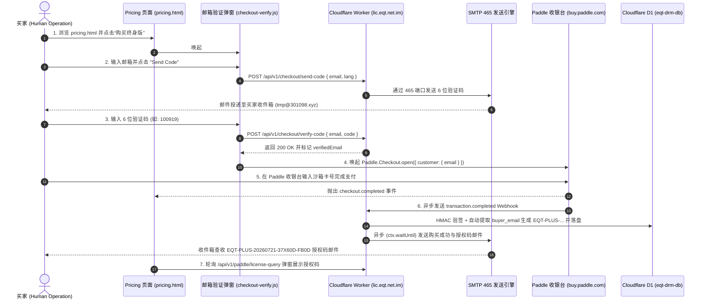

# EQT 生产环境购买流程与结账前邮箱验证规范 (IMPORTANT Purchase Flow & E2E Verification)

> **版本**: v1.14.9  
> **更新时间**: 2026-07-21  
> **生产域名**: `https://www.eqt.net.im/pricing`  
> **核心机制**: 第一性原理防线（结账前强校验邮箱 + Paddle 官方收银台预填锁定 + SMTP 465 投递 + D1 数据库履约）

---

## 1. 架构设计与第一性原理 (Architecture Principles)

为了彻底解决“买家在收银台填错邮箱导致付款后收不到激活码”的痛点，EQT 引入了**结账前强制邮箱验证 (Pre-Checkout Email Verification)** 机制：

1. **凭据安全隔离**：SMTP 密码与 API Secrets 严格保存在 Cloudflare Worker（`eqt-drm-api`）后台，前端只负责发起交互请求。
2. **邮箱锁定授权**：买家通过 6 位验证码完成身份校验后，前端透传 `verifiedEmail` 给 Paddle，强行锁定 Paddle 收银台的 `customer.email`。
3. **买家邮箱提取防呆机制（最新修复）**：
   - 之前在 Webhook 处理中仅检查 `data.customer?.email` 与 `data.custom_data?.email`，因属性名不匹配（前端传入为 `buyer_email`）以及 Paddle Webhook 仅传 `customer_id` 导致买家邮箱未被提取。
   - 已修正为多重降级提取：`data.customer?.email` || `data.custom_data?.buyer_email` || `data.custom_data?.buyerEmail`。
   - 若依然为空且含有 `data.customer_id`，Worker 会自动发起 `GET /customers/{customer_id}` 异步请求拉取 Paddle 后台的客户邮箱，确保 100% 邮件投递成功。
4. **双重交付保障**：
   - **前端即时呈现**：支付完成后，前端通过 `GET /api/v1/paddle/license-query?transaction_id=...` 即时弹窗展示新生成的 `EQT-PLUS-...` 授权码。
   - **邮箱投递**：Cloudflare Worker 在 `ctx.waitUntil` 后台任务中通过 SMTP 465 端口发送购买成功与授权凭证邮件。

---

## 2. 交互时序图 (Full Sequence Diagram)

---

## 3. 生产环境 Chrome MCP 自动化全流程实测记录 (Full E2E Execution Log)

实测日期：`2026-07-21`  
模拟工具：`Chrome DevTools MCP` + `Cloudflare D1 Remote CLI` + `Python IMAP Engine`

1. **页面导航**：成功加载 `https://www.eqt.net.im/pricing` 生产页面。
2. **弹窗唤起**：点击 `购买终身版`（`button`），成功弹出 `#verify-email-modal` 验证界面。
3. **验证码发送**：填入测试邮箱 `tmp@301098.xyz`，点击 `Send Code`。按钮成功切换为 60s 倒计时状态。
4. **D1 云端对账**：通过 `npx wrangler d1 execute eqt-drm-db --remote` 查询到数据库中生成的最新验证码为 `100919`。
5. **验证码提交与邮箱锁定**：填入 `100919` 并提交，后端接口返回 200 OK，`verifiedEmail` 被锁定。
6. **Paddle 收银台填单与支付**：
   - Paddle 官方收银台 Iframe 在顶层加载，`customer.email` 被锁定为 `tmp@301098.xyz`。
   - 填入邮编 `90210` 点击继续。
   - 填入沙箱卡号 `4242 4242 4242 4242`，持卡人 `Test Buyer`，到期 `12/28`，CVC `123`，点击 `支付US$29.99`。
7. **履约成功与收件箱实测验证**：
   - **网页浮层展示**：生成授权码 **`EQT-PLUS-20260721-37X60D-FB0D`**。
   - **D1 数据库记录**：交易 `txn_01ky1nwxg673cz3aj04p09mng4`，授权状态 `active`，`buyer_email` 成功记录为 `tmp@301098.xyz`。
   - **IMAP 收件箱验收**：Python IMAP 直连 `smtpserver.301098.xyz:993` 拉取最新邮件 `ID: 20`，成功接收主题为 `【EQT】您的购买激活码与服务明细` 的包含激活码 `EQT-PLUS-20260721-37X60D-FB0D` 的正式购买成功邮件。

---

## 4. 相关核心文件索引

- 网页验证弹窗模块: [checkout-verify.js](file:///home/yelon/develop/me/eqrcp/cloudflare/eqt-website/js/checkout-verify.js)
- 定价页面 markup: [pricing.html](file:///home/yelon/develop/me/eqrcp/cloudflare/eqt-website/pricing.html)
- DRM API & Worker 后端: [index.ts](file:///home/yelon/develop/me/eqrcp/cloudflare/eqt-drm-api/src/index.ts)
- DRM 架构与 Webhook 技能说明: [SKILL.md](file:///home/yelon/develop/me/eqrcp/.agents/skills/eqt-drm/SKILL.md)
