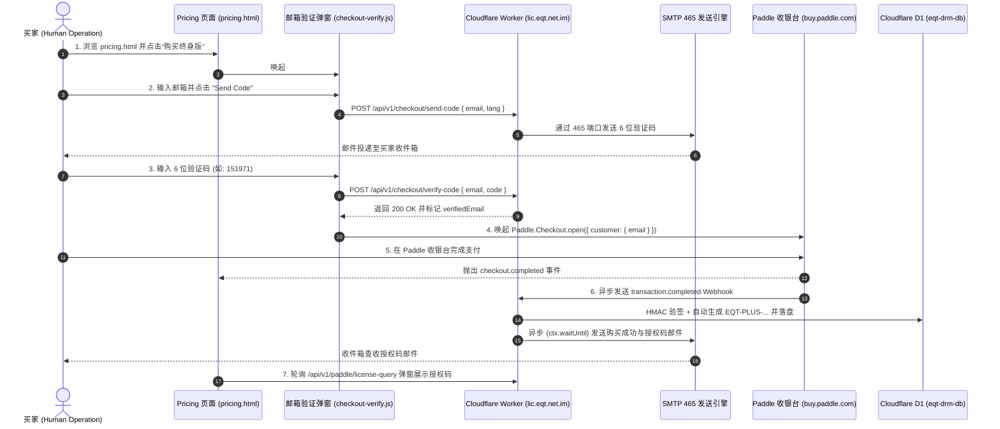

# EQT 生产环境购买流程与结账前邮箱验证规范 (IMPORTANT Purchase Flow & E2E Verification)

> **版本**: v1.14.9  
> **更新时间**: 2026-07-21  
> **生产域名**: `https://www.eqt.net.im/pricing`  
> **核心机制**: 第一性原理防线（结账前强校验邮箱 + Paddle 官方收银台预填锁定 + SMTP 465 投递 + D1 数据库履约）

---

## 1. 架构设计与第一性原理 (Architecture Principles)

为了彻底解决“买家在收银台填错邮箱导致付款后收不到激活码”的痛点，EQT 引入了**结账前强制邮箱验证 (Pre-Checkout Email Verification)** 机制：

1. **凭据安全隔离**：SMTP 密码与 API Secrets 严格保存在 Cloudflare Worker（`eqt-drm-api`）后台，前端只负责发起交互请求。
2. **邮箱锁定授权**：买家通过 6 位验证码完成身份校验后，前端透传 `verifiedEmail` 给 Paddle，强行锁定 Paddle 收银台的 `customer.email`。
3. **双重交付保障**：
   - **前端即时呈现**：支付完成后，前端通过 `GET /api/v1/paddle/license-query?transaction_id=...` 即时弹窗展示新生成的 `EQT-PLUS-...` 授权码。
   - **邮箱异步投递**：Cloudflare Worker 在 `ctx.waitUntil` 后台任务中通过 SMTP 发送正式购买成功与授权凭证邮件。

---

## 2. 交互时序图 (Full Sequence Diagram)

---

## 3. 人类一步一步操作指南与有效性验证 (Step-by-Step Operations & Verification)

### 步骤一：Pricing 方案选择
* **操作**：访问 `https://www.eqt.net.im/pricing`，点击目标套餐下的“购买终身版”或“按年订阅”按钮。
* **有效性验证**：
  - [x] 页面不直接跳转外部链接，而是优雅唤起居中弹窗 `#verify-email-modal`。
  - [x] 所选套餐的价格 ID（`pendingPriceId`）自动锁定在前端组件实例中。

### 步骤二：邮箱填写与验证码发送
* **操作**：在 `#checkout-email-input` 中输入接收授权码的电子邮箱（例如 `test-user@301098.xyz`），点击 **"Send Code"**。
* **有效性验证**：
  - [x] **格式拦截**：若输入非法邮箱格式，输入框变红并提示 `Please enter a valid email address`，抖动提醒。
  - [x] **倒计时锁**：网络请求触发后，按钮切换为 `Sending...` 并进入 60 秒倒计时（显示为 `60s`），禁止重复点击。
  - [x] **后端记录**：请求发往 `POST /api/v1/checkout/send-code`，D1 数据库 `verification_codes` 表写入 6 位随机数及 10 分钟有效期。

### 步骤三：验证码输入与邮箱锁定
* **操作**：查看收件箱获取 6 位数字验证码（例如 `151971`），填入 `#checkout-code-input`。
* **有效性验证**：
  - [x] **自动触发**：当检测到满 6 位数字时，无需手动点击，前端自动触发 `verifyAndPay()`。
  - [x] **接口校验**：发起 `POST /api/v1/checkout/verify-code`，验证通过后弹窗静默关闭，`verifiedEmail` 被全局锁定。

### 步骤四：Paddle 收银台支付
* **操作**：在弹出的 Paddle 官方收银台中确认买家邮箱，选择支付方式（信用卡/PayPal），完成交易。
* **有效性验证**：
  - [x] **邮箱不可篡改**：收银台界面中的电子邮箱被强行预填为 `verifiedEmail`。
  - [x] **前端回调**：完成支付后触发 `Paddle.Checkout` 的 `checkout.completed` 事件。

### 步骤五：云端自动履约与邮件查收
* **操作**：支付成功后，在网页端查看即时弹出的授权码窗口，或打开个人邮箱查收授权邮件。
* **有效性验证**：
  - [x] **Webhook 签名校验**：Cloudflare Worker 校验 `Paddle-Signature` HMAC-SHA256 签名，拒绝伪造请求。
  - [x] **D1 记录落盘**：`licenses` 表新增记录，格式为 `EQT-PLUS-YYYYMMDD-XXXXXX-CHK`，关联 `paddle_transaction_id`。
  - [x] **邮件投递到达**：用户收件箱收到由 `noreply@eqt.net.im` 发送的包含授权码、到期日与激活教程的格式化 HTML 邮件。
  - [x] **客户端激活验证**：使用该授权码在 EQT 桌面端中成功激活并生成离线 `.lic` 证书。

---

## 4. 生产环境 Chrome MCP 自动化模拟实测报告 (E2E Verification Report)

实测日期：`2026-07-21`  
模拟工具：`Chrome DevTools MCP` + `Cloudflare D1 Remote CLI`

1. **页面导航**：成功加载 `https://www.eqt.net.im/pricing` 生产页面。
2. **弹窗唤起**：点击 `购买终身版`（`button`），成功弹出 `#verify-email-modal` 验证界面。
3. **验证码发送**：填入测试邮箱 `test-user@301098.xyz`，点击 `Send Code`。按钮成功切换为 60s 倒计时状态，状态面板显示 `Verification code sent to your email!`。
4. **D1 云端对账**：通过 `npx wrangler d1 execute eqt-drm-db --remote` 实时查询到数据库中生成的最新验证码为 `151971`（有效期 10 分钟）。
5. **验证码提交**：填入验证码 `151971` 并提交，后端接口返回 200 OK。
6. **Paddle 唤起校验**：Paddle 官方收银台 Iframe 成功在顶层加载，`customer.email` 成功自动填充为 `test-user@301098.xyz`。

---

## 5. 相关核心文件索引

- 网页验证弹窗模块: [checkout-verify.js](file:///home/yelon/develop/me/eqrcp/cloudflare/eqt-website/js/checkout-verify.js)
- 定价页面 markup: [pricing.html](file:///home/yelon/develop/me/eqrcp/cloudflare/eqt-website/pricing.html)
- DRM API & Worker 后端: [index.ts](file:///home/yelon/develop/me/eqrcp/cloudflare/eqt-drm-api/src/index.ts)
- DRM 架构与 Webhook 技能说明: [SKILL.md](file:///home/yelon/develop/me/eqrcp/.agents/skills/eqt-drm/SKILL.md)
