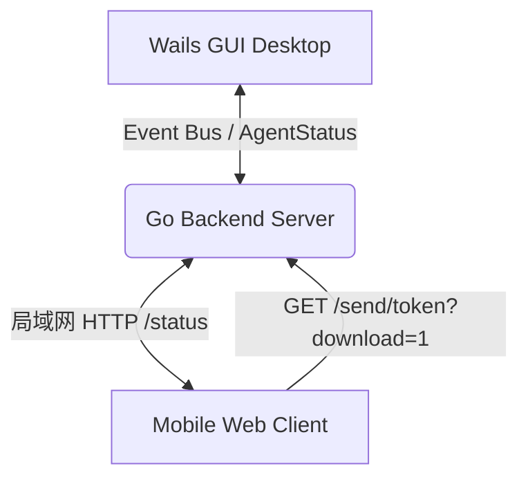

# EQT 共享传输 (Share Mode) 架构与工程机制指南

本文件详细阐述了 EQT 共享传输（Share 模式）的整体架构、底层网络传输协议、状态同步、移动端与桌面端 GUI 交互策略，以及 DRM 免费版约束（Free Tier Limit）的检测逻辑。

---

## 1. 架构概览与多端协同

Share 模式采用三端协同 of 异步网络架构：
- **Go 后端核心 (HTTP Server)**：基于底层 HTTP 协议，负责启动局域网 Web 服务器，挂载待共享的文件/文件夹，提供分片下载，并通过 `/status` API 向客户端暴露实时下载进度。
- **移动端 Web 前端**：用户通过手机扫码加载该响应式 HSL 界面。支持多文件一键依次触发下载，并通过向 `/status` 发起长轮询实时拉取已完成下载项以变色高亮。
- **Wails 桌面 GUI**：桌面客户端调用 Wails 运行时（Runtime）与 Go 后端通过事件总线进行通信（发布 `agent-status` 状态数据），负责本地文件选择、拖拽放置和会话拦截控制。

---

## 2. 传输保障与并发字节计数机制

传统的 qrcp 方案容易受到网络传输抖动和移动浏览器“后台预载”行为的影响。EQT 通过以下底层网络保障确保了传输字节的物理精确度：

### 2.1 HTTP Range 分片支持与精确并发计数
- 后端服务内置 `downloadedBytes map[int]int64` 内存结构体，使用互斥锁（`sync.RWMutex`）进行并发安全保护。
- 拦截并解析 HTTP `Range` 请求，保证对并发分片拉取的数据进行累加统计，只有当 `itemWritten >= expectedBytes`（即累计写入字节数达到或超过文件实际物理大小）时，才判定该文件下载成功。

### 2.2 首包入站检测清零 (防抖重置)
- 当收到 `Range` 头部从 `0` 开始的请求（或不带 `Range` 的初次完整 GET 请求）时，说明用户在手机端重新触发了下载或重试。
- 后端立即将该文件对应的 `downloadedBytes[idx]` 计数重置归零，防止由于用户手抖中途取消后重新下载时发生字节的持续累加，从而引发提前打勾误判。

### 2.3 Socket 写入异常检测 (连接归零)
- 自定义 `progressWriter` 结构体，捕获物理网络写入过程中产生的任何异常错误（例如手机端浏览器弹出系统下载确认框时，用户点击了“取消”从而导致 TCP Socket 被意外 RST/断开）。
- 一旦 `progressWriter.err != nil`，后端立即触发清零，撤销该连接在本次传输中已累积写入的字节数，实现网络物理层面的完美防抖。

---

## 3. 手机端 Web 前端交互规范

### 3.1 随机主题色 HSL 算法 (复用 Chat 模式)
- 每次启动共享任务时，手机端会根据当前会话的 URL 随机 Token 计算出哈希值作为种子（`seed`）。
- 调用 `seededUnit` 种子因子推导、`hslToHex` 转换与 `generateSenderColor` 算法，为当前会话生成独一无二的随机主题色彩。
- **视觉优化**：为了避免多色混杂产生视觉疲劳，该随机色**仅应用到右上角**的授权徽章（`license-badge`）背景上。页面背景、大按钮及传输高亮依然保留稳定统一的松石绿（`#156f5a`）默认色。

### 3.2 待传输项变色高亮 (移除对勾)
- 彻底移除了文件行右侧渲染的向下箭头字符 `↓` 以及成功后的对勾符号 `✓`。
- **高亮变色**：当文件项开始传输或后端证实传输成功时，给该行加上 `.transferred` 样式类。该行整行背景会转变成淡雅的松石绿（`rgba(21,111,90, 0.08)`），文件名与大小文字变成沉稳的松石绿深色（`var(--accent-strong)`），用温和的整行变色来代替强硬的对勾。

### 3.3 按钮隐藏时机与完工静止状态
- **中途操作保持**：在传输进行中，全部下载（ZIP）、全部下载（体验）及停止共享等操作按钮在点击时**绝不提前消失**，保留了用户中途补下或取消重试的控制权。
- **完工一并隐去**：只有当所有文件确认传输完毕、进入最终状态页面（`showCompletedUI`）后，所有按钮才会彻底隐藏。
- **完工静止状态**：在进入 `showCompletedUI` 成功页后，列表项的 `onclick` 事件会被彻底解绑，指针恢复为 `default`，变为单纯的传输报告静态页面，不允许重复响应。

---

## 4. 桌面 GUI 待传输列表与超限防护

### 4.1 待传输列表格式化
- 屏蔽了冗长的绝对路径展示，界面仅呈现去路径的文件名。
- 调用 Wails 后端 API 获取文件大小（包括递归计算整个目录的大小之和），将文件友好大小（如 `1.2 MB`）优雅贴合展示在移除按钮 `x` 的左侧。

### 4.2 实时 Quota Tier 约束超限检测 (DRM 机制)
- 前端在添加/移出文件路径时，立即触发异步限额检测。
- **检测入口**：调用 Wails API `ValidateFreeTier(paths)`。如果当前未付费且免费次数超限（`usedTransfers >= 5`），则对当前路径列表进行文件个数（不能超过 5 个）和单文件大小（最大 50MB）的约束校验。
- **警报展示**：如果未通过约束校验，会在 GUI 端拖拽虚线框（`.dropzone`）和下方传输列表（`.path-list`）之间**立刻插入一栏带感叹号的红色 ⚠️ 警告框**，并同步**锁死并禁用“开始分享”按钮**，从根源上拦截超限操作的发布。

---

## 5. 自动停机机制优化 (KeepAlive)

- **移除 waitgroup 关停机制**：彻底移除了原版中由页面首次渲染完成后自动开启 15 秒优雅关机的缺陷逻辑。
- **安全保障**：现在在多文件发送模式下，用户扫码后即使过了很久再操作下载，服务器也会一直在线待命。只有当检测到所有文件已被物理下载完毕（或用户在双端主动点击 Stop 按钮）时，服务器才会执行优雅停机退出。
