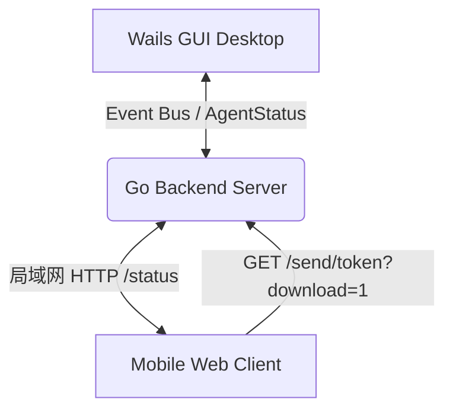

# EQT 共享传输 (Share Mode) 架构与工程机制指南

本文件详细阐述了 EQT 共享传输（Share 模式）的整体架构、底层网络传输协议、状态同步、移动端与桌面端 GUI 交互策略，以及 DRM 免费版约束（Free Tier Limit）的检测逻辑。

---

## 1. 架构概览与多端协同

Share 模式采用三端协同 of 异步网络架构：
- **Go 后端核心 (HTTP Server)**：基于底层 HTTP 协议，负责启动局域网 Web 服务器，挂载待共享的文件/文件夹，提供分片下载，并通过 `/status` API 向客户端暴露实时下载进度。
- **移动端 Web 前端**：用户通过手机扫码加载该响应式 HSL 界面。支持多文件一键依次触发下载，并通过向 `/status` 发起长轮询实时拉取已完成下载项以变色高亮。
- **Wails 桌面 GUI**：桌面客户端调用 Wails 运行时（Runtime）与 Go 后端通过事件总线进行通信（发布 `agent-status` 状态数据），负责本地文件选择、拖拽放置和会话拦截控制。

---

## 2. 传输保障与并发字节计数机制

传统的 qrcp 方案容易受到网络传输抖动和移动浏览器“后台预载”行为的影响。EQT 通过以下底层网络保障确保了传输字节的物理精确度：

### 2.1 HTTP Range 分片支持与精确并发计数
- 后端服务内置 `downloadedBytes map[int]int64` 内存结构体，使用互斥锁（`sync.RWMutex`）进行并发安全保护。
- 拦截并解析 HTTP `Range` 请求，保证对并发分片拉取的数据进行累加统计，只有当 `itemWritten >= expectedBytes`（即累计写入字节数达到或超过文件实际物理大小）时，才判定该文件下载成功。

### 2.2 首包入站检测清零 (防抖重置)
- 当收到 `Range` 头部从 `0` 开始的请求（或不带 `Range` 的初次完整 GET 请求）时，说明用户在手机端重新触发了下载或重试。
- 后端立即将该文件对应的 `downloadedBytes[idx]` 计数重置归零，防止由于用户手抖中途取消后重新下载时发生字节的持续累加，从而引发提前打勾误判。

### 2.3 Socket 写入异常检测 (连接归零)
- 自定义 `progressWriter` 结构体，捕获物理网络写入过程中产生的任何异常错误（例如手机端浏览器弹出系统下载确认框时，用户点击了“取消”从而导致 TCP Socket 被意外 RST/断开）。
- 一旦 `progressWriter.err != nil`，后端立即触发清零，撤销该连接在本次传输中已累积写入的字节数，实现网络物理层面的完美防抖。

---

## 3. 手机端 Web 前端交互规范

### 3.1 随机主题色 HSL 算法 (复用 Chat 模式)
- 每次启动共享任务时，手机端会根据当前会话的 URL 随机 Token 计算出哈希值作为种子（`seed`）。
- 调用 `seededUnit` 种子因子推导、`hslToHex` 转换与 `generateSenderColor` 算法，为当前会话生成独一无二的随机主题色彩。
- **视觉优化**：为了避免多色混杂产生视觉疲劳，该随机色**仅应用到右上角**的授权徽章（`license-badge`）背景上。页面背景、大按钮及传输高亮依然保留稳定统一的松石绿（`#156f5a`）默认色。

### 3.2 待传输项变色高亮 (移除对勾)
- 彻底移除了文件行右侧渲染的向下箭头字符 `↓` 以及成功后的对勾符号 `✓`。
- **高亮变色**：当文件项开始传输或后端证实传输成功时，给该行加上 `.transferred` 样式类。该行整行背景会转变成淡雅的松石绿（`rgba(21,111,90, 0.08)`），文件名与大小文字变成沉稳的松石绿深色（`var(--accent-strong)`），用温和的整行变色来代替强硬的对勾。

### 3.3 按钮隐藏时机与完工静止状态
- **中途操作保持**：在传输进行中，全部下载（ZIP）、全部下载（体验）及停止共享等操作按钮在点击时**绝不提前消失**，保留了用户中途补下或取消重试的控制权。
- **完工一并隐去**：只有当所有文件确认传输完毕、进入最终状态页面（`showCompletedUI`）后，所有按钮才会彻底隐藏。
- **完工静止状态**：在进入 `showCompletedUI` 成功页后，列表项的 `onclick` 事件会被彻底解绑，指针恢复为 `default`，变为单纯的传输报告静态页面，不允许重复响应。

---

## 4. 桌面 GUI 待传输列表与超限防护

### 4.1 待传输列表格式化
- 屏蔽了冗长的绝对路径展示，界面仅呈现去路径的文件名。
- 调用 Wails 后端 API 获取文件大小（包括递归计算整个目录的大小之和），将文件友好大小（如 `1.2 MB`）优雅贴合展示在移除按钮 `x` 的左侧。

### 4.2 实时 Quota Tier 约束超限检测 (DRM 机制)
- 前端在添加/移出文件路径时，立即触发异步限额检测。
- **检测入口**：调用 Wails API `ValidateFreeTier(paths)`。如果当前未付费且免费次数超限（`usedTransfers >= 5`），则对当前路径列表进行文件个数（不能超过 5 个）和单文件大小（最大 50MB）的约束校验。
- **警报展示**：如果未通过约束校验，会在 GUI 端拖拽虚线框（`.dropzone`）和下方传输列表（`.path-list`）之间**立刻插入一栏带感叹号的红色 ⚠️ 警告框**，并同步**锁死并禁用“开始分享”按钮**，从根源上拦截超限操作的发布。

---

## 5. 自动停机机制优化 (KeepAlive)

- **移除 waitgroup 关停机制**：彻底移除了原版中由页面首次渲染完成后自动开启 15 秒优雅关机的缺陷逻辑。
- **安全保障**：现在在多文件发送模式下，用户扫码后即使过了很久再操作下载，服务器也会一直在线待命。只有当检测到所有文件已被物理下载完毕（或用户在双端主动点击 Stop 按钮）时，服务器才会执行优雅停机退出。

---

## 6. 多客户端动态限制与无缝回暖 (Device Limits & Live Recovery)

为了保障商业版特权并为免费版提供平滑的用户体验，Share 模式对并发设备数实施了动态拦截与心跳驱动的无缝回暖设计：

### 6.1 活跃客户端心跳追踪 (Active Client Tracking)
- 移动端扫码载入详情页时，使用 Cookie/LocalStorage 里的 `eqt_client_id` 作为唯一标识与后端 `/status` 轮询心跳对齐。
- 后端在内存中维护 8 秒活跃心跳设备列表，以此作为“开始分享”旁“设备数”计数的真实统计数据，取代不稳定的物理下载数。

### 6.2 每日首任特权与设备数上限 (Daily Limit Exemption)
- **每日首任免检**：当天首个发起的传输任务标记为首任特权，允许无限多台设备接入下载。
- **次任限制**：当日后续的非首次传输任务，同一时间仅允许最大 `2` 台活跃设备连接。超出限额的第 3 台及以上设备将被判定为“超限设备”。

### 6.3 超限就地拦截与无缝解锁 (In-place Block & Auto Restore)
- **无感就地警告 (In-place Warn)**：超限设备心跳接口状态返回 `limit_exceeded`。前端捕捉此状态，但不做物理页面重定向，而是直接调用 `showLimitExceededUI()` 将当前页面原地变为超限警告视图（状态图标转为 ⚠️，隐藏常规下载按钮并动态插入“升级许可证”跳转，同时给文件列表加上 `pointer-events: none` 和半透明灰色以防范物理下载）。
- **动态回暖恢复 (Live Unlocking)**：因为超限设备的心跳并没有因超限而停止，一旦原本占领额度的前两台设备中任意一台关闭页面 8 秒（心跳过期）或点击“停止”释放了额度，超限设备在 1.2 秒的下一次状态轮询中便会恢复为正常等待状态。前端自动触发 `restoreNormalUI()` 将界面无缝还原回可下载状态，无需用户进行 any 刷新或二次扫码。
- **双重阻断 (Double Interception)**：即使超限设备绕过轮询直接以物理 HTTP 链接请求分片下载，后端也会直接切断传输并抛出 `403 Forbidden` 异常。

---

## 7. 局域网 Receive/Share 模式多设备单向传输特点分析

EQT 基于局域网的点对点文件分发与接收支持多设备的同时接入。这两个模式虽然均为单向流，但在多设备并发时具有不同的架构特点：

### 7.1 Share 模式 (单源多流分发)
- **传输方向**：单个源端 (GUI 桌面端) &rarr; 多个目标端 (各个移动端浏览器)。
- **并发分发机制**：
  - 后端 Go HTTP 服务器对每个连入的移动设备分发独立的处理协程（goroutine）和 Socket 连接。
  - 各移动端设备相互独立地进行拉取，其下载进度、网络抖动互不干扰。
- **多客户端生命周期协同**：
  - **自动停机防早退**：当 GUI 开启 `autoStop` 时，服务端不能因某一个设备下载完成就立即关闭。必须等所有已登记的活跃客户端（心跳未过期）全部下载完成（或者手动停止）后，方可触发优雅关机程序。

### 7.2 Receive 模式 (多源汇聚写入)
- **传输方向**：多个源端 (各个移动端浏览器) &rarr; 单个目标端 (GUI 桌面端)。
- **写瓶颈与隔离**：
  - 各个移动端设备并发向服务端上传文件，数据最终汇聚写入到桌面端物理磁盘的同一接收目录下。
  - 后端为防止同名文件冲突，内置了 `createUniqueFile` 重命名安全机制。
- **界面设备分组呈现**：
  - GUI 界面按照设备 (clientID) 进行结构化分组渲染，确保不同手机上传的进度条与文件归属清晰可查，不发生乱序或覆盖。
- **自动停机判定**：
  - 同样遵循多设备防早退原则，当所有发起上传连接的活跃客户端全部进入最终状态（`completed`/`failed`）且不活跃时，才触发关机。

---

## 8. 传输并发控制设计 (串行上传 vs 并发下载)

基于移动浏览器网络沙箱与硬件资源限制的**第一性原理 (First Principle)**，EQT 对上传与下载实施了不同的并发控制策略：

### 8.1 移动端 -> GUI (并发上传度为 1)
- **机制**：无论是 Receive 模式下的多文件上传，还是 Chat v2 模式下的附件发送，移动端一侧均采用**严格的串行排队队列** (并发度为 1)。
- **合理性**：
  - **规避 Wi-Fi 信道竞争**：局域网中并发上传多个大文件会导致 TCP 拥塞控制被高频触发，反而拉低整体吞吐。串行上传可以单通道吃满带宽。
  - **保障移动浏览器存活**：防止并发读取大文件导致手机浏览器出现 OOM (内存溢出) 崩溃或卡死。
  - **平滑进度同步**：使 WebSocket 的进度反馈包单条顺序流转，避免高频并发状态刷新导致前台 UI 渲染发生失焦卡顿。

### 8.2 GUI -> 移动端 (多设备并发)
- **机制**：
  - **多客户端并发拉取**：多台设备可以完全独立、并发地下载 GUI 端分享的文件，吃满局域网最大吞吐。
  - **单设备打包防阻断**：由于移动端浏览器严密限制多文件并发触发下载（会被 Safari/微信直接拦截或弹窗阻断），EQT 提供了 `全部下载 (ZIP)` 机制，通过将多文件在后端内存中打包，以单一 HTTP 通道完成整包下载，提升用户体验。
