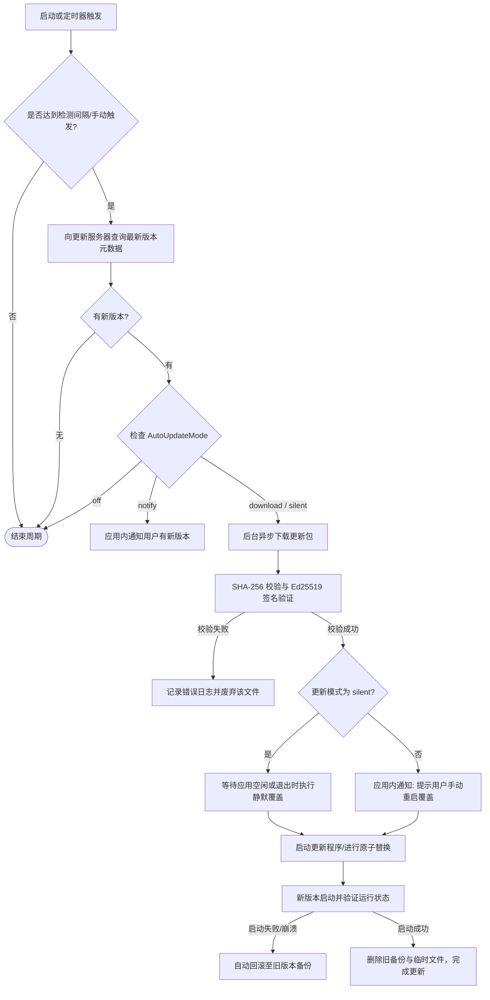

# EQT 自动更新机制与设置设计方案 (Auto-Update Mechanism Design)

本文档阐述了 EQT (包括 Wails 桌面客户端与 CLI 应用) 的自动更新机制。更新机制的整体架构遵循**安全第一、原子替换、非阻塞体验与平台差异化适配**的第一性原理进行设计。

---

## 1. 自动更新设置项设计 (Settings Schema)

为了让用户能完全控制客户端的更新行为，在配置管理系统 (基于 [settings.go](file:///home/yelon/develop/me/eqrcp/config/settings.go)) 与前端设置页面中加入如下配置项。

### 1.1 字段定义

在 `DesktopSettings` 结构体中扩展以下字段：

```go
type DesktopSettings struct {
	// ... 现有字段 ...

	// AutoUpdateMode 控制自动更新的行为模式
	// 可选值: "off" | "notify" | "download" | "silent"
	// 默认值: "download"
	AutoUpdateMode string `json:"autoUpdateMode"`

	// UpdateChannel 更新通道
	// 可选值: "stable" (稳定版) | "beta" (测试版) | "nightly" (开发预览版)
	// 默认值: "stable"
	UpdateChannel string `json:"updateChannel"`

	// LastUpdateCheckTime 上一次执行更新检测的时间戳 (Unix 时间戳，秒)
	// 用于限制频繁的 API 轮询请求，默认 0
	LastUpdateCheckTime int64 `json:"lastUpdateCheckTime"`

	// UpdateCheckIntervalHours 检查更新的时间间隔 (小时)
	// 默认值: 24 (每日检测一次)
	UpdateCheckIntervalHours int `json:"updateCheckIntervalHours"`
}
```

### 1.2 行为模式详解 (AutoUpdateMode)

| 模式 | 描述 | 适用场景 |
| :--- | :--- | :--- |
| `off` | **关闭自动更新**。客户端不会在后台执行任何更新检测，仅在用户于设置界面点击“手动检查更新”时触发。 | 追求极度稳定、受控网络环境的用户。 |
| `notify` | **仅通知**。后台定期检测到新版本后，仅通过应用内通知提醒用户有新版本可用，不自动下载，由用户手动确认后触发下载。 | 流量计费网络、需要了解更新详情再做决定的用户。 |
| `download` <br>(**默认**) | **后台下载并通知重启**。后台检测到新版本时，自动在空闲时间下载更新包。下载完毕后，通过应用内通知提示用户“新版本已就绪，请重启应用以应用更新”。 | 多数普通用户，平衡了“自动无感下载”和“重启掌控权”。 |
| `silent` | **静默安装**。后台检测并自动下载新版本。当应用处于空闲状态（无传输任务）或在用户关闭应用时，静默替换文件，并在下次启动时无缝呈现新版本。 | 追求完全无感自动升级的用户。 |

---

## 2. 自动更新生命周期与核心机制 (Update Lifecycle)

整个更新流程是一个高可用的状态机，分为以下六个阶段：



### 2.1 探测阶段 (Polling & Fetching)
- **触发时机**：应用启动时，以及启动后每隔 `UpdateCheckIntervalHours`（默认 24 小时）在后台启动一个 goroutine 执行检测。
- **检测协议**：向更新接口（自建 CF Worker 分发端或 GitHub API）发送 GET 请求：
  ```
  GET /api/v1/update/check?version=v1.2.0&platform=windows&arch=amd64&channel=stable
  ```
- **返回元数据 (JSON Schema)**：
  ```json
  {
    "version": "v1.3.0",
    "changelog": "1. 优化了大文件局域网传输速度;\n2. 修复了 Windows 平台下托盘图标显示异常问题。",
    "published_at": "2026-06-20T12:00:00Z",
    "download_url": "https://releases.eqt.dev/v1.3.0/eqt-windows-amd64.zip",
    "sha256": "8f3c7a...7a3f",
    "signature": "30450220...82e3c7",
    "force_upgrade": false
  }
  ```

### 2.2 下载阶段 (Asynchronous Downloading)
- **并发与限速**：下载任务在独立的低优先级 goroutine 中执行，确保不抢占用户进行文件分享或聊天的局域网带宽。
- **断点续传**：下载器支持 HTTP `Range` 请求，如果遇到网络波动异常中断，在重试时会从已下载的字节处继续下载，避免重复消耗流量。
- **状态通知**：如果是 `download` 模式，前端设置界面应展示“正在后台下载新版本...”的进度条，但不可弹窗干扰用户的日常使用。

### 2.3 安全校验阶段 (Cryptographic Verification) — 关键防御
由于更新机制具有执行本地二进制代码的最高权限，极易成为黑客攻击的目标。必须通过以下三重手段进行安全防御：
1. **防降级攻击 (Anti-Downgrade)**：客户端必须校验元数据中的新版本号是否语义化大于（`>`）当前版本。拒绝执行任何等于或低于当前版本的“更新”请求，防止中间人通过重放旧版本元数据利用已知的旧版本漏洞。
2. **SHA-256 完整性校验**：下载完成后，计算本地临时文件的 SHA-256 哈希值，与元数据中的 `sha256` 字段比对，确保文件在传输中未损坏。
3. **Ed25519 非对称秘钥验签 (Cryptographic Signatures)**：
   - 客户端内置公钥（可复用授权校验中使用的 Ed25519 公钥，或单独使用一个更新公钥）。
   - 服务端发布的每个更新包都必须使用配套的离线私钥对其哈希进行数字签名，并在元数据中提供 `signature`。
   - 客户端使用内置公钥对 `signature` 进行验签。**只有验签通过的包才会被允许执行**，即使 HTTPS 证书被劫持或 CDN 节点文件被篡改，黑客也无法伪造合法签名的可执行文件。

### 2.4 文件覆盖阶段 (Platform-Specific Replacement)
替换正在运行的可执行文件存在平台差异，需要针对性设计：

#### 2.4.1 Windows 平台 (正在运行的可执行文件被锁定)
在 Windows 下，操作系统会锁定处于运行状态的 `.exe` 文件，直接写入会触发 `Access Denied` 错误。

- **方案 A（重命名暂存法）**：
  Windows 允许重命名正在运行的可执行文件。
  1. 将正在运行的 `eqt-desktop.exe` 重命名为 `eqt-desktop.exe.old`。
  2. 将新下载解压好的 `eqt-desktop.exe` 写入原路径。
  3. 当用户确认重启或下次启动时，拉起新版本的 `eqt-desktop.exe`。
  4. 新版本 `eqt-desktop.exe` 启动后，在后台异步删除 `eqt-desktop.exe.old` 文件。
  
- **方案 B（启动器代理更新法 - 推荐）**：
  由于 EQT 拥有辅助进程 `eqt-launcher.exe`（用于管理后台服务和快捷启动）：
  1. `eqt-desktop.exe` 下载并验证更新包完毕后，写入临时目录。
  2. 向 `eqt-launcher.exe` 发送更新指令，并退出 `eqt-desktop.exe`。
  3. `eqt-launcher.exe` 检测到主进程已退出，将临时目录的新文件覆盖至主程序路径。
  4. 覆盖完成后，`eqt-launcher.exe` 重新拉起 `eqt-desktop.exe`。

#### 2.4.2 Linux 与 macOS 平台 (POSIX 标准)
在 POSIX 系统上，文件的替换要简单很多，但仍需注意权限和原子性：
1. 新二进制文件下载到 `eqt.tmp`。
2. 调用 `os.Chmod(filepath, 0755)` 赋予可执行权限。
3. 使用 `os.Rename("eqt.tmp", "eqt")` 进行原子替换。由于 Unix 系统的 inode 特性，这会瞬间生效，即使原 `eqt` 正在运行也不会报错，已加载到内存的旧进程继续运行，直到重启。

#### 2.4.3 WSL 虚拟机环境适配
- **环境隔离**：在 WSL 中，必须区分当前运行的是 **WSL Linux 内的 CLI 二进制** 还是 **宿主 Windows 系统的桌面端**。
- **策略**：
  - WSL Linux CLI 仅更新其自身的 ELF 格式二进制。
  - 不允许 WSL 内的更新程序去直接修改或覆盖 `/mnt/c/...` 路径下的 Windows 端二进制文件，防止由于跨文件系统写入导致的权限混乱或死锁。所有的跨系统交互应基于 HTTP API 流转。

### 2.5 启动验证与灾难回滚阶段 (Rollback & Clean)
如果更新后的程序存在严重 Bug 导致无法启动，需要保证系统能够自我恢复：
- **心跳机制**：新版本程序启动时，在最初的 10 秒内，必须成功完成初始化并向系统注册“健康状态”。
- **自动回滚**：如果新程序在启动 10 秒内异常崩溃，或者无法正常启动：
  1. 守护进程 (如 `eqt-launcher`) 或旧程序备份逻辑被激活。
  2. 将备份的 `.old` 文件恢复为正式文件名。
  3. 重新拉起旧版本。
  4. 上报更新失败日志，并在 settings 的更新状态中标记“更新失败，已回滚”。
- **清理工作**：如果新版本启动成功且稳定运行超过 10 秒，则彻底删除临时下载文件及 `.old` 备份文件。

---

## 3. 设计注意事项与限制 (Important Considerations)

根据 EQT 项目的特殊性，设计与实现更新机制时需注意以下细节：

### 3.1 遵守非阻塞 UI 与 UX 准则 (UX Notifications)
- **禁止使用 Alert 弹窗**：根据项目的 [eqt-ux 规范](file:///home/yelon/develop/me/eqrcp/.agents/skills/eqt-ux/SKILL.md)，严禁使用阻塞式的浏览器级 `alert()` 弹窗或操作系统的阻塞式 Dialog 来提示用户有更新或更新错误。
- **应用内系统通知 (In-app System Messages)**：
  - 更新检测结果、下载进度、安装成功/失败通知等，均应作为“系统系统消息”优雅地追加到聊天消息列表中，或者在设置页面的“更新栏”静默展示。
  - 例如，在聊天页面底部追加一行特殊的系统气泡：
    > 💡 **系统提示**：EQT 新版本 v1.3.0 已经后台下载就绪。我们将于您空闲时或重启时应用此更新。[立即重启]
- **传输状态互斥**：在 `silent` 模式执行覆盖时，必须检查当前是否存在活跃的传输任务（上传或下载）。**只有在传输队列为空（空闲）时**才允许触发退出与覆盖，避免用户传输大文件时因自动更新导致断连。

### 3.2 局域网离线环境适配
- EQT 经常被用于无公网连接的纯局域网环境（如通过手机热点互传文件）。
- 更新机制必须对“断网/无公网”状态具有鲁棒性：
  - 检测更新失败时，应静默失败（Silent Failure），不向用户抛出任何网络连接报错气泡。
  - 使用指数退避算法（Exponential Backoff）延长下一次检测时间（如从 1 小时、2 小时，逐渐退避到每 24 小时尝试一次），避免离线状态下持续请求导致不必要的 CPU 和日志开销。

### 3.3 激活与授权约束 (License Integrity)
- 更新包的替换过程必须绝对保证用户本地证书（如 `license.lic`，参见 [licensing-architecture.md](file:///home/yelon/develop/me/eqrcp/docs/licensing-architecture.md)）的安全。
- 严禁将更新包解压目录指向存放用户证书的敏感配置目录。更新程序在覆盖二进制时，不能触碰任何用户配置数据文件（如 `chat_usage.json` 或 `.config.yaml`）。

---

## 4. 落地步骤建议 (Implementation Steps)

1. **第一阶段：配置项落地**
   在 `config/settings.go` 中添加上述 4 个字段，并实现默认值解析与回写。
2. **第二阶段：后端更新检测与验签逻辑**
   在 Go 后端实现版本拉取、SHA256 计算与 Ed25519 签名验证逻辑，编写对应的单元测试。
3. **第三阶段：多平台覆盖逻辑与脚本支持**
   完善 Windows 平台下的重命名/启动器更新逻辑，验证 WSL/Linux 环境下的隔离性。
4. **第四阶段：前端 UI 对接**
   在 Wails 前端设置页面添加“自动更新模式”和“更新通道”的单选下拉框，并实现非阻塞的系统消息列表提醒。
