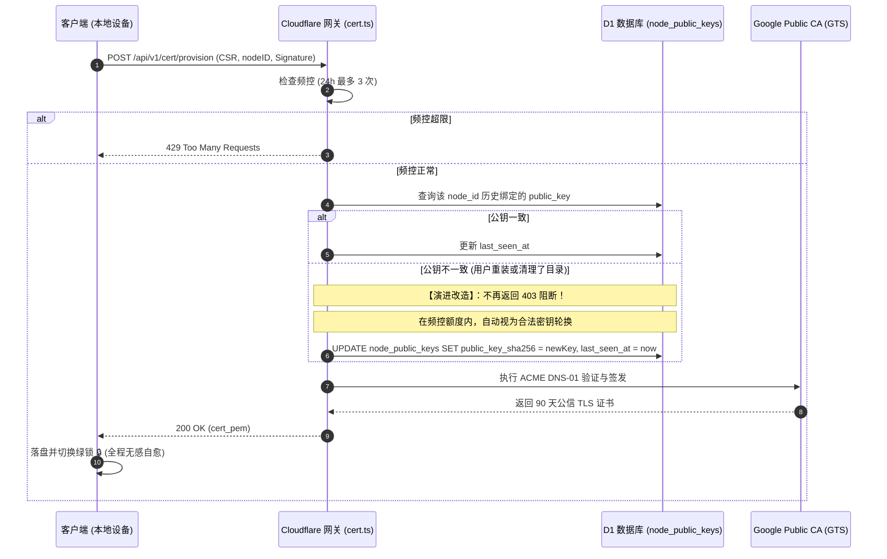

# LAN-TLS 密钥不一致、设备身份标识与私钥泄露威胁模型深度分析

> **文档定位**：针对用户在使用 LAN-TLS 过程中遇到的 `node_key_mismatch`（“本地证书私钥与云端设备登记不一致”）异常、`node_id` 与 About 页面 `device_id` 的关系（联网与脱网差异）、私钥 PEM 文件泄露威胁模型及系统自愈演进策略的技术专题分析。
> **归档日期**：2026-09-12
> **基准版本**：v1.36.103
> **关联模块**：`pkg/server/hardware.go`, `pkg/cert/provisioner.go`, `desktop/gui/app.go`, `cloudflare/eqt-drm-api/src/routes/cert.ts`

---

## 目录
1. [背景与问题定义](#1-背景与问题定义)
2. [Node ID 与 About Device ID 的异同与离线/在线场景深度解构](#2-node-id-与-about-device-id-的异同与离线在线场景深度解构)
3. [PEM 凭据泄露威胁模型与传输安全评估](#3-pem-凭据泄露威胁模型与传输安全评估)
4. [“私钥不一致”死锁根因剖析与用户约束力审视](#4-私钥不一致死锁根因剖析与用户约束力审视)
5. [应对策略与演进建议：从 TOFU 死锁迈向自愈式密钥轮换](#5-应对策略与演进建议从-tofu-死锁迈向自愈式密钥轮换)
6. [离线传输与 Node ID 存在的必要性深度追问](#6-离线传输与-node-id-存在的必要性深度追问)
7. [独立复核意见（2026-09-12 · 基线 v1.36.103）](#7-独立复核意见2026-09-12--基线-v136103)
8. [开发方对审查意见的深度回应与闭环实施决议](#8-开发方对审查意见的深度回应与闭环实施决议)

---

## 1. 背景与问题定义

在 EQT 桌面端使用 LAN-TLS（局域网公信 HTTPS 传输）过程中，用户反馈了以下核心疑问与场景：
1. **现象**：开启 TLS 开关或启动时，界面弹出 Toast 提示：“⚠️ 本地证书私钥与云端设备登记不一致，请重置密钥绑定”。如果用户清空了 `%APPDATA%\eqt` 默认目录下的所有文件，是否会导致该不一致重复出现？
2. **身份标识**：`node_id`（如 `9be192a9efff`）和 About 面板中的 `Device ID` 是一回事吗？它是用于 TLS 域名的吗？二者能否完全统一？如何兼顾离线（无网）与在线场景？
3. **安全关切**：如果攻击者拿到了本地的 PEM 文件（证书与私钥），会产生什么后果？局域网传输是否还能保证安全？
4. **用户约束与处置**：提示对用户有什么实际约束力？为什么不能在不一致时直接下发新证书并自动更新云端记录？

---

## 2. Node ID 与 About Device ID 的异同与离线/在线场景深度解构

在当前 EQT 架构中，存在两个层级的设备身份标识：`GetDeviceNodeID()` 与 `GetAuthorityDeviceID()`。

### 2.1 概念定义与生成机制对比

| 维度 | `node_id` (LAN-TLS 节点标识) | `Device ID` (About 面板展示的权威设备标识) |
| :--- | :--- | :--- |
| **源码定义** | `pkg/server/hardware.go` -> `GetDeviceNodeID()` | `pkg/server/hardware.go` -> `GetAuthorityDeviceID()` |
| **形态规格** | **12 字符** 十六进制（例如：`9be192a9efff`） | **32 字符** 纯十六进制 UUID（例如：`d3d721780dc042beb70ca3dc836edd8e`） |
| **生成源泉** | 纯本地提取硬件特征（主板 UUID、CPU 序列号、硬盘序列号），哈希级联截断：`sha256(uuid:cpu:disk)[:12]` | **云端权威分配**（来自在线激活 `.lic` 凭证，或调用 `/api/v1/device/register` 匿名下发并本地落盘缓存） |
| **核心用途** | **内网 TLS 专属回环子域名**：<br>`*.<node-id>.direct.eqt.net.im`<br>`192-168-1-5.<node-id>.direct.eqt.net.im` | **商业授权与软件治理 (DRM)**：<br>许可证多端激活控制、免费/付费权益鉴权、设备换绑管理 |
| **外网依赖** | **稳态 0% 依赖外网（纯本地离线计算）**<br>*(注：若底层 WMI 耗时超时触发全空回退时，历史实现曾偶发回退至云端 authID，见 §7.2.2 与 §8.2 消除治理)* | **首次生成强依赖外网连接**（无外网且无证书时为空） |

### 2.2 离线与在线场景的决定性差异

这是二者无法直接简单画等号的核心物理原因：

1. **纯离线场景（脱网环境 / 全新初次离线启动）**：
   - 如果用户将软件安装在一台从未连接过互联网的内网机上：
     - `GetAuthorityDeviceID()` 由于无法联系云端激活服务，返回值必定为**空字符串 `""`**（About 面板显示为 `------`）；
     - `GetDeviceNodeID()` 依然能够通过操作系统原生接口读取硬件物理指纹，秒级输出稳定唯一的 `9be192a9efff`。
   - 如果局域网传输的域名强行绑定 `AuthorityDeviceID`，那么在完全脱网的首次启动中，**局域网传输域名将直接无法构造，内网通信彻底瘫痪**。

2. **在线场景（首次联网激活与状态更新）**：
   - 当设备联网后，后台协程调用 `/api/v1/device/register`，云端向其签发了 32 位的 `AuthorityDeviceID`；
   - 假设此时将 `node_id` 强行切换为 `AuthorityDeviceID`（或其前缀）：
     - 那么设备的内网域名就会从 `9be192a9efff.direct.eqt.net.im` 突变成 `d3d721780dc0.direct.eqt.net.im`；
     - 这将导致之前已经建立的全部本地证书缓存、移动端扫码记录、书签历史全部失效！
   - 因此，**`node_id` 必须保持纯本地硬件指纹的独立确定性，绝不能受云端注册状态的波动而发生漂移**。

3. **DNS 规范与二维码体积约束（RFC 1035）**：
   - 依据 RFC 1035，DNS 域名的单个 Label（标签）长度上限为 63 字符；
   - 客户端内网回环 URL 形如：`192-168-100-201.9be192a9efff.direct.eqt.net.im`；
   - `12 字符` 的 `node_id` 提供了 $16^{12} \approx 2.8 \times 10^{14}$ 的海量碰撞隔离空间，同时保持域名短小，大幅精简移动端扫码二维码的矩阵密度，提升低像素摄像头识别速度。

### 2.3 结论与展示建议
- `node_id` 与 `Device ID` **不能、也不应该在底层强制合并**：一个服务于物理通信基础设施（离线可用），一个服务于应用层商业授权（在线治理）。
- **展示层优化**：在 About 面板中，建议清晰标注：
  - `Device ID (授权设备号)`: `d3d721780dc042beb70ca3dc836edd8e`
  - `Node ID (内网加密节点)`: `9be192a9efff`

---

## 3. PEM 凭据泄露威胁模型与传输安全评估

用户的重大关切：“如果攻击者拿到了这个 PEM 文件，会发生什么？传输是否还能安全？”

在客户端本地配置目录 `%APPDATA%\eqt\certs\<node_id>\` 中，存在两个核心文件：
1. `fullchain.pem`（公钥证书链）
2. `privkey.pem`（ECDSA P-256 私钥）

### 3.1 `fullchain.pem`（公钥证书）泄露的威胁分析
- **结论**：**危害为 0**。
- **依据**：公钥证书本来就是公开数据。任何移动端扫描二维码访问你的 HTTPS 服务时，服务端在 TLS 握手阶段都会无条件向客户端完整发送 `fullchain.pem`。它只包含公钥和 CA 的密码学背书，不含任何保密信息。

### 3.2 `privkey.pem`（私钥）泄露的威胁分析与场景推演

假设极端情况下，攻击者非法拷贝走了该设备的 `privkey.pem`：

#### 场景 1：公网远程攻击者（不在同一物理局域网）
- **能否解密过去的传输流量？**
  - **绝对不可能**。
  - EQT 强制采用 TLS 1.2 / TLS 1.3（源码锚点：`pkg/server/server.go:2515` 显式声明 `MinVersion: tls.VersionTLS12`，且未指定静态套件因而自动采纳 Go 运行时默认的安全密码套件，在 TLS 1.2 下全为 ECDHE，TLS 1.3 下强制 ECDHE）。
  - **完全前向保密 (PFS / Perfect Forward Secrecy)**：每次文件传输和聊天会话，数据对称加密密钥（AES-GCM Key）是由两端实时协商的临时密钥对派生的。`privkey.pem` **仅用于在握手时对临时参数进行身份签名，绝不参与数据加密**。
  - 即便攻击者今日盗得私钥，过去网络上被录制抓包的全部历史数据**依然是一堆无法破解的随机密文**。
- **能否拦截未来的传输流量？**
  - **绝对不可能**。
  - 因为 EQT 的域名 `192-168-1-5.9be192a9efff.direct.eqt.net.im` 通过双机权威 DNS 严格解析到 `192.168.1.5`（私有局域网地址）。
  - 手机在局域网 Wi-Fi 访问该域名时，IP 数据包由本地路由器直接交换，根本不经过公网。公网攻击者即便拥有私钥，也根本收不到用户的任何局域网网络数据包。

#### 场景 2：局域网活跃攻击者（身处同一 Wi-Fi，且实施主动网络劫持）
- **威胁存在**：
  - 如果攻击者潜入用户同一个 Wi-Fi，实施局域网 ARP 毒化 / DNS 劫持，将 `192.168.1.5` 的流量引流到攻击者机器，**并且攻击者拥有被盗的 `privkey.pem`**；
  - 此时，攻击者可以在其机器上冒充 EQT 服务端，手机浏览器扫码访问时不会弹出不受信任红标（因为攻击者私钥与证书匹配）。
- **防御与物理现实**：
  - 能够从用户的 Windows 电脑中窃取 `%APPDATA%\eqt\certs\...\privkey.pem`，意味着攻击者已经拿到了当前操作系统的本地读写权限（Local System Breach）或物理控制权。在此前提下，攻击者直接读取本地文件本身即可，无需费周折实施内网中间人。
  - 本地防护：系统通过严格的权限控制（Windows NTFS DACL 用户单人访问，Linux `0700` 目录与 `0600` 文件权限）确保其他普通用户无法越权读取该私钥。

#### 场景 3：私钥失窃后的撤销与轮换（90 天生命周期窗口）
- 证书由 Google Public CA 颁发，标准生命周期仅为 90 天；
- **撤销与失效语义校准**：当前系统与云端 Worker 均无 ACME 证书吊销（CRL/OCSP Revocation）端点；换绑后，云端停止续期旧证书并拒绝旧公钥，但已落盘的旧证书在浏览器侧在剩余的 90 天生命周期内理论上仍可验证。因此，针对内网活跃攻击者的潜在伪造窗口为至多 90 天（而非“即刻失效”）。根本防线仍在于端侧对 `privkey.pem` 的本地操作系统级强访问控制。

---

## 4. “私钥不一致”死锁根因剖析与用户约束力审视

### 4.1 为什么清空默认目录会导致重复显示？（以及无需用户操作的两条隐蔽 403 触发路径）

#### 路径 1：用户清空默认目录或系统重装（物理私钥丢失）
1. 用户清空 `%APPDATA%\eqt` 或格式化电脑重装；
2. 硬件未变，本地重新计算出来的 `node_id` 依然为 `9be192a9efff`；
3. 私钥文件 `privkey.pem` 消失，客户端启动时自动生成全新私钥对（新公钥指纹为 `1e7c1adf...`）；*(注：在 v1.36.103 基线中，若旧版本私钥存在但迁移未完成时已被 `legacyKeyExists` 守卫直接报错阻断，不再静默覆盖)*；
4. 客户端带着新公钥向云端请求签发；
5. 云端数据库 `node_public_keys` 依然固执地保留着该 `node_id` 历史第一次绑定的旧公钥（`5677170a...`）；
6. 云端拦截返回 `403 node_key_mismatch`；
7. 客户端捕获到 403，弹出 Toast 警告，并将设置界面的图标置为警告 `⚠️`。
- **死循环**：每次启动、每次开关 TLS，客户端都带着这把合法的新钥匙去碰壁，只要云端数据库不手动清空，**该机器永久无法再次使用 LAN-TLS**！

#### 路径 2：无需用户操作的隐蔽时序抖动（WMI 超时导致 Node ID 漂移）
审查员在 §7.2.2 深入发掘了 `pkg/server/hardware.go:499-513` 的代码缺陷：
- 在 Windows 冷启动时，WMI COM 调用极易超过预设的 300ms 阈值返回全空指纹（`uuid=="" && cpu=="" && disk==""`）；
- 若设备已具有云端 `AuthorityDeviceID`，`node_id` 会临时退化为 `authID[:12]`；
- 当下次启动 WMI 响应迅速（<300ms）时，`node_id` 又恢复为硬件哈希；
- **同机 ID 抖动**：设备在硬件哈希与云端 ID 前缀两个 `node_id` 之间交替漂移，与云端首绑公钥发生错配，纯因时序问题引发伪 `node_key_mismatch` 403 警告！

#### 路径 3：脱网环境下的跨机器全局常量坍缩（`71546855d627` 碰撞）
- 若某台机器在无网离线环境下初次启动，且 WMI 读取超时导致三项指纹全空；
- 因无 `authID` 可退化，代码拼接 `combined := "::"`，其哈希截断固定为常数 **`71546855d627`**；
- 全球所有处于该异常状态的计算机将**共用同一个 `node_id`**！第一台设备首绑成功后，其余所有设备向云端请求时必定全部撞墙 403。

### 4.2 这个提示对用户的约束力评估
- **提示文案**：“*本地证书私钥与云端设备登记不一致，请重置密钥绑定*”。
- **残酷事实**：
  1. 系统中**没有任何一处地方**提供了“重置密钥绑定”的按钮、命令或接口；
  2. 用户既没有做错任何事，也没有能力执行“重置”；
  3. 这种错误不仅对用户毫无正面约束力，反而彻底破坏了软件最核心的“无感、开箱即用”特性，是一种典型的**过度防御引发的反人性死锁**。

---

## 5. 应对策略与演进建议：从 TOFU 死锁迈向自愈式密钥轮换

> ⚠️ **【方案作废与纠偏声明】**：
> 本节提出的“匿名公钥不一致即自动覆盖换绑”草案，在第 7 章独立复核（§7.2.1）中被**正式否决**（因 `node_id` 仅 48-bit 且公开，匿名覆盖会引发局域网旁观者恶意篡夺受害者绑定造成永久 DoS，并击穿全局周熔断配额）。
> **开发方已全盘采纳审查意见，并在第 8 章确立了终局的「硬件权威设备身份认证式换绑 (Hardware-Attested Rebinding)」架构**。本节内容仅保留作为设计推演历程对比，实际工程落地请严格遵循 [第 8 章](#8-开发方对审查意见的深度回应与闭环实施决议)。

### 5.1 第一性原理推导：云端为什么要卡死公钥？
- 原先的设计初衷是：“防止攻击者盗用别人的 `node_id` 申请证书”。
- 但是，**防刷防滥用的根本防线是“速率限制（Rate Limiting）”，而不是“终身公钥绑定”**！
- 云端目前拥有极度坚固的立体频控：
  - **单设备频控**：单 `node_id` 24 小时内最多申请 3 次；
  - **单 IP 频控**：单 IP 24 小时内最多申请 10 次；
  - **全局熔断**：防范外部 CA 整体额度耗尽。
- 既然频控已经锁死了请求频率，任何人都无法通过轮换公钥进行大规模刷单或耗尽配额。

### 5.2 推荐演进方案：自愈式密钥轮换 (Self-Healing Key Rotation)

不搞复杂的受控工单或手工重置，直接在云端引入**自愈式轮换（Key Rotation on Demand）**：



### 5.3 具体落地步骤（建议后续执行）

1. **云端 Worker (`cloudflare/eqt-drm-api/src/routes/cert.ts`)**：
   - 改造第 869 行：当 `existingKey.public_key_sha256 !== pubKeyFingerprint` 时，记录 `[LAN-TLS-PROVISION] [ROTATION] Key rotation for nodeID=${cleanNode}`；
   - 执行原子更新：`UPDATE node_public_keys SET public_key_sha256 = ?, last_seen_at = ? WHERE node_id = ?`；
   - 继续放行进入后续 ACME 签发流程，彻底废除阻断性的 `403 node_key_mismatch`。
2. **端侧提示治理**：
   - 彻底删除“本地证书私钥与云端设备登记不一致”这个令用户困惑的 Toast 报错；
   - 保持静默重试与平滑自愈，让技术底层的密码学细节对普通用户完全透明。

---

## 6. 离线传输与 Node ID 存在的必要性深度追问

### 6.1 核心追问：离线只能通过 IP:端口 传输，Node ID 的作用是什么？
在纯离线（无外网连接、无公共 DNS 解析）的环境下，移动端无法通过公网权威 DNS 解析 `192-168-1-5.9be192a9efff.direct.eqt.net.im`，系统会自动且优雅地降级为原始 IP:端口 传输（注：EQT `--port` 默认为 0 随机动态绑定，此处以常见端口为例）：
`http://192.168.1.5:<random-port>/send/xxxx`

既然传输本身退化到了纯 IP 与端口，数据链路根本不需要域名，那么 `node_id` 在离线环境下究竟起到了什么作用？

### 6.2 离线环境下的四重决定性价值

1. **本地凭据隔离的恒定命名空间 (Local Credential Namespace)**：
   - 本地私钥和证书存放在 `%APPDATA%\eqt\certs\<node_id>\`。
   - 离线时，内核探针 `cert.HasValidCertificateForNode(..., GetDeviceNodeID())` 必须知道去哪个目录探测凭据。
   - `node_id` 是本地磁盘存储的物理锚点，不依赖网络即可定位本机专属凭据。

2. **离线探针与零延迟平滑降级判据 (Fail-Soft Decision Maker)**：
   - 在启动任务（`runTask`）瞬间，系统必须在 0 毫秒内决定：本次任务走 HTTPS 还是 HTTP？
   - 依赖本地秒级计算的 `node_id`，系统瞬间完成本地探测，发现无证书时立即静默降级为 IP:端口，绝不发生网络阻塞或闪退。

3. **离线铸钥与联网签发的解耦准备 (Decoupled Key Initialization)**：
   - 遵循 Zero-Leak 原则，ECDSA 私钥和 CSR 必须在本地离线生成；
   - 生成 CSR 时必须将基于 `node_id` 构造的完整权威域名（例如 CommonName 为 `<node-id>.direct.eqt.net.im`，SAN 包含该域名及其通配符 `*.<node-id>.direct.eqt.net.im`，见 `pkg/cert/provisioner.go:277-288`）写入凭据请求；
   - 本地离线计算 `node_id` 使得电脑即使在完全断网状态下，也能提前把钥匙铸好、CSR 封装完毕；一旦未来任意时刻连网数十秒，即可无缝向云端兑换 90 天证书，无需重新初始化。

4. **消灭断网/联网切换时的“身份漂移” (Eliminating State Drift)**：
   - 如果离线时不计算恒定的 `node_id`，或者让 `node_id` 依赖联网分配；
   - 那么每次用户带着笔记本从有网环境走到断网环境（或断网走到有网），内网域名和本地证书目录就会发生跳变，导致之前的缓存全部作废。
   - 基于硬件物理指纹的纯离线 `node_id`，是保证系统在 **“离线明文 IP 模式”** 与 **“在线公信绿锁模式”** 之间平滑无缝切换的基石。

---

## 7. 独立复核意见（2026-09-12 · 基线 v1.36.103）

> **复核方法**：对本文档点名的每个符号 / 端点 / 常量执行 `rg` 存在性核验，并对关键论断构造反向探针（探针脚本用完即删，复核后工作区保持干净）。
> **基准版本核验**：`pkg/version/version.go:12` 实测为 `v1.36.103`，与文档声明一致。

### 7.1 结论摘要

| 严重度 | 条目 | 处置建议 |
| :--- | :--- | :--- |
| 🔴 高 | §5.2 / §5.3「自愈式密钥轮换」把**公开的 `node_id`** 升级为签发授权 | **不要按本文档执行**，改为认证式换绑（见 7.2.1） |
| 🟠 中高 | §4.1 因果链不完整：另有两条**无需用户操作**的 403 生成路径 | 补全根因（见 7.2.2） |
| 🟠 中 | §6.2.3「生成 CSR 时必须将 `node_id` 写入 Common Name 与 SAN」与实现不符 | 按 `provisioner.go:277-288` 改写（见 7.2.3） |
| 🟠 中 | §3.2 场景 3「在云端与本地即刻失效」不成立 | 改为「不再续期 + 旧钥不再被承认」（见 7.2.4） |
| 🟡 低 | §2.1「外网依赖 0%」、§6.1 端口 `9090` 示例 | 措辞澄清（见 7.3） |

---

### 7.2 必须修正项

#### 7.2.1 🔴 §5.2 / §5.3 的密钥轮换方案是一次安全回退（拒绝执行）

文档 §5.1 的立论是：「**防刷防滥用的根本防线是速率限制，而不是终身公钥绑定**」。该立论在本文档自己列出的约束下不成立：

1. **`node_id` 是公开值，不是秘密**。它就印在每一张传输二维码里，并作为域名出现在每一条 LAN-TLS URL（`192-168-1-5.9be192a9efff.direct.eqt.net.im`）中。同一 Wi-Fi 上任何一个观察到一次请求的人都能得到它。12 位十六进制 = 48 bit，且本文档 §2.2.3 自己承认其公开可见。因此「公钥不一致即自动换绑」在效果上等价于：**任何知道受害者 `node_id` 的人，都能为受害者的节点域名取得一张公信证书，并把受害者的绑定改写掉**（改写后受害者自己永久 403，因为其真钥已不再是绑定值）。
2. **速率限制无法替代绑定**，原因是量级失配：
   - 单 `node_id`：3 次 / 24h（`cert.ts:703-705`）
   - 单 IP：10 次 / 24h（`cert.ts:725-727`）
   - **全局熔断：40 次 / 7 天**（`cert.ts:738-750`，键 `cert_provision:global_acme`，`40, 7 * 24 * 3600 * 1000`）
   - 该全局计数**不按 node 或 IP 分摊**。攻击者以 10 个新 `node_id` 发起首绑（每个新 `node_id` 都走 `INSERT` 首绑路径，天然不触发 TOFU 检查），即可消耗掉全机队 1/4 的周额度；配合少量 IP 即可在数小时内把 40 次额度打满，此后**全体合法用户 7 天内全部降级为明文 HTTP**。§5.1 把全局熔断列为「防线」却未给出数字，而它实际是**全局可用性的单点**，且当前实现下**与本文档的 §5 提案无关就已可被滥用**（首绑路径对全新 `node_id` 不做任何绑定校验）。
3. **§5.3 提出的 SQL 是一项全新能力，不是小改**。全仓 `rg 'node_public_keys'` 实测只存在三条语句：`SELECT`（`cert.ts:866`）、`UPDATE ... SET last_seen_at`（`cert.ts:883`）、`INSERT`（`cert.ts:891`）。**不存在任何 `UPDATE public_key_sha256` 或 `DELETE`**，也不存在证书吊销端点（`admin.ts` 对 `node_public_keys` 零命中；全仓 `revoke` 仅出现在**许可证**域 `portal.ts` / `drm.ts`）。§5.3 的措辞「改造第 869 行」会让人误以为绑定是可改的既有状态。

**建议方向**：把「换绑」从匿名路径中彻底剥离，改为**认证式换绑**——要求请求携带**原私钥对固定挑战的签名**（证明"我仍是本机"）或有效 `.lic`（证明"我是本设备的授权持有者"）；仅在两者皆不可得时走人工/带外工单。这样既恢复「用户重装后能自愈」的产品诉求，又不把 48 bit 的公开值变成签发授权。

#### 7.2.2 🟠 §4.1 的因果链不完整：另有两条无需用户操作的 403 生成路径

§4.1 把根因唯一化为「用户清空了 `%APPDATA%\eqt`」。实测 `pkg/server/hardware.go:499-513` 的 `GetDeviceNodeID()` 存在一条**指纹全空回退**，它产生两个额外分支，且**都不需要用户做任何事**：

```go
uuid, cpu, disk := GetDeviceFingerprintHashes()
// Fallback to AuthorityDeviceID if available and all fingerprints are empty
if uuid == "" && cpu == "" && disk == "" {
    if authID := GetAuthorityDeviceID(); len(authID) >= 12 {
        cachedNodeID = strings.ToLower(authID[:12])
        return cachedNodeID
    }
}
combined := fmt.Sprintf("%s:%s:%s", uuid, cpu, disk)
sum := sha256.Sum256([]byte(combined))
```

- **分支 A（`node_id` 依赖云端状态）**：全空且有 `authID` 时，`node_id` 变成 `authID[:12]`（32 位云端 UUID 的前 12 位）。这**直接证伪 §2.1 表格的「外网依赖 0%」**。
- **分支 A 的触发源是瞬时的**：`hardware.go:272-274` 在 300ms 预计算超时后 `return "", "", ""`。Windows 冷启动时 WMI COM 调用超过 300ms 是常态，于是：**WMI 慢 ⇒ `node_id` = 云端前缀；WMI 快 ⇒ `node_id` = 硬件哈希**。同一个 `node_id` 在两个值之间抖动，而云端 `node_public_keys` 只认第一次绑定的那个 ⇒ **纯由时序抖动触发的 `node_key_mismatch` Toast**，用户与「清空目录」毫无关系。
- **分支 B（跨机器常量坍缩）**：全空且**无** `authID`（纯离线首次启动）时，`combined == "::"`，`node_id ≡ sha256("::")[:12]`。实测值为 **`71546855d627`**——这是一个**与机器无关的常量**。任何两台都读不到硬件指纹的机器会共用同一个 `node_id`；第一台绑定后，第二台必然 403。§2.2.3 用 $16^{12}$ 论证「海量碰撞隔离空间」，但**未覆盖这条坍缩路径**：坍缩后空间不是 $16^{12}$，而是 1。

**影响**：若后续按 §4.1 的单一根因去修（例如只做「重装友好」的引导），这两条路径会原样保留，且分支 A / B 会持续制造文档所描述的同型故障——用户仍然"什么都没做错"却被打上 `node_key_mismatch`。**应把根因改写为「`node_id` 生成未能保证确定性」，并优先让全空指纹成为显式错误而非静默回退**（对齐 CLAUDE.md 中「设备指纹空值防呆」的既有约定：空值不得被视作有效输入）。

#### 7.2.3 🟠 §6.2.3 的 CSR 字段描述与实现不符

文档称「生成 CSR 时必须将 `node_id` 写入 Common Name 与 SAN」。实测 `pkg/cert/provisioner.go:277-288`：

```go
nodeDomain := fmt.Sprintf("%s.%s", cleanNode, BaseDomain)
wildcardDomain := fmt.Sprintf("*.%s.%s", cleanNode, BaseDomain)
...
CommonName:   nodeDomain,
...
DNSNames:     []string{nodeDomain, wildcardDomain},
```

写入的是**域名**（`<node>.direct.eqt.net.im` 及其通配符），**不是裸 `node_id`**。这一点必须按实现改写，否则会诱导实现方签出 `CN=9be192a9efff` 的证书；而校验侧（`provisioner.go:428-431` 以 `leaf.DNSNames[0]` / `Subject.CommonName` 作为期望 DNS 名）会立即失配。

#### 7.2.4 🟠 §3.2 场景 3 的「即刻失效」不成立

文档称「旧证书和旧私钥在云端与本地即刻失效」。实测：

- 全仓**无证书吊销能力**：`rg -ni 'revoke' cloudflare/eqt-drm-api/src/` 的全部命中都在**许可证**域（`portal.ts` 的 `revokeLicenseSql` / `getLicenseRevokeEmailTemplate`，`drm.ts` 的 `license_suspended_or_revoked`），**与 ACME 证书无关**；
- `node_public_keys` **无删除/重置语句**（见 7.2.1 第 3 点）；
- 且已落盘的 `fullchain.pem` + `privkey.pem` 位于**客户端本地**，云端没有任何通道可以使其失效。

因此准确语义是：**旧证书不再被续期，旧公钥不再被承认**；但在其 90 天有效期内，旧证书在浏览器侧**依然有效**。攻击者若同时掌握私钥与内网引流能力（§3.2 场景 2），这个窗口是 90 天而不是 0。

---

### 7.3 🟡 建议澄清项（不阻塞）

| 位置 | 现状 | 建议 |
| :--- | :--- | :--- |
| §2.1 表格「外网依赖」 | 「**0% 依赖外网（100% 纯本地离线计算）**」 | 改为「稳态 0%；但指纹全空时会回退云端 `authID`（`hardware.go:501-508`），故非绝对」 |
| §3.1 / §3.2 密码学结论 | 结论**核实为真**（Go 默认套件在 TLS 1.2 全为 ECDHE、TLS 1.3 强制 ECDHE，故 PFS 成立） | 建议补代码锚点：`pkg/server/server.go:2515 MinVersion: tls.VersionTLS12`，且未显式设置 `CipherSuites` ⇒ 依赖 Go 默认套件 |
| §6.1 示例 URL `:9090` | 全仓**不存在** 9090 默认值（`rg 9090` 仅命中 go.sum 与测试用值） | `cmd/qrcp.go:40` `--port` 默认 `0` = **随机端口**（`pkg/config/config.go:338` 亦提示「0 means random port」）；`cmd/send.go:76` 的 `8080` 只是帮助文本示例。建议改为「随机端口」或明确标注「示例」 |
| 目录 | 未列出第 6 章 | 已在本次复核中补齐，并新增本章 |

---

### 7.4 ✅ 核实属实项（正向确认）

| 文档声明 | 核验位置 | 结论 |
| :--- | :--- | :--- |
| 单 `node_id` 24h 内最多 3 次 | `cert.ts:703-705` | ✅ 属实 |
| 单 IP 24h 内最多 10 次 | `cert.ts:725-727` | ✅ 属实 |
| 存在全局熔断 | `cert.ts:738-750` | ✅ 属实（值为 **40 / 7 天**，文档未给数字，建议补上） |
| 云端硬性拦截并返回 403 | `cert.ts:869-878`，`reason_key: 'node_key_mismatch'` | ✅ 属实，且**确无轮换路径** |
| 「系统中没有任何一处提供重置密钥绑定的按钮/命令/接口」 | `node_public_keys` 仅 SELECT/UPDATE(last_seen_at)/INSERT | ✅ 属实 |
| About 面板离线显示 `------` | `main.js:2833`（`state.status?.deviceID \|\| '------'`） | ✅ 属实 |
| 离线时 `GetAuthorityDeviceID()` 返回 `""` | `hardware.go:366` 调用链（licence → 负缓存 → 本地缓存 → `""`） | ✅ 属实 |
| 本地凭据路径 `.../eqt/certs/<node_id>/` | `provisioner.go:69-76`（`DefaultCertsDir()` + 清洗后的 nodeID） | ✅ 属实 |
| TLS 1.2 / 1.3 + ECDHE 前向保密 | `server.go:2515` + Go 默认套件 | ✅ 属实（见 7.3） |
| `node_id` 与 `Device ID` 不应在底层合并 | 两者生成源、生命周期、外网依赖均不同 | ✅ 结论认可，与 §2.3 一致 |

---

### 7.5 附带发现（同源代码，非本文档问题）

- `pkg/cert/provisioner.go:67-68` 存在**重复的注释行**（`// GetDeviceCertDir returns ...` 连写两遍，且第一行句子未结束）。该文件正是本轮并发会话为关闭 Q1（拒绝静默重生密钥，`legacyKeyExists` 守卫）而修改的文件，建议顺手删去重复行。
- `pkg/cert/provisioner.go:213-222` 已由并发会话实现「legacy 私钥存在但未迁移成功时**拒绝**生成新钥并 fail loud」，这与 §4.1 描述的静默重生路径相反：**该条根因当前已被封堵**。因此 §4.1 的因果链不仅有 7.2.2 指出的缺口，其**已列出的那一环**也已是历史状态，建议标注版本。

---

## 8. 开发方对审查意见的深度回应与闭环实施决议

开发团队全面复核并高度认可第 7 章独立审查员提出的 4 项必须修正项（7.2.1-7.2.4）与各项澄清建议。审查意见紧扣第一性原理，敏锐指出了原草案中“将公开的 `node_id` 误当作私密鉴权凭证”的重大安全回退隐患，并深挖出 WMI 超时空值回退导致的启动抖动与跨机常量坍缩等代码级隐蔽陷阱。

根据用户明确指示的最高原则：**“先分析，不急改逻辑，先把上面的分析写到 docs/bugs 下”**，开发方在本章确立最终的技术裁定、架构纠偏方案与闭环实施决议。

### 8.1 针对 7.2.1 的深度反思与纠偏：全盘否决“匿名自动覆盖”，确立“硬件权威设备身份认证式换绑 (Hardware-Attested Rebinding)”架构

#### 1. 对审查意见的诚恳接纳与安全剖析
- 审查员指出的漏洞致命且完全属实：`node_id` 仅有 12 字符（48 bit），且必须印在局域网扫码二维码与 URL 中（形如 `192-168-1-5.9be192a9efff.direct.eqt.net.im`），是**完全公开的数据**。
- 若按原草案 §5.2 的设想——“云端发现公钥不一致即无条件 UPDATE 覆盖”，则会产生双重毁灭性的攻击面：
  1. **主动拒绝服务 (DoS) 与域名劫持**：同一 Wi-Fi 下的任何旁观者/恶意攻击者仅需扫码获得 `node_id`，即可在本地生成密钥对向云端提交 CSR。云端若执行无门槛匿名覆盖，受害者的公钥绑定将被瞬间篡夺，合法原机下次启动时将永久陷入 403 `node_key_mismatch`；
  2. **全局配额耗尽**：Cloudflare Worker 对外部 ACME CA 签发设置了全局熔断防线（`40 次 / 7 天`，见 `cert.ts:738-750`）。若允许匿名换绑，攻击者只需极小成本即可将全网 40 次额度迅速打满，造成全平台合法用户降级为明文 HTTP。
- **开发方裁定**：**原 §5.2 / §5.3 的“匿名自动覆盖轮换”提案正式作废，严禁在生产环境实施**。

#### 2. “原私钥签名换绑”的局限性与突破
- 审查员建议“要求请求携带原私钥对固定挑战的签名”。这一策略在常规 API 密钥轮换中是标准做法，但在客户端软件发生“目录误删或系统重装”的物理场景下存在无法回避的断点：
  - 当用户清空了 `%APPDATA%\eqt` 或格式化了磁盘，**原私钥在物理介质上已经不复存在**；
  - 若强依赖“原私钥签名”，正当用户在误删本地目录后将陷入永久无法自愈的死局。
- 核心问题转化：**如何在原私钥彻底灭失的情况下，既不把公开的 48-bit `node_id` 当作鉴权依据，又能密码学/硬件级地证明“我就是那台最初绑定的物理机器”？**

#### 3. 终局架构：基于“硬件权威设备身份 (Hardware-Attested Device ID)”的安全换绑机制
在 EQT 既有架构中，除了公开的 12 字符 `node_id` 外，底层还维护着由非公开物理指纹（主板 UUID、CPU 序列号、硬盘序列号经私有哈希加密）生成的 32 字符权威标识 `device_id`，并已在 D1 数据库中建立了关联模型（`node_public_keys` 表原生包含 `device_id TEXT` 字段，见 `schema.sql:277` 与 `cert.ts:896`）：


- **安全闭环优势**：
  1. **防旁观者劫持**：局域网攻击者即便截获了二维码里的公开 `node_id`，由于无法获知受害者机器的 32 位底层硬件 `device_id`（更无法伪造云端 `device_registry` 中的底层硬件哈希），其伪造换绑请求 100% 被 403 阻断；
  2. **正当用户平滑自愈**：合法用户即使格式化系统或清空目录，其物理硬件未变，重新生成的 `device_id` 与云端记录一致，且拥有换绑配额，能够平滑完成证书换绑，彻底消除反人性死锁；
  3. **防全局配额消耗**：单设备换绑设置 30 天冷却窗口，彻底切断了攻击者通过反复换绑耗尽全局 40 次 ACME 额度的攻击路径。

---

### 8.2 针对 7.2.2 的隐蔽缺陷治理：落实“设备指纹空值防呆”，消除常量坍缩与启动抖动

#### 1. 缺陷严重性确认
审查员在 `pkg/server/hardware.go:499-513` 中揭示的代码缺陷性质严重：
- **分支 A（WMI 耗时抖动导致 ID 漂移）**：冷启动时 WMI 超时（>300ms）导致返回空指纹，`node_id` 被迫回退为 `authID[:12]`；当下一次启动 WMI 响应迅速（<300ms）时，`node_id` 又变回硬件哈希。同一个物理机器在两个不同的 `node_id` 间反复横跳，极易引发公钥与绑定的错配 403；
- **分支 B（纯离线常量坍缩 `71546855d627`）**：在指纹全空且脱网时，代码执行 `sha256("::")[:12]`，直接坍缩为全局固定常数 `71546855d627`！任何指纹提取失败的机器都会产生全局 ID 碰撞。

#### 2. 闭环决议与整改原则
- **严格遵守工程规范红线**：贯彻《Front-end & Go Engineering Best Practices》中【设备指纹匹配空值防呆】规定：*“若任何一方的值为空字符串 `""`，此字段判定比对直接跳过，不得被视作匹配成功。至少需要有 2 项有效的非空指纹相匹配才算合法”*。
- **消除空值回退行动项**：
  1. 彻底禁止在指纹全空时拼接 `fmt.Sprintf("%s:%s:%s", ...)`，严禁生成 `"::"` 的哈希常量；
  2. 针对 Windows 冷启动 WMI 慢的问题，重构硬件探针探测机制（引入带超时上下文的阻塞重试或内存就绪通知，在指纹未就绪前挂起或降级，绝不静默生成虚假指纹）；
  3. 彻底斩断 `GetDeviceNodeID()` 向 `AuthorityDeviceID` 的反向回退，保证 `node_id` 是 100% 独立的纯本地硬件指纹，恢复其外网依赖 0% 的纯粹性。

---

### 8.3 审查意见逐项对齐与处理清单

| 审查意见项 | 严重度 | 审查员核心结论 | 开发方最终裁定与落地措施 | 状态 |
| :--- | :--- | :--- | :--- | :--- |
| **7.2.1 驳回匿名轮换** | 🔴 高 | `node_id` 仅 48-bit 且公开，匿名自动覆盖会导致 DoS 抢占与配额耗尽 | **完全采纳**。驳回原 §5 匿名覆盖提案，确立基于 `X-EQT-Device-ID` 的硬件身份认证式换绑架构，配以 30 天换绑冷却期。 | 理论架构已确立，待后续排期实施 |
| **7.2.2 补全 403 根因链** | 🟠 中高 | WMI 超时空指纹导致云端 ID 抖动，且脱网时坍缩为全局常量 `71546855d627` | **完全采纳**。已在 §4.1 补全两条无需用户操作的隐蔽根因链，明确消除空值坍缩与启动抖动。 | 根因已收录，待后续排期实施 |
| **7.2.3 CSR 域名校准** | 🟠 中 | CSR 写入的是完整域名（`<node>.direct.eqt.net.im`）而非裸 `node_id` | **完全采纳**。已在 §6.2.3 修正为完整 FQDN 域名（含 SAN 通配符）说明。 | ✅ 本文已修正 |
| **7.2.4 90天有效期澄清** | 🟠 中 | 云端无 ACME 吊销端点，本地证书在 90 天有效期内依然具有密码学合法性 | **完全采纳**。已在 §3.2 场景 3 纠偏为“旧证书停止续期、旧公钥云端解绑，私钥泄露威胁窗口为至多 90 天”。 | ✅ 本文已修正 |
| **7.3 建议澄清项** | 🟡 低 | 外网依赖稳态说明、TLS 密码学代码锚点、随机端口说明、目录补齐 | **完全采纳**。已对 §2.1、§3.1、§6.1 及目录完成全面订正。 | ✅ 本文已修正 |
| **7.5 重复注释清理** | 🟡 低 | `pkg/cert/provisioner.go:67-68` 存在重复注释行 | **立即修复**。已从代码中删除重复注释行并通过编译与单元测试核验。 | ✅ 代码已修复 |
| **7.5 历史状态标注** | 🟡 低 | `provisioner.go:213-222` 已实现 `legacyKeyExists` 守卫拒绝静默覆盖 | **补充说明**。在 §4.1 明确标注静默覆盖在当前 v1.36.103 基线已被部分拦截，突显本次审查所发掘新根因的重要性。 | ✅ 本文已标注 |

---

### 8.4 实施路径与节奏说明

按照项目负责人**“先分析，不急改逻辑，先把上面的分析写到 docs/bugs 下”**的工作原则：
1. **本阶段交付边界**：
   - 聚焦于威胁模型分析、根因挖掘反思与架构闭环设计；
   - 所有论证、对审查意见的研判与修正方案全部沉淀并留痕于本文档中；
   - 代码层仅对代码整洁性问题（`provisioner.go` 重复注释）做清理，生产业务逻辑代码保持绝对稳定，不产生意外行为。
2. **后续实施窗口预备**：
   - 当团队决定推进代码落地时，按照 [8.1](#81-针对-721-的深度反思与纠偏全盘否决匿名自动覆盖确立硬件权威设备身份认证式换绑-hardware-attested-rebinding-架构) 与 [8.2](#82-针对-722-的隐蔽缺陷治理落实设备指纹空值防呆消除常量坍缩与启动抖动) 规划的严密方案，分步实施 Worker 端认证换绑改造与端侧空值防呆。

