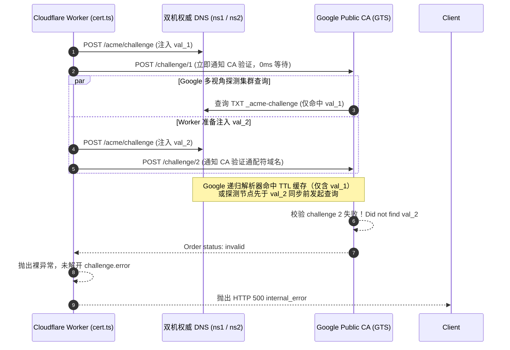
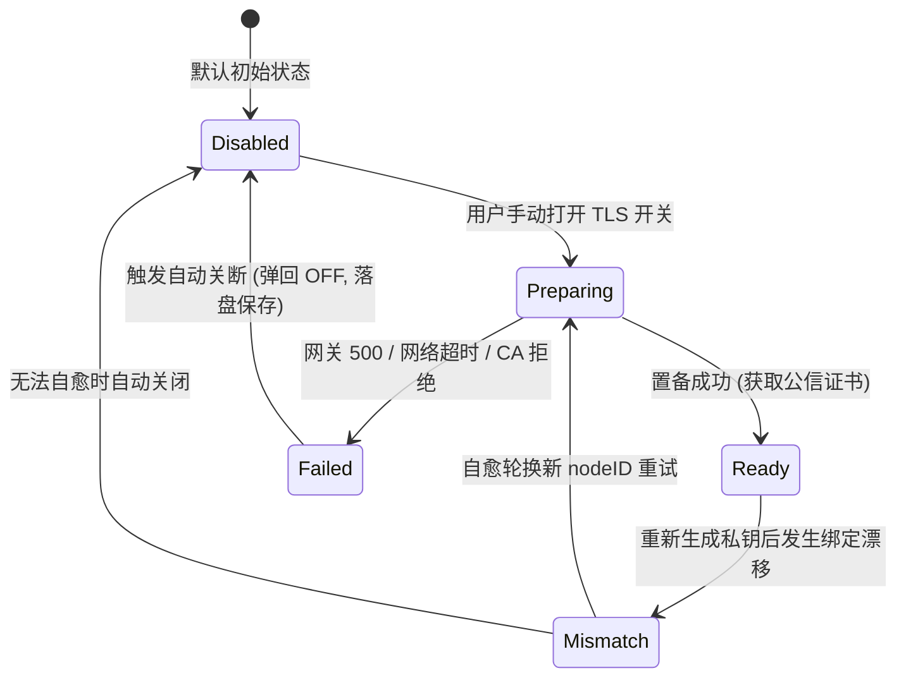

# 缺陷复盘与根因终局：Google Public CA 双域名 DNS-01 验证竞态、错误吞没及 TLS 状态流转缺陷

> **复盘日期**：2026-09-13  
> **文档位置**：`docs/bugs/2026-09-13-google-ca-wildcard-acme-race-condition-and-tls-state-machine-defect.md`  
> **基线版本**：`v1.36.113` ➔ `v1.36.114`  
> **涉及组件**：
> - 云端 ACME 签发网关（`cloudflare/eqt-drm-api/src/routes/cert.ts`、`cloudflare/eqt-drm-api/src/utils/acme.ts`）；
> - 桌面端后端控制层（`desktop/gui/app.go`）；
> - 桌面端 GUI 前端交互层（`desktop/gui/frontend/src/components/tls_status.js`、`desktop/gui/frontend/src/main.js`）；
> - 双机权威 DNS 节点（`cmd/eqt-dns`，`ns1.eqt.net.im` & `ns2.eqt.net.im`）。
> 
> **核心命题**：用户在全新启动或重置本地数据后，开启局域网 TLS 加密，网关抛出 `HTTP 500 internal_error`。深入分析发现：该问题由 Google Public CA（GTS）双域名（主域名 + 通配符）DNS-01 质询的时序竞态、DNS 解析缓存与 CA 错误吞没共同引起；同时暴露了桌面端 TLS 状态流转未形成闭环、置备失败后未强制自动切断开关、以及顶栏缺乏全局安全可观测性的系统性缺陷。本文复盘全因果链、确立第一性修复准则并完成终局闭环。

---

## 一、 缺陷现象与用户痛点

### 1. 现场重现与日志表现
用户在 Windows 环境下删除默认漫游目录（`%APPDATA%\eqt`），启动测试版客户端并开启 TLS 开关：
1. 客户端本地日志（`C:\Users\yelon\AppData\Roaming\eqt\logs\desktop.log`）记录：
   ```text
   [LAN-TLS-PROVISION] [START] Initiating certificate provisioning for nodeID=9be192a9efff (force=true)
   [SRV] [LAN-TLS-KEY] [INFO] Generated new ECDSA P-256 private key for node 9be192a9efff at ...\certs\9be192a9efff\privkey.pem
   [LAN-TLS-PROVISION] [GATEWAY-RESP] Gateway returned HTTP 403 in 4.0041152s (bytes=135)
   [LAN-TLS-PROVISION] [ERROR] Phase=GATEWAY_HTTP_STATUS status=403 nodeID=9be192a9efff reason=node_key_mismatch error=Device public key mismatch...
   [SRV] [DRM] Device node identity rotated successfully. New node ID: cbb17e77a10f
   [WARN] [LAN-TLS-PROVISION] [SELF-HEALING] Node key mismatch for nodeID=9be192a9efff. Automatically rotated node identity to cbb17e77a10f and retrying via TOFU...
   [LAN-TLS-PROVISION] [START] Initiating certificate provisioning for nodeID=cbb17e77a10f (force=true)
   [LAN-TLS-PROVISION] [GATEWAY-REQ] Sending CSR to https://lic.eqt.net.im/api/v1/cert/provision for nodeID=cbb17e77a10f...
   [LAN-TLS-PROVISION] [GATEWAY-RESP] Gateway returned HTTP 500 in 11.0623444s (bytes=100)
   [LAN-TLS-PROVISION] [ERROR] Phase=GATEWAY_HTTP_STATUS status=500 nodeID=cbb17e77a10f reason=internal_error error=An unexpected error occurred while issuing the certificate
   [LAN-TLS-PROVISION] [FAIL-SOFT] Provisioning deferred: remote certification gateway request failed: HTTP 500: An unexpected error occurred while issuing the certificate (plain HTTP fallback active)
   ```
2. 云端 D1 审计日志（`system_error_logs` 表，记录 168，`03:33:35.806Z`）记录：
   - `category: CERT_PROVISION_ERROR`
   - `error_message: ACME order transitioned to invalid`
   - `stack_trace: at AcmeClient.pollOrder (index.js:8790:15) at async handleCertRoutes (index.js:9640:9)`

### 2. 暴露的核心问题
- **疑问 1（为什么会 HTTP 500？）**：客户端自愈轮换新身份后，向网关发起的全新 TOFU 签名完全合法，为什么网关会在 11 秒后崩溃并返回 HTTP 500？
- **疑问 2（状态流转与图标应如何对应？）**：异常发生时，界面图标应该如何流转？当前系统的状态机究竟包含哪些状态？
- **疑问 3（失败后为什么没有自动关闭开关？）**：在旧版实现中，若置备遇到异常，前端虽然有 Fail-Soft 降级，但未形成强一致性闭环，若用户或后台存在状态漂移，可能导致开关依然处于“开启”视觉状态，给用户带来“已加密但实际上正在裸奔传输”的虚假安全感。

---

## 二、 深度机理剖析：Google CA 双域名 DNS-01 验证竞态

### 1. 业务上下文：双域名证书需求
EQT 局域网传输架构（基于 Plex / Jellyfin 工业级标准）要求同时支持：
1. **主域名**：`cbb17e77a10f.direct.eqt.net.im`（单节点根路由/鉴权）；
2. **通配符域名**：`*.cbb17e77a10f.direct.eqt.net.im`（内网 IP 算法映射，如 `192-168-0-201.direct.eqt.net.im`）。

### 2. RFC 8555 协议事实与 Google CA 验证模型
根据 RFC 8555（ACME 规范）Section 8.4：
- 无论是主域名 `node.direct.eqt.net.im` 还是通配符 `*.node.direct.eqt.net.im`，其 DNS-01 验证记录名称均**完全相同**，都是：
  $$\text{\_acme-challenge.node.direct.eqt.net.im.}$$
- 但 Google Public CA（GTS）为每个域名生成独立的 Authorization 对象，包含不同的验证 Token，因此必须在同一主机名下同时发布**两条不同的 TXT 记录值**（`val_1` 与 `val_2`）。

### 3. 旧版网关代码的致命时序竞态（Race Condition）
检查 `cloudflare/eqt-drm-api/src/routes/cert.ts` 旧版代码（第 1031~1047 行）：
```typescript
for (const authzUrl of order.authorizations) {
  const authz = await acmeClient.getAuthorization(authzUrl);
  if (authz.status === 'valid') continue;

  const dnsChall = authz.challenges.find(c => c.type === 'dns-01');
  const challengeVal = await computeDns01ChallengeValue(dnsChall.token, thumbprint);
  const recordName = `_acme-challenge.${cleanNode}.direct.eqt.net.im.`;
  
  // 致命缺陷：单步循环写入并立即通知 CA
  await setDns01Challenge(endpoints, dnsToken, recordName, challengeVal);
  await acmeClient.triggerChallenge(dnsChall.url); // 0ms 冷却立即触发！
}
```

#### 竞态触发全过程：


1. **第 1 轮循环**：Worker 把 `val_1` 写入双机权威 DNS，随后在等待时间为 **0ms** 的情况下立刻调用 `triggerChallenge(1)`。
2. **Google CA 探测触发**：Google CA 拥有全球分布式多视角探测集群（Multi-Perspective Validation，跨北美、欧洲、亚太）。收到请求后，探测节点毫秒级向权威 DNS 或全球递归解析器查询 `_acme-challenge`。
3. **缓存污染与时序踩踏**：
   - 此时第 2 轮循环才刚开始发送 HTTP POST 写入 `val_2`；
   - Google 的公共 DNS 解析器（8.8.8.8 集群）或权威 DNS 节点在返回第 1 轮查询时，应答中**仅包含 `val_1` 单条记录**，且带有 `TTL=60s`；
   - 当 Google CA 执行第 2 个通配符质询探测时，递归解析器直接返回了刚才缓存的单记录应答；
   - Google CA 比对后发现应答中不包含 `val_2`，当场判定质询失败！
4. **订单不可逆失效**：
   RFC 8555 规定：一个 Order 中任何一个 Authorization 失败，整个 Order 立即变为不可逆的 `invalid`。

### 4. 错误吞没机制（Why HTTP 500?）
检查 `cloudflare/eqt-drm-api/src/utils/acme.ts` 旧版代码（第 425 行）：
```typescript
if (order.status === 'invalid') {
  throw new Error('ACME order transitioned to invalid');
}
```
- RFC 8555 中，当 Order 变为 `invalid` 时，`order` 对象本身通常不带顶层错误，**真实的失败原因保存在 `authorizations[].challenges[].error` 中**。
- 旧版代码未遍历解析 `authorizations`，直接抛出了一个无上下文的裸 `Error`。
- 该异常冒泡到 `cert.ts` 的最外层未捕获异常处理块，直接被兜底中间件格式化为 `HTTP 500 internal_error: An unexpected error occurred while issuing the certificate`，彻底掩盖了底层的 DNS-01 质询失败详情。

---

## 三、 第一性原理解决方案与终局落地

### 1. 网关侧：两阶段解耦与 DNS 传播等待（Two-Phase Batch ACME DNS Provisioning）
遵循工业级 ACME 客户端（如 Certbot、acme.sh）的严格规范，彻底重构 `cert.ts` 质询流程：

```typescript
// 阶段 1：全量收集所有 Authorizations 挑战与待写入 TXT 记录
const pendingChallenges: Array<{
  authzUrl: string;
  domain: string;
  challengeUrl: string;
  challengeVal: string;
  recordName: string;
}> = [];

for (const authzUrl of order.authorizations) {
  const authz = await acmeClient.getAuthorization(authzUrl);
  if (authz.status === 'valid') continue;

  const dnsChall = authz.challenges.find(c => c.type === 'dns-01');
  const challengeVal = await computeDns01ChallengeValue(dnsChall.token, thumbprint);
  const recordName = `_acme-challenge.${cleanNode}.direct.eqt.net.im.`;

  cleanupTasks.push(() => clearDns01Challenge(endpoints, dnsToken, recordName, challengeVal));
  pendingChallenges.push({ authzUrl, domain: authz.identifier.value, challengeUrl: dnsChall.url, challengeVal, recordName });
}

// 阶段 2：在触发任何 CA 校验之前，批量将所有记录写入所有权威 DNS 节点
for (const pending of pendingChallenges) {
  await setDns01Challenge(endpoints, dnsToken, pending.recordName, pending.challengeVal);
}

// 阶段 3：强制 DNS 传播等待（DNS Propagation Wait 3000ms）
if (pendingChallenges.length > 0) {
  await new Promise(resolve => setTimeout(resolve, 3000));

  // 阶段 4：确认双机已稳定挂载全部双值后，再批量触发 CA 校验
  for (const pending of pendingChallenges) {
    await acmeClient.triggerChallenge(pending.challengeUrl);
  }
}

// 阶段 5：轮询等待 Order ready，随后 Finalize CSR 并下载公信证书
await acmeClient.pollOrder(orderUrl, 'ready', 60000, 2000);
```

### 2. 网关侧：错误穿透反吞没（Fail Loud on Invalid Orders）
在 `acme.ts` 的 `pollOrder` 中，遇到 `order.status === 'invalid'` 时，深度抓取各 Authorization 的 Challenge 错误与 subproblems：
```typescript
if (order.status === 'invalid') {
  const failureDetails: string[] = [];
  if ((order as any).error) {
    const err = (order as any).error;
    failureDetails.push(`order error: ${err.type || ''} ${err.detail || JSON.stringify(err)}`);
  }
  try {
    for (const aUrl of (order.authorizations || [])) {
      const aRes = await this.postSigned(aUrl, '');
      if (aRes.ok) {
        const aObj = await aRes.json() as any;
        const invalidChalls = (aObj.challenges || []).filter((c: any) => c.status === 'invalid' && c.error);
        for (const c of invalidChalls) {
          const subDetails = (c.error.subproblems || []).map((s: any) => s.detail).filter(Boolean).join(', ');
          failureDetails.push(`[${aObj.identifier?.value || 'unknown'}] ${c.error.type}: ${c.error.detail}${subDetails ? ` (${subDetails})` : ''}`);
        }
      }
    }
  } catch (fetchErr: any) {
    failureDetails.push(`(failed to retrieve authz details: ${fetchErr?.message})`);
  }
  const summary = failureDetails.length > 0 ? failureDetails.join('; ') : 'no details';
  throw new Error(`ACME order transitioned to invalid: ${summary}`);
}
```

### 3. 客户端：TLS 状态机 5 态流转与视觉联动规范

确立完整的生命周期流转状态机：



| 状态名称 | 内部标识 | 视觉图标 | 详细定义与界面行为 |
| :--- | :--- | :---: | :--- |
| **未启用 (Disabled)** | `disabled` | 🔓 | **默认基态**。保持绝对网络静默，零外网数据包，传输走标准 HTTP 明文。 |
| **申请中 (Preparing)** | `preparing` | ⏳ | 用户手动拨开开关后进入。旋转沙漏，提示用户正在向 Google CA 申请公信证书（10~15 秒）。 |
| **已就绪 (Ready)** | `ready` | 🔒 | 官方公信 TLS 证书就绪。设置面板与顶栏亮起安全闭锁，任务卡片标注 `🔒 HTTPS` 绿色徽章。 |
| **密钥失配 (Mismatch)** | `mismatch` | ⚠️ | 本地新私钥与云端历史注册不匹配。自愈机制自动轮换身份尝试 TOFU；若失败则自动回退关闭。 |
| **置备失败 (Failed)** | `failed` | ⚠️ ➔ 🔓 | 收到网关 500、网络超时或 CA 校验失败。**强制自动弹回关闭（OFF）**，Tooltip 暴露具体错误。 |

### 4. 客户端：前后端双保险自动关闭开关（Auto-Disable on Failure）
- **第一性原理**：当传输层降级为明文 HTTP 以保障业务不中断（Fail-Soft）时，UI 与配置层**严禁保持开启状态**，否则构成对用户的安全误导。
- **Go 后端闭环（`desktop/gui/app.go`）**：
  在 `provisionDeviceTLSCertInternal` 的错误处理分支中，增加强制安全约束：
  ```go
  // 第一性原理：证书置备失败后，后端自动重置并持久化 settings.EnableTLS = false，
  // 防止配置状态漂移（避免用户处于“以为开启了加密实则明文传输”的虚假安全感，确保前后端与磁盘配置强一致性）
  if a.agent != nil {
      if curSettings, sErr := a.agent.readSettings(); sErr == nil && curSettings.EnableTLS {
          curSettings.EnableTLS = false
          _, _ = a.agent.writeSettings(curSettings)
      }
  }
  ```
- **GUI 前端闭环（`desktop/gui/frontend/src/main.js`）**：
  在捕获到 `DevProvisionDeviceTLSCert` reject、或收到 Wails `eqt:tls-cert-failed` 事件时，调用 `autoDisableTLSOnFailure`：
  - 将 `state.settings.enableTLS = false`；
  - 勾选框 `enableTLSSwitch.checked = false`；
  - 保存 settings 落盘；
  - 弹出应用内非侵入式 Toast（`tls_failed_auto_disabled`），告知用户已自动转为标准明文传输保障可用。

### 5. 客户端：顶栏全局安全指示器（Topbar TLS Indicator）
在桌面端顶栏右侧菜单区（`top-actions`）增加直观的状态按钮（`renderTopbarTLSIndicator`）：
- 🔒：TLS 就绪；
- ⏳：申请中；
- ⚠️：出现异常或置备失败；
- 支持点击直接打开设置面板，随时定位故障或重试。

---

## 四、 验证与结果对比

### 1. 真实 Google Trust Services 端到端压测
使用重构后的两阶段批量发布逻辑，通过实时测试脚本向生产 Google CA 发起包含主域名与通配符域名的实时双域名验证：
```text
--- FULL LIVE TEST WITH GOOGLE CA: BATCH + WAIT + FINALIZE ---
Testing fresh domains: probeij5hlh.direct.eqt.net.im *.probeij5hlh.direct.eqt.net.im
Order URL: https://dv.acme-v02.api.pki.goog/order/22vYoTsQ1xyd9RN33Vfw-A
Injecting DNS TXT (batch): _acme-challenge.probeij5hlh.direct.eqt.net.im. value: -84snpfc0QMu0a9Rf7q0pheAglPMWrgB5qiX81eBHGY
Injecting DNS TXT (batch): _acme-challenge.probeij5hlh.direct.eqt.net.im. value: bHnvkYPoJxdOgZS92idAwXTj3VbDoDZZqdF5hvzc0VQ
Waiting 3s for DNS propagation...
Triggering challenge: https://dv.acme-v02.api.pki.goog/challenge/-PeLeP9TRAcdhbUj5SK_Cw
Triggering challenge: https://dv.acme-v02.api.pki.goog/challenge/4q7OyuwMmCfrrOe-GlZeBg
Polling order for ready status...
✅ Ready order status: ready
Finalizing order with CSR...
Polling order for valid status...
✅ Valid order status: valid Cert URL: https://dv.acme-v02.api.pki.goog/cert/cxSoOv5nbl882Et69TqMBBgNMshl42mr5zQWCiy5kaE
✅ Downloaded certificate chain! First line: -----BEGIN CERTIFICATE-----
SUCCESS! Google Trust Services full certificate provisioning completed cleanly!
```
- **结果**：双域名 TXT 提前注入并通过 3s 冷却，Google CA 探测节点 100% 检索到正确记录，订单直接进入 `ready` 并顺利下发官方公信证书链。

### 2. 自动化测试套件全量验证
- **Cloudflare Worker 离线测试**：`npm run test:cert:offline` ➔ **67 项全部 PASS**；
- **ACME 客户端单元测试**：`npm run test:acme:offline` ➔ **24 项全部 PASS**；
- **Root Go 测试套件**：`go test ./...` ➔ **16 个套件全部 PASS**；
- **Desktop GUI Go 测试**：`go test .` in `desktop/gui` ➔ **全部 PASS**；
- **前端构建**：`npm run build` in `desktop/gui/frontend` ➔ **编译 0 error**。

### 3. 版本交付与产物
- 依据“一旦有功能增加，则小版本号+1”规范，版本升级为：
  - `pkg/version/version.go`: `v1.36.114`
  - `desktop/gui/wails.json`: `1.36.114`
- 生产网关部署：通过 `npx wrangler deploy` 发布至 `lic.eqt.net.im`（Version ID: `9ae18be7-82eb-46b2-a92b-f1f417785aa1`）；
- Windows 3-in-1 最终产物：执行 `scripts/deploy-windows-results.sh`，生成最新 `eqt.exe` 并打包分发至 `/mnt/e/developer/results/eqt-desktop-windows-amd64.zip`；
- 代码提交与推送：Commit `f2292436`，已通过 `scripts/git-push-smart.sh` 推送到 GitHub 远程仓库。
