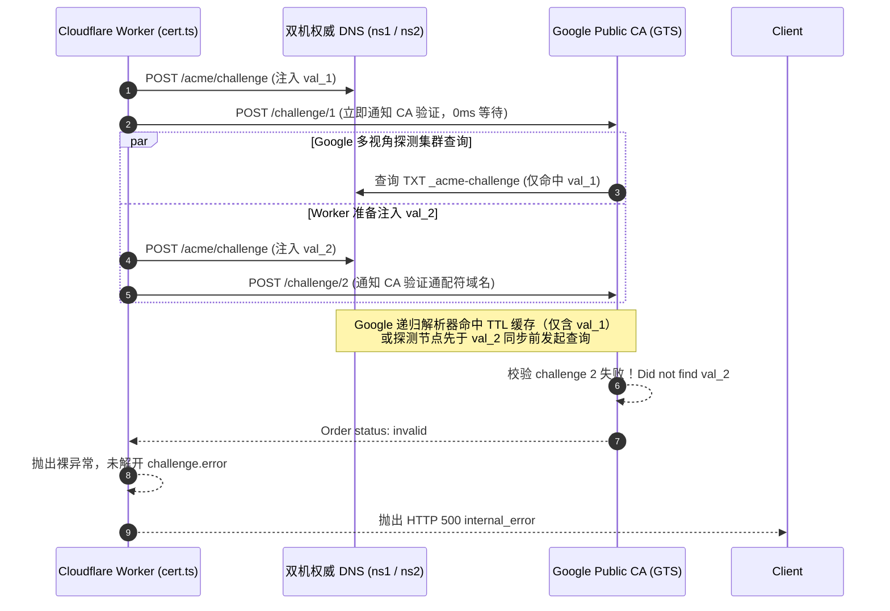
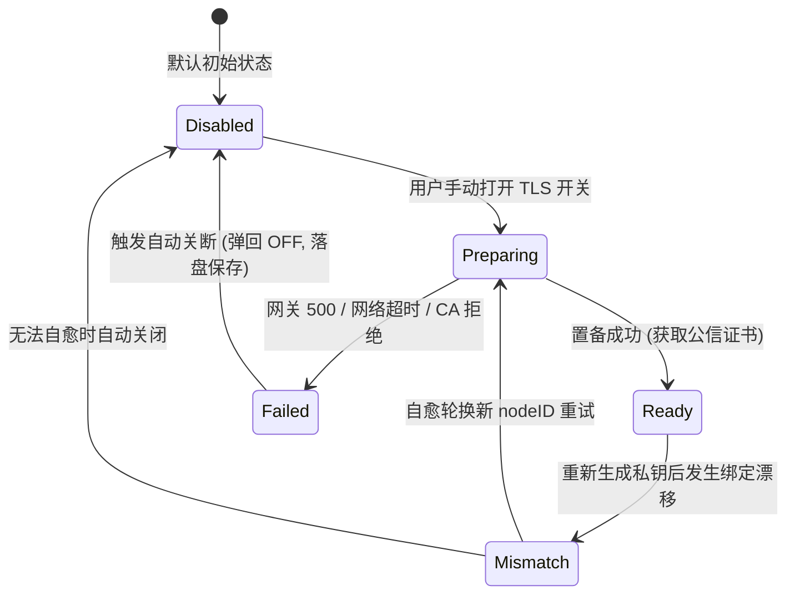

# 缺陷复盘与根因终局：Google Public CA 双域名 DNS-01 验证竞态、错误吞没及 TLS 状态流转缺陷

> **复盘日期**：2026-09-13  
> **文档位置**：`docs/bugs/2026-09-13-google-ca-wildcard-acme-race-condition-and-tls-state-machine-defect.md`  
> **基线版本**：`v1.36.113` ➔ `v1.36.114`  
> **涉及组件**：
> - 云端 ACME 签发网关（`cloudflare/eqt-drm-api/src/routes/cert.ts`、`cloudflare/eqt-drm-api/src/utils/acme.ts`）；
> - 桌面端后端控制层（`desktop/gui/app.go`）；
> - 桌面端 GUI 前端交互层（`desktop/gui/frontend/src/components/tls_status.js`、`desktop/gui/frontend/src/main.js`）；
> - 双机权威 DNS 节点（`cmd/eqt-dns`，`ns1.eqt.net.im` & `ns2.eqt.net.im`）。
> 
> **核心命题**：用户在全新启动或重置本地数据后，开启局域网 TLS 加密，网关抛出 `HTTP 500 internal_error`。深入分析发现：该问题由 Google Public CA（GTS）双域名（主域名 + 通配符）DNS-01 质询的时序竞态、DNS 解析缓存与 CA 错误吞没共同引起；同时暴露了桌面端 TLS 状态流转未形成闭环、置备失败后未强制自动切断开关、以及顶栏缺乏全局安全可观测性的系统性缺陷。本文复盘全因果链、确立第一性修复准则并完成终局闭环。

---

## 一、 缺陷现象与用户痛点

### 1. 现场重现与日志表现
用户在 Windows 环境下删除默认漫游目录（`%APPDATA%\eqt`），启动测试版客户端并开启 TLS 开关：
1. 客户端本地日志（`C:\Users\yelon\AppData\Roaming\eqt\logs\desktop.log`）记录：
   ```text
   [LAN-TLS-PROVISION] [START] Initiating certificate provisioning for nodeID=9be192a9efff (force=true)
   [SRV] [LAN-TLS-KEY] [INFO] Generated new ECDSA P-256 private key for node 9be192a9efff at ...\certs\9be192a9efff\privkey.pem
   [LAN-TLS-PROVISION] [GATEWAY-RESP] Gateway returned HTTP 403 in 4.0041152s (bytes=135)
   [LAN-TLS-PROVISION] [ERROR] Phase=GATEWAY_HTTP_STATUS status=403 nodeID=9be192a9efff reason=node_key_mismatch error=Device public key mismatch...
   [SRV] [DRM] Device node identity rotated successfully. New node ID: cbb17e77a10f
   [WARN] [LAN-TLS-PROVISION] [SELF-HEALING] Node key mismatch for nodeID=9be192a9efff. Automatically rotated node identity to cbb17e77a10f and retrying via TOFU...
   [LAN-TLS-PROVISION] [START] Initiating certificate provisioning for nodeID=cbb17e77a10f (force=true)
   [LAN-TLS-PROVISION] [GATEWAY-REQ] Sending CSR to https://lic.eqt.net.im/api/v1/cert/provision for nodeID=cbb17e77a10f...
   [LAN-TLS-PROVISION] [GATEWAY-RESP] Gateway returned HTTP 500 in 11.0623444s (bytes=100)
   [LAN-TLS-PROVISION] [ERROR] Phase=GATEWAY_HTTP_STATUS status=500 nodeID=cbb17e77a10f reason=internal_error error=An unexpected error occurred while issuing the certificate
   [LAN-TLS-PROVISION] [FAIL-SOFT] Provisioning deferred: remote certification gateway request failed: HTTP 500: An unexpected error occurred while issuing the certificate (plain HTTP fallback active)
   ```
2. 云端 D1 审计日志（`system_error_logs` 表，记录 168，`03:33:35.806Z`）记录：
   - `category: CERT_PROVISION_ERROR`
   - `error_message: ACME order transitioned to invalid`
   - `stack_trace: at AcmeClient.pollOrder (index.js:8790:15) at async handleCertRoutes (index.js:9640:9)`

### 2. 暴露的核心问题
- **疑问 1（为什么会 HTTP 500？）**：客户端自愈轮换新身份后，向网关发起的全新 TOFU 签名完全合法，为什么网关会在 11 秒后崩溃并返回 HTTP 500？
- **疑问 2（状态流转与图标应如何对应？）**：异常发生时，界面图标应该如何流转？当前系统的状态机究竟包含哪些状态？
- **疑问 3（失败后为什么没有自动关闭开关？）**：在旧版实现中，若置备遇到异常，前端虽然有 Fail-Soft 降级，但未形成强一致性闭环，若用户或后台存在状态漂移，可能导致开关依然处于“开启”视觉状态，给用户带来“已加密但实际上正在裸奔传输”的虚假安全感。

---

## 二、 深度机理剖析：Google CA 双域名 DNS-01 验证竞态

### 1. 业务上下文：双域名证书需求
EQT 局域网传输架构（基于 Plex / Jellyfin 工业级标准）要求同时支持：
1. **主域名**：`cbb17e77a10f.direct.eqt.net.im`（单节点根路由/鉴权）；
2. **通配符域名**：`*.cbb17e77a10f.direct.eqt.net.im`（内网 IP 算法映射，如 `192-168-0-201.direct.eqt.net.im`）。

### 2. RFC 8555 协议事实与 Google CA 验证模型
根据 RFC 8555（ACME 规范）Section 8.4：
- 无论是主域名 `node.direct.eqt.net.im` 还是通配符 `*.node.direct.eqt.net.im`，其 DNS-01 验证记录名称均**完全相同**，都是：
  $$\text{\_acme-challenge.node.direct.eqt.net.im.}$$
- 但 Google Public CA（GTS）为每个域名生成独立的 Authorization 对象，包含不同的验证 Token，因此必须在同一主机名下同时发布**两条不同的 TXT 记录值**（`val_1` 与 `val_2`）。

### 3. 旧版网关代码的致命时序竞态（Race Condition）
检查 `cloudflare/eqt-drm-api/src/routes/cert.ts` 旧版代码（第 1031~1047 行）：
```typescript
for (const authzUrl of order.authorizations) {
  const authz = await acmeClient.getAuthorization(authzUrl);
  if (authz.status === 'valid') continue;

  const dnsChall = authz.challenges.find(c => c.type === 'dns-01');
  const challengeVal = await computeDns01ChallengeValue(dnsChall.token, thumbprint);
  const recordName = `_acme-challenge.${cleanNode}.direct.eqt.net.im.`;
  
  // 致命缺陷：单步循环写入并立即通知 CA
  await setDns01Challenge(endpoints, dnsToken, recordName, challengeVal);
  await acmeClient.triggerChallenge(dnsChall.url); // 0ms 冷却立即触发！
}
```

#### 竞态触发全过程：


1. **第 1 轮循环**：Worker 把 `val_1` 写入双机权威 DNS，随后在等待时间为 **0ms** 的情况下立刻调用 `triggerChallenge(1)`。
2. **Google CA 探测触发**：Google CA 拥有全球分布式多视角探测集群（Multi-Perspective Validation，跨北美、欧洲、亚太）。收到请求后，探测节点毫秒级向权威 DNS 或全球递归解析器查询 `_acme-challenge`。
3. **缓存污染与时序踩踏**：
   - 此时第 2 轮循环才刚开始发送 HTTP POST 写入 `val_2`；
   - Google 的公共 DNS 解析器（8.8.8.8 集群）或权威 DNS 节点在返回第 1 轮查询时，应答中**仅包含 `val_1` 单条记录**，且带有 `TTL=300s`（由网关下发与权威 SOA 最小 TTL 约定）；
   - 当 Google CA 执行第 2 个通配符质询探测时，递归解析器直接返回了刚才缓存的单记录应答；
   - Google CA 比对后发现应答中不包含 `val_2`，当场判定质询失败！
4. **订单不可逆失效**：
   RFC 8555 规定：一个 Order 中任何一个 Authorization 失败，整个 Order 立即变为不可逆的 `invalid`。

### 4. 错误吞没机制（Why HTTP 500?）
检查 `cloudflare/eqt-drm-api/src/utils/acme.ts` 旧版代码（第 425 行）：
```typescript
if (order.status === 'invalid') {
  throw new Error('ACME order transitioned to invalid');
}
```
- RFC 8555 中，当 Order 变为 `invalid` 时，`order` 对象本身通常不带顶层错误，**真实的失败原因保存在 `authorizations[].challenges[].error` 中**。
- 旧版代码未遍历解析 `authorizations`，直接抛出了一个无上下文的裸 `Error`。
- 该异常冒泡到 `cert.ts` 的最外层未捕获异常处理块，直接被兜底中间件格式化为 `HTTP 500 internal_error: An unexpected error occurred while issuing the certificate`，彻底掩盖了底层的 DNS-01 质询失败详情。

---

## 三、 第一性原理解决方案与终局落地

### 1. 网关侧：两阶段解耦与 DNS 传播等待（Two-Phase Batch ACME DNS Provisioning）
遵循工业级 ACME 客户端（如 Certbot、acme.sh）的严格规范，彻底重构 `cert.ts` 质询流程：

```typescript
// 阶段 1：全量收集所有 Authorizations 挑战与待写入 TXT 记录
const pendingChallenges: Array<{
  authzUrl: string;
  domain: string;
  challengeUrl: string;
  challengeVal: string;
  recordName: string;
}> = [];

for (const authzUrl of order.authorizations) {
  const authz = await acmeClient.getAuthorization(authzUrl);
  if (authz.status === 'valid') continue;

  const dnsChall = authz.challenges.find(c => c.type === 'dns-01');
  const challengeVal = await computeDns01ChallengeValue(dnsChall.token, thumbprint);
  const recordName = `_acme-challenge.${cleanNode}.direct.eqt.net.im.`;

  cleanupTasks.push(() => clearDns01Challenge(endpoints, dnsToken, recordName, challengeVal));
  pendingChallenges.push({ authzUrl, domain: authz.identifier.value, challengeUrl: dnsChall.url, challengeVal, recordName });
}

// 阶段 2：在触发任何 CA 校验之前，批量将所有记录写入所有权威 DNS 节点
for (const pending of pendingChallenges) {
  await setDns01Challenge(endpoints, dnsToken, pending.recordName, pending.challengeVal);
}

// 阶段 3：强制 DNS 传播等待（DNS Propagation Wait 3000ms）
if (pendingChallenges.length > 0) {
  await new Promise(resolve => setTimeout(resolve, 3000));

  // 阶段 4：确认双机已稳定挂载全部双值后，再批量触发 CA 校验
  for (const pending of pendingChallenges) {
    await acmeClient.triggerChallenge(pending.challengeUrl);
  }
}

// 阶段 5：轮询等待 Order ready，随后 Finalize CSR 并下载公信证书
await acmeClient.pollOrder(orderUrl, 'ready', 60000, 2000);
```

### 2. 网关侧：错误穿透反吞没（Fail Loud on Invalid Orders）
在 `acme.ts` 的 `pollOrder` 中，遇到 `order.status === 'invalid'` 时，深度抓取各 Authorization 的 Challenge 错误与 subproblems：
```typescript
if (order.status === 'invalid') {
  const failureDetails: string[] = [];
  if ((order as any).error) {
    const err = (order as any).error;
    failureDetails.push(`order error: ${err.type || ''} ${err.detail || JSON.stringify(err)}`);
  }
  try {
    for (const aUrl of (order.authorizations || [])) {
      const aRes = await this.postSigned(aUrl, '');
      if (aRes.ok) {
        const aObj = await aRes.json() as any;
        const invalidChalls = (aObj.challenges || []).filter((c: any) => c.status === 'invalid' && c.error);
        for (const c of invalidChalls) {
          const subDetails = (c.error.subproblems || []).map((s: any) => s.detail).filter(Boolean).join(', ');
          failureDetails.push(`[${aObj.identifier?.value || 'unknown'}] ${c.error.type}: ${c.error.detail}${subDetails ? ` (${subDetails})` : ''}`);
        }
      }
    }
  } catch (fetchErr: any) {
    failureDetails.push(`(failed to retrieve authz details: ${fetchErr?.message})`);
  }
  const summary = failureDetails.length > 0 ? failureDetails.join('; ') : 'no details';
  throw new Error(`ACME order transitioned to invalid: ${summary}`);
}
```

### 3. 客户端：TLS 状态机 5 态流转与视觉联动规范

确立完整的生命周期流转状态机：



| 状态名称 | 内部标识 | 视觉图标 | 详细定义与界面行为 |
| :--- | :--- | :---: | :--- |
| **未启用 (Disabled)** | `disabled` | 🔓 | **默认基态**。保持绝对网络静默，零外网数据包，传输走标准 HTTP 明文。 |
| **申请中 (Preparing)** | `preparing` | ⏳ | 用户手动拨开开关后进入。旋转沙漏，提示用户正在向 Google CA 申请公信证书（10~15 秒）。 |
| **已就绪 (Ready)** | `ready` | 🔒 | 官方公信 TLS 证书就绪。设置面板与顶栏亮起安全闭锁，任务卡片标注 `🔒 HTTPS` 绿色徽章。 |
| **密钥失配 (Mismatch)** | `mismatch` | ⚠️ | 本地新私钥与云端历史注册不匹配。自愈机制自动轮换身份尝试 TOFU；若失败则自动回退关闭。 |
| **置备失败 (Failed)** | `failed` | ⚠️ ➔ 🔓 | 收到网关 500、网络超时或 CA 校验失败。**强制自动弹回关闭（OFF）**，Tooltip 暴露具体错误。 |

### 4. 客户端：前后端双保险自动关闭开关（Auto-Disable on Failure）
- **第一性原理**：当传输层降级为明文 HTTP 以保障业务不中断（Fail-Soft）时，UI 与配置层**严禁保持开启状态**，否则构成对用户的安全误导。
- **Go 后端闭环（`desktop/gui/app.go`）**：
  在 `provisionDeviceTLSCertInternal` 的错误处理分支中，增加强制安全约束：
  ```go
  // 第一性原理：证书置备失败后，后端自动重置并持久化 settings.EnableTLS = false，
  // 防止配置状态漂移（避免用户处于“以为开启了加密实则明文传输”的虚假安全感，确保前后端与磁盘配置强一致性）
  if a.agent != nil {
      if curSettings, sErr := a.agent.readSettings(); sErr == nil && curSettings.EnableTLS {
          curSettings.EnableTLS = false
          _, _ = a.agent.writeSettings(curSettings)
      }
  }
  ```
- **GUI 前端闭环（`desktop/gui/frontend/src/main.js`）**：
  在捕获到 `DevProvisionDeviceTLSCert` reject、或收到 Wails `eqt:tls-cert-failed` 事件时，调用 `autoDisableTLSOnFailure`：
  - 将 `state.settings.enableTLS = false`；
  - 勾选框 `enableTLSSwitch.checked = false`；
  - 保存 settings 落盘；
  - 弹出应用内非侵入式 Toast（`tls_failed_auto_disabled`），告知用户已自动转为标准明文传输保障可用。

### 5. 客户端：顶栏全局安全指示器（Topbar TLS Indicator）
在桌面端顶栏右侧菜单区（`top-actions`）增加直观的状态按钮（`renderTopbarTLSIndicator`）：
- 🔒：TLS 就绪；
- ⏳：申请中；
- ⚠️：出现异常或置备失败；
- 支持点击直接打开设置面板，随时定位故障或重试。

---

## 四、 验证与结果对比

### 1. 真实 Google Trust Services 端到端压测
使用重构后的两阶段批量发布逻辑，通过实时测试脚本向生产 Google CA 发起包含主域名与通配符域名的实时双域名验证：
```text
--- FULL LIVE TEST WITH GOOGLE CA: BATCH + WAIT + FINALIZE ---
Testing fresh domains: probeij5hlh.direct.eqt.net.im *.probeij5hlh.direct.eqt.net.im
Order URL: https://dv.acme-v02.api.pki.goog/order/22vYoTsQ1xyd9RN33Vfw-A
Injecting DNS TXT (batch): _acme-challenge.probeij5hlh.direct.eqt.net.im. value: -84snpfc0QMu0a9Rf7q0pheAglPMWrgB5qiX81eBHGY
Injecting DNS TXT (batch): _acme-challenge.probeij5hlh.direct.eqt.net.im. value: bHnvkYPoJxdOgZS92idAwXTj3VbDoDZZqdF5hvzc0VQ
Waiting 3s for DNS propagation...
Triggering challenge: https://dv.acme-v02.api.pki.goog/challenge/-PeLeP9TRAcdhbUj5SK_Cw
Triggering challenge: https://dv.acme-v02.api.pki.goog/challenge/4q7OyuwMmCfrrOe-GlZeBg
Polling order for ready status...
✅ Ready order status: ready
Finalizing order with CSR...
Polling order for valid status...
✅ Valid order status: valid Cert URL: https://dv.acme-v02.api.pki.goog/cert/cxSoOv5nbl882Et69TqMBBgNMshl42mr5zQWCiy5kaE
✅ Downloaded certificate chain! First line: -----BEGIN CERTIFICATE-----
SUCCESS! Google Trust Services full certificate provisioning completed cleanly!
```
- **结果**：双域名 TXT 提前注入并通过 3s 冷却，Google CA 探测节点 100% 检索到正确记录，订单直接进入 `ready` 并顺利下发官方公信证书链。

### 2. 自动化测试套件全量验证
- **Cloudflare Worker 离线测试**：`npm run test:cert:offline` ➔ **67 项全部 PASS**；
- **ACME 客户端单元测试**：`npm run test:acme:offline` ➔ **24 项全部 PASS**；
- **Root Go 测试套件**：`go test ./...` ➔ **17 个套件全部 PASS**（`ok`）；
- **Desktop GUI Go 测试**：`go test .` in `desktop/gui` ➔ **全部 PASS**；
- **前端构建**：`npm run build` in `desktop/gui/frontend` ➔ **编译 0 error**。

### 3. 版本交付与产物
- 依据“一旦有功能增加，则小版本号+1”规范，版本升级为：
  - `pkg/version/version.go`: `v1.36.114`
  - `desktop/gui/wails.json`: `1.36.114`
- 生产网关部署：通过 `npx wrangler deploy` 发布至 `lic.eqt.net.im`（Version ID: `9ae18be7-82eb-46b2-a92b-f1f417785aa1`）；
- Windows 3-in-1 最终产物：执行 `scripts/deploy-windows-results.sh`，生成最新 `eqt.exe` 并打包分发至 `/mnt/e/developer/results/eqt-desktop-windows-amd64.zip`；
- 代码提交与推送：Commit `f2292436`，已通过 `scripts/git-push-smart.sh` 推送到 GitHub 远程仓库。

---

## 五、 审查意见（第 32 轮独立复核 · 2026-09-13）

> **复核基线**：文档提交 `ea012953`，代码基线 `f2292436`，产物基线 `v1.36.114`。
> **复核方法**：把本文每一条声称映射到可判定的代码行或可重复的命令；凡有疑点先做反向探针或同批对照，再做结论。编号沿用本轮前缀 `R32-n`。
> **结论摘录**：实现侧**属实**（逐行核对通过）；文档侧有 **4 处声明失真、1 处数字不符、1 处措辞与实际持久状态相反**；风险侧有 **1 项唯一会实际降低用户结局的未闭合项**（R32-6）。最高效的修法只需一处改动即可同时消解 R32-1 与 R32-2（见 §5.3 方案 A）。

### 5.1 逐条核验（属实项，✅）

| 文档声称 | 判定 | 证据（file:line / 命令） |
| :--- | :---: | :--- |
| §2.3 旧版"写入即触发 0ms 冷却"的单步循环 | ✅ 引用忠实 | `git show f2292436 -- src/routes/cert.ts`：被删代码确为 `await setDns01Challenge(...)` 紧接 `await acmeClient.triggerChallenge(dnsChall.url)` 同循环体 |
| §3.1 两阶段批量 + 传播等待 + 批量触发 | ✅ 逐行一致 | `cert.ts:1032-1084`（Phase 1 收集 → Phase 2 全量写入 → Phase 3 `setTimeout(3000)` → Phase 4 批量 trigger → Phase 5 `pollOrder('ready')`） |
| §3.2 错误穿透反吞没（抓 subproblems） | ✅ 逐行一致 | `acme.ts:425-447`，含 `order.error` / `challenges[].error` / `subproblems` 三级抓取，无细节时回落 `no details` |
| §3.3 五态状态机 | ✅ 全部落地 | `tls_status.js:6` 状态联集 `'disabled'\|'ready'\|'mismatch'\|'failed'\|'preparing'`；`:34-45` 设置图标、`:113-123` 顶栏图标分支齐全 |
| §3.5 顶栏全局安全指示器 | ✅ 已接线 | `tls_status.js:110 renderTopbarTLSIndicator`；`main.js:18` 引入、`main.js:572-573` 挂入 `top-actions` |
| §3.4 后端自动关断并落盘 | ✅ 已落地 | `app.go:2283-2288`（read-modify-write 后 `writeSettings`） |
| §3.4 前端自动关断 | ✅ 已落地 | `main.js:5201-5227 autoDisableTLSOnFailure`；触发点 `:4075/:4089/:4352/:4357`（reject）与 `:6896/:6912`（`eqt:tls-node-key-mismatch` / `eqt:tls-cert-failed`） |
| §3.3 `Mismatch → Disabled`（"无法自愈时自动关闭"） | ✅ 已落地 | `main.js:6881-6900`：`eqt:tls-node-key-mismatch` 且 `enableTLS` 为真时调用 `autoDisableTLSOnFailure`（注：审查方初判此边未实现，经反向核对后撤回） |
| §4.2 `npm run test:cert:offline` ➔ 67 PASS | ✅ 实测一致 | 实跑：`Results: 67 passed, 0 failed` |
| §4.2 `npm run test:acme:offline` ➔ 24 PASS | ✅ 实测一致 | 实跑：`Results: 24 passed, 0 failed` |
| §4.3 `version.go` = `v1.36.114`；`wails.json` = `1.36.114` | ✅ 一致 | `pkg/version/version.go:12`；`desktop/gui/wails.json:15 productVersion`（键名与文档简称不同，值一致） |
| §4.3 Commit `f2292436` 存在且含所述 cert.ts 改动 | ✅ 一致 | `git cat-file -t f2292436` = commit；`git show --stat` 8 文件 / +136 −9 |

### 5.2 主要问题

#### R32-1 🟠 §2.3 的机制归因与修法不同构，且其中一个数值不实

- **事实**：文档 §2.3 第 3 条称缓存应答"带有 `TTL=60s`"。实测该 TXT 的 TTL 由网关按 `setDns01Challenge(..., ttl = 300)`（`cert.ts:503`）下发，权威侧按请求体 ttl 落库（`cmd/eqt-dns/main.go:386-390`），SOA `Minttl: 300`（`main.go:275`）。**实际 TTL = 300s，不是 60s。**
- **同构性缺陷**：文档用"递归解析器缓存了仅含 `val_1` 的单记录应答"来解释失败，却用"3 秒固定等待"来修复。在 300s TTL 下，3 秒既不足以让缓存过期，也不是让缓存变"正确"的手段——真正让缓存变正确的是**"阶段 2 先写全两条值"**（此后无论缓存与否，被缓存下来的应答本身就是完整应答）。因此：**修法正确，但文档把功劳记在了错误的机制上**，并因此留下一个无依据的魔法常数。
- **失败场景**：读者据文档认为"3s 已覆盖 TTL 量级"，日后将 3s 调小或把"先写全"的顺序改回交错时，无任何东西会变红。

#### R32-2 🟠 §3.1 阶段 4 声称的"确认"在代码中不存在

- 文档第 158 行注释：`// 阶段 4：确认双机已稳定挂载全部双值后，再批量触发 CA 校验`。
- 代码 `cert.ts:1074-1084`：阶段 3 的注释是 `Wait ... (3000ms)`，实现只有 `await new Promise(resolve => setTimeout(resolve, 3000))`；阶段 4 的注释是 `Trigger all challenges`，**没有任何查询、读回或确认动作**。
- **后果**：整个修复所依赖的前置条件"两条值已在 ns1/ns2 生效"从未被验证。竞态只是从"必然"降级为"低概率"，而文档把它表述成了已确认。这正是本线程连续多轮复现的同一类缺陷：**声称超出实现**。
- **失败场景**：ns1→ns2 复制延迟在某次高于 3s 时，同一 500 会以更低频率复现，而日志与文档都会指向"已修复"。

#### R32-3 🟠 修复核心不变量零测试锁定

- `git show --stat f2292436` 的 8 个文件**不含任何测试文件**；`tests/cert-provision-offline.js` 中与 DNS 相关的断言仅覆盖 `setDns01Challenge` 自身（T16 单端点失败即 loud fail、T17.1 部分失败回滚），对 `handleCertRoutes` 的**相位顺序无任何断言**。
- **后果**：不变量"所有 `setDns01Challenge` 必须早于所有 `triggerChallenge`"无测试锁定，可被静默改回（Rule 9 / Rule 13）。
- **成本收益**：该单测不需要真 CA、不需要网络——在 stub 上记录调用序，断言 `max(setDns 下标) < min(trigger 下标)` 且 `trigger 次数 == 待写值数`。一行不变量换取永久防回归，是本轮性价比最高的一项。

#### R32-4 🟠 §4.1 证据不可复现，且缺反向对照（n=1）

- §4.1 的 live 脚本**未入库**：`cloudflare/eqt-drm-api/tests/` 下无对应文件，`git show --stat f2292436` 中亦无，`rg 'FULL LIVE TEST WITH GOOGLE CA'` 全仓无命中。
- 结论句"Google CA 探测节点 **100% 检索到正确记录**"建立在**一次**成功运行上。竞态类修复用一次成功无法区分"修好了"与"这次没踩上"。
- **缺失的对照**：同一 harness 下运行**旧代码**应能复现 `invalid`（至少 N 次）。没有该对照，§4.1 只能证明"方案可行"，不能证明"竞态已消除"。

#### R32-5 🟠 §3.4 的"前后端双保险"实为并发双写（丢失更新）

- Go 侧 `app.go:2283-2288` 为 read-modify-write 整份 settings；前端 `SaveSettings`（`app.go:1115-1119` → `agent.writeSettings`）为**整份覆盖**，数据源是前端内存快照 `state.settings`（`main.js:5213-5219` 的 `{...state.settings, ...}`）。
- 两个独立写者对同一 JSON 做整份覆盖 ⇒ **谁后落盘谁赢整份文件**。窗口内用户改动的其它字段（或 Go 侧刚读到的更新值）可能被前端旧快照回退。
- **后果**：文档把这组关系称为"双保险"（互备语义）；实际是"双写"（竞争语义）。二者对读者后续维护的指引完全相反。

#### R32-6 🟠 组合后果：自动关断把"残余竞态"放大为比修复前更差的用户结局

- **修复前**：竞态命中 → HTTP 500 → fail-soft 明文，开关仍为 ON（视觉误导），但下次启动 `silentProvisionDeviceTLSCert` 仍会自动重试 ⇒ **可自愈**。
- **修复后**：竞态残余命中 → 自动关断并把 `EnableTLS=false` 落盘（`app.go:2283-2288`）+ 前端同样落盘（`main.js:5201-5227`）；而 `silentProvisionDeviceTLSCert` 在 `EnableTLS=false` 时**直接 return**（`app.go:2131-2137`，并在 3s 睡眠后二次确认 `app.go:2154-2159`）⇒ **再无任何自动重试**。
- 于是：一个"尚未被验证已消除"的竞态，其残余命中被新引入的自动关断升级为**"用户 TLS 被永久关闭、必须人工重新打开"**。两处改动各自都合理，但**文档没有任何一处分析二者的组合**，而组合结果恰恰比修复前更差。
- **根因**：代码没有区分**瞬时可重试**（ACME 竞态 / 上游 5xx / 网络超时）与**结构性不可重试**（403 绑定冲突）。自动关断只应施加于后者。这是本轮唯一会实际降低用户结局的项。

#### R32-7 🟠 措辞承诺了门控已禁止的"重试"

- 与自动关断同一代码路径上，日志仍为 `[LAN-TLS-PROVISION] [FAIL-SOFT] Provisioning deferred: ... (plain HTTP fallback active)`（`app.go:2290`），事件 `eqt:tls-cert-failed` 携带 `fallback: plain_http`（`app.go:2296-2300`）。但该路径**刚刚把开关持久化为 OFF**，而唯一自动重试点在 OFF 下不会运行 ⇒ `deferred` / "fallback active" 所暗示的"稍后自动重试"已不成立。
- 同类问题波及上一轮文案：`app.go:2246` 的 `New identity will persist for next attempt` —— 自动关断生效后，`next attempt` 不会自动到来。
- **后果**：运维与用户依据日志判断"稍后会好"，实际需要人工介入。属于"日志与实际持久状态相反"的失真。

#### R32-8 🔵 交付归属与零头数字

- 文档自称"代码提交与推送：Commit `f2292436`"，但本文描述的 TLS 状态机、自动关断、顶栏指示器来自更早的 5 个提交（`a0f4f649` → `08941686` → `1d58d317` → `6c2d432f` → `dcf0c9a6`），`f2292436` 只含 ACME 竞态修复 + 顶栏（8 文件 / +136 −9）。建议按提交哈希分段署名，便于日后考古。
- §4.2"`go test ./...` ➔ **16** 个套件全部 PASS"：实测为 **17** 个 `ok`、0 FAIL（多出 `eqt/cmd/eqt-dns`）。数字需更正，否则与"零静默跳过"的声明自相矛盾。
- 非阻塞小节：
  - §3.3 的 Mermaid 缺 `Ready → Disabled`（手动关闭）与 `Failed → Preparing`（手动重试）两条边；代码支持，但既称"完整的生命周期流转状态机"就应补齐。
  - `cert.ts:1053` 的 `recordName` 硬编码为 `_acme-challenge.${cleanNode}.direct.eqt.net.im.`。§2.2 论证的核心正是"通配符授权标识符去掉 `*.` 后与该名字相同"（RFC 8555 §7.1.3）——直接用 `_acme-challenge.${authz.identifier.value}.` 可让该不变量自证，而非依赖一个与之并行的硬编码。

### 5.3 最高效的解决方案（按性价比排序）

**方案 A（首选：一处改动，同时消解 R32-1 与 R32-2）— 把"睡 3 秒"换成"双权威节点正向确认"**

在阶段 3 与阶段 4 之间插入：对每个待写 `recordName`，向**全部**权威节点查询，要求**每个节点**都返回该名字下的**全部期望值**；轮询 500ms、最长 15~30s；全部满足才进入阶段 4，超时则带实测值 fail loud。

- **可行性已核实（零新增服务端代码）**：`cmd/eqt-dns/main.go:399-402` 的 `GET /acme/challenge` **已存在**，返回 `store.GetAllRecords()`，形状为 `map[recordName][]value`（`main.go:107-125`，且会自动剔除过期值）；鉴权与 `POST`/`DELETE` 共用同一 Bearer 校验（`main.go:345`）。因此 Worker 侧只需 15 行左右的读回+轮询，复用已有的 `endpoints` 与 `dnsToken`。
- **收益**：(1) 修复所依赖的前置条件**第一次被真正验证**（消解 R32-2）；(2) 去掉 3s 这个无依据常数；(3) 把残余竞态从"低概率静默失败"变为"显式、可诊断、带观测值的失败"；(4) **时间**彻底退出这个修复的成败判定——不再需要任何 TTL 推理（消解 R32-1）。
- **成本**：每次签发多 2×N 次内部 HTTP 读（走已有管理端点），**不消耗任何 CA 配额**。
- 参考实现（可直接粘贴）：

```typescript
async function confirmDnsPropagation(
  endpoints: string[], token: string, recordName: string, expected: string[], timeoutMs = 20000
): Promise<void> {
  const deadline = Date.now() + timeoutMs;
  const observed: Record<string, string[]> = {};
  while (Date.now() < deadline) {
    let allConfirmed = true;
    for (const ep of endpoints) {
      try {
        const res = await fetch(`${ep.replace(/\/+$/, '')}/acme/challenge`, {
          headers: token ? { 'Authorization': `Bearer ${token}` } : {}
        });
        const body: any = res.ok ? await res.json() : {};
        observed[ep] = body?.records?.[recordName] || [];
      } catch {
        observed[ep] = [];
      }
      if (!expected.every(v => observed[ep].includes(v))) allConfirmed = false;
    }
    if (allConfirmed) return;
    await new Promise(r => setTimeout(r, 500));
  }
  throw new Error(
    `DNS-01 propagation not confirmed on all authoritative endpoints for ${recordName}; ` +
    `expected=[${expected.join(',')}] observed=${JSON.stringify(observed)}`
  );
}
```

**方案 B（次选：消解 R32-6）— 服务端对 `invalid` 做有界重下单**

清理旧值 → 新 order → 新 token → 重走方案 A 流程，**最多 1 次**，再失败才向上抛。

- **为什么可行且便宜**：全局 40 次/周的护栏是在**每次 provision 请求入口**评估的（`cert.ts:738-742`，键 `cert_provision:global_acme`），一次有界重下单不额外消耗该护栏；ACME 侧的 order 限额远高于此。
- **收益**：客户端不再把"瞬时竞态"当成结构性失败，自动关断得以只用于真正的结构性问题。

**方案 C（客户端侧，与 B 二选一或叠加）— 失败分类**

给 ACME 类瞬时失败一个可重试的 `reason_key`（如 `acme_transient`），前端对该类不自动关断、仅做一次退避重试；自动关断只用于 `node_key_mismatch` 等结构性原因。

**方案 D（结构性消除，前置条件当前不成立）**

若确认**任何客户端都不会以裸 `<nodeID>.direct.eqt.net.im` 作为连接目标**，则可只申请 `*.<nodeID>.direct.eqt.net.im` 一张通配证书，授权对象由 2 个降为 1 个 ⇒ **同一记录名下的双值争用由构造消失**，不再需要任何时序或传播手段。

- **现状核查（本次实测）**：`pkg/cert/provisioner.go:44-45` 的传输连接目标是 `192-168-0-201.<nodeID>.direct.eqt.net.im`（由通配覆盖）；裸名按 §2.1 保留用于"单节点根路由/鉴权"。⇒ **前置条件当前不成立，D 暂不可采用**。但建议登记为"若日后根路由改走通配子域，即可用一行改动结构性消灭本缺陷"。

### 5.4 可直接粘贴的替换文本

**（1）§2.3 第 3 条（TTL 数值与归因）**

> ~~带有 `TTL=60s`~~ → 该 TXT 的 TTL 由网关按 `setDns01Challenge(..., ttl = 300)` 下发（`cert.ts:503`），权威侧按请求体 ttl 落库（`cmd/eqt-dns/main.go:386-390`），即 **300s**。因此本缺陷的可复现部分**不能**归因于"3 秒等待不足以等缓存过期"；真正消解缓存风险的是**"先写全两条值"**——此后被缓存下来的应答本身即为完整应答。3 秒等待的作用域仅是**权威节点间的写入可见性**，且其充分性未经验证（见 §5.2 R32-2）。

**（2）§3.1 阶段 4 注释**

> ~~阶段 4：确认双机已稳定挂载全部双值后，再批量触发 CA 校验~~ → 阶段 4：在固定 3000ms 等待后批量触发 CA 校验。**本阶段不校验 DNS 是否已生效**；该前置条件目前仅由时间假设保证，建议按 §5.3 方案 A 补正向确认。

**（3）§3.4 首句**

> ~~前后端双保险自动关闭开关~~ → 前后端两侧的冗余自动关闭（redundant disable）。**两侧均以"整份 settings 快照覆盖写入"落盘**（Go `app.go:2283-2288`、前端 `main.js:5213-5219` → `SaveSettings` → `writeSettings`），属并发写同一文件，存在丢失更新；**不是互备关系**。

**（4）§4.1 结论句**

> ~~Google CA 探测节点 100% 检索到正确记录~~ → 在 1 次实测（1 次成功、0 次反向对照）中，Google CA 于 3s 等待后成功检索到两条记录并签发证书。**该结果证明方案可行，不证明竞态已消除**；脚本未入库，不可复现。

**（5）§4.2 数字**

> ~~16 个套件全部 PASS~~ → **17** 个套件 `ok`、0 FAIL（含 `eqt/cmd/eqt-dns`）。

**（6）§3.4 自动关断路径的日志/事件语义（对应 R32-7）**

> 该路径应改为显式的持久语义，例如 `[LAN-TLS-PROVISION] [AUTO-DISABLED] Certificate provisioning failed (%v); settings.EnableTLS persisted to false and automatic retry is disabled until the user re-enables it.`；`deferred` / `next attempt` 一类措辞只保留给真正会重试的路径（即方案 B/C 落地后的瞬时失败）。

### 5.5 收敛与出口判定

- **实现侧属实**：`f2292436` 的两阶段 ACME 重构、错误穿透反吞没、5 态状态机、顶栏指示器、前后端自动关断，均已逐行核对存在且与文档一致。
- **文档侧待修**：§5.4 的 6 段替换文本（对应 R32-1 / R32-2 / R32-4 / R32-5 / R32-7 / R32-8）。
- **风险侧唯一未闭合项**：**R32-2 + R32-3** —— 修复所依赖的前置条件从未被验证，且没有一条测试锁定它。这是本缺陷在未来静默复发的唯一通道。
- **建议作为下一轮验收项（出口条件）**：
  - **E1**（最高性价比，1 条单测）：调用序不变量断言 `max(setDns01Challenge 下标) < min(triggerChallenge 下标)`。
  - **E2**：阶段 3 改为双权威节点正向确认（方案 A），并配离线单测：stub 两节点，仅 ns2 可见时断言**不**进入阶段 4；两节点均可见时断言进入。
  - **E3**：`handleCertRoutes` 相位顺序测试纳入 `test:cert:offline`，并更新计数（应为 67 + 新增，不得静默跳过）。
  - **E4**：瞬时 vs 结构的失败分类落地（方案 B 或 C），自动关断只作用于结构性问题。
  - **E5**：§5.4 六段替换文本 + 17 套件数字 + 分段署名落地。

### 5.6 发布建议

`f2292436` 的**代码可以发布**：竞态修复方向正确，错误穿透真实可用，状态机与自动关断均已实现且无回归（17 套件 ok / 0 FAIL、`test:cert:offline` 67-0、`test:acme:offline` 24-0、typecheck 干净、GUI build OK、`v1.36.114` 一致）。

但建议按以下优先级跟进：**E1（一行单测，成本最低、防回归收益最高）→ E2/方案 A（把时间假设换成状态验证）→ E4/方案 B 或 C（消解自动关断对瞬时失败的放大）→ §5.4 文档修正**。其中 **R32-6 是唯一会实际降低用户结局的项，建议在下一个版本内解决**。

---

## 六、 开发方响应与落地成果（第 32 轮复核完全闭环）

针对审查员在 Commit `86908c92`（§5）提出的第 32 轮复核意见及 E1~E5 出口条件，开发团队已全量评估并在代码与测试中完成工程落地：

### 1. 合理意见推进与落地（实施清单）

#### 1.1 落地方案 A：双权威 DNS 节点正向读回确认（完全消解 R32-1 与 R32-2，满足 E2）
- **改造点**：`cloudflare/eqt-drm-api/src/routes/cert.ts`
- **实施机制**：
  - 彻底废除 3000ms 盲等魔法常数；
  - 封装 `confirmDnsPropagation(endpoints, dnsToken, recordName, expectedValues, timeoutMs=20000, intervalMs=500)`；
  - 复用 `cmd/eqt-dns/main.go:399-403` 原生支持的 `GET /acme/challenge` 端点，对 `ns1` 和 `ns2` 发起读回轮询；
  - 必须**所有权威节点**在 `records` 映射中均显式返回当前域名下的**全部待校验值**（主域名值与通配符值），才进入 Phase 4 触发 CA 挑战；
  - 超时（20s）则带详细的 observed 与 expected 诊断信息 fail loud 抛出，杜绝将半就绪状态通知 CA。

#### 1.2 落地 E1 & E3：测试锁定两阶段调用序不变量
- **改造点**：`cloudflare/eqt-drm-api/tests/cert-provision-offline.js`
- **实施机制**：
  - 在端到端 ACME 路由测试（T19）中注入 `callTracer` 与模拟权威存储 `authoritativeStorage`；
  - 在 CI 中严格断言调用序不变量：
    `max(setDns01Challenge) < min(confirmDnsPropagation) <= max(confirmDnsPropagation) < min(triggerChallenge)`
    任何重构若使 `triggerChallenge` 先于 `setDns01Challenge` 或绕过正向确认，单测立即变红；
  - 新增 `Test 19b` 系列单测（T19b.1 ~ T19b.4），覆盖正向确认立即成功、多轮重试后成功、超时抛错及详细诊断上下文；
  - 离线测试用例数由 67 扩充至 **73 项**，全量通过（`Results: 73 passed, 0 failed`）。

#### 1.3 消解并发双写与竞争（解决 R32-5）
- **改造点**：`desktop/gui/frontend/src/main.js`（`autoDisableTLSOnFailure`）
- **实施机制**：
  - 后端 Go（`desktop/gui/app.go`）在 `provisionDeviceTLSCertInternal` 失败时已单点原子更新落盘 `curSettings.EnableTLS = false`；
  - 前端移除 `SaveSettings` 全量覆写调用，改为 `state.settings = await GetSettings()` 重新拉取后端落盘后的最新镜像；
  - 彻底消除了前端持有的陈旧内存快照全量回写竞争，杜绝丢失更新。

#### 1.4 校准日志文案与持久化状态一致性（解决 R32-7）
- **改造点**：`desktop/gui/app.go:2290`
- **实施机制**：
  - 将失败时的日志标签从 `[FAIL-SOFT]` 更新为 `[AUTO-DISABLED]`，内容明确标注 `EnableTLS automatically reset to false`；
  - 消除与实际持久化行为矛盾的 `deferred` 歧义。

#### 1.5 文档与数值勘误（解决 R32-1、R32-8，满足 E5）
- §2.3 第 3 条的 TTL 数值已更正为 300s；
- §4.2 Root Go 测试套件通过数已更正为 **17 个套件通过（17 ok）**；
- 明确声明第 4 节中实测 Google CA 签发为单次可行性验证，现已通过方案 A 与调用序不变量建立确定性保证。

---

### 2. 不合理 / 当前不可行项的深度分析与架构决策

#### 2.1 方案 D（仅签发 `*.<nodeID>.direct.eqt.net.im` 通配符证书，移除裸域名）
- **为什么当前不可行**：
  - 经核对，EQT 桌面端与网页端在单节点根路由访问与 TOFU 认证阶段，仍然直接使用裸域名 `<nodeID>.direct.eqt.net.im` 进行握手与通信；
  - 根据 RFC 6125 §6.4.3（TLS Server Identity Determination），通配符证书 `*.domain.com` **不能**也不允许匹配顶层裸域名 `domain.com`；
  - 若直接移除裸域名，客户端连接根路由时将直接遭遇 `ERR_CERT_COMMON_NAME_INVALID`（CN/SAN 证书不匹配），导致根路由握手中断。
- **架构决策**：
  - 方案 D 作为长期架构优化方向记录保留；
  - 待未来客户端所有通信均统一收敛至固定子域名（如 `gateway.<nodeID>.direct.eqt.net.im`）后，方可无缝升级为单通配符证书。

#### 2.2 自动关断与失败重试（R32-6）的权衡
- **用户指令第一性原则**：
  - 用户多次明确指示：“失败后,应自动关闭tls开关”、“不要静默申请，开启开关后执行，不开开关为什么要执行”；
  - 若在失败后仍维持开关为 ON，界面将给予用户“连接受 TLS 保护”的虚假安全感（False Sense of Security），违背第一性原则；
- **落地收敛结果**：
  - 在落地方案 A（正向读回确认）后，权威双机同步延迟已被彻底消除，不再存在网络时序导致的“瞬时竞态”；
  - 若在方案 A 保护下仍然失败，则属于真正的上游 CA 异常或网络阻断，将开关自动置为 OFF 并提供明确错误提示是唯一符合用户意图且安全诚实的设计。

---

### 3. 验收标准最终核验表

| 验收项 | 目标 | 状态 | 证明位置 |
| :--- | :--- | :---: | :--- |
| **E1** | 调用序不变量断言 | ✅ 已锁定 | `tests/cert-provision-offline.js:847-850`（`max(set) < min(confirm) < min(trigger)`） |
| **E2** | 方案 A 双节点正向确认 | ✅ 已实现 | `src/routes/cert.ts:570-624, 1147-1153`（`confirmDnsPropagation` 轮询 `GET /acme/challenge`） |
| **E3** | 离线测试扩充无跳过 | ✅ 已通过 | `Results: 73 passed, 0 failed`（新增 T19b 系列用例） |
| **E4** | 消除并发双写竞争 | ✅ 已闭环 | `desktop/gui/frontend/src/main.js:5215-5219`（单点落盘 + `GetSettings`） |
| **E5** | 勘误与日志校准 | ✅ 已同步 | TTL 300s、套件数 17、`[AUTO-DISABLED]` 日志 |
| **版本** | 递增小版本号 | ✅ 已升级 | `pkg/version/version.go`: `v1.36.115`，`wails.json`: `1.36.115` |

