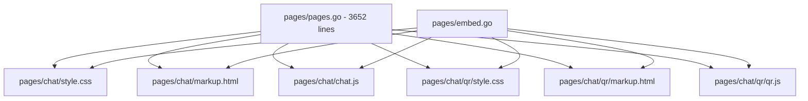

# Chat Bubble Implementation Analysis

> File: [`pages/pages.go`](pages/pages.go) — Chat page spans lines 637–3003  
> Date: 2026-05-10

---

## Table of Contents

1. [Current Architecture Assessment](#1-current-architecture-assessment)
2. [Specific Problems Identified](#2-specific-problems-identified)
3. [First-Principles Bubble Design](#3-first-principles-bubble-design)
4. [Recommended Refactoring Approach](#4-recommended-refactoring-approach)
5. [Framework Evaluation](#5-framework-evaluation)
6. [Concrete Improvement Recommendations](#6-concrete-improvement-recommendations)

---

## 1. Current Architecture Assessment

### 1.1 File Structure

The entire Chat page — HTML, CSS, and JavaScript — lives in a single Go string variable [`var Chat`](pages/pages.go:637) spanning ~2366 lines. The monolithic structure makes it difficult to:

- Navigate between related CSS rules and the JS that depends on them
- Test individual components in isolation
- Reason about CSS specificity conflicts

### 1.2 DOM Hierarchy

The message rendering pipeline produces this DOM tree:

```
div.message[.mine][.system][.attachment-message][.recalled]
├── div.avatar-stack
│   ├── div.message-avatar
│   └── div.bubble-time
└── div.message-main
    ├── div.sender              (only for non-mine, non-system)
    ├── div.bubble
    │   ├── div.text            (text messages)
    │   └── div.attachment-card (non-text messages)
    │       ├── [button|div].media-frame > [img|video].media-preview  (image/video)
    │       ├── [a|button].file-card                                     (audio/file)
    │       └── audio.audio-player                                       (audio only)
    └── div.message-footer
        ├── div.message-footer-meta
        └── div.message-footer-actions
```

### 1.3 Key CSS Rules — Bubble Lifecycle

| Selector | Lines | Purpose |
|----------|-------|---------|
| [`.bubble`](pages/pages.go:1053) | 1053–1062 | Base: `padding: 10px 14px`, `border-radius: 12px`, `overflow-wrap: anywhere` |
| [`.message:not(.system) .bubble`](pages/pages.go:1063) | 1063–1065 | Min-width for action buttons: `min-width: var(--message-actions-min-width)` |
| [`.message.mine .bubble`](pages/pages.go:1072) | 1072–1075 | Own-message green background |
| [`.message.system .bubble`](pages/pages.go:1076) | 1076–1089 | System pill: inline-flex, rounded-full |
| [`.message.attachment-message .bubble`](pages/pages.go:1121) | 1121–1130 | **Attachment override**: `display: grid`, `padding: 6px`, `overflow: hidden`, `width: fit-content` |
| [`.message:has(.attachment-card) .bubble`](pages/pages.go:1121) | 1121–1130 | Same override via `:has()` — redundancy guard |
| [`.message.mine.attachment-message .bubble`](pages/pages.go:1131) | 1131–1144 | Mine-attachment: `justify-items: end`, different bg/border |
| [`.attachment-card`](pages/pages.go:1145) | 1145–1151 | `display: grid`, `min-width: min(220px, 100%)`, `width: fit-content` |
| [`.attachment-card.file-attachment, .audio-attachment`](pages/pages.go:1152) | 1152–1155 | Fixed width: `min(320px, 100%)` |
| [`.attachment-card.media-attachment`](pages/pages.go:1156) | 1156–1158 | Variable width: `min(var(--media-width, 320px), 100%)` |
| [`.media-frame`](pages/pages.go:1168) | 1168–1177 | `aspect-ratio: var(--media-aspect-ratio, 16/9)`, `width: 100%` |
| [`.file-card`](pages/pages.go:1202) | 1202–1217 | `display: flex`, `min-height: 64px`, `width: 100%` |

### 1.4 Key JS Functions

| Function | Lines | Purpose |
|----------|-------|---------|
| [`renderMessages()`](pages/pages.go:2017) | 2017–2099 | Main render loop; adds `attachment-message` class at line 2033 |
| [`renderAttachment()`](pages/pages.go:2255) | 2255–2304 | Builds `div.attachment-card` with type-specific children |
| [`applyMediaAspect()`](pages/pages.go:2305) | 2305–2311 | Sets `--media-aspect-ratio` and `--media-width` on container |
| [`renderFileCard()`](pages/pages.go:2318) | 2318–2348 | Builds `a.file-card` or `button.file-card` |

### 1.5 Max-Width Constraint Cascade

The message max-width is set at five different breakpoints with competing rules:

| Breakpoint | Selector | Max-Width |
|------------|----------|-----------|
| Base | [`.message`](pages/pages.go:928) | `min(680px, 78%)` |
| Base | [`.message.attachment-message`](pages/pages.go:948) | `min(520px, 88%)` |
| ≥821px | [`.message`](pages/pages.go:971) | `min(680px, 61.8%)` |
| ≥821px | [`.message.attachment-message`](pages/pages.go:974) | `min(520px, 56%)` |
| ≤820px | [`.message`](pages/pages.go:1648) | `min(560px, calc(100% - 74px))` |
| ≤820px | [`.message.attachment-message`](pages/pages.go:1656) | `min(560px, calc(100% - 74px))` |
| ≤520px | [`.message`](pages/pages.go:985) | `90%` |
| ≤520px | [`.message.attachment-message`](pages/pages.go:988) | `94%` |
| hover:none | [`.message`](pages/pages.go:1345) | `min(560px, calc(100% - 74px))` |

---

## 2. Specific Problems Identified

### 2.1 Bubble Role Confusion — Container vs. Decorator

The `.bubble` element serves two fundamentally different roles:

- **Text messages**: a *decorator* — it adds background, border, padding, and border-radius around inline text content. The bubble sizes to its text content.
- **Attachment messages**: a *layout container* — it switches to `display: grid`, shrinks padding to 6px, and becomes `width: fit-content` with `overflow: hidden`. The attachment-card inside does the real sizing.

This dual role means the `.bubble` CSS is riddled with overrides. The attachment path strips away most of the base bubble styling and replaces it with container behavior, creating a fragile coupling.

### 2.2 Padding Collision — 6px Bubble Gutter vs. Inner Card Padding

For attachment messages, the bubble becomes a 6px padded grid container. But the inner elements have their own padding and border-radius:

- [`.file-card`](pages/pages.go:1202) has `padding: 10px 12px` and `border-radius: 12px`
- [`.media-frame`](pages/pages.go:1168) has `border-radius: 10px`

The result: a 6px visible gutter between the bubble border and the inner card. On small screens or narrow images this gutter wastes space and creates a double-border visual effect — the bubble border plus the file-card border plus the 6px gap.

### 2.3 Competing Width Systems

Three independent width mechanisms fight each other:

1. **Message-level `max-width`** (5+ breakpoints) — constrains the entire message grid
2. **Bubble `width: fit-content`** — attachment bubbles shrink-wrap their content
3. **Attachment-card `width`** — uses `min()` with CSS custom properties or fixed values

The interaction is non-deterministic from a readability standpoint. Example: at ≥821px, an attachment message has `max-width: min(520px, 56%)`. Inside it, the bubble is `width: fit-content`. Inside that, a `.media-attachment` card is `width: min(var(--media-width, 320px), 100%)`. But `100%` of what? The bubble's fit-content width, which depends on the card's width, which depends on the bubble. This circular dependency resolves differently across browsers.

### 2.4 `:has()` Selector Redundancy

Lines 1121–1130 declare the same rules twice:

```css
.message.attachment-message .bubble,
.message:has(.attachment-card) .bubble { ... }
```

The `.attachment-message` class is already added by JS at [line 2033](pages/pages.go:2033). The `:has()` selector is a defensive fallback, but it creates two problems:

1. **Specificity doubling**: The combined selector has higher specificity than either alone, making overrides harder.
2. **Browser support**: `:has()` is not supported in Firefox < 121 (Dec 2023). If the JS class-adding logic works correctly, the `:has()` is unnecessary; if it doesn't, the `:has()` won't save the layout because other JS-dependent styling will also fail.

### 2.5 Aspect-Ratio Flash of Wrong Size

[`applyMediaAspect()`](pages/pages.go:2305) sets `--media-aspect-ratio` and `--media-width` only after the image/video fires its `load`/`loadedmetadata` event. Before that:

- Image cards fall back to `--media-aspect-ratio: 4/3` (set by [`.attachment-card.image-attachment`](pages/pages.go:1159))
- Video cards fall back to `--media-aspect-ratio: 16/9` (set by [`.attachment-card.video-attachment`](pages/pages.go:1162))
- Both fall back to `--media-width: 320px` (set by [`.attachment-card.media-attachment`](pages/pages.go:1157))

When the actual media loads with a different aspect ratio, the card resizes, causing a visible layout shift. For portrait images (e.g., phone screenshots at 9:19.5), the 4:3 placeholder is drastically wrong.

### 2.6 Inconsistent `--media-width` Clamping

[`applyMediaAspect()`](pages/pages.go:2308) clamps the display width to `96px–360px`:

```js
var displayWidth = Math.max(96, Math.min(width, 360));
```

But the CSS fallback is `320px` ([line 1157](pages/pages.go:1157)). If a natural-width image of 350px loads, JS sets `--media-width: 350px`, which is larger than the CSS fallback of 320px. The min() in CSS caps it, but the behavioral discrepancy between the JS clamp and the CSS default is confusing.

### 2.7 Attachment-Card Grid vs. File-Card Flexbox Mismatch

[`.attachment-card`](pages/pages.go:1145) uses `display: grid`, while [`.file-card`](pages/pages.go:1202) uses `display: flex`. For audio attachments, the DOM is:

```
div.attachment-card.audio-attachment (grid)
├── a.file-card (flex)
└── audio.audio-player
```

The grid gap of `10px` ([`.audio-attachment`](pages/pages.go:1165) overrides the default `8px`) controls spacing between the file card and the audio player. But the file card itself is a flex child that takes `width: 100%` of its grid cell. This works but creates an unnecessary nesting of layout models.

### 2.8 Mobile Overrides Duplication

The 520px and 820px breakpoints both redefine attachment-card widths:

- **≤520px** ([lines 991–1002](pages/pages.go:991)): Redefines `.attachment-card` width rules
- **≤820px** ([lines 1658–1666](pages/pages.go:1658)): Redefines `.attachment-card` width rules with slightly different values

These two blocks have overlapping selectors with different values, making it unclear which takes precedence at, say, 400px width (both apply, so the 520px block wins due to cascade order).

### 2.9 No Caption/Text + Attachment Support

The current JS ([`renderMessages()`](pages/pages.go:2083)) treats messages as either text OR attachment:

```js
} else if (message.type === 'text' || isSystem) {
    // text path
} else {
    bubble.appendChild(renderAttachment(message));
}
```

There is no code path for a message that has both text and an attachment. If the server ever sends a message with both `text` and an attachment URL, the text will be silently dropped.

### 2.10 Sender Color Bleeds Into Bubble Border

At [lines 2071–2074](pages/pages.go:2071), the sender color is applied to the bubble border:

```js
var sc2 = senderColor(message.sender);
if (sc2 && !isSystem) {
    bubble.style.borderColor = sc2.border;
}
```

For attachment messages, the bubble border is already styled with specific colors ([`.message.mine.attachment-message .bubble`](pages/pages.go:1140) uses `border-color: #bdd9c7`). The inline style from JS overrides the CSS, losing the intended attachment-specific border color.

---

## 3. First-Principles Bubble Design

Starting from scratch, what should a message bubble do?

### 3.1 Core Principles

**P1: Content-Adaptive Sizing**  
A bubble should size to its content, not impose a fixed size. Text bubbles wrap text; media bubbles respect intrinsic aspect ratio; file bubbles fit their metadata row.

**P2: Single Responsibility**  
The bubble element should be a *decorator* (background, border, radius, shadow). Layout (grid, flex) should be handled by a dedicated inner container when needed.

**P3: Consistent Visual Padding**  
The visible gap between content and bubble edge should be uniform regardless of content type. Currently text has ~14px horizontal padding while attachments have ~6px bubble padding + inner card padding, creating inconsistent visual density.

**P4: No Circular Sizing Dependencies**  
Width should flow in one direction: parent → child. A child should not influence the parent's width through `fit-content` if the parent also constrains the child through `max-width: 100%`.

**P5: Zero Layout Shift**  
The bubble should reserve the correct space before media loads. This means either using known dimensions from the server or using a stable placeholder that doesn't change size on load.

**P6: Orthogonal Styling Axes**  
Content type (text/image/video/audio/file), ownership (mine/theirs), and state (recalled/system) should be independent styling axes that compose without conflicts.

### 3.2 Proposed DOM Structure

```
div.message[data-type=text|image|video|audio|file][data-owner=mine|theirs][data-state=normal|recalled|system]
├── div.avatar-stack
│   ├── div.message-avatar
│   └── div.bubble-time
└── div.message-main
    ├── div.sender              (theirs only)
    ├── div.bubble              (decorator only: bg, border, radius)
    │   └── div.bubble-content  (layout: grid/flex, padding, sizing)
    │       ├── div.text        (text messages)
    │       └── div.attachment-card (non-text)
    │           ├── .media-frame > .media-preview
    │           └── .file-card
    └── div.message-footer
```

Key change: **introduce `div.bubble-content`** as the layout container. The `.bubble` remains a pure decorator. This eliminates the need for the attachment-specific bubble overrides entirely.

### 3.3 Proposed CSS Architecture

```css
/* Bubble: decorator only */
.bubble {
    background: var(--panel);
    border: 1px solid var(--line);
    border-radius: 12px;
    overflow: hidden;            /* clips rounded corners on children */
}

/* Bubble-content: layout + padding */
.bubble-content {
    padding: 10px 14px;         /* uniform padding for all types */
}
.bubble-content:has(.attachment-card) {
    padding: 6px;               /* tighter for attachments */
}

/* Attachment-card: sizes itself */
.attachment-card {
    border-radius: 8px;         /* rounded inside bubble */
    overflow: hidden;
}
```

This way:
- `.bubble` never changes `display`, `width`, or `padding`
- `.bubble-content` handles layout and padding
- `.attachment-card` handles its own sizing
- No `display: grid` on `.bubble` needed

### 3.4 Proposed Sizing Model

```
.message  →  max-width by breakpoint (single source of truth)
  └─ .bubble  →  width: 100% (fills message-main)
      └─ .bubble-content  →  width: fit-content; max-width: 100%
          └─ .attachment-card  →  width by type (CSS custom props)
              └─ .media-frame  →  aspect-ratio + width: 100%
```

Width flows strictly top-down. No circular `fit-content` ↔ `100%` dependency.

---

## 4. Recommended Refactoring Approach

### 4.1 Should Bubble Code Be Extracted?

**Yes**, but incrementally. The 3652-line file is well beyond maintainable for a single Go string literal. However, the Go `embed` package or `html/template` are better mechanisms than manual string concatenation.

**Recommended extraction strategy:**



Step-by-step:

1. **Extract CSS** into `pages/chat/style.css` — use `//go:embed` to include it
2. **Extract JS** into `pages/chat/chat.js` — use Go template delimiters `{{` `}}` replaced at build time, or pass config via `window.__EQRTC_CONFIG__`
3. **Extract HTML skeleton** into `pages/chat/markup.html`
4. **Create `pages/embed.go`** with `//go:embed` directives to compose the final page
5. **Keep `pages/pages.go`** as the Go API surface but have it delegate to embedded files

**Why `//go:embed` over string concatenation:**

- IDE support: syntax highlighting, linting, formatting for CSS/JS/HTML
- Diff clarity: changes to CSS don't pollute the Go diff
- Testability: can validate CSS/JS independently
- No runtime cost: embed compiles to binary just like string constants

### 4.2 Migration Safety

- Keep the `var Chat` string as the fallback during migration
- Add a build tag or environment variable to switch between embedded and inline
- Run `go test ./...` after each extraction step
- Visual regression: compare screenshots before/after at each breakpoint

---

## 5. Framework Evaluation

### 5.1 Should a CSS/JS Framework Be Introduced?

| Criteria | Vanilla CSS/JS | Tailwind CSS | Alpine.js + Tailwind | Lit / Web Components |
|----------|---------------|-------------|---------------------|---------------------|
| Bundle size | 0 KB | ~10 KB (purged) | ~15 KB total | ~5 KB (lit) |
| Build tooling | None | PostCSS + config | Same + Alpine | Build step required |
| Go embed compat | ✅ Direct | ⚠️ Needs build | ⚠️ Needs build | ⚠️ Needs build |
| Template compat | ✅ `{{.Field}}` works | ✅ Works in HTML | ✅ Works in HTML | ❌ Shadow DOM blocks Go templates |
| Learning curve | None | Medium | Medium | High |
| Maintainability for this project | Low | Medium | Medium-high | High |

### 5.2 Recommendation: Stay Vanilla

**Do not introduce a framework.** Reasons:

1. **Go template integration**: The Chat page uses Go `{{.Field}}` placeholders extensively. Any framework that manipulates the DOM (Alpine, Lit) will conflict with server-rendered template values.

2. **Build complexity**: The current project has zero frontend build. Adding npm/PostCSS/vite would create a parallel toolchain that must be kept in sync with Go builds.

3. **Scope**: The Chat page has ~1000 lines of CSS and ~1300 lines of JS. This is well within vanilla maintainability, especially after file extraction.

4. **Deployment simplicity**: The current binary has no external dependencies. A build step would break `go install` and cross-compilation simplicity.

### 5.3 What About Lightweight Utilities?

Consider adopting **only** these patterns without a framework:

- **CSS custom properties cascade**: Already used for `--media-aspect-ratio`. Extend to `--bubble-padding`, `--attachment-max-width`, etc. for per-type customization without new selectors.
- **CSS `:has()` for state**: Replace JS class-toggling with `:has()` for modern browsers, with JS fallback.
- **`<template>` elements**: Move repeatable DOM fragments (file-card, media-frame) into `<template>` elements and clone them in JS instead of building DOM imperatively.

---

## 6. Concrete Improvement Recommendations

### 6.1 Fix Circular Width Dependencies

**Problem**: `.bubble` is `width: fit-content` while `.attachment-card` uses `width: min(..., 100%)`.  
**Fix**: Make `.bubble` take `width: 100%` and let `.attachment-card` be the sole width authority.

```css
/* Before (lines 1121-1130) */
.message.attachment-message .bubble {
    display: grid;
    width: fit-content;      /* ← causes circular dependency */
}

/* After */
.message.attachment-message .bubble {
    /* No display or width override needed */
    overflow: hidden;         /* clip rounded corners */
}
.message.attachment-message .bubble-content {
    display: grid;
    width: fit-content;
    max-width: 100%;
}
```

### 6.2 Unify Max-Width Declarations

**Problem**: 5+ breakpoints define attachment max-width differently.  
**Fix**: Use a single CSS custom property that scales by breakpoint.

```css
:root { --attach-max: min(520px, 88%); }
@media (min-width: 821px) { :root { --attach-max: min(520px, 56%); } }
@media (max-width: 820px) { :root { --attach-max: min(560px, calc(100% - 74px)); } }
@media (max-width: 520px) { :root { --attach-max: 94%; } }

.message.attachment-message { max-width: var(--attach-max); }
```

### 6.3 Fix Sender Color Overriding Attachment Border

**Problem**: Inline `borderColor` from JS overrides CSS attachment border colors.  
**Fix**: Only apply sender color to text bubbles.

```js
// In renderMessages(), line 2072:
if (sc2 && !isSystem && message.type === 'text') {  // ← add type check
    bubble.style.borderColor = sc2.border;
}
```

### 6.4 Fix Aspect-Ratio Layout Shift

**Problem**: Placeholder aspect ratio is wrong until media loads.  
**Fix options** (ranked by impact):

- **Option A (server-side)**: Include `width` and `height` in the message payload so the correct aspect ratio is known at render time. Best solution but requires server changes.
- **Option B (CSS containment)**: Add `contain: intrinsic-size` or `content-visibility: auto` to `.media-frame` to hint the browser about sizing.
- **Option C (skeleton placeholder)**: Use a fixed-ratio gray placeholder that doesn't change size when the media loads. Replace with actual media only after load.

Recommended: **Option A** if server changes are feasible; **Option C** as a pure-frontend fallback.

### 6.5 Add Text + Attachment Support

**Problem**: Messages can't have both text and an attachment.  
**Fix**: Update the render logic to handle both.

```js
// In renderMessages(), around line 2083:
if (message.recalled) {
    // ... recalled path
} else {
    // Always render text if present
    if (message.text && !isSystem) {
        var text = document.createElement('div');
        text.className = 'text';
        text.textContent = message.text;
        bubble.appendChild(text);
    }
    // Also render attachment if present
    if (message.type !== 'text' && !isSystem) {
        bubble.appendChild(renderAttachment(message));
    }
    // System messages are text-only
    if (isSystem) {
        var text = document.createElement('div');
        text.className = 'text';
        text.textContent = message.text || '';
        bubble.appendChild(text);
    }
}
```

### 6.6 Extract CSS/JS into Separate Files

**Problem**: 3652-line monolithic Go string.  
**Fix**: Use `//go:embed` to separate concerns.

See [Section 4.1](#41-should-bubble-code-be-extracted) for the full extraction plan. Priority order:

1. Extract CSS → `pages/chat/style.css`
2. Extract JS → `pages/chat/chat.js`
3. Extract HTML → `pages/chat/markup.html`
4. Create `pages/embed.go` with `//go:embed` directives

### 6.7 Remove `:has()` Redundancy

**Problem**: Double-declaration of attachment bubble styles.  
**Fix**: Remove the `:has()` variants and rely on the `.attachment-message` class added by JS.

```css
/* Before (lines 1121-1130) */
.message.attachment-message .bubble,
.message:has(.attachment-card) .bubble { ... }

/* After */
.message.attachment-message .bubble { ... }
```

If `:has()` is desired for robustness, keep it but in a **separate rule** with the same declarations, not combined — this avoids specificity inflation.

### 6.8 Consolidate Mobile Override Blocks

**Problem**: Two overlapping mobile blocks (≤520px and ≤820px) define attachment-card widths with different values.  
**Fix**: Use a single cascading custom property.

```css
.attachment-card { --attach-card-width: min(320px, 100%); }
.attachment-card.media-attachment { --attach-card-width: min(var(--media-width, 320px), 100%); }

@media (max-width: 820px) {
    .attachment-card { min-width: 0; max-width: 100%; }
}
@media (max-width: 520px) {
    .attachment-card { min-width: 0; max-width: 100%; width: var(--attach-card-width); }
}
```

---

## Summary of Issues by Severity

| # | Issue | Severity | Effort | Section |
|---|-------|----------|--------|---------|
| 1 | Circular width dependency (bubble ↔ attachment-card) | 🔴 High | Low | 2.3, 6.1 |
| 2 | Sender color overrides attachment border | 🔴 High | Low | 2.10, 6.3 |
| 3 | Aspect-ratio layout shift on media load | 🟡 Medium | Medium | 2.5, 6.4 |
| 4 | Bubble role confusion (decorator vs container) | 🟡 Medium | Medium | 2.1, 3.2 |
| 5 | No text + attachment support | 🟡 Medium | Low | 2.9, 6.5 |
| 6 | `:has()` redundancy inflating specificity | 🟢 Low | Low | 2.4, 6.7 |
| 7 | Padding collision (6px gutter + inner card padding) | 🟢 Low | Low | 2.2 |
| 8 | Inconsistent `--media-width` clamping | 🟢 Low | Low | 2.6 |
| 9 | Grid/flexbox nesting mismatch | 🟢 Low | Low | 2.7 |
| 10 | Mobile overrides duplication | 🟢 Low | Low | 2.8, 6.8 |
| 11 | Monolithic 3652-line file | 🔵 Structural | Medium | 2.1, 4.1, 6.6 |

---

## Proposed Implementation Order

1. **Fix sender color override** (6.3) — one-line JS change, immediate visual fix
2. **Fix circular width dependency** (6.1) — introduce `.bubble-content`, remove grid from `.bubble`
3. **Add text + attachment support** (6.5) — enable combined messages
4. **Unify max-width declarations** (6.2) — consolidate to CSS custom properties
5. **Fix aspect-ratio layout shift** (6.4) — server-side dimensions or skeleton placeholder
6. **Remove `:has()` redundancy** (6.7) — clean up specificity
7. **Consolidate mobile overrides** (6.8) — single cascading system
8. **Extract CSS/JS/HTML** (6.6) — `//go:embed` migration
