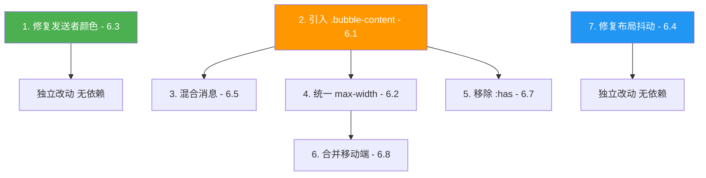

# Chat Bubble 优化：效果 vs 风险评估报告

> 日期：2026-05-10  
> 基于：[`docs/chat-bubble-analysis.md`](chat-bubble-analysis.md)  
> 代码入口：[`pages/pages.go`](pages/pages.go) — Chat 页面 637–3003 行

---

## 概览

本报告针对 7 项 chat bubble 优化，逐一分析**当前问题、优化后效果、潜在风险、风险缓解**，并给出总体实施建议。

| # | 优化项 | 严重度 | 影响范围 | 风险等级 |
|---|--------|--------|----------|----------|
| 1 | 修复发送者颜色覆盖附件边框 (6.3) | 🔴 高 | JS 1 行 | 🟢 低 |
| 2 | 引入 .bubble-content 消除循环宽度依赖 (6.1) | 🔴 高 | CSS + JS + DOM | 🟡 中 |
| 3 | 支持文字+附件混合消息 (6.5) | 🟡 中 | JS renderMessages | 🟡 中 |
| 4 | 用 CSS 自定义属性统一 max-width (6.2) | 🟡 中 | CSS 5+ 处 | 🟢 低 |
| 5 | 移除 :has() 冗余选择器 (6.7) | 🟢 低 | CSS 选择器 | 🟡 中 |
| 6 | 合并移动端覆盖块 (6.8) | 🟢 低 | CSS 2 个 media query | 🟢 低 |
| 7 | 修复宽高比布局抖动 (6.4) | 🟡 中 | CSS + 可选服务端 | 🟡 中 |

---

## 逐项评估

### 1. 修复发送者颜色覆盖附件边框 (6.3)

**当前代码**：[`pages.go:2072`](pages/pages.go:2072)

```js
if (sc2 && !isSystem) {
    bubble.style.borderColor = sc2.border;
}
```

#### 当前问题

对方用户发送的附件消息，其气泡边框在 CSS 中已被设为 `#bdd9c7`（自己的）或默认值（对方的），但 JS 的 inline `borderColor` 会覆盖 CSS 规则。结果是：

- 附件气泡边框颜色变成发送者调色板中的颜色，与气泡背景不协调
- 自己的附件气泡 `border-color: #bdd9c7` 被覆盖为用户调色板颜色，视觉上出现绿色气泡 + 紫色/蓝色边框的不协调组合
- 用户可直接观察到：附件消息的边框颜色随机变化（取决于发送者在调色板中的索引），而文本消息的边框颜色变化是预期行为

#### 优化后效果

- 附件气泡的边框颜色回归 CSS 定义的 `#bdd9c7`（自己）或默认值（对方），视觉一致
- 文本气泡的发送者颜色标记功能不受影响
- 一行 JS 修改：`if (sc2 && !isSystem && message.type === 'text')`

#### 潜在风险

| 风险 | 可能性 | 说明 |
|------|--------|------|
| 对方的文本气泡仍显示发送者颜色，但附件不再显示，视觉一致性可能让人困惑 | 低 | 文本和附件本身就是不同的视觉形态，边框颜色区分是合理的 |
| `message.type` 未定义时条件判断异常 | 极低 | 服务端所有消息必有 `type` 字段，否则无法进入渲染流程 |

#### 风险缓解

- 无需额外缓解，改动范围极小，回归风险近零
- 可在浏览器 DevTools 中验证：发送附件后检查 inline style 是否不再含 `borderColor`

---

### 2. 引入 .bubble-content 消除循环宽度依赖 (6.1)

**当前代码**：[`pages.go:1121-1130`](pages/pages.go:1121)

```css
.message.attachment-message .bubble {
    display: grid;
    width: fit-content;   /* ← 与 .attachment-card 的 width: min(..., 100%) 形成循环 */
}
```

#### 当前问题

- `.bubble` 设为 `width: fit-content`，宽度依赖子元素 `.attachment-card`
- `.attachment-card` 设为 `width: min(var(--media-width, 320px), 100%)`，其中 `100%` 依赖父元素 `.bubble`
- 循环依赖在不同浏览器中解析结果不同，可能导致：
  - 附件卡片被意外拉伸到整行宽度
  - 附件卡片宽度被压缩到最小值
  - 窗口缩放时宽度跳动

#### 优化后效果

- 新增 `div.bubble-content` 层：`.bubble` 仅保留装饰职责（background, border, border-radius），`.bubble-content` 负责布局（display: grid, width: fit-content, max-width: 100%）
- 宽度流向变为单向：`.message` → `.bubble`(width: 100%) → `.bubble-content`(width: fit-content, max-width: 100%) → `.attachment-card`(width by type)
- 消除循环依赖，跨浏览器行为一致

#### 潜在风险

| 风险 | 可能性 | 说明 |
|------|--------|------|
| DOM 结构变更导致现有 CSS 选择器失效 | 中 | 4 组选择器引用 `.message.attachment-message .bubble`，需同步改为 `.bubble-content`；遗漏任一处即样式回归 |
| JS `renderMessages()` 须在 `.bubble` 内创建 `.bubble-content`，影响所有消息类型 | 中 | 文本消息也需要包裹 `.bubble-content`，否则文本气泡缺少 padding |
| 测试字符串匹配可能失败 | 低 | [`chat_test.go:145`](server/chat_test.go:145) 检查 `.message:not(.system):not(:has(.attachment-card)) .bubble` 字符串存在性，若选择器改写需同步更新测试 |
| 视觉回归：padding 来源从 `.bubble` 移到 `.bubble-content`，微调不当可能导致视觉间距变化 | 中 | 需精确迁移 `padding: 10px 14px` 和 `padding: 6px` 的归属 |

#### 风险缓解

1. **分步迁移**：先在 JS 中为所有消息添加 `.bubble-content`，CSS 中 `.bubble-content` 继承原 `.bubble` 的 padding；验证无回归后再逐步将布局属性从 `.bubble` 移到 `.bubble-content`
2. **全局搜索替换**：用 `grep -n '\.bubble'` 确认所有 CSS 选择器都已覆盖
3. **多浏览器测试**：Chrome、Firefox、Safari 各测试文本/附件/混合消息的宽度行为
4. **更新测试**：同步更新 [`chat_test.go`](server/chat_test.go) 中的字符串检查

---

### 3. 支持文字+附件混合消息 (6.5)

**当前代码**：[`pages.go:2083-2090`](pages/pages.go:2083)

```js
} else if (message.type === 'text' || isSystem) {
    // 纯文本路径
} else {
    bubble.appendChild(renderAttachment(message));  // 纯附件路径——文字被丢弃
}
```

#### 当前问题

- 消息只能是文本 **或** 附件，两者互斥
- 如果服务端未来发送 `type: 'image'` 且同时带 `text` 字段，文字内容被静默丢弃
- 用户无法为附件添加说明文字

#### 优化后效果

- 文本和附件可同时渲染在同一个气泡中
- 文字在上方，附件在下方（或反之，取决于实现）
- 为未来的"附件+说明"功能铺路

#### 潜在风险

| 风险 | 可能性 | 说明 |
|------|--------|------|
| 现有消息数据中不存在混合类型，此改动在当前无实际触发场景 | — | 改动本身安全但短期无用户可观测效果 |
| 混合消息的 CSS 布局需额外处理：文本 `div.text` 和 `div.attachment-card` 在同一 `.bubble` 内的间距、对齐 | 中 | 当前 `.bubble` 对附件使用 `display: grid`，加入 `.text` 后需调整 grid 行定义 |
| 混合消息的 `attachment-message` class 逻辑可能冲突 | 中 | 若消息同时有 text 和 attachment，是否加 `attachment-message` class？加了则文本也受 grid 布局影响，不加则附件样式不生效 |
| `renderAttachment()` 内部假设它是气泡的唯一子元素 | 低 | 检查 `renderAttachment()` 代码，确认其不依赖父元素结构 |

#### 风险缓解

1. **明确 class 策略**：混合消息加 `attachment-message` class，文本通过 `.bubble-content` 的 padding 获得间距，不受 grid 影响
2. **渐进实现**：先只改 JS 逻辑允许两者共存，CSS 调整配合优化项 #2（`.bubble-content`）一起完成
3. **添加边界测试**：在 [`chat_test.go`](server/chat_test.go) 中添加混合消息渲染的字符串检查

---

### 4. 用 CSS 自定义属性统一 max-width (6.2)

**当前代码**：5 处 max-width 散落在不同断点

| 位置 | 选择器 | max-width |
|------|--------|-----------|
| [`pages.go:948-951`](pages/pages.go:948) | `.message.attachment-message` (base) | `min(520px, 88%)` |
| [`pages.go:973-976`](pages/pages.go:973) | `.message.attachment-message` (≥821px) | `min(520px, 56%)` |
| [`pages.go:987-990`](pages/pages.go:987) | `.message.attachment-message` (≤520px) | `94%` |
| [`pages.go:1656-1657`](pages/pages.go:1656) | `.message.attachment-message` (≤820px) | `min(560px, calc(100% - 74px))` |

#### 当前问题

- 4 个断点各自硬编码附件 max-width，修改一处容易遗漏其他
- 不同断点的值之间无显式关联，难以理解整体宽度策略
- 新增断点时需要再复制一份

#### 优化后效果

- 单一 CSS 自定义属性 `--attach-max` 在 `:root` 按断点赋值，一处修改全局生效
- 代码行数减少，逻辑更清晰
- 未来调整宽度只需改 `:root` 中的自定义属性

```css
:root { --attach-max: min(520px, 88%); }
@media (min-width: 821px) { :root { --attach-max: min(520px, 56%); } }
@media (max-width: 820px) { :root { --attach-max: min(560px, calc(100% - 74px)); } }
@media (max-width: 520px) { :root { --attach-max: 94%; } }
.message.attachment-message { max-width: var(--attach-max); }
```

#### 潜在风险

| 风险 | 可能性 | 说明 |
|------|--------|------|
| CSS 自定义属性在 `:root` 级别定义，可能被非附件消息意外继承 | 极低 | `var()` 只在被引用时生效，不引用不产生副作用 |
| 原选择器中 `.message:has(.attachment-card)` 也需统一替换 | 低 | 配合优化项 #5（移除 `:has()`）一起处理即可 |
| 测试字符串检查 `min(520px, 88%)` 等可能因改写为 `var(--attach-max)` 而失败 | 低 | 当前测试未直接检查这些值，但需确认 |

#### 风险缓解

1. 逐一替换 4 处硬编码为 `var(--attach-max)`，每次替换后视觉验证
2. 在各断点下截图对比替换前后的附件宽度
3. 确认 [`chat_test.go`](server/chat_test.go) 不检查被替换的硬编码值

---

### 5. 移除 :has() 冗余选择器 (6.7)

**当前代码**：[`pages.go:1121-1144`](pages/pages.go:1121)

```css
.message.attachment-message .bubble,
.message:has(.attachment-card) .bubble { ... }
```

`:has()` 选择器在 4 组规则中与 `.attachment-message` class 配对出现。

#### 当前问题

- `.attachment-message` class 由 JS 在 [`pages.go:2033`](pages/pages.go:2033) 添加，已保证正确性
- `:has()` 作为防御性回退，但增加了选择器特异性（两个选择器合并声明 = 特异性取两者中较高的）
- `:has()` 在 Firefox < 121（2023年12月前）不支持
- 合并声明使得覆盖样式时需要匹配更高的特异性

#### 优化后效果

- 选择器简化为 `.message.attachment-message .bubble`
- 特异性降低，便于后续覆盖和扩展
- 代码更清晰，减少认知负担

#### 潜在风险

| 风险 | 可能性 | 说明 |
|------|--------|------|
| JS 添加 `.attachment-message` class 的逻辑失效时，`:has()` 不再作为兜底 | 低 | 若 JS 逻辑失效，整个渲染流程都会出错，`:has()` 兜底无法拯救；且当前 JS 逻辑已稳定运行 |
| 移除 `:has()` 后，需要更新 4 组选择器对，遗漏任一处会导致部分样式失效 | 中 | 4 组规则分布在 1121-1144 行之间，需逐一拆分 |
| 测试 [`chat_test.go:145`](server/chat_test.go:145) 检查 `:has(.attachment-card)` 字符串存在性 | 中 | 移除后测试会失败，需同步更新 |

#### 风险缓解

1. **全量搜索**：`grep -n ':has(.attachment-card)' pages/pages.go` 确认所有出现位置
2. **同步更新测试**：修改 [`chat_test.go:145`](server/chat_test.go:145) 中的字符串检查
3. **保留 `:has()` 作为独立规则（可选折中）**：不合并声明，而是分开写两条规则，保持特异性不膨胀但保留兜底

---

### 6. 合并移动端覆盖块 (6.8)

**当前代码**：

- ≤520px 断点（[`pages.go:991-1002`](pages/pages.go:991)）：定义 `.attachment-card` 宽度
- ≤820px 断点（[`pages.go:1658-1666`](pages/pages.go:1658)）：定义 `.attachment-card` 宽度（值不同）

#### 当前问题

- 两个断点重叠定义 `.attachment-card` 宽度，400px 宽度下两个规则同时生效，靠级联顺序决定最终值
- 维护者难以判断哪个断点在特定宽度下生效
- 修改移动端附件宽度需要改两处

#### 优化后效果

- 用 CSS 自定义属性 `--attach-card-width` 在 `.attachment-card` 上定义默认值
- 各断点只覆盖自定义属性值，不重复写完整规则
- 级联关系清晰：断点越小，覆盖越晚，自然生效

#### 潜在风险

| 风险 | 可能性 | 说明 |
|------|--------|------|
| 自定义属性继承可能导致嵌套元素意外获得父级宽度值 | 低 | `--attach-card-width` 定义在 `.attachment-card` 上，不向上继承 |
| 原有两个断点的值不同，合并后需确保级联顺序正确 | 低 | CSS 的级联规则保证后声明的 `@media` 覆盖先声明的，行为不变 |

#### 风险缓解

1. 在 400px、520px、820px 三个宽度点截图对比合并前后的附件卡片宽度
2. 此项改动范围小且逻辑简单，回归风险很低

---

### 7. 修复宽高比布局抖动 (6.4)

**当前代码**：[`pages.go:2305-2311`](pages/pages.go:2305) — `applyMediaAspect()` 在媒体加载后才设置 `--media-aspect-ratio`

#### 当前问题

- 图片/视频加载前，使用 CSS 默认的 4:3（图片）或 16:9（视频）占位比
- 实际媒体加载后，宽高比切换导致卡片尺寸突变
- 对于竖屏截图（如 9:19.5），从 4:3 切换到实际比时跳动尤为明显
- 用户在弱网环境下看到明显的布局重排

#### 优化后效果

**方案 A（服务端提供尺寸，推荐）**：
- 服务端在消息 payload 中包含 `width` 和 `height` 字段
- JS 渲染时直接设置正确的 `--media-aspect-ratio` 和 `--media-width`
- 加载前后零布局位移

**方案 B（CSS containment）**：
- 给 `.media-frame` 添加 `contain: intrinsic-size` 或 `content-visibility: auto`
- 提示浏览器预留空间，减少重排

**方案 C（骨架占位）**：
- 使用固定比例灰色占位块，媒体加载完成后替换
- 视觉上更平滑但仍有尺寸变化

#### 潜在风险

| 风险 | 可能性 | 说明 |
|------|--------|------|
| 方案 A 需要服务端修改（`chatMessage` 结构体增加字段），影响面扩大 | 中 | 需要修改 `server/chat.go` 中的消息结构和附件保存逻辑 |
| 方案 B 的 `contain: intrinsic-size` 浏览器支持有限 | 中 | Chrome 103+ 支持，Firefox 支持较晚；需检查目标浏览器兼容性 |
| 方案 C 的骨架占位在快速网络下反而增加闪烁（灰色→内容） | 低 | 可通过短暂延迟（如 100ms 后才显示骨架）缓解 |
| 任何方案都可能与 `applyMediaAspect()` 现有逻辑冲突 | 低 | 需确保加载后不重复设置已设置的属性 |

#### 风险缓解

1. **优先选方案 B**（纯 CSS，零 JS 改动），如果兼容性不满足则退回方案 C
2. 方案 A 作为后续迭代目标，本次不实施（避免同时改动前后端）
3. 在 `.media-frame` 上设置 `min-height` 作为基础占位，避免 0 高度闪烁
4. 各方案均需在慢速 3G 模拟下测试布局稳定性

---

## 总体评估

### 依赖关系图



- **绿色**：低风险，可独立实施
- **橙色**：中风险，是后续多项改动的基础
- **蓝色**：独立改动，但方案选择影响风险等级

### 分批实施建议

#### 第一批：低风险即时修复（建议立即实施）

| 项 | 改动量 | 回归风险 |
|----|--------|----------|
| 1. 修复发送者颜色覆盖 (6.3) | JS 1 行 | 极低 |
| 5. 移除 :has() 冗余选择器 (6.7) | CSS 4 组选择器 + 测试 1 行 | 低 |
| 6. 合并移动端覆盖块 (6.8) | CSS 2 个 media query | 低 |

**理由**：这三项改动量小、边界清晰、互不依赖。6.7 和 6.8 虽然改动 CSS，但不涉及 DOM 结构变更。6.3 是纯 JS 逻辑修复。合计改动约 20 行，可一次性提交。

**验证方式**：
- `go test ./server` — 确认测试通过（含 [`chat_test.go`](server/chat_test.go) 字符串检查更新）
- 浏览器手动测试：发送/接收文本和附件，检查边框颜色、选择器行为、移动端宽度

#### 第二批：结构性重构（建议第二批实施）

| 项 | 改动量 | 回归风险 |
|----|--------|----------|
| 2. 引入 .bubble-content (6.1) | CSS ~30 行 + JS ~10 行 + DOM 变更 | 中 |
| 4. 统一 max-width (6.2) | CSS ~15 行 | 低 |

**理由**：6.1 是核心结构变更，为 6.5（混合消息）铺路。6.2 依赖 6.1 完成后的新结构。6.1 的风险在于 DOM 层级变更可能导致 CSS 选择器遗漏，但通过分步迁移（先加 `.bubble-content` 不改旧样式 → 验证 → 逐步迁移属性）可将风险降至最低。

**验证方式**：
- 多浏览器测试：Chrome、Firefox、Safari
- 响应式断点测试：375px、520px、820px、1024px、1440px
- 消息类型全覆盖：文本、图片、视频、音频、文件、recalled

#### 第三批：功能增强（建议第三批实施）

| 项 | 改动量 | 回归风险 |
|----|--------|----------|
| 3. 支持混合消息 (6.5) | JS ~15 行 + CSS ~10 行 | 中 |
| 7. 修复布局抖动 (6.4) | CSS ~5 行（方案 B）或 JS + CSS ~20 行（方案 C） | 中 |

**理由**：6.5 依赖 6.1 的 `.bubble-content` 结构。6.4 相对独立但方案选择影响改动量。两者都在前两批稳定后再做，降低整体风险。

**验证方式**：
- 6.5：构造含 text + attachment 的测试消息，验证渲染结果
- 6.4：慢速网络模拟下测试媒体加载布局稳定性

### 整体风险评估

**这 7 项一起做是否安全？**

**不建议一次性全部实施。** 原因：

1. **优化项 #2（.bubble-content）改变 DOM 结构**，影响所有消息类型的渲染路径，是最核心也最敏感的改动。如果与其他改动同时进行，出现回归时难以定位原因。

2. **优化项 #3（混合消息）和 #7（布局抖动）在当前无用户可触发的场景**，属于预防性增强，优先级可降低。

3. **分 3 批实施的总时间成本与一次性实施差异不大**，但分批可以将每次的验证范围缩小，问题发现更早、定位更快。

### 测试策略

每批完成后执行：

```sh
# 1. 单元测试
go test ./server ./cmd

# 2. 字符串完整性检查（确保关键 CSS/JS 片段未被意外删除）
go test ./server -run TestChatPage

# 3. 手动验收（浏览器）
# - 发送/接收文本消息
# - 发送/接收图片附件（横屏+竖屏）
# - 发送/接收文件附件
# - 窗口缩放至 375px / 520px / 820px / 1024px
# - 检查发送者颜色是否只影响文本气泡边框
# - 检查附件气泡边框是否使用 CSS 定义的颜色
```

---

## 结论

| 批次 | 包含项 | 预期净效果 | 风险等级 |
|------|--------|-----------|----------|
| 第一批 | #1 + #5 + #6 | 修复附件边框颜色错误、降低选择器特异性、简化移动端 CSS | 🟢 低 |
| 第二批 | #2 + #4 | 消除循环宽度依赖、统一 max-width 管理 | 🟡 中 |
| 第三批 | #3 + #7 | 支持混合消息、消除媒体加载布局抖动 | 🟡 中 |

**总体判断**：7 项优化均指向真实问题，不会引入功能性倒退。关键风险集中在 #2（DOM 结构变更），通过分批实施和分步迁移策略可有效控制。第一批可立即安全实施，第二批和第三批建议在前一批验证通过后依次推进。
