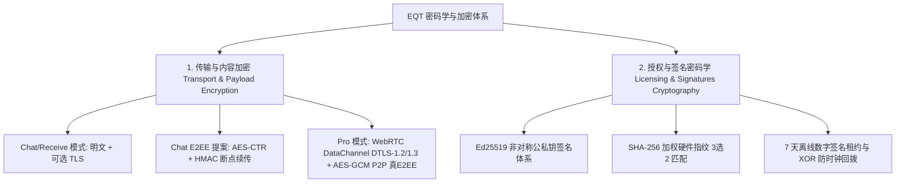

# EQT 密码学与加密体系总总览 (Cryptographic Architecture & Docs Index)

本目录集中管理 EQT（Easy QR Transfer）项目在 **传输与内容加密** 以及 **授权与数字签名密码学** 两个维度的技术规范、现状评估与设计提案。

整理与重构基准日期：**2026-08-02**（代码版本 **v1.17.5**）。

---

## 一、加密体系架构分类

EQT 项目包含两大独立的密码学/加密应用场景：

---

## 二、加密文档清单与状态

| 类别 | 文档 | 状态 | 说明 |
| :--- | :--- | :---: | :--- |
| **总览/现状** | 本文件（`docs/crypto/README.md`） | ✅ 现行规范 | 整体加密体系架构、技术对比与重复文档去重整理记录 |
| **内容加密** | [`resumable-e2ee-design.md`](./resumable-e2ee-design.md) | 📘 设计提案 | Chat/Receive 模式 AES-CTR 端到端加密 + 断点续传计数器对齐设计规范 |
| **内容加密** | [`resumable-transfer.md`](./resumable-transfer.md) | 📘 设计提案 | 分片断点续传传输协议（含加密协同缺口分析） |
| **内容加密** | [`docs/pro/architecture-and-design.md`](../pro/architecture-and-design.md) | 📘 架构规范 | Pro 版 WebRTC DataChannel（DTLS-1.2/1.3 + AES-GCM）底层 P2P E2EE 加密 |
| **授权密码学** | [`drm-crypto-spec.md`](./drm-crypto-spec.md) | ✅ 现行规范 | **DRM 授权密码学规范**：Ed25519 双层签名、SHA-256 硬件指纹算法与防篡改锁 |
| **授权业务流** | [`docs/payment/drm-flow.md`](../payment/drm-flow.md) | ✅ 现行规范 | DRM 离线证书校验、在线对账与设备绑定业务流 |
| **安全边界** | [`docs/security-notes.md`](../security-notes.md) | ✅ 现行规范 | 项目全局安全模型与传输层访问边界 |

---

## 三、传输与内容加密 (Transport & Payload Encryption) 现状与分析

### 1. Chat V2 现行传输现状
* **现状**：内容层**无加密**。控制面（WebSocket）与数据面（HTTP multipart `/upload`、P2P 直连流 `/upload/stream`、下载 `/files/{id}`）均为明文。在配置 `--secure` 后启用传输层 **TLS (HTTPS/WSS)**。
* **安全边界**：依靠随机生成的 URL Token 提供混淆防扫描。
* **局限**：未配置 `--secure` 时非受信 Wi-Fi 可被嗅探；无消息级/文件级数字签名与完整性校验。

### 2. E2EE 设计提案审查 (AES-CTR + HMAC)
* **方案**：`resumable-e2ee-design.md` 提出了基于会话 Token 经 HKDF 派生密钥，使用 **AES-CTR** 结合密文字节偏移精确换算初始计数器（`startCounter + floor(N/16)`）实现无缝断点续传。
* **必要的密码学补丁**：AES-CTR 无完整性保护，必须引入 **HMAC-SHA256 (Encrypt-then-MAC)** 或 AES-GCM 分块，且每文件必须使用独立随机 Nonce 防范密钥流复用。

### 3. Pro 版 WebRTC 物理 E2EE
* **方案**：与提案的 Token 派生密钥不同，Pro 档使用标准的 **WebRTC DataChannel (DTLS-1.2/1.3 + AES-GCM)**，云端信令服务仅透传 SDP/ICE 载荷，文件数据在两端 P2P 直连通道中加密传输，服务端无从解密。

---

## 四、授权与数字签名密码学 (Licensing Cryptography) 规范

有关 DRM 授权防护的完整密码学细节已归一化整理至 [`drm-crypto-spec.md`](./drm-crypto-spec.md)：

1. **Ed25519 数字签名**：
   - **私钥**：仅存储于 Cloudflare Worker 端；
   - **公钥**：`08443678fe8bd16e3bc306db8a08b6ea1dcf3e8edeb413f655e106374bed43ac`，客户端只读验签。
   - **双层签名**：`signature` 保护授权与到期日；`verify_signature` 保护 7 天在线对账租约与服务端时间戳。
2. **加权硬件指纹 SHA-256 摘要**：
   - 主板 UUID、CPU ID、系统盘 Serial 经 `lowercase + trim + SHA-256` 导出哈希。
   - **3选2 比对与空值防呆**：空字符串或无效特征不计入匹配，且任何空值参与的比对均直接判定不匹配，防止空匹配安全风险。
3. **防篡改与防时钟回拨**：
   - 本地 XOR 混淆最新时间戳写入；检测到系统时间回拨超过 10 分钟自动置 `ClockTampered` 标志并锁死付费权限。

---

## 五、重复文档清理与整理记录

本次整理针对项目中关于“加密/密码学”重复分散的文档进行了彻底清理与收口：

1. **DRM 授权密码学与反破解重复文档清理**：
   - **原重复现象**：`docs/payment/licensing-architecture.md` 与 `docs/payment/drm-flow.md` 在 Ed25519 签名载荷、3选2 硬件指纹比对、时钟防回拨上有大量的文字与结构重复，且 `licensing-architecture.md` 中的代码路径已陈旧（如 `cloudflare/src/index.ts`）。
   - **清理动作**：提取核心密码学算子与算法规范，新建 [`docs/crypto/drm-crypto-spec.md`](./drm-crypto-spec.md)；同时重构 `docs/payment/licensing-architecture.md` 为指引索引，消除了 `docs/payment/` 目录下的重复。
2. **内容加密与断点续传重复/协同澄清**：
   - **原重复现象**：`resumable-e2ee-design.md` 与 `resumable-transfer.md` 分别从加密角度和传输协议角度阐述断点续传，存在重合描述。
   - **清理动作**：在两份文档头部增加互查交叉引用，并在 `resumable-transfer.md` §6.1 明确标注分片 HMAC 认证的密码学补丁，使协议层与加密层责任界限清晰。
3. **全局加密索引收口**：
   - 将原仅关注 Chat 现状的 `docs/crypto/README.md` 升级为全项目密码学与加密规范总索引（包含传输/内容加密与授权签名密码学两大系统）。

---

## 六、交叉引用

- [`docs/crypto/drm-crypto-spec.md`](./drm-crypto-spec.md) — EQT DRM 授权密码学与数字签名规范
- [`docs/crypto/resumable-e2ee-design.md`](./resumable-e2ee-design.md) — AES-CTR 端到端加密与断点续传协同设计
- [`docs/crypto/resumable-transfer.md`](./resumable-transfer.md) — EQT 局域网断点续传系统设计方案
- [`docs/payment/drm-flow.md`](../payment/drm-flow.md) — DRM 业务交互与运行时流程
- [`docs/security-notes.md`](../security-notes.md) — 项目全局安全边界
- [`docs/pro/architecture-and-design.md`](../pro/architecture-and-design.md) — Pro 版 WebRTC P2P 端到端加密架构
