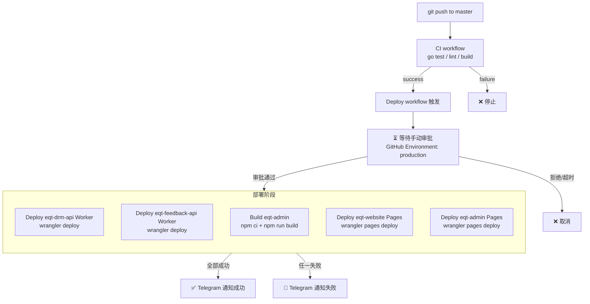
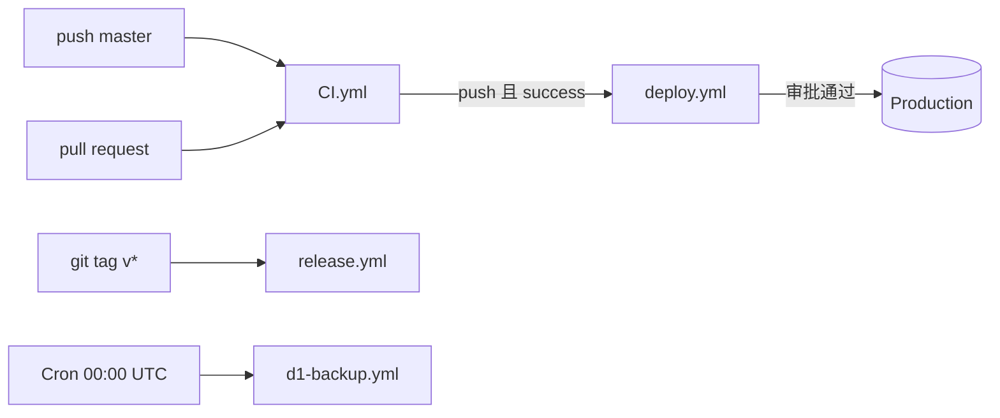
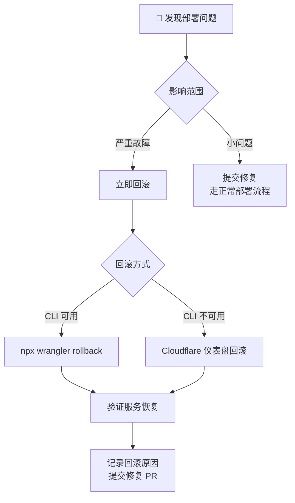
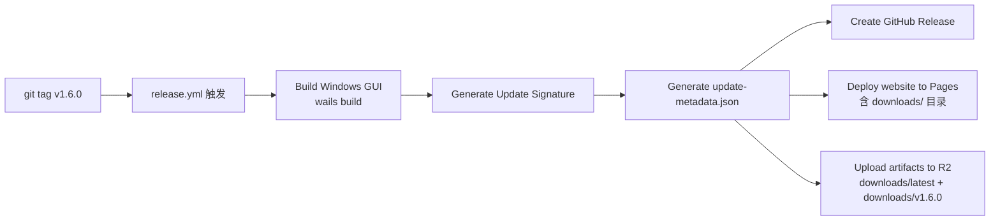

# EQT 部署流水线

> 本文档说明 EQT 项目的部署架构、自动/手动部署流程及各项目的部署特点。
> 最后更新：2026-08-07
>
> 关联文档：[基础设施可观测性](../report/infrastructure-observability.md)（P2 #13 回滚策略）
> 测试环境搭建：[test-environment.md](./test-environment.md)；GUI 环境开关：[gui-environment.md](./gui-environment.md)
> **测试/生产对照执行手册（操作前必读）**：[environment-runbook.md](./environment-runbook.md)

---

## 目录

1. [部署架构总览](#1-部署架构总览)
2. [自动部署流水线](#2-自动部署流水线)
3. [手动部署场景](#3-手动部署场景)
4. [回滚策略](#4-回滚策略)
5. [各项目部署特点](#5-各项目部署特点)
6. [发布流程](#6-发布流程)
7. [D1 数据库备份](#7-d1-数据库备份)
8. [环境配置指南](#8-环境配置指南)
9. [验证清单](#9-验证清单)
10. [故障排查](#10-故障排查)
11. [测试环境](#11-测试环境)

> 每个操作先查 [environment-runbook.md](./environment-runbook.md)：环境对照总表（§2）、执行方式对照（§3）、测试执行步骤（§4）、生产清理（§5）、防混淆清单（§6）。

---

## 1. 部署架构总览

### 1.1 部署对象

| 项目 | 类型 | 域名 | 部署方式 |
|---|---|---|---|
| `eqt-drm-api` | Cloudflare Worker | `lic.eqt.net.im` `download.eqt.net.im` | 自动（审批后） |
| `eqt-feedback-api` | Cloudflare Worker | `feedback.eqt.net.im` | 自动（审批后） |
| `eqt-website` | Cloudflare Pages | `www.eqt.net.im` | 自动（审批后） |
| `eqt-admin` | Cloudflare Pages + Functions | admin dashboard | 自动（审批后） |
| `eqt-desktop` | Windows Wails GUI | — | 手动打 tag 发布 |
| 测试环境 | Worker（workers.dev 子域）+ D1/R2（-test） | — | 自动（dev 分支，无审批） |

### 1.2 流水线总览



### 1.3 触发关系



---

## 2. 自动部署流水线

### 2.1 工作流文件

`.github/workflows/deploy.yml`

### 2.2 触发条件

- **事件**: `workflow_run` on `CI` workflow completed
- **分支**: `master`
- **额外守卫**: 仅 `push` 事件触发的 CI 通过后才部署（排除 PR 触发的 CI）
- **并发**: 同一时间只允许一个部署运行（`concurrency: deploy-master`）

### 2.3 执行流程

```
push to master
    │
    ▼
CI workflow 运行（go test / lint / frontend build）
    │
    ├── CI 失败 → ❌ 停止，不触发部署
    │
    └── CI 通过
            │
            ▼
        Deploy workflow 触发
            │
            ▼
        ⏳ 进入 Pending 状态
        GitHub Environment "production"
        （等待 Required reviewer 审批）
            │
            ├── 审批通过
            │       │
            │       ▼
            │   按顺序执行:
            │   1. npm ci（安装 wrangler）
            │   2. wrangler deploy eqt-drm-api
            │   3. wrangler deploy eqt-feedback-api
            │   4. npm ci + npm run build（eqt-admin）
            │   5. wrangler pages deploy eqt-website
            │   6. wrangler pages deploy eqt-admin
            │       │
            │       ├── 全部成功 → ✅ Telegram 通知
            │       └── 任一失败 → 🚨 Telegram 通知
            │
            └── 拒绝/超时 → ❌ 取消，不部署
```

### 2.4 审批操作步骤

1. push 到 master 后，等待 CI 完成
2. 打开 GitHub → **Actions** → **Deploy** workflow
3. 看到黄色 ⏳ 状态的 `Deploy to Production` job
4. 点击 **Review deployments**
5. 选择 **Approve and deploy**
6. 等待部署完成，检查 Telegram 通知

---

## 3. 手动部署场景

### 3.1 紧急热修复（跳过审批）

当需要跳过审批流程直接部署时，在本地执行：

```bash
# 部署 eqt-drm-api
cd cloudflare/eqt-drm-api
npx wrangler deploy

# 部署 eqt-feedback-api
cd cloudflare/eqt-feedback-api
npx wrangler deploy

# 部署 eqt-website
cd cloudflare/eqt-website
npx wrangler pages deploy ./ --project-name=eqt --branch=master

# 部署 eqt-admin（需要先构建）
cd cloudflare/eqt-admin
npm ci && npm run build
cp -r functions dist/
npx wrangler pages deploy dist --project-name=eqt-admin --branch=master
```

> ⚠️ 紧急部署后，下次正常 push 到 master 时 deploy.yml 会再次部署覆盖，无需额外操作。

### 3.2 预览部署（PR 分支）

Cloudflare Pages 对 PR 自动创建预览部署：

```bash
# 在 PR 分支上手动触发 Pages 预览
cd cloudflare/eqt-website
npx wrangler pages deploy ./ --project-name=eqt --branch=my-feature-branch
```

预览 URL 格式：`<hash>.<project>.pages.dev`

### 3.3 回滚

```bash
# Worker 回滚到上一版本
cd cloudflare/eqt-drm-api
npx wrangler rollback

# Pages 回滚
# 在 Cloudflare 仪表盘 → Workers & Pages → eqt → 找到上一版本 → Deploy
```

---

## 4. 回滚策略

### 4.1 版本记录

每次 `deploy.yml` 执行时，会在 workflow 的 **Step Summary** 中自动记录当前部署的版本信息：

```
## 🚀 Deploy Summary

Commit: a1b2c3d4e5f6...
Timestamp: 2026-08-06T22:00:00Z

### eqt-drm-api versions
Version ID:  v1-20260806-220000-xxxxxxxx
Created:     2026-08-06T22:00:00Z

### eqt-feedback-api versions
Version ID:  v1-20260806-220000-yyyyyyyy
Created:     2026-08-06T22:00:00Z
```

查看方式：GitHub Actions → 对应 Deploy run → **Summary** 页面底部。

### 4.2 回滚方式

| 方式 | 命令 | 适用场景 | 速度 |
|---|---|---|---|
| **wrangler rollback** | `npx wrangler rollback` | 回退到上一版本 | 秒级 |
| **wrangler versions deploy** | `npx wrangler versions deploy <version-id>` | 回退到指定版本 | 秒级 |
| **Cloudflare 仪表盘** | Workers & Pages → 选择 Worker → Deployments → 找到版本 → Deploy | 无需 CLI | 秒级 |
| **Pages 快速回滚** | 仪表盘 → eqt 项目 → Production → Deployments → 上一版本 | Pages 回滚 | 秒级 |

### 4.3 回滚流程



### 4.4 回滚注意事项

- **Worker 回滚**：`wrangler rollback` 回退到上一版本，不影响 D1 数据库数据
- **Pages 回滚**：在仪表盘中操作，回退到上一部署版本
- **数据库回滚**：D1 不支持回滚，需要从备份恢复（见 §7）
- **回滚后**：回滚不会阻止下一次 push 触发的正常部署，修复后 push 即可覆盖
- **版本保留**：Cloudflare 保留最近 10 个 Worker 版本，超出后旧版本自动删除

### 4.5 预防措施

- 部署前确保 CI 全部通过（deploy.yml 已强制要求）
- 审批人检查变更内容后再批准
- 关键变更先在本地 `wrangler dev` 测试
- 复杂变更考虑在非高峰时段部署

## 5. 各项目部署特点

### 5.1 eqt-drm-api（Worker）

| 属性 | 说明 |
|---|---|
| **入口** | `cloudflare/eqt-drm-api/src/index.ts` |
| **部署命令** | `wrangler deploy` |
| **绑定资源** | D1 `eqt-drm-db`、R2 `eqt-crash-reports` |
| **自定义域名** | `lic.eqt.net.im`、`download.eqt.net.im` |
| **环境变量** | `R2_PUBLIC_URL`、`CF_ACCESS_ALLOWED_EMAILS`、`MAIL_*` |
| **Secrets** | `MAIL_SENDER_PASSWORD`、`TURNSTILE_SECRET` |
| **部署特点** | 两个自定义域名指向同一个 Worker，通过 `request.url` 路由分发。`logpush = true` 已配置但需 Workers Paid 计划才能生效 |

**部署注意事项**：
- D1 数据库绑定是 `database_id` 硬编码在 `wrangler.toml` 中的，部署时自动连接生产库
- 修改 `wrangler.toml` 中的 routes 需要重新部署才能生效
- Secrets 在 CI 中通过 GitHub Secrets 注入，本地部署需要 `.env` 或 `wrangler secret put`

### 5.2 eqt-feedback-api（Worker）

| 属性 | 说明 |
|---|---|
| **入口** | `cloudflare/eqt-feedback-api/src/index.ts` |
| **部署命令** | `wrangler deploy` |
| **绑定资源** | D1 `eqt-feedback-db`、R2 `eqt-feedback-bucket` |
| **自定义域名** | `feedback.eqt.net.im/goal`、`feedback.eqt.net.im/image/*`、`feedback.eqt.net.im/api/v1/health` |
| **环境变量** | `TELEGRAM_CHAT_ID` |
| **Secrets** | `TELEGRAM_BOT_TOKEN` |
| **部署特点** | 三个路由分别对应不同的功能路径，非整个域名。Telegram 通知集成在 Worker 内部 |

**部署注意事项**：
- 路由是路径级别的（`/goal`、`/image/*`、`/api/v1/health`），不是整个域名
- 修改路由模式需要同步更新 Cloudflare 仪表盘中的路由规则
- Telegram bot token 通过 GitHub Secrets 注入

### 5.3 eqt-website（Pages）

| 属性 | 说明 |
|---|---|
| **项目目录** | `cloudflare/eqt-website/` |
| **部署命令** | `wrangler pages deploy ./ --project-name=eqt --branch=master` |
| **Pages 项目名** | `eqt`（注意：不是 `eqt-website`，`eqt-website` 项目已废弃） |
| **自定义域名** | `www.eqt.net.im` |
| **构建输出目录** | `.`（静态 HTML 直接在项目根目录） |
| **Pages Functions** | `functions/` 目录 |
| **部署特点** | 纯静态站点 + Pages Functions，无需构建步骤。`wrangler.toml` 中 `pages_build_output_dir = "."` |

**部署注意事项**：
- 项目名是 `eqt` 不是 `eqt-website`，部署时 `--project-name=eqt` 必须正确
- 静态文件（HTML/CSS/JS）和 `functions/` 在同一目录层级
- 修改 `_headers` 或 `_redirects` 后部署即生效
- 在 `release.yml` 中也会被部署（打 tag 时），但 deploy.yml 覆盖了日常 push 场景

### 5.4 eqt-admin（Pages + Svelte SPA）

| 属性 | 说明 |
|---|---|
| **项目目录** | `cloudflare/eqt-admin/` |
| **构建命令** | `npm ci && npm run build`（输出到 `dist/`） |
| **部署命令** | `cp -r functions dist/ && wrangler pages deploy dist --project-name=eqt-admin --branch=master` |
| **Pages 项目名** | `eqt-admin` |
| **技术栈** | Svelte 5 + Vite + TypeScript |
| **Pages Functions** | `functions/api/[[path]].ts`（API 代理路由） |
| **部署特点** | 需要先构建 SPA，再将 `functions/` 复制到构建输出目录中，确保 Pages Functions 被包含 |

**部署注意事项**：
- **必须先构建**：`npm ci && npm run build` 生成 `dist/`
- **functions 必须复制到 dist 内**：`cp -r functions dist/`，否则 Pages Functions 不会被部署
- 没有 `wrangler.toml`，所有配置在 Cloudflare 仪表盘中
- 构建依赖 `svelte`、`vite`、`typescript`，node_modules 约 50MB
- 如果 `eqt-admin` Pages 项目不存在，`wrangler pages deploy` 会自动创建

### 5.5 eqt-desktop（Windows Wails GUI）

| 属性 | 说明 |
|---|---|
| **项目目录** | `desktop/gui/` |
| **构建命令** | `wails build -clean -platform windows/amd64` |
| **部署方式** | 仅通过 `release.yml` 在打 tag 时构建发布 |
| **产物** | `eqt-desktop-windows-amd64.exe` |
| **更新机制** | 自动更新通过 `update-metadata.json` + R2 分发 |
| **部署特点** | 不通过 deploy.yml 部署，属于版本发布流程 |

---

## 6. 发布流程

### 6.1 打版发布



### 6.2 发布步骤

```bash
# 1. 确保所有代码已合并到 master
git checkout master
git pull

# 2. 更新版本号（按语义版本）
#    修改 cloudflare/eqt-drm-api/package.json
#    修改 cloudflare/eqt-admin/package.json

# 3. 打 tag 并推送
git tag v1.6.0
git push --tags

# 4. 在 GitHub Actions 中监控 release.yml 执行
#    产物自动上传到 GitHub Release + R2

# 5. 验证
#    - GitHub Release 页面有 .exe 文件
#    - https://download.eqt.net.im/downloads/latest/ 可访问
#    - 桌面端检查更新可发现新版本
```

### 6.3 发布 vs 部署对比

| 特性 | 日常部署（deploy.yml） | 版本发布（release.yml） |
|---|---|---|
| **触发** | push to master + 审批 | `git tag v*` |
| **部署 Workers** | ✅ | ❌ |
| **部署 Pages** | ✅ | ✅（仅 website） |
| **构建 Windows GUI** | ❌ | ✅ |
| **创建 GitHub Release** | ❌ | ✅ |
| **上传到 R2** | ❌ | ✅ |
| **审批门禁** | ✅ Required reviewers | ❌ 无 |

---

## 7. D1 数据库备份

### 7.1 自动备份

`.github/workflows/d1-backup.yml`

- **调度**: 每日 UTC 00:07（`7 0 * * *`）
- **备份对象**: `eqt-drm-db` + `eqt-feedback-db`
- **RPO**: ≤ 24 小时
- **失败通知**: Telegram

### 7.2 手动恢复演练

```bash
# 触发带恢复演练的备份
gh workflow run d1-backup.yml -f restore_drill=true

# 或直接使用 wrangler CLI
wrangler d1 backup create eqt-drm-db --remote
wrangler d1 backup list eqt-drm-db --remote
wrangler d1 backup restore eqt-drm-db <backup-id> --local
```

---

## 8. 环境配置指南

### 8.1 GitHub Environment 配置

deploy.yml 使用 GitHub Environment `production` 作为审批门禁。首次使用需要配置：

1. 打开 GitHub 仓库 → **Settings** → **Environments**
2. 点击 **Create environment**
3. 名称输入 `production`，点击 **Configure environment**
4. 在 **Protection rules** 中：
   - 勾选 **Required reviewers**
   - 添加至少 1 个 reviewer（可以是自己）
   - 可选：勾选 **Wait timer** 设置等待时间
5. 点击 **Save protection rules**

配置完成后，每次 deploy.yml 触发时，部署 job 会等待指定 reviewer 审批后才执行。

### 8.2 GitHub Secrets 清单

以下 Secrets 必须在仓库级别配置（Settings → Secrets and variables → Actions）：

| Secret | 用途 | 来源 |
|---|---|---|
| `CLOUDFLARE_API_TOKEN` | Wrangler 部署认证 | Cloudflare API Tokens |
| `CF_ACCOUNT_ID` | Cloudflare 账户 ID | Cloudflare 仪表盘 |
| `TELEGRAM_BOT_TOKEN` | 部署通知 | @BotFather |
| `TELEGRAM_CHAT_ID` | 通知接收群 | Telegram |
| `UPDATE_SIGNING_PRIVATE_KEY` | 更新签名（release.yml） | 本地生成 |
| `R2_BUCKET_NAME` | R2 上传目标（release.yml） | Cloudflare R2 |

### 8.3 本地开发环境

```bash
# 安装 wrangler
npm install -g wrangler

# 登录 Cloudflare
wrangler login

# 本地开发 Worker
cd cloudflare/eqt-drm-api
npx wrangler dev

# 本地开发 Pages
cd cloudflare/eqt-website
npx wrangler pages dev ./
```

### 8.4 测试环境（deploy-test.yml 与 dev 分支）

- 测试环境通过 **`deploy-test.yml`** 部署到 workers.dev 子域，**无审批门禁**，push 到 `dev` 分支自动部署。
- `ci.yml` 已覆盖 `dev` 分支（push 触发），并在每次 CI 运行 DRM API 离线测试（`npm run test:ci`）。
- dev 分支首次部署前需：创建测试 D1/R2 资源、回填 `wrangler.toml` 占位符、启用 workers.dev 子域。完整步骤见 [test-environment.md](./test-environment.md)。
- 测试环境的 GitHub Secrets 与生产共用（`CLOUDFLARE_API_TOKEN`、`CF_ACCOUNT_ID`、`TELEGRAM_BOT_TOKEN`）；通知群可用 `TEST_TELEGRAM_CHAT_ID` 单独指定（未设置时复用 `TELEGRAM_CHAT_ID`）。

---

## 9. 验证清单

### 9.1 部署后验证

| 检查项 | 命令/URL | 预期结果 |
|---|---|---|
| DRM API 健康检查 | `curl https://lic.eqt.net.im/api/v1/health` | `{"status":"healthy","d1":{"connected":true},"r2":{"connected":true}}` |
| Feedback API 健康检查 | `curl https://feedback.eqt.net.im/api/v1/health` | `{"status":"healthy"}` |
| 网站可访问 | `curl -I https://www.eqt.net.im` | `200 OK` |
| Admin 可访问 | 浏览器打开 admin 页面 | 页面正常加载 |
| Telegram 通知 | 检查 Telegram | 收到 ✅ Deploy Succeeded |
| UptimeRobot | 仪表盘 | 3 个监控器均为 UP |

### 9.2 发布后验证

| 检查项 | 预期结果 |
|---|---|
| GitHub Release 页面 | 有 `.exe` 文件和 release notes |
| R2 downloads/latest/ | 包含最新 `.exe` 和 `update-metadata.json` |
| 桌面端检查更新 | 可发现新版本并下载 |

---

## 10. 故障排查

### 10.1 Deploy workflow 未触发

**可能原因**：
- CI workflow 名称不是 `CI`（检查 `ci.yml` 中的 `name:`）
- CI 在 PR 上运行，不是 push 到 master
- CI 结论不是 `success`（有测试失败）

**排查**：
```bash
# 检查 CI 运行状态
gh run list --workflow=CI --branch=master
```

### 10.2 Wrangler 部署失败

**可能原因**：
- `CLOUDFLARE_API_TOKEN` 过期或权限不足
- `CF_ACCOUNT_ID` 不匹配
- D1/R2 绑定配置错误

**排查**：
- 检查 GitHub Secrets 是否有效
- 在本地运行 `npx wrangler deploy` 测试
- 检查 `wrangler.toml` 中的 `database_id` 和 `bucket_name`

### 10.3 Pages 部署失败

**可能原因**：
- Pages 项目不存在（首次部署时会自动创建，但可能需要额外配置）
- 构建命令失败（eqt-admin 的 npm ci 或 vite build）
- `functions/` 目录未正确复制到 `dist/`

**排查**：
```bash
# 本地测试 eqt-admin 构建
cd cloudflare/eqt-admin
npm ci && npm run build
cp -r functions dist/
ls dist/functions/  # 确认 functions 已复制
```

### 10.4 审批门禁不生效

**可能原因**：
- GitHub Environment `production` 未创建
- Environment 中未配置 Required reviewers
- 当前用户既是审批人又是触发者（GitHub 允许自审批）

**解决**：
- 按 §7.1 配置 Environment
- 确保 reviewer 不是 push 代码的人

---

## 11. 测试环境

测试环境与生产完全隔离，用于激活码全链路 E2E 验证。详细文档：

| 文档 | 内容 |
|---|---|
| [test-environment.md](./test-environment.md) | 测试环境架构、资源命名、一次性搭建步骤（创建 D1/R2 → 回填占位符 → secrets → 首次 deploy）、验证清单 |
| [gui-environment.md](./gui-environment.md) | 桌面端环境开关（build tag / 环境变量 / 代码默认三层）、`wails dev -tags eqtdev`、release 绝不连测试的安全不变式 |

关键约定（详见上述文档）：

- 测试 Worker 走 **workers.dev 子域**（`*-test.<subdomain>.workers.dev`），不挂自定义域名；`[env.test]` 显式 `routes = []` + `workers_dev = true`，防止继承生产路由。
- 测试资源一律 `-test` 后缀（`eqt-drm-db-test`、`eqt-crash-reports-test`…）。
- 测试环境由 **`deploy-test.yml`** 部署（dev 分支自动、无审批）；生产仍走 `deploy.yml` 审批，互不干扰。
- 沙箱 Paddle 密钥（`pdl_sdbx_`）即测试环境判据：测试 Worker 铸造的激活码 `source='test'`，生产 live 密钥标 `'purchase'`。
