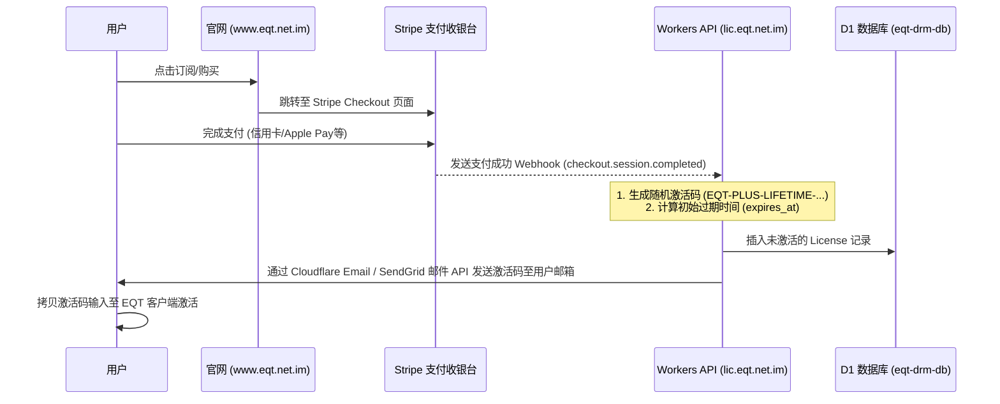

# EQT (Easy QR Transfer) - 域名规划、DNS 配置与支付服务接入指南

本指南指导如何配置 `eqt.net.im` 域名的 DNS 解析，并基于 Cloudflare Pages 和 Workers 提供官方介绍页面及 DRM 授权服务，以顺利接入 Stripe / PayPal 等第三方支付网关。

---

## 1. 域名与服务整体架构规划

为保障支付机构的合规审查（Stripe/PayPal 会人工审查官网，要求必须能访问，且包含定价、退款保障、隐私条款和服务协议），以及客户端的离线/在线 DRM 激活稳定，我们对新域名进行如下规划：

| 子域名 / 主机记录 | 托管平台 | 承载业务服务 | 对应源码/文档资源位置 |
| :--- | :--- | :--- | :--- |
| `eqt.net.im` | Cloudflare Pages | 官方主页 / 301 重定向到 `www` | `cloudflare/eqt-website/_redirects` |
| `www.eqt.net.im` | Cloudflare Pages | EQT 官方合规页（静态 HTML） | `cloudflare/eqt-website/index.html` — 产品说明、价格表、退款政策及联系方式 |
| `lic.eqt.net.im` | Cloudflare Workers | DRM 授权与设备指纹激活 API | `cloudflare/eqt-drm-api/` (连接 `eqt-drm-db` 数据库) |

---

## 2. Cloudflare DNS 解析配置表 (DNS Records)

若要将域名完全交给 Cloudflare (CF) 接管，请将您域名的 Name Servers (NS) 更改为 Cloudflare 指定 of NS。然后在 Cloudflare DNS 控制台配置如下解析记录：

| 记录类型 (Type) | 主机记录 (Name) | 记录值 / 目标值 (Content / Target) | 代理状态 (Proxy) | 备注 (Note) |
| :--- | :--- | :--- | :--- | :--- |
| **CNAME** | `@` (根域名) | `forpersuit.github.io` (或 Pages 映射的专属域) | 开启 (Proxied) | 映射到 Cloudflare Pages 托管的主页 |
| **CNAME** | `www` | `eqt-landing-page.pages.dev` (Pages 默认域名) | 开启 (Proxied) | 承载 Stripe 审核所要求的 Merchant Website |
| **Workers Route** | lic | *不需要显式在 DNS 添加* | 自动创建 | `wrangler.toml` 中的 `routes` 绑定后，CF 自动在 DNS 里添加 Worker 虚拟 CNAME |

> 💡 **Stripe / PayPal 支付合规性验证专用记录**：
> 在接入支付网关进行网关认证时，支付商会要求验证您对该域名的所有权。您需要在 DNS 控制面板中，根据支付商的后台提示追加相关的 **TXT** 记录（如 `stripe-verification`）或 **CNAME** 记录。

---

## 3. Cloudflare 托管与部署指引

### 3.1 官方介绍与合规页 (Cloudflare Pages)
* **部署方式**：
  1. 登录 Cloudflare 控制台，点击 **Pages** -> **Create a project** -> **Connect to Git**。
  2. 选择您的 `eqt` 代码仓库。
  3. 构建设置（纯静态 HTML，无需构建工具）：
     * **Framework preset**：None (Static HTML)。
     * **Root directory**：`/cloudflare/eqt-website`。
  4. 点击部署。
  5. 部署完成后，在 Pages 详情页的 **Custom Domains** 中，添加自定义域名 `www.eqt.net.im` 与根域名 `eqt.net.im`。Cloudflare 会自动为您签发免费的 SSL/TLS 证书。

### 3.2 授权与激活服务 (Cloudflare Workers)
* **部署与绑定**：
  1. 我们已将自定义域名加入到 `/cloudflare/eqt-drm-api/wrangler.toml`：
     ```toml
     routes = [
       { pattern = "lic.eqt.net.im", custom_domain = true }
     ]
     ```
  2. 部署命令：
     ```sh
     CLOUDFLARE_API_TOKEN="" npx wrangler deploy
     ```
  3. Wrangler 会自动在 Cloudflare 边缘节点为您创建 `lic.eqt.net.im` 到 Worker `eqt-drm-api` 的绑定关系。

---

## 4. 付费服务（Stripe 等）如何接入并下发兑换码

若要真正开启商业化销售，EQT 的自动发码流程应设计如下：



### 4.1 付费接入安全校验 (Stripe Webhook Verification)
在 Cloudflare Worker 的路由中，新建一个接口 `/api/v1/webhook/stripe`，当 Stripe 发生 `checkout.session.completed` 事件时，服务器端会收到回调。
* **安全合理性**：必须在 Worker 侧校验 Stripe 签名头部 `stripe-signature`，防止恶意的伪造请求刷码。
* **生成发码**：校验无误后，生成一段随机兑换码插入到 D1 数据库，并调用第三方邮件 API（如 Cloudflare Email Routing 或 SendGrid）实时发给购买填写的邮箱。

---

## 5. 工程中所有对外请求的域名及作用一览 (External Domain Outbound Requests)

为保障升级检测、内网快速 IP 路由绑定以及商业授权的完全离线/在线高可用性，整理工程中（包括客户端、云端服务及 CI/CD）所有对外发起网络请求的域名及其对应作用：

### 5.1 本地/云端子域名服务 (EQT Subdomains)

| 域名 | 请求来源 | 协议 | 物理作用与承载业务 | 缓存与安全特性 |
| :--- | :--- | :--- | :--- | :--- |
| `eqt.net.im` <br> `www.eqt.net.im` | 用户浏览器 | HTTPS | 官方主页、多语言功能介绍和合规性政策承载（主要应对 Stripe 审核）。 | 较短缓存策略，确保网页更新能够快速呈现。 |
| `download.eqt.net.im` | 客户端 / 浏览器 | HTTPS | 静态升级元数据 `update-metadata.json` 下载、各平台客户端二进制包与 `.sig` 数字签名文件的托管分发。 | 开启 `Access-Control-Allow-Origin: *` CORS，大文件提供一年强缓存。 |
| `lic.eqt.net.im` | 客户端 | HTTPS | 云端 DRM 授权 API。处理许可证激活兑换（Redeem）、机器设备指纹定期联机验证。 | 动态 API，关闭缓存。 |

### 5.2 第三方 API 与云依赖服务 (Third-Party APIs)

| 域名 | 请求来源 | 协议 | 物理作用与承载业务 |
| :--- | :--- | :--- | :--- |
| `api.github.com` <br> `github.com` | CI/CD Runner / 客户端 | HTTPS | 代码托管、分支构建与自动发布。并在静态 Pages 升级通道失效时，作为版本检测和 Release 包分发的最后备份源。 |
| `api.stripe.com` | 云端 Worker | HTTPS | Stripe 收银台 API。用于云端 Worker 进行许可证结账会话创建、以及对 Stripe Webhook 支付成功通知执行加签安全验证。 |

### 5.3 辅助网络探测服务 (Network Probe Fallbacks)

| 域名 | 请求来源 | 协议 | 物理作用与承载业务 | 关键避坑设计 |
| :--- | :--- | :--- | :--- | :--- |
| `8.8.8.8` <br> `8.8.4.4` | 客户端 (本地运行) | UDP | 本地网络绑定 UDP 路由探测。通过 OS 路由表快速解析出本机对外首选物理网卡内网 IP。 | **不发送任何实际网络数据包，耗时小于 0.1ms**，保证局域网互传在完全离线无公网状态下也能秒开，杜绝延迟。 |
| `opendns.com` <br> `ipify.org` <br> `domains.google.com` | 客户端 (本地运行) | HTTP / DNS | 外网公网 IP 反向探测。作为本地 UDP 路由探测失败后的最终 fallback，向公网回显服务查询本机的外网 NAT 出口 IP Gold。 | 仅在无任何默认网卡内网 IP，且必须绑定外网公网时触发，高频请求有重试指数退避，严防无公网环境下卡死。 |

---

## 6. 系统网络端口规划与端口冲突退避机制 (Network Ports & Conflict Prevention)

为实现桌面端 GUI、进程启动器（Launcher）与后台核心服务（Desktop Agent）的高效通讯，同时保证在多开、本地网络环境冲突时的高可用性，系统采用了以下端口逻辑与防冲突机制：

### 6.1 核心端口定义与划分

| 端口号 / 范围 | 运行角色 | 协议 | 物理作用与内部通讯逻辑 |
| :--- | :--- | :--- | :--- |
| **`48176`** <br> (默认控制端口) | `eqt desktop agent` | HTTP / SSE | **本地 IPC 控制通道**。GUI 热加载进程及启动器（Launcher）向后台核心代理发送命令、状态获取及监听 SSE 推送（如 `/events`）的通道。 |
| **`48176 - 48195`** <br> (自增控制端口段) | `eqt desktop agent` | HTTP / SSE | 控制端口防冲突自增段。当默认的 `48176` 被占用时，Agent 会自动在此范围内寻找空闲端口。 |
| **`0` (动态端口)** <br> (系统高位分配) | `eqt desktop agent` | HTTP / SSE | 终极退避端口。若上述 20 个端口全部被抢占，Agent 将向系统申请监听端口 `0`，由 OS 随机分配空闲的高位端口。 |
| **可配置端口** <br> (如 `19000` / `0`) | 局域网传输服务 <br> (Transfer Server) | HTTP / WebSocket | **局域网数据互传及 P2P 聊天服务**。如果设为非 `0` 固定端口，遇到冲突将启动失败；若设为 `0`，则在每次启动传输任务时，自动申请一个随机高位端口以确保启动率。 |
| **`5173` / `3000`** | Vite 开发服务 | HTTP / WebSocket | 仅在前端开发期（运行 `wails dev` / `npm run dev` 时）为 HMR 监听，发布版客户端无此端口依赖。 |

### 6.2 桌面代理 (Desktop Agent) 的端口发现机制

当客户端启动时，由于端口冲突或多开，导致 Agent 未必能成功监听在默认的 `48176`：
1. **自动端口协商与写入**：Agent 在最终成功开启监听的端口上，会将实际端口号以纯文本形式写入到运行时临时文件中：
   * **Windows**：%LOCALAPPDATA%/eqt/agent.port
   * **POSIX (Linux/macOS)**: ~/.cache/eqt/agent.port
2. **启动器与 GUI 的端口发现**：
   * GUI 与 Launcher 在尝试与 Agent 进行网络握手前，会优先读取该 `agent.port` 文件的内容。
   * 若能成功读取到端口数值（如 `48179`），则将 API 请求的目标地址重写为 `127.0.0.1:48179`。
   * 若该文件不存在或读取失败，则自动按顺序遍历探测 `48176 - 48195` 端口段。
3. **隔离性保障**：由于该端口文件保存在用户专属的配置目录下，能天然防止多用户跨进程越权控制，且多实例独立端口运行不受干涉。


