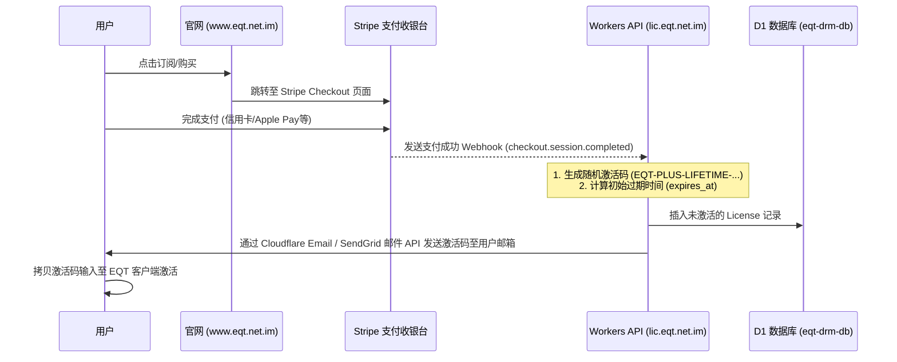

# EQT (Easy QR Transfer) - 域名规划、DNS 配置与支付服务接入指南

本指南指导如何配置 `eqt.net.im` 域名的 DNS 解析，并基于 Cloudflare Pages 和 Workers 提供官方介绍页面及 DRM 授权服务，以顺利接入 Stripe / PayPal 等第三方支付网关。

---

## 1. 域名与服务整体架构规划

为保障支付机构的合规审查（Stripe/PayPal 会人工审查官网，要求必须能访问，且包含定价、退款保障、隐私条款和服务协议），以及客户端的离线/在线 DRM 激活稳定，我们对新域名进行如下规划：

| 子域名 / 主机记录 | 托管平台 | 承载业务服务 | 对应源码/文档资源位置 |
| :--- | :--- | :--- | :--- |
| `eqt.net.im` | Cloudflare Pages | 官方主页 / 重定向到 `www` | 映射 `docs/product-landing.md` |
| `www.eqt.net.im` | Cloudflare Pages | EQT 官方合规页（Jekyll/HTML 渲染） | 包含产品说明、价格表、退款政策及联系方式 |
| `lic.eqt.net.im` | Cloudflare Workers | DRM 授权与设备指纹激活 API | `cloudflare/` (连接 `eqt-drm-db` 数据库) |

---

## 2. Cloudflare DNS 解析配置表 (DNS Records)

若要将域名完全交给 Cloudflare (CF) 接管，请将您域名的 Name Servers (NS) 更改为 Cloudflare 指定的 NS。然后在 Cloudflare DNS 控制台配置如下解析记录：

| 记录类型 (Type) | 主机记录 (Name) | 记录值 / 目标值 (Content / Target) | 代理状态 (Proxy) | 备注 (Note) |
| :--- | :--- | :--- | :--- | :--- |
| **CNAME** | `@` (根域名) | `forpersuit.github.io` (或 Pages 映射的专属域) | 开启 (Proxied) | 映射到 Cloudflare Pages 托管的主页 |
| **CNAME** | `www` | `eqt-landing-page.pages.dev` (Pages 默认域名) | 开启 (Proxied) | 承载 Stripe 审核所要求的 Merchant Website |
| **Workers Route** | lic | *不需要显式在 DNS 添加* | 自动创建 | `wrangler.toml` 中的 `routes` 绑定后，CF 自动在 DNS 里添加 Worker 虚拟 CNAME |

> 💡 **Stripe / PayPal 支付合规性验证专用记录**：
> 在接入支付网关进行网关认证时，支付商会要求验证您对该域名的所有权。您需要在 DNS 控制面板中，根据支付商的后台提示追加相关的 **TXT** 记录（如 `stripe-verification`）或 **CNAME** 记录。

---

## 3. Cloudflare 托管与部署指引

### 3.1 官方介绍与合规页 (Cloudflare Pages)
* **部署方式**：
  1. 登录 Cloudflare 控制台，点击 **Pages** -> **Create a project** -> **Connect to Git**。
  2. 选择您的 `eqt` 代码仓库。
  3. 构建设置：若使用静态 Jekyll 网页：
     * **Framework preset**：Jekyll (或者 Static HTML)。
     * **Root directory**：`/docs`。
  4. 点击部署。
  5. 部署完成后，在 Pages 详情页的 **Custom Domains** 中，添加自定义域名 `www.eqt.net.im` 与根域名 `eqt.net.im`。Cloudflare 会自动为您签发免费的 SSL/TLS 证书。

### 3.2 授权与激活服务 (Cloudflare Workers)
* **部署与绑定**：
  1. 我们已将自定义域名加入到 `/cloudflare/wrangler.toml`：
     ```toml
     routes = [
       { pattern = "lic.eqt.net.im", custom_domain = true }
     ]
     ```
  2. 部署命令：
     ```sh
     CLOUDFLARE_API_TOKEN="" npx wrangler deploy
     ```
  3. Wrangler 会自动在 Cloudflare 边缘节点为您创建 `lic.eqt.net.im` 到 Worker `eqt-drm-api` 的绑定关系。

---

## 4. 付费服务（Stripe 等）如何接入并下发兑换码

若要真正开启商业化销售，EQT 的自动发码流程应设计如下：



### 4.1 付费接入安全校验 (Stripe Webhook Verification)
在 Cloudflare Worker 的路由中，新建一个接口 `/api/v1/webhook/stripe`，当 Stripe 发生 `checkout.session.completed` 事件时，服务器端会收到回调。
* **安全合理性**：必须在 Worker 侧校验 Stripe 签名头部 `stripe-signature`，防止恶意的伪造请求刷码。
* **生成发码**：校验无误后，生成一段随机兑换码插入到 D1 数据库，并调用第三方邮件 API（如 Cloudflare Email Routing 或 SendGrid）实时发给购买填写的邮箱。
