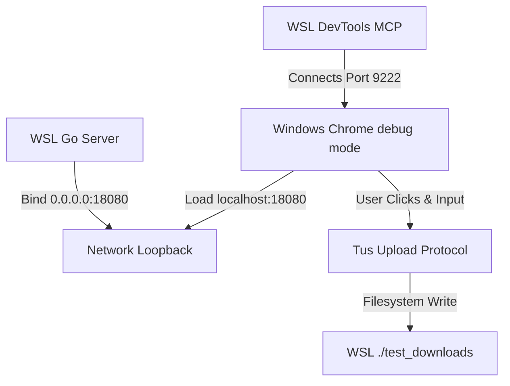

# EQT Dual-End E2E Browser Simulation Testing Guide

This document records the principles, steps, and troubleshooting findings for running a **100% fidelity E2E simulation test** combining the **Go Backend**, **Windows Host Google Chrome**, and **WSL 2 Container Environment**.

---

## 1. Core Architecture of E2E Simulation

Since typical headful browser testing in a Linux-only headless container suffers from missing X11/GTK graphics dependencies, we designed an interface to execute across the WSL/Windows host boundary:



1. **WSL Go Server**: Runs with `--bind 0.0.0.0` so that ports map seamlessly to `localhost` / `127.0.0.1` on the Windows host.
2. **Windows Chrome (Headless Debug Mode)**: Launched directly from WSL command line by executing `/mnt/c/Program Files/Google/Chrome/Application/chrome.exe`. By configuring `--remote-debugging-port=9222`, it exposes the CDP (Chrome DevTools Protocol) interface.
3. **CDP MCP Server**: Connects to `127.0.0.1:9222` to inspect and drive page components.

---

## 2. Key Findings & Fixes

### A. Template Literals (`var doneHtml = `...``) vs Go `html/template`
* **Symptom**: Stale or headless browsers raised `Uncaught SyntaxError: Invalid or unexpected token` and failed to load pages.
* **Root Cause**: Go's security-sensitive template engine sometimes escapes backtick (`` ` ``) and ES6 `${var}` interpolation tags inside `<script>` blocks, causing invalid JS strings.
* **Solution**: Refactored all ES6 template literals inside [upload.tmpl.html](file:///home/yelon/develop/me/eqrcp/pkg/pages/upload.tmpl.html) (both `doneHtml` and `failHtml`) to traditional single-quoted string concatenations (`'...' + '...'`), rendering them 100% compliant.

### B. Binding Target `0.0.0.0`
* **Symptom**: Connecting Windows Chrome to `192.168.x.x` (WSL virtual NIC) times out or gets rejected due to host routing policies.
* **Solution**: Run EQT server with `--bind 0.0.0.0` to permit connections through Windows loopback loop (`127.0.0.1`).

---

## 3. How to Run the E2E Browser Test

1. **Start EQT Server in WSL**:
   ```bash
   go run ./cmd/eqt receive --bind 0.0.0.0 --output ./test_downloads --port 18080
   ```
2. **Start Debug Chrome from WSL**:
   ```bash
   "/mnt/c/Program Files/Google/Chrome/Application/chrome.exe" --headless --remote-debugging-port=9222 --disable-gpu --user-data-dir=/tmp/chrome-test-profile
   ```
3. **Trigger CDP Navigation**:
   * Navigate to the dynamic path url: `http://127.0.0.1:18080/receive/<Token>`
4. **Interact via JS Injection**:
   ```javascript
   // Fill inputs
   document.getElementById('plaintext-title').value = 'chrome_text';
   document.getElementById('plaintext-text').value = 'This is a full browser simulation test.';
   // Click submit (its ID is "submit")
   document.getElementById('submit').click();
   ```
5. **Verify File Output**:
   ```bash
   cat ./test_downloads/chrome_text.txt
   ```
