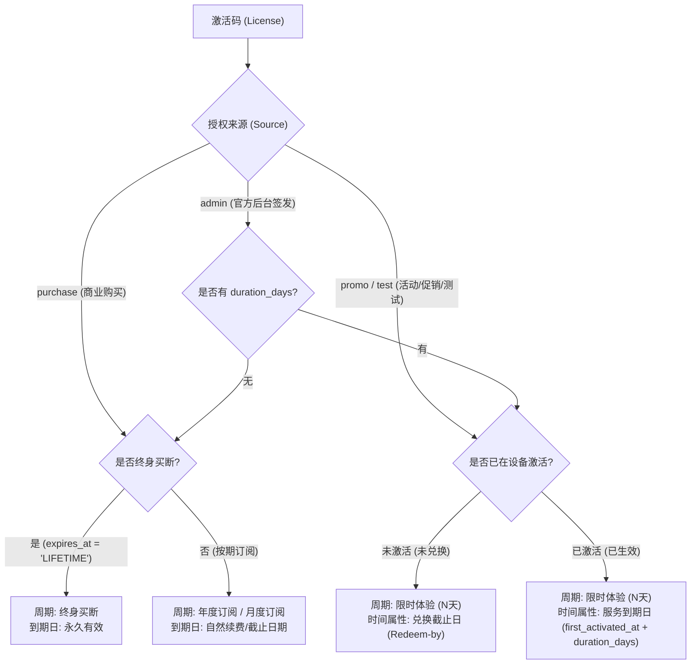

# 授权有效期与订阅周期展示规范与实现方案（License Validity & Subscription Cycle Display Specification）

> 状态：**已完成落地并验证 (Implemented & Verified)**  
> 落地版本：`v1.36.174`  
> 编写日期：2026-10-01  
> 关联模块：`cloudflare/eqt-admin`（管理后台 SPA）、`cloudflare/eqt-website/portal.html`（用户自助门户）、`cloudflare/eqt-drm-api`（Cloudflare Worker DRM 授权服务）  
> 适用范围：所有环境（Production 生产环境与 Test / Sandbox 测试环境）

---

## 1. 背景与核心痛点

### 1.1 现状与问题描述
1. **Admin 授权管理后台缺失“有效期 / 到期时间”列**：  
   在 [`cloudflare/eqt-admin/src/pages/Licenses.svelte`](file:///home/yelon/develop/me/eqrcp/cloudflare/eqt-admin/src/pages/Licenses.svelte#L463-L474) 的数据表格中，当前仅展示 `[ 授权码 | 套餐 | 来源 | 状态 | 设备激活数 | 买家 | 创建时间 | 操作 ]` 共 8 列。虽然国际化字典中早前已定义了 `tableHeaderExpires: "到期时间"`，但界面表格一直未引入该列，导致管理员无法一眼获知激活码的到期时间、剩余有效天数或是否已过期。
2. **Portal 门户端订阅周期 Badge 机械硬编码**：  
   在 [`cloudflare/eqt-website/portal.html`](file:///home/yelon/develop/me/eqrcp/cloudflare/eqt-website/portal.html#L1267-L1270) 中，卡片右上角的订阅周期 Badge 判断逻辑为：
   ```javascript
   const isLifetime = !lic.duration_days && (lic.expires_at === 'LIFETIME' || !lic.expires_at);
   const entitlementLabel = isLifetime
       ? (dict.entitlement_lifetime || '终身买断')
       : (dict.entitlement_term || '年度订阅');
   ```
   凡非终身买断的卡密，一律粗暴显示为 **“年度订阅”**。对于 7 天体验卡、30 天活动促销码（Promo）、90 天补偿码或测试码，均错误地挂上“年度订阅”徽章，造成严重的业务概念误导与用户困惑。
3. **活动码（Promo）兑换截止日与服务到期日概念混淆**：  
   在数据库中，Promo 码创建时的 `expires_at` 保存的是**卡密兑换截止时间**（Redeem-by Deadline），而服务时长由 `duration_days` 约束。当用户在某日首次激活设备时，真实服务到期日应为 `first_activated_at + duration_days`。目前 Portal 详细信息区直接取 `lic.expires_at` 显示为“订阅到期日”，导致已激活的 30 天体验码可能显示了半年后的卡密截止日，使得界面展示与客户端实际可用时间脱节。

---

## 2. 第一性原理与概念澄清（Core Concepts & First Principles）

要实现严密自洽的展示，必须从第一性原理对激活码生命周期中的日期与周期概念进行清晰分层：



### 2.1 核心概念定义表

| 概念名称 | 适用类型 | 含义与计算基准 | 示例 |
| :--- | :--- | :--- | :--- |
| **终身买断 (Lifetime)** | 买断授权 (`expires_at = 'LIFETIME'`) | 永久享有软件使用权，无到期时间。 | `永久有效` |
| **订阅结算周期 (Billing Cycle)** | 商业订阅 (`source = 'purchase'`) | 按自然年或月续费，到期日前自动续订或到期终止。 | `年度订阅`（到期日：2027-09-30） |
| **权益时长 (Duration Days)** | 活动码/体验卡 (`duration_days`) | 用户兑换激活后可完整享受服务的天数。 | `30 天`、`7 天`、`365 天` |
| **兑换截止时间 (Redeem-by Deadline)** | 未兑换的 Promo / Test 码 | 卡密失效期限。超过该时间卡密不可再被激活，作废处理。 | `2026-12-31 前兑换` |
| **服务到期日 (Effective Expiration Date)** | 已兑换的 Promo / Test 码 | 激活后真正享受服务的截止时间点：`first_activated_at + duration_days`。 | `2026-10-30 到期` |

---

## 3. Admin 授权管理后台展示方案

### 3.1 表格列布局调整
在 [`cloudflare/eqt-admin/src/pages/Licenses.svelte`](file:///home/yelon/develop/me/eqrcp/cloudflare/eqt-admin/src/pages/Licenses.svelte) 的主数据表格中新增“到期时间 / 有效期”列，放置在【状态】与【设备激活数】之间：

```html
<thead>
  <tr>
    <th>{$t('licenses.tableHeaderCode')}</th>      <!-- 授权码 -->
    <th>{$t('licenses.tableHeaderTier')}</th>      <!-- 套餐 -->
    <th>{$t('licenses.source')}</th>               <!-- 来源 -->
    <th>{$t('licenses.tableHeaderStatus')}</th>    <!-- 状态 -->
    <th>{$t('licenses.tableHeaderExpires')}</th>   <!-- 到期时间 (新增列) -->
    <th>{$t('licenses.tableHeaderDevices')}</th>   <!-- 设备激活数 -->
    <th>{$t('licenses.tableHeaderBuyer')}</th>     <!-- 买家 -->
    <th>{$t('common.created_at')}</th>             <!-- 创建时间 -->
    <th>{$t('licenses.tableHeaderActions')}</th>   <!-- 操作 -->
  </tr>
</thead>
```

### 3.2 单元格智能渲染逻辑
定义辅助函数 `renderLicenseExpiry(lic)`，按如下优先级与业务分支渲染：

1. **分支 A：终身买断（`isLifetime`）**
   - **判定条件**：`lic.expires_at === 'LIFETIME' || (!lic.duration_days && !lic.expires_at)`
   - **渲染形式**：
     ```html
     <span class="badge badge-lifetime">{$t('licenses.expiryLifetime')}</span> <!-- 永久有效 -->
     ```
2. **分支 B：商业购买订阅（`source === 'purchase'`）**
   - **判定条件**：`lic.source === 'purchase' && !isLifetime`
   - **计算逻辑**：直接基于 `lic.expires_at` 解析。
   - **渲染形式**：
     - 若已过期（`new Date(lic.expires_at) < Date.now()`）：
       ```html
       <span class="badge badge-expired" title={lic.expires_at}>
         {$t('licenses.expiredAt', { date: formatDate(lic.expires_at) })} <!-- 已过期 (2026-09-20) -->
       </span>
       ```
     - 若生效中：
       ```html
       <div class="expiry-cell">
         <span class="expiry-date">{formatDate(lic.expires_at)}</span>
         <span class="expiry-hint text-muted">{$t('licenses.daysRemaining', { days: remainingDays })}</span>
       </div>
       ```
3. **分支 C：活动促销码 / 开发者测试码（`source === 'promo' | 'test'` 或存在 `duration_days`）**
   - **子分支 C1：已激活/已兑换**（`lic.first_activated_at || lic.active_devices_count > 0`）：
     - 此时计算绝对服务截止日：`effectiveExpires = new Date(lic.first_activated_at).getTime() + lic.duration_days * 86400 * 1000`。
     - 若 `effectiveExpires < Date.now()`：显示标红 `<span class="badge badge-expired">已到期 (${formatDate(effectiveExpires)})</span>`。
     - 若生效中：显示 `<span class="expiry-date">${formatDate(effectiveExpires)}</span> <span class="expiry-hint">(${lic.duration_days}天权益)</span>`。
   - **子分支 C2：未激活/未兑换**（尚无设备激活）：
     - 主文案：`<span class="badge badge-unredeemed">${lic.duration_days}天权益</span>`。
     - 副提示：
       - 若设置了兑换截止日 `lic.expires_at`：
         - 若 `new Date(lic.expires_at) < Date.now()`：标红 `<span class="text-danger">兑换已截止</span>`；
         - 若未截止：`<span class="expiry-hint text-muted">截止: ${formatDate(lic.expires_at)}</span>`。
       - 若未限制截止日：`<span class="expiry-hint text-muted">长期可兑换</span>`。

---

## 4. Portal 用户自助门户端展示方案

### 4.1 顶部周期 Badge（`entitlementLabel`）自适应规则
彻底摒弃 `isLifetime ? '终身买断' : '年度订阅'` 的生硬逻辑，在 [`portal.html`](file:///home/yelon/develop/me/eqrcp/cloudflare/eqt-website/portal.html) 中改用智能匹配生成器：

```javascript
function getEntitlementBadge(lic, dict) {
    const isLifetime = !lic.duration_days && (lic.expires_at === 'LIFETIME' || !lic.expires_at);
    if (isLifetime) {
        return {
            text: dict.entitlement_lifetime || '终身买断',
            style: 'bg-amber-500/10 text-amber-300 border-amber-500/30'
        };
    }

    const durationDays = lic.duration_days ? Number(lic.duration_days) : null;
    
    // 活动促销码、测试码或具有特定有效期的卡密
    if (lic.source === 'promo' || lic.source === 'test' || durationDays) {
        if (durationDays === 30 || durationDays === 31) {
            return {
                text: dict.entitlement_promo_month || '月卡体验 (30天)',
                style: 'bg-emerald-500/10 text-emerald-300 border-emerald-500/30'
            };
        }
        if (durationDays === 365) {
            return {
                text: dict.entitlement_promo_year || '年卡体验 (365天)',
                style: 'bg-emerald-500/10 text-emerald-300 border-emerald-500/30'
            };
        }
        if (durationDays === 7) {
            return {
                text: dict.entitlement_promo_week || '周卡体验 (7天)',
                style: 'bg-emerald-500/10 text-emerald-300 border-emerald-500/30'
            };
        }
        if (durationDays && durationDays > 0) {
            const template = dict.entitlement_promo_custom || '限时体验 ({days}天)';
            return {
                text: template.replace('{days}', durationDays),
                style: 'bg-emerald-500/10 text-emerald-300 border-emerald-500/30'
            };
        }
        if (lic.source === 'test') {
            return {
                text: dict.entitlement_test || '测试授权',
                style: 'bg-slate-500/10 text-slate-300 border-slate-500/30'
            };
        }
    }

    // 默认商业购买订阅
    return {
        text: dict.entitlement_term || '年度订阅',
        style: 'bg-sky-500/10 text-sky-300 border-sky-500/30'
    };
}
```

### 4.2 卡片详细信息区“到期日”展示规则
在 License 卡片详细参数网格中：
```html
<div>
  <span class="font-medium text-white/50">${escapeHtml(expiryFieldLabel)}:</span> 
  <span class="text-white/90">${escExpiresLabel}</span>
</div>
```

针对不同状态，动态切换标签与取值：

1. **终身买断**：
   - `expiryFieldLabel`：`dict.valid_until || '有效期至'`
   - `escExpiresLabel`：`dict.entitlement_lifetime || '永久有效'`
2. **商业购买订阅 (`purchase`)**：
   - `expiryFieldLabel`：`dict.expires_at || '订阅到期日'`
   - `escExpiresLabel`：`${formatDate(lic.expires_at)}`（若已过期追加 `(已到期)`）
3. **活动/促销/测试码 (`promo` / `test` / 有 `duration_days`)**：
   - **已激活设备（`is_redeemed === true`）**：
     - `expiryFieldLabel`：`dict.pass_expires_at || '权益到期日'`
     - `escExpiresLabel`：使用服务端返回的真实生效截止时间 `${formatDate(lic.effective_expires_at)}`。若已过期则高亮标红。
   - **未激活任何设备（新绑定但尚未在客户端激活）**：
     - `expiryFieldLabel`：`dict.redeem_deadline || '兑换截止日'`
     - `escExpiresLabel`：若有卡密截止日则显示 `${formatDate(lic.expires_at)} (激活后享 ${lic.duration_days} 天)`；若无卡密截止日则显示 `长期可兑换 (激活后享 ${lic.duration_days} 天)`。

---

## 5. 后端 API 协同增强规范（Cloudflare Worker DRM API）

### 5.1 复用 `evaluateLicenseExpiration` 核心引擎
在 [`cloudflare/eqt-drm-api/src/routes/portal.ts`](file:///home/yelon/develop/me/eqrcp/cloudflare/eqt-drm-api/src/routes/portal.ts) 的 `GET /api/v1/user/licenses` 处理流程中，复用 `routes/drm.ts` 导出的 `evaluateLicenseExpiration` 函数：

```typescript
import { evaluateLicenseExpiration } from "./drm";

// 在遍历用户 licenses 时：
for (const lic of licenses) {
  // ... 查询 activations ...
  const isRedeemed = Boolean(lic.first_activated_at || activations.length > 0);
  const evalRes = evaluateLicenseExpiration(lic, lic.expires_at || "LIFETIME");
  
  const effectiveExpiresAt = evalRes.effectiveExpiresAt;
  const isExpired = evalRes.isExpired || evalRes.isRedeemExpired;

  list.push({
    ...lic,
    source,
    is_redeemed: isRedeemed,
    effective_expires_at: effectiveExpiresAt,
    is_expired: isExpired,
    // ...其余字段保持完全向后兼容
  });
}
```

### 5.2 字段向后兼容性保证
* 原有的 `expires_at` 字段原样返回，不破坏现有任何依赖该字段的基础逻辑；
* 新增派生字段 `effective_expires_at`：明确标识终端服务权益的物理终止时间戳；
* 新增 `is_redeemed` 布尔值：明确告知客户端该卡密是否已产生首台设备激活。

---

## 6. 多语言国际化（i18n）词条补充规范

需在 Admin 和 Portal 涉及的所有支持语言中补充以下词条：

### 6.1 Admin 管理端（`zh.ts` & `en.ts`）
* `zh.ts`：
  ```typescript
  expiryLifetime: "永久有效",
  expiryDaysRemaining: "剩余 {days} 天",
  expiryExpired: "已到期",
  expiryRedeemDeadline: "兑换截止: {date}",
  expiryRedeemExpired: "兑换已截止",
  expiryDurationDays: "{days}天权益",
  ```
* `en.ts`：
  ```typescript
  expiryLifetime: "Lifetime",
  expiryDaysRemaining: "{days}d left",
  expiryExpired: "Expired",
  expiryRedeemDeadline: "Redeem by {date}",
  expiryRedeemExpired: "Redeem expired",
  expiryDurationDays: "{days}d Pass",
  ```

### 6.2 Portal 用户门户（7 国语言字典）
在 `portal.html` 的 `translations` 对象中补充：
* **中文 (`zh`)**：
  ```json
  "entitlement_promo_month": "月卡体验 (30天)",
  "entitlement_promo_year": "年卡体验 (365天)",
  "entitlement_promo_week": "周卡体验 (7天)",
  "entitlement_promo_custom": "限时体验 ({days}天)",
  "entitlement_test": "测试授权",
  "pass_expires_at": "权益到期日",
  "redeem_deadline": "兑换截止日",
  "redeem_hint": "激活后享 {days} 天",
  "valid_until": "有效期至",
  "status_expired": "已到期"
  ```
* **英文 (`en`)**：
  ```json
  "entitlement_promo_month": "30-Day Pass",
  "entitlement_promo_year": "1-Year Pass",
  "entitlement_promo_week": "7-Day Pass",
  "entitlement_promo_custom": "{days}-Day Pass",
  "entitlement_test": "Test Pass",
  "pass_expires_at": "Pass Valid Until",
  "redeem_deadline": "Redeem Deadline",
  "redeem_hint": "{days} days once activated",
  "valid_until": "Valid Until",
  "status_expired": "Expired"
  ```
* **日文 (`ja`)**、**韩文 (`ko`)**、**西班牙文 (`es`)**、**德文 (`de`)**、**法文 (`fr`)** 均同步补齐对应译文。

---

## 7. 实施计划与验收标准（Definition of Done）

### 7.1 实施步骤
1. **第一阶段：后端数据补充**
   - 在 `cloudflare/eqt-drm-api/src/routes/portal.ts` 中引入 `evaluateLicenseExpiration`，返回 `effective_expires_at` 与 `is_redeemed`。
   - 编写 Cloudflare Worker 单元测试，确保各类卡密计算准确。
2. **第二阶段：Portal 门户页面升级**
   - 更新 `portal.html` 的多语言字典（7 国语言）。
   - 更新 `getEntitlementBadge` 与详细卡片字段逻辑，自适应展示周期 Badge 与到期日。
3. **第三阶段：Admin 管理后台升级**
   - 更新 `Licenses.svelte` 表头与行模板，加入“到期时间”列。
   - 更新 `zh.ts` 和 `en.ts`。
   - 验证表格排序、过滤与响应式展示。

### 7.2 验收标准 (DoD)
1. **准确性**：
   - 终身买断卡密正确显示为“终身买断”和“永久有效”；
   - 购买订阅正确显示为“年度订阅”和续费到期日；
   - 30 天 Promo 码无论在 Admin 还是 Portal，均显示为“月卡体验 (30天)”或“限时体验 (30天)”，绝不再显示为“年度订阅”；
   - 已激活的 Promo 码，显示的服务到期日必须精确等于 `first_activated_at + 30天`。
2. **无破坏性与零回归**：
   - 既有 Paddle 订阅、解绑、退款申请等操作不受任何影响；
   - 本地构建与自动化测试 100% 通过；
   - 工作区干净并完成远程推送。
