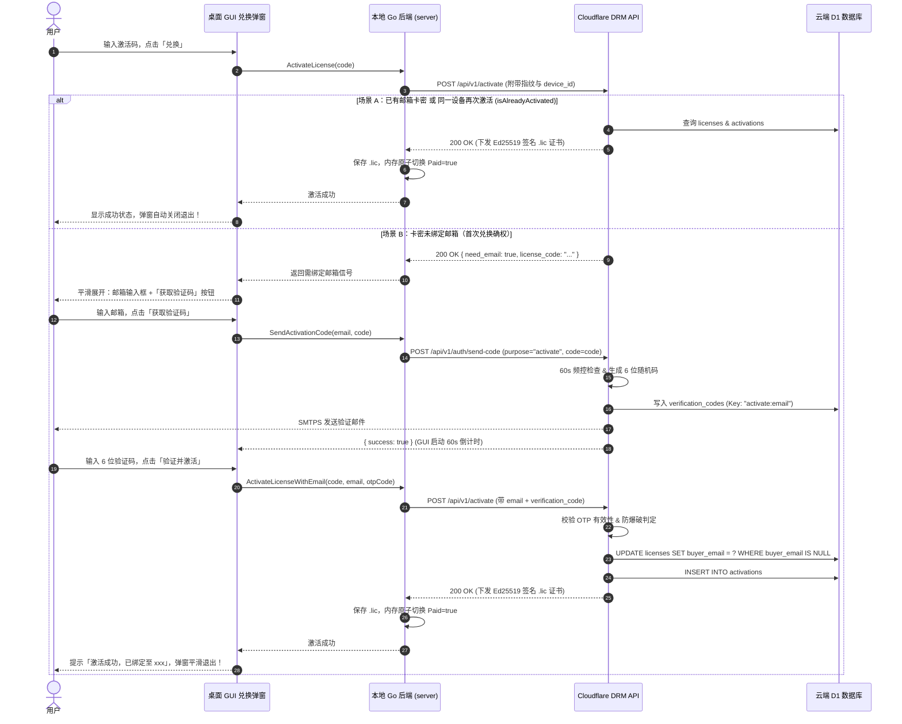

# 统一激活与首绑邮箱确权方案（Unified License Activation & First-Redemption Email Binding）

> 状态：**设计完备，待实施**  
> 编写日期：2026-09-30  
> 关联模块：`eqt-drm-api`（Cloudflare Worker）、`desktop/gui`（Wails 桌面端兑换弹窗）、`eqt-portal`（用户自助服务门户）  
> 覆盖环境：Production（生产环境）与 Test / Sandbox（测试沙箱环境）

---

## 1. 背景与核心目标

### 1.1 现状与痛点
1. **分发场景与强绑定的冲突**：  
   对于活动促销（`promo`）、管理员赠送/补偿（`admin`）以及测试（`test`）场景，激活码在生成和发放阶段通常作为全新的卡密分发，无法也不应预先强制收集和绑定用户邮箱。
2. **测试环境沙箱门禁的逻辑脱节**：  
   当前测试环境（`isTestEnvironment === true`）全局无差别强制校验 `assertSandboxTesterAllowed`，而该校验硬编码以 `license.buyer_email` 作为单向查询入口。一旦卡密未预填邮箱（如批量生成的活动码），即使该测试设备的硬件 ID 已在后台批准登记，也会因 `!buyer_email` 而被一票否决（403 Forbidden）。
3. **非购买授权长期“无主”隐患**：  
   生产环境中虽然允许无邮箱直接激活，但导致这部分已激活的合法用户无法在 Web Portal（`portal.eqt.net.im`）登录查看自己的授权状态、无法接收证书到期或安全提醒、也无法自助执行设备解绑迁移。

### 1.2 核心目标
* **管理一致性**：统一促销、补偿、测试等非购买激活码的生命周期管理，支持“发码时不绑邮箱，兑换时完成确权”。
* **用户体验一致性**：首绑体验在桌面 GUI 内部原生渐进式完成，无需跳转外部浏览器；二次激活或已有归属卡密实现 0 干扰静默激活。
* **复用现有风控基础设施**：100% 复用 Portal / Checkout 已有的 OTP 邮箱验证码、频控防刷与安全防爆破能力。
* **设备与邮箱无缝归属**：完成首次绑定的用户，日后可凭该邮箱直接登录 Web Portal 自助管理已激活设备。

---

## 2. 关键架构决策（First Principles）

### 2.1 决策 1：GUI 内嵌极简展开，坚决不跳转外部浏览器
* **驳回跳转浏览器方案**：用户正在客户端操作时强行拉起外部浏览器会导致严重的上下文割裂；且浏览器绑定后，向桌面客户端回传状态极为脆弱（依赖系统级 Deep Link、本地临时端口监听或高频轮询，极易被防火墙或杀毒软件拦截）。
* **采纳 GUI 原生两步展开**：
  * **第一步（常规）**：用户在既有输入框输入激活码，点击「兑换」；
  * **第二步（仅首绑时触发）**：若服务端检测到该激活码无归属邮箱，返回 `need_email: true`，兑换弹窗平滑展开邮箱输入框与「获取验证码」；
  * **完成即退**：用户输入 6 位验证码后点击「验证并激活」，服务端验证通过并完成绑定，本地写入 `.lic`，弹窗自动关闭，一气呵成。

### 2.2 决策 2：单次请求原子绑定激活（Atomic Verify & Bind）
* 不采用“先调 API 校验验证码成功，再调 API 激活”的两阶段提交；
* 统一由 `POST /api/v1/activate` 接收 `email` 与 `verification_code`：
  服务端在单次事务/操作中：**校验 OTP 有效性 ➔ 写入 `licenses.buyer_email` ➔ 校验硬件指纹 ➔ 写入 `activations` ➔ 签发 Ed25519 签名**。
* 彻底杜绝“验证码已消耗/邮箱已绑定，但因客户端断网导致激活失败”的分布式不一致问题。

### 2.3 决策 3：复用现有 OTP 命名空间隔离体系
在 `cloudflare/eqt-drm-api` 的验证码体系中扩展 `activate` 用途：
* 存储键格式：`verificationStorageKey("activate", email)` ➔ `activate:user@example.com`；
* 物理隔离 `portal` 登录码与 `checkout` 购买码，互不覆盖；
* 共享一套 SMTP 发信、60 秒限频冷却及 5 次输错锁定 15 分钟的安全拦截（`isOtpVerifyBlocked`）。

---

## 3. 详细时序与状态机

### 3.1 激活全流程时序图



### 3.2 并发与异常处理矩阵

| 场景 | 系统响应与处理逻辑 |
| :--- | :--- |
| **同一设备重复输入同一激活码** | 服务端命中 `isAlreadyActivated = true`，不消耗新的 `max_devices` 配额，静默重新签发并下发 `.lic`，**绝不弹出邮箱验证**。 |
| **正在高速传输文件/Chat 时点击激活** | 控制面 HTTP 请求与数据面连接端口隔离；激活成功写入 `.lic` 时仅以读写锁更新内存 `Paid` 标识，**传输连接零中断**，下一滴答瞬间解除速度限制。 |
| **同一激活码被两台设备同时尝试首次绑定** | 云端采用 D1 单行条件更新：`UPDATE licenses SET buyer_email = ? WHERE license_code = ? AND buyer_email IS NULL`。仅第一台设备绑定成功；第二台设备收到报错：“该激活码已被其他邮箱绑定”。 |
| **输错邮箱地址** | 由于强制要求输入邮箱收到的 6 位 OTP 验证码，用户若输错邮箱将无法通过验证，天然杜绝了“手滑输错邮箱导致授权丢失”的问题。 |
| **验证码暴力破解防护** | 沿用 [`auth.ts:181`](file:///home/yelon/develop/me/eqrcp/cloudflare/eqt-drm-api/src/routes/auth.ts#L181) 规则：连续输错 5 次后，该邮箱/IP 锁定 15 分钟禁止验证。 |

---

## 4. 接口规范与数据协议（API Contract）

### 4.1 发送激活验证码 (`POST /api/v1/auth/send-code`)
* **URL**: `https://lic.eqt.net.im/api/v1/auth/send-code`
* **Method**: `POST`
* **请求体**：
  ```json
  {
    "email": "user@example.com",
    "purpose": "activate",
    "license_code": "EQT-PLUS-20260929-B9E7CD1F2128",
    "lang": "zh"
  }
  ```
* **服务端逻辑**：
  1. 校验 `purpose === "activate"`；
  2. 查询 `licenses` 表：确认该 `license_code` 存在、处于 `active` 状态，且未过期；
  3. 确认该 `license_code` 的 `buyer_email` 仍为 `NULL`（若已有归属且非当前请求邮箱，返回 400 阻断）；
  4. 检查 60 秒发送冷却；
  5. 写入 `verification_codes`（`email = "activate:user@example.com"`，有效期 5 分钟）；
  6. 发送多语言验证码邮件（主题：“【EQT】您的授权激活验证码”）。
* **响应**：
  ```json
  {
    "success": true,
    "message": "Verification code sent successfully"
  }
  ```

### 4.2 客户端激活端点扩展 (`POST /api/v1/activate`)
* **URL**: `https://lic.eqt.net.im/api/v1/activate`
* **Method**: `POST`
* **请求体**：
  ```json
  {
    "license_code": "EQT-PLUS-20260929-B9E7CD1F2128",
    "uuid_hash": "28f24106e35bb84e...",
    "cpu_hash": "fcdb4b423f4e5283...",
    "disk_hash": "...",
    "device_id": "bacb706aff1642b59fa9288e496166c4",
    "app_version": "v1.36.130",
    "email": "user@example.com",              // 可选：首绑激活时提供
    "verification_code": "849201",             // 可选：首绑激活时提供
    "lang": "zh"
  }
  ```
* **服务端执行逻辑分流**：
  1. **查询许可证基本信息**：
     若 `license.buyer_email` 为空且当前设备尚未激活过（`!isAlreadyActivated`）：
     * 若未传 `email` 或 `verification_code`：
       **返回 HTTP 200**：
       ```json
       {
         "need_email": true,
         "license_code": "EQT-PLUS-20260929-B9E7CD1F2128",
         "message": "此激活码尚未绑定所有权邮箱，请输入邮箱完成确权验证。"
       }
       ```
     * 若已传 `email` 与 `verification_code`：
       1. 校验验证码防爆破状态（`isOtpVerifyBlocked`）；
       2. 检索 `verification_codes` 中 `activate:${email}` 记录比对；
       3. 校验失败 ➔ 记录失败计数并返回 400 错误；
       4. 校验成功 ➔ 执行原子所有权更新：
          ```sql
          UPDATE licenses 
          SET buyer_email = ?, buyer_email_hash = ? 
          WHERE license_code = ? AND (buyer_email IS NULL OR buyer_email = '')
          ```
       5. 针对测试环境（`isTestEnvironment`）：若当前设备已在 `sandbox_beta_testers` 中登记，同步确认其关联，使沙箱测试白名单立即满足通过条件；
       6. 消费该验证码（从 `verification_codes` 中清除）；
       7. 继续走后续的配额检测、生成 Ed25519 签名与下发证书。

---

## 5. 前端与 GUI 模块化改造规划

严格遵守仓库前端工程准则（*“禁止向 main.js 继续堆积新业务模块，大块交互模板进行组件化剥离”*）：

1. **新建组件文件**：
   在 `desktop/gui/frontend/src/components/RedeemModal.js` 中抽离兑换交互控制器与视图模板。
2. **纯状态机驱动（State-Template Separation）**：
   ```js
   const redeemState = {
     step: 'INPUT_CODE', // 'INPUT_CODE' | 'INPUT_EMAIL_OTP' | 'SUCCESS'
     code: '',
     email: '',
     otp: '',
     countdown: 0,
     loading: false,
     errorMsg: '',
     successMsg: ''
   };
   ```
3. **标准事件监听（Declarative Event Listeners）**：
   严禁内联 `onclick`，采用组件内挂载的标准 `addEventListener` 处理获取验证码、倒计时 Timer 生命周期与提交绑定。

---

## 6. 测试与验证标准（DoD）

1. **测试用例 1（二次激活幂等性）**：
   已激活设备再次执行 `ActivateLicense(code)`，耗时 < 500ms，服务端直接返回 200 OK，界面无任何邮箱弹窗干扰。
2. **测试用例 2（高并发传输中激活）**：
   在 100MB/s 局域网传输过程中触发激活，传输进度条无卡顿、无中断，内存付费状态即时置为 `true`。
3. **测试用例 3（测试环境解卡）**：
   在 `eqt-drm-db-test` 中，未绑邮箱的 `EQT-PLUS-20260929-B9E7CD1F2128` 在测试机 `bacb706aff1642b59fa9288e496166c4` 上触发邮箱验证流程，验证成功后完成绑定并成功签发 `.lic`。
4. **测试用例 4（Portal 联动登录）**：
   使用在客户端激活时填写的邮箱，前往 `portal.eqt.net.im` 登录，能即时看到该 License 及其绑定的设备列表。
