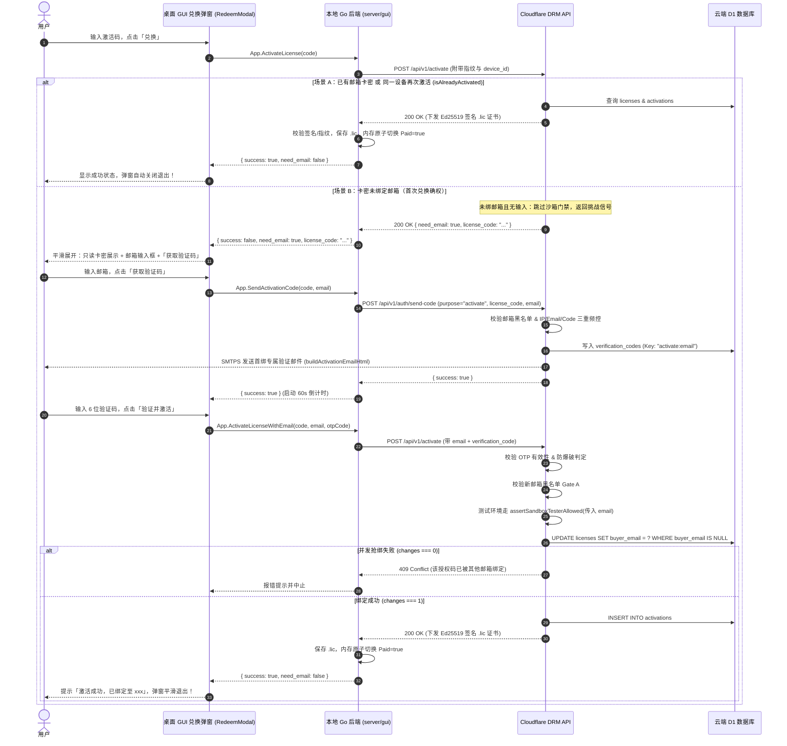

# 统一激活与首绑邮箱确权方案（Unified License Activation & First-Redemption Email Binding）

> 状态：**架构审查完成，修订对齐，实施就绪 (Review Completed & Ready for Implementation)**  
> 编写日期：2026-09-30  
> 关联模块：`cloudflare/eqt-drm-api`（Cloudflare Worker）、`desktop/gui`（Wails 桌面端兑换弹窗）、`pkg/server`（Go 客户端授权引擎）、`eqt-portal`（用户自助服务门户）  
> 覆盖环境：Production（生产环境）与 Test / Sandbox（测试沙箱环境）

---

## 1. 背景与核心目标

### 1.1 现状与痛点
1. **分发场景与强绑定的冲突**：  
   对于活动促销（`promo`）、管理员赠送/补偿（`admin`）以及测试（`test`）场景，激活码在生成和发放阶段通常作为全新的卡密分发，无法也不应预先强制收集和绑定用户邮箱。
2. **测试环境沙箱门禁的逻辑脱节**：  
   当前测试环境（`isTestEnvironment === true`）全局无差别强制校验 `assertSandboxTesterAllowed`，而该校验硬编码以 `license.buyer_email` 作为单向查询入口。一旦卡密未预填邮箱（如批量生成的活动码），即使该测试设备的硬件 ID 已在后台批准登记，也会因 `!buyer_email` 而被一票否决（403 Forbidden）。
3. **非购买授权长期“无主”隐患**：  
   生产环境中虽然允许无邮箱直接激活，但导致这部分已激活的合法用户无法在 Web Portal（`portal.eqt.net.im`）登录查看自己的授权状态、无法接收证书到期或安全提醒、也无法自助执行设备解绑迁移。

### 1.2 核心目标
* **管理一致性**：统一促销、补偿、测试等非购买激活码的生命周期管理，支持“发码时不绑邮箱，兑换时完成确权”。
* **用户体验一致性**：首绑体验在桌面 GUI 内部原生渐进式完成，无需跳转外部浏览器；二次激活或已有归属卡密实现 0 干扰静默激活。
* **复用现有风控基础设施**：100% 复用 Portal / Checkout 已有的 OTP 邮箱验证码、频控防刷与安全防爆破能力。
* **设备与邮箱无缝归属**：完成首次绑定的用户，日后可凭该邮箱直接登录 Web Portal 自助管理已激活设备。

---

## 2. 关键架构决策（First Principles）

### 2.1 决策 1：GUI 内嵌极简展开，坚决不跳转外部浏览器
* **驳回跳转浏览器方案**：用户正在客户端操作时强行拉起外部浏览器会导致严重的上下文割裂；且浏览器绑定后，向桌面客户端回传状态极为脆弱（依赖系统级 Deep Link、本地临时端口监听或高频轮询，极易被防火墙或杀毒软件拦截）。
* **采纳 GUI 原生两步展开**：
  * **第一步（常规）**：用户在既有输入框输入激活码，点击「兑换」；
  * **第二步（仅首绑时触发）**：若服务端检测到该激活码无归属邮箱，返回 `need_email: true`，兑换弹窗平滑展开邮箱输入框与「获取验证码」；
  * **完成即退**：用户输入 6 位验证码后点击「验证并激活」，服务端验证通过并完成绑定，本地写入 `.lic`，弹窗自动关闭，一气呵成。

### 2.2 决策 2：单次请求原子绑定激活（Atomic Verify & Bind）
* 不采用“先调 API 校验验证码成功，再调 API 激活”的两阶段提交；
* 统一由 `POST /api/v1/activate` 接收 `email` 与 `verification_code`：
  服务端在单次事务/操作中：**校验 OTP 有效性 ➔ 校验黑名单 ➔ 测试沙箱门禁 ➔ 原子写入 `licenses.buyer_email` ➔ 校验硬件指纹 ➔ 写入 `activations` ➔ 签发 Ed25519 签名**。
* 彻底杜绝“验证码已消耗/邮箱已绑定，但因客户端断网导致激活失败”的分布式不一致问题。

### 2.3 决策 3：复用现有 OTP 命名空间隔离体系
在 `cloudflare/eqt-drm-api` 的验证码体系中扩展 `activate` 用途：
* 存储键格式：`verificationStorageKey("activate", email)` ➔ `activate:user@example.com`；
* 物理隔离 `portal` 登录码与 `checkout` 购买码，互不覆盖；
* 共享一套 SMTP 发信、60 秒限频冷却及 5 次输错锁定 15 分钟的安全拦截（`isOtpVerifyBlocked`）。

### 2.4 决策 4：Go 客户端 Bridge 统一协议与挑战感知（Client Challenge Pattern）
* **规避反序列化验签崩溃**：Go 客户端 `pkg/server/license.go` 当前收到 HTTP 200 时，默认直接将 Body 反序列化为 `LicenseCertificate` 并校验 Ed25519 签名。若未绑邮箱返回 `{ need_email: true }`，签名为空会导致客户端误报“验签失败”。
* **设计两段式探测解析**：客户端在收到 HTTP 200 响应时，先检测 JSON 是否包含 `need_email: true`。若包含，封装为统一的 `ActivationResult{ NeedEmail: true, LicenseCode: ... }` 向上抛给 GUI，避免反序列化崩溃；
* **桥接层清晰契约**：在 `App` 结构体中扩展 Wails 导出方法，前端通过结构化 Promise 判定是直接完成激活还是展开首绑表单。

### 2.5 决策 5：测试沙箱门禁时序倒置解耦（Sandbox Gate Inversion）
* **解决死锁先有鸡还是先有蛋**：原 `drm.ts` 中 `assertSandboxTesterAllowed` 处于流程前置位且直接按 `license.buyer_email` 查询，导致未绑定邮箱的卡密直接被 403 毙掉。
* **重排执行次序**：
  1. 若未绑卡密首次请求（无 email），在沙箱门禁**之前**即刻返回 `need_email: true` 挑战；
  2. 当携带 `email` + `verification_code` 提交时，在 OTP 校验通过后，直接使用请求中的 `email` 作为参数代入 `assertSandboxTesterAllowed` 门禁校验；
  3. 门禁通过后，再持久化写入 `licenses.buyer_email` 并完成签发。

### 2.6 决策 6：针对性防刷与卡密级发信风控（License-Level Anti-Flooding）
* **防范卡密发信雪崩**：公开或半公开的促销码容易被恶意攻击者用于遍历第三方邮箱发送垃圾邮件。
* **多层级发信频控矩阵**：
  1. **邮箱级限频**：同一邮箱 60 秒冷却（现有机制）；
  2. **IP 级限频**：同一 IP 60 秒内最多发起 5 次发信请求；
  3. **卡密级限频**：同一 `license_code` 60 秒内最多发起 2 次发信请求，1 小时内最多 10 次；
  4. **邮箱黑名单 Gate A**：发信前强校验 `checkEmailBlacklist`，命中黑名单直接 403 阻断，不消耗发信额度。

### 2.7 决策 7：并发抢绑强原子性判定（D1 Changes Verification）
* **防范并发窗口数据污染**：两台设备同时用有效 OTP 提交首绑同一卡密时，云端执行：
  ```sql
  UPDATE licenses 
  SET buyer_email = ?, buyer_email_hash = ? 
  WHERE license_code = ? AND (buyer_email IS NULL OR buyer_email = '')
  ```
* **强制校验影响行数**：严格比对 `updateRes.meta.changes === 1`。若为 0，说明在并发微秒窗口内已由其他设备抢先完成绑定，服务必须立即中断流程，返回 `HTTP 409 Conflict`，严禁继续写入 `activations` 和签发证书。

---

## 3. 详细时序与状态机

### 3.1 激活全流程时序图



### 3.2 并发与异常处理矩阵

| 场景 | 系统响应与处理逻辑 |
| :--- | :--- |
| **同一设备重复输入同一激活码** | 服务端命中 `isAlreadyActivated = true`，不消耗新的 `max_devices` 配额，静默重新签发并下发 `.lic`，**绝不弹出邮箱验证**。 |
| **正在高速传输文件/Chat 时点击激活** | 控制面 HTTP 请求与数据面连接端口隔离；激活成功写入 `.lic` 时仅以读写锁更新内存 `Paid` 标识，**传输连接零中断**，下一滴答瞬间解除速度限制。 |
| **同一激活码被两台设备并发尝试首绑** | 云端采用 D1 单行条件更新，严格校验 `meta.changes === 1`。仅第一台设备绑定成功；第二台设备收到 `409 Conflict` 报错：“该激活码已被其他邮箱绑定”。 |
| **输错邮箱地址** | 由于强制要求输入邮箱收到的 6 位 OTP 验证码，用户若输错邮箱将无法通过验证，天然杜绝了“手滑输错邮箱导致授权丢失”的问题。 |
| **测试环境首绑未登记邮箱** | 沙箱门禁使用传入的 `email` 查询 `sandbox_beta_testers`，若该邮箱未在测试白名单中或设备指纹不匹配，返回清晰提示：`This email is not registered for sandbox testing`。 |
| **恶意黑名单邮箱尝试首绑洗白** | 在发信（`send-code`）与激活绑定（`activate`）两阶段均执行 `checkEmailBlacklist`，命中立即拦截，保护系统免受退款欺诈黑号污染。 |
| **针对公共卡密发起邮件轰炸** | 单个 `license_code` 实施 60s 内最多 2 次、1h 最多 10 次的发送频控，阻断针对特定卡密的邮件洪水攻击。 |
| **验证码暴力破解防护** | 沿用 [`auth.ts:181`](file:///home/yelon/develop/me/eqrcp/cloudflare/eqt-drm-api/src/routes/auth.ts#L181) 规则：连续输错 5 次后，该邮箱/IP 锁定 15 分钟禁止验证。 |

---

## 4. 接口规范与数据协议（API Contract）

### 4.1 发送激活验证码 (`POST /api/v1/auth/send-code`)
* **URL**: `https://lic.eqt.net.im/api/v1/auth/send-code`
* **Method**: `POST`
* **请求体**：
  ```json
  {
    "email": "user@example.com",
    "purpose": "activate",
    "license_code": "EQT-PLUS-20260929-B9E7CD1F2128",
    "lang": "zh"
  }
  ```
* **服务端逻辑**：
  1. 校验 `purpose === "activate"`，检验 `email` 与 `license_code` 参数非空及格式；
  2. **黑名单 Gate A 校验**：调用 `checkEmailBlacklist(env, email)`，命中直接返回 403 阻断；
  3. 查询 `licenses` 表：确认该 `license_code` 存在、处于 `active` 状态且未过期；
  4. 确认该 `license_code` 的 `buyer_email` 仍为 `NULL` 或空字符串（若已有归属且非当前请求邮箱，返回 400 阻断）；
  5. **三重频控检测**：
     * Email 冷却：`isSendCodeRateLimited(env, "activate:" + email)`（60 秒）；
     * IP 限频：`isD1RateLimited(env, "ip_send:" + clientIp, 5, 60000)`；
     * License 限频：`isD1RateLimited(env, "code_send:" + license_code, 2, 60000)`；
  6. 写入 `verification_codes`（`email = "activate:user@example.com"`，有效期 5 分钟）；
  7. **调用专用首绑模板发信**：调用 `buildActivationEmailHtml(lang, code, license_code)`，明确说明绑定行为与安全提示。
* **响应**：
  ```json
  {
    "success": true,
    "message": "Verification code sent successfully"
  }
  ```

### 4.2 客户端激活端点扩展 (`POST /api/v1/activate`)
* **URL**: `https://lic.eqt.net.im/api/v1/activate`
* **Method**: `POST`
* **请求体**：
  ```json
  {
    "license_code": "EQT-PLUS-20260929-B9E7CD1F2128",
    "uuid_hash": "28f24106e35bb84e...",
    "cpu_hash": "fcdb4b423f4e5283...",
    "disk_hash": "...",
    "device_id": "bacb706aff1642b59fa9288e496166c4",
    "app_version": "v1.36.130",
    "email": "user@example.com",              // 可选：首绑激活时提供
    "verification_code": "849201",             // 可选：首绑激活时提供
    "lang": "zh"
  }
  ```
* **服务端执行逻辑分流**：
  1. **查询卡密与设备现有状态**：
     * 查询 `licenses` 与当前卡密下的 `activations`；
     * 判断是否已在该设备激活过（`isAlreadyActivated`，遵循指纹匹配“空值跳过、3 选 2 匹配”准则）；
  2. **首绑判断与沙箱门禁前置分支**：
     * 若 `license.buyer_email` 为空且当前设备尚未激活过（`!isAlreadyActivated`）：
       * **分支 A（初次探测，未传 email 或 code）**：
         立即返回挑战响应（**跳过沙箱门禁，彻底规避 403 误杀**）：
         ```json
         {
           "need_email": true,
           "license_code": "EQT-PLUS-20260929-B9E7CD1F2128",
           "message": "此激活码尚未绑定所有权邮箱，请输入邮箱完成确权验证。"
         }
         ```
       * **分支 B（提交首绑验证）**：
         1. 校验验证码防爆破状态（`isOtpVerifyBlocked`）；
         2. 检索 `verification_codes` 中 `activate:${email}` 记录比对；失败则记录失败计数并返回 400；
         3. 校验提交邮箱的黑名单 Gate A（`checkEmailBlacklist`）；
         4. **执行沙箱门禁**：若为测试环境（`sandboxConstrained`），代入当前提交的 `email` 调用 `assertSandboxTesterAllowed(env, email, authoritativeDeviceId, ...)`；
         5. **原子更新所有权**：
            ```sql
            UPDATE licenses 
            SET buyer_email = ?, buyer_email_hash = ? 
            WHERE license_code = ? AND (buyer_email IS NULL OR buyer_email = '')
            ```
         6. **强校验变更行数**：检查 `updateRes.meta.changes === 1`。若为 0，说明被并发抢占，返回 HTTP 409 Conflict；
         7. 清理该 OTP 记录（`DELETE FROM verification_codes`）。
  3. **常规配额与签发**：
     * 执行堆叠判断与设备配额判断（`activations.length < license.max_devices`）；
     * 写入 `activations` 表；
     * 生成 Ed25519 签名，下发标准 `LicenseCertificate`。

### 4.3 客户端 Go 服务层与 Wails Bridge 接口契约
客户端必须在底层 Go 服务与 Wails 之间提供统一的结构化支持，杜绝验签异常崩溃。

* **结构体定义（`pkg/server/license.go`）**：
  ```go
  type ActivationResult struct {
      Success     bool   `json:"success"`
      NeedEmail   bool   `json:"need_email"`
      LicenseCode string `json:"license_code"`
      Message     string `json:"message,omitempty"`
  }
  ```

* **核心 Go 函数**：
  * `ActivateLicenseOnlineWithLang(licenseCode, lang string) (*ActivationResult, error)`：
    发起激活。若响应包含 `need_email: true`，返回 `&ActivationResult{ NeedEmail: true, LicenseCode: licenseCode }` 且 `error == nil`；若直接签发证书，验签存盘后返回 `&ActivationResult{ Success: true }`；
  * `SendActivationCodeOnline(licenseCode, email, lang string) error`：
    调用 `/api/v1/auth/send-code`，发送验证码；
  * `ActivateLicenseWithEmailOnline(licenseCode, email, otpCode, lang string) (*ActivationResult, error)`：
    携带邮箱与验证码发起二次提交，完成首绑激活。

* **Wails Bridge 导出方法（`desktop/gui/app.go`）**：
  * `(a *App) ActivateLicense(code string) (*ActivationResult, error)`
  * `(a *App) SendActivationCode(code string, email string) error`
  * `(a *App) ActivateLicenseWithEmail(code string, email string, otpCode string) (*ActivationResult, error)`

---

## 5. 前端与 GUI 模块化改造规划

严格遵守仓库前端工程准则（*“禁止向 main.js 继续堆积新业务模块，大块交互模板进行组件化剥离”*）：

### 5.1 组件化结构规划
在 `desktop/gui/frontend/src/components/RedeemModal.js` 中抽离兑换交互控制器与视图模板，向外仅暴露挂载与触发方法：`openRedeemModal(prefillCode)`。

### 5.2 状态机驱动（State-Template Separation）
```js
const redeemState = {
  step: 'INPUT_CODE', // 'INPUT_CODE' | 'INPUT_EMAIL_OTP' | 'SUCCESS'
  code: '',
  email: '',
  otp: '',
  countdown: 0,
  timerId: null,      // 用于窗口关闭或重置时严格清理，防止内存泄露
  loading: false,
  errorMsg: '',
  successMsg: ''
};
```

### 5.3 交互细节与防呆控制
1. **平滑返回与卡密锁定**：进入 `INPUT_EMAIL_OTP` 步骤后，顶部以只读 Badge 展示已校验卡密，并提供「返回更换」按钮，支持回到 `INPUT_CODE` 重新输入；
2. **邮箱合法性前端预校验**：点击「获取验证码」前进行正则匹配（`^[^\s@]+@[^\s@]+\.[^\s@]+$`），不合规直接就地提示，拦截无意义网络请求；
3. **Timer 生命周期防护**：弹窗关闭（点击右上角关闭按钮或按 ESC）时，统一触发 `cleanupRedeemModal()`，调用 `clearInterval(redeemState.timerId)`，彻底清理孤儿定时器；
4. **防抖与防重复点击**：在 `loading: true` 期间，兑换按钮与获取验证码按钮均置为 `disabled` 并附带 loading 动效；
5. **标准事件监听（Declarative Event Listeners）**：
   严禁在 HTML 字符串中拼装全局内联 `onclick="..."`，全部在组件的 `mountListeners()` 中通过标准 `addEventListener` 进行生命周期管理与事件派发。

---

## 6. 测试与验证标准（DoD）

1. **测试用例 1（二次激活幂等性）**：
   已激活设备再次执行 `ActivateLicense(code)`，耗时 < 500ms，服务端直接返回 200 OK 并下发证书，客户端无需任何邮箱弹窗干扰直接就绪。
2. **测试用例 2（高并发传输中激活）**：
   在 100MB/s 局域网传输过程中触发激活，传输控制与数据隔离，进度条无卡顿、无中断，内存付费状态即时置为 `true`。
3. **测试用例 3（测试环境时序与解卡）**：
   在 `eqt-drm-db-test` 中，未绑邮箱的 `EQT-PLUS-20260929-B9E7CD1F2128` 在测试机 `bacb706aff1642b59fa9288e496166c4` 上发起激活，先平滑收到 `need_email: true`（不被 403 误杀）；填入测试白名单邮箱完成验证后，顺利签发测试证书。
4. **测试用例 4（Portal 联动登录）**：
   使用在客户端激活时填写的邮箱，前往 `portal.eqt.net.im` 登录，能即时看到该 License 及其绑定的设备列表与有效期。
5. **测试用例 5（D1 并发抢绑强原子性拦截）**：
   构造并发测试脚本：针对同一张无邮箱卡密，两台设备使用不同合法邮箱同时发起验证并激活，断言仅 1 台成功，另 1 台明确收到 `409 Conflict` 错误，云端无孤儿 activation 记录。
6. **测试用例 6（卡密发信雪崩防刷）**：
   模拟使用同一激活码在 60 秒内连续发起 3 次发送验证码请求，第 3 次被服务端判定为 `429 Rate Limited (code_send)` 并拦截。
7. **测试用例 7（Go 客户端两段式探测解析）**：
   Go 单元测试模拟 DRM API 返回 `{ "need_email": true }`，验证 `ActivateLicenseOnlineWithLang` 正常返回结构体而不会抛出 `signature verification failed` 错误。

---

## 7. 架构审查与改进意见台账（Architectural Review Log & Improvements）

本次审查严格贯彻 **First Principles（第一性原理）** 与 **Zero Tolerance for Regression（零回退准则）**，对草案进行了全链路端到端审查。以下为发现的关键隐患、风险等级及对应的体系化解决方案：

| 编号 | 审查领域 | 风险等级 | 发现问题与隐患描述 | 落地决议与应对措施 |
| :---: | :--- | :---: | :--- | :--- |
| **REV-01** | **客户端反序列化** | **P0 致命** | 服务端返回 HTTP 200 `{ need_email: true }` 时，现有 Go 客户端 `server.ActivateLicenseOnline` 会直接按 `LicenseCertificate` 反序列化并验签，因签名为空直接崩溃报错。 | 引入两段式探测解析；定义统一的 `ActivationResult` 契约，Go 客户端根据字段智能分流挑战与证书验签。 |
| **REV-02** | **测试沙箱门禁** | **P0 致命** | 原 `drm.ts` 中 `assertSandboxTesterAllowed` 位于请求入口处且强查 `license.buyer_email`。未绑卡密在初次进入时会直接被 403 阻断，根本到不了返回邮箱挑战的一步。 | 调整门禁时序：未绑卡密初次进入直接跳过沙箱门禁返回 `need_email: true`；二次携带邮箱时，以请求中的新邮箱代入校验沙箱白名单。 |
| **REV-03** | **并发竞态与原子性** | **P1 严重** | 原草案仅描述了条件 UPDATE SQL，但未规定校验 D1 执行结果 `meta.changes`。两台设备并发抢绑时，未更新成功的请求若继续往下走会导致越权激活。 | 强制校验 `meta.changes === 1`。若受影响行数为 0，立即终止流程返回 `409 Conflict`。 |
| **REV-04** | **发信风控与防刷** | **P1 严重** | 仅按邮箱限制 60s 频控，攻击者可针对同一公共卡密遍历他人邮箱发起邮件轰炸，耗尽系统 SMTP 额度。 | 引入“邮箱 + IP + 卡密”三重限频矩阵；并在发信前强校验 `checkEmailBlacklist`。 |
| **REV-05** | **邮件模板与感知** | **P2 中等** | 现有系统仅有 Portal 登录邮件模板，若直接复用会导致用户收到“您正在登录门户”的迷惑邮件。 | 在 `services/smtp.ts` 中新增专用的多语言 `buildActivationEmailHtml` 首绑确权模板。 |
| **REV-06** | **Wails 前端状态机** | **P2 中等** | 原方案未考虑用户中途换码、Timer 孤儿泄漏及邮箱前端正则预校验。 | 完善 `RedeemModal.js` 状态机；增加生命周期销毁钩子、只读卡密徽章与返回修改支持。 |
| **REV-07** | **黑名单清洗穿透** | **P1 严重** | 恶意退款黑名单用户若获取未绑活动码，首绑时若不校验邮箱黑名单，将导致黑名单机制被穿透。 | 在 `POST /send-code` 与 `POST /activate` 均强制执行 Gate A 邮箱黑名单比对。 |
| **REV-08** | **指纹空值防呆对齐** | **P2 中等** | 设备指纹匹配需严格对齐仓库基线规则。 | 明确在激活比对时遵循“空值跳过、3 选 2 匹配”准则，防止指纹缺失被误判匹配。 |

### 7.1 审查意见深入分析与落地裁决（Evaluation & Rationales）

经对审查台账逐条分析评估，做出如下第一性原理裁决：

1. **合理且立即推进实现项**：
   * **REV-01 / REV-03 / REV-04 / REV-05 / REV-07 / REV-08**：属于提升系统分布式一致性、风控防刷、防止黑名单绕过与保障健壮性的核心要素，完全合理，立即在后端与 Go 客户端全链路推进实现。

2. **审查意见中不合理 / 考虑欠周全之处及修正方案**：
   * **[不合理点 1] REV-02 中“二次提交仅以新邮箱代入校验沙箱白名单”**：
     * **原因分析**：管理员在后台登记测试设备（`sandbox_beta_testers`）时，`email` 是完全选填的（系统支持仅录入 `device_id`）。如果某测试机在白名单中仅有 `device_id` 而 `email` 为 `NULL`，若二次提交仍单纯拿用户输入的新邮箱去查 `sandbox_beta_testers`，该合法测试机将依然被 403 误杀！
     * **修正决议（双通道白名单机制）**：改用 **Dual-Channel Whitelist Matching**：
       1. 通道一（邮箱优先）：若新邮箱在白名单中且绑定的设备与当前机器一致 ➔ 放行；
       2. 通道二（设备兜底）：若通道一未命中，但当前机器计算出的权威 `authoritativeDeviceId` 命中白名单中 `status = 'active'` 的测试机 ➔ **判定为受信任合法测试设备放行，并自动将该已验证邮箱反向补录到该测试设备条目上**！
       3. 只有两通道均未命中时，才判定为未授权测试设备阻断。
   * **[不合理点 2] REV-01 中单纯依赖 HTTP 200 返回挑战信号**：
     * **原因分析**：若未升级的老版本 CLI / 工具发起激活，收到 HTTP 200 但没有签名字段，会抛出“签名为空”或“证书反序列化失败”等不可理解的技术内部异常，用户体验极差。
     * **修正决议**：服务端在返回 `{ need_email: true }` 时，必须同时提供人类可读的 `message` 与标准 `error` 提示（例如 `error: "此激活码尚未绑定所有权邮箱，请输入邮箱完成确权验证"`），新客户端读取 `need_email === true` 展开表单，旧客户端也能友好展示错误原因，实现完美向下兼容。

