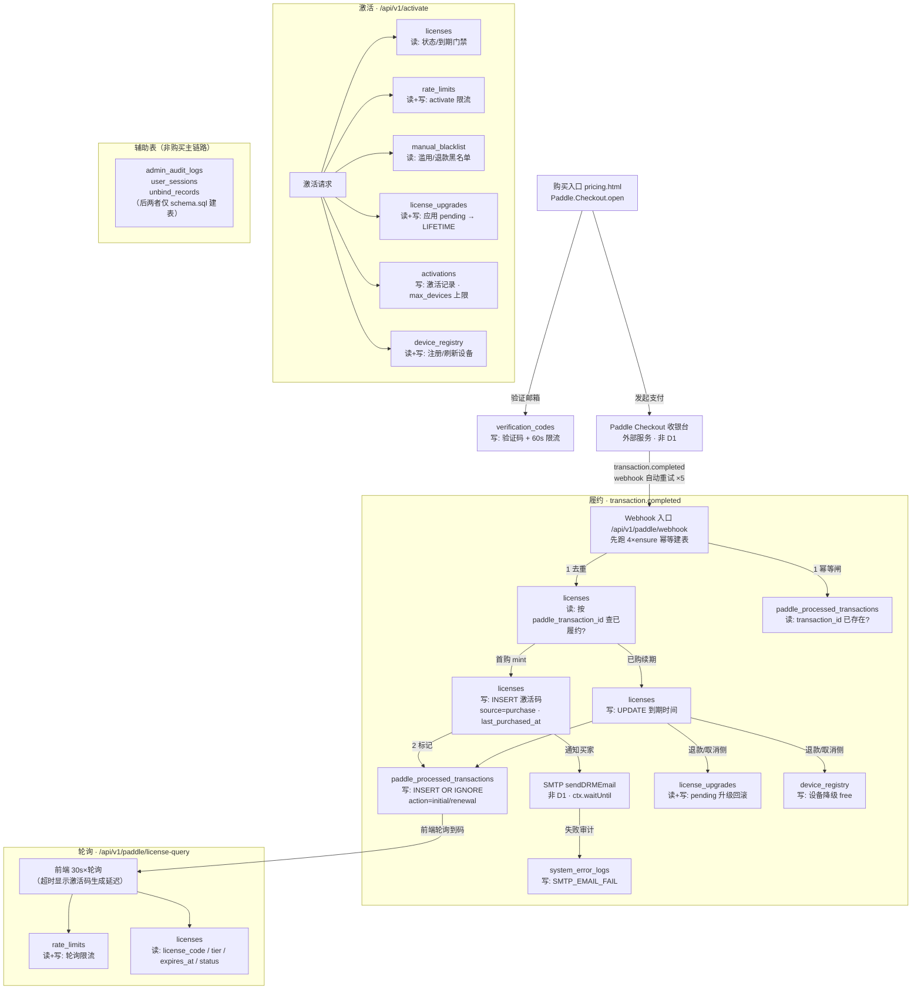

# Paddle 购买履约流程 · 表与环节关系

> 覆盖购买 → 履约 → 激活 → 轮询查询全链路各 D1 表职责。
> 梳理基于生产代码（2026-08-21），代码路径以 `cloudflare/eqt-drm-api` 为准。

## 1. 全链路图

## 2. 各环节表职责速查

| 环节 | 表 | 读/写 | 作用 |
|---|---|---|---|
| 0 · 邮箱验证 | `verification_codes` | 写 | 验证码 + 60s 发送限流 |
| 1 · 支付 | — | — | Paddle Checkout 收银台，外部服务 |
| 2 · 履约 | `licenses` | 读→写 | 按 `paddle_transaction_id` 去重；首购 mint 激活码 / 续订延期 |
| 2 · 履约 | `paddle_processed_transactions` | 读→写 | 幂等闸：`INSERT OR IGNORE` 标记已履约，防 webhook 重试重复发码 |
| 2 · 履约 | `system_error_logs` | 写 | webhook 错误 / SMTP 发送失败审计 |
| 2 · 退款/取消 | `license_upgrades` | 读+写 | pending 升级回滚、取消账本 |
| 2 · 退款/取消 | `device_registry` | 写 | 设备降级回 `free` |
| 3 · 激活 | `licenses` | 读 | 激活码状态/到期门禁 |
| 3 · 激活 | `rate_limits` | 读+写 | `activate:` 频率限流（D1-backed） |
| 3 · 激活 | `manual_blacklist` | 读 | 滥用/退款黑名单拦截 |
| 3 · 激活 | `license_upgrades` | 读+写 | 指纹校验前应用 pending → LIFETIME 升级 |
| 3 · 激活 | `activations` | 写 | 设备激活记录，指纹/设备去重 + `max_devices` 上限 |
| 3 · 激活 | `device_registry` | 读+写 | 设备注册 / 刷新 tier、email、license_code |
| 4 · 轮询 | `rate_limits` | 读+写 | license-query 轮询限流 |
| 4 · 轮询 | `licenses` | 读 | 按 `paddle_transaction_id` 查激活码 |
| 辅助 | `admin_audit_logs` | 写 | 管理员操作审计 |
| 辅助 | `user_sessions` / `unbind_records` | 写 | 会话 / 解绑记录（仅 schema.sql 建表） |

## 3. 幂等设计（两道闸）

1. **`paddle_processed_transactions`**：主键 `transaction_id` + `INSERT OR IGNORE`，标记该交易已履约。Paddle webhook 自动重试（最多 5 次）时，重复投递在此被忽略。
2. **`licenses.paddle_transaction_id` 唯一索引**（`idx_licenses_paddle_txn`）：让 SELECT→INSERT 的 mint 路径原子化，防并发重复建码。索引允许多个 NULL，非购买行（无 txn id）不受影响。

> ⚠️ 2026-08-21 生产事故复盘：`ensurePaddleProcessedTxnTable` 只挂在 `ensureDrmTables()` 下，webhook 履约路径漏调，导致生产 D1 缺表时首次真实购买 `env.DB.batch` 报 `D1_ERROR: no such table` → webhook 重试全败 → 前端轮询超时显示「激活码生成延迟」、邮件未触发。已修：webhook 开头补 `ensurePaddleProcessedTxnTable(env)`。

## 4. 建表来源

| 表 | 运行时 ensure 函数 | 仅 schema.sql |
|---|---|---|
| `licenses` | `ensureDrmTables`（auth.ts:229） | — |
| `activations` | `ensureDrmTables`（auth.ts:254） | 索引 `idx_activations_license` / `idx_licenses_email_hash` / `idx_licenses_created` |
| `system_error_logs` | `ensureDrmTables`（auth.ts:273）/ `ensureAuditLogTable`（error-logger.ts:6） | — |
| `rate_limits` | `ensureRateLimitsTable`（rate-limit.ts:176） | — |
| `manual_blacklist` | `ensureManualBlacklistTable`（blacklist.ts:66） | — |
| `device_registry` | `ensureDeviceRegistryTable`（auth.ts:124） | — |
| `license_upgrades` | `ensureLicenseUpgradesTable`（auth.ts:165） | — |
| `paddle_processed_transactions` | `ensurePaddleProcessedTxnTable`（auth.ts:303） | ⚠️ 索引 `idx_processed_txns_license` 仅 schema.sql:190 |
| `verification_codes` | 仅 `ensureVerificationCodesCreatedAt`（ALTER） | ✅ 建表仅在 schema.sql |
| `user_sessions` / `unbind_records` | 无 | ✅ 建表仅在 schema.sql |
| `admin_audit_logs` | `ensureAdminAuditLogTable`（admin-audit.ts:5） | — |
