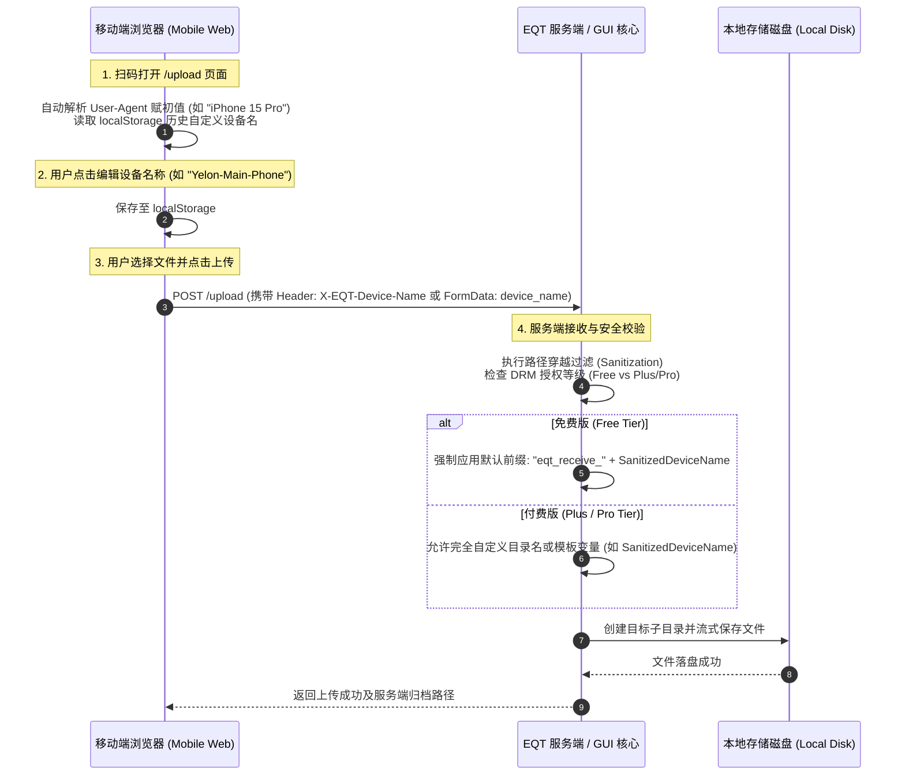

# Receive 模式移动端设备重命名与按设备自动分目录归档设计

> **文档状态**：未来功能架构设计规范 (Design Proposal)  
> **记录日期**：2026-08-31  
> **涉及模块**：移动端 Web 上传页 (`pkg/pages/upload.tmpl.html`)、Go 服务端上传接收处理器 (`pkg/server/`)、桌面 GUI 目录管理 (`desktop/gui/`)、DRM 付费权益体系 (`pkg/config/` / `crypto/`)

---

## 1. 业务背景与用户痛点 (Background & Motivation)

在现有的 `eqt receive`（接收模式）中，所有通过局域网扫码上传的文件均统一保存在当前工作目录或预设的单一目标目录下。在实际高频使用场景中存在以下痛点：

1. **多设备文件混杂**：在家庭、聚会或办公室多人协作场景下，多部手机同时上传照片、视频或文档时，文件全部平铺在同一个根目录下，极难分辨“哪张照片来自哪台手机”。
2. **文件名重名覆盖风险**：不同手机拍摄的图片默认命名格式相似（如 `IMG_0001.JPG`），平铺存储易引发重名冲突或覆盖风险。
3. **管理归类成本高**：用户在电脑端接收完成后，还需要耗费大量时间人工新建目录、将不同设备的素材分类整理。

为此，设计 **移动端发送设备重命名（Device Renaming）** 与 **桌面端按设备名称自动同步创建子目录（Directory Synchronization）** 功能，并制定清晰的 **免费版 vs 付费版（Plus/Pro）差异化商业规则**。

---

## 2. 核心架构与端到端交互流程 (Architecture & End-to-End Flow)



---

## 3. 功能详细设计 (Feature Specifications)

### 3.1 移动端 Web 界面改造 (`pkg/pages/upload.tmpl.html`)
1. **设备名称编辑控件**：
   - 在移动端上传页面顶部（Logo 下方或文件选择区上方）增加轻量高质感的「发送设备名 / Device Name」胶囊输入框。
   - **默认初值**：首次进入页面时，前端基于 `navigator.userAgent` 智能提取易读默认名（例如 `iPhone (Safari)`、`Pixel 8`、`Xiaomi 14` 等）。
   - **本地记忆**：用户可随时点击修改（例如改为 `张三的iPhone`、`4K-录像测试机`），修改后自动保存在手机浏览器的 `localStorage.setItem('eqt_device_name', name)` 中，下次扫码自动带出。
2. **上传协议扩展**：
   - 每次提交文件上传请求时，在 HTTP Request Header 中附加：
     ```http
     X-EQT-Device-Name: <URL_ENCODED_DEVICE_NAME>
     ```
   - 并在 Multipart/Form-Data 的表单字段中携带 `device_name` 作为降级兼容。

---

### 3.2 服务端接收与子目录自动创建 (`pkg/server/`)
1. **安全清洗与防路径穿越 (Strict Sanitization)**：
   - 服务端接收到设备名称字符串后，必须执行严格的白名单清洗，杜绝任何路径穿越攻击（Path Traversal）：
     ```go
     // 伪代码示例：设备名称安全清洗
     func sanitizeDeviceName(input string) string {
         name := strings.TrimSpace(input)
         // 替换/过滤非法路径字符: / \ : * ? " < > | 及控制字符
         invalidChars := regexp.MustCompile(`[/\\:*?"<>|\x00-\x1F]`)
         name = invalidChars.ReplaceAllString(name, "_")
         // 过滤上级目录标识 ..
         name = strings.ReplaceAll(name, "..", "_")
         // 限制最大字符长度 (如 48 字符)
         if len([]rune(name)) > 48 {
             name = string([]rune(name)[:48])
         }
         if name == "" {
             name = "device"
         }
         return name
     }
     ```
2. **目标目录计算与创建**：
   - 根据许可证等级计算最终子目录路径，并调用 `os.MkdirAll(targetDeviceDir, 0755)` 确保物理目录存在后完成文件落盘。

---

## 4. 商业化分级与版本限制策略 (Commercial Tier Gating)

为保障产品的可持续研发投入，对“设备目录命名”功能实施清晰合理的商业化区隔：

| 权益维度 | 免费版 (Free Edition) | Plus / Pro 付费版 (Premium) |
| :--- | :--- | :--- |
| **设备目录命名前缀** | **强制锁定默认前缀**<br>统一生成为：`eqt_receive_<DeviceName>`<br>*(例如：`eqt_receive_iPhone15_Pro`)*<br>用户无法在桌面端或移动端删除该前缀。 | **完全自定义（无强制前缀）**<br>可直接生成纯净的 `<DeviceName>` 目录<br>*(例如：`iPhone15_Pro` 或自定义中文名)*。 |
| **自定义归档模板** | 不支持（仅支持固定的单层前缀子目录）。 | **支持高级路径宏变量**<br>例如：`{device}/{yyyy-mm-dd}/` 或 `{yyyy-mm}/{device}/`。 |
| **桌面端别名覆写** | 不支持。 | 支持在 GUI 设置中为特定硬件指纹/IP 绑定固定的命名别名。 |
| **子目录隔离开关** | 默认开启隔离子目录。 | 可全局自由切换“按设备分目录”或“所有文件平铺汇总”。 |

---

## 5. 桌面 GUI 设置与配置项扩展 (`desktop/gui/`)

在桌面端「Settings（偏好设置）」中的「Receive Mode」面板增加如下配置项：

```yaml
# ~/.local/eqt/config.yml 扩展字段设计
receive:
  # 是否开启按移动端设备名称自动分目录归档 (默认 true)
  auto_device_subfolder: true
  
  # 免费版模式下固定生效
  folder_prefix_locked: "eqt_receive_"
  
  # Plus/Pro 付费版专属自定义配置
  custom_folder_template: "{device}" # 可选 "{device}", "{device}/{date}", "{date}_{device}"
```

* **GUI 界面呈现**：
  - Free 用户：在“目录命名格式”选项旁展示只读前缀 `eqt_receive_`，并标注灰色小字「升级 Plus 解锁纯净自定义命名与高级归档模板」。
  - Plus/Pro 用户：输入框完全开放，可自由编辑前缀、后缀与格式模板。

---

## 6. 开发实施与落地排期计划 (Implementation Checklist)

- [ ] **Phase 1: 移动端 Web 原型与协议支持**
  - 在 `pkg/pages/upload.tmpl.html` 中集成设备名读取、`localStorage` 持久化与编辑 UI。
  - 在上传 JavaScript 中将 `device_name` 注入请求头与 Form 字段。
- [ ] **Phase 2: 服务端安全清洗与目录分流**
  - 在 `pkg/server/` 中实现 `sanitizeDeviceName` 安全过滤器，编写单元测试覆盖路径穿越攻击用例（如 `../../etc/passwd`、`COM1`、`CON` 等）。
  - 根据 DRM 授权状态（`crypto.IsPremium()`）判定是否添加 `eqt_receive_` 强制前缀。
- [ ] **Phase 3: 桌面 GUI 设置集成与多语种文案**
  - 在 Wails 桌面端前端增设“按设备隔离目录”开关与付费权益提示。
  - 完成中、英、德、日多语种文案补齐。
- [ ] **Phase 4: 全流程回归测试与跨端验收**
  - 验证 iPhone、Android、iPad 多端同时上传时，桌面接收端正确生成对应子目录。
  - 验证 Free 版前缀强制生效与 Plus 版纯净命名解锁逻辑。
