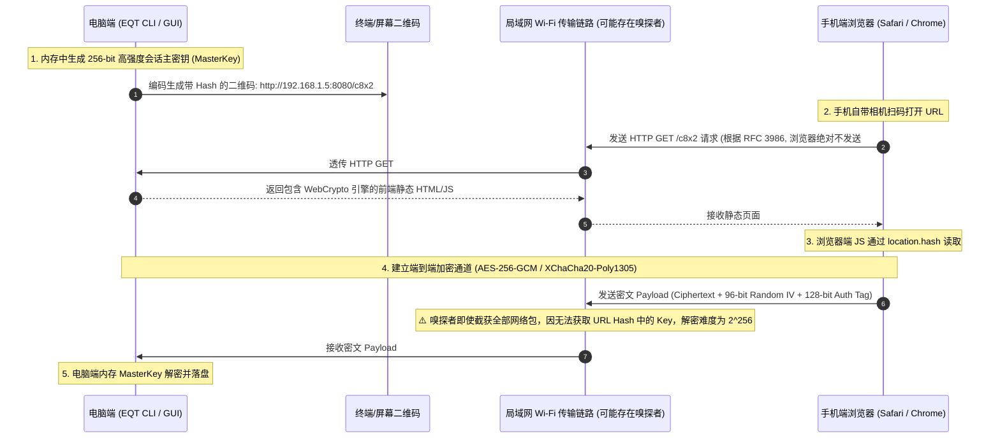
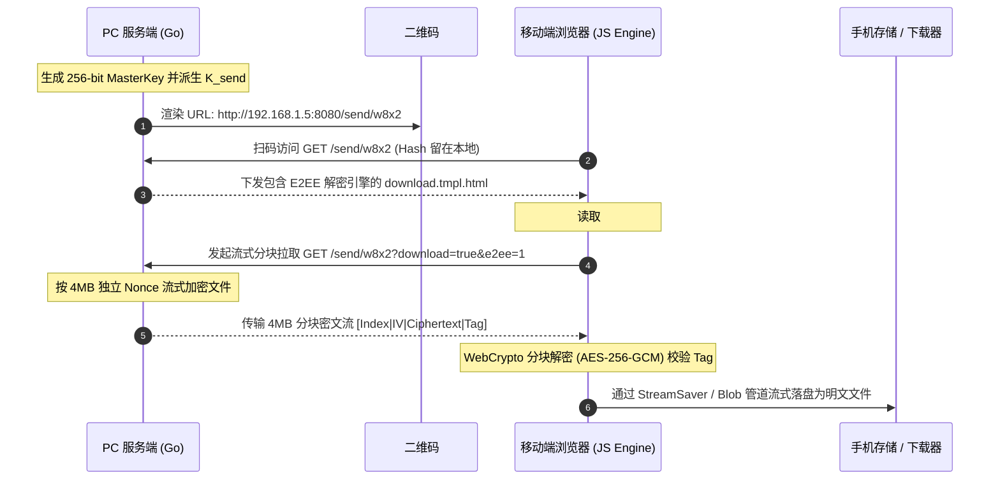
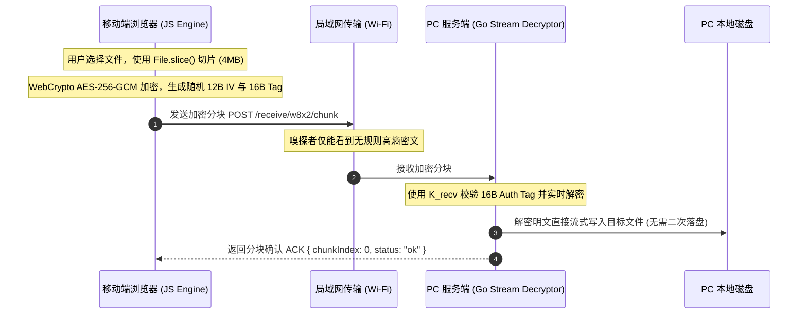
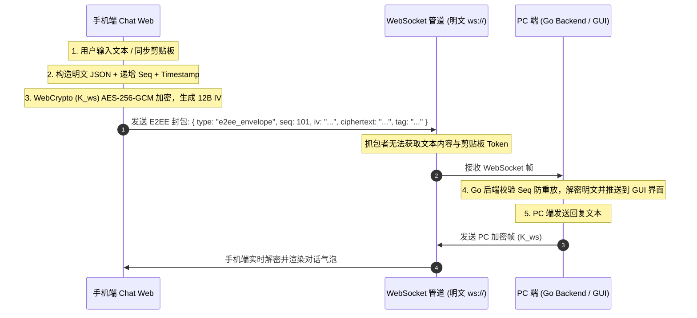
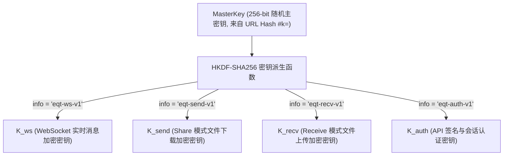

# EQT 局域网零配置端到端加密 (Zero-Configuration E2EE) 架构设计与 Wi-Fi 嗅探防御规范

> **文档状态**：未来核心密码学架构设计提案 (Future Architecture Specification)  
> **记录日期**：2026-09-01  
> **涉及模块**：移动端 Web 密码学引擎 (`pkg/pages/` WebCrypto API)、Go 服务端流式加解密 (`pkg/server/` / `crypto/`)、Chat 模式 WebSocket 协议 (`pkg/chat/v2/protocol/`)、DRM 付费权益体系 (`pkg/config/`)

---

## 1. 现状剖析：局域网 Wi-Fi 抓包嗅探能否截获数据？

### 1.1 技术定性与第一性原理 (First Principle Analysis)
**是的。在未配置 TLS/HTTPS 证书的默认 HTTP 模式下，处于同一局域网（同一 Wi-Fi）下的恶意设备，确实可以通过流量拦截与抓包工具截获并还原全部传输数据（包括文件、文本、图片与 Token）。**

### 1.2 嗅探与拦截的具体攻击路径
1. **开放/公共 Wi-Fi 环境（如星巴克、机场、酒店、咖啡厅）**：
   - 开放式 Wi-Fi 空口未加密，或者所有设备共用同一个预共享密码（PSK）。攻击者只需将无线网卡置于**监听/混杂模式 (Promiscuous / Monitor Mode)**，即可捕获空中广播的所有 802.11 数据帧。
2. **家用/企业 WPA2/WPA3 局域网环境**：
   - 即便 Wi-Fi 链路层有四次握手隔离，局域网内的任何受控设备仍可通过 **ARP 欺骗 (ARP Spoofing / Poisoning)**、**DHCP 伪造** 或 **DNS 劫持** 将受害者的流量重定向到攻击者网卡（中间人攻击 MITM）。
3. **明文协议风险**：
   - EQT 默认运行在原生明文 HTTP (`http://192.168.x.x:PORT`) 与明文 WebSocket (`ws://192.168.x.x:PORT`) 之上。
   - 攻击者在 Wireshark / tcpdump 中只需使用 `Follow TCP Stream`，即可完整 dump 出 `POST /upload` 上传的无损图片与文件二进制，以及 WebSocket 会话中的实时聊天明文。
   - 当前的 URL Path 随机 Token（如 `/w8x2/`）仅能防范“公网盲扫”，无法防范流量已被嗅探的本地中间人（因为 Token 随 URL 明文传输）。

---

## 2. 传统 TLS 的体验困境 vs EQT 零配置 E2EE 突破口

### 2.1 传统自签名 HTTPS 证书的死穴
在局域网内启用传统 TLS/HTTPS 存在致命的交互阻碍：
* 局域网 IP（如 `192.168.1.100`）无法申请由权威 CA（Let's Encrypt 等）签发的合法公网证书。
* 若由 EQT 在本地生成自签名证书，手机浏览器（iOS Safari / Android Chrome）扫码打开时会弹出**高危红色拦截页（“您的连接不是私密连接 / 存在安全隐患”）**，用户需手动在高级设置中信任证书，严重破坏“扫码免装 App 3 秒即用”的核心极简体验。

### 2.2 EQT 破局解法：URL Fragment 零知识密钥协商 + WebCrypto 硬件级 E2EE
利用现代浏览器原生标准 **Web Cryptography API (`window.crypto.subtle`)** 与 **URL Fragment (Hash `#`) 的网络层不可见特性**，实现**完全免证书、无任何安全告警、数学级坚不可摧的零配置 E2EE**！

---

## 3. 核心机制：URL Hash 零知识密钥分发 (Zero-Knowledge Key Delivery)



### 3.1 为什么 URL Hash 是无法被网络嗅探的安全通道？
* **RFC 3986 / W3C HTTP 规范**：浏览器在构建 HTTP 请求包时，**`#` 及其后面的 Fragment 数据绝不会包含在 TCP 请求报文的请求行中**（它只在客户端 DOM 内部作为客户端锚点使用）。
* **物理隔离**：即使局域网内存在恶意 Wireshark 抓包节点，该节点能截获的仅仅是 `GET /c8x2 HTTP/1.1`，解密所需的密钥 `#k=...` **从未在 Wi-Fi 网络线路上流过**。
* **阅后即焚**：手机端前端加载完成后，立即执行 `history.replaceState(null, '', window.location.pathname)` 清除地址栏中的 Hash 串，防止屏幕窥视。

---

## 4. 全链路端到端加解密协议实现规范

---

### 4.1 Chat 模式：WebSocket 实时消息与剪贴板 E2EE
* **算法选择**：`AES-256-GCM`（通过 `window.crypto.subtle` 调用手机芯片硬件 AES 指令集，吞吐量 > 1GB/s，CPU 占用 < 1%）。
* **加密载荷结构 (Ciphertext Frame Payload)**：
  ```json
  {
    "type": "e2ee_message",
    "version": 1,
    "iv": "u8_base64_encoded_12bytes_iv",
    "ciphertext": "base64_encoded_encrypted_payload",
    "tag_len": 128
  }
  ```
* **解密后的明文载荷 (Decrypted Plaintext)**：
  ```json
  {
    "sender": "iPhone-15",
    "timestamp": 1725105600000,
    "msg_type": "text", // "text" | "clipboard" | "file_meta" | "token"
    "content": "sk-proj-abc1234567890..."
  }
  ```
* **安全性保证**：每条消息独立生成 12 字节随机 IV (Initialization Vector)，杜绝 Nonce 重用漏洞。

---

## 4. 全链路端到端加解密协议与数据传输结合方案 (Share / Receive / Chat 模式专项设计)

本章节深入剖析 E2EE 如何与 EQT 现有的三种核心数据传输模式（`Share` / `Receive` / `Chat`）无缝结合，并针对各自的数据流向、协议特征与浏览器运行环境提供针对性的工程架构。

---

### 4.1 Share (Send) 模式：PC 发送 -> 移动端浏览器接收下载

#### 1. 现有数据传输链路
* **链路现状**：PC 端启动 HTTP 服务并展示包含随机路径的二维码（如 `http://192.168.1.5:8080/send/w8x2`）。手机扫码打开后，服务端渲染 `pages.Download` 模板；点击下载时，浏览器发起 `GET /send/w8x2?download=true&item=0`，Go 服务端通过 `http.ServeContent` 或流式 I/O 将原始二进制直接作为 HTTP 响应体吐给客户端。
* **面临挑战**：若服务端直接下发加密二进制，原生浏览器 `<a href="..." download>` 无法在内存中透明解密，用户手机将下载到一个无法识别的 `.enc` 密文文件。

#### 2. E2EE 结合改造架构


#### 3. 核心技术细节
* **分块流式下发协议**：
  * 请求参数携带 `?e2ee=1`，服务端使用 `K_send` 按照固定 **4MB** 分块进行实时流式加密。
  * 每个分块包含独立头部：`[ChunkIndex: 4B | IV: 12B | Tag: 16B | Ciphertext: <= 4MB]`。
* **HTTP Range 与随机定位支持**：
  * 当客户端或视频播放器发起 `Range: bytes=start-end` 时，服务端根据公式将字节范围转换为分块索引：`ChunkStart = floor(start / 4194304)`，`ChunkEnd = floor(end / 4194304)`。
  * 每块拥有独立的 IV 和 GCM Tag，无需依赖前序块，天然支持高并发多线程下载与视频拖拽寻址。

---

### 4.2 Receive 模式：移动端浏览器发送 -> PC 服务端接收落盘

#### 1. 现有数据传输链路
* **链路现状**：PC 启动 `Receive` 服务（`http://192.168.1.5:8080/receive/w8x2`），手机端访问后呈现 `pages.Upload` 上传界面。文件上传通过标准 `multipart/form-data` POST 或基于 `tus.min.js` 的断点续传协议传输至 `/receive/w8x2/tus/`。Go 后端通过 `r.MultipartReader()` 或 tus handler 将字节流原样写入目标目录。

#### 2. E2EE 结合改造架构


#### 3. 核心技术细节
* **前端分块加密流水线**：
  * 前端利用 WebCrypto 的硬件加速能力，以 Worker 线程或异步 Promise 队列读取 `File.slice(offset, offset + 4MB)`。
  * 生成 12 字节安全随机 IV，调用 `crypto.subtle.encrypt` 输出密文与 Tag。
* **Go 服务端零临时文件解密流 (`E2EEDecryptReader`)**：
  * 服务端设计流式解密接口，接收分块数据时即时校验 GCM Tag。
  * 校验通过后直接写入最终目标文件（如 `receive/iPhone-15/photo.jpg`），**杜绝“先存密文临时文件、传输完毕再遍历解密落盘”的双重磁盘 I/O 损耗**。
* **断点续传极简恢复**：
  * 若网络意外中断，前端重连后仅需发起 `GET /receive/w8x2/chunk_status?file_id=xxx`。
  * 服务端返回已落盘的最大连续分块号 $M$，前端直接从第 $M+1$ 块继续加密发送，避免传统流式加密极其复杂的字节级偏移错位。

---

### 4.3 Chat 模式：PC 与移动端双向实时交互 (WebSocket + HTTP)

#### 1. 现有数据传输链路
* **链路现状**：PC 与手机建立 WebSocket 长连接（`pkg/chat/v2/transport/websocket.go`），实现双向实时文本聊天、剪贴板自动同步、输入状态与心跳。大文件附件则通过 `/upload` 和 `/download` 走 HTTP 管道传输。

#### 2. E2EE 结合改造架构
* **双通道隔离体系**：
  * **控制面 / 消息面 (WebSocket)**：全量通信帧采用统一的 `e2ee_envelope` 容器包裹。
  * **数据面 / 附件传输 (HTTP)**：附件在客户端加密后上传，接收端下载密文后在浏览器或本地解密。



#### 3. 核心技术细节
* **WebSocket 加密封包规范**：
  ```json
  {
    "type": "e2ee_envelope",
    "version": 1,
    "seq": 42,
    "timestamp": 1725105600123,
    "iv": "dGhpcy1pcy0xMmJ5dGUtaXY=",
    "ciphertext": "base64_payload...",
    "tag": "base64_16byte_auth_tag..."
  }
  ```
* **解密后的明文载荷**：
  ```json
  {
    "action": "chat_message", // "chat_message" | "clipboard_sync" | "typing"
    "sender": "iPhone-16-Pro",
    "content": "Secret API Key: sk-proj-xxxx"
  }
  ```

---

## 5. 密码学架构体系与子密钥派生规范 (HKDF Key Hierarchy)

为避免单一主密钥在不同传输信道间高频复用引发密码学碰撞或 Nonce 耗尽风险，系统引入标准 **HKDF-SHA256 (RFC 5869)** 派生分层密钥：



### 5.1 密钥域隔离优势
1. **密码学独立性**：即使某个文件分块传输过程中出现罕见的 Nonce 碰撞，也不会波及 WebSocket 实时聊天通道与鉴权通道。
2. **零明文传输**：`MasterKey` 仅存在于二维码 URL Hash 与客户端/服务端内存中，所有网络传输仅使用派生出的专用子密钥。
3. **会话阅后即焚与内存安全 (Zeroize Memory)**：
   - 浏览器端在会话结束（关闭标签页或点击断开）时，显式调用 `crypto.getRandomValues()` 覆写存放密钥的 `Uint8Array` 内存。
   - 服务端退出或清理会话时，主动对 Go 内存中的 key byte slice 执行清零覆写。

---

## 6. 核心架构评审意见与工程避坑指南 (Architectural Opinions & Recommendations)

基于对 EQT 现有代码库（`pkg/server/`、`pkg/chat/v2/`、`pkg/pages/`）的深度技术审计，针对 E2EE 落地提出以下 **6 项关键意见与设计决议**：

### 意见 1：明确废弃单纯的 AES-CTR，全面统一为 4MB Chunked AES-256-GCM
* **背景评估**：历史文档 `docs/crypto/resumable-e2ee-design.md` 曾讨论过 AES-CTR 流式加密。
* **决议与理由**：
  * ❌ **AES-CTR 存在严重安全缺陷**：CTR 模式缺乏消息完整性认证（No Authentication）。局域网内的恶意篡改者可以通过翻转密文特定比特，精准篡改用户传输的可执行文件或文档明文，而接收端无法察觉。
  * ❌ **字节级 Counter 对齐极其脆弱**：CTR 续传需要精确换算 `floor(N / 16)` 并在起始块丢弃前置字节，一旦网络截断导致写入偏移产生 1 字节偏差，后续解密将全部乱码。
  * ✅ **4MB Chunked AES-256-GCM 是最优解**：每个 4MB 分块拥有独立的 12 字节 Nonce 和 16 字节 GCM Auth Tag。既具备 AEAD 硬件级防篡改保护，又将断点续传与 Range 随机寻址天然收敛到分块粒度。

### 意见 2：移动端浏览器（WebKit）大文件下载的“内存墙”破局策略
* **背景评估**：在 Share 模式下，PC 将大文件加密下发给手机浏览器。手机端必须先解密再提供给用户保存。然而 iOS Safari 和部分 Android Chrome 存在极严格的单页面内存限制（通常为 500MB ~ 1GB）。若直接使用 `new Blob([decryptedChunks])` 会导致 WebKit 进程因 OOM 瞬间崩溃刷新。
* **工程对策**：
  * **阶梯式适配策略**：
    1. **小文件 (< 300MB)**：采用标准的 In-Memory Blob + `<a download>` 触发原生下载，体验最轻快。
    2. **超大文件 (> 300MB ~ 几十GB)**：集成 `StreamSaver.js`（利用 Service Worker 的 `fetch` 拦截管道创建模拟下载流）或现代浏览器的 `showSaveFilePicker()` / `FileSystemWritableFileStream`，实现边解密边写入磁盘，内存常驻仅需 8MB。
    3. **极端环境降级**：若用户设备不支持 Service Worker 且文件超限，界面主动友好提示切换为标准局域网模式或分卷传输。

### 意见 3：Go 服务端实施流式解密 Reader，杜绝临时密文二次 I/O
* **背景评估**：在 Receive 模式下，若服务端先接收密文存为 `.tmp.enc`，接收完毕后再读取该文件解密为最终文件，将导致磁盘 I/O 翻倍，并在传输数十 GB 视频时产生严重的卡顿和硬盘磨损。
* **工程对策**：
  * 在 `pkg/server/` 中封装 `ChunkedGCMReader`，直接包装 HTTP 请求的 Body 输入流。
  * 服务端以流式管道逐块读取 `[Header|IV|Tag|Ciphertext]` -> 校验 GCM Tag -> 实时解密 -> 直接写入目标文件 `targetFile.Write(plaintext)`。
  * 磁盘写入性能维持在局域网全速（80~110 MB/s），CPU 占用因 Go 汇编优化几乎无感。

### 意见 4：WebSocket 必须引入单调递增序号（Seq）与时间戳 AAD 防重放
* **背景评估**：局域网嗅探者即便无法解密 WebSocket 密文，但可以通过抓取包含特定操作的密文帧（如同步剪贴板指令、断开连接指令）并发起重放攻击（Replay Attack）。
* **工程对策**：
  * 在每个 WebSocket 帧中强制加入单调递增的 `seq` 序号与毫秒级 `timestamp`。
  * 将 `seq || timestamp` 作为 AES-GCM 的 **AAD (Additional Authenticated Data)** 传入加解密函数。
  * 接收端维护最近收到的窗口序号，任何序号倒退、时间戳偏差 > 30 秒或 AAD 校验失败的帧直接丢弃并记录告警。

### 意见 5：严格遵守前端模块化分离，严禁向 main.js / 模板直接堆砌密码学逻辑
* **背景评估**：遵循仓库规范 `AGENTS.md` 中的“前端开发规范（Modularity & Separation of Concerns）”。
* **工程对策**：
  * 将所有 WebCrypto 密钥导入、HKDF 派生、分块加解密、Worker 通信逻辑封装为独立模块 `pkg/pages/assets/crypto-engine.js`。
  * 在 Chat V2 中解耦为独立 Svelte Store / Service (`pkg/chat/v2/web/src/lib/e2ee/`)。
  * UI 模板仅通过清晰的 Promise API 进行调用，保持视图层纯粹。

### 意见 6：平滑降级与无 Hash 访问防呆处理
* **背景评估**：用户可能通过历史书签、手动输入 IP:Port、或未扫完整二维码访问。
* **工程对策**：
  * 当客户端检测到 `window.location.hash` 不包含 `#k=` 时：
    * 若服务端开启了强制 E2EE 策略：页面展示友好引导屏（“当前处于加密会话，请使用手机相机重新扫描屏幕上的完整二维码”）。
    * 若服务端处于兼容/免费模式：自动平滑回退到标准原生传输链路，确保系统鲁棒性。

---

## 7. 商业化分级与版本限制策略 (Free vs Plus/Pro Tier)

端到端加密（E2EE）在欧美注重隐私的市场属于**极具溢价能力的杀手级卖点 (Privacy Power Feature)**：

| 功能维度 | 免费版 (Free Edition) | Plus / Pro 付费版 (Premium) |
| :--- | :--- | :--- |
| **基础局域网传输** | ✅ 支持原生高速明文传输 + 可选自定义自签证书 TLS。 | ✅ 支持原生高速传输。 |
| **零配置一键 E2EE** | ❌ 提示：升级 Plus 解锁零配置端到端硬件级加密。 | ✅ **默认自动启用**（URL Hash 零知识密钥协商 + AES-256-GCM 硬件加密）。 |
| **Wi-Fi 防嗅探保护** | 基础随机 Path 混淆。 | 🛡️ **数学级绝对防御**（公用/家庭 Wi-Fi 抓包完全无法解密）。 |
| **E2EE 专属安全徽章** | 网页端显示“标准局域网模式”。 | 网页端顶部显示专属绿色“🔒 End-to-End Encrypted (AES-256-GCM)”安全认证盾牌。 |
| **会话阅后即焚清理** | 手动退出。 | 会话关闭时自动覆写并擦除内存密钥 (`Zeroize Buffer`)。 |

---

## 8. 开发实施与演进排期 (Implementation Roadmap)

- [ ] **Phase 1: WebCrypto 密码学基础库与 HKDF 密钥派生引擎**
  - 在 `pkg/pages/assets/` 中编写独立的 `crypto-engine.js`。
  - 实现 URL Hash 解析、`history.replaceState` 阅后即焚、HKDF-SHA256 子密钥派生与 AES-256-GCM 硬件加速调用。
  - 验证 iOS Safari、Android Chrome、Edge、Firefox 跨平台一致性。
- [ ] **Phase 2: Chat 模式双向 WebSocket 与剪贴板 E2EE**
  - 改造 `pkg/chat/v2/protocol/`，定义 `e2ee_envelope` 协议载荷与 AAD 防重放验证。
  - Go 后端与 Svelte 前端实现实时消息/剪贴板透明加解密。
- [ ] **Phase 3: Receive 模式 4MB 分块流式加密上传与服务端零临时文件写盘**
  - 前端基于 `File.slice()` 实现多 Worker 分块流水线加密。
  - Go 服务端实现 `E2EEDecryptReader`，实现分块校验即时落盘与极简断点恢复。
- [ ] **Phase 4: Share 模式分块流式解密下发与 StreamSaver 内存墙破局**
  - Go 服务端实现 `Range` 兼容的 4MB 分块加密下发。
  - 移动端集成小文件 Blob / 大文件 StreamSaver 流式解密下载管道。
- [ ] **Phase 5: 商业化授权门禁、UI 安全盾牌与海外隐私营销**
  - 结合 `pkg/config/` DRM 授权验证体系，实现付费版自动开启与安全徽章点亮。
  - 编写隐私白皮书，在海外社区重点宣发。

