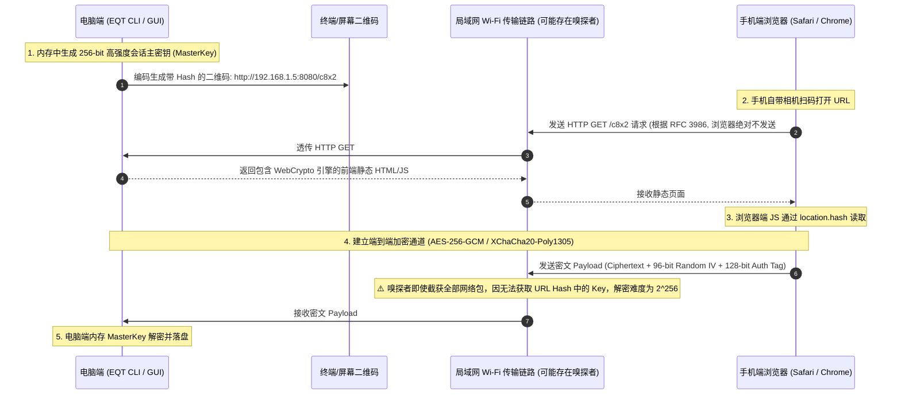

# EQT 局域网零配置端到端加密 (Zero-Configuration E2EE) 架构设计与 Wi-Fi 嗅探防御规范

> **文档状态**：未来核心密码学架构设计提案 (Future Architecture Specification)  
> **记录日期**：2026-09-01  
> **涉及模块**：移动端 Web 密码学引擎 (`pkg/pages/` WebCrypto API)、Go 服务端流式加解密 (`pkg/server/` / `crypto/`)、Chat 模式 WebSocket 协议 (`pkg/chat/v2/protocol/`)、DRM 付费权益体系 (`pkg/config/`)

---

## 1. 现状剖析：局域网 Wi-Fi 抓包嗅探能否截获数据？

### 1.1 技术定性与第一性原理 (First Principle Analysis)
**是的。在未配置 TLS/HTTPS 证书的默认 HTTP 模式下，处于同一局域网（同一 Wi-Fi）下的恶意设备，确实可以通过流量拦截与抓包工具截获并还原全部传输数据（包括文件、文本、图片与 Token）。**

### 1.2 嗅探与拦截的具体攻击路径
1. **开放/公共 Wi-Fi 环境（如星巴克、机场、酒店、咖啡厅）**：
   - 开放式 Wi-Fi 空口未加密，或者所有设备共用同一个预共享密码（PSK）。攻击者只需将无线网卡置于**监听/混杂模式 (Promiscuous / Monitor Mode)**，即可捕获空中广播的所有 802.11 数据帧。
2. **家用/企业 WPA2/WPA3 局域网环境**：
   - 即便 Wi-Fi 链路层有四次握手隔离，局域网内的任何受控设备仍可通过 **ARP 欺骗 (ARP Spoofing / Poisoning)**、**DHCP 伪造** 或 **DNS 劫持** 将受害者的流量重定向到攻击者网卡（中间人攻击 MITM）。
3. **明文协议风险**：
   - EQT 默认运行在原生明文 HTTP (`http://192.168.x.x:PORT`) 与明文 WebSocket (`ws://192.168.x.x:PORT`) 之上。
   - 攻击者在 Wireshark / tcpdump 中只需使用 `Follow TCP Stream`，即可完整 dump 出 `POST /upload` 上传的无损图片与文件二进制，以及 WebSocket 会话中的实时聊天明文。
   - 当前的 URL Path 随机 Token（如 `/w8x2/`）仅能防范“公网盲扫”，无法防范流量已被嗅探的本地中间人（因为 Token 随 URL 明文传输）。

---

## 2. 传统 TLS 的体验困境 vs EQT 零配置 E2EE 突破口

### 2.1 传统自签名 HTTPS 证书的死穴
在局域网内启用传统 TLS/HTTPS 存在致命的交互阻碍：
* 局域网 IP（如 `192.168.1.100`）无法申请由权威 CA（Let's Encrypt 等）签发的合法公网证书。
* 若由 EQT 在本地生成自签名证书，手机浏览器（iOS Safari / Android Chrome）扫码打开时会弹出**高危红色拦截页（“您的连接不是私密连接 / 存在安全隐患”）**，用户需手动在高级设置中信任证书，严重破坏“扫码免装 App 3 秒即用”的核心极简体验。

### 2.2 EQT 破局解法：URL Fragment 零知识密钥协商 + WebCrypto 硬件级 E2EE
利用现代浏览器原生标准 **Web Cryptography API (`window.crypto.subtle`)** 与 **URL Fragment (Hash `#`) 的网络层不可见特性**，实现**完全免证书、无任何安全告警、数学级坚不可摧的零配置 E2EE**！

---

## 3. 核心机制：URL Hash 零知识密钥分发 (Zero-Knowledge Key Delivery)



### 3.1 为什么 URL Hash 是无法被网络嗅探的安全通道？
* **RFC 3986 / W3C HTTP 规范**：浏览器在构建 HTTP 请求包时，**`#` 及其后面的 Fragment 数据绝不会包含在 TCP 请求报文的请求行中**（它只在客户端 DOM 内部作为客户端锚点使用）。
* **物理隔离**：即使局域网内存在恶意 Wireshark 抓包节点，该节点能截获的仅仅是 `GET /c8x2 HTTP/1.1`，解密所需的密钥 `#k=...` **从未在 Wi-Fi 网络线路上流过**。
* **阅后即焚**：手机端前端加载完成后，立即执行 `history.replaceState(null, '', window.location.pathname)` 清除地址栏中的 Hash 串，防止屏幕窥视。

---

## 4. 全链路端到端加解密协议实现规范

---

### 4.1 Chat 模式：WebSocket 实时消息与剪贴板 E2EE
* **算法选择**：`AES-256-GCM`（通过 `window.crypto.subtle` 调用手机芯片硬件 AES 指令集，吞吐量 > 1GB/s，CPU 占用 < 1%）。
* **加密载荷结构 (Ciphertext Frame Payload)**：
  ```json
  {
    "type": "e2ee_message",
    "version": 1,
    "iv": "u8_base64_encoded_12bytes_iv",
    "ciphertext": "base64_encoded_encrypted_payload",
    "tag_len": 128
  }
  ```
* **解密后的明文载荷 (Decrypted Plaintext)**：
  ```json
  {
    "sender": "iPhone-15",
    "timestamp": 1725105600000,
    "msg_type": "text", // "text" | "clipboard" | "file_meta" | "token"
    "content": "sk-proj-abc1234567890..."
  }
  ```
* **安全性保证**：每条消息独立生成 12 字节随机 IV (Initialization Vector)，杜绝 Nonce 重用漏洞。

---

### 4.2 Receive / Share 模式：大文件流式分块加解密 (Chunked Streaming E2EE)
对于 4K 视频、几 GB 的大文件，手机端采用 **Web Streams API + WebCrypto** 实现分块流式加解密，避免爆内存：

1. **分块规范**：固定按 **4MB (4,194,304 字节)** 为一个分块 (Chunk)。
2. **Chunk 封包格式**：
   ```text
   +-----------------------+---------------------+-------------------------------+--------------------------+
   | Chunk Index (4 Bytes) | IV Nonce (12 Bytes) | Ciphertext (Up to 4MB Payload)| Auth Tag (16 Bytes GCM)  |
   +-----------------------+---------------------+-------------------------------+--------------------------+
   ```
3. **断点续传与随机寻址**：由于每个 4MB 分块拥有独立的 IV 和 GCM 认证标签，接收端可直接根据 `Chunk Index * 4MB` 准确定位偏移，天然无缝兼容高并发断点续传与多线程下载。

---

## 5. 商业化分级与版本限制策略 (Free vs Plus/Pro Tier)

端到端加密（E2EE）在欧美注重隐私的市场属于**极具溢价能力的杀手级卖点 (Privacy Power Feature)**：

| 功能维度 | 免费版 (Free Edition) | Plus / Pro 付费版 (Premium) |
| :--- | :--- | :--- |
| **基础局域网传输** | ✅ 支持原生高速明文传输 + 可选自定义自签证书 TLS。 | ✅ 支持原生高速传输。 |
| **零配置一键 E2EE** | ❌ 提示：升级 Plus 解锁零配置端到端硬件级加密。 | ✅ **默认自动启用**（URL Hash 零知识密钥协商 + AES-256-GCM 硬件加密）。 |
| **Wi-Fi 防嗅探保护** | 基础随机 Path 混淆。 | 🛡️ **数学级绝对防御**（公用/家庭 Wi-Fi 抓包完全无法解密）。 |
| **E2EE 专属安全徽章** | 网页端显示“标准局域网模式”。 | 网页端顶部显示专属绿色“🔒 End-to-End Encrypted (AES-256-GCM)”安全认证盾牌。 |
| **会话阅后即焚清理** | 手动退出。 | 会话关闭时自动覆写并擦除内存密钥 (`Zeroize Buffer`)。 |

---

## 6. 开发实施与演进排期 (Implementation Roadmap)

- [ ] **Phase 1: WebCrypto 原型验证与 URL Hash 密钥注入**
  - 在 `pkg/pages/` 中集成 `crypto.subtle` 生成 AES-GCM 密钥与解密逻辑。
  - 验证 iOS Safari、Android Chrome、Firefox 扫码读取 `#k=` 后正常握手解密。
- [ ] **Phase 2: Chat 模式 WebSocket 协议 E2EE 升级**
  - 改造 `pkg/chat/v2/protocol/`，引入 `e2ee_message` 消息类型。
  - Go 后端引入 `crypto/cipher` 与 `crypto/aes` 进行高效内存解密。
- [ ] **Phase 3: Receive / Share 4MB 分块流式加密大文件**
  - 在移动端 JavaScript 中实现 `ReadableStream` 分块加密管道。
  - 服务端实现分块 GCM 校验与流式写盘，确保 80MB/s 局域网满速吞吐。
- [ ] **Phase 4: 安全审计与欧美隐私营销整合**
  - 编写独立的 `/security/e2ee-whitepaper` 页面，详细披露密码学数学模型。
  - 在 Twitter、Reddit 与 Product Hunt 上将 “Zero-Config E2EE for Windows & Mobile” 作为主力宣传卖点。
