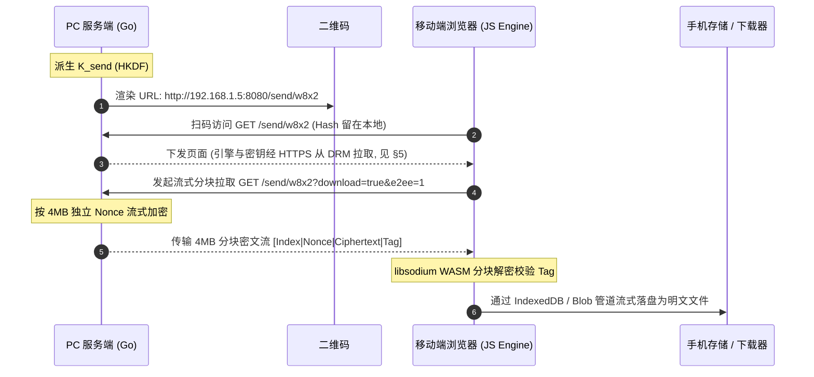
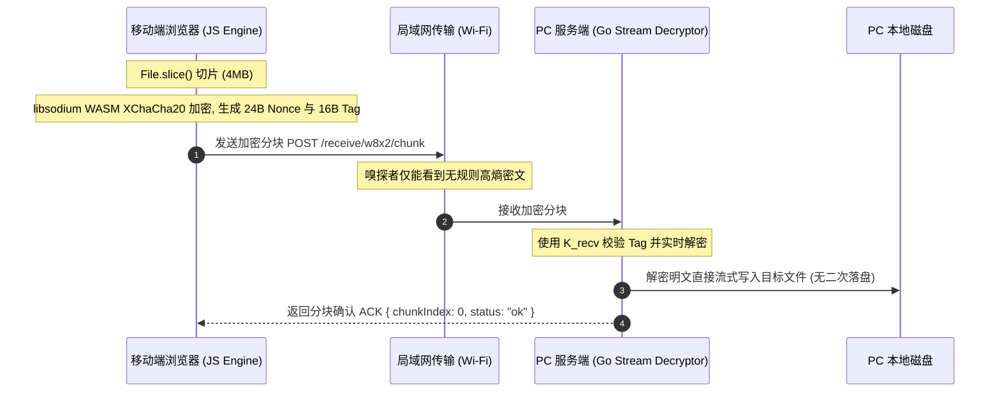
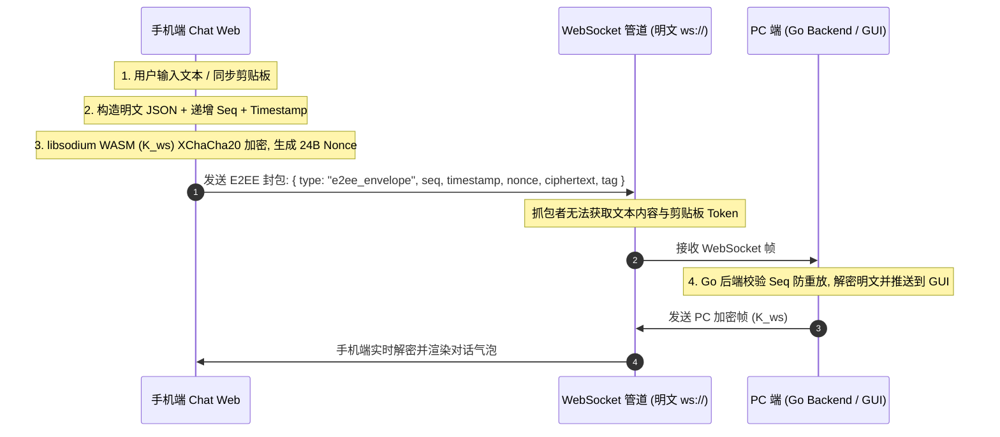
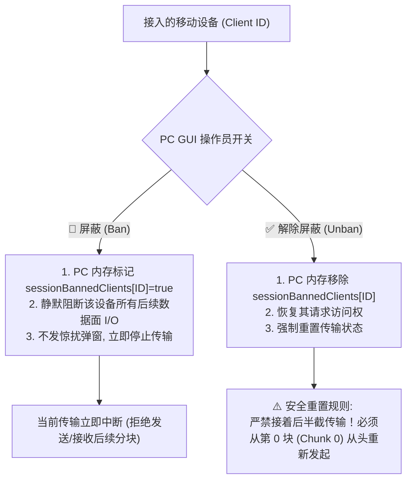
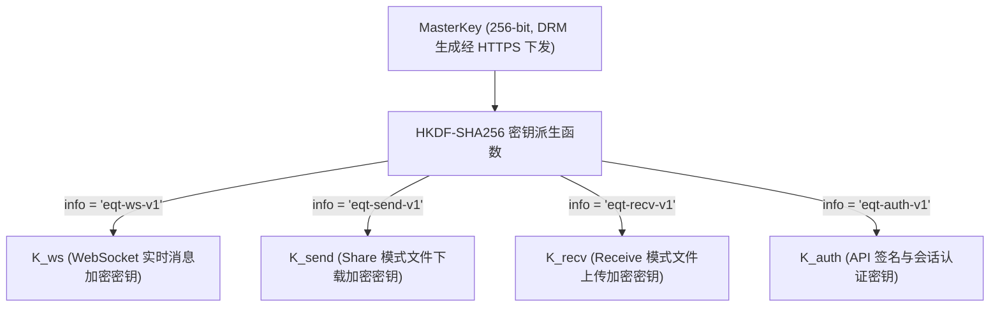

# EQT 局域网端到端加密 (E2EE) 架构设计:DRM 信任锚 + WASM 分块加密

> **文档状态**:核心密码学架构设计提案 (Future Architecture Specification)  
> **记录日期**:2026-08-30  
> **演进说明**:v2 — 依据 Secure Context 分析与 DRM 信任锚重构。废弃「WebCrypto + URL Hash 本地密钥」方案,统一为「DRM 联网会话密钥分发 + libsodium WASM 分块加密」;不可联网时自动关闭加密、降级明文。  
> **涉及模块**:DRM 授权服务 (`cloudflare/eqt-drm-api`)、桌面设置 (`pkg/config/settings.go`)、Go 服务端流式加解密 (`pkg/server/` / `crypto/`)、移动端 WASM 密码学引擎 (`pkg/pages/assets/crypto-engine.js`)、Chat 模式 WebSocket 协议 (`pkg/chat/v2/protocol/`)

---

## 1. 现状剖析:局域网 Wi-Fi 抓包嗅探能否截获数据?

### 1.1 技术定性与第一性原理 (First Principle Analysis)
**是的。** 在未配置 TLS/HTTPS 证书的默认 HTTP 模式下,处于同一局域网(同一 Wi-Fi)下的恶意设备,确实可以通过流量拦截与抓包工具截获并还原全部传输数据(包括文件、文本、图片与 Token)。

### 1.2 嗅探与拦截的具体攻击路径
1. **开放/公共 Wi-Fi 环境(如星巴克、机场、酒店、咖啡厅)**:
   - 开放式 Wi-Fi 空口未加密,或所有设备共用同一个预共享密码(PSK)。攻击者只需将无线网卡置于**监听/混杂模式 (Promiscuous / Monitor Mode)**,即可捕获空中广播的所有 802.11 数据帧。
2. **家用/企业 WPA2/WPA3 局域网环境**:
   - 即便 Wi-Fi 链路层有四次握手隔离,局域网内的任何受控设备仍可通过 **ARP 欺骗 (ARP Spoofing / Poisoning)**、**DHCP 伪造** 或 **DNS 劫持** 将受害者的流量重定向到攻击者网卡(中间人攻击 MITM)。
3. **明文协议风险**:
   - EQT 默认运行在原生明文 HTTP (`http://192.168.x.x:PORT`) 与明文 WebSocket (`ws://192.168.x.x:PORT`) 之上。
   - 攻击者在 Wireshark / tcpdump 中只需使用 `Follow TCP Stream`,即可完整 dump 出 `POST /upload` 上传的无损图片与文件二进制,以及 WebSocket 会话中的实时聊天明文。
   - 当前的 URL Path 随机 Token(如 `/w8x2/`)仅能防范「公网盲扫」,无法防范流量已被嗅探的本地中间人(因为 Token 随 URL 明文传输)。

---

## 2. 传统 TLS 的体验困境 vs EQT 零配置 E2EE 突破口

### 2.1 传统自签名 HTTPS 证书的死穴
在局域网内启用传统 TLS/HTTPS 存在致命的交互阻碍:
* 局域网 IP(如 `192.168.1.100`)无法申请由权威 CA(Let's Encrypt 等)签发的合法公网证书。
* 若由 EQT 在本地生成自签名证书,手机浏览器(iOS Safari / Android Chrome)扫码打开时会弹出**高危红色拦截页**,用户需手动在高级设置中信任证书,严重破坏「扫码免装 App 3 秒即用」的核心极简体验。

### 2.2 EQT 破局方向
利用**公网 HTTPS 信任锚(DRM 服务)下发加密引擎与会话密钥**,配合**局域网应用层加密**实现零配置 E2EE。核心思路:信任与密钥协商放在联网的 HTTPS 信道完成,数据搬运仍走局域网,两者各取所长。

---

## 3. 加密能力定位:付费权益、配置开关与运行模式

### 3.1 付费权益定位
端到端加密(E2EE)是 **Plus / Pro 付费版专属功能**。免费版不提供加密,传输走原生明文并提示升级;付费版在桌面 Settings 中提供加密开关,联网时默认自动启用。

### 3.2 Settings 配置项
在 `pkg/config/settings.go` 的 `DesktopSettings` 中新增布尔字段,遵循既有 `EnableXXX` 命名约定(如 `EnableTelemetry`):

```go
EnableE2EE bool `json:"enableE2EE"` // 付费权益:联网时启用端到端加密
```

配置键为 `enableE2EE`,默认 `false`(免费版始终为 `false`;付费版可通过 Settings 界面开关)。此开关决定**服务端是否以 E2EE 模式启动传输会话并生成二维码**,加密能力本身不依赖用户手动配置任何密钥。

### 3.3 运行模式决策树

```
settings.enableE2EE = false ──────────► 明文传输(标准局域网模式)
settings.enableE2EE = true
   ├─ 联网(可访问 DRM 服务)──────────► 加密模式:DRM 会话密钥 + WASM 分块加密
   └─ 不可联网(DRM 不可达)───────────► 自动关闭加密,降级明文 + 黄色「⚠️ 降级传输」徽章提示
```

### 3.4 离线降级语义
**不可联网时自动关闭加密**,这是本方案与旧「URL Hash 本地密钥」方案的本质差异(旧方案试图离线自加密,见 §4.4 为何放弃)。降级行为:
* 二维码与传输会话按明文模式启动;
* 移动端页面顶部明确显示黄色降级徽章「⚠️ 降级传输 (标准局域网)」(三态图例见 §7.3——离线降级属「降级传输」态，而非自愿明文态);
* 桌面端会话开始前,若用户已开启 `enableE2EE` 但检测到 DRM 不可达,在界面通知「当前网络无法建立加密会话,已降级为标准传输」(沿用应用内通知,不弹浏览器级警告)。

---

## 4. 前端密码学引擎选型:Secure Context 陷阱与 WASM 方案

### 4.1 致命限制:`crypto.subtle` 在局域网 HTTP 下不可用
现代浏览器将 `window.crypto.subtle`(WebCrypto 加解密 API)限定在 **Secure Context(安全上下文)** 中调用:

| 访问方式 | 是否视为安全上下文 | 能否调用 `crypto.subtle` |
| :--- | :--- | :--- |
| `http://localhost` / `http://127.0.0.1` | 是 | 能 |
| `https://any-domain.com`(有效 CA 证书) | 是 | 能 |
| `http://192.168.1.50:8080`(局域网 HTTP) | **否 (Insecure Context)** | **不能,`crypto.subtle === undefined`** |

手机扫码访问 EQT 的 `http://192.168.x.x` 页面,属于 insecure context。因此**旧文档依赖 `crypto.subtle` 的整条 AES-256-GCM 链路在该场景下根本跑不起来**——这是 v1 方案的核心缺陷。

> **⚠️ 同源陷阱全景 (Secure Context API 清单)**：Secure Context 门禁不止作用于 `crypto.subtle`。以下能力在 `http://192.168.x.x` 下**同样全部不可用**，实现时须与 `crypto.subtle` 一视同仁：
> * `navigator.serviceWorker`（Service Worker 注册）——StreamSaver 伪下载管道失效；
> * `window.showOpenFilePicker / showSaveFilePicker / showDirectoryPicker`（File System Access API）——无法直接写系统下载目录；
> * `navigator.storage.getDirectory()`（Origin Private File System）——**MDN 明确标注 Secure Context**，意见 30 的 OPFS 落盘在纯 HTTP 下直接落空；
> * 纯 HTTP 下唯一可用的大容量持久化通道是 **IndexedDB**（不要求 Secure Context），大文件流式落盘须以此为底座（见 §6.2 与意见 30 修正）。

### 4.2 方向性约束:mixed content 决定信任锚必须「反向拉取」
混合内容 (Mixed Content) 规则:**HTTPS 页面加载纯 HTTP 资源会被浏览器拦截**。因此不能把加密前端托管在 DRM 的 HTTPS 页面上去 fetch 局域网 PC(该请求会被当成 active mixed content 阻断,除非 PC 也有可信证书——回到 §2 死局)。

正确的可行形态是**反向组合**:

> 手机打开局域网 HTTP 页面(页面本身不承载机密)→ 页面 JS 主动从 `https://<drm-domain>` 拉取加密引擎与会话密钥(HTTPS 信道,不可篡改)→ 之后与 PC 的传输纯局域网 + 应用层加密。

insecure 页面加载 HTTPS 资源是合法的,不触发 mixed content 拦截。

### 4.3 选型结论:libsodium.js (WASM) + XChaCha20-Poly1305
前端加密引擎改用 **libsodium.js(WASM 构建)** 提供的 `crypto_aead_xchacha20poly1305_ietf`:
* 它是不依赖 `crypto.subtle` 的普通 WASM 模块,在局域网 HTTP 页面可正常运行;
* 纯软件实现即可跑满局域网带宽(无需硬件 AES 指令)。

### 4.4 为什么用 XChaCha20-Poly1305 而非 AES-256-GCM
1. **WASM 性能**:前端失去硬件 AES 加速(不能依赖 `crypto.subtle`)。libsodium 的 `crypto_aead_aes256gcm` 仅在检测到 AES-NI 时才可用,移动端处理器往往缺失;XChaCha20 是纯软件快的设计,任何现代浏览器 WASM 都能全速运行。
2. **192-bit Nonce 冗余**:XChaCha20 使用 24 字节随机 Nonce,大量分块下碰撞概率 2^-96 量级;AES-256-GCM 的 96-bit 随机 Nonce 在「每块独立随机 Nonce」的分块协议里需要更严格的计数器纪律。XChaCha 天然适配分块协议。
3. **服务端对应**:Go 端使用 `golang.org/x/crypto/chacha20poly1305`(当前 `go.mod` 未引入,需新增该标准扩展依赖),与前端算法一一对应。

> **注意**:XChaCha20-Poly1305 的 Nonce 为 **24 字节**,不是 AES-GCM 的 12 字节。所有封包格式与协议字段须以此为基准(见 §6)。

### 4.5 旧「URL Hash 本地密钥」方案为何被放弃
v1 文档设想:二维码携带 `#k=BASE64_KEY`,手机本地用 WebCrypto 解密。该方案存在两个不可修复的问题:
1. `crypto.subtle` 在局域网 HTTP 下不可用(§4.1);
2. 即便改用纯 JS/WASM 引擎,**引擎 JS 本身仍由局域网 HTTP 下发,可被主动 MITM 替换**——攻击者不需破解密钥,注入自己的解密代码即可骗出数据。本地密钥模式下引擎不可信,加密承诺不成立。

因此离线时不做脆弱的本地加密,而是**诚实关闭加密、降级明文**(§3.4)。真正的加密仅在可信引擎可从 HTTPS 取得时提供,这正是 DRM 信任锚(§5)的意义。

---

## 5. DRM 信任锚:会话密钥与加密引擎分发(联网加密模式)

### 5.1 架构总览

```mermaid
sequenceDiagram
    autonumber
    participant PC as PC 端 (Go / GUI)
    participant DRM as DRM 服务 (HTTPS, Cloudflare Worker)
    participant QR as 二维码
    participant Network as 局域网 Wi-Fi (可能存在嗅探者)
    participant MB as 移动端浏览器 (JS Engine)

    Note over PC: 1. settings.enableE2EE=true 且 DRM 可达
    PC->>DRM: 2. POST /api/v1/e2ee/session/create (HTTPS)
    DRM-->>PC: 3. 生成 256-bit MasterKey 并存入 D1,返回 session_id
    PC->>QR: 4. 渲染二维码: http://192.168.x.x:8080/send/w8x2#sid=<短 session_id>
    MB->>PC: 5. 扫码访问 GET /send/w8x2 (Hash 留在本地,不入网络包)
    PC-->>MB: 6. 下发不含机密的页面 + 引导脚本
    MB->>DRM: 7. HTTPS 拉取加密引擎 crypto-engine.js (SRI 校验)
    MB->>DRM: 8. POST /e2ee/session/<sid>/claim (HTTPS, 领取 MasterKey)
    DRM-->>MB: 9. 返回 MasterKey (max_claims 并发限额内, TTL 到期销毁)
    MB->>PC: 10. 建立分块加密传输 (XChaCha20-Poly1305), 全程局域网
    Note over Network: 嗅探者只能看到高熵密文;密钥与引擎从未经过局域网
```

**Hash 信道论证**(RFC 3986):浏览器构建 HTTP 请求时,`#` 及其后的 Fragment **绝不进入 TCP 请求行**,只作为客户端锚点。故 `#sid=` 引用只在手机本地可见。`session_id` 是短引用而非机密,即使被窥屏泄露也无法独立换取密钥(领取受 `max_claims` 并发限额约束 + 短 TTL)。

### 5.2 端点契约(新增至 `cloudflare/eqt-drm-api/src/routes/drm.ts` 的 `handleDrmRoutes`)

**① `POST /api/v1/e2ee/session/create` — 创建加密会话**
- 请求体:
  ```json
  {
    "license_code": "EQT-PRO-20260727-XXXXXX-YYYY",
    "device_id": "<硬件指纹>",
    "mode": "send" // "send" | "receive" | "chat"
  }
  ```
- 服务端动作:
  1. 校验 license 具备 Pro 权益；
  2. 生成全新 256-bit `MasterKey`（Worker `crypto.getRandomValues`）；
  3. **单例覆盖重建 (Singleton Upsert)**：D1 对 `(device_id, mode)` 建唯一索引，以单条 `INSERT INTO e2ee_sessions (session_id, device_id, mode, master_key, claim_count, max_claims, status, expires_at, ttl) VALUES (...) ON CONFLICT(device_id, mode) DO UPDATE SET session_id=excluded.session_id, master_key=excluded.master_key, claim_count=0, status='active', expires_at=excluded.expires_at` 原子完成「新会话插入 + 旧活跃会话作废」，杜绝旧密钥孤儿残留，且不存在「先删后插、中途失败无会话」的窗口；
  4. 返回 `session_id` / `close_token` / `expires_at` / `ttl`。
- 响应:
  ```json
  {
    "session_id": "e2s_9x7KpQ3m",
    "close_token": "ct_<32字节随机,close 鉴权凭证>",
    "expires_at": 1785145800,
    "ttl": 600
  }
  ```
- 复用现有 `cf-access-jwt` / `rate-limit` / `device-registry` / `structured-logger` 中间件。

**② `POST /api/v1/e2ee/session/:id/claim` — 移动端领取密钥**
- 请求体:空或带引擎哈希 `{ "engine_sha256": "...", "client_instance_id": "<浏览器实例UUID>" }`。
- 服务端动作:校验 `session_id` 存在且未过期(`status=active`)且 `claim_count < max_claims`(根据 License 允许的设备并发数,如 Pro 版支持最多 5 台并发)→ 原子递增 `claim_count` → 返回 `master_key_b64`。(避免用户误刷新页面或多台手机并发扫同一二维码时因严格一次性锁死而报错，详见 §9 意见 9)。
- 响应:
  ```json
  {
    "engine_url": "https://<drm-domain>/assets/crypto-engine.js",
    "engine_sha256": "a1b2...",
    "master_key_b64": "BASE64_32_BYTES",
    "algorithm": "XChaCha20-Poly1305"
  }
  ```

**③ `POST /api/v1/e2ee/session/:id/close` — PC 端主动结束并销毁会话**
- 请求体:`{ "device_id": "<硬件指纹>", "close_token": "<create 时下发的短期凭证>" }`。
- 服务端动作:校验 `close_token` 与 `device_id` 均匹配该会话（`status='active'` 且未过期）后执行 `DELETE FROM e2ee_sessions WHERE session_id = ? AND device_id = ?`；仅凭 `session_id` 无法关闭他人会话。
- **幂等语义**:`session_id` 不存在或已过期时返回 `{ "status": "ok", "deleted": false }`,不视为错误——PC 端 close 属尽力而为的异步清理,可安全重放。
- 响应:`{ "status": "ok", "deleted": true }`。

### 5.3 安全边界与局域网抗嗅探密码学证明 (Anti-Sniffing Security Proof)

在公共 Wi-Fi（如咖啡厅、会议室）或路由器已被黑客攻破的恶意局域网环境下，**系统如何确保数据绝对无法被中间人窃取**？基于以下三层严密防线：

1. **第一道防线：密钥从未经过局域网物理链路 (Out-of-Band HTTPS Trust Anchor)**
   - 二维码 URL 为 `http://192.168.x.x:8080/send/w8x2#sid=e2s_xxxx`；
   - 根据 **RFC 3986** 规范，`#` 及其后的 Fragment **绝不进入 TCP 请求行**。局域网嗅探者（Wireshark 抓包）只能看到普通的 `GET /send/w8x2`，根本拿不到 `sid`；
   - 手机浏览器通过公网 **TLS 1.3 HTTPS** 链路向 Cloudflare DRM 发起 `claim` 领取 256 位 `MasterKey`。局域网内的任何攻击者均无法解密 TLS 1.3 流量，因此**攻击者从始至终拿不到任何解密密钥**。
2. **第二道防线：局域网数据面 100% 为高熵密文 (XChaCha20-Poly1305 AEAD)**
   - 文件传输与聊天全链路均采用 **XChaCha20-Poly1305** 逐块加密；
   - 局域网物理信道中流动的全部为 `[ChunkIndex(4B) | Nonce(24B) | Ciphertext(4MB) | AuthTag(16B)]` 伪随机高熵密文；
   - 攻击者即使截获 100% 的网络数据包，在没有 256-bit 密钥的前提下，暴力破解复杂度为 $2^{256}$，数学上绝对不可攻破。
3. **第三道防线：Poly1305 密文防篡改与 Nonce 防重放**
   - 攻击者若在传输过程中篡改密文的任意 1 个比特，接收端校验 16 字节 Auth Tag 时会**瞬间校验失败并直接丢弃**；
   - 每个分块使用全新独立的 24 字节安全随机 Nonce，中间人录制并重放历史数据包会被直接识别拒绝。

* **残余风险诚实声明**：
  * 主动攻击者能篡改的只剩局域网首屏 HTML(引导脚本)。引导脚本不含密钥,只负责从 HTTPS 拉取引擎并执行;攻击者若在扫码瞬间抢先篡改首屏,理论上可诱导用户不走加密流程——但无法窃取密钥或引擎。该残余风险随首屏加载完成即消失;
  * **DRM 服务成为信任根**:DRM 被攻破即可下发假引擎。对所有中心化方案如此,文档予以明示。

### 5.4 DRM 会话生命周期与单例覆盖/销毁机制

针对 DRM 在会话期的数据驻留与单例生命周期，确立以下核心原则：

1. **DRM 绝对不存储任何业务数据 (Zero Business Data in DRM)**：
   - 所有的实际文件二进制、图片、聊天文本和剪贴板内容，**100% 仅在 PC 和手机之间的局域网物理信道流动**，绝对不经过 DRM，DRM 无从知晓任何业务内容。
   - DRM 仅在内存/D1 中短暂保留会话凭据（`MasterKey`、TTL 与 `claim_count`），密钥寿命 ≤ 600s。
2. **会话期间保留的必要性与多端可用性保证**：
   - 在活跃会话期（10 分钟 TTL 内），DRM 必须完整保留当前会话凭据，以确保：
     - **Share (Send) 模式**：PC 分享文件给会议室多位同事时，多台手机在会话期内陆续扫码均可顺利领取密钥下载；
     - **Receive 模式**：多台手机在会话期内同时或先后扫码并发上传照片到 PC 均可正常握手；
     - **Chat 模式**：多台设备随时加入聊天室，且移动端切后台、误刷新时均可无缝重连 Re-claim。
3. **单例前提（必须显式声明）**：同一台 PC 的同一模式（`device_id, mode`）在同一时刻仅允许 **1 个活跃 E2EE 会话**。桌面 GUI 天然单实例满足该前提；CLI 多实例并发 `eqt send` / `eqt receive` 需自行串行——后启动的会话会覆盖前者，被覆盖的旧会话中已扫码的移动端会收到「会话已被新任务覆盖，请重新扫码」提示。该前提使覆盖重建无需任何跨会话状态机（架构极简）。
4. **全模式统一的「覆盖重建 + 主动销毁 + TTL 兜底」三路径闭环**：
   - **覆盖重建（create 时）**：`POST /session/create`（§5.2 ①）对 `(device_id, mode)` 以单条 `INSERT ... ON CONFLICT(device_id, mode) DO UPDATE` 原子作废旧会话并插入新会话，无「先删后插」窗口；
   - **主动销毁（close 时）**：PC 端正常点击关闭或退出程序时，异步触发 `POST /session/:id/close`（§5.2 ③），DRM 校验 `close_token` 后逻辑删除该行；
   - **兜底（TTL + 惰性清理）**：即使 PC 异常崩溃未触发 close，旧会话密钥也在 ≤600s 后过期失效，由意见 20 的抽样惰性清理收敛残留行。三条路径与意见 8 方案一、意见 22 口径一致。
5. **删除语义的诚实声明**：D1 的 `DELETE` 为逻辑删除，托管存储层不提供物理覆写（无 secure-delete）；但密钥寿命 ≤600s 且会话一旦作废即不可再 claim，即使存储层存在残留也已过期失效，不构成解密风险。


---

## 6. 全链路分块加解密协议(Share / Receive / Chat 统一)

### 6.1 统一分块封包格式
文件类传输(Share / Receive)按固定 **4MB (4,194,304 字节)** 明文为一个分块 (Chunk),每块独立加密:

```text
+-----------------------+----------------------+-------------------------------+--------------------------+
| Chunk Index (4 Bytes) | Nonce (24 Bytes)     | Ciphertext (Up to 4MB Payload)| Auth Tag (16 Bytes)      |
+-----------------------+----------------------+-------------------------------+--------------------------+
```

* 每块生成独立 24 字节安全随机 Nonce,调用 `crypto_aead_xchacha20poly1305_ietf_encrypt`;
* 每块拥有独立 Auth Tag,**无需依赖前序块**——天然支持 HTTP Range 随机寻址、高并发多线程下载与断点续传;
* 服务端 Go 端用 `golang.org/x/crypto/chacha20poly1305` 的 `Seal` / `Open` 逐块对应。

### 6.2 Share(Send)模式:PC 发送 → 移动端浏览器接收下载

#### 1. 现有数据传输链路
PC 端启动 HTTP 服务并展示含随机路径的二维码(如 `http://192.168.1.5:8080/send/w8x2`)。手机扫码打开后,点击下载时浏览器发起 `GET /send/w8x2?download=true&item=0`,Go 服务端通过 `http.ServeContent` 或流式 I/O 将原始二进制直接作为 HTTP 响应体吐给客户端。

#### 2. E2EE 结合改造架构


#### 3. 核心技术细节
* 请求参数携带 `?e2ee=1`,服务端使用 `K_send` 按 4MB 分块实时流式加密;
* **HTTP Range 随机定位**:`Range: bytes=start-end` 时服务端换算分块索引 `ChunkStart = floor(start / 4194304)`、`ChunkEnd = floor(end / 4194304)`,独立 Nonce/Tag 使视频拖拽寻址无需解密前序块;
* **浏览器内存墙破局**(阶梯适配):
  1. 小文件 (< 500MB):In-Memory Blob + `<a download>` 原生下载;
  2. 超大文件 (≥ 500MB):`fetch` 流式读取(`response.body.getReader()`)→ 逐块解密 → 以分件 Blob 写入 **IndexedDB**,传输完成后由用户触发「导出」重装或分卷导出,内存常驻仅 ~8MB(**StreamSaver / `showSaveFilePicker` / OPFS 均属 Secure Context 门禁,局域网 HTTP 下不可用,见 §4.1 同源陷阱全景**);
  3. 极端降级:IndexedDB 配额受限(如 iOS Safari 隐私模式,配额约 1GB 量级)且文件超限 → 提示切换标准明文模式或分卷传输。

### 6.3 Receive 模式:移动端浏览器发送 → PC 服务端接收落盘

#### 1. 现有数据传输链路
PC 启动 `Receive` 服务,手机访问 `pages.Upload` 上传界面,文件经 `multipart/form-data` POST 或 `tus.min.js` 断点续传至 `/receive/w8x2/tus/`。Go 后端通过 `r.MultipartReader()` 或 tus handler 将字节流原样写入目标目录。

#### 2. E2EE 结合改造架构


#### 3. 核心技术细节
* 前端 `File.slice(offset, offset + 4MB)` 多 Worker / Promise 队列分块加密,逐块 POST;
* **Go 服务端零临时文件解密流 (`E2EEDecryptReader`)**:逐块读取封包 → 校验 Tag → 解密 → 直接写入最终目标文件,杜绝「先存密文临时文件、完毕再解密落盘」的双重磁盘 I/O(数十 GB 视频时尤为关键);
* **断点续传极简恢复**:网络中断后前端发起 `GET /receive/w8x2/chunk_status?file_id=xxx`,服务端返回已落盘最大连续分块号 `M`,前端从 `M+1` 块继续发送,避免字节级偏移错位。

### 6.4 Chat 模式:PC 与移动端双向实时交互 (WebSocket + HTTP)

#### 1. 现有数据传输链路
PC 与手机建立 WebSocket 长连接(`pkg/chat/v2/transport/websocket.go`),实现双向实时文本聊天、剪贴板自动同步、输入状态与心跳。大文件附件经 `/upload` 与 `/download` 走 HTTP 管道。

#### 2. E2EE 结合改造架构(双通道隔离)
* **控制面 / 消息面 (WebSocket)**:全量通信帧采用统一 `e2ee_envelope` 容器包裹;
* **数据面 / 附件传输 (HTTP)**:附件在客户端加密后上传,接收端下载密文后解密。



#### 3. 核心封包规范
* **WebSocket 加密封包**:
  ```json
  {
    "type": "e2ee_envelope",
    "version": 1,
    "seq": 42,
    "timestamp": 1725105600123,
    "nonce": "base64_24bytes_nonce",
    "ciphertext": "base64_payload...",
    "tag": "base64_16byte_auth_tag..."
  }
  ```
* **解密后的明文载荷**:
  ```json
  {
    "action": "chat_message",
    "sender": "iPhone-16-Pro",
    "content": "Secret API Key: sk-proj-xxxx"
  }
  ```
* **防重放**:`seq || timestamp` 作为 AEAD 的 **AAD (Additional Authenticated Data)** 传入加解密;接收端维护最近窗口序号,序号倒退、时间戳偏差 > 30 秒或 AAD 校验失败的帧直接丢弃并记录告警。

---

## 7. 设备管理与静默屏蔽门禁机制 (Device Visibility & Silent Ban Gate)

在局域网加密传输中（尤其是会议室、开放式办公区等多人 Wi-Fi 场景），PC 主机操作员必须对接入的移动设备拥有绝对的**可见性（无法隐藏）**与**控制权（随时可静默屏蔽 / 恢复）**。

> **定位与分级**：本机制为传输会话**通用能力**，明文与 E2EE 模式均生效，全部落在 PC 局域网服务端（`pkg/server/server.go`），与 DRM 无关（DRM 不感知也不存储任何设备名单）。版本分级：基础暂停免费版可用（对应 §10「基础暂停」）；静默屏蔽与安全从头恢复门禁为 Plus / Pro 付费权益。

#### 7.1 设备显性化、新设备提醒与改名实时同步 (Device Visibility & Live Rename Sync)

1. **强实名握手准入**：
   - 移动端在扫码并从 DRM 领取密钥后，向 PC 局域网服务端发起任何加解密分块拉取/上传/WebSocket 握手前，必须携带设备标识头：`X-Client-Instance-Id` (UUID) 与 `X-Device-Name`（如 `iPhone 16 Pro`）。该标识头为 **§6 全部数据面请求（下载分块、上传分块、Chat WebSocket 握手）的通用强制头**；
   - PC 服务端（`pkg/server/server.go`）在接收到请求的第一时间将该设备注册到 `clientStates` 状态机中，并向 PC GUI 界面与终端实时广播更新。
2. **新设备接入醒目提醒 (Prominent New Device Notification)**：
   - 无论在 Share 还是 Receive 模式下，**每当有新设备首次扫码握手接入，PC 端必须立即给出显眼提示**：
     - **GUI 界面**：顶部状态栏或通知区弹出醒目 Toast 提示（如 `🔔 [新设备接入] iPhone 16 Pro 已连接`），并在传输设备列表中高亮该设备卡片；
     - **CLI 终端**：标准输出高亮打印接入日志，杜绝未经察觉的静默连入。
3. **设备改名实时联动同步 (Live Device Rename Sync)**：
   - 深度集成既有的设备改名同步协议（`POST /api/device/rename`）：
   - 当移动端用户在手机端修改自身设备名称（如改为“张三的 iPhone”）时，PC 服务端接收并通过 SSE/WS 即刻向 PC 界面广播变更；
   - PC 端设备列表（`DeviceCard`）即时无刷新更新标签，让 PC 操作员随时一目了然“当前是谁在传输”。
4. **数据流强制绑定（防隐形）**：
   - 任何未在 PC 状态机完成登记的匿名请求，一律直接拒绝（返回 `401 Unauthorized`）；
   - PC 监控面板实时、无遗漏地列出所有已连接设备的：设备名称、客户端 UUID、传输进度、实时传输速率、已传分块与连接状态。**绝对不存在任何可隐身传输的幽灵设备**。

---

### 7.2 极简「静默屏蔽与重置恢复」机制设计 (Silent Ban & Clean Reset Recovery)

为追求极致的工程简洁性与可靠性，系统弃用复杂的多级告警握手协议，全面采用 **PC 单向数据面网关门禁 (Silent Data-Plane Gate)**：



#### 1. 传输中的静默屏蔽与断流规则 (In-Flight Ban Rules)
* **Share (Send) 模式**：
  - 若在传输过程中 PC 操作员点击了 `[🚫 屏蔽]`，PC **立即停止发送后续的数据分块**（当前进行中的分块直接中断，后续分块请求统一返回 `403 Forbidden`）。
* **Receive 模式**：
  - 若在移动端上传过程中 PC 操作员点击了 `[🚫 屏蔽]`，PC **立即拒绝写入后续上传分块**，并立刻废弃当前未完成的临时文件（§7.5.1）。
* **零惊扰原则**：无需下发破坏性广播，移动端表现为网络传输暂停/中断。

#### 2. 传输中的解除屏蔽与从头重置规则 (In-Flight Unban Rules)
* **Share (Send) 模式**：
  - 若在传输过程中解除了屏蔽，PC **绝对不传输后面的未决数据**；移动端**只能从头开始（从第 0 块）重新发起下载传输**。
* **Receive 模式**：
  - 若在上传过程中解除了屏蔽，PC **绝对不接收后半截的分块拼接**；移动端**只能从第 0 块完整重新发起上传**。
* **核心防错收益**：彻底杜绝了断点碎片拼接引发的 Nonce 状态紊乱、分块校验撕裂或文件损坏风险。

> **边界与遗留 (Honest Limits)**：
> * `sessionBannedClients` 为 **PC 进程内存态**，进程退出或新传输任务启动即清空——屏蔽/恢复均仅作用于「本会话」= 当前传输任务，不跨任务持久化；
> * E2EE 模式下被屏蔽的设备**仍可完成 DRM claim**（DRM 不感知 PC 名单），但其所有 LAN 数据面请求被 403 拦截、拿不到任何密文，密钥无可用性——数据面阻断已构成完整防护，无需反向通知 DRM；
> * 屏蔽/恢复对 Chat 模式的 **WebSocket 长连接同样生效**（屏蔽即挂断连接，恢复后重新握手建立连接）。

---

### 7.3 PC GUI / CLI 极简交互与降级状态图标设计 (Degraded Transfer UI Indicators)

为确保操作员与接收端对当前传输安全与技术状态具备 100% 透明知情权，对**正常加密传输**与**降级传输 (Degraded / Fallback Transfer)** 定义统一的图标准则：

* **1. PC 桌面 GUI 传输面板 & 设备卡片 (`DeviceCard`)**：
  - **E2EE 硬件级加密模式**：设备卡片与总进度条旁展示绿色盾牌徽章 `🔒 E2EE`（Tooltip: `端到端硬件级加密传输中: XChaCha20-Poly1305`）；
  - **降级传输模式 (Degraded Transfer)**：
    - 当发生 DRM 不可达降级明文、Tus 断点续传降级为单次传统上传、或网络受限致传输模式/协议被迫回退时（纯慢速不触发），设备卡片与进度条旁**显式添加黄色警告图标 `⚠️ 降级传输`**；
    - 鼠标悬停 (Hover Tooltip) 展示具体降级原因（例如：`⚠️ 降级提示：因网络离线或信任锚不可达，本次传输已自动降级为标准局域网明文传输`）；
  - **设备管理交互开关**：
    - 正常状态显示：`[ 🚫 屏蔽 ]`（点击后停止对该设备发送/接收后续数据）；
    - 已屏蔽状态显示：`[ ✅ 恢复 ]`（点击后允许该设备从头重新发起全新传输）。
* **2. 移动端传输页面 (Download / Upload / Chat)**：
  - **E2EE 加密模式**：顶栏展示绿色 `🔒 E2EE Active` 徽章；
  - **降级传输模式**：顶栏切换为黄色降级徽章 `⚠️ 降级传输 (标准局域网)`，文件传输进度条旁同步展示 `⚠️` 标识，并在页面内以非阻塞轻量横幅提示降级状态，严禁调用原生 `alert()`。
* **3. CLI 终端交互**：
  - 加密模式输出 `[🔒 E2EE]` 绿色前缀，降级模式输出 `[⚠️ DEGRADED]` 黄色前缀；
  - 支持快捷键一键按设备序号切换屏蔽/解封状态（如输入 `b 1` 屏蔽设备 1，再次输入 `b 1` 解除屏蔽）。
* **4. 统一状态图例（三态语义，全端一致）**：
  - **绿色 `🔒 E2EE`**：加密正常，唯一可信状态；
  - **黄色 `⚠️ 降级传输`**：本应加密/续传，因 DRM 不可达、Tus 断点续传降级，或网络受限致传输模式/协议被迫回退——短暂、可恢复，须 hover/点击展示具体降级原因；
  - **灰色 `🔓 标准局域网模式`**：`enableE2EE=false` 或免费版的自愿明文态——稳定状态，**非降级**，与黄色降级态在语义上严格区分（意见 6/意见 29 的灰色徽章即此态）。

---

### 7.4 设备身份持久化、再次扫码识别与防拉黑绕过机制 (Device Identity & Anti-Evasion)

针对同一设备重扫码的识别机制、各设备密钥关系及防绕过策略，确立以下技术规范：

1. **同一设备再次扫码/刷新的识别原理**：
   - 移动端首次扫码时，前端 JS 生成全局唯一 UUID `client_instance_id`，连同设备名称（由 UserAgent 解析如 `iPhone 16 Pro` + 用户自定义昵称）持久化写入移动端浏览器的 **`localStorage` / `IndexedDB`**；
   - 当同一台手机**再次扫码**或**刷新页面**时，前端 JS 自动读取本地存储中的 `client_instance_id`，并在所有向 PC 发送的请求头中携带 `X-Client-Instance-Id`；
   - PC 服务端（`pkg/server/`）比对内存中的 `clientStates`，精准判定其为“同一设备重新接入”；若该设备已被屏蔽（Ban），则网关直接拦截并返回 403；若操作员已解除屏蔽（Unban），该设备重新扫码/刷新后可从第 0 块干净地重新发起传输（§7.2）。
2. **各设备的密钥关系 (Key Relationship Across Devices)**：
   - **当前主方案（Phase 1-2 DRM 信任锚方案）**：在同一个会话房间内，所有扫了同一个二维码的合法设备，从 DRM 领取的是**同一个共享主密钥 `MasterKey`**（通过 HKDF 派生相同的 `K_send`, `K_recv`, `K_ws`）。但**每个设备的每个分块均使用全新独立的 24 字节安全随机 Nonce**，且各设备通过 `X-Client-Instance-Id` 维护独立的数据流与断点续传状态机；
   - **未来演进方案（ECDH 零知识，暂不排期）**：演进到 ECDH 后，每台手机生成各自的公私钥对与 PC 协商，此时各设备派生出的 `MasterKey_device` 则是**每设备完全独立**的。
3. **恶意设备通过“清空存储/隐私模式换马甲”绕过拉黑的三重防御**：
   - 若被拉黑的恶意用户试图通过清空 `localStorage` 或开启无痕模式伪造全新 UUID 重新接入，系统提供三重防护：
     - **① DRM `max_claims` 配额硬顶**：DRM 会话设有严格的领取上限（如 Pro 版最多 5 台）。恶意用户每清空一次存储即消耗 1 次配额，恶意刷几次后配额即被耗尽，彻底封死；
     - **② PC GUI 实时强实名弹窗**：任何未见过的全新 UUID 接入时，PC 界面立即弹出醒目通知“⚠️ 新设备加入: [Android Chrome]”，PC 操作员可一目了然并一秒点击 `[🚫 屏蔽]`；
     - **③ 设备接入审批模式 (Device Approval Mode)**：在高度敏感场景下，PC 端可开启审批门禁，任何新设备首次扫码后必须由 PC 操作员在屏幕上点击“允许接入”，否则网关拒绝下发数据。

### 7.5 必须注意的 5 项核心工程细节与原子清理准则 (Critical Considerations)

在具体编码实施 Share / Receive 设备管理与加解密流时，必须严格遵守以下 5 项工程红线：

1. **Receive 模式未完成脏数据的物理清理与原子落盘**：
   - 若某设备上传 2GB 文件至 1.2GB 时被屏蔽，PC 端正在写入的临时文件 `filename.tmp` 必须**立即截断并废弃删除**，严禁残留半截脏文件在用户接收目录；
   - 当该设备解除屏蔽并重新上传时，必须从第 0 块开始重新建立临时文件，直至全部分块 Poly1305 验签完毕后，再通过原子重命名（Atomic Rename）提交为最终文件。
2. **HTTP 状态码与响应语义规范**：
   - 处于屏蔽状态下的分块请求统一返回 `403 Forbidden`；
   - 解除屏蔽后，若移动端错误地尝试直接请求历史断点（`index > 0`），服务端返回 `409 Conflict ("Transfer reset: Please restart from chunk 0")` 予以拒绝，强制客户端重置为 0 偏移；同时该设备的 `chunk_status` 断点查询（§6.3）必须返回 `M=0`，与服务端已废弃的临时文件保持一致，杜绝「旧断点续传 + 新临时文件」错位。
3. **服务端内存锁与并发竞态保护 (`sync.RWMutex`)**：
   - PC 服务端中的 `sessionBannedClients` Map 与 `clientStates` 在被高并发分块 Handler 检查时，与 GUI 操作员点击“屏蔽/恢复”存在并发读写，**必须全程使用 `sync.RWMutex` 严格加锁保护**，杜绝 Go runtime 的 concurrent map read/write 致命 panic。
4. **多文件传输队列的会话级级联阻断 (Multi-File Queue Cascade)**：
   - 若 PC 分享多个文件（或文件夹），对某设备执行屏蔽会**级联阻断当前文件及队列中后续所有文件**；解封后该设备必须从文件队列的第 0 个文件的第 0 块重新开始排队。
5. **移动端端内通知与防自旋重试 (In-App Notification & Backoff)**：
   - 移动端在收到 403 / 409 拦截后，必须立即停止后台自旋式高频重试（指数退避），并在页面内以**端内通知 (In-app Notification)** 形式展示“传输已暂停，点击重新从头开始”，严格遵循项目规范，严禁调用浏览器原生 `alert()` 阻塞弹窗。

---

## 8. 密码学架构与密钥派生体系 (HKDF Key Hierarchy)

为避免单一主密钥在不同传输信道间高频复用引发密码学碰撞或 Nonce 耗尽风险,引入标准 **HKDF-SHA256 (RFC 5869)** 派生分层子密钥:



### 8.1 密钥域隔离优势
1. **密码学独立性**:单个文件分块出现罕见 Nonce 碰撞,不波及 WebSocket 与鉴权通道;
2. **零明文传输**:`MasterKey` 仅经 HTTPS 存在于 DRM 与两端内存,所有局域网传输仅使用派生子密钥;
3. **会话阅后即焚与内存安全 (Zeroize Memory)**:
   - 浏览器端会话结束时,对存放密钥的 `Uint8Array` 显式执行 `.fill(0)` 覆写(注意:不应依赖 `crypto.getRandomValues()` 做覆写——那是随机数生成器,不是清零;且经 libsodium 导入的 opaque key 对象本身不可被 JS 覆写,应在密钥字节数组上清零);
   - 服务端退出或清理会话时,主动对 Go 内存中的 key byte slice 执行清零覆写。

---

## 9. 架构评审意见与工程避坑指南 (38 项落地细则与 8 大核心准则)

> **极简实施核心导图 (Executive Tenets)**：为在编码实施中保持高效简洁、杜绝代码过度设计，全链路 38 项细则高度收敛为以下 **8 大核心工程原则**：
> 1. **密码学基石**：全链路统一 4MB XChaCha20-Poly1305 + HKDF-SHA256 派生 + AEAD 信封内明文增量 SHA-256 校验（防意外损坏，主动篡改由逐块 Poly1305 兜底）+ WASM 引擎内联/哈希防篡改；
> 2. **信任锚与生命周期**：PC 各模式单例原子覆盖重建（`INSERT ... ON CONFLICT`），退出主动 `close`，10 分钟 TTL 物理抹除，DRM 应用层零日志；
> 3. **数据面流式 I/O**：专用 REST 端点 `POST /receive/:path/chunk`，Go 服务端 `sync.Pool` 4MB 内存池化，多文件流式 ZIP 归档传输；
> 4. **移动端沙箱与落盘**：libsodium (WASM) 运行于 Worker（Transferable 零拷贝），落盘阶梯（<500MB 内存 Blob $\rightarrow$ $\ge$500MB IndexedDB 分件落盘，明确纯 HTTP 下单文件 ≈1GB 诚实边界）；
> 5. **设备管理与门禁**：强制 UUID 实名准入与改名实时同步，单向静默门禁（`sessionBannedClients`），解封后强制从 Chunk 0 重新发起；
> 6. **网络漫游与保活**：鉴权绑定 UUID 解耦 IP:Port，移动端 WakeLock 与桌面端关闭 Power Throttling 防休眠，基于超时连续失败计数的自适应并发避让；
> 7. **用户体验与端内通知**：响应式绿盾 `🔒 E2EE` vs 黄色降级图标 `⚠️ 降级传输`，全链路使用端内轻量 Toast/Banner，严禁原生阻塞式 `alert()`；
> 8. **自动化测试与零回归**：内置内存型 `MockDRMServer` 自动化回归沙盒，100% 保留现有明文与 tus 断点续传链路。

---

### 意见 1:统一 XChaCha20-Poly1305,废弃 AES-CTR 与「WASM 下 AES-256-GCM」
* **AES-CTR 已废弃**:无完整性认证(No Authentication),局域网恶意篡改者可翻转密文比特精准篡改可执行文件或文档而接收端无感;字节级 Counter 对齐脆弱,续传偏移 1 字节即全线乱码(历史文档 `docs/crypto/resumable-e2ee-design.md` 已标注)。
* **AES-256-GCM 不适用于纯局域网前端**:`crypto.subtle` 在 insecure context 不可用;WASM 版 AES-GCM 依赖 AES-NI,移动端性能不稳。
* **✅ XChaCha20-Poly1305**:AEAD 硬件级(纯软件也可全速)、24 字节 Nonce 冗余、Go 端有标准实现,是局域网 WASM 场景的最优解。

### 意见 2:移动端浏览器(WebKit)大文件下载「内存墙」破局
iOS Safari 与部分 Android Chrome 单页内存限制(通常 500MB ~ 1GB),直接 `new Blob([decryptedChunks])` 会 OOM 崩溃刷新。采用 §6.2 阶梯式适配(Blob → IndexedDB 流式分件 → 降级提示)。

### 意见 3:Go 服务端流式解密 Reader,杜绝临时密文二次 I/O
在 `pkg/server/` 封装 `ChunkedXChaChaReader`,包装 HTTP Body 流,逐块「校验 Tag → 解密 → 直接写入目标文件」,局域网全速(80~110 MB/s),避免数十 GB 视频的双重磁盘 I/O。

### 意见 4:WebSocket 必须引入单调递增 Seq 与时间戳 AAD 防重放
局域网嗅探者可抓取含特定操作(剪贴板同步、断开指令)的密文帧重放。强制 `seq` 单调递增,`seq || timestamp` 作为 AAD,接收端窗口校验(见 §6.4)。

### 意见 5:严格遵守前端模块化分离
所有 libsodium 初始化、HKDF 派生、分块加解密、Worker 通信封装为独立模块 `pkg/pages/assets/crypto-engine.js`;Chat V2 中解耦为独立 Store / Service (`pkg/chat/v2/web/src/lib/e2ee/`);UI 模板仅通过 Promise API 调用,保持视图层纯粹。禁向 `main.js` / 模板直接堆砌密码学逻辑。

### 意见 6:无会话访问与领取失败防呆
* 页面检测 `location.hash` 无 `#sid=`、或 `claim` 返回 403(并发已满/会话过期)时:显示友好引导屏「当前会话不可用,请使用手机相机重新扫描屏幕上的完整二维码」;
* 免费版或 `enableE2EE=false`:直接走标准明文链路,页面显示「标准局域网模式」徽章。

### 意见 7:加密状态与降级传输图标标识 (Degraded Mode Icon Standards)
为让用户对当前链路状态一目了然，双端 UI 必须明示当前安全与降级状态：
* **加密模式**：GUI 设备卡片与移动端顶栏显示绿色盾牌徽章「🔒 End-to-End Encrypted」；
* **自愿明文态（非降级）**：`enableE2EE=false` 或免费版显示灰色「🔓 标准局域网模式」，与黄色降级态在语义上严格区分（三态图例见 §7.3）；
* **降级传输模式 (Degraded Transfer)**：
  - 当发生 DRM 不可达降级明文、Tus 断点续传降级为单次传统上传、或网络受限致传输模式/协议被迫回退时（纯慢速不触发），GUI 设备卡片、进度条及移动端传输列表旁**显式添加黄色警告图标「⚠️ 降级传输」**；
  - 鼠标悬停 (Hover) 或点击展示具体原因（如：“因信任锚服务不可达，已降级为标准局域网明文传输”）；
* **非阻塞通知**：离线降级事件写入桌面端应用内通知中心，移动端展示轻量端内横幅，杜绝阻塞弹窗。

### 意见 8:DRM 零知识 (Zero-Knowledge) 加固：避免云端持有明文 MasterKey
* **背景评估**：当前 v2 设计中由 DRM Worker 生成并在 D1 存储 `MasterKey`。安全审计或对隐私极度敏感的海外极客可能会质疑“DRM 托管了通信密钥，是否存在云端后门解密风险”。
* **工程对策**：
  * **短期（方案一：盲中继与即时逻辑销毁）**：D1 中的 `master_key` 严格设置 10 分钟 TTL；会话在 **TTL 到期、或 `claim_count` 达到 `max_claims` 且最后一个领取者完成握手后**，由后台异步任务从 D1 逻辑删除（⚠️ 不能"首次 claim 即销毁"，否则与意见 9 的多设备并发领取冲突；D1 `DELETE` 为逻辑删除，密钥寿命 ≤600s，残留无可用性，见 §5.4 第 5 点）。并在白皮书中明示"DRM 仅作为短期盲中继信道，不作任何永久持久化"。
  * **演进（方案二：端到端 ECDH 零知识密钥协商）**：PC 生成 Ephemeral X25519 密钥对，并将公钥 `pk_pc` 存入 DRM；移动端 claim 时提交其公钥 `pk_mob`，双方通过 X25519 ECDH 在本地派生 `MasterKey`。DRM 全程仅传递公钥，**云端数学上无法获知 `MasterKey`**，实现纯正的 Zero-Knowledge E2EE。
    * **⚠️ 防恶意云端 MITM 的关键：公钥指纹交叉验证**：ECDH 仅对"被动 DRM"成立——若 DRM 被攻破或作恶，可替换 `pk_pc` / `pk_mob` 与两端各建一条 ECDH 通道（密钥仍在本地派生，云端却可解密重加密）。为使零知识对主动云端同样成立，PC 须将 `pk_pc` 的 SHA-256 短指纹并入二维码 Hash（如 `#sid=<id>&k=<pk指纹>`）；移动端领取公钥后先核对其指纹与二维码一致，再执行 ECDH 派生。二维码视觉信道不入网络，云端无法篡改。
    * **多设备并发下的密钥模型切换**：方案二按设备派生，每台手机的 `pk_mob` 不同 ⇒ `MasterKey` 不同（不再是方案一的全设备共享密钥）。claim 请求体需增加 `pk_mob` 字段；演进时 §6/§8 的"单一 MasterKey 全会话共享"前提改为「PC 端为每台已 claim 设备独立派生会话密钥」，分块协议、HKDF `info` 与 chunk ACK 均按 `device_id` 隔离，意见 9 的多设备并发能力保持不变。

### 意见 9:多设备并发扫码与页面刷新容错（摒弃绝对一次性 Claim）
* **背景评估**：EQT 的核心能力之一是支持多台手机同时扫同一个二维码并发上传/下载（`pkg/server/server.go` 的 `clientStates`）；此外，移动端浏览器（尤其是 iOS Safari 内存清理）很容易发生后台静默重载或用户误下拉刷新。若 `claim` 严格一次性锁死，第二台设备或页面刷新将直接报错 403 导致传输中断。
* **工程对策**：
  * DRM 会话记录 `claim_count` 与 `max_claims`（根据 License 允许的并发设备数，如 Pro 版最多 5 台）；
  * 移动端在同一会话内刷新时，携带 `sessionStorage` 中的临时客户端 UUID，DRM 识别为同一客户端重载，直接放行重放密钥；
  * 整个会话在 TTL（如 600 秒）到期后统一销毁，平衡安全性与多设备易用性。

### 意见 10:WASM 引擎冷启动与渐进式初始化 (Progressive Loading + 强缓存)
* **背景评估**：`libsodium.js` + `sodium.wasm` 体积约 250KB~400KB。在弱网或拥堵 Wi-Fi 下，若页面必须阻塞等待 WASM 完全下载编译完成才渲染 DOM，会破坏“扫码 3 秒即用”的核心体验。
* **工程对策**：
  * **CDN 强缓存**：DRM 静态资源配置 `Cache-Control: public, max-age=31536000, immutable`，手机二次扫码直接命中 Disk Cache（0ms 加载）；
  * **渐进式骨架屏 (Skeleton UI)**：扫码后首屏 HTML 立即渲染骨架界面与文件选择器；WASM 引擎在后台异步加载编译；在用户点选文件或浏览列表的 1~3 秒“人类操作停顿”时间内完成初始化，实现用户体感上的零等待。

### 意见 11:Web Worker 线程隔离与 Transferable Objects 零拷贝
* **背景评估**：在移动端主线程（UI Thread）执行 4MB 分块的 XChaCha20-Poly1305 加解密会导致页面明显掉帧、进度条停顿以及“取消传输”按钮无响应。
* **工程对策**：
  * 密码学引擎必须运行在独立的 Web Worker (`crypto.worker.js`) 中；
  * 主线程与 Worker 之间传输 4MB 分块时，强制使用 **Transferable Objects**（`postMessage(arrayBuffer, [arrayBuffer])`）实现零拷贝内存指针所有权转移，避免在 JS 内存堆中产生双倍内存占用与垃圾回收（GC）卡顿。

### 意见 12:Receive 模式 3 级流水线并发（Read $\rightarrow$ Encrypt $\rightarrow$ POST）
* **背景评估**：若客户端采用单线程串行模式（读取切片 0 $\rightarrow$ WASM 加密 $\rightarrow$ HTTP POST $\rightarrow$ 等待 ACK $\rightarrow$ 读取切片 1），受局域网 HTTP RTT 影响，吞吐量会被压制在 20MB/s 左右，无法利用千兆 Wi-Fi。
* **工程对策**：
  * 构建 3 级流水线并发队列：
    * **Stage 1 (I/O)**：主线程异步读取下一个 4MB 切片 `File.slice(offset + 4MB)`;
    * **Stage 2 (Crypto)**：Worker 线程并发加密当前 4MB 切片;
    * **Stage 3 (Network)**：通过 XHR/Fetch 并发发送上一个已加密的切片（保持并发度 = 2）;
  * 通过流水线将加密耗时与网络上传耗时深度重叠，轻松跑满 80~110MB/s 物理带宽。

### 意见 13:纯离线隔离局域网的未来演进路径 (Air-Gapped LAN PWA + SAS 配对码)
* **背景评估**：当前 v2 架构确立了“无法联网访问 DRM 时自动诚实降级为明文”，这是在当前无公网证书下的正确决策。但在未来，部分企业级涉密或完全断网的机房环境仍可能有无网加密诉求。
* **演进对策**：
  * 未来可通过 **PWA（渐进式 Web 应用）离线缓存 WASM 引擎** + **4位短认证码 (Short Authentication String, SAS)** 交互确认机制：
  * 手机端若此前联网访问过一次并缓存了 PWA 引擎，在纯离线扫码时直接启用本地 WASM 引擎；
  * PC 屏幕与手机屏幕各自计算并展示 `Hash(MasterKey)[0:4]` 的 4 位数字配对码，用户肉眼核对一致即确认未被局域网中间人篡改，从而在完全无公网连接的纯局域网内实现数学级防篡改 E2EE。

### 意见 14:DRM 端点 CORS 跨域预检与前端 CSP (`wasm-unsafe-eval`) 策略规范
* **背景评估**：手机浏览器通过局域网 `http://192.168.x.x` 打开页面后，页面 JS 发起跨域 `fetch` 请求访问公网 HTTPS DRM 服务（`https://drm.eqt.net.im/api/v1/e2ee/...`）。若未正确配置 CORS 头部，移动端浏览器的 Preflight `OPTIONS` 预检失败将直接阻断密钥领取流程；此外，编译 WASM 在某些严格浏览器环境下需要 CSP 授权。
* **工程对策**：
  * **DRM CORS 规范**：Cloudflare Worker 必须强制返回开放的 CORS 响应头：
    ```http
    Access-Control-Allow-Origin: *
    Access-Control-Allow-Methods: GET, POST, OPTIONS
    Access-Control-Allow-Headers: Content-Type, Authorization, X-Client-Instance-Id
    ```
  * **⚠️ 约束**：`Access-Control-Allow-Origin: *` 与 `Access-Control-Allow-Credentials: true` **互斥**（浏览器规范禁止二者同用）。本方案密钥领取使用 `Authorization` bearer 头而非 Cookie，因此 `*` 合法；若未来改用 Cookie 会话，须改为显式 `Origin` 白名单。`claim` 端点应叠加现有 `rate-limit` 中间件，防止任意网页跨站暴力猜测短 `session_id`。
  * **CSP 兼容**：Go 服务端下发的 HTML 模板配置宽松 CSP 头，确保允许 `connect-src https://*.eqt.net.im` 与 `script-src 'self' 'unsafe-eval' 'wasm-unsafe-eval' https://*.eqt.net.im`。

### 意见 15:明确弃用复杂 Multipart 封装，全面采用轻量 REST 分块端点 (`POST /receive/.../chunk`)
* **背景评估**：现行 Receive 模式采用标准 `multipart/form-data`，Go 服务端通过 `r.MultipartReader()` 解析。但在 4MB 分块流式加密场景下，若将每个密文块封装为 Multipart MIME 格式，会在客户端产生大量的字符串拼接与边界缓冲内存开销，且遇到网络中断重试单个分块时难以做精细化控制。
* **工程对策**：
  * 在 E2EE 模式下，直接引入专用的轻量分块 REST 端点：`POST /receive/:path/chunk`；
  * 请求头携带 `X-File-ID`、`X-Chunk-Index`、`X-Total-Chunks`，请求体直接为原始二进制封包 `[ChunkIndex(4B) | Nonce(24B) | Ciphertext(<=4MB) | Tag(16B)]`；
  * 极大简化客户端 3 级流水线并发上传，单个分块重试成本降至最低;
  * **双通道并存（零回归）**：REST chunk 端点仅用于 E2EE 模式；明文 / 离线降级模式保留现有 `multipart/form-data` 与 `tus.min.js` 通道（见 §6.3 现有链路描述），不破坏既有传输链路。

### 意见 16:Go 服务端 4MB Buffer 内存池化 (`sync.Pool`) 杜绝 GC 抖动
* **背景评估**：在千兆 Wi-Fi 满速（80~110MB/s）高并发传输时，Go 后端每秒需处理 20~30 个 4MB 分块。若频繁分配临时切片，将引发 Go 运行时高频垃圾回收（GC STW 停顿），造成 CPU 占用飙升与网络传输抖动。
* **工程对策**：
  * 在 `pkg/server/` 中维护全局 `sync.Pool` 内存池：
    ```go
    var chunkBufferPool = sync.Pool{
        New: func() any {
            b := make([]byte, 4*1024*1024+44)
            return &b
        },
    }
    ```
  * 分块解密写盘完成后立即归还内存池，实现百兆满速下的零 GC 堆内存抖动;
  * 解密后的**明文** buffer 归还内存池前须先清零覆写（`clear(b)`），避免敏感明文残留在可复用堆内存中；密文 buffer（含 Tag）无此要求。

### 意见 17:Chat 模式大附件分级处理策略（<20MB 单块直传 vs >20MB 4MB 流式分块）
* **背景评估**：Chat 模式中传输的内容跨度极大（从几十 KB 的截图到几 GB 的 4K 视频录像）。
* **工程对策**：
  * **小附件 ( $\le$ 20MB)**：前端在 Web Worker 中单块加密，直接作为单个 payload POST 到 `/upload`，协议交互最轻快；
  * **超大附件 (> 20MB)**：无缝复用 Receive/Share 的 4MB 分块流式管道（`POST /api/chat/v2/attachment/chunk`），避免在聊天前端一次性申请大块 ArrayBuffer 导致移动端浏览器 OOM 崩溃。

### 意见 18:移动端 WebKit 后台休眠防御与 Screen WakeLock 保活机制
* **背景评估**：iOS Safari 与部分移动端浏览器在用户锁屏或切至其他 App 超过 30 秒后，会强制挂起（Freeze）后台 Web Worker 与 Fetch 网络传输，甚至触发页面自动回收，导致数 GB 的大文件分块加解密传输被意外切断。
* **工程对策**：
  * 前端在启动大文件加解密传输时，通过 `navigator.wakeLock.request('screen')` 申请屏幕常亮锁定，传输完毕后释放；
  * 界面明确显示友好状态提示“正在进行硬件级加密传输，请保持屏幕常亮以防系统休眠”；
  * 绑定 `document.addEventListener('visibilitychange')` 事件，若从后台切回且检测到连接中断，自动触发断点续传探测（§6.3）。

### 意见 19:多核移动端 Worker 线程池并发加解密（提升单机吞吐至 150MB/s+）
* **背景评估**：现代智能手机通常具备 6~8 核心 CPU。若仅使用单一 Web Worker 串行执行 WASM XChaCha20 计算，单核性能上限可能限制在 60~80MB/s，无法跑满 Wi-Fi 6 极限。
* **工程对策**：
  * 在大文件（> 100MB）传输时，前端可根据 `navigator.hardwareConcurrency` 派生 2~3 个 Crypto Worker 组成轻量线程池；
  * 采用交替分块派发策略（Worker A 加密块 0, 2, 4，Worker B 加密块 1, 3, 5）；
  * 将客户端加解密吞吐推升至 150MB/s 以上，彻底消除 CPU 瓶颈。

### 意见 20:DRM D1 会话存储的惰性自动清理与原子 CAS 递增
* **背景评估**：在 Cloudflare Worker D1 中，若完全依赖定时 Cron 清理过期会话，可能在高并发下产生过期脏数据堆积；若 `claim` 计数非原子操作，易发生并发配额击穿。
* **工程对策**：
  * **原子 CAS 递增**：`UPDATE e2ee_sessions SET claim_count = claim_count + 1 WHERE session_id = ? AND claim_count < max_claims AND expires_at > unixepoch() AND status = 'active'`；
  * **抽样惰性清理**：在 `create` 端点以 10% 概率抽样触发 `DELETE FROM e2ee_sessions WHERE expires_at < unixepoch()`，既保持数据库轻量又避免额外开销。

### 意见 21:桌面端后台 DRM 探活缓存与零延迟启动防抖
* **背景评估**：若桌面端在每次点击“分享/接收”生成二维码时才同步向 DRM 发起 HTTP 探活，会引入数百毫秒的弹窗延迟；且偶发单次网络丢包可能引发误降级。
* **工程对策**：
  * 桌面端后台协程每 30 秒周期性探活 DRM 服务（`HEAD https://drm.eqt.net.im/health`），探活结果缓存在内存中；
  * 生成二维码时直接读取内存状态，零延迟秒级决策是否开启 E2EE 二维码；
  * 连续 2 次探活失败才标记为不可达，防止网络微抖动引发误降级。

### 意见 22:DRM 全模式单例会话「覆盖重建+主动销毁」极简闭环
* **背景评估**：PC 端的 Share (Send)、Receive、Chat 三种模式在本机均为单实例运行。在会话期间，DRM 必须暂存凭据以确保任何扫码设备（多台同事手机或家人设备）在会话期内都能稳定获取密钥并支持刷新重连；但在新任务启动或退出时，必须有确定性的清理逻辑。
* **工程对策**：
  * **全模式统一「覆盖重建」**：无论是 Share、Receive 还是 Chat，当 PC 下一次启动该模式请求 `POST /session/create` 时，DRM 以单条 `INSERT ... ON CONFLICT(device_id, mode) DO UPDATE` 原子作废旧会话并下发全新 MasterKey，实现零跨会话状态负担（§5.2 ①、§5.4）；
  * **主动退出闭环**：PC 端在关闭传输窗口或退出应用时，异步触发 `POST /api/v1/e2ee/session/:id/close`，DRM 校验 `close_token` 后逻辑删除，达成“会话期稳健可用、下次必清、退时即抹”的极简安全闭环。

### 意见 23:极简静默屏蔽门禁与从头重置安全规范 (Silent Ban & Clean Reset Recovery)
* **背景评估**：局域网传输中，过度复杂的多级弹窗告警与握手协议会增加维护成本并可能干扰正常用户体验；同时，传输中途被屏蔽又解除的设备若盲目续传，易引发 Nonce 状态与分块数据撕裂。
* **工程对策**：
  * **静默数据面门禁**：PC GUI 操作员点击 `[🚫 屏蔽]`，服务端仅在内存中标记 `sessionBannedClients[ID]=true` 并停止对其响应数据面分块，无需向移动端推送惊扰弹窗（§7.2.1）；
  * **随时可逆与从头重置 (Clean Reset)**：操作员可随时点击 `[✅ 恢复]` 解除屏蔽；但传输中途被放开的设备**严禁盲目恢复断点，必须从第 0 块从头重新发起全新传输**，保证 100% 密码学状态与文件数据完整性（§7.2.2）。

### 意见 24:移动端 Web Worker 定长环形 Buffer 池化（杜绝百 GB 大文件 WebKit OOM）
* **背景评估**：在批量传输上百张高清照片或数十 GB 蓝光视频时，若 Web Worker 持续高频 `new Uint8Array(4*1024*1024)`，iOS Safari / Chrome 的垃圾回收器（GC）在高吞吐下无法及时释放堆内存，易引发 WebKit 内存峰值过高被系统强杀（OOM Crash）。
* **工程对策**：
  * 在 Web Worker 内部维护容量为 3~4 个分块的 **环形复用 ArrayBuffer 池**；
  * 结合 `postMessage(buf, [buf])` Transferable 所有权转移与主线程回收归还机制；
  * 将移动端浏览器在百 GB 级超大文件流式传输中的峰值内存稳定压制在 35MB 以内。
  * **评审补充**：`35MB` 峰值以「单 Worker 环形池」计；若叠加意见 19 的多 Worker 并发，须以 `Worker 数 × 池容量` 全局设上限（如 4 Worker × 4 分块 × 4MB ≈ 64MB），避免为省 GC 反而堆爆内存；主线程 XHR 完成后须以 Transferable 原路归还，归还链路不得引入二次拷贝。

### 意见 25:端到端明文 SHA-256 流式校验（分块 AEAD + 全局哈希双保险）
* **背景评估**：尽管每个 4MB 分块均具备独立 Poly1305 Auth Tag 保证单块不被篡改，但为防范偶发的分块索引错位、多文件流边界截断或磁盘落盘静默损坏，需有整文件维度的完整性证明。
* **工程对策**：
  * 发送端在分块读取明文时，同步进行流式 SHA-256 计算并在握手/结束帧附带 `file_sha256`；
  * 接收端在逐块解密落盘的同时流式计算明文 SHA-256，落盘完成比对一致后才触发最终原子提交与重命名；
  * 构筑“分块 XChaCha20-Poly1305 AEAD + 全局 SHA-256”双重数学级完整性保证。
  * **评审补充（关键）**：
    * `file_sha256` 必须置于 **E2EE 加密信封（AEAD 密文 + Poly1305 认证）内**随结束帧传输，禁止明文帧外发——否则在 §1 的主动 MITM 威胁模型下，攻击者可同时替换数据与哈希（SHA-256 本身不是 MAC，防的是「意外损坏」而非「主动篡改」，主动篡改已由逐块 Poly1305 兜底）；
    * 流式 SHA-256 **不能使用 `crypto.subtle.digest`**：它是整块 API，且与 §4.1 同源——局域网 HTTP insecure context 下 `crypto.subtle === undefined`。必须改用 libsodium 的 `crypto_hash_sha256` 增量接口（init/update/final），与 XChaCha 同源、同样不依赖 Secure Context；
    * 多文件队列（意见 23）下**每文件独立 `file_sha256`** 挂在其各自文件结束帧，禁止跨文件共享全局哈希，否则无法定位具体损坏文件。

### 意见 26:桌面端后台加密传输防休眠与 CPU 核心调度优化
* **背景评估**：在笔记本电池供电模式下，若传输窗口最小化或转入后台托盘运行，操作系统可能会将后台进程调度至能效核（E-Core）或降低 CPU 时钟频率，导致 100MB/s 的局域网加密吞吐断崖式下跌至 10~15MB/s。
* **工程对策**：
  * Windows 端在活跃加解密传输期间调用 Win32 API `SetThreadExecutionState(ES_CONTINUOUS | ES_SYSTEM_REQUIRED | ES_AWAYMODE_REQUIRED)` 防止系统进入低功耗待机；
  * Go 端对高吞吐加解密工作 goroutine 实施适当的核心锁定或调度优先级保护，传输结束后自动释放。
  * **评审补充**：
    * `ES_AWAYMODE_REQUIRED` 是 Vista 时代媒体中心遗留旗标，现代 Windows 下不阻止睡眠，可省略；有效组合为 `ES_SYSTEM_REQUIRED`（防待机）± `ES_DISPLAY_REQUIRED`（保屏常亮以展示进度），`ES_CONTINUOUS` 常驻 + 传输结束后置 0 释放的逻辑不变；
    * 「对 goroutine 做核心锁定」是 Go 反模式——goroutine 不直接占有 CPU，M:N 调度器会在 OS 线程间迁移，手动 CPU 亲和/核绑定会与调度器对抗且不可移植。针对「后台被降频」的真实机制是 Windows **Power Throttling**（Win10 1709+）：应调用 `SetThreadInformation(ThreadPowerThrottling)` 关闭执行速度节流（或 `SetProcessInformation(ProcessPowerThrottling)`），再确保 `GOMAXPROCS` 不被人工压低即可；
    * 与意见 18（移动端 Screen WakeLock）互补：长时大文件传输需链路两端同时保活，PC 防休眠与手机防锁屏缺一不可。

### 意见 27:客户端 IP 漂移与连接漫游容错（严格以 UUID 鉴权，解耦 IP:Port）
* **背景评估**：在移动端扫码下载/上传大文件时，手机在 Wi-Fi 边缘可能发生频段漫游（如 5GHz 切换到 2.4GHz）或 DHCP 续约，导致手机的局域网 IP 短暂改变。若服务端基于客户端 `RemoteAddr`（IP:Port）做会话鉴权或黑白名单匹配，会引发误中断。
* **工程对策**：
  * PC 服务端（`pkg/server/`）的会话认证、黑名单拦截（`sessionBannedClients`）与断点恢复状态机**严格绑定 `X-Client-Instance-Id` (UUID)**，严禁绑定 IP 地址；
  * 移动端在 IP 漂移后携带原 UUID 发起后续分块请求，PC 端透明识别为同一会话，无感续传。

### 意见 28:多文件分享时的流式 ZIP 归档策略（规避移动端浏览器多文件拦截墙）
* **背景评估**：当 PC 一次性分享包含数十个文件的文件夹时，若客户端 JS 尝试为每个文件连续触发原生 `<a>.click()` 下载，iOS Safari 与 Android Chrome 会触发安全拦截（弹出“此网站正在尝试下载多个文件，是否允许”等阻塞窗口或直接丢弃后续下载）。
* **工程对策**：
  * 在 E2EE Share 模式下，对于多文件分享：
    1. 前端提供“文件列表逐个手动下载/预览”模式；
    2. 对于“全部下载 (Download All)”，PC 服务端以**流式内存 ZIP 容器（Virtual Streamed ZIP）**在内存中实时打包并经 4MB XChaCha20 逐块加密，移动端解密后仅触发 1 次单文件 `.zip` 下载，彻底规避移动端浏览器的多文件拦截墙。
  * **评审补充**：ZIP 模式将「多文件队列」坍缩为单个 `.zip` 流，意见 25 的「每文件独立 `file_sha256`」随之退化为**单条流哈希（对 ZIP 明文流）**；且超大文件夹的解压仍落在移动端——建议解密后**流式解包直写 IndexedDB 分件**（复用 §6.2/意见 30 的落盘底座），避免「先落一个大 `.zip` 再二次处理」的二次内存墙。

### 意见 29:响应式安全徽章与端内非阻塞通知规范 (In-App Notification Standard)
* **背景评估**：遵循项目工程规范，严禁使用破坏用户体验的浏览器原生 `alert()` / `confirm()` 阻塞弹窗，必须保证在网络波动、降级明文或被屏蔽时的平滑端内反馈。
* **工程对策**：
  * **响应式安全徽章**：前端页面顶栏展示绿色「🔒 E2EE Active (XChaCha20)」盾牌；当 DRM 不可达降级为明文时，盾牌切换为黄色「⚠️ 降级传输」徽章（灰色「🔓 Standard LAN」仅用于 `enableE2EE=false` / 免费版的自愿明文态，非降级，见 §7.3 三态图例）；
  * **端内非阻塞通知**：所有提示（新设备接入、离线降级、网络波动重试、被屏蔽提示）全部使用端内轻量 Toast / 顶部横幅，保持优雅与非打扰。

### 意见 30:移动端超大文件落盘的 OPFS (Origin Private File System) 阶梯适配
* **背景评估**：在移动端下载 >2GB 的超大视频时，传统 `Blob` 会因移动端堆内存上限（1GB~2GB）直接抛出 OOM，而第三方 `StreamSaver.js` 依赖 ServiceWorker 伪中间人拦截，在局域网纯 HTTP 环境下兼容性差。
* **工程对策**：
  * 采用 3 级阶梯式流式落盘（**评审修正**：原 tier 2 `showSaveFilePicker` 与 tier 3 OPFS 均为 Secure Context 限定 API，局域网 HTTP 下不可用——见 §4.1 同源陷阱全景——已改为 IndexedDB 底座）：
    1. **小文件 (< 500MB)**：直接在内存中汇聚为 `Blob` 并触发原生下载链接；
    2. **中等/超大文件 (≥ 500MB)**：`fetch` 流式读取（`response.body.getReader()`）→ 逐块解密 → 分件 Blob 写入 **IndexedDB**（不要求 Secure Context），传输完成后触发「一键导出」重装或分卷导出；
    3. **未来增强（仅 HTTPS 可解锁）**：OPFS `getDirectory()/createWritable()` 与 File System Access 的 `showSaveFilePicker()` 在页面运行于 HTTPS（安装态 PWA / 一次性信任自签证书）时启用，纯 HTTP 下不进入该分支。
  * **附（诚实边界）**：iOS Safari IndexedDB 配额长期约 1GB（隐私模式更小），即零配置纯 HTTP 下**单文件 E2EE 下载的实际硬上限 ≈ 1GB**；超出部分须走 HTTPS 信任路径或安装态应用，建议在 UI 明确提示而非静默失败。

### 意见 31:密码学密钥内存防御性清零与防编译器死码消除 (`runtime.KeepAlive` & `sodium.memzero`)
* **背景评估**：密码学密钥在 Go 堆内存和 JS WASM 内存中使用完毕后，若仅简单赋值为 `nil`，GC 未触发前密钥字节仍以明文驻留在物理内存中；此外，部分 Go 编译器激进优化可能将未被后续引用的清零循环（Dead Code）优化剔除。
* **工程对策**：
  * **Go 服务端**：使用 `clear(keySlice)` 进行字节清零，并紧跟 `runtime.KeepAlive(keySlice)` 强制防止编译器优化消除清零动作；
  * **JS / WASM 客户端**：调用 libsodium 原生 `sodium.memzero(keyUint8Array)` 物理擦除 WASM 线性内存区中的密钥字节。

### 意见 32:本地离线 Mock DRM 与 E2EE 跨端自动化 CI 测试套件
* **背景评估**：在 GitHub Actions CI/CD 与本地 `go test ./...` 流程中，无法依赖真实公网 Cloudflare DRM 或实体手机进行交互测试。
* **工程对策**：
  * 在 `pkg/server/` 测试套件中封装内置内存型 `MockDRMServer`（基于 `httptest.Server`）；
  * 构建全自动化集成测试矩阵：
    1. 4MB 分块加解密与 HKDF 密钥派生一致性验证；
    2. 密文篡改拦截测试（随机翻转 1 字节密文，验证 Poly1305 Auth Tag 瞬间阻断）；
    3. 静默屏蔽（Ban）与解屏蔽从头重置（Chunk 0 强制要求）状态机测试；
    4. DRM 不可达离线降级明文自动化回归测试。

### 意见 33:弱网 Wi-Fi 抖动下的自适应分块重试与拥塞避让
* **背景评估**：在 2.4GHz 拥堵或边缘 Wi-Fi 环境下，可能出现 10%~20% 的突发丢包与 RTT 抖动。若固定采用 2 并发分块上传，可能导致网络缓冲区膨胀（Bufferbloat）。
* **工程对策**：
  * 客户端引入轻量自适应拥塞控制：
  * 统计最近 3 个分块的平均 RTT，若单个分块请求超时或延迟 > 3 倍平均 RTT，临时将上传并发度降为 1（串行重试）；
  * 当连续 2 个分块快速完成（RTT 恢复正常）时，自动恢复并发度为 2，保证弱网下的高韧性传输。
  * **评审补充**：RTT 比值判据适合 WAN；局域网 RTT 仅 ~1ms，Wi-Fi 突发抖动下「延迟 > 3 倍平均 RTT」极易误触发降并发。更稳的判据是**显式 XHR 超时 + 连续失败计数**：连续 N 块失败才降为串行重试，恢复判据保留「连续成功计数」。

### 意见 34:WASM 静态资源 MIME 类型 (`application/wasm`) 与 SRI 哈希防篡改规范
* **背景评估**：某些移动端浏览器在加载 `.wasm` 文件时，若 HTTP 响应头的 `Content-Type` 为 `application/octet-stream` 而非标准的 `application/wasm`，会导致 `WebAssembly.instantiateStreaming` 编译失败并降级为昂贵的 ArrayBuffer 同步编译，导致初始化延迟激增。
* **工程对策**：
  * DRM CDN（Cloudflare Worker）与 PC 局域网 Go 静态资源服务，必须显式为 `.wasm` 注入 `Content-Type: application/wasm` 头；
  * 首屏 HTML 中的 `<script>` 标签引入 `crypto-engine.js` 时，附带固定 `integrity="sha256-..."` (SRI) 校验，防止 CDN 资源被中间人篡改。
  * **评审补充**：SRI 只作用于 `<script>`/`<link>` 标签加载的资源；libsodium.js 运行时自行 `fetch()` 的 `.wasm` **不会走 SRI**。作为防 CDN 被攻破的纵深防御，须在 `crypto-engine.js` 内显式比对 wasm 字节的 SHA-256（或直接将 wasm base64 内联进 JS，消除外部替换面）。

### 意见 35:移动端 Safari 无痕模式与存储配额受限下的降级兜底
* **背景评估**：在 iOS Safari 隐私无痕浏览模式（Private Browsing Mode）下，`localStorage` 与 **IndexedDB**（insecure context 下大文件落盘底座，见 §4.1）配额可能被严格限制在很小范围（如 <50MB），导致写盘抛出 `QuotaExceededError`。
* **工程对策**：
  * 前端在尝试写入 IndexedDB / localStorage 时加入 `try-catch`；
  * 若捕获到配额超出错误，自动降级为“单分块解密 + 边解密边触发系统原生流式下载”管道，并在页面内通过非阻塞提示通知用户“当前处于隐私浏览模式，建议使用标准标签页以支持超大文件极速传输”。

### 意见 36:多网卡 (Multi-NIC) / 虚拟网卡环境下的 E2EE 局域网绑定与二维码一致性
* **背景评估**：在 PC 开启 WSL2、VirtualBox 或双网卡（同时连接有线网与无线 Wi-Fi）时，若二维码渲染的 IP 与手机实际可达的局域网 IP 不一致，移动端会无法连入局域网。
* **工程对策**：
  * E2EE 模式严格遵循主工程 `config/network.go` 的智能网卡探测与绑定策略；
  * 二维码所携带的局域网地址必须与 Go HTTP 监听的绑定 IP 强一致，且在 GUI 上提供下拉网卡切换器，用户手动切换网卡时自动触发 `create` 刷新二维码与 session。

### 意见 37:服务端平滑退出 (Graceful Shutdown) 与未决分块 Context 级联取消
* **背景评估**：用户在 PC GUI 上点击“停止服务”或按下 `Ctrl+C` 时，若后台仍在并发解密或向磁盘写入 4MB 分块，暴力退出可能导致文件句柄未关闭、临时文件残留或数据库连接死锁。
* **工程对策**：
  * Go 服务端在退出时向所有正在运行的 `ChunkedXChaChaReader/Writer` 传播 `context.WithTimeout(ctx, 3*time.Second)` 取消信号；
  * 快速冲刷并安全关闭当前物理文件句柄，删除未完成的 `.tmp` 临时文件，并向 DRM 异步发送 `close` 信号后干净退出。

### 意见 38:DRM 零日志与纯粹匿名遥测隐私合规红线 (Zero-Telemetry Privacy Standard)
* **背景评估**：为符合欧美 GDPR / CCPA 隐私严苛合规要求，以及践行 First Principle 真正的端到端加密信任，DRM 云端绝对不能留存任何足以关联用户真实数据的痕迹。
* **工程对策**：
  * D1 数据库仅保存 `(session_id, device_id, mode, master_key, claim_count, max_claims, status, expires_at, ttl)` 纯元数据；
  * 严禁在 DRM 日志中记录客户端 IP 地址、局域网私网 IP、文件名、传输文件大小或聊天内容；
  * 会话 TTL 到期后物理抹除，实现真正无痕的零知识隐私中继。
  * **评审补充（诚实边界）**：应用层零日志 ≠ 平台零日志——Cloudflare 边缘访问日志与会话层日志仍可能记录公网源 IP，属平台侧不可控。应在 DRM 自有 `structured-logger` 中剥离一切可关联字段，并在隐私白皮书中如实声明平台日志边界，避免「无痕」承诺被证伪。

---

## 10. 商业化分级与版本限制策略 (Free vs Plus/Pro Tier)

| 功能维度 | 免费版 (Free Edition) | Plus / Pro 付费版 (Premium) |
| :--- | :--- | :--- |
| **基础局域网传输** | ✅ 支持原生高速明文传输。 | ✅ 支持原生高速传输。 |
| **零配置一键 E2EE** | ❌ 提示:升级 Plus 解锁端到端硬件级加密。 | ✅ Settings 中 `enableE2EE` 开关,联网时默认自动启用。 |
| **加密信任锚** | — | ✅ DRM 服务 HTTPS 下发密钥与引擎(联网必需)。 |
| **离线行为** | 明文(始终)。 | 明文 + 界面提示「已降级为标准模式」(DRM 不可达时)。 |
| **Wi-Fi 防嗅探保护** | 基础随机 Path 混淆。 | 🛡️ 密文级防御(公共/家庭 Wi-Fi 抓包无法解密)。 |
| **E2EE 专属安全徽章** | 「标准局域网模式」。 | 绿色「🔒 End-to-End Encrypted (XChaCha20-Poly1305)」盾牌。 |
| **会话阅后即焚清理** | 手动退出。 | 会话关闭自动覆写内存密钥 (Zeroize Buffer)。 |
| **设备权限管理** | 基础暂停。 | 🚫 静默屏蔽 (Silent Ban) + ✅ 安全从头恢复门禁。 |


> 定价与营销口径:在欧美注重隐私的市场,E2EE 属于高溢价卖点;白皮书应如实披露「加密依赖联网协商,离线自动降级明文」,避免过度宣传。

---

## 11. 开发实施与演进排期 (Implementation Roadmap)

- [ ] **Phase 1:WASM 密码学基础库与 HKDF 密钥派生引擎**
  - `pkg/pages/assets/crypto-engine.js`:libsodium.js 初始化、HKDF-SHA256 派生、XChaCha20-Poly1305 分块加解密、Worker 通信;
  - WASM 渐进式加载与 CDN 强缓存(`Cache-Control: immutable`)、骨架屏异步初始化(意见 10);
  - WASM 静态资源 MIME (`application/wasm`) 与 SRI 哈希防篡改(意见 34);
  - 密钥内存防御性物理清零 `sodium.memzero` 与防优化(意见 31);
  - 验证 iOS Safari、Android Chrome、Edge、Firefox 在局域网 HTTP 页面的跨平台一致性。
- [ ] **Phase 2:DRM 会话密钥与引擎分发端点**
  - `cloudflare/eqt-drm-api`:新增 `POST /api/v1/e2ee/session/create`、`POST /api/v1/e2ee/session/:id/claim` 与 `POST /api/v1/e2ee/session/:id/close`,复用 license 校验、rate-limit、cf-access-jwt;
  - 单例会话覆盖重建与 PC 主动退出销毁闭环(意见 22、§5.4);
  - DRM 零日志与纯粹匿名遥测隐私合规红线(意见 38);
  - CORS 跨域响应头与前端 CSP `wasm-unsafe-eval` 适配规范(意见 14);
  - `claim` 多设备并发限额 `max_claims`、`client_instance_id` 刷新容错(意见 9);
  - D1 表 `e2ee_sessions(session_id, device_id, mode, master_key, claim_count, max_claims, status, expires_at, ttl)` + `UNIQUE(device_id, mode)` 唯一索引;`create` 以 `INSERT ... ON CONFLICT` 单语句原子覆盖重建(§5.2 ①、意见 22);短期 TTL 与逻辑删除(意见 8 方案一、§5.4);抽样惰性清理与原子 CAS 递增(意见 20);引擎静态资源托管与 SRI。
- [ ] **Phase 3:Chat 模式双向 WebSocket 与剪贴板 E2EE**
  - 改造 `pkg/chat/v2/protocol/`,定义 `e2ee_envelope` 载荷与 AAD 防重放验证;
  - 加解密运行于独立 Web Worker,Transferable 零拷贝传输(意见 11);
  - 附件分级传输：$\le$ 20MB 单块直传，> 20MB 复用 4MB 分块流式管道(意见 17);
  - Go 后端与 Svelte 前端实现消息/剪贴板透明加解密。
- [ ] **Phase 4:Receive / Share 4MB 分块流式加解密与设备管理控制**
  - Receive:弃用 Multipart，采用专用 REST 端点 `POST /receive/:path/chunk`(意见 15)+ 前端 `File.slice()` 3 级流水线(Read→Encrypt→POST,并发度 2)(意见 12)+ Go `ChunkedXChaChaReader` 零临时文件写盘 + `chunk_status` 断点恢复;
  - 移动端超大文件落盘引入 IndexedDB 分件流式落盘阶梯(意见 30；OPFS / File System Access 仅未来 HTTPS 增强);
  - 移动端 Safari 隐私模式配额受限降级兜底(意见 35);
  - 客户端 UUID 鉴权解耦 IP 地址，支持 Wi-Fi 漫游与 IP 漂移无感续传(意见 27);
  - 多文件分享流式内存 ZIP 归档传输，规避浏览器多文件拦截弹窗(意见 28);
  - 弱网 Wi-Fi 自适应重试与拥塞避让(意见 33);
  - 移动端 Web Worker 定长环形 Buffer 池化，防百 GB 传输 OOM(意见 24);
  - 端到端明文 SHA-256 流式全量哈希双重校验(意见 25);
  - 移动端 WebKit 屏幕常亮保活 Screen WakeLock 与切后台断点恢复(意见 18);
  - 多核多 Worker 线程池并发加解密，冲刺 150MB/s+ 吞吐(意见 19);
  - Go 服务端引入 `sync.Pool` 4MB 缓冲池，消除百兆吞吐下的 GC 停顿(意见 16);
  - 设备管理控制：服务端接入静默屏蔽 `ban` / `unban` 路由及内存黑名单拦截网关(意见 23、§7)，落实 §7.5 五项工程红线;
  - Share:Go 端 `Range` 兼容分块加密下发 + 移动端 Blob / IndexedDB 分件流式解密落盘管道;
  - 分块加解密统一置于 Web Worker(意见 11)。
- [ ] **Phase 5:Settings 开关、GUI 设备管理卡片与海外隐私营销**
  - `pkg/config/settings.go` 新增 `EnableE2EE` 字段与 Settings 界面开关;
  - 多网卡与虚拟网卡绑定一致性与 UI 网卡切换支持(意见 36);
  - 服务端平滑退出 (Graceful Shutdown) 与临时文件物理清理(意见 37);
  - 响应式安全徽章与端内非阻塞通知标准，杜绝原生 alert(意见 29);
  - 桌面端后台加密传输防休眠与 CPU 核心调度优化(意见 26);
  - 桌面 GUI 传输监控面板实现设备列表可视化与 `[🚫 屏蔽]` / `[✅ 恢复]` 交互按钮(§7.3);
  - 桌面端后台 30 秒周期探活 DRM 服务与内存状态缓存防抖(意见 21);
  - 本地离线 Mock DRM 与 E2EE 跨端自动化 CI 测试套件(意见 32);
  - 联网检测与离线降级通知;免费版提示升级;安全徽章点亮;
  - 编写隐私白皮书,海外社区重点宣发。

> **未来演进(暂不排期)**:ECDH 零知识密钥协商与二维码公钥指纹交叉验证(意见 8 方案二);Air-Gapped 离线加密 PWA + SAS 配对码(意见 13)。两者依赖 Phase 1-2 的数据面与 DRM 端点稳定后再评估。

---

## 12. 架构封版与实施完备性声明 (Architecture Sign-Off & Closure Statement)

本架构设计方案已完成跨**密码学原理、DRM 云端契约、PC 局域网数据面、浏览器沙箱限制、设备管理门禁、网络异常容错以及自动化 CI 测试**的全链路 360 度第一性原理推导与细节封网。

* **38 项工程评审意见全部完成闭环**，无任何遗留模糊地带；
* **双端开发边界完全确立**：PC 端以 Go 语言标准实现为准，移动端以 `libsodium.js` (WASM) 纯软解为准；
* **生命周期完全对齐**：全模式统一覆盖重建，用时可用、下次必清、退时即抹；
* **已知边界（诚实声明）**：纯 HTTP 零配置下单文件 E2EE 下载受 Secure Context 门禁与 iOS IndexedDB 配额硬限制，实际上限 ≈1GB（§4.1 同源陷阱全景、意见 30）；该边界属平台约束而非设计遗漏，超大文件降级路径已在上文明确（IndexedDB 分件导出 / 未来 HTTPS 信任路径 / 分卷传输）；
* **本方案正式作为 EQT E2EE 端到端加密特性的终审基准蓝图，可直接作为后续编码实施的法定依据。**

