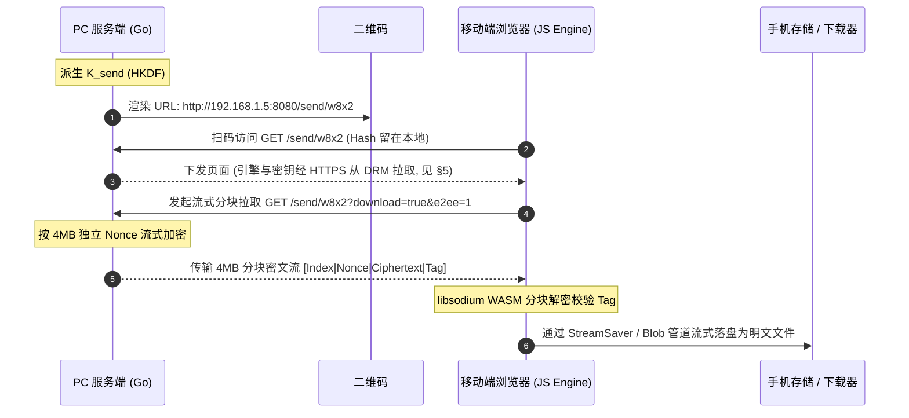
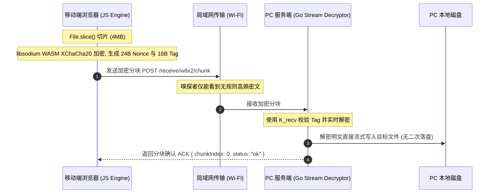
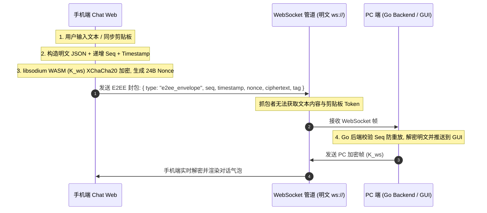
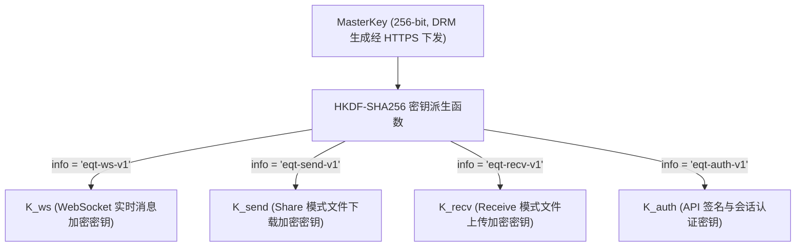

# EQT 局域网端到端加密 (E2EE) 架构设计:DRM 信任锚 + WASM 分块加密

> **文档状态**:核心密码学架构设计提案 (Future Architecture Specification)  
> **记录日期**:2026-08-30  
> **演进说明**:v2 — 依据 Secure Context 分析与 DRM 信任锚重构。废弃「WebCrypto + URL Hash 本地密钥」方案,统一为「DRM 联网会话密钥分发 + libsodium WASM 分块加密」;不可联网时自动关闭加密、降级明文。  
> **涉及模块**:DRM 授权服务 (`cloudflare/eqt-drm-api`)、桌面设置 (`pkg/config/settings.go`)、Go 服务端流式加解密 (`pkg/server/` / `crypto/`)、移动端 WASM 密码学引擎 (`pkg/pages/assets/crypto-engine.js`)、Chat 模式 WebSocket 协议 (`pkg/chat/v2/protocol/`)

---

## 1. 现状剖析:局域网 Wi-Fi 抓包嗅探能否截获数据?

### 1.1 技术定性与第一性原理 (First Principle Analysis)
**是的。** 在未配置 TLS/HTTPS 证书的默认 HTTP 模式下,处于同一局域网(同一 Wi-Fi)下的恶意设备,确实可以通过流量拦截与抓包工具截获并还原全部传输数据(包括文件、文本、图片与 Token)。

### 1.2 嗅探与拦截的具体攻击路径
1. **开放/公共 Wi-Fi 环境(如星巴克、机场、酒店、咖啡厅)**:
   - 开放式 Wi-Fi 空口未加密,或所有设备共用同一个预共享密码(PSK)。攻击者只需将无线网卡置于**监听/混杂模式 (Promiscuous / Monitor Mode)**,即可捕获空中广播的所有 802.11 数据帧。
2. **家用/企业 WPA2/WPA3 局域网环境**:
   - 即便 Wi-Fi 链路层有四次握手隔离,局域网内的任何受控设备仍可通过 **ARP 欺骗 (ARP Spoofing / Poisoning)**、**DHCP 伪造** 或 **DNS 劫持** 将受害者的流量重定向到攻击者网卡(中间人攻击 MITM)。
3. **明文协议风险**:
   - EQT 默认运行在原生明文 HTTP (`http://192.168.x.x:PORT`) 与明文 WebSocket (`ws://192.168.x.x:PORT`) 之上。
   - 攻击者在 Wireshark / tcpdump 中只需使用 `Follow TCP Stream`,即可完整 dump 出 `POST /upload` 上传的无损图片与文件二进制,以及 WebSocket 会话中的实时聊天明文。
   - 当前的 URL Path 随机 Token(如 `/w8x2/`)仅能防范「公网盲扫」,无法防范流量已被嗅探的本地中间人(因为 Token 随 URL 明文传输)。

---

## 2. 传统 TLS 的体验困境 vs EQT 零配置 E2EE 突破口

### 2.1 传统自签名 HTTPS 证书的死穴
在局域网内启用传统 TLS/HTTPS 存在致命的交互阻碍:
* 局域网 IP(如 `192.168.1.100`)无法申请由权威 CA(Let's Encrypt 等)签发的合法公网证书。
* 若由 EQT 在本地生成自签名证书,手机浏览器(iOS Safari / Android Chrome)扫码打开时会弹出**高危红色拦截页**,用户需手动在高级设置中信任证书,严重破坏「扫码免装 App 3 秒即用」的核心极简体验。

### 2.2 EQT 破局方向
利用**公网 HTTPS 信任锚(DRM 服务)下发加密引擎与会话密钥**,配合**局域网应用层加密**实现零配置 E2EE。核心思路:信任与密钥协商放在联网的 HTTPS 信道完成,数据搬运仍走局域网,两者各取所长。

---

## 3. 加密能力定位:付费权益、配置开关与运行模式

### 3.1 付费权益定位
端到端加密(E2EE)是 **Plus / Pro 付费版专属功能**。免费版不提供加密,传输走原生明文并提示升级;付费版在桌面 Settings 中提供加密开关,联网时默认自动启用。

### 3.2 Settings 配置项
在 `pkg/config/settings.go` 的 `DesktopSettings` 中新增布尔字段,遵循既有 `EnableXXX` 命名约定(如 `EnableTelemetry`):

```go
EnableE2EE bool `json:"enableE2EE"` // 付费权益:联网时启用端到端加密
```

配置键为 `enableE2EE`,默认 `false`(免费版始终为 `false`;付费版可通过 Settings 界面开关)。此开关决定**服务端是否以 E2EE 模式启动传输会话并生成二维码**,加密能力本身不依赖用户手动配置任何密钥。

### 3.3 运行模式决策树

```
settings.enableE2EE = false ──────────► 明文传输(标准局域网模式)
settings.enableE2EE = true
   ├─ 联网(可访问 DRM 服务)──────────► 加密模式:DRM 会话密钥 + WASM 分块加密
   └─ 不可联网(DRM 不可达)───────────► 自动关闭加密,降级明文 + 界面提示
```

### 3.4 离线降级语义
**不可联网时自动关闭加密**,这是本方案与旧「URL Hash 本地密钥」方案的本质差异(旧方案试图离线自加密,见 §4.4 为何放弃)。降级行为:
* 二维码与传输会话按明文模式启动;
* 移动端页面顶部明确显示「标准局域网模式(未加密)」徽章;
* 桌面端会话开始前,若用户已开启 `enableE2EE` 但检测到 DRM 不可达,在界面通知「当前网络无法建立加密会话,已降级为标准传输」(沿用应用内通知,不弹浏览器级警告)。

---

## 4. 前端密码学引擎选型:Secure Context 陷阱与 WASM 方案

### 4.1 致命限制:`crypto.subtle` 在局域网 HTTP 下不可用
现代浏览器将 `window.crypto.subtle`(WebCrypto 加解密 API)限定在 **Secure Context(安全上下文)** 中调用:

| 访问方式 | 是否视为安全上下文 | 能否调用 `crypto.subtle` |
| :--- | :--- | :--- |
| `http://localhost` / `http://127.0.0.1` | 是 | 能 |
| `https://any-domain.com`(有效 CA 证书) | 是 | 能 |
| `http://192.168.1.50:8080`(局域网 HTTP) | **否 (Insecure Context)** | **不能,`crypto.subtle === undefined`** |

手机扫码访问 EQT 的 `http://192.168.x.x` 页面,属于 insecure context。因此**旧文档依赖 `crypto.subtle` 的整条 AES-256-GCM 链路在该场景下根本跑不起来**——这是 v1 方案的核心缺陷。

### 4.2 方向性约束:mixed content 决定信任锚必须「反向拉取」
混合内容 (Mixed Content) 规则:**HTTPS 页面加载纯 HTTP 资源会被浏览器拦截**。因此不能把加密前端托管在 DRM 的 HTTPS 页面上去 fetch 局域网 PC(该请求会被当成 active mixed content 阻断,除非 PC 也有可信证书——回到 §2 死局)。

正确的可行形态是**反向组合**:

> 手机打开局域网 HTTP 页面(页面本身不承载机密)→ 页面 JS 主动从 `https://<drm-domain>` 拉取加密引擎与会话密钥(HTTPS 信道,不可篡改)→ 之后与 PC 的传输纯局域网 + 应用层加密。

insecure 页面加载 HTTPS 资源是合法的,不触发 mixed content 拦截。

### 4.3 选型结论:libsodium.js (WASM) + XChaCha20-Poly1305
前端加密引擎改用 **libsodium.js(WASM 构建)** 提供的 `crypto_aead_xchacha20poly1305_ietf`:
* 它是不依赖 `crypto.subtle` 的普通 WASM 模块,在局域网 HTTP 页面可正常运行;
* 纯软件实现即可跑满局域网带宽(无需硬件 AES 指令)。

### 4.4 为什么用 XChaCha20-Poly1305 而非 AES-256-GCM
1. **WASM 性能**:前端失去硬件 AES 加速(不能依赖 `crypto.subtle`)。libsodium 的 `crypto_aead_aes256gcm` 仅在检测到 AES-NI 时才可用,移动端处理器往往缺失;XChaCha20 是纯软件快的设计,任何现代浏览器 WASM 都能全速运行。
2. **192-bit Nonce 冗余**:XChaCha20 使用 24 字节随机 Nonce,大量分块下碰撞概率 2^-96 量级;AES-256-GCM 的 96-bit 随机 Nonce 在「每块独立随机 Nonce」的分块协议里需要更严格的计数器纪律。XChaCha 天然适配分块协议。
3. **服务端对应**:Go 端使用 `golang.org/x/crypto/chacha20poly1305`(当前 `go.mod` 未引入,需新增该标准扩展依赖),与前端算法一一对应。

> **注意**:XChaCha20-Poly1305 的 Nonce 为 **24 字节**,不是 AES-GCM 的 12 字节。所有封包格式与协议字段须以此为基准(见 §6)。

### 4.5 旧「URL Hash 本地密钥」方案为何被放弃
v1 文档设想:二维码携带 `#k=BASE64_KEY`,手机本地用 WebCrypto 解密。该方案存在两个不可修复的问题:
1. `crypto.subtle` 在局域网 HTTP 下不可用(§4.1);
2. 即便改用纯 JS/WASM 引擎,**引擎 JS 本身仍由局域网 HTTP 下发,可被主动 MITM 替换**——攻击者不需破解密钥,注入自己的解密代码即可骗出数据。本地密钥模式下引擎不可信,加密承诺不成立。

因此离线时不做脆弱的本地加密,而是**诚实关闭加密、降级明文**(§3.4)。真正的加密仅在可信引擎可从 HTTPS 取得时提供,这正是 DRM 信任锚(§5)的意义。

---

## 5. DRM 信任锚:会话密钥与加密引擎分发(联网加密模式)

### 5.1 架构总览

```mermaid
sequenceDiagram
    autonumber
    participant PC as PC 端 (Go / GUI)
    participant DRM as DRM 服务 (HTTPS, Cloudflare Worker)
    participant QR as 二维码
    participant Network as 局域网 Wi-Fi (可能存在嗅探者)
    participant MB as 移动端浏览器 (JS Engine)

    Note over PC: 1. settings.enableE2EE=true 且 DRM 可达
    PC->>DRM: 2. POST /api/v1/e2ee/session/create (HTTPS)
    DRM-->>PC: 3. 生成 256-bit MasterKey 并存入 D1,返回 session_id
    PC->>QR: 4. 渲染二维码: http://192.168.x.x:8080/send/w8x2#sid=<短 session_id>
    MB->>PC: 5. 扫码访问 GET /send/w8x2 (Hash 留在本地,不入网络包)
    PC-->>MB: 6. 下发不含机密的页面 + 引导脚本
    MB->>DRM: 7. HTTPS 拉取加密引擎 crypto-engine.js (SRI 校验)
    MB->>DRM: 8. POST /e2ee/session/<sid>/claim (HTTPS, 领取 MasterKey)
    DRM-->>MB: 9. 返回 MasterKey (max_claims 并发限额内, TTL 到期销毁)
    MB->>PC: 10. 建立分块加密传输 (XChaCha20-Poly1305), 全程局域网
    Note over Network: 嗅探者只能看到高熵密文;密钥与引擎从未经过局域网
```

**Hash 信道论证**(RFC 3986):浏览器构建 HTTP 请求时,`#` 及其后的 Fragment **绝不进入 TCP 请求行**,只作为客户端锚点。故 `#sid=` 引用只在手机本地可见。`session_id` 是短引用而非机密,即使被窥屏泄露也无法独立换取密钥(领取受 `max_claims` 并发限额约束 + 短 TTL)。

### 5.2 端点契约(新增至 `cloudflare/eqt-drm-api/src/routes/drm.ts` 的 `handleDrmRoutes`)

**① `POST /api/v1/e2ee/session/create` — 创建加密会话**
- 请求体:
  ```json
  {
    "license_code": "EQT-PRO-20260727-XXXXXX-YYYY",
    "device_id": "<硬件指纹>",
    "mode": "send"
  }
  ```
- 服务端动作:校验 license 具备 Pro 权益 → 生成 256-bit `MasterKey`(Worker `crypto.getRandomValues`)→ 写入 D1(`session_id`、`master_key`、`status=active`、`expires_at`、`ttl=600s`)→ 返回。
- 响应:
  ```json
  {
    "session_id": "e2s_9x7KpQ3m",
    "expires_at": 1785145800,
    "ttl": 600
  }
  ```
- 复用现有 `cf-access-jwt` / `rate-limit` / `device-registry` / `structured-logger` 中间件。

**② `POST /api/v1/e2ee/session/:id/claim` — 移动端领取密钥**
- 请求体:空或带引擎哈希 `{ "engine_sha256": "...", "client_instance_id": "<浏览器实例UUID>" }`。
- 服务端动作:校验 `session_id` 存在且未过期(`status=active`)且 `claim_count < max_claims`(根据 License 允许的设备并发数,如 Pro 版支持最多 5 台并发)→ 原子递增 `claim_count` → 返回 `master_key_b64`。(避免用户误刷新页面或多台手机并发扫同一二维码时因严格一次性锁死而报错，详见 §8 意见 9)。
- 响应:
  ```json
  {
    "engine_url": "https://<drm-domain>/assets/crypto-engine.js",
    "engine_sha256": "a1b2...",
    "master_key_b64": "BASE64_32_BYTES",
    "algorithm": "XChaCha20-Poly1305"
  }
  ```

### 5.3 安全边界(诚实声明)
* 加密引擎与 `MasterKey` 均经 **HTTPS** 到达手机,不受局域网 MITM 影响;
* 主动攻击者能篡改的只剩局域网首屏 HTML(引导脚本)。引导脚本不含密钥,只负责从 HTTPS 拉取引擎并执行;攻击者若在扫码瞬间抢先篡改首屏,理论上可诱导用户不走加密流程——但无法窃取密钥或引擎。该残余风险随首屏加载完成即消失;
* **DRM 服务成为信任根**:DRM 被攻破即可下发假引擎。对所有中心化方案如此,文档予以明示;
* 加密强度:密钥 256-bit,数据面 XChaCha20-Poly1305 AEAD。被动嗅探者即使截获全部密文,解密难度 2^256。

---

## 6. 全链路分块加解密协议(Share / Receive / Chat 统一)

### 6.1 统一分块封包格式
文件类传输(Share / Receive)按固定 **4MB (4,194,304 字节)** 明文为一个分块 (Chunk),每块独立加密:

```text
+-----------------------+----------------------+-------------------------------+--------------------------+
| Chunk Index (4 Bytes) | Nonce (24 Bytes)     | Ciphertext (Up to 4MB Payload)| Auth Tag (16 Bytes)      |
+-----------------------+----------------------+-------------------------------+--------------------------+
```

* 每块生成独立 24 字节安全随机 Nonce,调用 `crypto_aead_xchacha20poly1305_ietf_encrypt`;
* 每块拥有独立 Auth Tag,**无需依赖前序块**——天然支持 HTTP Range 随机寻址、高并发多线程下载与断点续传;
* 服务端 Go 端用 `golang.org/x/crypto/chacha20poly1305` 的 `Seal` / `Open` 逐块对应。

### 6.2 Share(Send)模式:PC 发送 → 移动端浏览器接收下载

#### 1. 现有数据传输链路
PC 端启动 HTTP 服务并展示含随机路径的二维码(如 `http://192.168.1.5:8080/send/w8x2`)。手机扫码打开后,点击下载时浏览器发起 `GET /send/w8x2?download=true&item=0`,Go 服务端通过 `http.ServeContent` 或流式 I/O 将原始二进制直接作为 HTTP 响应体吐给客户端。

#### 2. E2EE 结合改造架构


#### 3. 核心技术细节
* 请求参数携带 `?e2ee=1`,服务端使用 `K_send` 按 4MB 分块实时流式加密;
* **HTTP Range 随机定位**:`Range: bytes=start-end` 时服务端换算分块索引 `ChunkStart = floor(start / 4194304)`、`ChunkEnd = floor(end / 4194304)`,独立 Nonce/Tag 使视频拖拽寻址无需解密前序块;
* **浏览器内存墙破局**(阶梯适配):
  1. 小文件 (< 300MB):In-Memory Blob + `<a download>` 原生下载;
  2. 超大文件 (≥ 300MB):`StreamSaver.js`(Service Worker fetch 拦截管道)或 `showSaveFilePicker()` / `FileSystemWritableFileStream`,边解密边落盘,内存常驻仅 ~8MB;
  3. 极端降级:设备不支持 Service Worker 且文件超限 → 提示切换标准明文模式或分卷传输。

### 6.3 Receive 模式:移动端浏览器发送 → PC 服务端接收落盘

#### 1. 现有数据传输链路
PC 启动 `Receive` 服务,手机访问 `pages.Upload` 上传界面,文件经 `multipart/form-data` POST 或 `tus.min.js` 断点续传至 `/receive/w8x2/tus/`。Go 后端通过 `r.MultipartReader()` 或 tus handler 将字节流原样写入目标目录。

#### 2. E2EE 结合改造架构


#### 3. 核心技术细节
* 前端 `File.slice(offset, offset + 4MB)` 多 Worker / Promise 队列分块加密,逐块 POST;
* **Go 服务端零临时文件解密流 (`E2EEDecryptReader`)**:逐块读取封包 → 校验 Tag → 解密 → 直接写入最终目标文件,杜绝「先存密文临时文件、完毕再解密落盘」的双重磁盘 I/O(数十 GB 视频时尤为关键);
* **断点续传极简恢复**:网络中断后前端发起 `GET /receive/w8x2/chunk_status?file_id=xxx`,服务端返回已落盘最大连续分块号 `M`,前端从 `M+1` 块继续发送,避免字节级偏移错位。

### 6.4 Chat 模式:PC 与移动端双向实时交互 (WebSocket + HTTP)

#### 1. 现有数据传输链路
PC 与手机建立 WebSocket 长连接(`pkg/chat/v2/transport/websocket.go`),实现双向实时文本聊天、剪贴板自动同步、输入状态与心跳。大文件附件经 `/upload` 与 `/download` 走 HTTP 管道。

#### 2. E2EE 结合改造架构(双通道隔离)
* **控制面 / 消息面 (WebSocket)**:全量通信帧采用统一 `e2ee_envelope` 容器包裹;
* **数据面 / 附件传输 (HTTP)**:附件在客户端加密后上传,接收端下载密文后解密。



#### 3. 核心封包规范
* **WebSocket 加密封包**:
  ```json
  {
    "type": "e2ee_envelope",
    "version": 1,
    "seq": 42,
    "timestamp": 1725105600123,
    "nonce": "base64_24bytes_nonce",
    "ciphertext": "base64_payload...",
    "tag": "base64_16byte_auth_tag..."
  }
  ```
* **解密后的明文载荷**:
  ```json
  {
    "action": "chat_message",
    "sender": "iPhone-16-Pro",
    "content": "Secret API Key: sk-proj-xxxx"
  }
  ```
* **防重放**:`seq || timestamp` 作为 AEAD 的 **AAD (Additional Authenticated Data)** 传入加解密;接收端维护最近窗口序号,序号倒退、时间戳偏差 > 30 秒或 AAD 校验失败的帧直接丢弃并记录告警。

---

## 7. 密码学架构与密钥派生体系 (HKDF Key Hierarchy)

为避免单一主密钥在不同传输信道间高频复用引发密码学碰撞或 Nonce 耗尽风险,引入标准 **HKDF-SHA256 (RFC 5869)** 派生分层子密钥:



### 7.1 密钥域隔离优势
1. **密码学独立性**:单个文件分块出现罕见 Nonce 碰撞,不波及 WebSocket 与鉴权通道;
2. **零明文传输**:`MasterKey` 仅经 HTTPS 存在于 DRM 与两端内存,所有局域网传输仅使用派生子密钥;
3. **会话阅后即焚与内存安全 (Zeroize Memory)**:
   - 浏览器端会话结束时,对存放密钥的 `Uint8Array` 显式执行 `.fill(0)` 覆写(注意:不应依赖 `crypto.getRandomValues()` 做覆写——那是随机数生成器,不是清零;且经 libsodium 导入的 opaque key 对象本身不可被 JS 覆写,应在密钥字节数组上清零);
   - 服务端退出或清理会话时,主动对 Go 内存中的 key byte slice 执行清零覆写。

---

## 8. 架构评审意见与工程避坑指南

### 意见 1:统一 XChaCha20-Poly1305,废弃 AES-CTR 与「WASM 下 AES-256-GCM」
* **AES-CTR 已废弃**:无完整性认证(No Authentication),局域网恶意篡改者可翻转密文比特精准篡改可执行文件或文档而接收端无感;字节级 Counter 对齐脆弱,续传偏移 1 字节即全线乱码(历史文档 `docs/crypto/resumable-e2ee-design.md` 已标注)。
* **AES-256-GCM 不适用于纯局域网前端**:`crypto.subtle` 在 insecure context 不可用;WASM 版 AES-GCM 依赖 AES-NI,移动端性能不稳。
* **✅ XChaCha20-Poly1305**:AEAD 硬件级(纯软件也可全速)、24 字节 Nonce 冗余、Go 端有标准实现,是局域网 WASM 场景的最优解。

### 意见 2:移动端浏览器(WebKit)大文件下载「内存墙」破局
iOS Safari 与部分 Android Chrome 单页内存限制(通常 500MB ~ 1GB),直接 `new Blob([decryptedChunks])` 会 OOM 崩溃刷新。采用 §6.2 阶梯式适配(Blob → StreamSaver → 降级提示)。

### 意见 3:Go 服务端流式解密 Reader,杜绝临时密文二次 I/O
在 `pkg/server/` 封装 `ChunkedXChaChaReader`,包装 HTTP Body 流,逐块「校验 Tag → 解密 → 直接写入目标文件」,局域网全速(80~110 MB/s),避免数十 GB 视频的双重磁盘 I/O。

### 意见 4:WebSocket 必须引入单调递增 Seq 与时间戳 AAD 防重放
局域网嗅探者可抓取含特定操作(剪贴板同步、断开指令)的密文帧重放。强制 `seq` 单调递增,`seq || timestamp` 作为 AAD,接收端窗口校验(见 §6.4)。

### 意见 5:严格遵守前端模块化分离
所有 libsodium 初始化、HKDF 派生、分块加解密、Worker 通信封装为独立模块 `pkg/pages/assets/crypto-engine.js`;Chat V2 中解耦为独立 Store / Service (`pkg/chat/v2/web/src/lib/e2ee/`);UI 模板仅通过 Promise API 调用,保持视图层纯粹。禁向 `main.js` / 模板直接堆砌密码学逻辑。

### 意见 6:无会话访问与领取失败防呆
* 页面检测 `location.hash` 无 `#sid=`、或 `claim` 返回 403(并发已满/会话过期)时:显示友好引导屏「当前会话不可用,请使用手机相机重新扫描屏幕上的完整二维码」;
* 免费版或 `enableE2EE=false`:直接走标准明文链路,页面显示「标准局域网模式」徽章。

### 意见 7:加密状态可视化与离线降级透明
加密属于付费权益,UI 必须明示当前安全状态,避免用户误以为明文被加密:
* 加密模式:页面顶部绿色「🔒 End-to-End Encrypted (XChaCha20-Poly1305)」盾牌;
* 明文模式(未开启 / 离线降级):灰色「标准局域网模式(未加密)」;
* 离线降级事件写入桌面端通知中心(应用内通知),并可在会话日志追溯。

### 意见 8:DRM 零知识 (Zero-Knowledge) 加固：避免云端持有明文 MasterKey
* **背景评估**：当前 v2 设计中由 DRM Worker 生成并在 D1 存储 `MasterKey`。安全审计或对隐私极度敏感的海外极客可能会质疑“DRM 托管了通信密钥，是否存在云端后门解密风险”。
* **工程对策**：
  * **短期（方案一：盲中继与即时物理销毁）**：D1 中的 `master_key` 严格设置 10 分钟 TTL；会话在 **TTL 到期、或 `claim_count` 达到 `max_claims` 且最后一个领取者完成握手后**，由后台异步任务从 D1 物理覆写抹除（⚠️ 不能"首次 claim 即销毁"，否则与意见 9 的多设备并发领取冲突）。并在白皮书中明示"DRM 仅作为短期盲中继信道，不作任何永久持久化"。
  * **演进（方案二：端到端 ECDH 零知识密钥协商）**：PC 生成 Ephemeral X25519 密钥对，并将公钥 `pk_pc` 存入 DRM；移动端 claim 时提交其公钥 `pk_mob`，双方通过 X25519 ECDH 在本地派生 `MasterKey`。DRM 全程仅传递公钥，**云端数学上无法获知 `MasterKey`**，实现纯正的 Zero-Knowledge E2EE。
    * **⚠️ 防恶意云端 MITM 的关键：公钥指纹交叉验证**：ECDH 仅对"被动 DRM"成立——若 DRM 被攻破或作恶，可替换 `pk_pc` / `pk_mob` 与两端各建一条 ECDH 通道（密钥仍在本地派生，云端却可解密重加密）。为使零知识对主动云端同样成立，PC 须将 `pk_pc` 的 SHA-256 短指纹并入二维码 Hash（如 `#sid=<id>&k=<pk指纹>`）；移动端领取公钥后先核对其指纹与二维码一致，再执行 ECDH 派生。二维码视觉信道不入网络，云端无法篡改。
    * **多设备并发下的密钥模型切换**：方案二按设备派生，每台手机的 `pk_mob` 不同 ⇒ `MasterKey` 不同（不再是方案一的全设备共享密钥）。claim 请求体需增加 `pk_mob` 字段；演进时 §6/§7 的"单一 MasterKey 全会话共享"前提改为「PC 端为每台已 claim 设备独立派生会话密钥」，分块协议、HKDF `info` 与 chunk ACK 均按 `device_id` 隔离，意见 9 的多设备并发能力保持不变。

### 意见 9:多设备并发扫码与页面刷新容错（摒弃绝对一次性 Claim）
* **背景评估**：EQT 的核心能力之一是支持多台手机同时扫同一个二维码并发上传/下载（`pkg/server/server.go` 的 `clientStates`）；此外，移动端浏览器（尤其是 iOS Safari 内存清理）很容易发生后台静默重载或用户误下拉刷新。若 `claim` 严格一次性锁死，第二台设备或页面刷新将直接报错 403 导致传输中断。
* **工程对策**：
  * DRM 会话记录 `claim_count` 与 `max_claims`（根据 License 允许的并发设备数，如 Pro 版最多 5 台）；
  * 移动端在同一会话内刷新时，携带 `sessionStorage` 中的临时客户端 UUID，DRM 识别为同一客户端重载，直接放行重放密钥；
  * 整个会话在 TTL（如 600 秒）到期后统一销毁，平衡安全性与多设备易用性。

### 意见 10:WASM 引擎冷启动与渐进式初始化 (Progressive Loading + 强缓存)
* **背景评估**：`libsodium.js` + `sodium.wasm` 体积约 250KB~400KB。在弱网或拥堵 Wi-Fi 下，若页面必须阻塞等待 WASM 完全下载编译完成才渲染 DOM，会破坏“扫码 3 秒即用”的核心体验。
* **工程对策**：
  * **CDN 强缓存**：DRM 静态资源配置 `Cache-Control: public, max-age=31536000, immutable`，手机二次扫码直接命中 Disk Cache（0ms 加载）；
  * **渐进式骨架屏 (Skeleton UI)**：扫码后首屏 HTML 立即渲染骨架界面与文件选择器；WASM 引擎在后台异步加载编译；在用户点选文件或浏览列表的 1~3 秒“人类操作停顿”时间内完成初始化，实现用户体感上的零等待。

### 意见 11:Web Worker 线程隔离与 Transferable Objects 零拷贝
* **背景评估**：在移动端主线程（UI Thread）执行 4MB 分块的 XChaCha20-Poly1305 加解密会导致页面明显掉帧、进度条停顿以及“取消传输”按钮无响应。
* **工程对策**：
  * 密码学引擎必须运行在独立的 Web Worker (`crypto.worker.js`) 中；
  * 主线程与 Worker 之间传输 4MB 分块时，强制使用 **Transferable Objects**（`postMessage(arrayBuffer, [arrayBuffer])`）实现零拷贝内存指针所有权转移，避免在 JS 内存堆中产生双倍内存占用与垃圾回收（GC）卡顿。

### 意见 12:Receive 模式 3 级流水线并发（Read $\rightarrow$ Encrypt $\rightarrow$ POST）
* **背景评估**：若客户端采用单线程串行模式（读取切片 0 $\rightarrow$ WASM 加密 $\rightarrow$ HTTP POST $\rightarrow$ 等待 ACK $\rightarrow$ 读取切片 1），受局域网 HTTP RTT 影响，吞吐量会被压制在 20MB/s 左右，无法利用千兆 Wi-Fi。
* **工程对策**：
  * 构建 3 级流水线并发队列：
    * **Stage 1 (I/O)**：主线程异步读取下一个 4MB 切片 `File.slice(offset + 4MB)`;
    * **Stage 2 (Crypto)**：Worker 线程并发加密当前 4MB 切片;
    * **Stage 3 (Network)**：通过 XHR/Fetch 并发发送上一个已加密的切片（保持并发度 = 2）;
  * 通过流水线将加密耗时与网络上传耗时深度重叠，轻松跑满 80~110MB/s 物理带宽。

### 意见 13:纯离线隔离局域网的未来演进路径 (Air-Gapped LAN PWA + SAS 配对码)
* **背景评估**：当前 v2 架构确立了“无法联网访问 DRM 时自动诚实降级为明文”，这是在当前无公网证书下的正确决策。但在未来，部分企业级涉密或完全断网的机房环境仍可能有无网加密诉求。
* **演进对策**：
  * 未来可通过 **PWA（渐进式 Web 应用）离线缓存 WASM 引擎** + **4位短认证码 (Short Authentication String, SAS)** 交互确认机制：
  * 手机端若此前联网访问过一次并缓存了 PWA 引擎，在纯离线扫码时直接启用本地 WASM 引擎；
  * PC 屏幕与手机屏幕各自计算并展示 `Hash(MasterKey)[0:4]` 的 4 位数字配对码，用户肉眼核对一致即确认未被局域网中间人篡改，从而在完全无公网连接的纯局域网内实现数学级防篡改 E2EE。

### 意见 14:DRM 端点 CORS 跨域预检与前端 CSP (`wasm-unsafe-eval`) 策略规范
* **背景评估**：手机浏览器通过局域网 `http://192.168.x.x` 打开页面后，页面 JS 发起跨域 `fetch` 请求访问公网 HTTPS DRM 服务（`https://drm.eqt.net.im/api/v1/e2ee/...`）。若未正确配置 CORS 头部，移动端浏览器的 Preflight `OPTIONS` 预检失败将直接阻断密钥领取流程；此外，编译 WASM 在某些严格浏览器环境下需要 CSP 授权。
* **工程对策**：
  * **DRM CORS 规范**：Cloudflare Worker 必须强制返回开放的 CORS 响应头：
    ```http
    Access-Control-Allow-Origin: *
    Access-Control-Allow-Methods: GET, POST, OPTIONS
    Access-Control-Allow-Headers: Content-Type, Authorization, X-Client-Instance-Id
    ```
  * **CSP 兼容**：Go 服务端下发的 HTML 模板配置宽松 CSP 头，确保允许 `connect-src https://*.eqt.net.im` 与 `script-src 'self' 'unsafe-eval' 'wasm-unsafe-eval' https://*.eqt.net.im`。

### 意见 15:明确弃用复杂 Multipart 封装，全面采用轻量 REST 分块端点 (`POST /receive/.../chunk`)
* **背景评估**：现行 Receive 模式采用标准 `multipart/form-data`，Go 服务端通过 `r.MultipartReader()` 解析。但在 4MB 分块流式加密场景下，若将每个密文块封装为 Multipart MIME 格式，会在客户端产生大量的字符串拼接与边界缓冲内存开销，且遇到网络中断重试单个分块时难以做精细化控制。
* **工程对策**：
  * 在 E2EE 模式下，直接引入专用的轻量分块 REST 端点：`POST /receive/:path/chunk`；
  * 请求头携带 `X-File-ID`、`X-Chunk-Index`、`X-Total-Chunks`，请求体直接为原始二进制封包 `[ChunkIndex(4B) | Nonce(24B) | Ciphertext(<=4MB) | Tag(16B)]`；
  * 极大简化客户端 3 级流水线并发上传，单个分块重试成本降至最低。

### 意见 16:Go 服务端 4MB Buffer 内存池化 (`sync.Pool`) 杜绝 GC 抖动
* **背景评估**：在千兆 Wi-Fi 满速（80~110MB/s）高并发传输时，Go 后端每秒需处理 20~30 个 4MB 分块。若频繁分配临时切片，将引发 Go 运行时高频垃圾回收（GC STW 停顿），造成 CPU 占用飙升与网络传输抖动。
* **工程对策**：
  * 在 `pkg/server/` 中维护全局 `sync.Pool` 内存池：
    ```go
    var chunkBufferPool = sync.Pool{
        New: func() any {
            b := make([]byte, 4*1024*1024+44)
            return &b
        },
    }
    ```
  * 分块解密写盘完成后立即归还内存池，实现百兆满速下的零 GC 堆内存抖动。

### 意见 17:Chat 模式大附件分级处理策略（<20MB 单块直传 vs >20MB 4MB 流式分块）
* **背景评估**：Chat 模式中传输的内容跨度极大（从几十 KB 的截图到几 GB 的 4K 视频录像）。
* **工程对策**：
  * **小附件 ( $\le$ 20MB)**：前端在 Web Worker 中单块加密，直接作为单个 payload POST 到 `/upload`，协议交互最轻快；
  * **超大附件 (> 20MB)**：无缝复用 Receive/Share 的 4MB 分块流式管道（`POST /api/chat/v2/attachment/chunk`），避免在聊天前端一次性申请大块 ArrayBuffer 导致移动端浏览器 OOM 崩溃。

---

## 9. 商业化分级与版本限制策略 (Free vs Plus/Pro Tier)

| 功能维度 | 免费版 (Free Edition) | Plus / Pro 付费版 (Premium) |
| :--- | :--- | :--- |
| **基础局域网传输** | ✅ 支持原生高速明文传输。 | ✅ 支持原生高速传输。 |
| **零配置一键 E2EE** | ❌ 提示:升级 Plus 解锁端到端硬件级加密。 | ✅ Settings 中 `enableE2EE` 开关,联网时默认自动启用。 |
| **加密信任锚** | — | ✅ DRM 服务 HTTPS 下发密钥与引擎(联网必需)。 |
| **离线行为** | 明文(始终)。 | 明文 + 界面提示「已降级为标准模式」(DRM 不可达时)。 |
| **Wi-Fi 防嗅探保护** | 基础随机 Path 混淆。 | 🛡️ 密文级防御(公共/家庭 Wi-Fi 抓包无法解密)。 |
| **E2EE 专属安全徽章** | 「标准局域网模式」。 | 绿色「🔒 End-to-End Encrypted (XChaCha20-Poly1305)」盾牌。 |
| **会话阅后即焚清理** | 手动退出。 | 会话关闭自动覆写内存密钥 (Zeroize Buffer)。 |

> 定价与营销口径:在欧美注重隐私的市场,E2EE 属于高溢价卖点;白皮书应如实披露「加密依赖联网协商,离线自动降级明文」,避免过度宣传。

---

## 10. 开发实施与演进排期 (Implementation Roadmap)

- [ ] **Phase 1:WASM 密码学基础库与 HKDF 密钥派生引擎**
  - `pkg/pages/assets/crypto-engine.js`:libsodium.js 初始化、HKDF-SHA256 派生、XChaCha20-Poly1305 分块加解密、Worker 通信;
  - WASM 渐进式加载与 CDN 强缓存(`Cache-Control: immutable`)、骨架屏异步初始化(意见 10);
  - 验证 iOS Safari、Android Chrome、Edge、Firefox 在局域网 HTTP 页面的跨平台一致性。
- [ ] **Phase 2:DRM 会话密钥与引擎分发端点**
  - `cloudflare/eqt-drm-api`:新增 `POST /api/v1/e2ee/session/create` 与 `POST /api/v1/e2ee/session/:id/claim`,复用 license 校验、rate-limit、cf-access-jwt;
  - CORS 跨域响应头与前端 CSP `wasm-unsafe-eval` 适配规范(意见 14);
  - `claim` 多设备并发限额 `max_claims`、`client_instance_id` 刷新容错(意见 9);
  - D1 表 `e2ee_sessions(session_id, master_key, claim_count, max_claims, status, expires_at)`;短期 TTL 与超限物理覆写销毁(意见 8 方案一);引擎静态资源托管与 SRI。
- [ ] **Phase 3:Chat 模式双向 WebSocket 与剪贴板 E2EE**
  - 改造 `pkg/chat/v2/protocol/`,定义 `e2ee_envelope` 载荷与 AAD 防重放验证;
  - 加解密运行于独立 Web Worker,Transferable 零拷贝传输(意见 11);
  - 附件分级传输：$\le$ 20MB 单块直传，> 20MB 复用 4MB 分块流式管道(意见 17);
  - Go 后端与 Svelte 前端实现消息/剪贴板透明加解密。
- [ ] **Phase 4:Receive / Share 4MB 分块流式加解密**
  - Receive:弃用 Multipart，采用专用 REST 端点 `POST /receive/:path/chunk`(意见 15)+ 前端 `File.slice()` 3 级流水线(Read→Encrypt→POST,并发度 2)(意见 12)+ Go `ChunkedXChaChaReader` 零临时文件写盘 + `chunk_status` 断点恢复;
  - Go 服务端引入 `sync.Pool` 4MB 缓冲池，消除百兆吞吐下的 GC 停顿(意见 16);
  - Share:Go 端 `Range` 兼容分块加密下发 + 移动端 Blob / StreamSaver 流式解密下载管道;
  - 分块加解密统一置于 Web Worker(意见 11)。
- [ ] **Phase 5:Settings 开关、付费门禁与海外隐私营销**
  - `pkg/config/settings.go` 新增 `EnableE2EE` 字段与 Settings 界面开关;
  - 联网检测与离线降级通知;免费版提示升级;安全徽章点亮;
  - 编写隐私白皮书,海外社区重点宣发。

> **未来演进(暂不排期)**:ECDH 零知识密钥协商与二维码公钥指纹交叉验证(意见 8 方案二);Air-Gapped 离线加密 PWA + SAS 配对码(意见 13)。两者依赖 Phase 1-2 的数据面与 DRM 端点稳定后再评估。
