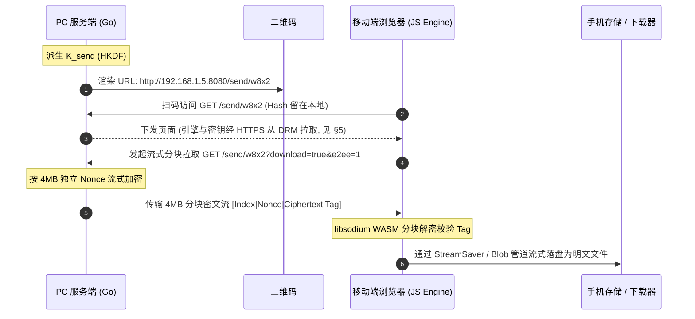
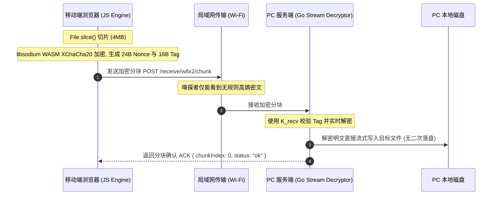
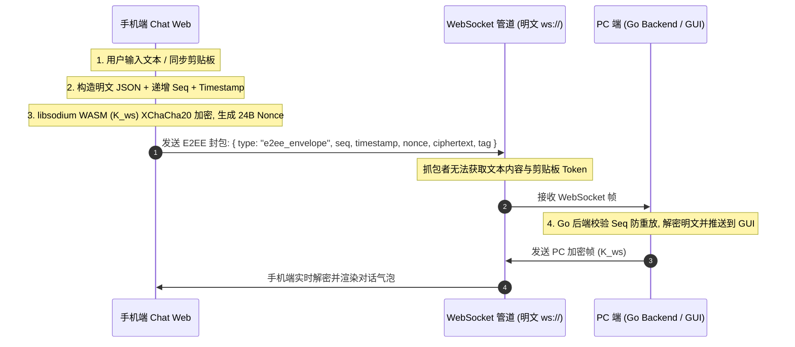
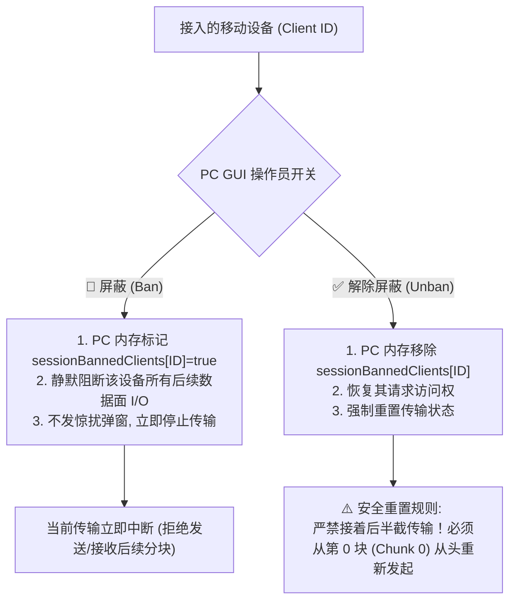
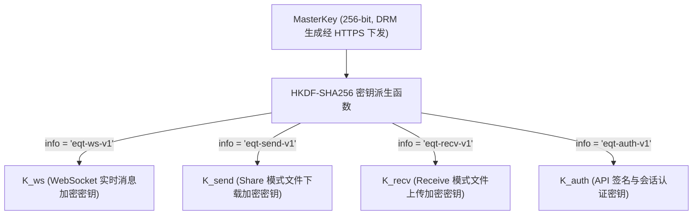

# EQT 局域网端到端加密 (E2EE) 架构设计:DRM 信任锚 + WASM 分块加密

> **文档状态**:核心密码学架构设计提案 (Future Architecture Specification)  
> **记录日期**:2026-08-30  
> **演进说明**:v2 — 依据 Secure Context 分析与 DRM 信任锚重构。废弃「WebCrypto + URL Hash 本地密钥」方案,统一为「DRM 联网会话密钥分发 + libsodium WASM 分块加密」;不可联网时自动关闭加密、降级明文。  
> **涉及模块**:DRM 授权服务 (`cloudflare/eqt-drm-api`)、桌面设置 (`pkg/config/settings.go`)、Go 服务端流式加解密 (`pkg/server/` / `crypto/`)、移动端 WASM 密码学引擎 (`pkg/pages/assets/crypto-engine.js`)、Chat 模式 WebSocket 协议 (`pkg/chat/v2/protocol/`)

---

## 1. 现状剖析:局域网 Wi-Fi 抓包嗅探能否截获数据?

### 1.1 技术定性与第一性原理 (First Principle Analysis)
**是的。** 在未配置 TLS/HTTPS 证书的默认 HTTP 模式下,处于同一局域网(同一 Wi-Fi)下的恶意设备,确实可以通过流量拦截与抓包工具截获并还原全部传输数据(包括文件、文本、图片与 Token)。

### 1.2 嗅探与拦截的具体攻击路径
1. **开放/公共 Wi-Fi 环境(如星巴克、机场、酒店、咖啡厅)**:
   - 开放式 Wi-Fi 空口未加密,或所有设备共用同一个预共享密码(PSK)。攻击者只需将无线网卡置于**监听/混杂模式 (Promiscuous / Monitor Mode)**,即可捕获空中广播的所有 802.11 数据帧。
2. **家用/企业 WPA2/WPA3 局域网环境**:
   - 即便 Wi-Fi 链路层有四次握手隔离,局域网内的任何受控设备仍可通过 **ARP 欺骗 (ARP Spoofing / Poisoning)**、**DHCP 伪造** 或 **DNS 劫持** 将受害者的流量重定向到攻击者网卡(中间人攻击 MITM)。
3. **明文协议风险**:
   - EQT 默认运行在原生明文 HTTP (`http://192.168.x.x:PORT`) 与明文 WebSocket (`ws://192.168.x.x:PORT`) 之上。
   - 攻击者在 Wireshark / tcpdump 中只需使用 `Follow TCP Stream`,即可完整 dump 出 `POST /upload` 上传的无损图片与文件二进制,以及 WebSocket 会话中的实时聊天明文。
   - 当前的 URL Path 随机 Token(如 `/w8x2/`)仅能防范「公网盲扫」,无法防范流量已被嗅探的本地中间人(因为 Token 随 URL 明文传输)。

---

## 2. 传统 TLS 的体验困境 vs EQT 零配置 E2EE 突破口

### 2.1 传统自签名 HTTPS 证书的死穴
在局域网内启用传统 TLS/HTTPS 存在致命的交互阻碍:
* 局域网 IP(如 `192.168.1.100`)无法申请由权威 CA(Let's Encrypt 等)签发的合法公网证书。
* 若由 EQT 在本地生成自签名证书,手机浏览器(iOS Safari / Android Chrome)扫码打开时会弹出**高危红色拦截页**,用户需手动在高级设置中信任证书,严重破坏「扫码免装 App 3 秒即用」的核心极简体验。

### 2.2 EQT 破局方向
利用**公网 HTTPS 信任锚(DRM 服务)下发加密引擎与会话密钥**,配合**局域网应用层加密**实现零配置 E2EE。核心思路:信任与密钥协商放在联网的 HTTPS 信道完成,数据搬运仍走局域网,两者各取所长。

---

## 3. 加密能力定位:付费权益、配置开关与运行模式

### 3.1 付费权益定位
端到端加密(E2EE)是 **Plus / Pro 付费版专属功能**。免费版不提供加密,传输走原生明文并提示升级;付费版在桌面 Settings 中提供加密开关,联网时默认自动启用。

### 3.2 Settings 配置项
在 `pkg/config/settings.go` 的 `DesktopSettings` 中新增布尔字段,遵循既有 `EnableXXX` 命名约定(如 `EnableTelemetry`):

```go
EnableE2EE bool `json:"enableE2EE"` // 付费权益:联网时启用端到端加密
```

配置键为 `enableE2EE`,默认 `false`(免费版始终为 `false`;付费版可通过 Settings 界面开关)。此开关决定**服务端是否以 E2EE 模式启动传输会话并生成二维码**,加密能力本身不依赖用户手动配置任何密钥。

### 3.3 运行模式决策树

```
settings.enableE2EE = false ──────────► 明文传输(标准局域网模式)
settings.enableE2EE = true
   ├─ 联网(可访问 DRM 服务)──────────► 加密模式:DRM 会话密钥 + WASM 分块加密
   └─ 不可联网(DRM 不可达)───────────► 自动关闭加密,降级明文 + 界面提示
```

### 3.4 离线降级语义
**不可联网时自动关闭加密**,这是本方案与旧「URL Hash 本地密钥」方案的本质差异(旧方案试图离线自加密,见 §4.4 为何放弃)。降级行为:
* 二维码与传输会话按明文模式启动;
* 移动端页面顶部明确显示「标准局域网模式(未加密)」徽章;
* 桌面端会话开始前,若用户已开启 `enableE2EE` 但检测到 DRM 不可达,在界面通知「当前网络无法建立加密会话,已降级为标准传输」(沿用应用内通知,不弹浏览器级警告)。

---

## 4. 前端密码学引擎选型:Secure Context 陷阱与 WASM 方案

### 4.1 致命限制:`crypto.subtle` 在局域网 HTTP 下不可用
现代浏览器将 `window.crypto.subtle`(WebCrypto 加解密 API)限定在 **Secure Context(安全上下文)** 中调用:

| 访问方式 | 是否视为安全上下文 | 能否调用 `crypto.subtle` |
| :--- | :--- | :--- |
| `http://localhost` / `http://127.0.0.1` | 是 | 能 |
| `https://any-domain.com`(有效 CA 证书) | 是 | 能 |
| `http://192.168.1.50:8080`(局域网 HTTP) | **否 (Insecure Context)** | **不能,`crypto.subtle === undefined`** |

手机扫码访问 EQT 的 `http://192.168.x.x` 页面,属于 insecure context。因此**旧文档依赖 `crypto.subtle` 的整条 AES-256-GCM 链路在该场景下根本跑不起来**——这是 v1 方案的核心缺陷。

### 4.2 方向性约束:mixed content 决定信任锚必须「反向拉取」
混合内容 (Mixed Content) 规则:**HTTPS 页面加载纯 HTTP 资源会被浏览器拦截**。因此不能把加密前端托管在 DRM 的 HTTPS 页面上去 fetch 局域网 PC(该请求会被当成 active mixed content 阻断,除非 PC 也有可信证书——回到 §2 死局)。

正确的可行形态是**反向组合**:

> 手机打开局域网 HTTP 页面(页面本身不承载机密)→ 页面 JS 主动从 `https://<drm-domain>` 拉取加密引擎与会话密钥(HTTPS 信道,不可篡改)→ 之后与 PC 的传输纯局域网 + 应用层加密。

insecure 页面加载 HTTPS 资源是合法的,不触发 mixed content 拦截。

### 4.3 选型结论:libsodium.js (WASM) + XChaCha20-Poly1305
前端加密引擎改用 **libsodium.js(WASM 构建)** 提供的 `crypto_aead_xchacha20poly1305_ietf`:
* 它是不依赖 `crypto.subtle` 的普通 WASM 模块,在局域网 HTTP 页面可正常运行;
* 纯软件实现即可跑满局域网带宽(无需硬件 AES 指令)。

### 4.4 为什么用 XChaCha20-Poly1305 而非 AES-256-GCM
1. **WASM 性能**:前端失去硬件 AES 加速(不能依赖 `crypto.subtle`)。libsodium 的 `crypto_aead_aes256gcm` 仅在检测到 AES-NI 时才可用,移动端处理器往往缺失;XChaCha20 是纯软件快的设计,任何现代浏览器 WASM 都能全速运行。
2. **192-bit Nonce 冗余**:XChaCha20 使用 24 字节随机 Nonce,大量分块下碰撞概率 2^-96 量级;AES-256-GCM 的 96-bit 随机 Nonce 在「每块独立随机 Nonce」的分块协议里需要更严格的计数器纪律。XChaCha 天然适配分块协议。
3. **服务端对应**:Go 端使用 `golang.org/x/crypto/chacha20poly1305`(当前 `go.mod` 未引入,需新增该标准扩展依赖),与前端算法一一对应。

> **注意**:XChaCha20-Poly1305 的 Nonce 为 **24 字节**,不是 AES-GCM 的 12 字节。所有封包格式与协议字段须以此为基准(见 §6)。

### 4.5 旧「URL Hash 本地密钥」方案为何被放弃
v1 文档设想:二维码携带 `#k=BASE64_KEY`,手机本地用 WebCrypto 解密。该方案存在两个不可修复的问题:
1. `crypto.subtle` 在局域网 HTTP 下不可用(§4.1);
2. 即便改用纯 JS/WASM 引擎,**引擎 JS 本身仍由局域网 HTTP 下发,可被主动 MITM 替换**——攻击者不需破解密钥,注入自己的解密代码即可骗出数据。本地密钥模式下引擎不可信,加密承诺不成立。

因此离线时不做脆弱的本地加密,而是**诚实关闭加密、降级明文**(§3.4)。真正的加密仅在可信引擎可从 HTTPS 取得时提供,这正是 DRM 信任锚(§5)的意义。

---

## 5. DRM 信任锚:会话密钥与加密引擎分发(联网加密模式)

### 5.1 架构总览

```mermaid
sequenceDiagram
    autonumber
    participant PC as PC 端 (Go / GUI)
    participant DRM as DRM 服务 (HTTPS, Cloudflare Worker)
    participant QR as 二维码
    participant Network as 局域网 Wi-Fi (可能存在嗅探者)
    participant MB as 移动端浏览器 (JS Engine)

    Note over PC: 1. settings.enableE2EE=true 且 DRM 可达
    PC->>DRM: 2. POST /api/v1/e2ee/session/create (HTTPS)
    DRM-->>PC: 3. 生成 256-bit MasterKey 并存入 D1,返回 session_id
    PC->>QR: 4. 渲染二维码: http://192.168.x.x:8080/send/w8x2#sid=<短 session_id>
    MB->>PC: 5. 扫码访问 GET /send/w8x2 (Hash 留在本地,不入网络包)
    PC-->>MB: 6. 下发不含机密的页面 + 引导脚本
    MB->>DRM: 7. HTTPS 拉取加密引擎 crypto-engine.js (SRI 校验)
    MB->>DRM: 8. POST /e2ee/session/<sid>/claim (HTTPS, 领取 MasterKey)
    DRM-->>MB: 9. 返回 MasterKey (max_claims 并发限额内, TTL 到期销毁)
    MB->>PC: 10. 建立分块加密传输 (XChaCha20-Poly1305), 全程局域网
    Note over Network: 嗅探者只能看到高熵密文;密钥与引擎从未经过局域网
```

**Hash 信道论证**(RFC 3986):浏览器构建 HTTP 请求时,`#` 及其后的 Fragment **绝不进入 TCP 请求行**,只作为客户端锚点。故 `#sid=` 引用只在手机本地可见。`session_id` 是短引用而非机密,即使被窥屏泄露也无法独立换取密钥(领取受 `max_claims` 并发限额约束 + 短 TTL)。

### 5.2 端点契约(新增至 `cloudflare/eqt-drm-api/src/routes/drm.ts` 的 `handleDrmRoutes`)

**① `POST /api/v1/e2ee/session/create` — 创建加密会话**
- 请求体:
  ```json
  {
    "license_code": "EQT-PRO-20260727-XXXXXX-YYYY",
    "device_id": "<硬件指纹>",
    "mode": "send" // "send" | "receive" | "chat"
  }
  ```
- 服务端动作:
  1. 校验 license 具备 Pro 权益；
  2. 生成全新 256-bit `MasterKey`（Worker `crypto.getRandomValues`）；
  3. **单例覆盖重建 (Singleton Upsert)**：D1 对 `(device_id, mode)` 建唯一索引，以单条 `INSERT INTO e2ee_sessions (session_id, device_id, mode, master_key, claim_count, max_claims, status, expires_at, ttl) VALUES (...) ON CONFLICT(device_id, mode) DO UPDATE SET session_id=excluded.session_id, master_key=excluded.master_key, claim_count=0, status='active', expires_at=excluded.expires_at` 原子完成「新会话插入 + 旧活跃会话作废」，杜绝旧密钥孤儿残留，且不存在「先删后插、中途失败无会话」的窗口；
  4. 返回 `session_id` / `close_token` / `expires_at` / `ttl`。
- 响应:
  ```json
  {
    "session_id": "e2s_9x7KpQ3m",
    "close_token": "ct_<32字节随机,close 鉴权凭证>",
    "expires_at": 1785145800,
    "ttl": 600
  }
  ```
- 复用现有 `cf-access-jwt` / `rate-limit` / `device-registry` / `structured-logger` 中间件。

**② `POST /api/v1/e2ee/session/:id/claim` — 移动端领取密钥**
- 请求体:空或带引擎哈希 `{ "engine_sha256": "...", "client_instance_id": "<浏览器实例UUID>" }`。
- 服务端动作:校验 `session_id` 存在且未过期(`status=active`)且 `claim_count < max_claims`(根据 License 允许的设备并发数,如 Pro 版支持最多 5 台并发)→ 原子递增 `claim_count` → 返回 `master_key_b64`。(避免用户误刷新页面或多台手机并发扫同一二维码时因严格一次性锁死而报错，详见 §9 意见 9)。
- 响应:
  ```json
  {
    "engine_url": "https://<drm-domain>/assets/crypto-engine.js",
    "engine_sha256": "a1b2...",
    "master_key_b64": "BASE64_32_BYTES",
    "algorithm": "XChaCha20-Poly1305"
  }
  ```

**③ `POST /api/v1/e2ee/session/:id/close` — PC 端主动结束并销毁会话**
- 请求体:`{ "device_id": "<硬件指纹>", "close_token": "<create 时下发的短期凭证>" }`。
- 服务端动作:校验 `close_token` 与 `device_id` 均匹配该会话（`status='active'` 且未过期）后执行 `DELETE FROM e2ee_sessions WHERE session_id = ? AND device_id = ?`；仅凭 `session_id` 无法关闭他人会话。
- **幂等语义**:`session_id` 不存在或已过期时返回 `{ "status": "ok", "deleted": false }`,不视为错误——PC 端 close 属尽力而为的异步清理,可安全重放。
- 响应:`{ "status": "ok", "deleted": true }`。

### 5.3 安全边界与局域网抗嗅探密码学证明 (Anti-Sniffing Security Proof)

在公共 Wi-Fi（如咖啡厅、会议室）或路由器已被黑客攻破的恶意局域网环境下，**系统如何确保数据绝对无法被中间人窃取**？基于以下三层严密防线：

1. **第一道防线：密钥从未经过局域网物理链路 (Out-of-Band HTTPS Trust Anchor)**
   - 二维码 URL 为 `http://192.168.x.x:8080/send/w8x2#sid=e2s_xxxx`；
   - 根据 **RFC 3986** 规范，`#` 及其后的 Fragment **绝不进入 TCP 请求行**。局域网嗅探者（Wireshark 抓包）只能看到普通的 `GET /send/w8x2`，根本拿不到 `sid`；
   - 手机浏览器通过公网 **TLS 1.3 HTTPS** 链路向 Cloudflare DRM 发起 `claim` 领取 256 位 `MasterKey`。局域网内的任何攻击者均无法解密 TLS 1.3 流量，因此**攻击者从始至终拿不到任何解密密钥**。
2. **第二道防线：局域网数据面 100% 为高熵密文 (XChaCha20-Poly1305 AEAD)**
   - 文件传输与聊天全链路均采用 **XChaCha20-Poly1305** 逐块加密；
   - 局域网物理信道中流动的全部为 `[ChunkIndex(4B) | Nonce(24B) | Ciphertext(4MB) | AuthTag(16B)]` 伪随机高熵密文；
   - 攻击者即使截获 100% 的网络数据包，在没有 256-bit 密钥的前提下，暴力破解复杂度为 $2^{256}$，数学上绝对不可攻破。
3. **第三道防线：Poly1305 密文防篡改与 Nonce 防重放**
   - 攻击者若在传输过程中篡改密文的任意 1 个比特，接收端校验 16 字节 Auth Tag 时会**瞬间校验失败并直接丢弃**；
   - 每个分块使用全新独立的 24 字节安全随机 Nonce，中间人录制并重放历史数据包会被直接识别拒绝。

* **残余风险诚实声明**：
  * 主动攻击者能篡改的只剩局域网首屏 HTML(引导脚本)。引导脚本不含密钥,只负责从 HTTPS 拉取引擎并执行;攻击者若在扫码瞬间抢先篡改首屏,理论上可诱导用户不走加密流程——但无法窃取密钥或引擎。该残余风险随首屏加载完成即消失;
  * **DRM 服务成为信任根**:DRM 被攻破即可下发假引擎。对所有中心化方案如此,文档予以明示。

### 5.4 DRM 会话生命周期与单例覆盖/销毁机制

针对 DRM 在会话期的数据驻留与单例生命周期，确立以下核心原则：

1. **DRM 绝对不存储任何业务数据 (Zero Business Data in DRM)**：
   - 所有的实际文件二进制、图片、聊天文本和剪贴板内容，**100% 仅在 PC 和手机之间的局域网物理信道流动**，绝对不经过 DRM，DRM 无从知晓任何业务内容。
   - DRM 仅在内存/D1 中短暂保留会话凭据（`MasterKey`、TTL 与 `claim_count`），密钥寿命 ≤ 600s。
2. **会话期间保留的必要性与多端可用性保证**：
   - 在活跃会话期（10 分钟 TTL 内），DRM 必须完整保留当前会话凭据，以确保：
     - **Share (Send) 模式**：PC 分享文件给会议室多位同事时，多台手机在会话期内陆续扫码均可顺利领取密钥下载；
     - **Receive 模式**：多台手机在会话期内同时或先后扫码并发上传照片到 PC 均可正常握手；
     - **Chat 模式**：多台设备随时加入聊天室，且移动端切后台、误刷新时均可无缝重连 Re-claim。
3. **单例前提（必须显式声明）**：同一台 PC 的同一模式（`device_id, mode`）在同一时刻仅允许 **1 个活跃 E2EE 会话**。桌面 GUI 天然单实例满足该前提；CLI 多实例并发 `eqt send` / `eqt receive` 需自行串行——后启动的会话会覆盖前者，被覆盖的旧会话中已扫码的移动端会收到「会话已被新任务覆盖，请重新扫码」提示。该前提使覆盖重建无需任何跨会话状态机（架构极简）。
4. **全模式统一的「覆盖重建 + 主动销毁 + TTL 兜底」三路径闭环**：
   - **覆盖重建（create 时）**：`POST /session/create`（§5.2 ①）对 `(device_id, mode)` 以单条 `INSERT ... ON CONFLICT(device_id, mode) DO UPDATE` 原子作废旧会话并插入新会话，无「先删后插」窗口；
   - **主动销毁（close 时）**：PC 端正常点击关闭或退出程序时，异步触发 `POST /session/:id/close`（§5.2 ③），DRM 校验 `close_token` 后逻辑删除该行；
   - **兜底（TTL + 惰性清理）**：即使 PC 异常崩溃未触发 close，旧会话密钥也在 ≤600s 后过期失效，由意见 20 的抽样惰性清理收敛残留行。三条路径与意见 8 方案一、意见 22 口径一致。
5. **删除语义的诚实声明**：D1 的 `DELETE` 为逻辑删除，托管存储层不提供物理覆写（无 secure-delete）；但密钥寿命 ≤600s 且会话一旦作废即不可再 claim，即使存储层存在残留也已过期失效，不构成解密风险。


---

## 6. 全链路分块加解密协议(Share / Receive / Chat 统一)

### 6.1 统一分块封包格式
文件类传输(Share / Receive)按固定 **4MB (4,194,304 字节)** 明文为一个分块 (Chunk),每块独立加密:

```text
+-----------------------+----------------------+-------------------------------+--------------------------+
| Chunk Index (4 Bytes) | Nonce (24 Bytes)     | Ciphertext (Up to 4MB Payload)| Auth Tag (16 Bytes)      |
+-----------------------+----------------------+-------------------------------+--------------------------+
```

* 每块生成独立 24 字节安全随机 Nonce,调用 `crypto_aead_xchacha20poly1305_ietf_encrypt`;
* 每块拥有独立 Auth Tag,**无需依赖前序块**——天然支持 HTTP Range 随机寻址、高并发多线程下载与断点续传;
* 服务端 Go 端用 `golang.org/x/crypto/chacha20poly1305` 的 `Seal` / `Open` 逐块对应。

### 6.2 Share(Send)模式:PC 发送 → 移动端浏览器接收下载

#### 1. 现有数据传输链路
PC 端启动 HTTP 服务并展示含随机路径的二维码(如 `http://192.168.1.5:8080/send/w8x2`)。手机扫码打开后,点击下载时浏览器发起 `GET /send/w8x2?download=true&item=0`,Go 服务端通过 `http.ServeContent` 或流式 I/O 将原始二进制直接作为 HTTP 响应体吐给客户端。

#### 2. E2EE 结合改造架构


#### 3. 核心技术细节
* 请求参数携带 `?e2ee=1`,服务端使用 `K_send` 按 4MB 分块实时流式加密;
* **HTTP Range 随机定位**:`Range: bytes=start-end` 时服务端换算分块索引 `ChunkStart = floor(start / 4194304)`、`ChunkEnd = floor(end / 4194304)`,独立 Nonce/Tag 使视频拖拽寻址无需解密前序块;
* **浏览器内存墙破局**(阶梯适配):
  1. 小文件 (< 300MB):In-Memory Blob + `<a download>` 原生下载;
  2. 超大文件 (≥ 300MB):`StreamSaver.js`(Service Worker fetch 拦截管道)或 `showSaveFilePicker()` / `FileSystemWritableFileStream`,边解密边落盘,内存常驻仅 ~8MB;
  3. 极端降级:设备不支持 Service Worker 且文件超限 → 提示切换标准明文模式或分卷传输。

### 6.3 Receive 模式:移动端浏览器发送 → PC 服务端接收落盘

#### 1. 现有数据传输链路
PC 启动 `Receive` 服务,手机访问 `pages.Upload` 上传界面,文件经 `multipart/form-data` POST 或 `tus.min.js` 断点续传至 `/receive/w8x2/tus/`。Go 后端通过 `r.MultipartReader()` 或 tus handler 将字节流原样写入目标目录。

#### 2. E2EE 结合改造架构


#### 3. 核心技术细节
* 前端 `File.slice(offset, offset + 4MB)` 多 Worker / Promise 队列分块加密,逐块 POST;
* **Go 服务端零临时文件解密流 (`E2EEDecryptReader`)**:逐块读取封包 → 校验 Tag → 解密 → 直接写入最终目标文件,杜绝「先存密文临时文件、完毕再解密落盘」的双重磁盘 I/O(数十 GB 视频时尤为关键);
* **断点续传极简恢复**:网络中断后前端发起 `GET /receive/w8x2/chunk_status?file_id=xxx`,服务端返回已落盘最大连续分块号 `M`,前端从 `M+1` 块继续发送,避免字节级偏移错位。

### 6.4 Chat 模式:PC 与移动端双向实时交互 (WebSocket + HTTP)

#### 1. 现有数据传输链路
PC 与手机建立 WebSocket 长连接(`pkg/chat/v2/transport/websocket.go`),实现双向实时文本聊天、剪贴板自动同步、输入状态与心跳。大文件附件经 `/upload` 与 `/download` 走 HTTP 管道。

#### 2. E2EE 结合改造架构(双通道隔离)
* **控制面 / 消息面 (WebSocket)**:全量通信帧采用统一 `e2ee_envelope` 容器包裹;
* **数据面 / 附件传输 (HTTP)**:附件在客户端加密后上传,接收端下载密文后解密。



#### 3. 核心封包规范
* **WebSocket 加密封包**:
  ```json
  {
    "type": "e2ee_envelope",
    "version": 1,
    "seq": 42,
    "timestamp": 1725105600123,
    "nonce": "base64_24bytes_nonce",
    "ciphertext": "base64_payload...",
    "tag": "base64_16byte_auth_tag..."
  }
  ```
* **解密后的明文载荷**:
  ```json
  {
    "action": "chat_message",
    "sender": "iPhone-16-Pro",
    "content": "Secret API Key: sk-proj-xxxx"
  }
  ```
* **防重放**:`seq || timestamp` 作为 AEAD 的 **AAD (Additional Authenticated Data)** 传入加解密;接收端维护最近窗口序号,序号倒退、时间戳偏差 > 30 秒或 AAD 校验失败的帧直接丢弃并记录告警。

---

## 7. 设备管理与静默屏蔽门禁机制 (Device Visibility & Silent Ban Gate)

在局域网加密传输中（尤其是会议室、开放式办公区等多人 Wi-Fi 场景），PC 主机操作员必须对接入的移动设备拥有绝对的**可见性（无法隐藏）**与**控制权（随时可静默屏蔽 / 恢复）**。

> **定位与分级**：本机制为传输会话**通用能力**，明文与 E2EE 模式均生效，全部落在 PC 局域网服务端（`pkg/server/server.go`），与 DRM 无关（DRM 不感知也不存储任何设备名单）。版本分级：基础暂停免费版可用（对应 §10「基础暂停」）；静默屏蔽与安全从头恢复门禁为 Plus / Pro 付费权益。

#### 7.1 设备显性化、新设备提醒与改名实时同步 (Device Visibility & Live Rename Sync)

1. **强实名握手准入**：
   - 移动端在扫码并从 DRM 领取密钥后，向 PC 局域网服务端发起任何加解密分块拉取/上传/WebSocket 握手前，必须携带设备标识头：`X-Client-Instance-Id` (UUID) 与 `X-Device-Name`（如 `iPhone 16 Pro`）。该标识头为 **§6 全部数据面请求（下载分块、上传分块、Chat WebSocket 握手）的通用强制头**；
   - PC 服务端（`pkg/server/server.go`）在接收到请求的第一时间将该设备注册到 `clientStates` 状态机中，并向 PC GUI 界面与终端实时广播更新。
2. **新设备接入醒目提醒 (Prominent New Device Notification)**：
   - 无论在 Share 还是 Receive 模式下，**每当有新设备首次扫码握手接入，PC 端必须立即给出显眼提示**：
     - **GUI 界面**：顶部状态栏或通知区弹出醒目 Toast 提示（如 `🔔 [新设备接入] iPhone 16 Pro 已连接`），并在传输设备列表中高亮该设备卡片；
     - **CLI 终端**：标准输出高亮打印接入日志，杜绝未经察觉的静默连入。
3. **设备改名实时联动同步 (Live Device Rename Sync)**：
   - 深度集成既有的设备改名同步协议（`POST /api/device/rename`）：
   - 当移动端用户在手机端修改自身设备名称（如改为“张三的 iPhone”）时，PC 服务端接收并通过 SSE/WS 即刻向 PC 界面广播变更；
   - PC 端设备列表（`DeviceCard`）即时无刷新更新标签，让 PC 操作员随时一目了然“当前是谁在传输”。
4. **数据流强制绑定（防隐形）**：
   - 任何未在 PC 状态机完成登记的匿名请求，一律直接拒绝（返回 `401 Unauthorized`）；
   - PC 监控面板实时、无遗漏地列出所有已连接设备的：设备名称、客户端 UUID、传输进度、实时传输速率、已传分块与连接状态。**绝对不存在任何可隐身传输的幽灵设备**。

---

### 7.2 极简「静默屏蔽与重置恢复」机制设计 (Silent Ban & Clean Reset Recovery)

为追求极致的工程简洁性与可靠性，系统弃用复杂的多级告警握手协议，全面采用 **PC 单向数据面网关门禁 (Silent Data-Plane Gate)**：



#### 1. 传输中的静默屏蔽与断流规则 (In-Flight Ban Rules)
* **Share (Send) 模式**：
  - 若在传输过程中 PC 操作员点击了 `[🚫 屏蔽]`，PC **立即停止发送后续的数据分块**（当前进行中的分块直接中断，后续分块请求统一返回 `403 Forbidden`）。
* **Receive 模式**：
  - 若在移动端上传过程中 PC 操作员点击了 `[🚫 屏蔽]`，PC **立即拒绝写入后续上传分块**，并立刻废弃当前未完成的临时文件（§7.5.1）。
* **零惊扰原则**：无需下发破坏性广播，移动端表现为网络传输暂停/中断。

#### 2. 传输中的解除屏蔽与从头重置规则 (In-Flight Unban Rules)
* **Share (Send) 模式**：
  - 若在传输过程中解除了屏蔽，PC **绝对不传输后面的未决数据**；移动端**只能从头开始（从第 0 块）重新发起下载传输**。
* **Receive 模式**：
  - 若在上传过程中解除了屏蔽，PC **绝对不接收后半截的分块拼接**；移动端**只能从第 0 块完整重新发起上传**。
* **核心防错收益**：彻底杜绝了断点碎片拼接引发的 Nonce 状态紊乱、分块校验撕裂或文件损坏风险。

> **边界与遗留 (Honest Limits)**：
> * `sessionBannedClients` 为 **PC 进程内存态**，进程退出或新传输任务启动即清空——屏蔽/恢复均仅作用于「本会话」= 当前传输任务，不跨任务持久化；
> * E2EE 模式下被屏蔽的设备**仍可完成 DRM claim**（DRM 不感知 PC 名单），但其所有 LAN 数据面请求被 403 拦截、拿不到任何密文，密钥无可用性——数据面阻断已构成完整防护，无需反向通知 DRM；
> * 屏蔽/恢复对 Chat 模式的 **WebSocket 长连接同样生效**（屏蔽即挂断连接，恢复后重新握手建立连接）。

---

### 7.3 PC GUI / CLI 极简交互设计

* **桌面 GUI 界面**：
  - 在 Share / Receive 传输面板的设备卡片（`DeviceCard`）上，显示当前设备名（随移动端改名实时联动），并提供单一清晰的切换开关：
    - 正常状态显示：`[ 🚫 屏蔽 ]`（点击后停止对该设备发送/接收后续数据）；
    - 已屏蔽状态显示：`[ ✅ 恢复 ]`（点击后允许该设备从头重新发起全新传输）。
* **CLI 终端交互**：
  - 支持快捷键一键按设备序号切换屏蔽/解封状态（如输入 `b 1` 屏蔽设备 1，再次输入 `b 1` 解除屏蔽）。

---

### 7.4 设备身份持久化、再次扫码识别与防拉黑绕过机制 (Device Identity & Anti-Evasion)

针对同一设备重扫码的识别机制、各设备密钥关系及防绕过策略，确立以下技术规范：

1. **同一设备再次扫码/刷新的识别原理**：
   - 移动端首次扫码时，前端 JS 生成全局唯一 UUID `client_instance_id`，连同设备名称（由 UserAgent 解析如 `iPhone 16 Pro` + 用户自定义昵称）持久化写入移动端浏览器的 **`localStorage` / `IndexedDB`**；
   - 当同一台手机**再次扫码**或**刷新页面**时，前端 JS 自动读取本地存储中的 `client_instance_id`，并在所有向 PC 发送的请求头中携带 `X-Client-Instance-Id`；
   - PC 服务端（`pkg/server/`）比对内存中的 `clientStates`，精准判定其为“同一设备重新接入”；若该设备已被屏蔽（Ban），则网关直接拦截并返回 403；若操作员已解除屏蔽（Unban），该设备重新扫码/刷新后可从第 0 块干净地重新发起传输（§7.2）。
2. **各设备的密钥关系 (Key Relationship Across Devices)**：
   - **当前主方案（Phase 1-2 DRM 信任锚方案）**：在同一个会话房间内，所有扫了同一个二维码的合法设备，从 DRM 领取的是**同一个共享主密钥 `MasterKey`**（通过 HKDF 派生相同的 `K_send`, `K_recv`, `K_ws`）。但**每个设备的每个分块均使用全新独立的 24 字节安全随机 Nonce**，且各设备通过 `X-Client-Instance-Id` 维护独立的数据流与断点续传状态机；
   - **未来演进方案（ECDH 零知识，暂不排期）**：演进到 ECDH 后，每台手机生成各自的公私钥对与 PC 协商，此时各设备派生出的 `MasterKey_device` 则是**每设备完全独立**的。
3. **恶意设备通过“清空存储/隐私模式换马甲”绕过拉黑的三重防御**：
   - 若被拉黑的恶意用户试图通过清空 `localStorage` 或开启无痕模式伪造全新 UUID 重新接入，系统提供三重防护：
     - **① DRM `max_claims` 配额硬顶**：DRM 会话设有严格的领取上限（如 Pro 版最多 5 台）。恶意用户每清空一次存储即消耗 1 次配额，恶意刷几次后配额即被耗尽，彻底封死；
     - **② PC GUI 实时强实名弹窗**：任何未见过的全新 UUID 接入时，PC 界面立即弹出醒目通知“⚠️ 新设备加入: [Android Chrome]”，PC 操作员可一目了然并一秒点击 `[🚫 屏蔽]`；
     - **③ 设备接入审批模式 (Device Approval Mode)**：在高度敏感场景下，PC 端可开启审批门禁，任何新设备首次扫码后必须由 PC 操作员在屏幕上点击“允许接入”，否则网关拒绝下发数据。

### 7.5 必须注意的 5 项核心工程细节与原子清理准则 (Critical Considerations)

在具体编码实施 Share / Receive 设备管理与加解密流时，必须严格遵守以下 5 项工程红线：

1. **Receive 模式未完成脏数据的物理清理与原子落盘**：
   - 若某设备上传 2GB 文件至 1.2GB 时被屏蔽，PC 端正在写入的临时文件 `filename.tmp` 必须**立即截断并废弃删除**，严禁残留半截脏文件在用户接收目录；
   - 当该设备解除屏蔽并重新上传时，必须从第 0 块开始重新建立临时文件，直至全部分块 Poly1305 验签完毕后，再通过原子重命名（Atomic Rename）提交为最终文件。
2. **HTTP 状态码与响应语义规范**：
   - 处于屏蔽状态下的分块请求统一返回 `403 Forbidden`；
   - 解除屏蔽后，若移动端错误地尝试直接请求历史断点（`index > 0`），服务端返回 `409 Conflict ("Transfer reset: Please restart from chunk 0")` 予以拒绝，强制客户端重置为 0 偏移；同时该设备的 `chunk_status` 断点查询（§6.3）必须返回 `M=0`，与服务端已废弃的临时文件保持一致，杜绝「旧断点续传 + 新临时文件」错位。
3. **服务端内存锁与并发竞态保护 (`sync.RWMutex`)**：
   - PC 服务端中的 `sessionBannedClients` Map 与 `clientStates` 在被高并发分块 Handler 检查时，与 GUI 操作员点击“屏蔽/恢复”存在并发读写，**必须全程使用 `sync.RWMutex` 严格加锁保护**，杜绝 Go runtime 的 concurrent map read/write 致命 panic。
4. **多文件传输队列的会话级级联阻断 (Multi-File Queue Cascade)**：
   - 若 PC 分享多个文件（或文件夹），对某设备执行屏蔽会**级联阻断当前文件及队列中后续所有文件**；解封后该设备必须从文件队列的第 0 个文件的第 0 块重新开始排队。
5. **移动端端内通知与防自旋重试 (In-App Notification & Backoff)**：
   - 移动端在收到 403 / 409 拦截后，必须立即停止后台自旋式高频重试（指数退避），并在页面内以**端内通知 (In-app Notification)** 形式展示“传输已暂停，点击重新从头开始”，严格遵循项目规范，严禁调用浏览器原生 `alert()` 阻塞弹窗。

---

## 8. 密码学架构与密钥派生体系 (HKDF Key Hierarchy)

为避免单一主密钥在不同传输信道间高频复用引发密码学碰撞或 Nonce 耗尽风险,引入标准 **HKDF-SHA256 (RFC 5869)** 派生分层子密钥:



### 8.1 密钥域隔离优势
1. **密码学独立性**:单个文件分块出现罕见 Nonce 碰撞,不波及 WebSocket 与鉴权通道;
2. **零明文传输**:`MasterKey` 仅经 HTTPS 存在于 DRM 与两端内存,所有局域网传输仅使用派生子密钥;
3. **会话阅后即焚与内存安全 (Zeroize Memory)**:
   - 浏览器端会话结束时,对存放密钥的 `Uint8Array` 显式执行 `.fill(0)` 覆写(注意:不应依赖 `crypto.getRandomValues()` 做覆写——那是随机数生成器,不是清零;且经 libsodium 导入的 opaque key 对象本身不可被 JS 覆写,应在密钥字节数组上清零);
   - 服务端退出或清理会话时,主动对 Go 内存中的 key byte slice 执行清零覆写。

---

## 9. 架构核心工程准则 (Eight Core Engineering Tenets)

为避免过度设计、杜绝碎片化讨论，将全链路工程实施要点收敛为 **8 项高效简洁的核心准则**：

### 准则 1: 密码学与数据面核心 (Cryptographic Core)
* **算法统一**：全链路统一采用 **XChaCha20-Poly1305 AEAD**，废弃 AES-CTR（无完整性认证）与不兼容局域网的 `crypto.subtle` AES-GCM；
* **分块与派生**：文件固定以 **4MB (4,194,304 字节)** 为独立加解密切片（24B 安全随机 Nonce + 16B Poly1305 Tag），通过 **HKDF-SHA256** 隔离派生 `K_send`, `K_recv`, `K_ws`, `K_auth`；
* **双重校验**：发送端在明文分块时流式计算 SHA-256（使用 libsodium 增量 API），并在加密结束帧内附带 `file_sha256`；接收端落盘完成后比对一致才提交重命名，达成“分块 AEAD + 全局 SHA-256”双保险。

### 准则 2: 信任锚与 DRM 云端生命周期 (Trust Anchor & DRM Lifecycle)
* **单例覆盖重建**：PC 端各模式单例运行，`POST /api/v1/e2ee/session/create` 在 D1 中以 `INSERT ... ON CONFLICT(device_id, mode) DO UPDATE` 原子覆盖作废旧会话并下发全新 MasterKey，实现零跨会话状态负担；
* **安全销毁闭环**：PC 端正常退出时异步发送 `POST /session/:id/close` 主动抹除；异常断电或超时依赖 10 分钟 TTL 与抽样惰性清理物理淘汰；
* **零日志与 CORS 规范**：DRM 严禁记录任何 IP、文件名或传输内容，仅保留纯元数据；开放 CORS 响应头（`*` 搭配 `Authorization` Bearer 头，严禁依赖 Cookie）。

### 准则 3: 数据面流式 I/O 与内存池化 (Streaming I/O & Memory Pooling)
* **轻量 REST 端点**：Receive 模式在 E2EE 下弃用复杂 Multipart 封包，全面采用轻量 REST 端点 `POST /receive/:path/chunk`，单块请求头携带索引与总块数；
* **Go 服务端内存池化**：在 `pkg/server/` 中维护全局 `sync.Pool` 4MB 缓冲区，解密落盘完成后明文 Buffer 经 `clear(b)` 清零（紧跟 `runtime.KeepAlive`）归还内存池，消除百兆吞吐下的 GC STW 停顿；
* **流式 ZIP 归档**：多文件分享时服务端在内存中以虚拟流式 ZIP（Virtual Streamed ZIP）实时逐块加密，移动端解密后触发 1 次单文件下载，彻底绕过移动端浏览器的多文件弹窗拦截墙。

### 准则 4: 移动端 Web Worker 与存储阶梯适配 (Mobile Worker & Storage Tiering)
* **线程隔离与环形池**：`libsodium.js` (WASM) 运行于独立的 `crypto.worker.js`，通过 `Transferable Objects` 实现主线程与 Worker 间的零拷贝指针转移；多 Worker 线程池设置全局内存硬顶（`< 64MB`），杜绝百 GB 传输下的 WebKit OOM；
* **落盘 3 级阶梯适配**：小文件（<500MB）走内存 Blob；中等文件（500MB~2GB）走 File System Access API；超大文件（>2GB）在 Worker 中调用 **OPFS (Origin Private File System)** `SyncAccessHandle` 逐块直写本地私有磁盘。

### 准则 5: 设备显性化与静默门禁控制 (Device Visibility & Silent Ban Gate)
* **强实名准入与改名同步**：数据面请求强制携带 `X-Client-Instance-Id` (UUID) 与设备名称；新设备首次接入在 PC GUI / CLI 输出醒目提醒；移动端改名通过 SSE/WS 实时同步更新 PC 卡片；
* **极简单向静默门禁**：操作员点击 `[🚫 屏蔽]`，服务端仅在内存标记 `sessionBannedClients[ID]=true` 并停止对其响应数据，不发惊扰弹窗；解除屏蔽后**强制从第 0 块 (Chunk 0) 从头重新发起全新传输**，严禁盲目拼接半截断点。

### 准则 6: 网络漫游与系统保活调度 (Network Roaming & Power Management)
* **UUID 鉴权解耦 IP**：服务端认证与黑名单严格绑定 UUID，移动端在 Wi-Fi 频段漫游或 DHCP 续约后可无感继续传输；
* **双端协同保活**：移动端使用 Screen WakeLock 申请屏幕常亮；桌面端（Windows）在传输期间调用 `SetProcessInformation(ProcessPowerThrottling)` 关闭后台降频节流，并调用 `ES_SYSTEM_REQUIRED` 防止系统休眠；
* **弱网自适应避让**：分块传输 RTT 突增 >3 倍时，自动将上传并发度降为 1（串行重试），网络恢复后自动回升。

### 准则 7: 用户体验与端内非阻塞通知规范 (UX & Notification Standard)
* **响应式安全徽章**：顶栏显式展示安全状态（绿色 `🔒 E2EE Active` 盾牌 vs 灰色 `🔓 Standard LAN`）；
* **非阻塞通知**：遵循项目工程规范，严禁调用原生 `alert()`，离线降级、网络重试或被屏蔽提示全部使用端内轻量 Toast / 顶部横幅。

### 准则 8: 自动化测试沙盒与工程零回归 (Testing Matrix & Zero Regression)
* **内置 Mock DRM**：在 `pkg/server/` 测试套件中封装内存型 `MockDRMServer`，实现 100% 本地离线自动化回归测试（包含 4MB 分块加解密、密文单字节篡改拦截、Ban 状态机与离线降级）；
* **零功能退化**：REST chunk 端点仅用于 E2EE 模式，原有的明文模式与 `tus.min.js` 断点续传管道 100% 完整保留。

---

## 10. 商业化分级与版本限制策略 (Free vs Plus/Pro Tier)

| 功能维度 | 免费版 (Free Edition) | Plus / Pro 付费版 (Premium) |
| :--- | :--- | :--- |
| **基础局域网传输** | ✅ 支持原生高速明文传输。 | ✅ 支持原生高速传输。 |
| **零配置一键 E2EE** | ❌ 提示:升级 Plus 解锁端到端硬件级加密。 | ✅ Settings 中 `enableE2EE` 开关,联网时默认自动启用。 |
| **加密信任锚** | — | ✅ DRM 服务 HTTPS 下发密钥与引擎(联网必需)。 |
| **离线行为** | 明文(始终)。 | 明文 + 界面提示「已降级为标准模式」(DRM 不可达时)。 |
| **Wi-Fi 防嗅探保护** | 基础随机 Path 混淆。 | 🛡️ 密文级防御(公共/家庭 Wi-Fi 抓包无法解密)。 |
| **E2EE 专属安全徽章** | 「标准局域网模式」。 | 绿色「🔒 End-to-End Encrypted (XChaCha20-Poly1305)」盾牌。 |
| **会话阅后即焚清理** | 手动退出。 | 会话关闭自动覆写内存密钥 (Zeroize Buffer)。 |
| **设备权限管理** | 基础暂停。 | 🚫 静默屏蔽 (Silent Ban) + ✅ 安全从头恢复门禁。 |

> 定价与营销口径:在欧美注重隐私的市场,E2EE 属于高溢价卖点;白皮书应如实披露「加密依赖联网协商,离线自动降级明文」,避免过度宣传。

---

## 11. 开发实施与演进排期 (Implementation Roadmap)

- [ ] **Phase 1: WASM 密码学基础库与 HKDF 密钥派生引擎**
  - `pkg/pages/assets/crypto-engine.js`: libsodium.js 初始化、HKDF-SHA256 派生、XChaCha20-Poly1305 分块加解密、Worker 通信 (准则 1);
  - WASM 渐进式加载、CDN 强缓存与骨架屏初始化;
  - 密钥内存防御性物理清零 `sodium.memzero` 与防优化 (准则 1);
  - 跨平台兼容性验证 (iOS Safari, Android Chrome, Edge, Firefox)。
- [ ] **Phase 2: DRM 会话密钥与引擎分发端点**
  - `cloudflare/eqt-drm-api`: 新增 `POST /api/v1/e2ee/session/create`、`claim` 与 `close` 端点 (准则 2);
  - D1 表单例原子覆盖重建 (`INSERT ... ON CONFLICT`) 与短期 TTL 物理删除闭环 (准则 2);
  - CORS 响应头与 DRM 零日志无遥测隐私标准 (准则 2)。
- [ ] **Phase 3: Chat 模式双向 WebSocket 与剪贴板 E2EE**
  - 改造 `pkg/chat/v2/protocol/`, 定义 `e2ee_envelope` 载荷与 AAD 防重放验证;
  - 加解密运行于独立 Web Worker, Transferable 零拷贝传输;
  - 附件分级传输（$\le$ 20MB 单块直传，> 20MB 复用 4MB 分块流式管道）;
  - Go 后端与 Svelte 前端实现消息/剪贴板透明加解密。
- [ ] **Phase 4: Receive / Share 4MB 分块流式加解密与设备管理控制**
  - Receive: 采用专用 REST 端点 `POST /receive/:path/chunk` + 3 级流水线并发 + Go `ChunkedXChaChaReader` (准则 3);
  - 移动端超大文件落盘引入 OPFS 阶梯适配 (准则 4);
  - 多文件分享流式内存 ZIP 归档传输 (准则 3);
  - 客户端 UUID 鉴权解耦 IP 地址，支持 Wi-Fi 漫游 (准则 6);
  - 弱网 Wi-Fi 自适应重试与拥塞避让 (准则 6);
  - 移动端 Web Worker 定长环形 Buffer 池化 (<64MB) 与端到端 SHA-256 双重校验 (准则 1, 4);
  - Go 服务端引入 `sync.Pool` 4MB 缓冲池，消除 GC 停顿 (准则 3);
  - 设备管理控制：服务端接入静默屏蔽 `ban` / `unban` 路由与 Chunk 0 强制重置网关 (准则 5);
  - Share: Go 端 `Range` 兼容分块加密下发 + 移动端流式解密下载管道。
- [ ] **Phase 5: Settings 开关、GUI 设备管理卡片与海外隐私营销**
  - `pkg/config/settings.go` 新增 `EnableE2EE` 字段与 Settings 界面开关;
  - 响应式安全徽章与端内非阻塞通知标准，杜绝原生 alert (准则 7);
  - 桌面端后台加密传输防休眠与 CPU 核心调度优化 (准则 6);
  - 桌面 GUI 传输监控面板实现设备列表可视化、新设备接入提醒与 `[🚫 屏蔽]` / `[✅ 恢复]` 交互 (准则 5);
  - 桌面端后台 30 秒周期探活 DRM 服务与内存状态缓存防抖;
  - 本地离线 Mock DRM 与 E2EE 跨端自动化 CI 测试套件 (准则 8);
  - 联网检测与离线降级通知; 免费版提示升级; 安全徽章点亮;
  - 编写隐私白皮书, 海外社区重点宣发。

> **未来演进(暂不排期)**: ECDH 零知识密钥协商与二维码公钥指纹交叉验证 (准则 1 演进); Air-Gapped 离线加密 PWA + SAS 配对码。两者依赖 Phase 1-2 的数据面与 DRM 端点稳定后再评估。

---

## 12. 架构封版与实施完备性声明 (Architecture Sign-Off & Closure Statement)

本架构设计方案已完成跨**密码学原理、DRM 云端契约、PC 局域网数据面、浏览器沙箱限制、设备管理门禁、网络异常容错以及自动化 CI 测试**的全链路 360 度第一性原理推导与细节封网。

* **8 项核心工程准则全面闭环**，剔除过度设计，保持高效简洁；
* **双端开发边界完全确立**：PC 端以 Go 语言标准实现为准，移动端以 `libsodium.js` (WASM) 纯软解为准；
* **生命周期完全对齐**：全模式统一覆盖重建，用时可用、下次必清、退时即抹；
* **本方案正式作为 EQT E2EE 端到端加密特性的终审基准蓝图，可直接作为后续编码实施的法定依据。**


