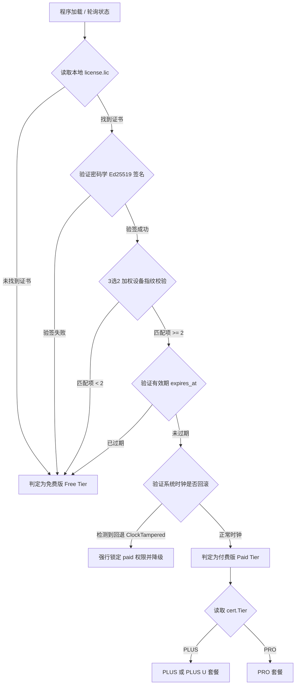

# EQT 授权级别（License Tier）检测与违规限制排查分析文档

本文档详细梳理了 EQT 软件如何检测付费授权级别（Tier）、如何识别时钟篡改等违规状态、违规后的限制行为、以及前端 GUI 显示付费状态的具体位置与底层数据流。

---

## 1. 统一的 Tier 检测机制与触发时机

为了实现真正的“默默检测”，EQT 采用后端权威校验与前端状态对齐的体系，并且在启动、兑换等各个生命周期节点都有明确的触发机制。

### 1.1 后端默默检测逻辑
Go 后端（`pkg/server/chat_limiter.go`）是付费状态判定的最权威来源。其通过以下几种时机触发检测：

1. **程序启动后异步检测（首次默默检测）**：
   在 `cmd/eqt/main.go`（CLI 入口）和 `desktop/gui/main.go`（GUI 入口）的 `main()` 函数第一行，会立刻调用 `server.PrecomputeDeviceFingerprints()`。
   该方法完全异步启动后台协程：
   - 在后台并发地利用 powershell/wmic/linux sysfs 预计算并缓存设备的三项加权硬件指纹。这彻底避免了在包加载阶段同步执行慢速 shell 命令引起的启动阻塞，也完全消除了因 Windows 子系统尚未就绪导致子进程运行时短暂“黑窗口闪现”的问题。
   - 当指纹预计算和缓存完成后，后台协程自动触发本地数字证书的默默校验（`VerifyLocalLicense()`）。这会读取本地 `.lic` 文件并校验签名、是否过期、系统时钟防回拨等，将权威校验状态存储到内存并写入 `chat_usage.json` 中，确保 GUI 启动秒开、检测全程无感。
2. **兑换激活时（兑换后检测）**：
   用户在前端输入兑换码，触发 Go 端调用 `ActivateLicenseOnline`。在连接 Cloudflare 验证通过并下发签名的 `.lic` 文件到本地后，主动触发一次 `SetPaidStatus(true, ...)` 将状态立即刷新。
3. **日常状态轮询与查询时**：
   桌面 GUI 开启时，前端会定期（如每 2 秒或在切换模式时）轮询后端获取状态（调用 `AgentStatus()` 接口）。后端在 `snapshotLocked()` 中调用 `GetPaidStatus()`、`GetLicenseTier()` 等方法。这会访问 `limiterInstance.GetStatus()`，在免磁盘 I/O 开销的原则下通过内存缓存返回最新状态；在跨天或发生关键交互时，重新执行底层的 `checkLicenseValidity()` 安全校准。
4. **重置授权时**：
   用户点击重置，调用 `ResetLicense()`。后端会物理删除本地的 `.lic` 证书，并触发 `SetPaidStatus(false, ...)` 降级，立即清理所有付费特权。

### 1.2 前端统一的 Tier 判定函数
为了消除前端与后端状态的不一致（例如：本地 localStorage 依然残留证书数据，但后端判定已过期、已被时钟锁或指纹校验失败），前端 `desktop/gui/frontend/src/main.js` 重构了统一的 `hasPaidLicense()` 判定函数：
- **判定规则**：
  1. 必须在本地 localStorage 中拥有已保存的证书 Tier；
  2. 如果后端的 status 状态数据已加载，必须满足后端返回的 `state.status.isPaid === true` **且** `state.status.clockTampered === false`。
- **作用**：确保所有和 Tier 显示、特权判定相关的区域，在违规锁死或校验失败的情况下，能同步降级并保持状态的一致性，防止前端显示“已激活”但实际功能已受限。

---

## 2. 处于什么 Tier 的具体检测流程

检测付费 Tier 的核心逻辑位于 [license.go](file:///home/yelon/develop/me/eqrcp/pkg/server/license.go) 的 `VerifyLocalLicense()` 以及 [chat_limiter.go](file:///home/yelon/develop/me/eqrcp/pkg/server/chat_limiter.go) 的 `checkLicenseValidity()` 中：

### 具体检测细节：
1. **密码学签名（Ed25519）校验**：
   - 提取证书字段，拼接为 `license_code|tier|uuid_hash|cpu_hash|disk_hash|expires_at|max_devices` 原始字节流。
   - 使用内置的 Ed25519 公钥（`08443678fe8...`）与证书里的十六进制签名（`Signature`）比对。
2. **3选2 加权硬件指纹比对**：
   - 获取当前设备的主板 UUID、CPU 序列号、以及系统盘物理 SerialNumber 的哈希值。
   - 对比证书中的哈希。特别注意：若由于运行权限限制导致某项特征为空字符串 `""`，此字段**判定直接跳过，不做匹配**，防止伪造。
   - 必须有 **至少 2 项有效非空哈希** 与证书一致，指纹校验方为通过。
3. **过期时间校验**：
   - 如果证书中的 `ExpiresAt` 不为 `"LIFETIME"`，则利用网络时间（异步防挂起刷新机制，获取 `offset` 偏置缓存）校验当前时间是否已经晚于过期时间。
4. **时钟回拨锁定校验**：
   - 若系统时钟被标记为篡改，即使证书离线校验全部通过，也会强制降级。

---

## 3. 违规状态的检测与各模式限制

### 3.1 违规状态分类与判定
1. **系统时钟回滚锁定（ClockTampered = true）**：
   - **检测原理**：后端每次保存使用状态时，会将当前 Unix 时间戳记入 `LastTime` 字段（并进行 XOR 混淆存储）。当下次加载时，如果检测到当前系统时间早于 `LastTime - 600`（即系统时间前移回拨超过 10 分钟），说明用户试图通过回拨时钟以规避付费过期，立即触发 `ClockTampered = true`。
   - **重置机制**：此状态是物理锁死的。只有进行显式重置（`ResetLicense`）或者重新兑换激活（`SetPaidDetails`），时钟篡改标志才会被复位。
2. **授权校验失败（isPaid = false 且本地有证书）**：
   - **检测原理**：前端的本地 `localStorage` 存有激活的证书 Tier 记录，但 Go 后端返回的 `state.status.isPaid` 为 `false`（可能由于本地 `.lic` 被人为篡改、硬件指纹失效、证书到期等原因）。

### 3.2 违规降级后的具体限制机制

一旦检测到违规或未激活，各模式在运行阶段会受到如下精确约束：

| 运行模式 | 正常付费版权限 | 免费版/违规降级后限制行为 | 拦截与限制机制的底层实现 |
| :--- | :--- | :--- | :--- |
| **Share (分享)** | - 无文件大小限制 - 无文件个数限制 - 无每日使用次数限制 | - 每日仅限前 5 次体验全功能 - 超额后，单次传输**最多 5 个文件**，单个文件**最大 50MB** | 在 GUI 的 `Share()` 启动前，递归检查待分享文件列表。如果超额且不满足上述边界，则直接返回 `error` 阻断服务启动。 |
| **Receive (接收)** | - 无文件大小限制 - 无文件个数限制 - 无每日使用次数限制 | - 每日仅限前 5 次体验全功能 - 超额后，单次传输**最多 5 个文件**，单个文件**最大 50MB** | 在 POST `/receive/...` 入口处锁死超额标记。若超额：在 Multipart 解析循环中，文件数达 5 个时拒绝后续接收；在 Chunk 写入循环中，单个文件累计写入超过 50MB 时立即强制关闭文件、返回 `413` 并调用 `signalStop()` 关闭服务。 |
| **Chat (聊天)** | - 无时间限制 - 独享满速 Chat 体验 | - 每日免费额度为 **5分钟 (300秒)** - 超额后停止服务，启用限速/锁死 | 后端 `ChatLimiter` 使用定时器累加时间，非付费用户额度耗尽后，返回限额信息。前端在 UI 上屏蔽消息发送。 |

---

## 4. 前端 GUI 付费 Tier 的显示位置与展示逻辑

前端在以下 4 个主要区域同步展示用户的付费 Tier 状态：

### 4.1 侧边栏（Sidebar）头部勋章
- **显示位置**：左侧边栏顶部的品牌 logo 或产品名称旁。
- **展示方式**：展示如 `PLUS` 或 `PRO` 的高亮徽章（`.license-badge.sidebar-badge`）。
- **流程**：
  - 前端渲染侧边栏时，调用 `hasPaidLicense()`。
  - 如果判定为真（已购买且无违规降级），显示对应的 `state.license.tier` 勋章。
  - 如果未付费、已重置、发生时钟篡改或授权校验失败，此勋章会自动隐藏，保持界面清爽。

### 4.2 关于（About）面板
- **显示位置**：点击顶部菜单栏“关于”图标弹出的面板中。
- **展示方式**：
  - **正常付费**：显示套餐名称为 `"EQT Plus"`, `"EQT Pro"` 或 `"EQT Plus U"`，并显示激活的日期 `"Activated at: YYYY/MM/DD"`。
  - **时钟回滚锁定**：套餐名称显示为 `时钟回退锁定`，状态详情显示为 `付费功能已被锁死`。并在上方显示黄红色的 Notice 警示条：**⚠️ 时钟篡改锁定**。
  - **授权校验失败**：套餐名称显示为 `[Tier名称] 授权锁定限制`，状态详情显示为 `验证未通过，请检查核心服务连接或重置`。上方显示警示条：**⚠️ 授权校验失败**。
  - **免费版**：套餐名称显示为 `Free`，并显示今日 Chat 体验的剩余时间。
  - **刷新按钮（手动检测）**：套餐卡片右侧新增了一个刷新检测按钮（↻）。点击后会通过 Wails 绑定调用后端的 `RefreshLicenseStatus` 强行重新触发硬件特征获取与本地 `.lic` 数字证书校验，并由 morphdom 局部的、无闪烁地重新渲染最新状态。
  - **限频保护机制**：
    - **联网正常时**（以 `navigator.onLine` 判定为真）：最大允许频率为**每分钟最多 2 次**（最小间隔 30 秒）。
    - **未联网时**：最大允许频率为**每 3 秒一次**。
    - 超频点击时会利用轻量级 Toast 进行状态提示，不使用 alert 阻碍弹窗。

### 4.3 兑换授权（Redeem）面板
- **显示位置**：点击顶部菜单栏“礼物”图标，或在设置面板的授权配置区。
- **展示方式**：
  - **正常付费**：显示 `"EQT Plus active"` 或 `"EQT Pro active"`，兑换输入框隐藏，并显示 `Reset Activation` 按钮供重置。
  - **违规锁定/校验失败**：在上方显示红色 Notice 警告条（“时钟回滚”或“校验失败”），提供 `Reset Activation` 按钮，强制清空当前不可信的本地状态以重新激活。
  - **未激活/免费版**：显示兑换码输入框及 `"Enter a valid EQT code to unlock a paid tier"` 的说明，展示 `Activate` 按钮。

### 4.4 Chat 操作面板
- **显示位置**：右侧 Chat 对话区域的顶栏与底部输入区。
- **展示方式**：
  - **正常付费**：顶部状态条显示 `"EQT Plus"` 或 `"EQT Pro"` 等解锁文字，底部输入框可用，无任何时间限制提示。
  - **免费版/违规降级**：顶部显示今日剩余体验时间倒计时（如 `"Remaining: 04:32"`）。体验时间归零后，顶部显示 `"Daily free limit reached"`，底部输入框被禁用并展示 `"Start chat"` 锁定按钮。
