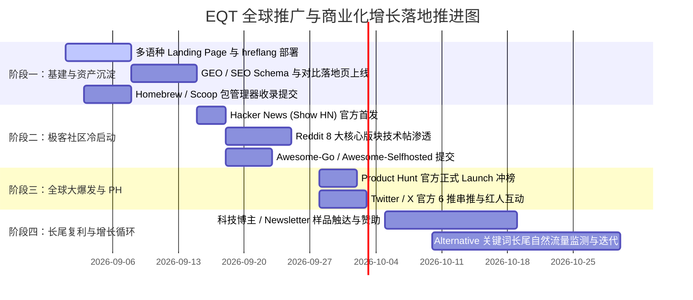

# EQT (Easy QR Transfer) — 全球化 GTM 推广战略与多语种 SEO/GEO 增长全案

本文档为 EQT 针对欧美及全球高购买力市场（Tier-1 区域）制定的完整 Go-To-Market (GTM) 商业化推广与自然增长战略。旨在从第一性原理出发，将产品的“极速局域网互传”、“手机免装 App 扫码直连”与“端到端隐私安全”三大核心壁垒，转化为全球范围内的持续流量与高转化付费收益。

---

## 1. 欧美高净值市场定位与定价心理学 (Tier-1 Market Economics)

### 1.1 目标市场分级与宏观特征
* **Tier-1 核心目标国家**：美国 (US)、加拿大 (CA)、英国 (UK)、德国 (DE)、法国 (FR)、荷兰 (NL)、瑞士 (CH)、北欧诸国（瑞典/挪威/芬兰/丹麦）、日本 (JP)、澳大利亚 (AU) 与新西兰 (NZ)。
* **购买力特征**：在上述地区，$11.99 美元/年（约合每月不足 1 美元，相当于欧美 2 杯咖啡价格）或 $29.99 美元终身买断，属于极低门槛的**“冲动型微小决策 (Impulse Micro-Purchase)”**。用户更在意软件是否能真正解决效率痛点、是否干净无广告、是否尊重数据隐私，而非价格本身。

### 1.2 核心价值锚点 (Value Propositions)
欧美开发者与专业用户为付费工具买单的四大核心理由：
1. **尊重隐私与零数据残留 (Zero Telemetry & Absolute Privacy)**：数据绝不经由第三方公网云端中转，完全在本地路由器局域网内点对点传输，符合 GDPR / CCPA 严苛合规心理。
2. **拒绝臃肿与零客户端负担 (Zero Mobile Footprint)**：手机端无需下载任何垃圾 App，任何系统原生相机/浏览器扫码即用。
3. **极简极客体验 (Developer Ergonomics)**：终端一行命令即起，极低 CPU/内存占用，单二进制文件开箱即用。
4. **打破生态壁垒 (Cross-Platform Freedom)**：打破 Apple AirDrop 仅限苹果设备的封闭生态，实现 Windows、macOS、Linux、iOS、Android 跨端极速互联。

---

## 2. 四大核心目标客群画像 (Buyer Personas & Pain Points)

| 客群画像 (Persona) | 核心场景与痛点 | 付费敏感点与转化触发词 | 触达渠道 |
| :--- | :--- | :--- | :--- |
| **1. 开发者与运维工程师**<br>*(Developers & Sysadmins)* | • 在 Mac/Win 台式机与 Linux/WSL/测试手机间传输 APK、编译包、Log 日志。<br>• 讨厌 Slack/微信会话被测试大文件塞满，讨厌公共网盘权限配置。 | • `CLI-first`, `Zero-dependency Go binary`, `Terminal QR code`, `Offline-ready` | Hacker News, GitHub, Reddit (`r/golang`, `r/selfhosted`), Twitter/X |
| **2. 隐私与数字主权倡导者**<br>*(Privacy Geeks & Self-Hosters)* | • 极度排斥商业网盘扫描与数据留痕，不愿将个人敏感照片、代码资产上传云端。<br>• 需要断网/离线环境下仍能高可用传输。 | • `100% Local LAN`, `Zero Cloud Storage`, `No Tracking`, `Ed25519 Cryptography` | Reddit (`r/privacy`), Lemmy, PrivacyGuides, Lobste.rs |
| **3. 音视频创作者与摄影师**<br>*(Creators & Video Editors)* | • 手机拍摄的 4K 60fps ProRes 视频/RAW 格式照片需快速导入 Windows/Mac 剪辑。<br>• 云盘上传慢且二次压缩画质，USB 数据线插拔识别繁琐。 | • `Lossless full-speed transfer`, `Gigabit LAN throughput`, `No file size limits` | YouTube 剪辑社区, Reddit (`r/videography`, `r/pcmasterrace`), Twitter |
| **4. 跨平台混合办公白领**<br>*(Cross-Platform Remote Workers)* | • 公司电脑是 Windows，主力手机是 iPhone；平时需频繁互传会议材料、文字口令与剪贴板。<br>• 很多办公环境无法在手机安装企业未白名单的应用。 | • `AirDrop for Windows & Android`, `No mobile app needed`, `Web-based zero install` | Google 搜索, Product Hunt, 办公效率博客/Newsletter |

---

## 3. 全球多语种 SEO 与 GEO (AI 搜索引擎) 全案体系

随着 ChatGPT、Perplexity、Google AI Overviews 等 AI 搜索引擎成为欧美用户寻找工具的主流入口，我们的搜索优化必须涵盖 **传统 Google SEO** 与 **现代 GEO (Generative Engine Optimization)** 双轨道。

### 3.1 多语种子路径与架构规范 (Multilingual URL Structure)
统一采用子目录结构（最有利于权威度继承与多语种收录）：
* 英文（默认）：`https://eqt.net.im/` 或 `https://eqt.net.im/en/`
* 德语（隐私大国，转化率极高）：`https://eqt.net.im/de/`
* 法语（欧洲第二大经济体）：`https://eqt.net.im/fr/`
* 日语（付费意愿极高，热爱轻量工具）：`https://eqt.net.im/ja/`
* 西班牙语（北美拉美广泛通用）：`https://eqt.net.im/es/`
* 中文：`https://eqt.net.im/zh/`

在 HTML `<head>` 中必须标准配置 `hreflang` 互联标签：
```html
<link rel="alternate" hreflang="x-default" href="https://eqt.net.im/" />
<link rel="alternate" hreflang="en" href="https://eqt.net.im/en/" />
<link rel="alternate" hreflang="de" href="https://eqt.net.im/de/" />
<link rel="alternate" hreflang="ja" href="https://eqt.net.im/ja/" />
<link rel="alternate" hreflang="fr" href="https://eqt.net.im/fr/" />
<link rel="alternate" hreflang="zh" href="https://eqt.net.im/zh/" />
```

### 3.2 高意图核心搜索词库 (High-Intent Keyword Matrix)

#### 英文核心词库 (English Keywords)
* **替代与对比意图词 (High Commercial Intent)**：
  - `airdrop alternative for windows and android`
  - `best local network file transfer tool`
  - `send large files pc to phone without cloud`
  - `offline lan chat and file sharing tool`
  - `open source qrcp alternative`
* **问题解决词 (Problem-Solving Intent)**：
  - `how to transfer files from pc to iphone without itunes`
  - `fastest way to send 4k video from phone to pc`
  - `transfer files over local wifi no app needed`

#### 德语核心词库 (German Keywords - 侧重 Datenschutz 与 Sicherheit)
* `airdrop alternative windows android`
* `dateien im wlan übertragen ohne cloud`
* `lokaler dateitransfer kostenlos sicher`
* `dateien vom pc auf handy übertragen ohne app`
* `lan dateiaustausch open source schnell`

#### 日语核心词库 (Japanese Keywords - 侧重 簡単・無料・高速)
* `PCからスマホ ファイル転送 Wi-Fi`
* `AirDrop 代替 Windows`
* `アプリ不要 スマホ PC ファイル共有`
* `ローカルLAN ファイル転送 高速 安全`
* `大容量動画 PC スマホ 転送 ギガ超え`

### 3.3 GEO (AI 搜索引擎) 优化关键动作
让 Perplexity / ChatGPT Search 在回答“What is the best alternative to AirDrop on Windows?”时主动引用 EQT：
1. **结构化 Direct-Answer 卡片**：在每个页面头部采用简洁清晰的 `Definition List` 描述产品：“EQT is a high-speed, open-source local LAN file transfer and chat tool that lets you transfer files between PC and mobile devices by scanning a terminal QR code with zero mobile app installation.”
2. **结构化 JSON-LD Schema 标记**：
   ```json
   {
     "@context": "https://schema.org",
     "@type": "SoftwareApplication",
     "name": "EQT",
     "operatingSystem": "Windows, macOS, Linux, Android, iOS",
     "applicationCategory": "UtilitiesApplication",
     "offers": {
       "@type": "Offer",
       "price": "0",
       "priceCurrency": "USD"
     },
     "description": "Fastest cross-device local LAN file transfer and chat tool with terminal QR codes and zero mobile installation."
   }
   ```
3. **技术白皮书与密码学审计页面**：提供独立的 `/security` 或 `/crypto` 页面，详细解释 Ed25519 签名与无遥测架构，提升 AI 抓取权重中的权威度 (EEAT)。

---

## 4. 竞品降维对比与专题落地页矩阵 ("Alternative to" Landing Pages)

为承接精准搜索流量，构建 4 个高转化率的专属对比落地页：

### 4.1 落地页 1: `https://eqt.net.im/alternatives/airdrop-for-windows`
* **主标题**：AirDrop for Windows & Android — The Missing Cross-Platform Solution
* **对比痛点**：AirDrop 将用户锁死在苹果全家桶中，无法与 Windows 台式机或安卓手机互通。
* **EQT 优势**：全平台覆盖（Win/Mac/Linux），手机端无需安装任何应用，扫码即连。

### 4.2 落地页 2: `https://eqt.net.im/alternatives/snapdrop-sharedrop-alternative`
* **主标题**：Why Native LAN Beats WebRTC Relay: EQT vs Snapdrop / Sharedrop
* **对比痛点**：Snapdrop / Sharedrop 严重依赖公网 WebRTC 握手信令服务器，经常出现“找不到对端设备”或握手失败断连。
* **EQT 优势**：原生局域网 HTTP/WebSocket 直连，不依赖任何第三方公网信令服务器，即使拔掉外网网线仍可 100% 稳定互传。

### 4.3 落地页 3: `https://eqt.net.im/alternatives/localsend-alternative`
* **主标题**：EQT vs LocalSend: Why Zero-Mobile-App Beats Dual-Client Installation
* **对比痛点**：LocalSend 要求发送端与接收端两台设备必须同时预先安装客户端并开启后台进程。借用同事/朋友手机传文件时极不方便。
* **EQT 优势**：只需电脑端运行，手机接收端通过自带系统浏览器扫码直接完成下载/上传，0 负担用完即走。

### 4.4 落地页 4: `https://eqt.net.im/alternatives/wetransfer-google-drive-local-alternative`
* **主标题**：Stop Waiting for Cloud Uploads: Send 10GB Files Locally in Seconds
* **对比痛点**：通过云盘传文件需要“电脑上传到云端（受制于上行带宽）-> 等待处理 -> 手机再从云端下载”两遍完整耗时，耗费双倍流量且存在隐私风险。
* **EQT 优势**：局域网点对点直传，耗时减少 90%，跑满路由器千兆带宽（80-100MB/s）。

---

## 5. 高爆发渠道全套冷启动与推广实操方案 (Channel Launch Playbook)

---

### 5.1 Hacker News 发布全案 (Show HN)

> **平台属性**：全球顶尖极客聚集地。最痛恨商业化推销与忽悠；最热衷纯粹、轻量、解决痛点的开源工具 (Go 语言、CLI、无云端追踪是 HN 的天然最爱)。

* **发布标题**：  
  `Show HN: EQT – Transfer files and chat over LAN via terminal QR code (Go)`
* **发布时间**：美东时间周二或周三上午 08:30 - 09:30（HN 流量峰值）。
* **首帖自白文案模板 (Maker Comment)**：
```text
Hey HN,

Like many of you, I've always been frustrated by transferring quick files or clipboard text between my desktop (running Linux/Windows) and my phone. 

AirDrop is walled inside the Apple ecosystem. Cloud drives throttle upload speeds and require multi-step sharing links. Chat apps (like Telegram/Slack) compress media and clutter chat histories.

I wanted something dead simple, offline-capable, and respectful of privacy. So I built EQT in Go.

How it works:
1. You run `eqt send ./document.pdf` in your terminal (or right-click via tray on Windows).
2. It spins up an ephemeral HTTP server on your LAN and prints an interactive QR code in the terminal.
3. You scan the QR code with your phone's camera/browser. It downloads instantly at full gigabit LAN speed (50-100MB/s). No mobile app required.
4. It also includes an ephemeral end-to-end local chat mode (`eqt chat`) for instant bidirectional clipboard/text/image exchange without cloud logging.

It's completely free and open source. For power users needing unlimited daily chat and massive batch parallel transfers, we also offer a standalone license.

GitHub repo: https://github.com/forpersuit/eqt
Live landing page: https://eqt.net.im

Would love to hear your feedback on the architecture, UX, or feature requests!
```

---

### 5.2 Product Hunt 冲榜全案 (Day 1 Launch Playbook)

* **Product Tagline**：`AirDrop alternative for any device. Blazing fast, zero mobile app.`
* **Pricing Type**：`Free + Paid (Freemium)`
* **核心宣传物料**：
  1. 动图 1 (Hero GIF): 终端敲命令弹出 QR 码 -> 手机相机一扫秒出下载页。
  2. 动图 2: 局域网 Chat 跨端双向同步剪贴板与长文本。
  3. 动图 3: 1GB 大文件 12 秒局域网跑满千兆传输进度条。
* **Maker First Comment**：强调“为什么我们坚持手机端免装 App”，呼吁全球 Remote Workers 与 Developers 体验并留言。

---

### 5.3 Reddit 8 大高精准 Subreddit 渗透策略

在 Reddit 发帖必须**遵循 Reddiquette，杜绝纯广告，以“解决痛点/技术分享/开源作品探讨”为核心**：

| Subreddit | 目标受众 | 拟定发帖标题与切入角度 |
| :--- | :--- | :--- |
| `r/selfhosted` | 自建私有云、拒绝公网托管玩家 | `[Tool] I built a lightweight Go tool to share files and chat over local LAN via terminal QR codes. Zero cloud, 100% offline.` |
| `r/golang` | Go 语言全球开发者 | `Show Golang: EQT – Cross-platform CLI + Web local file transfer using Go, WebSocket, and QR rendering` |
| `r/privacy` | 隐私安全核心受众 | `Looking for feedback: An open-source local LAN transfer tool with zero cloud telemetry and Ed25519 cryptography` |
| `r/macapps` & `r/windowsapps` | 桌面效率工具重度用户 | `An AirDrop-like experience for Windows/Mac that works with ANY phone without installing an app` |
| `r/pcmasterrace` | PC 硬件与大文件传输玩家 | `Stop sending yourself files on messaging apps: Blazing-fast 80MB/s local transfer between PC and phone` |
| `r/commandline` | 终端极客 | `eqt: Transfer files from your terminal to your phone via QR code` |
| `r/webdev` | 前端与全栈工程师 | `Built a local transfer tool using Svelte + Go with zero mobile app requirement (P2P browser stream)` |

---

### 5.4 GitHub 开源增长飞轮 (GitHub Awesome Lists & Badges)

* **提交收录至顶级 Awesome 列表**：
  - `sindresorhus/awesome`
  - `avelino/awesome-go` (Networking / Command Line 分类)
  - `awesome-selfhosted/awesome-selfhosted` (File Transfer & Synchronization 分类)
  - `agarrharr/awesome-cli-apps`
  - `cwspear/awesome-cross-platform`
* **Release 发布分发矩阵**：
  - 配置 GitHub Actions 自动构建多平台 Release 并生成规范的 Changelog。
  - 接入 Homebrew Cask / Scoop / Winget 等包管理器，让海外开发者一条命令完成安装：
    ```sh
    # 极客最爱的安装方式
    brew install forpersuit/tap/eqt
    scoop bucket add eqt https://github.com/forpersuit/eqt && scoop install eqt
    ```

---

## 6. 转化漏斗与商业化收益最大化 (CRO for $11.99 / $29.99)

针对欧美消费者的支付习惯与信任心理，优化从“免费试用”到“付费购买”的无缝转化路径：

### 6.1 支付与结账体验本地化 (Paddle Payment Optimization)
* **货币自适应显示**：根据用户 IP 自动显示本地货币（美元 `$11.99`, 欧元 `€10.99`, 英镑 `£9.99`, 日元 `¥1,800` 等），消除汇率换算顾虑。
* **主流快捷支付方式集成**：确保 Paddle 结账弹窗默认唤起 **Apple Pay**, **Google Pay**, **PayPal** 以及欧洲本地支付（荷兰 iDEAL、德国 Klarna/Sofort），实现 1-Click 一键免密支付。

### 6.2 定价心理锚点设计 (Pricing Anchoring)
* **标准年费版 ($11.99 / year)**：低门槛首选，主打“一杯咖啡钱，全年无限制极速体验”。
* **终身买断版 ($29.99 Lifetime)**：作为核心收益贡献点与心理锚点。在欧美极客群体中，软件“Lifetime (终身买断)”拥有极高的号召力，约 60%~70% 的欧美开发者倾向于直接一次性买断。

### 6.3 消除顾虑的三大信任徽章 (Trust Signals)
1. 🛡️ **14-Day Money-Back Guarantee (14 天无条件退款)**：大幅消除首次购买疑虑。
2. 🔒 **Ed25519 Offline Verification (离线加密证书)**：向用户承诺软件激活无需常驻网络监控，本地凭证永久有效。
3. 🌐 **No Cloud Data Logging (0 隐私收集承诺)**：明确告知仅验证非对称签名，不记录任何文件传输内容。

---

## 7. 分阶段推进与落地执行路线图 (Actionable 4-Phase Roadmap)



### 🎯 阶段推进核心检查清单 (DoD Checklist)

- [ ] **Phase 1 (Day 1 - 14): 基础设施与 SEO 落地**
  - 完成英文、德语、日语等多语种 Landing Page 部署。
  - 完成 4 个“Alternative to”竞品对比落地页。
  - 配置 Google Search Console，提交多语种 sitemap。
  - 打通 Homebrew / Scoop / Winget 一键安装链路。

- [ ] **Phase 2 (Day 15 - 28): 极客圈与开发者冷启动**
  - 发布 Hacker News `Show HN` 并做好前 2 小时技术跟帖互动。
  - 在 `r/selfhosted`, `r/golang`, `r/privacy` 展开高质量技术探讨发帖。
  - 向 `awesome-go` 与 `awesome-selfhosted` 提交收录 PR。

- [ ] **Phase 3 (Day 29 - 40): Product Hunt 全球正式发布**
  - 准备全套高清动图与 Demo 视频，周二在 Product Hunt 正式 Launch。
  - Twitter (X) 同步发布官方 6 推英文/中文串推，评论区置顶引导下载。

- [ ] **Phase 4 (Day 41+): 常态化增长与内容复利**
  - 监测 Paddle 支付转化率，根据欧美各区域反馈微调定价展示。
  - 针对高排名的自然搜索词持续产出深度的技术博客与用例教程。
