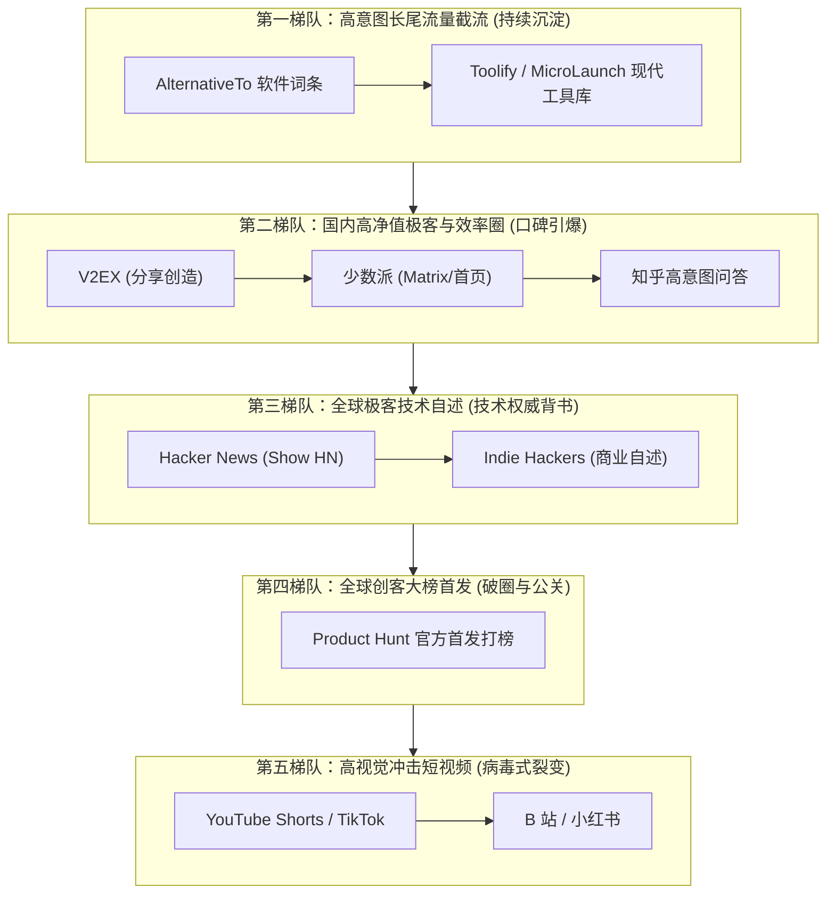

# EQT 全渠道推广攻坚规划全案 (Omnichannel Launch & Promotion Plan)

> **核心定位原则**：EQT (Easy QR Transfer) 坚持**独立商业数字化工具（Indie Commercial Utility）**定位。绝不提及“开源 / Open Source / GitHub”，坚定树立**极客匠心、零云端泄露、物理千兆 LAN、免装手机 App、终身买断制**的高品质商业软件品牌形象。

---

## 1. 攻坚全景图与推进排期 (Battle Plan Roadmap)

推广策略基于第一性原理，兼顾**“长期被动长尾流量”**与**“短期爆发型打榜阵地”**，分为五个系统攻坚梯队：

---

## 2. 攻坚全渠道执行跟踪看板 (Live Execution Tracker)

| 编号 | 推广平台 | 目标属性 | 核心价值 / 预期成果 | 优先级 | 当前状态 | 对应负责人 / 资产入口 |
| :---: | :--- | :--- | :--- | :---: | :---: | :--- |
| **0A** | **X (Twitter)** | 海外社媒 | 官方阵地、Thread 长推、私信赠码链路 | P0 | **已上线运行** | `twitter-promotion-strategy.md` |
| **0B** | **Reddit** | 海外创客 | r/SideProject 4.9s 循环视频长文与首评 | P0 | **已发布就绪** | `reddit-launch-execution-playbook.md` |
| **01** | **AlternativeTo** | 被动长尾 | 截流 "AirDrop/LocalSend/Snapdrop alternative" | **P0** | **待攻坚 (首选)** | 免费提交软件词条与标签绑定 |
| **02** | **Toolify / MicroLaunch** | 现代工具库 | 增加 AI 搜索引擎 (GEO) 权重与反链 | P1 | 待攻坚 | 提交收录，完善 Product 卡片 |
| **03** | **V2EX (分享创造)** | 国内极客 | 程序员核心圈层、无广告轻量工具口碑 | **P0** | **待攻坚 (首选)** | 准备真诚自述文案 + 赠送 10 个激活码 |
| **04** | **少数派 (sspai)** | 国内办公效率 | 跨生态传文件痛点深度评测、极高付费意愿 | P0 | 待攻坚 | 准备 Matrix 深度图文稿件 |
| **05** | **知乎高权重问答** | 国内 SEO | 电脑传手机、不压缩 4K、局域网互传意图词 | P1 | 待攻坚 | 梳理 5 个高赞问题，撰写权威解答 |
| **06** | **Hacker News (Show HN)**| 全球顶级极客 | 攻克 LAN-TLS 绿锁与局域网第一性原理自述 | P0 | 待攻坚 | 撰写 Show HN 深度技术剖析帖 |
| **07** | **Indie Hackers** | 独立开发者 | 独立商业化、买断制与工具类产品思考 | P1 | 待攻坚 | 撰写买断制商业模式复盘文 |
| **08** | **Product Hunt** | 全球首发打榜 | 争夺 Product of the Day Top 5、媒体曝光 | P0 | 待攻坚 (筹备中) | 制作 Gallery 素材、动图与首发折扣 |
| **09** | **YouTube Shorts / TikTok** | 海外短视频 | 15 秒视觉冲击（拖入文件->扫码->秒传） | P1 | 待攻坚 | 依据 `feature-video-promotion-plan.md` 拍摄 |
| **10** | **B 站 / 小红书** | 国内短视频 | “告别微信传输助手”、“跨设备神仙工具” | P1 | 待攻坚 | 制作横版评测与坚果式痛点切片 |

---

## 3. 各平台深度攻坚战术手册 (Per-Platform Tactical Playbooks)

### 攻坚 01: AlternativeTo (全球最大替代软件搜索引擎) — ★★★★★ P0

1. **平台定位与受众心理**：
   - 全球用户寻找某个知名软件替代品（如寻找“没有苹果设备限制的 AirDrop”、“无需手机装 App 的 LocalSend”）的默认搜索入口。
   - 具有极强的 Google 搜索权重与持久的商业转化意图。
2. **核心切入点**：
   - 竞品对比：`AirDrop`, `LocalSend`, `Snapdrop`, `Nearby Share`, `WeTransfer`, `Feem`。
   - 核心差异化标签：`Zero Mobile Installation`（手机免装 App）、`Physical Gigabit LAN`（纯物理千兆内网）、`No Cloud Storage`（零云端存储）、`Lifetime License`（买断制）。
3. **物料准备清单**：
   - [ ] 官方应用名称：`EQT (Easy QR Transfer)`
   - [ ] 官方网站：`https://eqt.net.im/`
   - [ ] 一句话简介 (Short Description, < 150 字符)：
     `App-free local file sharing across PC, Mac, iPhone & Android at physical gigabit speed with zero setup and zero cloud leakage.`
   - [ ] 详细描述 (Long Description)：直接复用 `docs/marketing/global-launch-pitch-core.md` 的英文核心自述。
   - [ ] 图标与截图：3 张桌面端运行截图 + 1 张手机扫码浏览器界面截图。
   - [ ] 许可类型：`Freemium`（基础功能免费，专业功能买断）。
4. **审核与避坑指南**：
   - 官方提交审核通常需要 1~3 个工作日人工审核，确保描述真实客观，不包含虚假夸大词汇。

---

### 攻坚 02: V2EX (程序员与极客聚集地) — ★★★★★ P0

1. **平台定位与受众心理**：
   - 国内最核心的开发者、独立程序员与极客社区。
   - V 友极其反感虚假营销、流氓弹窗与割韭菜套路；但**极度尊重真正解决痛点、干净纯粹、交互优雅、有极客追求的个人独立作品**。
2. **核心切入点**：
   - 节点选择：`/go/create`（分享创造）。
   - 痛点自述：“为什么在同一张桌子上，电脑和手机相距 30 厘米，传个 4K 视频或大压缩包还要被微信压缩/被网盘上传下载折磨？”
   - 技术干货：分享如何攻克局域网内 HTTPS 绿锁与本地 TLS 回环，为什么坚持手机端免装 App（浏览器即客户端）。
3. **互动与促活设计**：
   - 文末赠送 10~20 个 1 年期 Plus 激活码（可通过 `scripts/gen-promo-keys.sh` 批量生成）。
   - 说明：“核心局域网传输永久免费无广告，赠送的兑换码支持高级多网卡绑定与专业特性，欢迎大家提 Bug 和改进建议！”。
4. **审核与避坑指南**：
   - 严禁顶帖刷楼；认真回复每一位 V 友的疑问，尤其是关于网络配置、安全性、多平台支持的技术细节。

---

### 攻坚 03: 少数派 (sspai.com) — ★★★★★ P0

1. **平台定位与受众心理**：
   - 中国最有品质的数字生活、效率办公与苹果/跨生态工具社区。
   - 用户大多为设计师、剪辑师、文字工作者、程序员，重视美感与效率，且付费意愿在中文互联网位列第一梯队。
2. **核心切入点**：
   - 专栏/Matrix 社区投稿。
   - 推荐选题：
     - 《告别微信传输助手与插线：我是如何用二维码让 Windows、Mac 与手机跑满千兆局域网的？》
     - 《数字游民的跨设备工作流：为什么我选择自己做一款免装 App 的局域网传输工具？》
3. **物料准备清单**：
   - [ ] 8~10 张高清图文流程配图（拖入文件、生成二维码、手机扫码、千兆进度条、双向即时聊天）。
   - [ ] 动图演示：5 秒扫码即传 Gif。
   - [ ] 真实使用场景对比表格：微信 vs 网盘 vs 数据线 vs AirDrop vs EQT。

---

### 攻坚 04: Hacker News (Show HN) — ★★★★★ P0

1. **平台定位与受众心理**：
   - Y Combinator 旗下，全球技术含金量最高的极客社区。
   - HN 用户对纯商业宣传零容忍，但如果标题是 `Show HN` 且内容具备深度的系统工程探索，极客们会自发给出高赞并顶上首页。
2. **推荐标题**：
   - `Show HN: EQT – App-free gigabit local file transfer across PC, Mac, and mobile`
3. **内容架构**：
   - 第一性原理：两台设备相隔 30 厘米，传输绝不该绕经公网云端。
   - 核心技术挑战：**The LAN-TLS problem**（移动端浏览器对内网 IP 的安全限制、WebRTC/WebSockets 降级与权威证书本地 loopback 实践）。
   - 独立商业哲学：为什么选择透明买断制，拒绝现代 SaaS 的无节制订阅陷阱。
4. **审核与避坑指南**：
   - 必须使用活跃账号在美东时间周一至周三早晨 8:00–10:00 (EST) 发帖，这是 HN 流量黄金时段。

---

### 攻坚 05: Product Hunt (PH 官方首发打榜) — ★★★★★ P0

1. **平台定位与受众心理**：
   - 全球创客与新产品首发第一阵地。获得 "Product of the Day Top 5" 可以带来全球科技媒体与海外风险博主的自发收录。
2. **发布资产准备**：
   - **Tagline (< 60 chars)**: `AirDrop for any device — at gigabit LAN speed, no app needed.`
   - **Thumbnail**: 240x240 精致深色动态 Logo / 极客动图。
   - **Gallery**: 4~5 张 1270x760 高清特性图（强调免 App、千兆局域网、全平台兼容、隐私安全）。
   - **Maker First Comment**: 讲述开发背景，公布 PH 专属 8 折买断优惠码 `PH20`。
3. **打榜战术**：
   - 排期在太平洋时间周二或周三 00:01 PST 正式 Launch，冲刺 24 小时榜单。

---

### 攻坚 06: 知乎高意图问答精准截流 — ★★★★☆ P1

1. **平台定位与搜索长效性**：
   - 知乎问答在百度与各大搜索引擎拥有极高权重，一个高赞回答可持续引流 1~3 年。
2. **核心搜索问题清单**：
   - *“电脑和手机之间如何快速传输几十 GB 的大文件？”*
   - *“Windows 和 iPhone 之间有什么类似 AirDrop 的局域网传输工具？”*
   - *“为什么微信传原图和视频会被压缩，有什么无损免 App 的替代方案？”*
3. **回答策略**：
   - 先客观分析痛点成因（微信公网带宽成本导致压缩、云盘双向上传下载延迟、数据线驱动繁琐）。
   - 给出第一性原理解法：纯局域网点对点传输。
   - 以开发者或重度体验者视角展示 EQT 的工作流，附带 1 张动图与操作流程。

---

### 攻坚 07: 视觉短视频切片 (YouTube Shorts / TikTok / B 站 / 小红书) — ★★★★☆ P1

1. **核心逻辑**：
   - EQT 的使用过程具有极强的**秒级视觉反差**（传统传文件要打开网页登录云盘或插数据线；EQT 拖入即显二维码，手机相机一晃，80MB/s 飞速飙满）。
2. **15 秒分镜头标准脚本**：
   - `00:00 - 00:03` **痛点黄金前 3 秒**: 手机拍电脑屏幕，“传一个 4K 视频还要上传百度网盘等半小时？”
   - `00:03 - 00:07` **颠覆动作**: 鼠标一拖，电脑屏幕出现二维码；拿起 iPhone/安卓手机，原生相机扫码。
   - `00:07 - 00:12` **爽点高潮**: 手机免下载任何 App，Safari/Chrome 自动打开，速度狂飙到 80MB/s，3 秒完成。
   - `00:12 - 00:15` **收尾引导**: 纯局域网不走公网服务器，保护隐私。链接见主页简介。

---

## 4. 下一步具体执行建议 (Next Action)

文档建立完毕后，建议按顺序推进：
1. **立即执行第一项**：在 **AlternativeTo** 提交 EQT 软件词条与标签绑定（无需发帖维护，只需一次提交，永久被动截流）。
2. **推进第二项**：为 **V2EX (分享创造)** 撰写完整的技术自述初稿，并通过脚本生成 10 个测试激活码，随时准备发帖互动。
