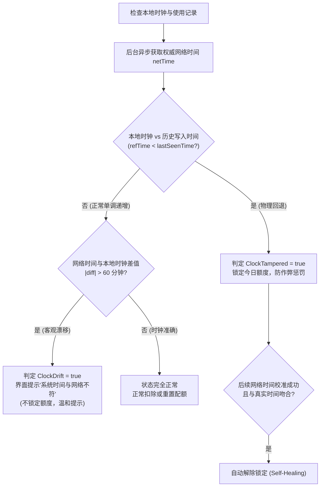

# 外部公共时钟嗅探与防篡改机制规范 (External Network Time Probing & Clock Drift Guard)

> **文档版本**：v1.0  
> **更新基准**：`v1.36.113`  
> **所属模块**：`pkg/server/chat_limiter.go`  
> **安全等级**：DRM & 传输可用性核心机制（主动网络行为披露）

---

## 1. 架构第一性原理与设计初衷 (First Principles & Objectives)

EQT 本质是一款立足于**局域网点对点互传**的高效工具。但在免费版功能配额（如每日免费聊天时长、每日传输次数）以及专业版离线许可证（7 天离线租约缓存）的生命周期管理中，系统必须依赖一个**单调递增、真实可靠的时间基准**。

### 1.1 核心矛盾与威胁模型
1. **本地时钟篡改（Clock Tampering / Rollback）**：  
   用户可以通过修改操作系统时间（例如将本地时间回拨到 3 天前，或永远固定在某一特定日期），试图绕过免费额度的每日重置机制，或强行延长即将过期的离线许可证租约。
2. **纯离线环境可用性与网络依赖的冲突**：  
   如果系统要求每次启动或每次传输都必须强制联网核验时间，将彻底摧毁局域网工具在无外网环境（如保密机房、高铁、野外局域网）下的离线可用性；反之，若完全盲信本地时钟，本地 DRM 保护将形同虚设。
3. **真实时钟偏差的误伤问题（Clock Drift vs Cheating）**：  
   部分用户的电脑主板纽扣电池没电或 BIOS 时钟重置，导致系统时钟客观上偏差了几小时或几天，但用户并未主观恶意作弊。系统绝不可因非恶意的时钟偏差直接粗暴封锁用户。

---

## 2. 主动时钟嗅探行为规范 (Behavior Specification)

为平衡“防范恶意时钟回拨”与“保障离线传输无感”，EQT 在 `pkg/server/chat_limiter.go` 中实现了一套**轻量、非阻塞、基于全球权威基础设施的外部网络时钟嗅探与自愈机制**。

### 2.1 顶级国际权威授时源 (Globally Authoritative Endpoints)
为彻底规避区域偏向性，并确保在跨国企业防火墙、国际家庭网络中的极高公信力与极低拦截率，时钟嗅探端点全量收敛至全球顶级权威基础设施（全部采用 TLS 加密）：

```go
endpoints := []string{
    getLicenseServer(),           // 1. EQT 官方鉴权服务端 (Anycast 优化)
    "https://www.cloudflare.com", // 2. Cloudflare 全球 Anycast 边缘 (RFC 7231 Date)
    "https://www.apple.com",      // 3. Apple 全球基础设施服务 (全网极速低时延)
    "https://www.microsoft.com",  // 4. Microsoft 官方时间基础设施 (Windows 原生权威)
    "https://www.google.com",     // 5. Google 全球核心网络 (国际最高公信力公共源)
    "https://aws.amazon.com",     // 6. Amazon AWS 全球云计算基础设施
}
```

- **全面淘汰旧端点**：彻底移除了具有特定区域偏向的商业端点（如旧版的 `aliyun.com`、`qq.com`）以及明文 HTTP 端点（如 `rom.miui.com`）；
- **全球高可用容灾**：按序轮询探测，命中任何一个首选响应即刻返回，兼顾中国大陆、欧美、亚太及跨国网络的互联互通性。

### 2.2 嗅探协议设计（零负载 HEAD 请求）
- **HTTP HEAD 优先**：客户端仅发起 `HEAD` 请求，仅请求对端的 HTTP 响应标头（Response Headers），**响应体数据传输量为 0 字节**，网络开销可忽略不计；
- **兜底极小分片 GET**：仅在极少数反向代理拒绝 HEAD 请求时，使用 `Range: bytes=0-0` 的 1 字节 GET 请求兜底；
- **时间提取标准**：严格解析响应头中符合 RFC 7231 / RFC 1123 标准的 `Date:` 标头（例如 `Date: Sun, 13 Sep 2026 03:25:00 GMT`），将其校准为当前的 UTC 网络基准时间。

---

## 3. 频控隔离与内存安全基线 (Caching & Resource Protection)

为了保护用户网络带宽、避免触发防火墙警报，并防止对公共基础设施产生无谓的频繁请求，时钟嗅探实施了严格的**三级门控与内存缓存隔离**：

| 机制状态 | 缓存/冷却策略 | 行为逻辑 |
| :--- | :--- | :--- |
| **缓存有效态 (Cache Hit)** | 成功缓存有效期 **1 小时** (`1 * time.Hour`) | 1 小时内系统计算网络时间纯粹基于内存偏移量：`time.Now().Add(netTimeOffset)`。**绝对不向公网发出任何网络包**。 |
| **探测冷却态 (Failure Cooldown)** | 失败抑制窗口 **1 分钟** (`1 * time.Minute`) | 当处于断网、离线或对端不可达时，失败后 1 分钟内禁止重复探测，彻底规避因网络异常引发的死循环轮询风暴。 |
| **非阻塞执行态 (Non-blocking Async)** | 后台异步 Goroutine | 启动与传输主流程永不阻塞等待。首次探测在后台异步执行，未拿到网络时间前以本地系统时钟先行保障传输，消除白屏与卡顿。 |
| **易失性内存隔离 (Volatile Memory Only)**| 绝不持久化落盘 | `netTimeOffset` 与 `ClockDrift` 仅驻留于进程内存中，进程退出或重启时自动释放，杜绝由于磁盘脏数据导致的时间误判。 |

---

## 4. 判定算法：时钟漂移 (Drift) vs 恶意回拨 (Tampered)

系统严格区分“客观时钟漂移”与“主观恶意回拨”：



### 4.1 客观时钟漂移 (`ClockDrift`)
- **判定阈值**：`clockDriftThreshold = 60 * time.Minute`；
- **处理原则**：**仅作为提示性信息（Informational Only）**。若用户电脑时间比网络时间快或慢了 2 小时，界面仅温和提示用户校准时钟，**绝不剥夺用户的免费使用额度**。

### 4.2 恶意时钟回拨 (`ClockTampered`)
- **判定准则**：系统每次保存使用记录时会记录本地时间戳。若读取时发现当前系统时间竟然早于上次持久化的时间点（物理时钟倒流），则认定发生了时钟回拨。
- **自动自愈（Self-Healing）**：
  若用户电脑通过 Windows NTP 校准了正确时间，下一次嗅探到真实网络时间后，系统会自动清除 `ClockTampered` 标记，恢复用户正常的每日免费福利，无需人工干预。

---

## 5. 离线环境与合规隐私安全声明 (Privacy & Offline Fallback)

1. **零个人隐私泄露**：
   - 外部时钟嗅探请求仅为通用的 HTTP HEAD 请求，**不包含任何设备指纹、用户标识、传输文件名或 License 数据**；
   - 嗅探目标为全球公开 Web 服务器，其通信特征与普通网页浏览完全一致。
2. **纯局域网脱机高韧性 (Fail-Open)**：
   - 当设备处于纯内网（无法连通外网授时端点）时，时钟嗅探静默失败，系统自动退行使用本地单调时钟，局域网内的文件互传与聊天服务**完全不受任何影响**。
