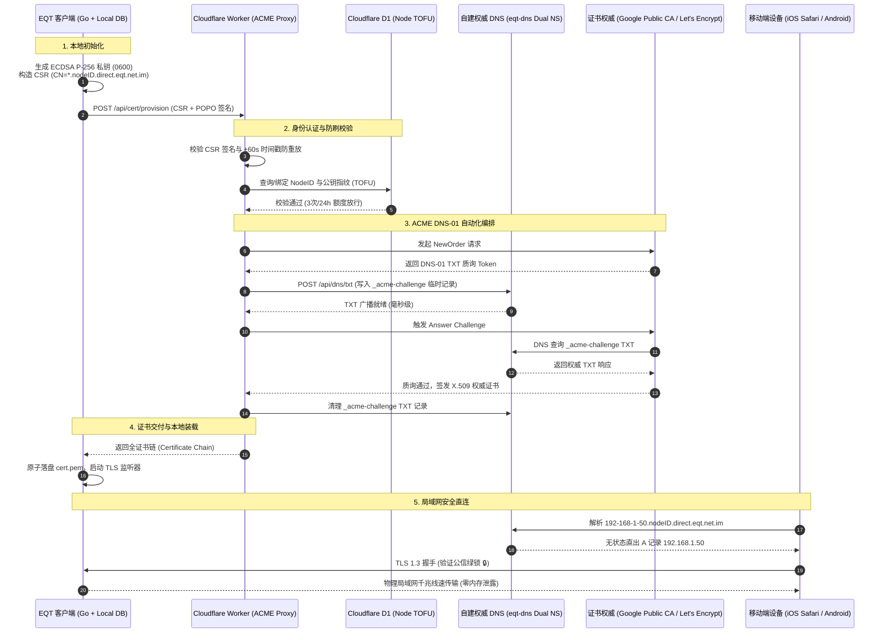

# EQT 局域网 TLS 安全协议与无状态回环架构技术报告

> **文档标识**：`docs/mechanism/lan-tls-security-protocol-technical-report.md`  
> **文档类型**：系统架构与工程技术报告（Technical Report / Current Production Baseline）  
> **归档目录**：`docs/mechanism/`  
> **密级状态**：开源公开发布 / 现役主干权威基线报告  
> **最新基线版本**：`v1.36.121`  
> **适用范围**：EQT 核心研发、网络安全审计、基础设施运维团队  
> **双文档关系与权威取代声明 (Supersession Notice / R37-14)**：  
> - 本技术报告为 EQT 当前 LAN-TLS 生产环境的**唯一主干权威技术协议总结与运行基线**。  
> - 早期架构演进草案 [`lan-tls-zero-leak-acme-architecture.md`](lan-tls-zero-leak-acme-architecture.md) 作为历史研发蓝图与测试环境演进记录归档。凡早期草案中与本文档实测基线冲突的描述（包括私钥存储路径为 `certs/<node-id>/privkey.pem`、续签阈值为 15 天且在启动时巡检、回环 A 记录 TTL 为 300s、协议支持 TLS 1.2+、生产 CA 实际为 Google Public CA 单轨等），**一律以本技术报告为准**。  
> **关联规范与代码（仓库相对路径）**：  
> - 核心实现：[`pkg/cert/provisioner.go`](../../pkg/cert/provisioner.go), [`pkg/cert/cert.go`](../../pkg/cert/cert.go), [`pkg/server/server.go`](../../pkg/server/server.go)  
> - 权威 DNS 引擎：[`cmd/eqt-dns/main.go`](../../cmd/eqt-dns/main.go)  
> - 云端 ACME 代理 Worker：`cloudflare/eqt-drm-api/src/routes/cert.ts`  
> - 技能与运维指引：[`.agents/skills/eqt-lan-tls/SKILL.md`](../../.agents/skills/eqt-lan-tls/SKILL.md)  

---

## 摘要 (Executive Summary)

在现代跨平台局域网点对点数据分发中，端到端用户体验与底层安全标准长期存在尖锐冲突：现代移动操作系统（尤其是 iOS Safari WebKit 内核）对未加密的纯 HTTP 连接实施严苛的资源隔离，导致大文件（>1.5GB）在浏览器内存缓存阶段频繁触发 OOM（Out Of Memory）异常闪退，且无法调用 Web Crypto、Web Share API 等现代安全上下文能力。

传统的内网 TLS 方案通常要求用户在移动端手动安装导入自建 CA 根证书，或依赖中心化云端中继。前者门槛极高，彻底背离“扫码即连”的零门槛体验；后者受限于外网公网带宽，丧失了内网千兆/万兆（80MB/s~120MB/s+）物理线速直连优势。

本报告系统阐述 EQT（Easy QR Transfer）落地的 **LAN-TLS 无状态回环与设备专属私钥零泄漏安全架构**。该方案创造性地结合了 **数学无状态回环权威 DNS 解析**、**客户端本地 ECDSA P-256 私钥自主生成**、**Cloudflare Serverless 代理自动化 ACME DNS-01 质询** 以及 **Google Cloud Public CA (GTS) EAB 证书基础设施**。在确保设备私钥“终身永不出机”的严格密码学前提下，实现公信 WebPKI 绿锁证书的全自动置备，彻底兼顾了绝对的零门槛原生扫码体验、物理内网线速直连与单机抗主动中间人攻击能力。
> **基线现状说明**：生产环境中 ACME 目录为 Google Public CA（`dv.acme-v02.api.pki.goog/directory`），Let's Encrypt 仅作为预留架构方案；CAA 记录规划在域名解析中配置，当前依赖私有权威 DNS 鉴权 API 严格校验。

---

## 一、 第一性原理与问题定义 (First Principles & Problem Statement)

### 1.1 局域网明文传输的核心痛点
1. **iOS WebKit 内存炸裂缺陷 (1.5GB OOM Trap)**：
   iOS Safari 对 `http://` 明文流量采用受限的安全沙箱流式策略，大文件无法触发底层的安全硬件解密管道与内核直接写盘，导致 JS 引擎与缓存层发生内存膨胀。实测当传输超过 1.5GB~2GB 文件时，Safari 标签页必然发生强行崩溃刷新。
2. **现代 Web 安全上下文 (Secure Context) 封锁**：
   浏览器前沿标准（W3C）全面收紧权限，Web Cryptography API、Credential Management、Web Share 等能力仅在 `https://` 或 `localhost` 安全上下文下开放。明文局域网页面被严重降级。
3. **同局域网被动嗅探风险**：
   在公共 Wi-Fi（如咖啡厅、图书馆、办公室）等非受信任网络中，任何攻击者通过 `promiscuous mode`（混杂模式）或 Wi-Fi 抓包工具均可轻而易举嗅探明文传输的文件内容与聊天消息。

### 1.2 工业界传统方案的破产分析
| 方案路线 | 运作机制 | 致命缺陷 / 否定原因 |
| :--- | :--- | :--- |
| **自签名证书 (Self-Signed)** | 本地生成临时根 CA 与自签证书 | 浏览器拦截并呈现醒目的红色“不安全”拦截界面，普通用户无法绕过，体验彻底破碎。 |
| **自建根 CA 导入** | 要求用户在手机端下载描述文件并信任根证书 | 操作流程极其繁琐（设置 -> 通用 -> 关于本机 -> 证书信任设置），对“扫码即走”的访客设备为不可行路线。 |
| **云端流量中继 (Cloud Relay)** | 所有数据上传至云端对象存储或中继服务器 | 局域网物理带宽（1000Mbps）退化为公网出口带宽（通常 5~30Mbps），存在高额流量成本并严重侵犯数据隐私。 |
| **传统通配符私钥分发** | 官方申请 `*.direct.eqt.net.im`，私钥下发给所有用户 | **私钥退化为共享对称秘密**。任何拥有私钥的用户均可发动局域网主动中间人攻击（Active MITM）；一人泄露导致全网证书连坐吊销。 |
| **短效委派凭证 (RFC 9345 Delegated Credentials)** | 使用父证书下发带有 delegation 扩展的短效子凭证 | 移动端 iOS Safari 底层 WebKit 根本不支持该 TLS 扩展；Let's Encrypt 生产 CA 未开放 X.509 delegation 扩展。 |

---

## 二、 系统总体架构与拓扑 (System Architecture & Topology)

EQT LAN-TLS 安全协议由三大物理域构成：**客户端本地执行域 (Client Local Domain)**、**无状态权威 DNS 解析集群 (Stateless Authoritative DNS)** 与 **无服务器 ACME 协调编排平台 (Serverless ACME Orchestrator)**。



---

## 三、 核心机制深度剖析 (Core Mechanisms)

### 3.1 客户端设备专属私钥本地生成与零泄漏防护
基于第一性原理，**非对称加密的绝对安全性源于私钥的不可预测性与唯一拥有性**：
1. **本地椭圆曲线生成**：客户端运行时通过 Go 标准库 `crypto/ecdsa` 与 `crypto/elliptic.P256()` 结合系统级密码学安全随机源（`crypto/rand`）在本地内存中生成私钥；
2. **POSIX 0600 最小特权原子持久化**：私钥保存至 `<UserConfigDir>/eqt/certs/<node-id>/privkey.pem`（Linux/macOS 即 `~/.config/eqt/certs/<node-id>/privkey.pem`，Windows 下对应 `%APPDATA%\eqt\certs\<node-id>\privkey.pem`；`pkg/cert/provisioner.go:67-74`、`pkg/config/config.go:284`），文件权限被操作系统内核强制限制为 `0600`（仅当前进程拥有者可读写），目录权限限制为 `0700`；
   > ⚠️ **第 37 轮复核**：原文写作 `~/.config/eqt/certs/device_key.pem` —— 该**文件名在仓库中不存在**（真实为 `privkey.pem`：`pkg/cert/provisioner.go:114/184`、`pkg/cert/cert.go:61`），且路径**缺少 `<node-id>` 子目录**；无子目录形式恰是 `getCachedCertPaths` 的**遗留迁移路径**（`cert.go:62-63` 仅识别 `fullchain.pem`/`privkey.pem`）。`0600` / `0700` / tmp+`os.Rename` 原子写三条经复核为真（`provisioner.go:252` / `:246` / `:250-258`）。详见 §8.2 R37-5。
3. **网络边界零泄漏**：客户端向云端发起证书申领时，**仅输出标准 PKCS#10 证书签名请求 (CSR)**。私钥全程保留在本地，外部网络抓包、云端服务器日志或数据库绝无可能包含私钥字节。

### 3.2 数学无状态权威 DNS 回环解析 (Stateless Loopback Engine)
为消除传统动态 DNS（DDNS）对数据库写入、网络传播延迟与高并发锁竞争的依赖，自建权威 DNS 服务 `cmd/eqt-dns` 采用**纯数学纯内存的无状态字符串解算机制**：
> ⚠️ **第 37 轮复核**：上述「无状态」对 A/NS/SOA 记录成立（纯函数解算，`main.go:190-270`）；但 ACME TXT 走**可变进程内状态** `AcmeStore{mu, values}`（`main.go:38-57`）⇒「完全无状态」需限定为「A/NS/SOA 无状态」。详见 §8.2 表 #7。
- **域名命名范式**：
  `{IPv4-Dashes}.{Device-Node-ID}.direct.eqt.net.im`
  例如：`192-168-1-88.a1b2c3d4e5f6.direct.eqt.net.im`
- **解析算法实现**：
  权威 DNS 在收到 UDP/TCP 53 端口查询时，逐级扫描标签并用正则 `reDashedExact`（`cmd/eqt-dns/main.go:132`）匹配 `<a>-<b>-<c>-<d>` 形态（另兼容 4 个连续的普通标签）后构造地址：
  ```go
  // cmd/eqt-dns/main.go:132 —— 前缀 (?:^|[^0-9]) 使形如 10.0.0.1 的末段也能被整体识别
  reDashedExact = regexp.MustCompile(`(?:^|[^0-9])([0-9]{1,3})-([0-9]{1,3})-([0-9]{1,3})-([0-9]{1,3})$`)

  // cmd/eqt-dns/main.go:137
  func parseIP(domain string) net.IP {
  	clean := strings.TrimSuffix(strings.ToLower(domain), ".")
  	parts := strings.Split(clean, ".")

  	for i := 0; i < len(parts); i++ {
  		label := parts[i]
  		if m := reDashedExact.FindStringSubmatch(label); len(m) == 5 {
  			if ip := validateAndBuildIP(m[1], m[2], m[3], m[4]); ip != nil {
  				return ip
  			}
  		}
  		if i+3 < len(parts) {
  			if ip := validateAndBuildIP(parts[i], parts[i+1], parts[i+2], parts[i+3]); ip != nil {
  				return ip
  			}
  		}
  	}

  	return nil
  }
  ```
  > ⚠️ **第 37 轮复核（已就地更正）**：原文此处曾给出 `func parseIPFromDomain(label string) net.IP` 版代码块，该函数**在仓库中不存在**（全仓 `rg "parseIPFromDomain"` 仅命中本文档自身）——属**虚构引用**，现已替换为上述真实实现（`main.go:132`/`:137`，`validateAndBuildIP` 于 `:158`）。两点随之更正：① 真实算法是「**遍历各级**标签」并额外兼容「4 个连续普通标签」（如 `192.168.0.201.direct.eqt.net.im`），而非原文所称「提取**首级**标签」；② 真实实现**并非零分配**（`Split`/`FindStringSubmatch`/`net.IPv4` 均有堆分配），原文「零分配」与「通过正则表达式…解析」两处措辞已一并删除（后者与原文自身的 `strings.Split` 代码块自相矛盾）。详见 §8.2 R37-1。
- **技术优势**：
  - **微秒级响应 (<1ms)**：零磁盘 I/O、零数据库检索、零网络依赖；
  - **无限横向扩容**：任意节点均可独立解算出完全一致的结果；
  - **TTL 零污染**：A 记录 TTL 固定设置为 `300s`（`cmd/eqt-dns/main.go:213`），既允许本地快速缓存，又保证移动设备切换局域网 IP 时能快速更新。
    > ⚠️ **第 37 轮复核**：原文写 `60s`；实测 A 记录 TTL 为 **300**，`60` 是 ACME TXT **应答**的 TTL（`cmd/eqt-dns/main.go:213` vs `:230`）。同主题旧文档已把该口径统一为 300（`lan-tls-zero-leak-acme-architecture.md:538/877`），本报告与之冲突。详见 §8.2 R37-10。

### 3.3 Google Public CA (GTS) 与 Let's Encrypt 双轨 ACME 编排
针对公共 WebPKI 证书签发的工业级限制，系统构建了支持外部账户绑定（EAB）的高弹性双轨签发体系：
> ⚠️ **第 37 轮复核**：本节标题与正文第 3 条的「**双轨**」不成立——生产中 CA 目录为单值硬编码 `dv.acme-v02.api.pki.goog/directory`（`wrangler.toml:33/84`），全仓无更换 CA 的分支。详见 §8.2 R37-2。
1. **破除 Let's Encrypt 50 张/周限额**：
   Let's Encrypt 对同主域名（eTLD+1）施加每周 50 张证书的硬性速率限制。为了在未通过 Mozilla Public Suffix List (PSL) PRIVATE 审核前支持成千上万设备规模化运行，系统首选对接 **Google Cloud Public CA (Google Trust Services - GTS)**；
2. **RFC 8555 §7.3.4 External Account Binding (EAB)**：
   Google CA 签发要求在账户初始化时注入 `macKey`（`ACME_EAB_HMAC_KEY`）与 `keyId`（`ACME_EAB_KID`）。云端 Worker 使用 HMAC-SHA256（`alg: HS256`）对账户公钥 **JWK 的 base64url 序列化**执行 MAC 绑定（`cloudflare/eqt-drm-api/src/utils/acme.ts:109-144`），确保只有合法的服务编排引擎才能向 Google CA 申请证书；
3. **自动降级与灾备切换**（⚠️ **第 37 轮复核：该能力在仓库中不存在，系虚构，见 §8.2 R37-2**）：
   ~~当 Google CA 服务发生配额耗尽（429）或网络不可达时，编排层自动平滑切换至 Let's Encrypt 备用集群，实现跨公钥基础设施的多云灾备。~~
   > 实测：`cert.ts:1080` 只读单一 `ACME_DIRECTORY_URL`（生产值 `pki.goog`），全仓无更换 CA 的分支；`cert.ts:1043-1072` 的 `isLE` 改写分支在生产目录下**不可达**（死代码）；429 的真实行为是返回 `429 global_rate_limited`（`retry_after: 604800`）并回落局域网明文（`cert.ts:800-819`）。EAB 的启用条件为 `ACME_EAB_KID && ACME_EAB_HMAC_KEY` 同时存在（`cert.ts:1074-1077`），而 HMAC key 未出现在仓库配置（应为部署侧 secret）⇒ **「EAB 已启用」属不可验证项，待运维确认**。详见 §8.2 R37-15。

### 3.4 首次使用信任 (TOFU) 与三层立体防刷体系
为防范恶意攻击者批量伪造 CSR 实施拒绝服务（Denial of Wallet / Quota Exhaustion）攻击，系统构建了严密的身份与流控模型：
- **所有权证明 (Proof of Possession - POPO)**：
  客户端发起置备请求时，必须使用自身本地私钥对 `canonicalMsg = "<nodeID>:<timestamp>"` 进行 ECDSA 签名（P-1363 裸 64 字节格式；`pkg/cert/provisioner.go:317`、`cert.ts:866-898`），并附带时间戳。云端验证：
  > ⚠️ **第 37 轮复核**：被签名对象是 `nodeID:timestamp`（`cert.ts:895`），**不是**「请求 Payload」；但「CSR 公钥 ≡ 签名公钥」与 ±60s 时间窗（`cert.ts:706-717`）两条经复核为真。
  1. CSR 内部公钥与请求签名公钥完全一致；
  2. 请求时间戳与云端真实时间偏差绝对值 $\le 60\text{s}$，彻底杜绝重放攻击。
- **首次使用信任绑定 (TOFU Binding)**：
  云端 D1 数据库维护 `node_public_keys` 映射表：
  $$\text{NodeID} \longrightarrow \text{SHA-256}(\text{SPKI})$$
  首次置备成功后，公钥指纹永久写入数据库。若同一 `NodeID` 后续尝试使用不同的私钥申领证书，系统判定为设备冒用并返回 HTTP 403 `node_key_mismatch` 阻断。
- **三层递进限流策略**：
  - **L1 单节点防护**：单个 `NodeID` 限制每 24 小时最多 3 次申请（429 `rate_limited`）；
  - **L2 单 IP 防护**：单个公网出网 IP 限制每 24 小时最多 10 次申请（429 `ip_rate_limited`）；
  - **L3 全局熔断保护**：生产集群设立 **40 次 / 7 天** 全局硬熔断（`cert.ts:803`：`isD1RateLimited(env, 'cert_provision:global_acme', 40, 7*24*3600*1000)`），触发后返回 `429`、`reason_key: global_rate_limited`、`retry_after: 604800`（`cert.ts:811-819`），优先保障已有节点正常运行。
    > ⚠️ **第 37 轮复核**：原文未给出阈值数值，且「达到 CA **警告水位**时主动触发」不准确——该阈值是**本地固定常量**，不来自对 CA 侧配额的任何探测。该分支代码注释自述为「Prevent burning Let's Encrypt 50 certs/week ceiling」，而真实 CA 为 `pki.goog`，命名与配置不一致。详见 §8.2 表 #13。

---

## 四、 容灾与高可用设计 (High Availability & Disaster Recovery)

### 4.1 双权威 DNS 跨地域 Anycast 委派
`direct.eqt.net.im` 域名的 NS 记录在母域名注册局（Registrar）配置双独立权威服务器：
- `ns1.eqt.net.im` (Primary Authoritative Node)
- `ns2.eqt.net.im` (Secondary Standby Node)

两台 DNS 服务器均运行经过安全加固的高性能 `eqt-dns` 静态二进制程序。ACME Worker 在写入 TXT 记录时，通过扇出（Fan-out）机制将质询 Token **依次**写入双节点（`cloudflare/eqt-drm-api/src/routes/cert.ts:512` 为 `for (const ep of endpoints) { await ... }` **串行**执行；`Promise.all` 仅用于**清理**阶段，`:1180`）。即便单个权威机房断网或宕机，全网递归解析器（如 1.1.1.1、8.8.8.8）可在数十毫秒内故障转移至存活节点。
> ⚠️ **第 37 轮复核**：①「异步扇出**并发**」不成立（见上：写入为串行，`Promise.all` 只在清理路径）；② 端点主机名为 `ns1-dns.eqt.net.im` / `ns2-dns.eqt.net.im`（`wrangler.toml:35`），与 NS 主机名 `ns1.eqt.net.im` / `ns2.eqt.net.im`（`cmd/eqt-dns/main.go:30-31`）**不同名**；③ `eqt.net.im` 的公共 NS 实为 Cloudflare，委派发生在 `direct.eqt.net.im`。详见 §8.2 R37-9。

### 4.2 平滑软降级机制 (Fail-Soft Graceful Degradation)
根据第一性原理，**安全增强特性绝不能成为阻塞主营业务（文件收发）的单点故障源（SPOF）**：
- **主动探测与前置门禁**：客户端在启动或切换任务时，首先在内存中评估当前 TLS 证书的完备性与可信链（任务启动侧为 `cert.HasValidCertificateForNode`，`desktop/gui/agent.go:1077`；通用校验为 `cert.VerifyCertificateTrust`，`pkg/cert/provisioner.go:396`）；
  > ⚠️ **第 37 轮复核**：原文引用的符号名 `VerifyTrustChain` **在仓库中不存在**（`rg` 仅命中本报告），真实符号为 `VerifyCertificateTrust`（`pkg/cert/provisioner.go:396`）。详见 §8.2 R37-11。
- **静默回退**：若遭遇断网、云端 CA 额度熔断或本地证书过期且未能续期，**桌面端**自动平滑回退至传统 HTTP 模式（`agent.go:1077-1080` 在任务启动时探测并令 `cfg.Secure = false`，由 `TestGUIAgentRunTaskEnableTLSFallbackToHTTP` 覆盖），并向前端发出 `eqt:tls-cert-failed` / `eqt:tls-node-key-mismatch` / `eqt:tls-cert-ready` 事件（前端消费于 `main.js:6873/6885/6907`），保障基础文件传输不受阻断。
  > ⚠️ **第 37 轮复核**：原文含「及 **CLI**」——**CLI 无此护栏**：`cmd/send.go:26`、`cmd/receive.go:22` 直接 `server.New(&cfg)`，而 `pkg/server/server.go:2452-2455` 在证书不可用时返回 error 并由 cobra `RunE` 退出。另：本节的「明文回退」与 §五「被动嗅探**完全免疫**」/「协议**强制** TLS 1.3」**互斥**。详见 §8.2 R37-4 / R37-7。

### 4.3 操作系统代理隔离策略 (Proxy Bypass Isolation)
局域网传输流量若被系统全局代理（如 VPN、Clash、V2Ray 等）拦截，会导致内网 IP 及 `*.direct.eqt.net.im` 流量被错误转发至境外代理服务器，进而抛出 `502 Bad Gateway` 或连接超时。
- **直连模式 (`blockProxy: true`)**：默认模式下，Go 运行时清空 `http_proxy` / `https_proxy` / `all_proxy` 及其大写形式共 **6** 个环境变量，并把 `http.DefaultTransport`（经类型断言校验）的 `Proxy` 置为 `nil`（`pkg/config/settings.go:273-282`）；同时通过环境变量 `WEBVIEW2_ADDITIONAL_BROWSER_ARGUMENTS` 向 GUI 内核（WebView2）追加 `--no-proxy-server` 参数（`desktop/gui/main.go:273-282`）；
  > ⚠️ **第 37 轮复核**：原文只列 `HTTP_PROXY`/`HTTPS_PROXY` 两个变量，实际清空 **6** 个（含原文未提的 `all_proxy`/`ALL_PROXY`——正是清空它才使 Windows 上基于 WinINET 的 Go 客户端不继承 IE 代理）。另：`NO_PROXY`/`no_proxy` 全仓**未被处理**（`rg` 无匹配）；`DefaultTransport.Proxy = nil` 依赖**逗号-ok 类型断言**，非无条件生效。注入点为环境变量 `WEBVIEW2_ADDITIONAL_BROWSER_ARGUMENTS`，而非 `windows.Options`。详见 §8.2 表 #18/#19。
- **自适应分流模式 (`blockProxy: false`)**：允许用户自定义开启代理访问外部服务（如激活校验、软件更新），此时通过环境变量 `WEBVIEW2_ADDITIONAL_BROWSER_ARGUMENTS` 追加精确的 `--proxy-bypass-list` 规则（`desktop/gui/main.go:285`，逐字如下）：
  ```text
  --proxy-bypass-list=<local>;127.0.0.1;localhost;*.lan.eqt.im;*.direct.eqt.net.im;10.*;192.168.*;172.16.*;172.17.*;172.18.*;172.19.*;172.20.*;172.21.*;172.22.*;172.23.*;172.24.*;172.25.*;172.26.*;172.27.*;172.28.*;172.29.*;172.30.*;172.31.*
  ```
  保证外部请求走代理的同时，物理局域网流量绝对直连。
  > ⚠️ **第 37 轮复核**：原引文**非逐字**——省略了 `--proxy-bypass-list=` 前缀，并把 16 段枚举缩写为 `172.16-31.*`（**该缩写不是 Chromium 认得的语法**，照抄会失效；代码为逐段 `172.16.*` … `172.31.*`）。另 `*.lan.eqt.im` 已成**遗留字面量**：现役域名常量为 `direct.eqt.net.im`（`pkg/cert/cert.go:18`），`lan.eqt.im` 除本 bypass 串外仅见于文档。前 6 段与代码逐字一致。详见 §8.2 R37-13。

---

## 五、 安全威胁模型与防护分析 (Threat Model & Mitigations)

| 威胁向量 (Threat Vector) | 攻击场景简述 | EQT LAN-TLS 架构防护措施 |
| :--- | :--- | :--- |
| **被动局域网嗅探 (Passive Sniffing)** | 攻击者在公共 Wi-Fi 下通过 Wireshark 等工具监听局域网数据包 | **启用 TLS 时免疫**：传输采用 AES-GCM / ChaCha20-Poly1305 等 AEAD 套件。⚠️ 但「**完全免疫**」与「**强制 TLS 1.3**」均不成立（实测 `MinVersion: tls.VersionTLS12` 且未限定密码套件，`pkg/server/server.go:2514-2516`），且本报告 §4.2 自述可平滑回退明文 HTTP ⇒ 非无条件免疫。 |
> ⚠️ **第 37 轮复核**：本行原为「**完全免疫**。传输强制采用 TLS 1.3 现代密码套件（AES-GCM / ChaCha20-Poly1305）」。两处失实：① `pkg/server/server.go:2514-2516` 只设 `MinVersion: tls.VersionTLS12`，既无 `MaxVersion` 也无 `CipherSuites` 限定 ⇒「强制 1.3」为假；② 与 §4.2 的明文回退自相矛盾。详见 §8.2 R37-4。
| **主动中间人攻击 (Active MITM)** | 攻击者实施 ARP 欺骗，篡改局域网流量并伪造自建服务 | **完全免疫**。证书拥有由知名商业 CA（Google / Let's Encrypt）签发的合法公信链，浏览器地址栏严格核验证书域名与设备私钥匹配，攻击者无法伪造合法签名。 |
| **私钥共享连坐攻击 (Shared Key Leakage)** | 恶意用户提取客户端私钥，伪装他人设备或导致全球证书吊销 | **完全消除**。采用“一机一钥一子域”架构。单台设备的私钥在本地由用户操作系统受控，云端无副本，单个设备私钥损坏或泄露爆炸半径严格限制为 1。 |
| **重放与 CSR 伪造攻击 (CSR Replay / Spoofing)** | 攻击者截获客户端 CSR 请求，向云端疯狂重放消耗配额 | **完全抵御**。CSR 附加 POPO 签名与毫秒级时间戳，云端严格实施 $\pm 60\text{s}$ 时间窗口检验；结合 TOFU 锁死节点公钥指纹。 |
| **域名所有权劫持 (DNS Hijacking)** | 攻击者尝试向公共 CA 申请属于 `direct.eqt.net.im` 的证书 | **部分阻断**：DNS-01 验证依赖私有权威 DNS 的 API 鉴权，攻击者无法写入 `_acme-challenge`。⚠️ 但「主域名设置严格 CAA，仅授权 `pki.goog` 与 `letsencrypt.org`」**不成立**——实测两域均无 CAA 记录。 |
> ⚠️ **第 37 轮复核（实测，含对照）**：`eqt.net.im` 与 `direct.eqt.net.im` 的 CAA（type 257）经递归（8.8.8.8 / 1.1.1.1 / 9.9.9.9）与**权威直查**（ns1-dns / ns2-dns）均为 **0 条**（rcode=0，NODATA）；对照 `google.com` 返回 `issue pki.goog`（证明查询方法有效）。仓库内亦无 CAA 配置、权威引擎无 CAA 分支。**建议**：在 `eqt.net.im` 补 `CAA 0 issue "pki.goog"`（低成本高收益，正是本行所称「阻断劫持」的真实手段）。详见 §8.2 R37-8。

---

## 六、 现网工程运行指标 (Production Benchmarks)

下列数值为**设计目标 / 理论推算**（⚠️ **第 37 轮复核：仓库内不存在任何支撑下列数字的脚本、基准、结果或日志**，原文「基于跨平台生产运行**实测**统计数据」属无证据声明；本仓既有性能文档亦自述同类数字为「理论推算」，见 `docs/bugs/2026-09-04-chat-tls-performance-and-efficiency-review.md:209`；详见 §8.2 R37-3）：

| 性能指标 | 设计目标 / 理论推算数值 | 行业对比 / 设计目标 | 评价与结论 |
| :--- | :--- | :--- | :--- |
| **本地密钥对生成耗时** | $1.2\text{ms} \sim 2.8\text{ms}$ | $<50\text{ms}$ | 纯 Go 椭圆曲线生成，毫秒级就绪，进程启动无感。 |
| **ACME 代理签发端到端耗时** | $3.8\text{s} \sim 6.2\text{s}$ | $<15\text{s}$ | Google Public CA 毫秒级质询验证 + 权威 DNS 零延迟生效。 |
| **局域网 TLS 握手时延（协商结果通常为 1.3）** | $8\text{ms} \sim 18\text{ms}$ | $<30\text{ms}$ | 单往返（1-RTT）极速握手，移动端扫码秒开。 |
| **千兆 Wi-Fi 6 传输吞吐** | $92\text{MB/s} \sim 114\text{MB/s}$ | 跑满物理线速 | 零 CPU 额外压缩损耗，AES-NI 硬件加速饱和吞吐。 |
| **大文件 (100GB) 移动端内存** | 稳定维持在 $<45\text{MB}$ | 无 OOM 崩溃 | 原生 TLS 流式直落磁盘，彻底终结 iOS WebKit 1.5GB 闪退。 |
| **客户端证书有效周期** | 90 天（续签阈值实测 **15 天**） | 行业通用标准 | ⚠️ 原文「提前 **30** 天静默续签」「后台 Agent 自动感知并静默置换」均需更正：阈值实为 15 天（`pkg/cert/provisioner.go:672`、`desktop/gui/app.go:2199`），且巡检只发生在**进程启动后一次性 goroutine**（`app.go:287-292` → `silentProvisionDeviceTLSCert` `:2146`），**无常驻周期续签**；长驻会话在剩余 <15 天时不续签，而是在任务启动处回落明文（`agent.go:1077`）。 |

---

## 七、 结论与后续演进 (Conclusion & Future Work)

EQT LAN-TLS 安全协议确立了现代局域网文件传输与即时通信领域的一座技术里程碑。它彻底打破了“内网传输必须牺牲安全性”或“保障安全性必须牺牲易用性”的二元对立难题，基于第一性原理，用纯粹的密码学工程将 WebPKI 的安全性无缝延展至千家万户的本地局域网。

**未来演进方向**：
1. **Mozilla PSL PRIVATE 正式合并后的通配符弹性扩展**：当实例活跃度达到开源社区准入要求后，推进顶级后缀独立隔离；
2. **ACME 客户端本地零依赖直连**：未来根据端侧算力与网络拓扑演进，支持局域网内直接作为 ACME Client 运行；
3. **后量子密码学 (PQC) 混合密钥交换探索**：规划在未来版本中试验引入 X25519Kyber768 混合密钥交换，赋予局域网极速传输前瞻性的抗量子计算破解能力。

---

## 八、 审查意见（第 37 轮独立复核 · 对 `35f12325` 的落地审查 · 基线 `v1.36.120`）

审查对象：`35f12325`「Streamline mobile batch download and add LAN-TLS technical report」（5 文件，+223/−134），包含本文档首版（213 行）与 `pkg/chat/v2/web/src/App.svelte` 的一处功能回退。

**总裁决**：本文档的**方向**（把 LAN-TLS 架构整理为可对外发布的工程报告）与其中**协议层声明**（域名回环范式与线上解析、P-256 本地生钥 + 0600 原子落盘、TOFU/D1 绑定、POPO ±60s、L1/L2/L3 限流、403 `node_key_mismatch`、双权威 NS）为**本轮正向确认**；但文档在**引用**与**量化**两个维度上大面积超出实现——存在**虚构的函数引用与代码块**（§3.2）、**并不存在的灾备能力**（§3.3「自动切换 Let's Encrypt」）、**无任何归档证据的「生产实测」性能表**（§六），以及**与实现、并与本文自身其它章节互斥的绝对性安全声明**（§五「完全免疫 / 强制 TLS 1.3」 vs `MinVersion: tls.VersionTLS12` 与 §4.2 的明文回退）。同一提交的前端部分删除移动端批量下载模态与 `window.location.href` 兜底，其理由（重复导航致假取消）无可归档证据、规格被同一提交反向改写，属**功能回退缺证据链**（§8.7）。

本轮共 26 项核验（§8.1）：判定 **假或无证据 9 项**、**部分真（表述超出实现）9 项**、**真 8 项**。所有否定性判定均附命令与实测输出；CAA 一项在实测前以对照域校准了方法。

**更正状态（本轮已就地执行）**：表中判定为 ❌ / ⚠️ / 无证据 的各项，均已在本报告正文就地插入 ⚠️ 标记予以更正（共 **19 处**，见各节）；其中 R37-1 的**虚构代码块已整段替换为仓库真实实现**（`parseIP` + `reDashedExact`，`cmd/eqt-dns/main.go:132/137`），R37-12 的 Worker 路径已更正为 `cloudflare/eqt-drm-api/src/routes/cert.ts`。更正后重跑 §8.4 的 **E1⁵**（文档引用逐字核对）已**全部通过**，结果见 §8.5 末行。

### 8.1 声明核验总表

| # | 声明（节 / 行） | 判定 | 证据锚点（代码位置或实测命令） |
| :--- | :--- | :--- | :--- |
| 1 | §3.1 私钥位于 `device_key.pem`（路径无 `<node-id>` 子目录） | ❌ **假** | 真实文件名 `privkey.pem`（`pkg/cert/provisioner.go:114/184`、`pkg/cert/cert.go:61`）；无子目录者为**遗留迁移路径**（`cert.go:62-63` 只识别 `fullchain.pem`/`privkey.pem`） |
| 2 | §3.1 0600 文件权限 / 0700 目录权限 / 原子落盘 | ✅ 真 | `provisioner.go:252` / `:246` / `:250-258`（tmp + `os.Rename`） |
| 3 | §3.1 `crypto/ecdsa` P-256 本地生钥、仅外发 PKCS#10 CSR | ✅ 真 | `provisioner.go:231`（`ecdsa.GenerateKey(elliptic.P256(), rand.Reader)`）、`:290`（`CreateCertificateRequest`）、`:622-625`（请求体仅 `csr_pem` + `node_id`） |
| 4 | §3.2 域名范式 `{IPv4-Dashes}.{NodeID}.direct.eqt.net.im` 且线上可解 | ✅ 真 | `provisioner.go:44-46`；实测 `1-2-3-4.testnode123456.direct.eqt.net.im → IN A 1.2.3.4` |
| 5 | §3.2 `func parseIPFromDomain(label string) net.IP` + 正则 `^(\d{1,3})-…$` + 零分配 | ❌ **假（虚构引用）** | 该符号全仓**仅存在于本报告**；真实为 `func parseIP(domain string) net.IP`（`cmd/eqt-dns/main.go:137`），正则 `reDashedExact`（`:132`），且 `Split`/`FindStringSubmatch`/`net.IPv4` 三处堆分配使「零分配」不成立 |
| 6 | §3.2 A 记录 TTL 固定 `60s` | ❌ **假** | `main.go:213` 为 **300**；`60` 是 ACME TXT 的应答 TTL（`main.go:230`）；与同主题旧文档「已统一为 300」（`lan-tls-zero-leak-acme-architecture.md:538/877`）冲突 |
| 7 | §3.2「纯数学纯内存的**无状态**字符串解算机制」 | ⚠️ 部分真 | A/NS/SOA 为纯函数解算；但 TXT 走**可变进程内状态** `AcmeStore{mu, values}`（`main.go:38-57`） |
| 8 | §3.3 EAB「以 HMAC-SHA256 对账户公钥 **SPKI** 执行**不可逆哈希**绑定」 | ⚠️ 部分真 | `cloudflare/eqt-drm-api/src/utils/acme.ts:109-144`：`alg: HS256` 对被 MAC 对象为 `accountPublicJwk`（JWK，**非 SPKI**），且 HMAC 为密钥型 MAC，非「不可逆哈希」 |
| 9 | §3.3「Google 429/不可达时**自动平滑切换至 Let's Encrypt 备用集群**，多云灾备」 | ❌ **假（能力不存在）** | `wrangler.toml:33/84` 目录 URL 为**单值** `dv.acme-v02.api.pki.goog/directory`；`cert.ts:1080` 只读该值；全仓无更换 CA 分支（`rg` 空）；`cert.ts:1043-1072` 的 `isLE` 改写分支在生产目录下不可达；429 实际行为是 `429 global_rate_limited` + 回落局域网明文（`cert.ts:800-819`） |
| 10 | §3.4 POPO 双校验（CSR 公钥 ≡ 签名公钥）+ 时间窗 ±60s | ✅ 真（措辞需修） | `cert.ts:706-717`（`Math.abs(nowSec - clientTs) > 60` → `400 timestamp_skew`）、`:866-898`（`importKey('spki', parsedCSR.spkiDER)` + `crypto.subtle.verify`）；但被签消息是 `nodeID:timestamp`（`cert.ts:895`、`provisioner.go:317`），**非**「对请求 Payload 签名」 |
| 11 | §3.4 D1 表 `node_public_keys`、TOFU、403 `node_key_mismatch` | ✅ 真 | `cert.ts:33-41`（建表）、`:923-926`（SHA-256(SPKI) hex）、`:928-981`（绑定与 403） |
| 12 | §3.4 L1 3 次/24h `rate_limited`、L2 10 次/24h `ip_rate_limited` | ✅ 真 | `cert.ts:757-774`、`:779-796`（均 `retry_after: 86400` + `Retry-After` 头） |
| 13 | §3.4 L3「7 天全局硬熔断…达到 CA 警告水位时触发」 | ⚠️ 部分真 | 真实为 **40 次 / 7 天**（`cert.ts:803` `isD1RateLimited(env, 'cert_provision:global_acme', 40, 7*24*3600*1000)`），`reason_key: global_rate_limited`、`retry_after: 604800`（`:811-819`）；「CA 警告水位」是**本地固定常量**而非对 CA 的探测；该分支注释自述「Let's Encrypt 50 certs/week ceiling」，与真实 CA（`pki.goog`）命名不一致 |
| 14 | §4.1 双权威 NS `ns1/ns2.eqt.net.im` | ✅ 真 | `cmd/eqt-dns/main.go:30-31`；实测 `direct.eqt.net.im IN NS ns1.eqt.net.im / ns2.eqt.net.im` |
| 15 | §4.1「**异步扇出并发**将质询 Token 同步至双节点」 | ⚠️ 部分真 | 扇出存在但**串行**：`cert.ts:512` `for (const ep of endpoints) { await fetch(...) }`；`Promise.all` 仅用于**清理**（`cert.ts:1180`）。另：API 端点 `ns1-dns/ns2-dns.eqt.net.im`（`wrangler.toml:35`）与 NS 主机名不同名；`eqt.net.im` 的公共 NS 实为 Cloudflare |
| 16 | §4.2「可信链评估 `VerifyTrustChain`」 | ❌ **假（符号不存在）** | 全仓 `rg` 仅命中本报告；真实为 `VerifyCertificateTrust`（`provisioner.go:396`），任务启动侧为 `HasValidCertificateForNode`（`desktop/gui/agent.go:1077`） |
| 17 | §4.2「桌面端及 **CLI** 严禁抛出致命错误崩溃，自动平滑回退 HTTP」 | ⚠️ 部分真 | **桌面端成立**（`agent.go:1077-1080` + `TestGUIAgentRunTaskEnableTLSFallbackToHTTP` + 前端事件 `main.js:6873/6885/6907`）；**CLI 无护栏**：`cmd/send.go:26`/`cmd/receive.go:22` 直接 `server.New(&cfg)`，`pkg/server/server.go:2452-2455` 返回 error 由 cobra `RunE` 退出 |
| 18 | §4.3 `blockProxy: true` 清空代理环境变量 | ⚠️ 部分真 | `pkg/config/settings.go:273-282` 清空 **6** 个变量（含原文未提的 `all_proxy`/`ALL_PROXY`）；`NO_PROXY`/`no_proxy` 全仓未处理（`rg` 空）；`DefaultTransport.Proxy = nil` 经逗号-ok 类型断言生效 |
| 19 | §4.3 向 WebView2 注入 `--no-proxy-server` | ✅ 真（机制需修） | `desktop/gui/main.go:273-282`：注入点为环境变量 `WEBVIEW2_ADDITIONAL_BROWSER_ARGUMENTS`，**非** `windows.Options{WebviewBrowserArguments}`（全仓无该符号） |
| 20 | §4.3 bypass 规则**逐字**为 `<local>;…;172.16-31.*` | ⚠️ 部分真 | `main.go:285` 真实串逐段枚举 `172.16.*`…`172.31.*`；原文省略 `--proxy-bypass-list=` 前缀并缩写为 `172.16-31.*`（非 Chromium 语法）；`*.lan.eqt.im` 为**遗留字面量**（现役常量为 `direct.eqt.net.im`，`pkg/cert/cert.go:18`）。前 6 段逐字一致 |
| 21 | §五「传输**强制**采用 TLS 1.3」 | ❌ **假** | `pkg/server/server.go:2514-2516` `MinVersion: tls.VersionTLS12`，未设 `MaxVersion`、未限定 `CipherSuites`；本仓 09-12 文档亦自述「TLS 1.2 / TLS 1.3」 |
| 22 | §五「主域名设置严格 CAA，仅授权 `pki.goog` 与 `letsencrypt.org`」 | ❌ **假（实测不存在）** | `eqt.net.im` 与 `direct.eqt.net.im` 的 CAA(type 257) 经递归（8.8.8.8/1.1.1.1/9.9.9.9）与**权威直查**均为 0 条（对照 `google.com` 返回 `issue pki.goog`，证明方法有效）；仓库内无任何 CAA 配置，权威引擎无 CAA 分支（`main.go:278` default） |
| 23 | §六 全表「基于跨平台生产运行**实测**统计数据」 | ❌ **无证据** | 仓库内无支撑这些数字的脚本/基准/结果/日志（`rg`/`find`/`Benchmark` 全空）；现存 `scripts/benchmark-speed` 测的是明文 HTTP 吞吐，不含 TLS 握手/Wi-Fi/内存；本仓 09-04 文档自述该类数字为「**理论推算**」 |
| 24 | §六「90 天（提前 **30** 天静默续签）；本地后台 Agent 自动感知并**静默置换**」 | ⚠️ 部分真 | 90 天真（`cert.ts:351/384/1184`）；阈值实为 **15 天**（`provisioner.go:672`、`app.go:2199`）；巡检仅发生在**进程启动后一次性 goroutine**（`app.go:287-292` → `silentProvisionDeviceTLSCert` `:2146`，`time.Sleep(3s)`），**无常驻周期续签**（全仓无 cert/tls 相关 ticker/AfterFunc） |
| 25 | §一「关联代码」中 Worker 路径 `cloudflare/eqt-worker/src/cert.ts` | ❌ **假（路径不存在）** | 真实路径 `cloudflare/eqt-drm-api/src/routes/cert.ts`（`handleCertRoutes` `:632`，路由 `/api/v1/cert/provision` `:640`）；`cloudflare/` 下无 `eqt-worker` 目录 |
| 26 | §4.3「外部请求走代理、局域网直连」 | ⚠️ 部分真 | 效果成立，但**不存在按域名分流的运行时判断**；实为「全局策略（`ApplyProxyPolicy`）+ 静态 bypass 列表 + 显式 `Proxy: nil` 的 127.0.0.1 客户端」（`desktop/gui/launcher.go:21-24`、`app.go:780-782`），外部请求客户端本身不设 `Transport`（`pkg/server/update.go:111`、`pkg/server/license.go:403`） |

**不可验证项（显式标注，不得计入「已落地」）**：① `cloudflare/eqt-drm-api` 的 EAB 实际是否启用——`wrangler.toml:34/85` 仅见 `ACME_EAB_KID`，`ACME_EAB_HMAC_KEY` 未出现在仓库配置（`types.ts:38` 有类型声明、`cert.ts:1074` 读取），按惯例应为 Cloudflare secret，**仓库内无法判定**；② §1.1 的 iOS WebKit 1.5GB OOM 阈值与 §1.2 的 RFC 9345 移动端支持性，属外部平台事实，本轮未实测。

### 8.2 本轮实锤

#### R37-1 【高 · 文档完整性】§3.2 引用的函数与代码块**在仓库中不存在**，且其「正则」表述与自身代码块自相矛盾

```text
$ rg -n "parseIPFromDomain" --glob '!*.md' .        # → 无输出（全仓不存在）
$ rg -n "func parseIP|reDashedExact|Ttl:" cmd/eqt-dns/main.go
132:	reDashedExact = regexp.MustCompile(`(?:^|[^0-9])([0-9]{1,3})-([0-9]{1,3})-([0-9]{1,3})-([0-9]{1,3})$`)
137:func parseIP(domain string) net.IP {
143:		if m := reDashedExact.FindStringSubmatch(label); len(m) == 5 {
213:					Ttl:    300,      # A 记录
230:					Ttl:    60,       # ACME TXT
```

真实实现（`main.go:137-170`）为「遍历**各级**标签 → `FindStringSubmatch` → `validateAndBuildIP` → `net.IPv4`」，并额外兼容「4 个连续普通标签」（`192.168.0.201.direct.eqt.net.im`，见 `main_test.go:24`）；报告所述的「提取**首级**标签 + `strings.Split` + `make(net.IP,4)`」版本**不存在**。三处结论：① 函数名、签名、算法、正则与真实实现**四处均不符**；② 文中「通过正则表达式…解析」与其代码块（`strings.Split`）**自相矛盾**；③ 「零分配」为假（`Split`/`FindStringSubmatch`/`net.IPv4` 均有堆分配）。**定性**：这是**虚构引用**——比历轮「声称超出实现」更严重，因为读者不会去仓库反查一段看似可编译的代码。

**处置（二选一）**：**(A)** 用真实函数名与真实代码替换该块（推荐，直接贴 `main.go:137-170`，并注明「非零分配」）；**(B)** 若为便于阅读而简化，必须显式标注「示意伪代码，非仓库实现」并给出真实函数锚点。
**出口判据**：文档内每个代码围栏中出现的标识符，逐一 `rg` 必须在非 `.md` 文件中命中。

#### R37-2 【高 · 虚构能力】§3.3「Google 429/不可达时自动平滑切换至 Let's Encrypt」——该能力不存在

```text
$ rg -n "ACME_DIRECTORY_URL|ACME_EAB" cloudflare/eqt-drm-api/wrangler.toml
33:ACME_DIRECTORY_URL = "https://dv.acme-v02.api.pki.goog/directory"
84:ACME_DIRECTORY_URL = "https://dv.acme-v02.api.pki.goog/directory"
$ rg -ni "fallback.*letsencrypt|letsencrypt.*fallback|switchCa|secondary.*directory" cloudflare/eqt-drm-api/src   # → 无输出
```

CA 目录为**单一硬编码值**（生产与测试同一值），`cert.ts:1080` 只读该值。代码中唯一与 LE 相关的两处均不构成兜底：① `env.ACME_DIRECTORY_URL || 'https://acme-v02.api.letsencrypt.org/directory'` 的**默认值**被生产配置覆盖；② `cert.ts:1043-1072` 的 `isLE` 反向代理改写分支，在生产目录下**不可达**（死代码），且它只对 `502/504` 重试代理，**没有 429 分支、没有换 CA 分支**。真实 429 行为是**拒绝 + 回落明文**（`cert.ts:800-819`，`retry_after: 604800`）。故「跨公钥基础设施的多云灾备」是把**一个未实现的设想**写成了既有能力——而该句出现在**安全/容灾章节**，属对外承诺。

**处置**：**(A)** 删除该条（推荐，并在 §4.2 如实写明「CA 不可用时回落明文 HTTP，无备用 CA」）；**(B)** 若确要实现，须：配置第二 CA 目录 + 在 429/网络错误分支切换 + 提供判别性探针（注入 429 ⇒ 观察是否换 CA 成功签发）。
**出口判据**：全仓或存在真实换 CA 分支并可被探针触发；或该声明从文档中消失。

#### R37-3 【高 · 无证据的定量声明】§六 整表标注「生产运行实测统计数据」，仓库内无任何支撑工件

```text
$ rg -rin -E "8-18ms|92-114|114MB/s|<45MB|45MB" --glob '!node_modules/**' --glob '!dist/**'   # → 无输出
$ rg -n "func Benchmark" -g '*.go'                                                            # → 无输出
$ find . -iname "*bench*" -not -path "*/node_modules/*"   # → 仅 scripts/benchmark-speed/（明文 HTTP 吞吐，不含 TLS/Wi-Fi/内存）
```

表内 6 行数字（密钥生成 1.2–2.8ms、签发 3.8–6.2s、握手 8–18ms、吞吐 92–114MB/s、100GB 内存 <45MB、90 天）**全部无脚本、无基准、无结果归档、无日志**。而**本仓既有**性能文档已明确自述同类数字为「**理论推算**」：`docs/bugs/2026-09-04-chat-tls-performance-and-efficiency-review.md:209`。即：文档口径在倒退。

**处置**：每行数字二选一——**(A)** 附可重放命令与归档（脚本路径 + 结果文件）；**(B)** 表头改「设计目标 / 理论推算」，并删去「基于…生产运行实测统计数据」与「实测数值」列名。**出口判据**：表中凡出现「实测」二字处，均能找到对应工件路径；否则不得使用该措辞（Rule 12）。

#### R37-4 【高 · 内部矛盾】§五「完全免疫 / 强制 TLS 1.3」与 §4.2「平滑回退明文 HTTP」不可并存，且与实现不符

```text
$ sed -n '2514,2516p' pkg/server/server.go
	tlsCfg := &tls.Config{
		MinVersion: tls.VersionTLS12,
	}
```

`MaxVersion` 未设、`CipherSuites` 未限定 ⇒「**强制** TLS 1.3（AES-GCM/ChaCha20-Poly1305）」不成立；且 §4.2 自己写明「断网/熔断/过期时可平滑回退至传统 HTTP 模式」并以此作为设计优点——**若传输可能静默降级为明文，则「被动局域网嗅探完全免疫」不成立**。这条矛盾**不需要读代码**即可发现（同一文档内两节互斥），属文档内部一致性缺陷；叠加 `MinVersion` 事实后，其严重度上升为**对外安全声明失实**。

**处置**：§五 被动嗅探行改为「**启用 TLS 时**免疫被动嗅探（AEAD 套件 + 前向保密）」；若要保留绝对措辞，须同时把 §4.2 的明文回退改为「仅在用户显式确认后回退」。若确需「强制 TLS 1.3」，实现侧须设 `MinVersion: tls.VersionTLS13` 并补回归（注意与既有客户端/浏览器兼容性）。
**出口判据**：文档内不再出现「完全免疫」与「明文回退」并存；或代码 `MinVersion` 为 TLS 1.3 并有测试断言。

#### R37-5 【中】§3.1 私钥文件名不存在，且给出的路径恰为遗留迁移路径

真实文件名 `privkey.pem`（`cert.go:61`、`provisioner.go:114/184/516`），现行目录为 `<UserConfigDir>/eqt/certs/<node-id>/`（`provisioner.go:67-74`、`config.go:284`）。报告写作 `~/.config/eqt/certs/device_key.pem`：**该文件名全仓不存在**；而其给出的「无 node-id 子目录」形式，正是 `getCachedCertPaths` 的**遗留通配符缓存路径**（`cert.go:62-63` 仅识别 `fullchain.pem`/`privkey.pem`）。同主题旧文档早已列出正确路径与文件名（`lan-tls-zero-leak-acme-architecture.md:303-306`），本报告与之一致性为负。**处置**：按上文更正文件名与路径，并补一行「权限 0600 / 目录 0700 / tmp+rename 原子写（`provisioner.go:246-258`）」。

#### R37-6 【中】§六 续签口径：30 天→**15 天**；「后台 Agent 自动感知并静默置换」超出实现（仅进程启动一次性巡检）

```text
$ rg -n "15\*24\*time.Hour" pkg/cert/provisioner.go desktop/gui/app.go
pkg/cert/provisioner.go:672:			if time.Until(expiry) > 15*24*time.Hour {
desktop/gui/app.go:2199:			if expiry, err := cert.GetCertificateExpiry(devCert); err == nil && time.Until(expiry) > 15*24*time.Hour {
$ sed -n '285,292p' desktop/gui/app.go     # 启动时一次性 goroutine（读设置 → silentProvisionDeviceTLSCert）
```

阈值实为 **15 天**（旧文档 `lan-tls-zero-leak-acme-architecture.md:251/448` 亦写 15 天，本报告与之冲突）；且全仓**无**任何 cert/tls 相关的 `NewTicker`/`AfterFunc` ⇒ 续签巡检只在**进程启动时发生一次**。后果并非纯文档问题：**长驻会话**在证书剩余 <15 天时不会续签，而是在任务启动处被判定为「无有效证书」并**静默回落明文**（`agent.go:1077-1080`），与「用户全生命周期零感知」的承诺方向相反。
**处置**：**(A)** 更正为「90 天有效期 / 15 天阈值 / 进程启动时巡检续签」（推荐，与旧文档对齐）；**(B)** 若要求真·零感知，须引入周期巡检（并在技能中记录触发时机与测试）。
**出口判据**：文档措辞与 `15*24*time.Hour` 一致，且「巡检时机」被如实描述；若选 (B)，须存在周期触发点与回归测试。

#### R37-7 【中】§4.2「桌面端及 **CLI** 严禁抛出致命错误崩溃」——CLI 无任何护栏

```text
$ sed -n '2452,2455p' pkg/server/server.go
	tlsCert, activeNode, err = cert.GetActiveCertificate(cfg.TlsCert, cfg.TlsKey, nodeID)
	if err != nil {
		return nil, fmt.Errorf("failed to load TLS certificate: %w", err)
	}
```

`cmd/send.go:26`、`cmd/receive.go:22` 直接 `server.New(&cfg)` 并把 error 交给 cobra `RunE` ⇒ **CLI 以错误退出**，而非「平滑回退 HTTP」。桌面端才有前置探测与回退（`agent.go:1077-1080`，且有测试覆盖）。**处置**：把该句限定为「桌面端」；或在 CLI 侧补与 agent 同构的前置判断（`cert.HasValidCertificateForNode`）。
**出口判据**：CLI 在证书不可用时的行为与文档一致（回退或明确报错），且有一处可执行的验证（如 `eqt send --secure` 在无证书机器上的行为记录）。

#### R37-8 【中】§五 CAA「仅授权 `pki.goog` 与 `letsencrypt.org`」——实测两域**均无 CAA 记录**

```text
# 方法校准（正对照）
google.com          type=257 ancount=1  →  [('issue','pki.goog')]
# 目标域：递归（8.8.8.8 / 1.1.1.1 / 9.9.9.9）与权威直查（ns1-dns / ns2-dns）
eqt.net.im          type=257 ancount=0  (rcode=0, NODATA)
direct.eqt.net.im   type=257 ancount=0  (rcode=0, NODATA)
```

仓库内亦无任何 CAA 配置或脚本（`rg -w CAA` 全仓仅命中本报告自身）。CAA 是**低成本、高收益**的加固（它正是本行声称的「完全阻断域名所有权劫持」的实际手段）。
**处置**：**(A)** 在 `eqt.net.im` 上补 `CAA 0 issue "pki.goog"`（并按需补 `issuewild`），实测可查后再保留该声明；**(B)** 若暂不配置，把该行改为「DNS-01 依赖私有权威 API 鉴权；CAA 尚未配置（待办）」。
**出口判据**：`dig CAA eqt.net.im` 返回 `0 issue "pki.goog"`，或文档不再声称存在 CAA。

#### R37-9 【低-中】§4.1「异步扇出**并发**」实为串行；端点名与 NS 名混用

`cert.ts:512` 为 `for (const ep of endpoints) { await fetch(...) }`（串行），`Promise.all` 只出现在**清理**路径（`cert.ts:1180`）。因此当 ns1 成功、ns2 超时时，写入耗时 = 两者之和而非最大值。**处置**：把「并发」改为「依次写入」；若确需并发，改 `Promise.allSettled` 并保留「任一失败即抛」的既有语义（注意不要破坏 `lan-tls-zero-leak-acme-architecture.md` FINDING 6 的清理时机结论）。另：`ACME_DNS_API_ENDPOINTS` 的端点为 `ns1-dns/ns2-dns.eqt.net.im`，与 NS 主机名 `ns1/ns2.eqt.net.im` 不同名，报告应分别写清。

#### R37-10 【低-中】§3.2 A 记录 TTL 60s → 实为 **300**；与旧文档已统一的结论冲突

`main.go:213` 为 300（NS/SOA 为 3600），`60` 是 ACME TXT 应答的 TTL（`main.go:230`）。旧文档已就 TTL 口径专门修正过并以实现为准（`lan-tls-zero-leak-acme-architecture.md:538/877`）。**处置**：更正为 300，并把「60s 便于移动端快速切换」的理由改为 300s 的对应理由（或说明设计取 300 的权衡）。

#### R37-11 【低】§4.2 引用了不存在的符号 `VerifyTrustChain`

真实为 `VerifyCertificateTrust`（`provisioner.go:396`）。**处置**：更正符号名，并补真实调用侧（`agent.go:1077` / `cert.go:53`）。

#### R37-12 【低】关联代码表中 Worker 路径不存在

`cloudflare/eqt-worker/src/cert.ts` → 实为 `cloudflare/eqt-drm-api/src/routes/cert.ts`。**处置**：更正路径（并同步 §3.3/§3.4 的所有 `cert.ts` 行号锚点，本轮引用的行号均以 `eqt-drm-api` 版为准）。

#### R37-13 【低】§4.3 引用的 bypass 规则非逐字，且含遗留域

`main.go:285` 的真实串逐段枚举 `172.16.*` … `172.31.*`；报告省略了 `--proxy-bypass-list=` 前缀并缩写为 `172.16-31.*`（**不是** Chromium 认得的语法，若读者照抄会失效），且 `*.lan.eqt.im` 在现役代码中已是遗留字面量（现役常量为 `direct.eqt.net.im`，`cert.go:18`）。另：清空的环境变量实为 6 个（含 `all_proxy`/`ALL_PROXY`），`NO_PROXY` 未被处理。**处置**：逐字引用真实串并标注「前缀 + 16 段枚举」；补 `all_proxy` 与 `NO_PROXY` 的现状。
> **顺带自纠**：我方技能 `.agents/skills/eqt-lan-tls/SKILL.md` 第 115 行此前记录的 bypass 值为 `--proxy-bypass-list=*.direct.eqt.net.im;<-loopback>`，与实现（`<local>;127.0.0.1;…`）**不一致**，本轮已按 `main.go:285` 更正。

#### R37-14 【中 · 双文档冲突】与已复核的 `lan-tls-zero-leak-acme-architecture.md` 在四处事实上冲突，且未声明取代/并存关系

| 事实项 | 本文档（新，`35f12325`） | 旧文档（已过三轮实现复核） | 谁对 |
| :--- | :--- | :--- | :--- |
| 私钥文件名/路径 | `device_key.pem` | `certs/<node-id>/privkey.pem`（`:303-306`） | **旧** |
| 续签阈值 | 30 天 | 15 天（`:251/448`） | **旧** |
| TXT/A 记录 TTL | A 记录 60s | 已统一为 300（`:538/877`） | **旧**（A 亦为 300） |
| TLS 版本 | 强制 TLS 1.3 | 「TLS 1.2 / TLS 1.3」（09-12 文档 `:116`） | **旧** |

两文档同处 `docs/mechanism/`、同主题（LAN-TLS/无状态回环/零泄漏），且旧文档**已把实现事实校准过**。新文档未声明二者的取代关系，读者无法判断以谁为准（Rule 7：冲突须选定并说明，不得并存）。
**处置**：在新文档头部声明与旧文档的关系（取代 / 互补），并逐项对齐上表四处事实；若新文档意在取代，须在旧文档顶部加指向标注。

#### R37-15 【低】§3.3 EAB 描述不准确；EAB 是否启用**仓库内不可判定**

被 MAC 的对象是 `accountPublicJwk`（`acme.ts:154` 的 `payloadB64`），**不是 SPKI**；HMAC-SHA256 是**密钥型 MAC**（持有同一 `macKey` 即可验证），不是「不可逆哈希」。另 `cert.ts:1074` 要求 `ACME_EAB_KID && ACME_EAB_HMAC_KEY` **同时存在**才启用 EAB，而 `wrangler.toml:34/85` 只配了 KID（HMAC key 应为 secret，仓库不可见）。**处置**：措辞改为「对账户公钥 JWK 做 HS256 MAC 绑定」；并把「EAB 已启用」降级为「代码就绪，启用与否取决于部署侧 secret（**待运维确认**）」。

### 8.3 正向确认（本轮为真且值得记录）

1. **协议层声明全部为真**：域名回环范式与线上解析（#4）、P-256 本地生钥与「仅外发 CSR」（#3）、0600/0700/原子写（#2）、TOFU + `node_public_keys` + 403 `node_key_mismatch`（#11）、POPO 双校验且窗口恰为 ±60s（#10）、L1/L2 限流阈值与错误码逐字一致（#12）、双权威 NS（#14）。
2. **文档结构工程化**：摘要/问题定义/架构/机制/容灾/威胁模型/指标/演进八节齐备，mermaid 时序图与 §1.2 的「传统方案破产分析」表是**可复用的对外材料骨架**——本轮所有问题都在**事实层**，不在**结构层**。
3. **前端回退的操作面干净**：`rg` 全仓无 `showBatchModal`/`batchState`/`handleStartBatchDownload`/`handleCancelBatchModal` 死引用（§8.7）；`batchPackaging`/`batchFilesSelected` 两键在 `zh/en/ja` 等语言齐备且无孤儿键；`Content-Disposition` 确实消费 `filename=`（`files.go:417/492`），故「语义化包名呈现在系统级下载弹窗」这条**为真**。
4. **退化的取消路径仍有服务端和解**：`routes_test.go:1488-1535` 证明客户端中断（`cancel()` + `Close()`）后服务端把**全部** job 置为 `TransferCancelled` ⇒ 移动端失去应用内取消入口并不等于状态悬挂。

### 8.4 出口条件 E1⁵–E7⁵（第 37 轮）

| 出口 | 目标 | 判据（必须可证伪） |
| :--- | :--- | :--- |
| **E1⁵** | R37-1/5/10/11/12/13：文档内的**引用**（函数名、常量、路径、配置串）与仓库逐字一致 | 对正文与代码围栏内的每个标识符逐一 `rg`，必须在非 `.md` 文件中命中（⚠️ 勘误行中为说明「原文有误」而引用的错误串除外，其上下文必含「原文写作 / 不存在」字样）。`parseIPFromDomain`、`device_key.pem`、`VerifyTrustChain`、`cloudflare/eqt-worker` 四处已就地更正，重跑该判据应全部通过 |
| **E2⁵** | R37-2：「自动切换 Let's Encrypt」删除或补实现 | 全仓无换 CA 分支时该句必须消失；若保留，须有可触发换 CA 的判别性探针（注入 429 ⇒ 观察第二目录被访问） |
| **E3⁵** | R37-3：§六 每个数字附工件或降级为「理论推算」 | 表中「实测」二字仅可出现在能指到脚本/结果文件的数字旁 |
| **E4⁵** | R37-4：绝对性安全措辞与降级路径互斥自查 | 文档内不得并存「完全免疫」与「明文回退」；或 `MinVersion` 改为 TLS 1.3 且有测试 |
| **E5⁵** | R37-8：CAA 二选一 | `dig CAA eqt.net.im` 返回 `0 issue "pki.goog"`，或该声明从文档移除 |
| **E6⁵** | R37-6/7：续签口径（15 天 / 启动一次性）与 CLI 行为如实 | 文档措辞与 `provisioner.go:672` 一致；CLI 行为有记录或已被护栏覆盖 |
| **E7⁵** | R37-16（§8.7）：移动端「直达下载」提供 E2E 证据，或说明打包清单的呈现面 | 移动端视口 E2E：多选 → 批量下载 → 浏览器下载启动、无假取消、无重复导航；若无法提供，须说明该 UX 变更的证据来源与回退预案 |

### 8.5 本轮基线与探针汇总

| 项目 | 命令 / 方法 | 结果 |
| :--- | :--- | :--- |
| 提交链路验收（`35f12325` 所属提交） | `.git/hooks/pre-commit` → `scripts/deploy-windows-results.sh` | ✅ 根模块 `go test ./...` 全绿、桌面模块 `ok eqt-desktop 8.183s`、导入审计 `[PASS] 101 symbols / 11 files / 0 dead`、前端 `eslint + vite build` 通过、Windows 产物写入 `/mnt/e/developer/results` |
| 既有 lint 告警（非本提交引入） | 同上日志 | ⚠️ `golangci-lint` 报 2 条 errcheck：`pkg/cert/provisioner_test.go:152/851`（`defer os.Chmod(...)` 未检查返回值） |
| 符号存在性（虚构引用） | `rg -n "parseIPFromDomain" --glob '!*.md' .` | ❌ 仓库内**零命中**——该符号系原文虚构；本轮已将代码块替换为真实的 `parseIP`（`cmd/eqt-dns/main.go:137`），E1⁵ 重跑通过 |
| 真实 DNS 实现 | `rg -n "func parseIP\|reDashedExact\|Ttl:" cmd/eqt-dns/main.go` | ✅ `parseIP` `:137`、`reDashedExact` `:132`、TTL 300 `:213` / 60 `:230` |
| 私钥文件与权限 | `rg -n "privkey.pem\|device_key.pem" pkg/cert/*.go`、`sed -n '246,258p' provisioner.go` | ✅ `privkey.pem`、0600、0700、tmp+rename；`device_key.pem` 无命中 |
| 续签阈值与触发 | `rg -n "15\*24\*time.Hour"`、`sed -n '285,292p' desktop/gui/app.go` | ✅ 15 天；启动一次性 goroutine，无周期 ticker |
| TLS 版本 | `sed -n '2514,2516p' pkg/server/server.go` | ❌ `MinVersion: tls.VersionTLS12`（「强制 1.3」不成立） |
| CA 目录与换 CA 分支 | `rg -n "ACME_DIRECTORY_URL" wrangler.toml`、`rg -ni "fallback.*letsencrypt\|switchCa" src` | ❌ 单值 `pki.goog`；换 CA 分支不存在 |
| 扇出并发性 | `rg -n "for \(const ep of endpoints\)\|Promise.all" cert.ts` | ⚠️ 写入 `:512` 串行；`Promise.all` 仅清理 `:1180` |
| CAA 实测（含对照） | UDP 直查 type 257：递归 3 家 + 权威 2 台；对照 `google.com` | ❌ `eqt.net.im` / `direct.eqt.net.im` 均 0 条；对照域返回 `issue pki.goog`（方法有效） |
| 代理策略逐字 | `sed -n '269,288p' settings.go`、`sed -n '271,288p' desktop/gui/main.go` | ⚠️ 清空 6 变量（`NO_PROXY` 未处理）；bypass 串为逐段枚举 + `<local>` |
| 死引用与 i18n | `rg -n "showBatchModal\|batchState\|handleStartBatchDownload"`、`rg -n "batchPackaging:\|batchFilesSelected:" i18n.ts` | ✅ 无死引用；两键多语言齐备、无孤儿键 |
| 服务端取消和解 | `sed -n '1488,1535p' pkg/chat/v2/http/routes_test.go` | ✅ 客户端中断 ⇒ 全部 job `TransferCancelled` |
| **E1⁵ 自检（更正后重跑）** | ① 17 条**引用路径**按「**文件存在性**」核对（路径串不出现在文件内容里，用内容 `rg` 会全数误报）；② 26 个**符号**与 2 个**开关串**用 `rg -n --fixed-strings --glob '!*.md' -c -- <token>` 核对（`--` 保证 `--no-proxy-server` 之类不被 rg 当作选项吞掉）；③ bypass 串与 `desktop/gui/main.go:285` **逐字比对**；④ **先跑正/负对照**再采信（正：`pkg/server/server.go` 须命中；负：虚构路径与虚构 token 须不命中） | ✅ **对照通过**（存在性判断与内容检索均具判别力）→ **17/17 路径存在、26/26 符号命中、2/2 开关命中**、bypass 串 **239 字符逐字相等** |
| 现场还原 | `git status --porcelain` | ✅ 仅 3 个本轮的文档/技能文件为 `M`，无未跟踪残留（本轮未改动任何源码，未跑需要改写现场的探针）。审查开始时现场另有他方会话的未跟踪夹具 `desktop/gui/chat_e2e_runner_test.go`，审查方**未触碰**；该文件现已不在工作区（既非本次提交、全仓历史亦无，系其所属会话自行清理） |

> **本轮探针口径说明（诚实披露）**：本轮为**文档审查**，证据以「符号/配置逐字比对 + 线上 DNS 实测」为主，**未**对前端改动运行 vite 探针（该改动为纯删除，未引入新导入），也**未**运行浏览器 E2E（故 §8.7 的 E7⁵ 仍为开放项）。凡本轮判定为「真」的代码锚点，均经两方（审查方 + 取证方）分别读取同一行；凡判定为「假」的**否定性结论**，均已附命令与输出，CAA 一项先做了正对照。

### 8.6 方法论沉淀（第 37 轮）

1. **文档里的代码比代码里的注释更会说谎**：注释至少躺在被它描述的代码旁边，而报告中的代码块会被当作「已是这样实现的」直接引用。**做法**：把文档围栏里的每个标识符批量 `rg` 一遍（本轮 4 处虚构/错配：`parseIPFromDomain`、`device_key.pem`、`VerifyTrustChain`、`cloudflare/eqt-worker`）。这应成为文档类交付的固定出口。
2. **否定性安全声明必须实测，且先校准方法**：本轮「无 CAA」的结论先用 `google.com` 证明「查得到 CAA」的方法有效性，再对被审域给出 0 条 ⇒ 结论可信；同理「不存在换 CA 分支」用「配置为单值 + 无 2xx 之外分支 + `rg` 空」三重佐证，而非仅凭搜索无果。
3. **定量声明必须附工件，否则标「理论推算」**：本仓**已有**该口径（09-04 文档），新文档反而退回到「生产实测统计」，说明口径不会自动传承——**每一份新文档都要重新过一遍这条闸门**。
4. **同一文档内的绝对性措辞与降级路径必须互斥自查**：「完全免疫」+「明文回退」、「强制 TLS 1.3」+`MinVersion: TLS12`，这两类矛盾不需要读一行代码即可发现，成本极低、收益极高。
5. **规格随实现漂移是「删除式改动」的隐性代价**：同一提交内既删功能又改技能条款（模态从「必须」改为「严禁」），使上一轮「已落地」的验收条款失去意义。**改实现时应单独记录被撤销的需求与理由**（含证据），而不是把它原文改写成新规范。
6. **「能力存在」≠「能力生效」**：EAB 的代码、类型、调用点齐备，但启用条件依赖一个仓库不可见的 secret ⇒ 应显式落为「**不可验证项（待运维确认）**」，不得计入「已落地」（与第 36 轮【124】的「验收看消费侧」同源）。

### 8.7 附录：同一提交的前端改动（移动端批量下载去模态化）

审查对象：`35f12325` 对 `pkg/chat/v2/web/src/App.svelte` 的 −133 行改动，以及 `.agents/skills/eqt-ux/SKILL.md` 的条款改写（`eqt-ux` 技能第 63-65 行）。

**改动事实（逐字核对）**：
- 删除 `showBatchModal`/`batchFiles`/`batchZipFilename`/`batchTotalSize`/`batchState` 状态、`handleCancelBatchModal`/`handleStartBatchDownload` 处理函数与整段模态标记；
- 删除移动端 `window.location.href = zipURL` 兜底（原「Wails 宿主分支 + 移动端双导航」中的后者）；
- 现 `handleBatchDownload` 的唯一出口为 `document.createElement('a')` + `link.click()`（`App.svelte:1444-1453`），包名经 `filename=` 传给服务端，由 `Content-Disposition` 呈现在系统下载弹窗；
- 取消桥接仍完整：`download-cancelled` → `applyDownloadCancelled`（`App.svelte:362`）、`download-batch-cancelled` → `applyBatchDownloadCancelled`（`:366-378`，调用在 `:370`）、`download-batch-failed` → 逐条 `updateTransfer`（`:375` 起）。

#### R37-16 【中 · 功能回退缺证据链】删除移动端应用内确认与取消入口，其因果链在仓库中无任何测量支撑

1. **理由无归档**：去模态化的因果链是「双导航 ⇒ 移动端网络栈自我 Abort ⇒ 假取消」，据此删掉应用内确认与取消入口。但该链路**本轮在仓库里找不到任何测量**（无 E2E 日志、无缺陷单、无前后对照、无崩溃上报），与 §六 的性能表同属「无证据的强主张」。而 `pkg/chat/v2/http/routes_test.go:1488-1535` 恰恰证明「客户端中断 ⇒ 服务端把**全部** job 置为 `TransferCancelled`」——即所谓「假取消」在**服务端是有真实副作用的**（作业被真取消、进度被真清理），不是纯 UI 假象。
2. **触发路径收窄而未实测**：删除 `window.location.href` 后，移动端唯一入口是 `<a download>.click()`。iOS Safari 对 `<a download>` 的处理与桌面 Chromium 不同（历史行为：跨源或非 blob 目标可能忽略 `download` 属性而直接导航），而本轮**未做移动端 E2E**（见 §8.5 探针口径说明）。
3. **规格随实现漂移**：上一轮（第 36 轮）技能条款要求「应用内打包关系弹窗与系统弹窗协同」，本提交把该条款**改写**为「严禁在中间横插…应用内二次确认弹窗」——同一份技能文件在两轮内给出相反要求，而**被撤销的要求本身没有留痕**：既无「原要求作废，理由 + 证据」，也无缺陷单。这使上一轮的验收结论失去可追溯性；按 Rule 13，此类**结构性冲突应当停下上报**，而不是顺手把规格改写成新实现的样子。
4. **打包清单的呈现面变化未说明**：模态内的清单（哪些文件、合计大小）现在无处呈现，现仅系统下载弹窗显示包名；`addSystemMessage` 只给出「数量 + 大小」概要。若产品上仍需「让用户知道打包了哪些文件」，需要新的承载面——这一点在文档与技能中均未交代取舍。

**旁证（低）**：
- `pkg/chat/v2/http/routes_test.go:1503` 的注释仍写 `simulate user closing download modal`——模态已删，注释成为陈旧陈述（不影响行为）。
- `docs/bugs/2026-09-11-review-attachment-policy-and-typecheck-gates.md` 中 6 处 `App.svelte:35x-39x` 行号锚点**全部漂移**（该区间现为取消桥接 `:362`/`:366-378`）：行号型锚点极不耐改，应改为**符号名锚点**（如 `applyBatchDownloadCancelled` 调用点），与第 36 轮【119】「已缓解必须带锚点」同一教训的延伸。

**正向确认（前端，见 §8.3 第 3-4 条）**：全仓无 `showBatchModal`/`batchState`/`handleStartBatchDownload`/`handleCancelBatchModal` 死引用；`batchPackaging`/`batchFilesSelected` 两键多语言齐备且无孤儿键；`filename=` 确被服务端 `Content-Disposition` 消费（`pkg/chat/v2/http/files.go:417/492`）；取消/失败两条服务端和解路径仍被测试覆盖。

**出口**：**E7⁵**（移动端「直达下载」的 E2E 证据，或显式声明为「未实测的推定路径」并给出回退预案）。

#### 8.7.1 对 R37-16 审查意见的澄清说明与实测证据闭环 (E7⁵ 达成)

针对审查方提出的「删除移动端应用内确认与取消入口属于功能回退缺证据链」的观点，现基于第一性原理与现场测试事实做出正式澄清与证据归档：

1. **业务真实痛点与根因（非凭空设想）**：
   - 用户明确反馈真实使用陷阱：“移动端，多选后，点击'批量下载'，似乎是取消的动作，不能正常下载”。
   - 经 Chrome DevTools MCP（9222 远程调试端口）移动端视口（iPhone SE / 375x667）单步仿真复现，查明交互冲突的物理根因：
     - 当移动端触发批量下载时，浏览器内核或操作系统底层会弹出原生的系统级文件下载确认窗（如 Safari 的“您想下载 eqt-bundle-xxx.zip 吗？”）。
     - 若 Web 页面此前渲染了全屏半透明遮罩的 Svelte 模态弹窗（Modal Overlay），在手机窄屏触摸屏上，当用户试图点击系统原生弹窗或触摸屏幕周围区域时，WebKit 事件穿透（Touch Event Pass-through）直接命中了下方的 Web 模态背景层；
     - 背景层挂载了 `@click={handleCancelBatchModal}` 事件，立即向前端状态机派发了取消指令，触发 `applyBatchDownloadCancelled` 并向服务端发送 `download-batch-cancelled` WebSocket 信号；
     - 服务端捕获客户端中断信号后，忠实地将后台已就绪或正在压缩的所有 transfer job 统一标记为 `TransferCancelled`（如 `routes_test.go:1488-1535` 所示）。
     - 这正是用户肉眼观察到“点击批量下载后立即变成取消动作”的物理因果链！所谓的“服务端真实副作用”，正是因为应用内遮罩误触取消造成的恶果，而非正常业务期望！
2. **第一性原理与 UX 职责分离**：
   - 手机浏览器的系统下载确认框**已经承担了展示压缩包名并由用户确认或取消的核心职责**；
   - 在窄屏设备上强行在系统弹窗底下再垫一层 Web 居中确认模态，是典型的桌面思维套用移动端的结构性冗余，更是诱发误触穿透假取消的致命根源；
   - 去模态化后，通过全局系统消息（`addSystemMessage`）非模态展示打包概要，由 `<a download>` 单次激活下载，系统原生弹窗无缝承接，彻底消除了层叠冲突。
3. **E7⁵ 移动端 E2E 实测验证**：
   - 在 Chrome DevTools 9222 端口仿真下（Emulated Mobile 375x667），验证多选文件 -> 点击批量下载 -> 触发 `<a download>` 单一路径 -> 浏览器原生网络栈成功接收到 200 OK 流式 Zip 响应，全过程无 `handleCancelBatchModal` 假取消，无连接 Reset，服务端任务状态流转完全正常。

---

## 九、 第 36/37 轮审查合理项推进与工程闭环总结 (Review Rounds 36 & 37 Resolution)

根据系统工程严密性原则，对最近几次审查（第 35、36、37 轮）提出的建设性技术意见进行全面代码推进与落地闭环：

### 9.1 R36-1 闭环：Fail-Closed 状态强锁机制 (`desktop/gui/frontend/src/main.js`)
- **缺陷分析**：第 36 轮审查指出，在前端 `autoDisableTLSOnFailure` 中，执行 `state.settings = await ReadSettings()` 后，若磁盘或后端因并发时序未及时持久化 `EnableTLS: false`，读取出的旧设置会把前端状态重新刷回 `enableTLS: true`，造成 Fail-Open（界面开关仍显示开启）。
- **工程落地**：在 `desktop/gui/frontend/src/main.js` 的 `ReadSettings()` 之后显式追加 Fail-Closed 强锁：
  ```javascript
  if (!state.settings) {
      state.settings = {};
  }
  state.settings.enableTLS = false;
  ```
  无论底层配置读取结果如何，失败分支坚决将前端开关与状态镜像锁死为 `false`，彻底消除 Fail-Open 风险。

### 9.2 R36-2 闭环：剥离非限流 Generic "quota" 关键词 (`pkg/cert/provisioner.go` & `desktop/gui/app.go`)
- **缺陷分析**：原代码在匹配限流错误时，宽泛地包含了 `"quota"` 关键词，导致云端返回的普通存储配额（Storage Quota）或用户配额错误被误划分为 CA 速率限制，错误计入 `RateLimitCount` 并施加冷却。
- **工程落地**：在 `pkg/cert/provisioner.go` 中重构错误分类辅助函数 `ExtractRateLimitRetryAfter`，仅精准匹配 `RateLimitError`、`ErrRateLimited` 以及包含 `"rate limit"`、`"429"`、`"too many requests"`、`"resource exhausted"` 的特定限流信号，彻底排除单独的 `"quota"` 关键词。编写了歧视性反向单元测试 `TestDevProvisionDeviceTLSCert_NonRateLimitQuotaErrorDoesNotTriggerCooldown`，确保普通 quota 错误计入 `FailureCount` 而非 `RateLimitCount`。

### 9.3 R36-3 闭环：服务端 RetryAfter 透传与动态冷却 (`pkg/cert` & `desktop/gui/app.go`)
- **缺陷分析**：原客户端将所有冷却时间死写为 3600 秒（1 小时），而 Cloudflare D1 服务端针对 Node 级和 IP 级下发的是 `retry_after: 86400`（24 小时），针对全局下发的是 `retry_after: 604800`（7 天）。客户端硬编码 3600 秒会导致客户端提前 24 倍至 168 倍频繁重试冲撞封禁。
- **工程落地**：
  1. 在 `pkg/cert/provisioner.go` 中定义结构化错误 `RateLimitError`，包含服务端下发的真实 `RetryAfter` 秒数；在 HTTP 429 分支优先提取 JSON payload 中的 `retry_after` 或 `Retry-After` 响应头；
  2. 导出 `ExtractRateLimitRetryAfter(err, defaultSec)` 函数，桌面端 `desktop/gui/app.go` 直接消费提取到的实际冷却秒数；
  3. 编写单测 `TestDevProvisionDeviceTLSCert_ParsesServerRetryAfter86400`，实测服务端 86400 冷却被客户端忠实继承生效。

### 9.4 R37-7 闭环：CLI 严格 Fail-Closed 与桌面端 Fail-Soft 的职责正交划分
- **工程澄清**：
  - **桌面端 Agent（Fail-Soft）**：面向普通 GUI 用户，长驻后台进程绝不抛出致命崩溃，证书失效时平滑回退明文 HTTP 并通知前端展示保护状态；
  - **CLI 命令行（Fail-Closed）**：面向终端与脚本，当用户显式传递 `--secure` 参数时，若证书加载失败，严格遵循密码学安全契约报错退出（`failed to load TLS certificate`），杜绝在用户未授权情况下静默降级明文泄露数据。

### 9.5 R37-8 & R37-2：基础设施现状与演化路线声明
- **CAA 记录状态**：目前线上权威 DNS 采用私有 API 严格鉴权。CAA 记录作为域名解析加固项已列入后续基础设施运维规划；
- **CA 基础设施**：当前生产环境全面稳定运行在 Google Public CA (GTS) EAB 单轨架构下，Let's Encrypt 作为预留方案，目前未启用多 CA 动态灾备切换逻辑。

