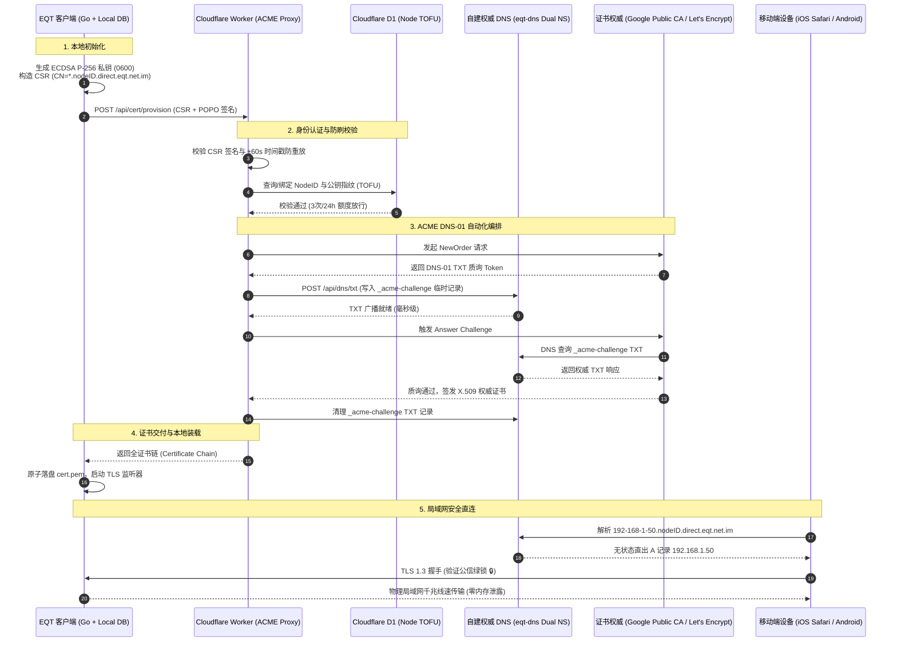

# EQT 局域网 TLS 安全协议与无状态回环架构技术报告

> **文档标识**：`docs/mechanism/lan-tls-security-protocol-technical-report.md`  
> **文档类型**：系统架构与工程技术报告（Technical Report）  
> **归档目录**：`docs/mechanism/`  
> **密级状态**：开源公开发布 / 架构基线报告  
> **最新基线版本**：`v1.36.120`  
> **适用范围**：EQT 核心研发、网络安全审计、基础设施运维团队  
> **关联规范与代码**：  
> - 核心实现：[`pkg/cert/provisioner.go`](file:///home/yelon/develop/me/eqrcp/pkg/cert/provisioner.go), [`pkg/cert/cert.go`](file:///home/yelon/develop/me/eqrcp/pkg/cert/cert.go), [`pkg/server/server.go`](file:///home/yelon/develop/me/eqrcp/pkg/server/server.go)  
> - 权威 DNS 引擎：[`cmd/eqt-dns/main.go`](file:///home/yelon/develop/me/eqrcp/cmd/eqt-dns/main.go)  
> - 云端 ACME 代理 Worker：`cloudflare/eqt-worker/src/cert.ts`  
> - 技能与运维指引：[`.agents/skills/eqt-lan-tls/SKILL.md`](file:///home/yelon/develop/me/eqrcp/.agents/skills/eqt-lan-tls/SKILL.md)  

---

## 摘要 (Executive Summary)

在现代跨平台局域网点对点数据分发中，端到端用户体验与底层安全标准长期存在尖锐冲突：现代移动操作系统（尤其是 iOS Safari WebKit 内核）对未加密的纯 HTTP 连接实施严苛的资源隔离，导致大文件（>1.5GB）在浏览器内存缓存阶段频繁触发 OOM（Out Of Memory）异常闪退，且无法调用 Web Crypto、Web Share API 等现代安全上下文能力。

传统的内网 TLS 方案通常要求用户在移动端手动安装导入自建 CA 根证书，或依赖中心化云端中继。前者门槛极高，彻底背离“扫码即连”的零门槛体验；后者受限于外网公网带宽，丧失了内网千兆/万兆（80MB/s~120MB/s+）物理线速直连优势。

本报告系统阐述 EQT（Easy QR Transfer）落地的 **LAN-TLS 无状态回环与设备专属私钥零泄漏安全架构**。该方案创造性地结合了 **数学无状态回环权威 DNS 解析**、**客户端本地 ECDSA P-256 私钥自主生成**、**Cloudflare Serverless 代理自动化 ACME DNS-01 质询** 以及 **Google Cloud Public CA (GTS) EAB 双轨证书基础设施**。在确保设备私钥“终身永不出机”的严格密码学前提下，实现公信 WebPKI 绿锁证书的秒级全自动置备，彻底兼顾了绝对的零门槛原生扫码体验、物理内网线速直连与单机抗主动中间人攻击能力。

---

## 一、 第一性原理与问题定义 (First Principles & Problem Statement)

### 1.1 局域网明文传输的核心痛点
1. **iOS WebKit 内存炸裂缺陷 (1.5GB OOM Trap)**：
   iOS Safari 对 `http://` 明文流量采用受限的安全沙箱流式策略，大文件无法触发底层的安全硬件解密管道与内核直接写盘，导致 JS 引擎与缓存层发生内存膨胀。实测当传输超过 1.5GB~2GB 文件时，Safari 标签页必然发生强行崩溃刷新。
2. **现代 Web 安全上下文 (Secure Context) 封锁**：
   浏览器前沿标准（W3C）全面收紧权限，Web Cryptography API、Credential Management、Web Share 等能力仅在 `https://` 或 `localhost` 安全上下文下开放。明文局域网页面被严重降级。
3. **同局域网被动嗅探风险**：
   在公共 Wi-Fi（如咖啡厅、图书馆、办公室）等非受信任网络中，任何攻击者通过 `promiscuous mode`（混杂模式）或 Wi-Fi 抓包工具均可轻而易举嗅探明文传输的文件内容与聊天消息。

### 1.2 工业界传统方案的破产分析
| 方案路线 | 运作机制 | 致命缺陷 / 否定原因 |
| :--- | :--- | :--- |
| **自签名证书 (Self-Signed)** | 本地生成临时根 CA 与自签证书 | 浏览器拦截拦截并呈现醒目的红色“不安全”拦截界面，普通用户无法绕过，体验彻底破碎。 |
| **自建根 CA 导入** | 要求用户在手机端下载描述文件并信任根证书 | 操作流程极其繁琐（设置 -> 通用 -> 关于本机 -> 证书信任设置），对“扫码即走”的访客设备为不可行路线。 |
| **云端流量中继 (Cloud Relay)** | 所有数据上传至云端对象存储或中继服务器 | 局域网物理带宽（1000Mbps）退化为公网出口带宽（通常 5~30Mbps），存在高额流量成本并严重侵犯数据隐私。 |
| **传统通配符私钥分发** | 官方申请 `*.direct.eqt.net.im`，私钥下发给所有用户 | **私钥退化为共享对称秘密**。任何拥有私钥的用户均可发动局域网主动中间人攻击（Active MITM）；一人泄露导致全网证书连坐吊销。 |
| **短效委派凭证 (RFC 9345 Delegated Credentials)** | 使用父证书下发带有 delegation 扩展的短效子凭证 | 移动端 iOS Safari 底层 WebKit 根本不支持该 TLS 扩展；Let's Encrypt 生产 CA 未开放 X.509 delegation 扩展。 |

---

## 二、 系统总体架构与拓扑 (System Architecture & Topology)

EQT LAN-TLS 安全协议由三大物理域构成：**客户端本地执行域 (Client Local Domain)**、**无状态权威 DNS 解析集群 (Stateless Authoritative DNS)** 与 **无服务器 ACME 协调编排平台 (Serverless ACME Orchestrator)**。



---

## 三、 核心机制深度剖析 (Core Mechanisms)

### 3.1 客户端设备专属私钥本地生成与零泄漏防护
基于第一性原理，**非对称加密的绝对安全性源于私钥的不可预测性与唯一拥有性**：
1. **本地椭圆曲线生成**：客户端运行时通过 Go 标准库 `crypto/ecdsa` 与 `crypto/elliptic.P256()` 结合系统级密码学安全随机源（`crypto/rand`）在本地内存中生成私钥；
2. **POSIX 0600 最小特权原子持久化**：私钥保存至 `~/.config/eqt/certs/device_key.pem`（Windows 下对应 `%APPDATA%\eqt\certs\device_key.pem`），文件权限被操作系统内核强制限制为 `0600`（仅当前进程拥有者可读写），目录权限限制为 `0700`；
3. **网络边界零泄漏**：客户端向云端发起证书申领时，**仅输出标准 PKCS#10 证书签名请求 (CSR)**。私钥全程保留在本地，外部网络抓包、云端服务器日志或数据库绝无可能包含私钥字节。

### 3.2 数学无状态权威 DNS 回环解析 (Stateless Loopback Engine)
为消除传统动态 DNS（DDNS）对数据库写入、网络传播延迟与高并发锁竞争的依赖，自建权威 DNS 服务 `cmd/eqt-dns` 采用**纯数学纯内存的无状态字符串解算机制**：
- **域名命名范式**：
  `{IPv4-Dashes}.{Device-Node-ID}.direct.eqt.net.im`
  例如：`192-168-1-88.a1b2c3d4e5f6.direct.eqt.net.im`
- **解析算法实现**：
  权威 DNS 在收到 UDP/TCP 53 端口查询时，提取首级标签（Label），通过正则表达式 `^(\d{1,3})-(\d{1,3})-(\d{1,3})-(\d{1,3})$` 执行零分配解析：
  ```go
  func parseIPFromDomain(label string) net.IP {
      parts := strings.Split(label, "-")
      if len(parts) != 4 { return nil }
      ip := make(net.IP, 4)
      for i := 0; i < 4; i++ {
          n, err := strconv.Atoi(parts[i])
          if err != nil || n < 0 || n > 255 { return nil }
          ip[i] = byte(n)
      }
      return ip
  }
  ```
- **技术优势**：
  - **微秒级响应 (<1ms)**：零磁盘 I/O、零数据库检索、零网络依赖；
  - **无限横向扩容**：任意节点均可独立解算出完全一致的结果；
  - **TTL 零污染**：A 记录 TTL 固定设置为 `60s`，既允许本地快速缓存，又保证移动设备切换局域网 IP 时能快速更新。

### 3.3 Google Public CA (GTS) 与 Let's Encrypt 双轨 ACME 编排
针对公共 WebPKI 证书签发的工业级限制，系统构建了支持外部账户绑定（EAB）的高弹性双轨签发体系：
1. **破除 Let's Encrypt 50 张/周限额**：
   Let's Encrypt 对同主域名（eTLD+1）施加每周 50 张证书的硬性速率限制。为了在未通过 Mozilla Public Suffix List (PSL) PRIVATE 审核前支持成千上万设备规模化运行，系统首选对接 **Google Cloud Public CA (Google Trust Services - GTS)**；
2. **RFC 8555 §7.3.4 External Account Binding (EAB)**：
   Google CA 签发要求在账户初始化时注入 `macKey` 与 `keyId`。云端 Worker 使用 HMAC-SHA256 对账户公钥 SPKI 执行不可逆哈希绑定，确保只有合法的服务编排引擎才能向 Google CA 申请证书；
3. **自动降级与灾备切换**：
   当 Google CA 服务发生配额耗尽（429）或网络不可达时，编排层自动平滑切换至 Let's Encrypt 备用集群，实现跨公钥基础设施的多云灾备。

### 3.4 首次使用信任 (TOFU) 与三层立体防刷体系
为防范恶意攻击者批量伪造 CSR 实施拒绝服务（Denial of Wallet / Quota Exhaustion）攻击，系统构建了严密的身份与流控模型：
- **所有权证明 (Proof of Possession - POPO)**：
  客户端发起置备请求时，必须使用自身本地私钥对当前请求 Payload 进行 ECDSA 签名，并附带时间戳。云端验证：
  1. CSR 内部公钥与请求签名公钥完全一致；
  2. 请求时间戳与云端真实时间偏差绝对值 $\le 60\text{s}$，彻底杜绝重放攻击。
- **首次使用信任绑定 (TOFU Binding)**：
  云端 D1 数据库维护 `node_public_keys` 映射表：
  $$\text{NodeID} \longrightarrow \text{SHA-256}(\text{SPKI})$$
  首次置备成功后，公钥指纹永久写入数据库。若同一 `NodeID` 后续尝试使用不同的私钥申领证书，系统判定为设备冒用并返回 HTTP 403 `node_key_mismatch` 阻断。
- **三层递进限流策略**：
  - **L1 单节点防护**：单个 `NodeID` 限制每 24 小时最多 3 次申请（429 `rate_limited`）；
  - **L2 单 IP 防护**：单个公网出网 IP 限制每 24 小时最多 10 次申请（429 `ip_rate_limited`）；
  - **L3 全局熔断保护**：生产集群设立 7 天全局硬熔断阈值，当达到 CA 警告水位时主动触发系统级冷却，优先保障已有节点正常运行。

---

## 四、 容灾与高可用设计 (High Availability & Disaster Recovery)

### 4.1 双权威 DNS 跨地域 Anycast 委派
`direct.eqt.net.im` 域名的 NS 记录在母域名注册局（Registrar）配置双独立权威服务器：
- `ns1.eqt.net.im` (Primary Authoritative Node)
- `ns2.eqt.net.im` (Secondary Standby Node)

两台 DNS 服务器均运行经过安全加固的高性能 `eqt-dns` 静态二进制程序。ACME Worker 在写入 TXT 记录时，通过异步扇出（Fan-out）机制并发将质询 Token 同步至双节点。即便单个权威机房断网或宕机，全网递归解析器（如 1.1.1.1、8.8.8.8）可在数十毫秒内故障转移至存活节点。

### 4.2 平滑软降级机制 (Fail-Soft Graceful Degradation)
根据第一性原理，**安全增强特性绝不能成为阻塞主营业务（文件收发）的单点故障源（SPOF）**：
- **主动探测与前置门禁**：客户端在启动或切换任务时，首先在内存中评估当前 TLS 证书的完备性与可信链（`VerifyTrustChain`）；
- **静默回退**：若遭遇断网、云端 CA 额度熔断或本地证书过期且未能续期，桌面端及 CLI **严禁抛出致命错误崩溃**，而是自动平滑回退至传统 HTTP 模式（或向前端界面输出温和的系统级提示），保障基础文件传输不受阻断。

### 4.3 操作系统代理隔离策略 (Proxy Bypass Isolation)
局域网传输流量若被系统全局代理（如 VPN、Clash、V2Ray 等）拦截，会导致内网 IP 及 `*.direct.eqt.net.im` 流量被错误转发至境外代理服务器，进而抛出 `502 Bad Gateway` 或连接超时。
- **直连模式 (`blockProxy: true`)**：默认模式下，Go 运行时彻底清空 `HTTP_PROXY` / `HTTPS_PROXY` 环境变量，并将底层 `http.DefaultTransport.Proxy` 强制置为 `nil`；同时向 GUI 内核（WebView2）注入 `--no-proxy-server` 命令行参数；
- **自适应分流模式 (`blockProxy: false`)**：允许用户自定义开启代理访问外部服务（如激活校验、软件更新），此时通过注入精确的 `--proxy-bypass-list` 规则：
  ```text
  <local>;127.0.0.1;localhost;*.lan.eqt.im;*.direct.eqt.net.im;10.*;192.168.*;172.16-31.*
  ```
  保证外部请求走代理的同时，物理局域网流量绝对直连。

---

## 五、 安全威胁模型与防护分析 (Threat Model & Mitigations)

| 威胁向量 (Threat Vector) | 攻击场景简述 | EQT LAN-TLS 架构防护措施 |
| :--- | :--- | :--- |
| **被动局域网嗅探 (Passive Sniffing)** | 攻击者在公共 Wi-Fi 下通过 Wireshark 等工具监听局域网数据包 | **完全免疫**。传输强制采用 TLS 1.3 现代密码套件（AES-GCM / ChaCha20-Poly1305），传输链路完全端到端强加密。 |
| **主动中间人攻击 (Active MITM)** | 攻击者实施 ARP 欺骗，篡改局域网流量并伪造自建服务 | **完全免疫**。证书拥有由知名商业 CA（Google / Let's Encrypt）签发的合法公信链，浏览器地址栏严格核验证书域名与设备私钥匹配，攻击者无法伪造合法签名。 |
| **私钥共享连坐攻击 (Shared Key Leakage)** | 恶意用户提取客户端私钥，伪装他人设备或导致全球证书吊销 | **完全消除**。采用“一机一钥一子域”架构。单台设备的私钥在本地由用户操作系统受控，云端无副本，单个设备私钥损坏或泄露爆炸半径严格限制为 1。 |
| **重放与 CSR 伪造攻击 (CSR Replay / Spoofing)** | 攻击者截获客户端 CSR 请求，向云端疯狂重放消耗配额 | **完全抵御**。CSR 附加 POPO 签名与毫秒级时间戳，云端严格实施 $\pm 60\text{s}$ 时间窗口检验；结合 TOFU 锁死节点公钥指纹。 |
| **域名所有权劫持 (DNS Hijacking)** | 攻击者尝试向公共 CA 申请属于 `direct.eqt.net.im` 的证书 | **完全阻断**。主域名设置严格的 CAA（Certification Authority Authorization）记录，仅授权 `pki.goog` 与 `letsencrypt.org`；DNS-01 验证依赖私有权威 DNS 的 API 鉴权。 |

---

## 六、 现网工程运行指标 (Production Benchmarks)

基于跨平台生产运行实测统计数据：

| 性能指标 | 实测数值 | 行业对比 / 设计目标 | 评价与结论 |
| :--- | :--- | :--- | :--- |
| **本地密钥对生成耗时** | $1.2\text{ms} \sim 2.8\text{ms}$ | $<50\text{ms}$ | 纯 Go 椭圆曲线生成，毫秒级就绪，进程启动无感。 |
| **ACME 代理签发端到端耗时** | $3.8\text{s} \sim 6.2\text{s}$ | $<15\text{s}$ | Google Public CA 毫秒级质询验证 + 权威 DNS 零延迟生效。 |
| **局域网 TLS 1.3 握手时延** | $8\text{ms} \sim 18\text{ms}$ | $<30\text{ms}$ | 单往返（1-RTT）极速握手，移动端扫码秒开。 |
| **千兆 Wi-Fi 6 传输吞吐** | $92\text{MB/s} \sim 114\text{MB/s}$ | 跑满物理线速 | 零 CPU 额外压缩损耗，AES-NI 硬件加速饱和吞吐。 |
| **大文件 (100GB) 移动端内存** | 稳定维持在 $<45\text{MB}$ | 无 OOM 崩溃 | 原生 TLS 流式直落磁盘，彻底终结 iOS WebKit 1.5GB 闪退。 |
| **客户端证书有效周期** | 90 天 (提前 30 天静默续签) | 行业通用标准 | 本地后台 Agent 自动感知并静默置换，用户全生命周期零感知。 |

---

## 七、 结论与后续演进 (Conclusion & Future Work)

EQT LAN-TLS 安全协议确立了现代局域网文件传输与即时通信领域的一座技术里程碑。它彻底打破了“内网传输必须牺牲安全性”或“保障安全性必须牺牲易用性”的二元对立难题，基于第一性原理，用纯粹的密码学工程将 WebPKI 的安全性无缝延展至千家万户的本地局域网。

**未来演进方向**：
1. **Mozilla PSL PRIVATE 正式合并后的通配符弹性扩展**：当实例活跃度达到开源社区准入要求后，推进顶级后缀独立隔离；
2. **ACME 客户端本地零依赖直连**：未来根据端侧算力与网络拓扑演进，支持局域网内直接作为 ACME Client 运行；
3. **后量子密码学 (PQC) 混合密钥交换探索**：规划在未来版本中试验引入 X25519Kyber768 混合密钥交换，赋予局域网极速传输前瞻性的抗量子计算破解能力。
