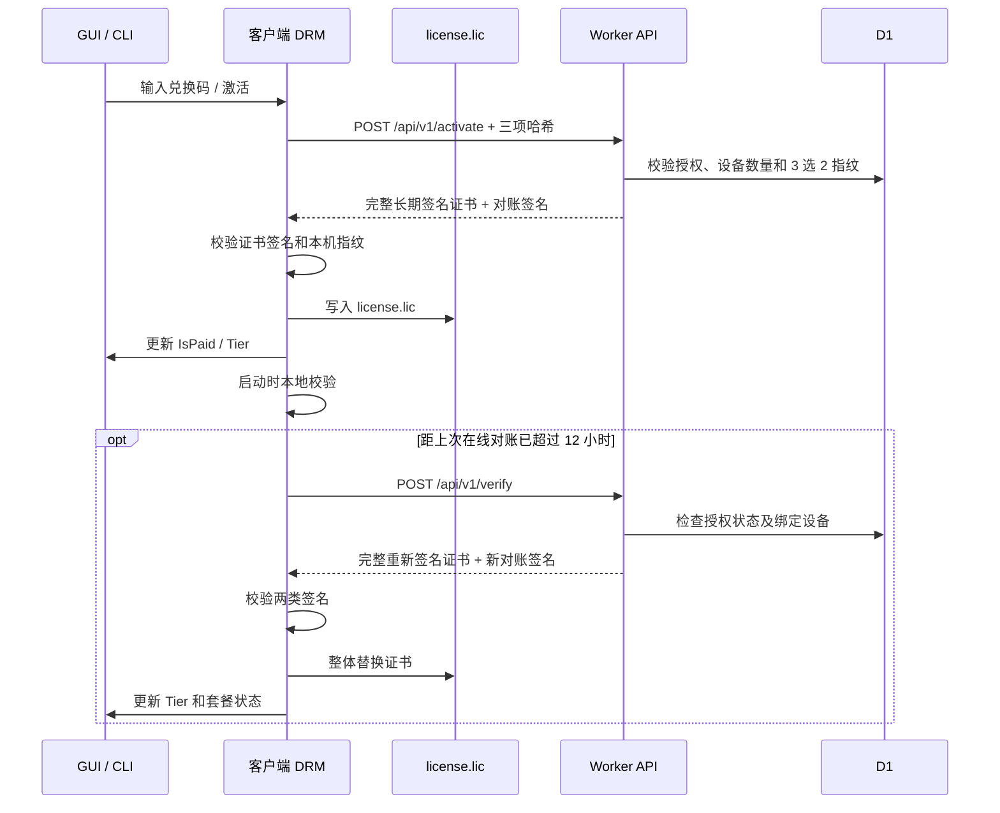

# EQT DRM 流程与机制

> **状态**：现行实现说明。本文以客户端 `pkg/server/license.go` 与 Cloudflare Worker `cloudflare/eqt-drm-api/src/index.ts` 为准。
>
> **范围**：兑换码激活、设备绑定、离线证书校验、在线对账、套餐状态同步、吊销与测试。支付履约细节见 [Paddle 支付系统集成指引](paddle-payment.md)。

## 1. 目标与信任边界

DRM 的目标是让客户端可以在短期离线时继续使用已购买的套餐，同时在联网后及时反映退款、吊销、设备解绑及套餐变更。

| 组件 | 职责 | 可被客户端信任的内容 |
| --- | --- | --- |
| Cloudflare Worker + D1 | 授权码、激活设备、套餐、到期与吊销状态的服务端事实来源 | 仅接受由其 Ed25519 私钥签发的证书和对账确认 |
| 客户端 `.lic` | 离线可验证的证书缓存和 7 天对账租约 | 证书内的签名、设备指纹、有效期、对账签名 |
| 客户端内存状态 | GUI 与限额模块的快速读取缓存 | 只从通过验证的 `.lic` 或完整对账响应更新 |
| GUI `localStorage` | 仅保存展示辅助信息 | 不能授予付费权益；后端 `AgentStatus` 为界面判定依据 |

本地唯一授权可信源是 `~/.local/eqt/license.lic`。`chat_usage.json` 仍用于免费额度等使用统计，但不作为付费授权的可信源。

## 2. 总体时序



## 3. 设备指纹

客户端为以下原始设备信息做小写、去空白和 SHA-256 处理：

1. 主板 UUID：Windows 优先 CIM，Linux 优先 DMI UUID。
2. CPU Processor ID / Serial。
3. 系统盘物理序列号。

校验采用 **3 选 2**：双方同一字段均非空且一致，才计为一次匹配；至少两项匹配才认可该设备。空字符串、`unknown`、`none` 及常见 OEM 占位符不会参与匹配。这避免因权限不足导致的空值被误判为同一设备。

## 4. 本地证书与签名

`license.lic` 是 JSON 证书。核心字段如下：

| 字段 | 含义 | 长期证书签名覆盖 |
| --- | --- | --- |
| `license_code` | 授权码标识 | 是 |
| `tier` | `PLUS` 或 `PRO` | 是 |
| `uuid_hash` / `cpu_hash` / `disk_hash` | 已绑定设备的三项哈希 | 是 |
| `expires_at` | RFC3339 时间或 `LIFETIME` | 是 |
| `max_devices` | 允许绑定的设备数 | 是 |
| `signature` | 上述长期证书的 Ed25519 签名 | 自身 |
| `last_online_sync_time` | 最近一次在线对账的服务端时间 | 否，由对账签名保护 |
| `verify_signature` | 对账租约签名 | 自身 |
| `last_seen_local_time` | 上次通过本地校验时的时间 | 否，仅用于回拨检测 |
| `activated_devices` / `buyer_email` | 展示与管理信息 | 否 |

长期签名载荷固定为：

```text
license_code|tier|uuid_hash|cpu_hash|disk_hash|expires_at|max_devices
```

对账签名载荷固定为：

```text
OK|license_code|uuid_hash|cpu_hash|disk_hash|last_online_sync_time
```

客户端内置公钥，只能验证签名，不能自行生成升级套餐、延长有效期或扩大设备数的证书。

## 5. 激活流程

1. GUI 调用 `ActivateLicense`，底层执行 `ActivateLicenseOnline`。
2. 客户端请求 `POST /api/v1/activate`，提交授权码、三项设备哈希与稳定设备 ID。
3. Worker 从 `licenses` 读取授权记录，拒绝不存在、非 `active`、已过期或命中滥用黑名单的授权。
4. Worker 对既有 `activations` 做 3 选 2 比对：同一设备重新激活不会消耗设备名额；新设备仅在未超过 `max_devices` 时写入绑定记录。
5. Worker 按当前套餐和有效期签发完整证书，并同时签发当前服务端时间的对账签名。
6. 客户端验证长期签名和本机指纹，成功后写入 `license.lic`，再以 `SetPaidStatus(true, ...)` 更新内存状态与额度模块。

激活响应中的签名未通过或设备指纹不匹配时，客户端不会写入证书。

## 6. 启动、本地校验与离线租约

硬件指纹预计算完成后，后台执行 `VerifyLocalLicense()`；此过程读取一次证书并执行以下顺序：

1. 验证长期 Ed25519 证书签名。
2. 检查 `expires_at`，非 `LIFETIME` 时不得超过到期时间。
3. 使用 3 选 2 规则比对当前设备。
4. 在非测试模式下验证 `verify_signature`，并要求 `last_online_sync_time` 在 7 天内。
5. 检查时钟回拨：若当前时间早于 `last_seen_local_time - 10 分钟`，设置 `ClockTampered` 并降级。
6. 最多每分钟更新一次 `last_seen_local_time`，以减少磁盘写入。
7. 全部通过后才将内存状态设置为已付费及对应 tier。

因此，网络故障本身不会立刻中断已验证套餐；只要最后一次已签名在线对账尚在 7 天租约内，用户仍可离线使用。超过租约后将降级为 Free。

## 7. 在线对账与套餐同步

### 自动与手动触发

- 应用启动后，`StartOnlineLicenseSync()` 在后台异步运行，不阻塞 GUI 或状态轮询。
- 常规对账距 `last_online_sync_time` 少于 12 小时时跳过，避免频繁网络请求。
- 开发模式的“在线对账”按钮调用 `DevForceOnlineLicenseSync()`，强制忽略 12 小时间隔。
- HTTP 客户端超时为 10 秒；临时网络错误返回错误但不删除仍处于 7 天租约内的证书。

### `/api/v1/verify` 的处理

客户端提交本地授权码和当前三项哈希。Worker 会：

1. 确认授权存在且状态为 `active`。
2. 确认当前设备仍在 `activations` 中，且满足 3 选 2 匹配。
3. 读取当前 `tier`、到期时间和设备数，生成新的服务端时间。
4. 返回完整证书字段、`certificate_signature`（长期签名）和 `signature`（对账签名）。

客户端不会在旧证书上局部修改 tier 或有效期，而是构造完整新证书并依次验证：

1. 响应授权码必须与本地授权码一致。
2. `certificate_signature` 必须通过长期签名校验。
3. 返回的设备指纹必须与当前设备通过 3 选 2 校验。
4. 对账签名必须覆盖新证书中的授权码、设备哈希与服务端时间。

全部通过后，客户端整体替换 `license.lic` 和内存缓存，并刷新 `IsPaid`、`LicenseTier`、到期时间和设备信息。该完整替换规则确保云端把 `PLUS` 改为 `PRO` 或更新到期时间后，新的本地证书在重启时仍能通过长期签名验证。

### 吊销和解绑

`/api/v1/verify` 返回 `403` 或 `404` 表示授权被吊销、已暂停、无效或设备已解绑。客户端会调用 `ResetLicense()`：删除本地 `license.lic`、清空证书缓存，并立即切换到 Free 状态。

## 8. GUI 与运行时状态

桌面端 `AgentStatus` 从授权内存缓存及本地证书摘要读取以下内容：`isPaid`、`licenseTier`、`clockTampered`、到期时间、设备上限和已激活设备数。

前端渲染时优先依赖 `state.status.isPaid && !state.status.clockTampered`。`localStorage` 中的授权对象只用于无后端状态时的过渡展示；一旦后端状态到达，`syncLicenseFromStatus()` 会同步展示信息，不能覆盖服务端判定。

开发模式“在线对账”成功后会立即使用返回的 `AgentStatus` 重绘；失败时会触发一次本地 `RefreshLicenseStatus()`，从而呈现可验证的当前状态。

## 9. 服务端数据模型

| 表 | 作用 |
| --- | --- |
| `licenses` | 授权码、tier、状态、设备上限、到期时间、购买与订阅关联信息 |
| `activations` | 每个授权码的设备哈希与激活时间 |
| `unbind_records` | 设备解绑历史，用于滚动解绑限额 |
| `verification_codes` / `user_sessions` | 授权管理门户的邮箱验证与会话 |

退款、订阅取消或管理员操作将 `licenses.status` 置为 `revoked` 等非活跃状态。客户端下一次在线对账即可收到 `403` 并擦除本地证书。

## 10. 失败分支速查

| 场景 | 客户端结果 |
| --- | --- |
| 激活响应长期签名无效 | 拒绝落盘，保持未激活状态 |
| 本地证书到期、签名或指纹校验失败 | 不授予付费权益 |
| 对账响应缺少完整重新签名证书或验签失败 | 拒绝替换旧证书，保留旧证书与其租约状态 |
| 对账网络错误 / 超时 | 不删除证书；7 天租约内继续离线使用 |
| 对账返回 403 / 404 | 删除证书并立即降级 |
| 系统时间回拨超过 10 分钟 | 标记时钟篡改并锁定付费权益 |
| 免费用户离线 | 仅提供基础 Free 能力；网络时间可用时再计算在线免费额度 |

## 11. 测试与运维

### 客户端测试

```sh
go test ./pkg/server
go test ./...
```

`TestForceOnlineLicenseSyncReplacesCertificateForTierChange` 覆盖从 `PLUS` 对账更新至 `PRO` 后，清空内存并模拟重启仍可从落盘证书恢复付费 tier 的路径。

### Worker E2E

```sh
cd cloudflare/eqt-drm-api
npm run test:e2e
```

该测试会在远端 D1 写入并清理固定测试夹具，覆盖激活、重复激活不消耗配额、设备上限、解绑限制、多语言以及 `/verify` 返回完整重新签名证书。

### 变更规则

- 改动长期签名字段或载荷时，必须同时修改 Worker 签发逻辑、客户端验签逻辑和对应测试；两端不对称会使所有新证书失效。
- `/verify` 若需更新 `tier`、`expires_at` 或 `max_devices`，必须返回新的 `certificate_signature`；不得局部修改旧证书。
- 不在文档、源代码或日志中记录私钥、SMTP 密码、支付密钥或真实用户授权码。
- Worker 变更发布后必须执行 `npm run test:e2e`，并确认测试夹具清理完成。

## 12. 相关代码

- 客户端证书、激活和对账：[pkg/server/license.go](../../pkg/server/license.go)
- 指纹采集与启动校验：[pkg/server/hardware.go](../../pkg/server/hardware.go)
- Worker 激活与对账路由：[cloudflare/eqt-drm-api/src/index.ts](../../cloudflare/eqt-drm-api/src/index.ts)
- D1 表结构：[cloudflare/eqt-drm-api/schema.sql](../../cloudflare/eqt-drm-api/schema.sql)
- GUI 授权状态：[desktop/gui/app.go](../../desktop/gui/app.go) 与 [desktop/gui/frontend/src/main.js](../../desktop/gui/frontend/src/main.js)
