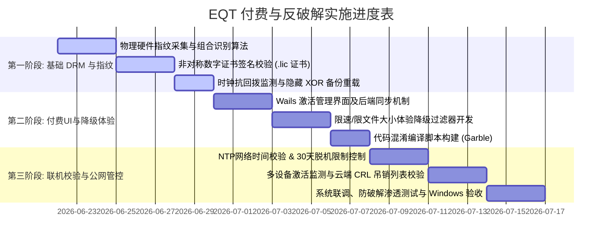

# EQT 付费、设备绑定与防破解设计方案（最终实施规划）

本方案旨在**结合基础/高阶的安全防护**与**产品极致体验（护城河）**，以最低的研发内耗实现最高的商业安全边际。本篇为最终执行文档，并附带分阶段推进排期表，以便团队推进和实现。

---

## 1. 付费层级设计 (Paid Tiers)

| 级别 | 核心服务范围 | 计费模式 | 典型定价 | 授权验证特点 |
| :--- | :--- | :--- | :--- | :--- |
| **Free (免费版)** | 局域网 Chat 与文件传输 | 每天前 5 分钟免费 | $0.00 | 无需绑定，超出后进入降级限制体验。 |
| **Plus (年度版)** | 局域网 Chat 与文件传输解除限制 | 年度订阅制 | $11.99/年 | 定期连网校时与到期校验（30天脱机限制），单设备绑定。 |
| **Plus (买断版)** | 局域网 Chat 与文件传输解除限制 | 终身买断制 | $29.99 | 支持离线使用，强设备绑定，支持限制最大激活设备数（如 2 台）。 |
| **Pro (公网版)** | 跨公网（WAN）P2P 聊天与大文件传输 | 月度订阅制 | $5.99/月 | 必须联网，云端信令服务鉴权与打洞节点校验（硬性成本护城河）。 |

---

## 2. 硬件指纹提取与绑定设计（安全基石）

为了防止用户通过重装系统重置免费时间，或将已授权文件复制给他人，必须建立坚实的设备识别防线。

### 2.1 加权硬件指纹（Weighted Fingerprint）算法
为了保障高可用性，避开单一硬件更换导致的误判，采用 **3 选 2 权重比对模型**：
1. **主板 UUID**（权重 40%）：重装系统绝对不变。
2. **CPU 序列号**（权重 30%）：硬件固化不变。
3. **系统盘物理 SerialNumber**（权重 30%）：磁盘物理固化，非分区卷标 ID。
* **规则**：生成比对组合 `[UUID, CPUSn, DiskSn]`，计算当前设备指纹与授权证书特征，**只要有任意 2 项一致**即判定设备合法。

### 2.2 非对称加密授权文件（.lic 证书）
* 拒绝使用“将机器码写死到 EXE 中”的低效且易被 Patch 的方式。
* **流程**：用户购买时上传 `DeviceID = SHA256(加权硬件信息)`，服务器使用官方**私钥（Private Key）**签署并生成 `Signature`，下发给客户端 `.lic` 授权文件。
* 客户端使用内置的**公钥（Public Key）**验证证书真伪及硬件绑定情况。此举阻断了“注册机（Keygen）”的生存空间。

---

## 3. 常见破解路径的针对性防御

| 攻击路径 | 破解手法描述 | 实施防御对策 |
| :--- | :--- | :--- |
| **重置计时器** | 删除配置文件或修改本地存储的时间数据 | **双层备份重载**：同时在配置路径和主用户目录下存放 XOR 混淆数据。当主配置被删时自动从混淆备份中重载恢复。 |
| **时钟回拨** | 修改电脑系统时间回到订阅期内 | **时钟抗回拨锁**：写入 `LastTime`，只要当前运行时间小于 `LastTime` 立即判定时间作弊，锁定付费功能。 |
| **直接二进制 Patch** | 在 IDA/Ghidra 中修改跳转指令（如 `jne` 变 `je`） | **散落式非对称解密**：将设备特征码作为加密算法的因子，解密核心业务组件或样式。Patch 跳转会导致程序缺乏密钥解密数据直接崩溃。 |
| **域名劫持/Mitm** | 修改 `hosts` 或抓包代理伪造授权通过包 | **SSL Pinning & 签名包**：网络响应包含服务器私钥非对称签名，即使劫持也无法伪造签名。 |
| **激活码泄露** | 一个买断激活码被发到网上共享 | **设备并发监控与 CRL 吊销机制**：联网时静默校验设备并发，超出阈值直接远程注销并在吊销列表中发布，阻断其继续传播。 |

---

## 4. 产品真正的护城河（UX 与商业转换）

* **体验降级代替硬性锁死**：超过 5 分钟后，局域网 Chat 不被掐断；**附件**限速 `100 KB/s` 且单文件最大 `2 MB`（WebSocket 文本/心跳不限速）。**不**采用随机消息失败。用户可继续闲聊，但在大文件生产力场景下会自愿付费。详见 [`docs/chat/free-tier-usage-analysis.md`](../chat/free-tier-usage-analysis.md)。
* **极佳的 UI 质感与便利度**：单文件、免安装、扫码直连，这是任何被加壳、携带木马的“破解版”所无法提供的清爽和安全体验。
* **云端公网节点限制**：Pro 模式必须经过云端信令鉴权，破解者不可能通过本地修改白嫖云端带宽。

---

## 5. 推进与实现排期表 (Roadmap & Schedule)

为了快速推进并在不耗费巨大精力的前提下，迅速为项目合围出安全防线，我们将实施计划分为三个阶段：

### 【第一阶段】：基础本地 DRM 防线构建（第 1 周，预估 8 个工作日）
* **目标**：实现设备唯一指纹采集与基础的非对称证书本地离线校验，解决“重装系统”和“Keygen 注册机”的问题。

### 【第二阶段】：付费 UI、限速降级与混淆编译（第 2 周，预估 8 个工作日）
* **目标**：实现人机交互、付费升级链路以及将 5 分钟超时转为“体验降级”限速，并加入 Go 混淆防静态分析。

### 【第三阶段】：联机防作弊校验与公网管控（第 3 周，预估 9 个工作日）
* **目标**：实现联机时间防篡改、防止证书公网泄露共享，并为 Pro 模式中转节点建立鉴权。

---

## 6. 进阶与究极优化方案 (Ultimate Improvements)

### 6.1 TPM（可信平台模块）硬件强绑定
* 利用现代 PC 普遍搭载的 **TPM 2.0 芯片**，在安全区内生成不可导出的 RSA/ECC 密钥对，作为最终设备抗拷贝凭证。

### 6.2 虚拟机字节码引擎（Bytecode Interpreter Delivery）
* 本地包不含高级特权逻辑的原生机器码，激活后按需下发加密字节码由轻量虚拟机解释运行，从根本上杜绝离线静态 Patch。

### 6.3 内存热加载的动态云端资产（Dynamic Cloud Payloads）
* 付费组件与特效 UI 不在本地 EXE 的 embed 资源中，成功联网验签后从云端拉取解密载入内存，关机或断网即释放。

### 6.4 体验降级代替硬性锁死（Degraded UX over Hard Lock）
* 超时后限制带宽（`100 KB/s`）、限制最大体积（`2 MB`），图片强制附带免费版水印，以黏性体验倒逼转化。

---

## 7. 破解与反破解深度博弈分析 (The Cracking & Defensive Game)

* **核心目的**：防守方的目的不是追求“数学上绝对不可破”，而是**将破解的技术门槛和工时成本，提高到远超直接购买订阅价格的程度**。当折腾成本（找破解版、防捆绑病毒、防每次更新失效）大于低廉售价时，防破解在商业上就已经完全成功。

---

## 8. 终局思考：商业体验与性价比才是最大的“防盗版护城河” (UX & Pricing over DRM)

* 极致的便利、超高的易用度与合理低廉的定价，才是最强大且无法被复制的“防破解护城河”。

---

## 9. 测试与验证方案 (QA & Testing Verification)

为确保开发的功能逻辑完备、安全策略有效，测试人员需按照以下测试矩阵和场景执行人工与自动化验证：

### 9.1 防重置限额测试（计时器验证）
* **测试目的**：验证当用户重置或删除本地状态时，今日已用时间是否能正确恢复。

### 9.2 时钟回拨防御测试（时间防作弊验证）
* **测试目的**：验证用户通过向后调整本地系统时钟能否白嫖付费或免费额度。

### 9.3 降级体验限速与限额测试
* **测试目的**：验证 5 分钟免费额度用完后，限速与限大文件是否生效。

### 9.4 证书有效性与仿冒测试
* **测试目的**：验证非对称加密签名是否安全。

---

## 10. 服务端架构开发设计 (Server-side Architecture)

为了配合本地 Plus 买断版/年度订阅以及 Pro 版本的授权控制，服务端的架构设计本着**轻量、无状态、低成本**的原则，避免引入繁重的云端数据库。

---

## 11. 硬件资源与要求说明 (Hardware Requirements)

本项目整体设计以 **轻量、低能耗、零系统负载** 为前提。以下为客户端与服务端的硬件要求指标：

---

## 12. 优先上线 EQT Plus 套餐的服务端部署与 Cloudflare 规划

由于 Pro 模式包含跨公网穿透及信令控制，属于后续规划，我们**优先将 Plus 套餐（本地局域网解除限制）上线**。为此，设计了极简的 Cloudflare Serverless 后端架构，确保低成本、免维护且完全免除物理主机部署。

### 12.1 Plus 与 Pro 的后端需求对比设计

| 需求维度 | Plus 套餐（优先上线） | Pro 套餐（后续升级） |
| :--- | :--- | :--- |
| **核心业务逻辑** | 支付处理、激活码生成、设备激活解密验证、吊销黑名单发布 | 信令中转握手（SDP交换）、实时网络穿透中继（TURN） |
| **状态/数据存储** | 静态存储：订单号校验、每激活码对应的设备指纹映射（上限2） | 动态实时连接状态：在线设备对、公网连接活跃心跳 |
| **服务端类型** | 100% Serverless（无状态 HTTP API + 轻量KV/D1 SQL） | Serverless + **必须有物理 VPS** 支撑 UDP/TCP 信令与流量转发 |
| **网络要求** | 低带宽：仅激活、查询订单时发起 API 通信 | 高带宽：对称 NAT 下，公网穿透流量需要服务器中转 |

### 12.2 使用 Cloudflare Pages 与 Workers 实现 Plus 落地
Cloudflare (简称 CF) 提供的 Pages & Workers 极度适合 Plus 套餐的无服务器快速上线。

#### 1. 前端与静态托管 (Cloudflare Pages)
* **用途**：托管 Plus 官网主页、产品购买介绍页、Stripe 付费按钮跳转页。
* **优势**：
  * **完全免费**：全球 CDN 缓存静态资源，无限流量和无限访问次数。
  * **Github 联动**：代码推送到 Github，CF 自动触发打包部署。
  * **吊销列表（CRL）分发**：将黑名单以 `crl.json` 形式放入 Pages 的静态目录。当客户端启动联网时拉取此文件。因为 CDN 全球分发，完全没有服务器负载和带宽成本。

#### 2. 支付处理与授权生成 (Cloudflare Workers + D1)
* **用途**：
  * **API 接口**：`/api/v1/checkout-webhook`（处理 Stripe 支付网关的回调）、`/api/v1/activate`（校验机器指纹并下发非对称加密 `.lic` 授权）。
  * **数据存储**：使用 **Cloudflare D1**（基于 SQLite 的 Serverless SQL 数据库），记录购买的 `ActivationCode`、对应的 `IsLifetime`、以及已绑定的最多 2 个 `DeviceFingerprint` 行数据。

### 12.3 Cloudflare Workers 免费额度能支撑 Plus 的使用吗？

**结论是：完全能够支撑，且绰绰有余。在日活 5 万用户以下几乎是零成本。**

分析如下：

1. **每日请求次数（Request Quota）**：
   * **CF Workers 免费限额**：**100,000 次请求/天**。
   * **Plus 用户请求行为**：Plus 版为纯本地/局域网离线验证。用户一旦获取到 `.lic` 后，日常使用局域网功能**完全不请求云端后端**。
   * 仅在**首次激活**（每台设备 1 次请求）或**每隔几天静默联网校准**时才会请求 Workers API。而吊销黑名单 `crl.json` 的请求由 Cloudflare Pages（**无请求限制**）承载，不消耗 Workers 额度。
   * 即使有 1 万名活跃 Plus 用户，每天发起请求的频率也可能在几百次左右，远低于每日 10 万次的限制。

2. **D1 SQL 数据库读写限额 (D1 Database Quota)**：
   * **D1 免费限额**：
     * 读操作：**5,000,000 次/天**。
     * 写操作：**100,000 次/天**。
     * 存储空间：**1 GB**。
   * **Plus 实际开销**：激活一台设备仅需写入一条 `DeviceID` 映射行，并在 D1 中进行一次 SELECT 查询。这属于极低频写入。1GB 空间能够轻松存下数百万条纯文本激活映射数据。

3. **CPU 运行耗时限制 (CPU Time Limit)**：
   * **CF Workers 免费限额**：每次请求最大 **10ms CPU 时间**。
   * **Plus 实际开销**：后端主要执行 Ed25519 签名与校验。使用 Cloudflare 提供的 Web Crypto API 进行硬件非对称算法运算只需不到 `2ms` 的物理 CPU 时间，绝不会超出 10ms 限制。

### 12.4 优先部署 Plus 的云端架构步骤
1. **第一步**：在 Cloudflare Pages 上建立 EQT 付费引导静态页，链接 Stripe Payment Links。
2. **第二步**：创建 Cloudflare D1 数据库，定义两张表：
   * `orders` (`order_id` primary key, `license_code`, `status`, `created_at`)
   * `activations` (`license_code`, `device_id`, `activated_at`)
3. **第三步**：编写 Cloudflare Workers，接收 Stripe Webhook，当付款成功时，往 `orders` 写入一条记录并生成激活码。
4. **第四步**：客户端（Wails 桌面端）在用户输入激活码后，发送 POST 请求到 Worker，Worker 检查 `activations` 里绑定设备数是否小于 2；若通过，在 D1 中添加该 `DeviceID` 映射记录，并用私钥签名该信息，返回给客户端 `.lic` 授权文件。

---

## 13. Free (免费版) 各模式超额限制细则 (Free Tier Limitations Detail)

为了提供精益且有安全纵深的降级体验，免费版用户在以下三个模式下的精确限制逻辑和判定细节如下：

### 13.1 Chat (聊天协作) 模式降级细则
* **免费满速时间**：每日累计 **5 分钟 (300秒)** 满速协作额度。
* **超额降级机制**（不会完全阻断消息发送）：
  1. **文字消息随机失败**：发送普通消息时有 **30% 的概率会随机发送失败**（服务端返回 `500` 错误，网页端提示 `Message failed to send (free tier limit reached). Please retry.`，需重试发送）。
  2. **强制限速**：所有的文字消息交互与数据流**全部限速在 100 KB/s**。
  3. **附件大小限额**：发送或接收的任何聊天附件，**单文件大小强制限制在 2MB 以内**（超出直接返回 413 并提示超出免费限制）。

### 13.2 Receive (接收模式 / 移动端上传) 限制细则
* **免费极速额度**：每日允许进行 **5 次** 完整的极速文件接收。
* **超额限制机制**（从第 6 次接收开始，PC 后端 `usedTransfers >= 5`）：
  1. **网页端撤回受限**：移动端上传网页的待传输列表中，**不再渲染删除按钮（×），禁止删除/撤销已添加的待传文件**。
  2. **网页端大小/数量拦截**：移动端网页端上传列表**限选 5 个文件**，且**任何单个文件大小限 50MB**（超出直接在网页端拦截并警告提示）。
  3. **服务端物理防御**：若绕过网页，传输文件数超过 5 个或单个文件写入超过 50MB，PC 服务端会**直接返回 HTTP 报错强行切断传输并关闭服务**。
  4. **并发设备数限制**：超限后，**限制为只允许 1 台移动设备连接并发送数据**（若已有活跃的设备连接，新设备连入时返回 403 阻断并挂起）。

### 13.3 Share (分享模式 / 电脑发送) 限制细则
* **免费极速额度**：每日允许进行 **5 次** 完整的极速文件分享。
* **超额限制机制**（从第 6 次分享开始，PC 后端检测 `UsedTransfers >= 5`）：
  1. **闪退式物理阻断**：若待分享文件**总个数 > 5 个**，或单次分享的**总数据量（多文件打包后 Zip 大小）> 50MB**，当手机发起实际下载连接时，PC 服务端直接返回 403 阻断并**触发进程闪退式停止服务**。
  2. **并发设备数限制**：在每日非首次传输（从当日第 2 次开始）时，**单个分享任务最多仅允许 2 台设备同时连接下载**（第三台扫码连入时显示“设备连接数已超限”警告并挂起，排队等待其他设备退出）。