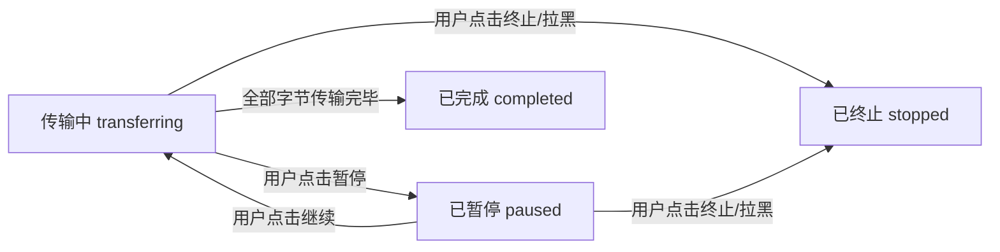
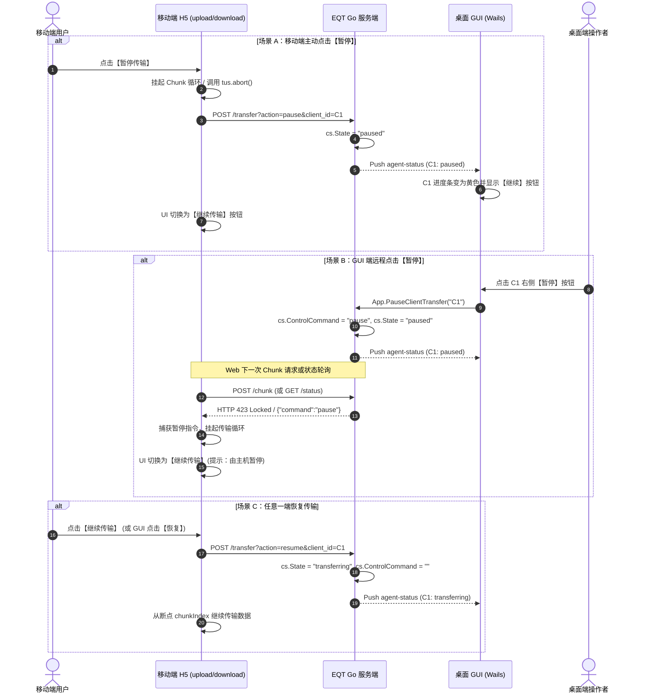

# EQT 传输双向暂停与断点恢复 (Bidirectional Pause & Resume) 架构设计与实现方案

## 一、概述与核心目标

在局域网大文件（数 GB 视频、大型压缩包、镜像）传输与多设备并发传输场景下，网络波动、系统资源占用或用户临时中断可能随时发生。
当前系统的传输控制仅支持单向的**“终止 (Stop / Abort)”**，一旦中断所有未完成数据作废，用户必须从 0% 重新传输。

本方案基于**第一性原理 (First Principles)**与**审查员视角 (Reviewer Perspective)**，设计并实现一套贯穿 **GUI 桌面端** 与 **移动端 (Web H5)** 的**双向传输暂停与断点恢复 (Bidirectional Pause & Resume)** 体系。

---

## 二、第一性原理剖析：全模式协议支持度与数据流

传输的本质是字节流的确定性转移。只要目标端已持久化的分块具备完整性，并且源端与目标端对当前偏移量（Offset / Chunk Index）达成强一致协议，暂停与恢复便可做到**零数据丢弃、零重复传输**。

### 1. E2EE 模式（端到端加密分块传输）
- **协议机制**：文件按固定 4MB 进行分块加密（`Chunk 0, Chunk 1, ... Chunk N-1`），每个分块由独立 Nonce（由 `sessionID + fileID + chunkIndex` 确定性派生）进行 ChaCha20-Poly1305 AEAD 加密校验。
- **暂停原理**：
  - **发送端（Upload/Share）**：终止当前并发或顺序 `fetch` 循环，保持本地 Session MasterKey 与文件读取句柄不销毁；
  - **接收端（Receive/Download）**：保留当前已落盘的 `.tmp` 临时文件及其已写入的字节偏移量，不释放状态；
  - **密码学安全性**：由于各 Chunk 独立计算 MAC，断点续传不会破坏加密链条或引发 Nonce 碰撞。
- **恢复原理**：
  - 发送端向服务端同步最新 `acknowledged_chunk_index`，直接从 `chunkIndex = k + 1` 恢复读取与加密推送。

### 2. 明文 Receive 模式（Tus 协议）
- **协议机制**：基于业界标准 `tus-js-client` 与 Go Tus 协议处理器。
- **暂停原理**：前端调用 `tusUpload.abort()` 挂起 HTTP PATCH 连接；
- **恢复原理**：前端重新调用 `tusUpload.start()`，Tus 客户端自动发送 `HEAD` 请求获取服务端当前 `Upload-Offset`，并从该偏移量无缝续传，**天然原生支持**。

### 3. 明文 Share 模式（HTTP Range）
- **协议机制**：标准 HTTP `Range: bytes=offset-` 协议。
- **暂停原理**：前端中断当前的 ReadableStream 或 XHR 请求，记录当前已接收字节数 `bytesDone`；
- **恢复原理**：重新发起带有 `Range: bytes=${bytesDone}-` 的 GET 请求，流式追加到本地内存/IndexedDB/文件流中。

---

## 三、双向控制协议与指令链路设计

系统支持两套控制通道：**移动端自主控制** 与 **GUI 桌面端远程遥控**。

### 1. 控制交互状态机 (State Machine)

| 状态值 | 含义 | 移动端 UI 表现 | GUI 端 UI 表现 | 后端行为 |
| :--- | :--- | :--- | :--- | :--- |
| `transferring` | 正在传输 | 进度条递增，显示【暂停】按钮 | 进度条递增，显示【暂停】按钮 | 正常读写分块与更新进度 |
| `paused` | 传输暂停 | 进度条定格，显示【继续】按钮，黄色徽章 | 进度条定格，显示【继续】按钮，黄色徽章 | 挂起当前客户端数据流入流出，保留 `.tmp` |
| `completed` | 传输完成 | 100% 成功卡片，显示绿色勾 | 100% 成功状态，显示【定位文件夹】 | 重命名 `.tmp` 为正式文件 |
| `stopped` | 手动终止 | 红色失败提示，无法恢复 | 标记为已终止，释放会话 | 物理删除 `.tmp` 文件与清理缓存 |

### 2. 双向指令时序流程

---

## 四、审查员视角：潜在风险与深度防御方案 (Reviewer Guardrails)

从代码质量、并发安全、内存防泄漏与防绕过的审查员视角，对以下 5 大隐患进行深度防御：

### 1. 风险一：暂停期间文件句柄与磁盘缓存泄漏
- **隐患**：若客户端暂停后直接关闭浏览器或断网，服务端的临时文件与句柄长期悬空。
- **防御机制**：
  - Go 服务端在处理每个 E2EE Chunk 时，均以 `os.OpenFile(path, os.O_WRONLY|os.O_APPEND, 0644)` 写入并**立即 Close**，不维持长生命周期物理文件句柄；
  - 增加 **30 分钟暂停超时回收机制**：若某客户端处于 `paused` 状态超过 30 分钟未恢复，服务端自动执行 `StopClientTransfer` 清理 `.tmp` 文件并释放槽位。

### 2. 风险二：并发在途 Chunk 与暂停判定竞争 (Race Condition)
- **隐患**：GUI 发出暂停指令瞬间，移动端恰好有 Chunk $k$ 在网络管道中。
- **防御机制**：
  - 服务端在写入 Chunk 前检查 `cs.ControlCommand == "pause"`：
    - 若 Chunk $k$ 写入前已暂停，返回 `HTTP 423`，客户端将当前断点保持在 $k$；
    - 若 Chunk $k$ 已完整写入并验签，返回 `HTTP 200` 并附带 Header `X-Transfer-Control: pause`，客户端断点推进到 $k+1$ 并挂起后续发送；
  - 状态同步始终以服务端 `BytesDone` 与 `acknowledged_chunk_index` 为单一真实数据源 (SSOT)。

### 3. 风险三：UI 状态竞争与频繁点击防抖
- **隐患**：用户在极短时间内快速连续点击“暂停/继续”，引发多个异步请求交错乱序。
- **防御机制**：
  - 前端为暂停/继续按钮设置 `isControlling` 局部防抖锁（300ms 冷却）；
  - 按钮采用状态单向映射，点击后立即进入过渡状态（禁用 + 加载图标），直到收到 HTTP ACK 或状态事件推送。

### 4. 风险四：多文件传输场景下的跨文件暂停
- **隐患**：单次任务上传 10 个文件，在第 3 个文件传输到一半时暂停。
- **防御机制**：
  - 全局传输上下文维护 `activeFileIndex` 与 `activeFileChunkIndex`；
  - 暂停时锁定全局文件队列；恢复时精准从当前文件的当前分块继续，前面的文件保持 `completed`，后续文件保持 `waiting`。

---

## 五、分阶段落地实施计划 (Implementation Roadmap)

### Phase 1: 服务端状态机与控制接口升级
1. 在 `pkg/server/server.go` 与 `pkg/server/e2ee.go` 中扩展 `ClientTransferStateInfo`：
   - 增加 `ControlCommand string`（支持 `"pause"`, `"resume"`）；
   - 支持 `State = "paused"` 状态跃迁；
2. 新增服务端控制路由：`POST /transfer/control?action=pause|resume&client_id=xxx`；
3. 在 `desktop/gui/app.go` 中封装 `PauseClientTransfer(clientID string)` 与 `ResumeClientTransfer(clientID string)` 并导出给 Wails 前端。

### Phase 2: 移动端 H5 传输管线挂起与恢复改造
1. **`upload.tmpl.html` (Receive 模式)**：
   - E2EE 上传管线中引入 `isPaused` 信号与 `pause()` / `resume()` 控制器；
   - Tus 上传管线中接入 `upload.abort()` 与 `upload.start()`；
   - 将原单颗【停止】按钮区域重构为【暂停/继续】主按钮 +【终止】辅助按钮；
2. **`download.tmpl.html` (Share 模式)**：
   - E2EE 下载循环中支持分块拉取挂起；
   - 监听宿主下发的 `command == "pause"` 并同步切换界面。

### Phase 3: GUI 桌面端联动与多语言支持
1. 在 `desktop/gui/frontend/src/main.js` 的 `renderReceiveDeviceProgressHtml` 与 `renderShareDeviceProgressHtml` 中，为每个设备卡片增加【暂停 / 继续】操作按钮；
2. 在 `i18n.js` 中补齐 7 国语言词条（`btn_pause`, `btn_resume`, `btn_abort`, `transfer_paused_toast` 等）。

### Phase 4: 全量测试与自动化回归套件
1. **单元测试**：在 `pkg/server/progress_test.go` 中增加暂停与恢复状态转移测试；
2. **E2EE 场景套件**：在 `test/e2ee/e2ee_scenario_suite_test.go` 中新增 `TestScenario6_BidirectionalPauseAndResumePipeline`，断言：
   - 50% 处暂停 -> 校验服务端状态为 `paused`；
   - 模拟延迟与并发请求 -> 校验无多余分块写入；
   - 恢复传输 -> 校验从 50% 断点单调递增至 100%，最终文件 SHA256 完整无损。
3. **Chrome E2E 仿真测试**：通过 `chrome-devtools-mcp` 验证移动端与桌面端交互按钮与 UI 响应。
