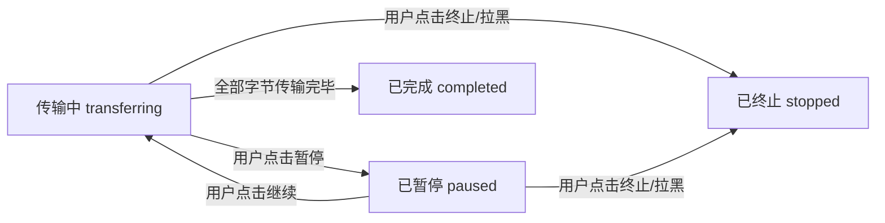
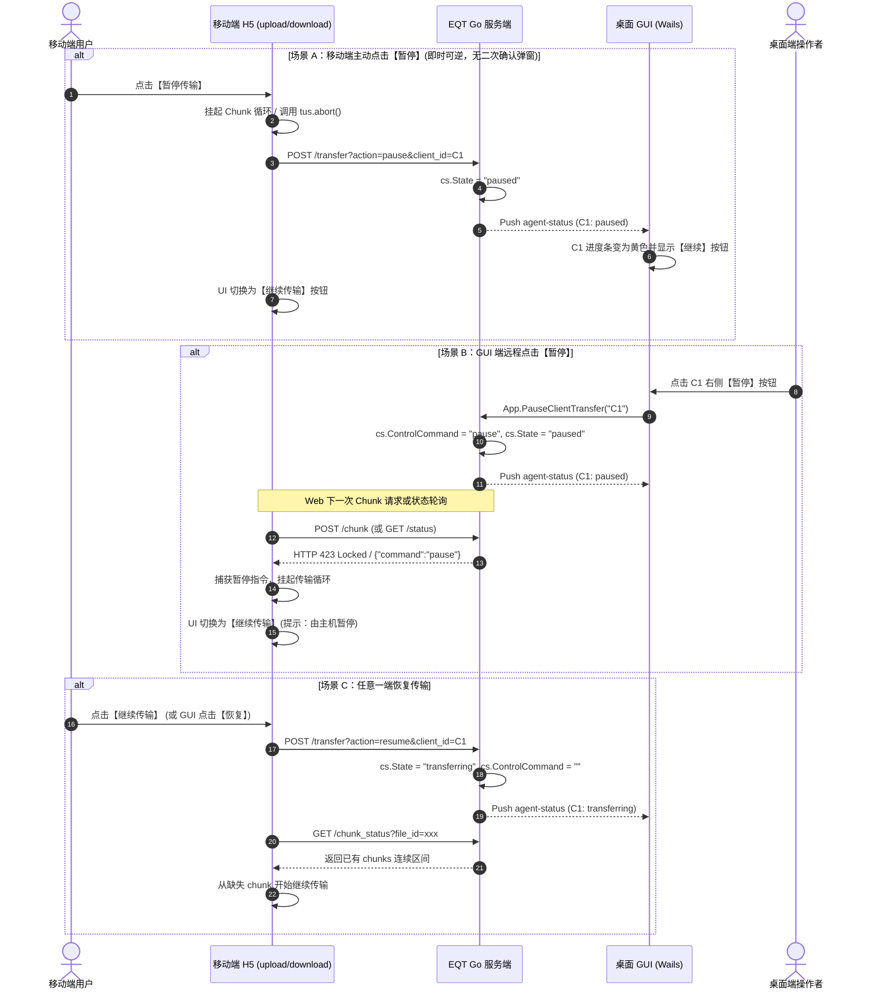

# EQT 传输双向暂停与断点恢复 (Bidirectional Pause & Resume) 架构设计与实现方案 (v2.0 审查修订版)

## 一、概述与核心目标

在局域网大文件（数 GB 视频、大型压缩包、镜像）传输与多设备并发传输场景下，网络波动、系统资源占用或用户临时中断可能随时发生。
当前系统的传输控制仅支持单向的**“终止 (Stop / Abort)”**，一旦中断所有未完成数据作废，用户必须从 0% 重新传输。

本方案基于**第一性原理 (First Principles)**，吸收审查意见对现状代码（句柄模型、断点 SSOT、明文 Range 机制、auto-stop 边界等）的精准对齐，设计并实现一套贯穿 **GUI 桌面端** 与 **移动端 (Web H5)** 的**双向传输暂停与断点恢复 (Bidirectional Pause & Resume)** 体系。

---

## 二、全模式底层协议机制与断点 SSOT 对齐

传输的本质是字节流的确定性转移。只要目标端已持久化的分块具备完整性，并且源端与目标端以服务端已有 SSOT 为准达成一致，暂停与恢复便可做到**零数据丢弃、零重复传输**。

### 1. E2EE Receive 模式（推模型：手机上传到电脑）
- **协议机制**：文件按固定 4MB 分块加密（`Chunk 0..N-1`），每个分块由独立 Nonce（由 `sessionID + fileID + chunkIndex` 确定性派生）进行 ChaCha20-Poly1305 AEAD 加密校验。
- **现有权威 SSOT**：
  - 服务端内存维护 `rf.ReceivedChunks map[uint32]bool`（`pkg/server/e2ee.go:44`）记录所有已落盘校验块；
  - 服务端已有 `/chunk_status` 端点（`e2ee.go:567` 通过 `computeContinuousRanges` 返回连续区间）；
- **句柄模型选择（方案 A：维持现状句柄模型）**：
  - 首个分块创建时打开 `os.OpenFile(tempPath, os.O_CREATE|os.O_RDWR, 0644)` 保持 `rf.File` 句柄，并维持 `rf.fileMutex` 锁粒度（与 eqt-e2ee-review 规范一致）；
  - **暂停期间**：保持 `rf.File` 句柄与内存映射；
  - **泄漏兜底**：由 30 分钟无活动超时的 `StopClientTransfer` 清理句柄与 `.tmp` 文件；
- **暂停原理**：
  - **移动端主动**：挂起前端分块发送循环，向服务端发送 `?action=pause&client_id=C1`；
  - **GUI 端远程**：服务端置 `cs.ControlCommand = "pause"`，在途分块返回 `HTTP 423 Locked`，移动端捕获后挂起；
- **恢复原理**：
  - 移动端请求 `/chunk_status` 获取已收分块集合，从下一个未标记块继续发送，**无需发明新的 ack 字段，直接复用既有去重与断点机制**。

### 2. E2EE Share 模式（拉模型：手机从电脑下载）
- **协议机制**：前端向服务端 `/chunk?file_id=...&chunk_index=k` 按序拉取 4MB 密文块并在本地 WebWorker/Libsodium 解密。
- **暂停原理**：
  - **移动端主动**：前端中止后续 `fetch` 循环，向服务端同步 `?action=pause` 状态；
  - **GUI 端远程**：服务端标记客户端 `paused` 并通过长轮询/SSE 推送，移动端感知后挂起下载循环；
- **恢复原理**：
  - 移动端直接从本地记录的下一个未拉取分块 `chunkIndex = k + 1` 继续发起 `fetch`。拉模型无需在途写锁竞争防御。

### 3. 明文 Receive 模式（Tus 协议）
- **协议机制**：基于 `tus-js-client` 与 Go Tus 协议。
- **暂停原理**：前端调用 `tusUpload.abort()` 挂起 HTTP PATCH 连接；
- **恢复原理**：前端调用 `tusUpload.start()`，Tus 自动发送 `HEAD` 请求获取服务端当前 `Upload-Offset`，并从该偏移量无缝续传。

### 4. 明文 Share 模式（HTTP Range 协议）
- **协议机制**：对接现有 `server.go:2781-2798` `ParseRangeHeader` 与 `isAlreadyTransferring` 机制。
- **暂停原理**：前端中断 ReadableStream，记录当前已接收字节数；服务端保持 per-item 投递状态不重置、不触发 auto-stop；
- **恢复原理**：前端发起带有 `Range: bytes=${bytesDone}-` 的 GET 请求。断点起点以服务端记录的已投递边界为 SSOT，流式追加写入。

---

## 三、双向控制协议与指令链路设计

系统支持两套控制通道：**移动端自主控制** 与 **GUI 桌面端远程遥控**。

### 1. 控制交互状态机 (State Machine)

| 状态值 | 含义 | 移动端 UI 表现 | GUI 端 UI 表现 | 后端行为 |
| :--- | :--- | :--- | :--- | :--- |
| `transferring` | 正在传输 | 进度条递增，显示【暂停】按钮 | 进度条递增，显示【暂停】按钮 | 正常读写分块与更新进度 |
| `paused` | 传输暂停 | 进度条定格，显示【继续】按钮，黄色徽章 | 进度条定格，显示【继续】按钮，黄色徽章 | 挂起当前客户端数据流入流出，保留句柄与 `.tmp` |
| `completed` | 传输完成 | 100% 成功卡片，显示绿色勾与【📥保存】 | 100% 成功状态，显示【定位文件夹】 | 重命名 `.tmp` 为正式文件 |
| `stopped` | 手动终止 | 红色失败提示，无法恢复 | 标记为已终止，释放会话 | 物理删除 `.tmp` 文件与清理缓存 |

### 2. 双向指令时序流程

---

## 四、关键边界场景与审查员防御机制

### 1. 暂停与 Auto-Stop / 15s Grace 互锁机制
- **问题**：`defaultStatusGracePeriod = 15s` 与 `SetAutoStop`（所有设备完成才自动退出服务）。若设备 A 传输完毕、设备 B 处于 `paused`：
- **规则**：**Auto-Stop 判定必须跳过 `paused` 设备**。只要存在 `paused` 状态的客户端，服务绝不得触发自动终止，保持会话与网络监听可用；只有当所有客户端均到达 `completed` 或显式 `stopped` 时，Auto-Stop 才会启动 15s 倒计时。

### 2. 暂停瞬间“在途最后一块 (Last In-Flight Chunk)”决断
- **问题**：GUI 发出暂停瞬间，移动端上传的最后一个 Chunk $N-1$ 恰好在网络中传输：
- **规则**：
  - 若 Chunk $N-1$ 顺利到达服务端并通过 ChaCha20-Poly1305 MAC 验签，服务端**放行写入并将其推进为 `completed`**（避免已成功接收的数据被强制回滚）；
  - 若在写入前服务端已拦截为 423，客户端保留断点并在恢复时重发该块。
  - **No-Rollback 保障**：恢复后首块写入时，严格继承已存在的 `cs.Files` 与 `cs.BytesDone` 累加值，禁止重置为 0（扩展 Scenario 2/2b 的 no-rollback 断言）。

### 3. 跨浏览器刷新与断点生命周期
- **范围声明**：在服务端 30 分钟会话超时窗口内，移动端刷新页面后，通过 URL Hash 中的 MasterKey 重新拉取 `/meta` 与 `/chunk_status`，即可在界面还原已完成分块并直接点击【继续】断点续传。若超过 30 分钟未活动，服务端执行 `StopClientTransfer` 回收物理文件。

### 4. 按钮语义与路由风格规范
- **停止 vs 暂停**：
  - 【终止 (Stop)】：不可逆破坏性操作，**保留二次确认弹窗**（支持 ESC 键与焦点自动流转闭环）；
  - 【暂停 / 继续 (Pause / Resume)】：即时可逆操作，**无需确认弹窗**，点击立即生效。
- **控制路由参数统一**：复用统一参数风格 `{{.Route}}?action=pause|resume|stop&client_id=xxx`（兼容既有 `?stop=true`）。

---

## 五、分阶段落地实施计划 (Implementation Roadmap)

### Phase 1: 服务端状态机与控制接口升级
1. 在 `pkg/server/server.go` 与 `pkg/server/e2ee.go` 中扩展 `ClientTransferStateInfo`：
   - 增加 `ControlCommand string`（支持 `"pause"`, `"resume"`）；
   - 支持 `State = "paused"` 状态跃迁；
   - 更新 Auto-stop 检查函数 `isAllClientsFinished()` 排除 `paused` 客户端；
2. 统一控制路由：`POST {{.Route}}?action=pause|resume|stop&client_id=xxx`；
3. 在 `desktop/gui/app.go` 中封装 `PauseClientTransfer(clientID string)` 与 `ResumeClientTransfer(clientID string)` 并导出给 Wails 前端。

### Phase 2: 移动端 H5 传输管线挂起与恢复改造
1. **`upload.tmpl.html` (Receive 模式)**：
   - E2EE 上传管线中引入 `isPaused` 信号与 `pause()` / `resume()` 控制器；
   - 恢复前调用 `/chunk_status` 校验服务端已有块；
   - 将原单颗【停止】按钮区域重构为【暂停/继续】主按钮 +【终止】（带 Modal）辅助按钮；
2. **`download.tmpl.html` (Share 模式)**：
   - E2EE 下载循环中支持分块拉取挂起；
   - 监听宿主下发的 `command == "pause"` 并同步切换界面。

### Phase 3: GUI 桌面端联动与多语言支持
1. 在 `desktop/gui/frontend/src/main.js` 的 `renderReceiveDeviceProgressHtml` 与 `renderShareDeviceProgressHtml` 中，为每个设备卡片增加【暂停 / 继续】操作按钮与黄色 `paused` 徽章渲染；
2. 在 `i18n.js` 中补齐 7 国语言词条（`btn_pause`, `btn_resume`, `btn_abort`, `transfer_paused_toast` 等）。

### Phase 4: 全量测试与自动化回归套件
1. **单元测试**：在 `pkg/server/progress_test.go` 中增加明文 Range 下载断点恢复与防提前 auto-stop 服务层测试；
2. **E2EE 场景套件**：在 `test/e2ee/e2ee_scenario_suite_test.go` 中新增 `TestScenario6_BidirectionalPauseAndResumePipeline`，断言：
   - 50% 处暂停 -> 校验服务端状态为 `paused`；
   - Auto-stop 不提前触发；
   - 恢复传输 -> 校验从 50% 断点单调递增至 100%，无 rollback，最终文件 SHA256 完整无损。
3. **Chrome E2E 仿真测试**：通过 `chrome-devtools-mcp` 验证移动端与桌面端交互按钮与 UI 响应。

---

## 六、第二轮审查复核：现状代码对齐与待修订缺口 (Review Round-2)

> 本节为 v2.0（`b185ed64`）修订版的独立复核意见，均已对照实际代码核实。开发下一轮修订正文时逐条裁决：采纳并入正文 / 驳回并说明理由。**行号为撰写时核对起点，落地以函数名定位为准。**

### R1. GUI → 移动端下行通道：下载页已具备、上传页缺失（涉及 §2.1 / §2.2 / 场景 B）
- **核实**：`download.tmpl.html` 页载即 `startStatusPolling()`（:1877），1200ms 周期轮询 `/status?client_id=`（:1426-1586）；E2EE 下载期间轮询**仍持续**（仅进度容器渲染被 `isE2EEDownloadActive` 跳过，:1470）。但响应解析目前**不消费 command 字段**（:1454-1563 仅读 `state` / `downloadedItems` / `percent`）。
- **结论**：E2EE Share（拉）的 GUI 远程暂停可**复用现成 /status 轮询作为下行通道**，无需新建 SSE/长轮询——§2.2 的"长轮询/SSE 推送"表述应改写为"复用现有 /status 轮询注入 command + 下载端解析后挂起拉取循环"。
- **反例**：`upload.tmpl.html`（E2EE receive / tus 上传）全文**无 /status 轮询**（仅 `chunk_status` 断点查询，:1857）→ GUI 远程暂停 Receive **非即时**，只能靠"下一个 chunk POST 命中 423"挂起（最终一致，生效延迟 ≤ 一个 chunk 周期间隙）。若产品要求 upload 即时暂停，Phase 2 需给 upload 页补轻量轮询，或把"延迟至下一 chunk 边界生效"写进产品语义——二选一并显式记录，避免实现期歧义。

### R2. 明文 Share 暂停的实现前提缺口（架构级，涉及 §2.4）
- **核实**：明文下载由 `window.location.href` / iframe `?download=1` 触发**浏览器原生下载接管**（`download.tmpl.html`:1382/:1389/:1404），前端**没有**可中断的 ReadableStream；服务端 Range（`server.go:2781-2798`）服务于原生下载，前端无字节级控制权。
- **缺口**：§2.4 "暂停 = 前端中断 ReadableStream、恢复 = `Range: bytes=${bytesDone}-`" **与明文现状下载形态不符**。落地前必须先行决策明文下载的消费形态：
  - **方案 A（真断点续传）**：明文下载改为**前端可控流式拉取**（fetch + 既有 Range + 本地落盘）。代价：放弃原生下载管理整合，需为大文件本地落盘（可复用 E2EE 的 IndexedDB/分块落盘经验）。
  - **方案 B（浏览器原生续传）**：明文 pause/resume 交由浏览器原生下载任务自行处理（无标准 API 可前端暂停；仅部分浏览器对服务端 Range 响应可续）。
- **建议**：若不做方案 A，明文 Share 的"暂停"实际只能表达为"服务端停投 + 前端下次重下"，并非真正断点续传，§2.4 应如实降级表述。该形态决策应**先于 Phase 2**，以设计决策形式在文档留痕。

### R3. paused 与 30 分钟无活动回收的语义冲突必须显式化（涉及 §2.1 / 四.1 / 四.3）
- **矛盾点**：§四.1 "Auto-Stop 跳过 paused，服务不得自动退出" 与 §2.1 / §四.3 "30 分钟无活动 `StopClientTransfer` 回收 .tmp 并关句柄" 并存，但**未声明 30 分钟计时对 paused 客户端是否同样走动**。若不暂停计时，paused 超 30 分钟 → 资源被回收 → 用户之后点【继续】落空（会话与断点一并消失）。
- **补强**：状态机显式加入 `paused --(30min 无活动)--> expired` 转移；移动端【继续】遇 404/410 时提示"会话已超时回收，需重新传输"，禁止静默转圈（对齐既有 410 → `showCompletedUI` 语义，`download.tmpl.html`:1565-1567）。

### R4. State 与 ControlCommand 双字段职责边界（一句话固化，涉及 Phase 1）
- `ControlCommand` 是**一次性瞬时指令**：被下一个 chunk 请求 / 轮询**消费后即清空**（场景 C resume 已置 `""`）；GUI 渲染**只读 `State`**。防止残留指令被 GUI 当状态渲染出假"暂停中"。Phase 1 状态机文档应写明"指令消费即清、渲染以 State 为唯一源"。

### R5. 测试补强：多文件 pause/resume 不得重传已完成文件（涉及 Phase 4）
- Scenario 6 现仅覆盖**单文件** 50%→100%。E2EE receive 已有 per-file `ReceivedChunks` 去重 + 已完成文件由 `recordCompletedE2EEFile` 封口（`BytesTotal == BytesDone`）。建议 Scenario 6 扩展为**多文件**：file0 已完成 + file1 50% 处暂停 → resume 后断言 file0 不重传（块去重命中、状态不回滚）、file1 从 50% 单调递增至 100%，把第 14/15 轮"`cs.Files` 必须真实灌入、完成文件不重置"教训固化为回归断言。
