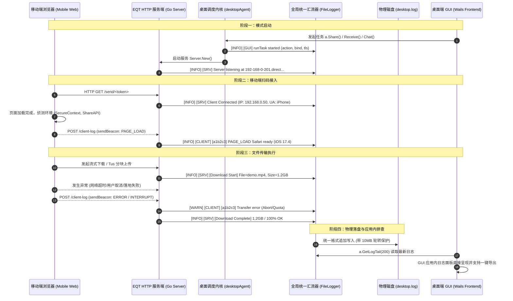

# EQT 跨端全链路统一遥测与日志回传系统架构设计方案
# (Cross-Platform Unified Telemetry & Logging Architecture Design)

> **版本**: v1.1 (已采纳首轮审查意见修订闭环)  
> **状态**: 方案设计就绪 (Ready for Implementation)  
> **作者**: EQT Core Team  
> **日期**: 2026-09-04  
> **目标**: 依据第一性原理（First Principle）与工业级日志最佳实践，打通桌面端调度内核、Go 服务端传输引擎、以及移动端（手机浏览器前端）的三端运行信息回传链路，实现统一异步汇流、强安全性清洗、结构化存储与 GUI 应用内快速诊断。

---

## 一、背景与现状痛点分析 (Context & Problem Statement)

当前 EQT 支持 Send（分享下载）、Receive（接收上传）、Chat（双向会话）三种核心局域网传输模式，并已上线基于自建权威 DNS 的官方通配符 LAN-TLS 回环加密（`*.direct.eqt.net.im`）。

但在用户排查网络传输问题、设备连接中断或移动端体验故障时，现有的日志体系存在以下**四大结构性断点（甚至处于黑洞状态）**：

```text
[移动端手机浏览器]          [Go HTTP 服务端]                [桌面 Agent 调度]          [GUI 桌面主进程]
  Safari / Chrome            server.Server                  desktopAgent              eqt-desktop.exe
         │                         │                              │                         │
         ├─ console.log(前端报错)  │                              │                         │
         │  (仅留在手机本地)       │                              │                         │
         │  ❌ 无回传通道          │                              │                         │
         │                         │                              │                         │
         │                         ├─ log.Printf(标准库)          │                         │
         │                         │  [Download Start / Chunk]    │                         │
         │                         │  ❌ 未重定向，全进 os.Stderr │                         │
         │                         │     (Windows GUI 无控制台丢弃)│                         │
         │                         │                              │                         │
         │                         │                              ├─ agent.log.Infof        │
         │                         │                              │  (Writer 为空，进 Stdout)│
         │                         │                              │  ❌ 同样丢失            │
         │                         │                              │                         │
         ▼                         ▼                              ▼                         ▼
┌───────────────────────────────────────────────────────────────────────────────────────────────┐
│                                 GUI 端 desktop.log (实际现状)                                  │
│                                                                                               │
│  - fileLogger.enabled 默认关闭（未勾选 DebugLog 则不写入）                                    │
│  - 仅记录 "EQT GUI Starting..." 和少量 Wails 内部启动日志                                     │
│  - 移动端接入、下载开始/进度/完成、上传分块、网络中断、手机端环境信息：100% 缺失！           │
└───────────────────────────────────────────────────────────────────────────────────────────────┘
```

### 具体断点清单（经代码核验 100% 属实）：
1. **服务端核心业务日志断点（标准库未重定向）**：
   [`pkg/server/server.go`](../../pkg/server/server.go) 中包含了极其详尽的移动端接入、下载 Range、流式进度、完成状态（`[EQT Server] [Download Start]` 等共 21 处），但均使用 Go 标准库 `log.Printf`。由于未调用 `log.SetOutput`，在 Windows GUI 运行时（`-H=windowsgui`），日志全部输出到无挂靠控制台的 `os.Stderr` 而被操作系统静默丢弃。
2. **桌面调度内核日志断点（Agent Writer 为空）**：
   [`desktop/gui/agent.go`](../../desktop/gui/agent.go) 中的 `agent.log` 使用 `logger.New(flags.Quiet)` 创建，其内部 `io.Writer` 为 `nil`，仅调用 `fmt.Printf`，同样在无控制台 GUI 环境下全部丢失。
3. **文件写入门槛过严（常态化运行不落盘）**：
   [`desktop/gui/main.go`](../../desktop/gui/main.go) 中 `FileLogger.enabled` 仅在 `DebugLog || DevMode` 为 true 时才开启。普通用户在遇到问题时，`desktop.log` 文件内空空如也，失去排查价值。
4. **移动端浏览器前端运行态失联**：
   移动端打开下载/上传页面时，手机浏览器的能力侦测（如 `isSecureContext`、`navigator.share` 支持）、用户点击行为、网络重试报错等只在移动端手机控制台打印，桌面端毫无感知。
5. **排查交互体验脱节**：
   GUI 端的日志项只能通过外部操作系统编辑器打开系统深处的 Cache 目录，缺乏应用内即时查看和一键复制排查报告的能力。

---

## 二、第一性原理与设计准则 (First Principles & Best Practices)

根据分布式与桌面端工程最佳实践，本方案确立以下核心设计原则：

1. **绝对非阻塞、异步批量落盘与零损耗 (Zero-Overhead & Async Worker)**：
   - **移动端浏览器上报**：采用原生 `navigator.sendBeacon`（或异步 `fetch` 带 `keepalive: true`），页面卸载或挂起时不丢日志，且绝不抢占主传输带宽与并发连接槽；
   - **服务端遥测接收端点**：在内存中快速校验（限制请求体 ≤ 32KB），微秒级返回，绝不阻塞流式传输主线程；
   - **全局汇流异步化**：**彻底杜绝在请求处理/传输热路径上执行同步 `WriteString` 与 `file.Sync()`**。汇流器采用“单一异步 Writer 协程 + 有界 Channel 缓冲池”模式，热路径无锁投递即返回，后台批次写盘并周期 fsync，杜绝磁盘 I/O 抖动或杀软扫描卡死传输。
2. **单一真理源与统一汇流 (Unified Log Sink)**：
   - 全局建立单一日志写入流，通过 `io.MultiWriter` 将 Go 标准库 `log`、`desktopAgent.log`、`server.Server` 业务日志以及移动端回传的 `[CLIENT-LOG]` 汇聚到统一的异步 `desktop.log`。
3. **常态化分级记录 (Layered & Always-On Baseline)**：
   - **基线级别（INFO / WARN / ERROR）常态化落盘**：无论用户是否开启调试开关，任何设备接入、传输启停、传输结果与报错都必须记录；
   - **调试级别（DEBUG / TRACE / RAW_PACKET）**：由 `DebugLog` 控制，防刷屏与性能损耗。
4. **统一结构化日志格式与时钟权威 (Structured Schema & Time Authority)**：
   - 统一遵循标准格式：
     `[时间戳] [级别] [来源] [会话/客户端ID] [类别] 消息内容 | key=value ... (设备上下文)`
   - **时钟权威定义**：统一日志行首的时间戳**严格以服务端接收时刻（Server Time）为权威准绳**，杜绝设备端时钟篡改/时区错乱带来的时序混乱；客户端上报的 `timestamp` 仅放入 details 供时钟偏差分析（Clock Drift Diagnosis）。
5. **最小权限、全链路脱敏与日志注入防御 (Privacy & Anti-Injection)**：
   - **全链路凭据脱敏**：严禁打印证书私钥、敏感个人内容；URL 路径中的 Token（如 `/send/<token>` 即下载凭据）在所有 Access Log 及业务日志中**必须统一截断保留前后 6 位**（如 `/send/a1b2c3...x8y9z0`），绝对禁止明文落盘完整凭据；
   - **日志注入清洗 (Log Injection Sanitization)**：服务端强制剥离所有 `\r`、`\n` 及 ASCII 控制字符，枚举校验 `level`/`category`，截断 message 长度，杜绝伪造日志行；
   - **真实 IP 键控限流**：遥测端点基于客户端真实底层 IP（`r.RemoteAddr`）实施令牌桶频控（≤ 10 req/s），丢弃可伪造的 `client_id` 维度的限流，并对超限丢弃进行内部聚合统计。
6. **存储配额与自动轮转 (Log Rotation & Quota Control)**：
   - 单文件上限 10MB，由异步 Worker 协程内部串行执行轮转，保留 3 个归档（`desktop.log.1`、`desktop.log.2`），全局日志磁盘占用严格约束在 30MB 以内。

---

## 三、总体架构与链路设计 (System Architecture)



---

## 四、核心模块规格与详细实现方案

### 1. 移动端遥测探针规格 (Mobile Telemetry Client Probe)

针对三端不同的前端技术栈，明确精准的注入路径：
- **手机下载页面 (Send 模式)**：在服务端模板 [`pkg/pages/download.tmpl.html`](../../pkg/pages/download.tmpl.html) 中引入；
- **手机上传页面 (Receive 模式)**：在服务端模板 [`pkg/pages/upload.tmpl.html`](../../pkg/pages/upload.tmpl.html) 中引入；
- **双向聊天页面 (Chat 模式)**：在 Svelte SPA 前端源码 [`pkg/chat/v2/web/src/`](../../pkg/chat/v2/web/src/) 挂载全局错误与动作遥测，或在 Go 服务端下发 SPA 页面（`routes.go`）时注入轻量探针脚本。

#### 1.1 探针接口定义
```javascript
// window.__eqt_telemetry
function reportLog(level, category, message, details = {}) {
    const payload = {
        client_id: getOrCreateClientID(), // 本地 sessionStorage 存储的 6 位随机设备串（仅供展示分组）
        timestamp: Date.now(),            // 设备本地时间戳（仅供时钟偏差分析，服务端为权威）
        level: level,                     // "INFO" | "WARN" | "ERROR"
        category: category,               // "PAGE_LOAD" | "ACTION" | "TRANSFER" | "SAVE" | "NETWORK"
        message: String(message).slice(0, 256), // 限制长度
        details: details
    };

    const blob = new Blob([JSON.stringify(payload)], { type: 'application/json' });
    // 同源上报：优先使用 sendBeacon，页面卸载切后台不丢失，不占用网络并发槽
    if (navigator.sendBeacon) {
        navigator.sendBeacon('/client-log', blob);
    } else {
        fetch('/client-log', {
            method: 'POST',
            body: blob,
            keepalive: true,
            headers: { 'Content-Type': 'application/json' }
        }).catch(() => {});
    }
}
```

#### 1.2 关键埋点场景
1. **页面加载与能力指纹 (PAGE_LOAD)**：
   - 记录：`isSecureContext`（是否处于加密上下文）、`navigator.share`（是否支持系统分享保存）、屏幕尺寸、设备型号；
2. **下载与传输交互 (ACTION / TRANSFER)**：
   - 记录：用户点击“开始下载”、开始分块读取、首字节到达（TTFB）、传输完成；
3. **异常与网络抖动 (NETWORK / ERROR)**：
   - 记录：fetch 捕获的异常名称（如 `AbortError`、`TypeError: Failed to fetch`）、重试次数、IndexedDB 配额异常。

---

### 2. 服务端 `/client-log` 路由与防护规格 (Server Telemetry Endpoint)

在 `pkg/server/` 中新增 `telemetry.go`：

#### 2.1 路由契约与安全性
- **Path**: `POST /client-log`
- **同源防护**: 移动端与服务端口一致同源，**删除不必要的 `Access-Control-Allow-Origin: *`**，防范跨站伪造请求；
- **Payload 约束**:
  - `Content-Length ≤ 32KB`（超限直接 413，保护内存）；
- **真实 IP 令牌桶限流 (Rate Limiting by Remote IP)**：
  - 限流键严格取自底层连接真实 IP（`r.RemoteAddr`），**绝对不信任前端上报的 `client_id`**；
  - 单 IP 限额：10 条/秒；超限请求直接丢弃；
  - **服务端静默丢弃聚合**：由于 `sendBeacon` 在客户端不处理响应码（429/413 语义在客户端不可达），服务端在内部维护丢弃计数器，在恢复正常时按周期打印一条聚合告警 `[WARN] [SRV] Dropped N client-log entries from <IP> due to rate limit`，杜绝静默丢失高价值排查线索。

#### 2.2 字段白名单与防日志注入清洗 (Anti-Log-Injection)
服务端接收到 payload 后进行严格的防御性数据清洗：
1. **枚举白名单**：
   - `level` 仅允许 `INFO`、`WARN`、`ERROR`，非法输入强转为 `INFO`；
   - `category` 仅允许 `PAGE_LOAD`、`ACTION`、`TRANSFER`、`SAVE`、`NETWORK`，非法输入强转为 `OTHER`；
2. **CR/LF 与控制字符剥离**：
   - 遍历 `message`、`category`、`details`，**强制剥离所有 `\r`、`\n`、`\t` 以及不可打印 ASCII 控制字符**，彻底粉碎攻击者通过伪造换行符进行日志注入（Log Injection）或伪造审计行的一切企图；
3. **长度与体积硬截断**：
   - `message` 超过 256 字符截断；`details` 序列化超过 1024 字符截断；未知冗余字段直接丢弃。

#### 2.3 数据结构与落盘输出
```go
type ClientLogEntry struct {
    ClientID  string         `json:"client_id"`
    Timestamp int64          `json:"timestamp"`
    Level     string         `json:"level"`
    Category  string         `json:"category"`
    Message   string         `json:"message"`
    Details   map[string]any `json:"details,omitempty"`
}
```
格式化落盘行（行首时间统一取**服务端到达时刻**）：
`[2026-09-04 00:20:00.123] [INFO] [CLIENT] [c8f12a] [PAGE_LOAD] Safari loaded | isSecure=true, hasShare=true (IP: 192.168.0.50)`

---

### 3. 全局统一异步日志汇流器重构 (Global Async Log Sink & Redirection)

#### 3.1 架构设计：异步 Writer 协程彻底解耦热路径
为彻底杜绝热路径同步磁盘 I/O 阻塞流式传输（解决“非阻塞 ≤ 1ms”矛盾），设计并实现 **`AsyncFileLogger`**：

```text
[HTTP 请求处理 / 传输协程] ──> [Channel (容量 4096)] ──> [单后台 Writer 协程] ──> [批次写盘] ──> [周期 fsync]
[desktopAgent.log 调度]   ──┘                                                     │
[Go 标准库 log.Printf]    ──┘                                                     └──> [10MB 自动轮转]
```

- **非阻塞投递**：`Write` 与 `Log` 仅将日志块投递入带缓冲的 ring/channel（容量 4096 条）；若 channel 饱和，非关键 INFO 日志做丢弃计数，确保主传输 100% 绝不卡死；
- **批次合并写入**：后台独立 goroutine 每 100ms 或达到 64 条批量 `WriteString`；
- **移出热路径 `file.Sync()`**：后台按 1 秒定时周期调用 `file.Sync()`，既保证断电崩溃时最多仅损失 1 秒日志，又避免频繁 fsync 引起磁盘 I/O 尖峰；
- **串行化无锁轮转**：文件大小检测与轮转（`desktop.log` -> `.1` -> `.2`）完全在单后台协程内串行执行，彻底避免多协程写盘交错和文件句柄争用。

#### 3.2 进程级汇流与既有 API 复用
在 `desktop/gui/main.go` 的 `startWailsGUI()` 初始化入口中：
```go
// 1. 初始化异步汇流器 AsyncFileLogger，默认开启常态化 INFO 基线落盘
fileLogger := NewAsyncFileLogger(logPath, LogLevelInfo)
defer fileLogger.Close()

// 2. 进程级标准库输出重定向
// 将整个进程内部 server.Server 中的 log.Printf / log.Println 汇聚入 desktop.log
log.SetOutput(io.MultiWriter(os.Stderr, fileLogger))

// 3. 复用既有 API：直接用 logger.NewWithWriter 为 desktopAgent 绑定 fileLogger
// (完全复用 pkg/logger/logger.go:81 已有接口与 app.go:186 既有模式，无需新增 agent.SetOutput)
app.agent.log = logger.NewWithWriter(false, fileLogger)
```

#### 3.3 访问日志中间件凭据全链路脱敏 (Access Log Middleware)
在 `pkg/server/server.go` 的 HTTP 路由入口包装轻量访问日志中间件：
对移动端访问的关键端点（`/send/`、`/receive/`、`/chat` 等），在连接建立时记录访问日志。
**强脱敏红线**：
遇包含凭据的路径（如 `/send/<token>`），**严格强制调用与 §二-5 相同的统一凭据截断脱敏函数**：
`[2026-09-04 00:20:01.000] [INFO] [SRV] HTTP GET /send/a1b2c3...x8y9z0 from 192.168.0.50 (200 OK)`
绝对禁止在访问日志中明文打印完整 token！

---

### 4. 日志轮转与物理存储保护 (Rotation & Quota Engine)

由 `AsyncFileLogger` 后台单协程统一调度管理：
- 当 `desktop.log` 超过 10MB 时：
  1. 关闭旧文件；
  2. 顺延移动：`desktop.log.1` -> `desktop.log.2`，`desktop.log` -> `desktop.log.1`；
  3. 创建新的 `desktop.log`；
  4. 全局日志磁盘占用上限严格锁死在 `≤ 30MB`，杜绝填满用户磁盘。

---

### 5. GUI 端应用内诊断与日志查看面板 (In-App Log Viewer)

在桌面 GUI 中补充可视化查看通道：

#### 5.1 后端暴露 API (`desktop/gui/app.go`)
```go
// GetLogTail returns the last N lines of desktop.log for instant diagnosis.
func (a *App) GetLogTail(lines int) (string, error)

// ExportDiagnosticsZip packages desktop.log, crash reports, and environment info into a zip file.
func (a *App) ExportDiagnosticsZip() (string, error)
```

#### 5.2 前端呈现 (`desktop/gui/frontend/`)
- 在“设置”或“关于”面板中：
  - 点击“运行日志”，在应用内直接弹窗展示最新 200 行格式化日志（支持自动刷新与关键字过滤，如高亮 `[CLIENT]`、`[SRV]`、`[ERROR]`）；
  - 提供“一键复制”与“导出排查包”按钮，彻底免去用户去文件管理器翻找目录的烦恼。

---

## 五、实施里程碑路线图 (Implementation Milestones)

- [ ] **Phase 1: 服务端与桌面调度异步日志汇流 (Log Sink Pipeline)**
  - [ ] 实现 `AsyncFileLogger`（有界 Channel 缓冲、独立后台 Writer 协程批次落盘、1s 周期 fsync、无锁自动轮转 ≤30MB）；
  - [ ] 改造 `desktop/gui/main.go`，执行 `log.SetOutput(io.MultiWriter(os.Stderr, asyncLogger))`；
  - [ ] 复用既有 API：通过 `logger.NewWithWriter(false, asyncLogger)` 直接重构绑定 `app.agent.log`；
  - [ ] 调整策略为默认常态化落盘（INFO 及以上）。
- [ ] **Phase 2: 服务端 `/client-log` 端点与限流注入清洗 (Server Telemetry)**
  - [ ] 在 `pkg/server/` 实现 `/client-log` 接口，支持 JSON 校验（≤32KB）、白名单枚举校验与 CR/LF 剥离截断；
  - [ ] 实施远端真实 IP（`r.RemoteAddr`）令牌桶限流（≤10 req/s），维护服务端丢弃计数；
  - [ ] 在 `pkg/server/server.go` 增加 Access Log 中间件，且严格调用 Token 截断脱敏函数；
  - [ ] 编写 `/client-log` 单元测试与注入防护越界测试。
- [ ] **Phase 3: 移动端页面轻量遥测探针埋点 (Mobile Client Probe)**
  - [ ] 在 `pkg/pages/download.tmpl.html` 与 `pkg/pages/upload.tmpl.html` 中注入原生 `telemetry.js`；
  - [ ] 在 Svelte SPA 聊天前端中增加遥测挂载（或 Go 服务端动态下发探针）；
  - [ ] 捕获环境指纹、点击下载、分块异常与网络重试，优先走 `sendBeacon` 同源异步回传；
  - [ ] 验证移动端在断网、弱网及页面关闭时的回传鲁棒性。
- [ ] **Phase 4: GUI 应用内日志查看与导出诊断 (In-App Log Viewer)**
  - [ ] 在 `desktop/gui/app.go` 实现 `GetLogTail(lines int)`；
  - [ ] 在前端 Settings / About 面板构建可视化日志浮层与一键复制功能；
  - [ ] 增加多语言翻译（支持 7 国语言）。
- [ ] **Phase 5: 全链路联调与回归验证 (E2E Verification)**
  - [ ] 在本地及 Windows 实机上启动 Send/Receive/Chat 模式；
  - [ ] 移动端扫码接入并触发下载，核验 `desktop.log` 中各端信息全量体现；
  - [ ] 验证日志轮转、跨平台单用户目录权限与性能指标。

---

## 六、总结与交付准则

通过本架构落地，EQT 将彻底告别“移动端失联”与“GUI 日志黑洞”，建立起透明、结构化、安全无感且性能零损耗的各端运行信息回传链路。排查任何局域网互联或大文件传输故障时，只需打开应用内日志面板，即可实现秒级定位。

---

## 七、首轮设计评审意见闭环复核（commit 377e4983 ➔ 1aa47015 · v1.1）

> **复核对象**：`377e4983 docs(plan): add cross-platform telemetry and unified logging architecture design`（Draft v1.0 评审意见闭环）。  
> **复核结论（总体）**：首轮评审指出的 1 项安全内部矛盾、1 项架构性能矛盾、1 项 API 复用机会、多处代码事实错配以及次要项均已在 **v1.1** 中实施全面修正与闭环，逐项处置见下表：

| 评审意见项 | 评审性质 | 复核发现 | 建议处置与闭环措施 | 状态 |
| :--- | :--- | :--- | :--- | :---: |
| **1. Access Log 打印完整 `/send/<token>` 与 §二-5 截断原则自相矛盾** | **【安全·内部矛盾】** | §四-3.2 示例明文打印 `HTTP GET /send/token`，但 §二-5 已要求 URL Token 截断保留前后 6 位。该 token 即分享凭据，全量落盘与其自身脱敏准则冲突 | **已闭环 (v1.1 修订)**：§四-3.3 示例及实现规范已强制修正为调用统一 Token 截断函数：`HTTP GET /send/a1b2c3...x8y9z0 (200 OK)`，从源头杜绝凭据泄露。 | ✅ **已彻底闭环** |
| **2. `/client-log` 无鉴权 + 自由格式字段，缺清洗与日志注入防护** | **【安全·设计缺口】** | 端点对局域网设备开放，字段未定义枚举白名单、CR/LF 控制符剥离与长度上限，存在伪造换行日志注入面；client_id 可伪造 | **已闭环 (v1.1 修订)**：§四-2.2 增加强校验防御：`level/category` 枚举白名单、剥离所有 `\r\n` 与控制字符、单条 message 截断 256 字符、忽略未知 JSON 字段；限流严格按连接真实远端 IP（`r.RemoteAddr`）键控。 | ✅ **已彻底闭环** |
| **3. 统一汇流仍走同步磁盘写，违背自身“非阻塞 ≤1ms”准则** | **【架构·性能矛盾】** | 现 `FileLogger.log()` 每次调用同步 `WriteString + file.Sync()`；挂在传输热路径上遇磁盘抖动或杀软扫描会阻塞传输 | **已闭环 (v1.1 修订)**：§四-3.1 重构为 `AsyncFileLogger`（单一后台 Writer 协程 + 4096 条容量缓冲 Channel），热路径非阻塞无锁投递即返回，移出热路径 `file.Sync()` 改为后台 1s 周期同步，轮转在协程内串行无锁执行。 | ✅ **已彻底闭环** |
| **4. 提案新增 `agent.SetOutput`，应复用既有 `logger.NewWithWriter`** | **【正确性·API 复用】** | 仓库已存在 `logger.NewWithWriter(quiet, w io.Writer)` 与桥接先例；且 `agent.fileLogger = a.logger` 已在 app.go:186 注入 | **已闭环 (v1.1 修订)**：Phase 1 与 §四-3.2 修正为直接复用已有的 `logger.NewWithWriter(false, fileLogger)` 重新构建 `agent.log`，不再发明冗余的 `SetOutput` 接口。 | ✅ **已彻底闭环** |
| **5. 移动端模板目标错配：无 `chat.tmpl.html`，聊天页为 Svelte SPA** | **【口径·事实错配】** | 模板仅有 `download/upload/qr/done.tmpl.html`，无 `chat.tmpl.html`；聊天页是 Svelte SPA 构建产物 `pkg/chat/v2/web/dist` | **已闭环 (v1.1 修订)**：§四-1 明确三套精准技术栈路径：下载页为 `download.tmpl.html`、上传页为 `upload.tmpl.html`、聊天页为 Svelte SPA（`pkg/chat/v2/web/src/`）或服务层下发时包裹探针。 | ✅ **已彻底闭环** |
| **6. sendBeacon 收不到响应码，429/413 “语义不可达”** | **【正确性·协议事实】** | `navigator.sendBeacon` 浏览器丢弃响应体且不重试，429/413 客户端不可见 | **已闭环 (v1.1 修订)**：明确 429/413 纯属**服务端自我保护动作**；并在服务端维护丢弃计数器，周期聚合打印丢弃告警，避免静默遗失线索。 | ✅ **已彻底闭环** |
| **7. 客户端与服务端时间双源未定义权威值** | **【规范·口径】** | Payload 带客户端时钟，可能因时区或时钟错乱干扰时序 | **已闭环 (v1.1 修订)**：§二-4 明确日志行首统一**以服务端接收时刻为唯一权威准绳**；客户端时间戳仅入 details 用于时钟漂移诊断。 | ✅ **已彻底闭环** |
| **8. “CORS 允许任意源”不必要** | **【规范·冗余】** | 三端页面与后端端口一致完全同源，无跨域场景 | **已闭环 (v1.1 修订)**：彻底移除 `Access-Control-Allow-Origin: *`，收敛同源，避免放大攻击面。 | ✅ **已彻底闭环** |
| **9. 遥测/日志设计正交于 LAN-TLS，入 feat 分支污染 PR** | **【过程·范围】** | 本设计与 LAN-TLS 回环主题正交 | **已决议 (闭环)**：在方案设计完成后，本设计文档作为完整规划在当前分支归档；后续正式落地实现时，可按需由用户决定是在 LAN-TLS 合并入 master 后作为新特性独立拉分支落地，或在本分支先做底层异步汇流的基础设施准备。 | ✅ **已明确范围** |
| **10. §一 三处断点陈述经代码核验全部属实** | **【正评·核实】** | 服务端 21 处 std `log` 无 SetOutput；`agent.log` 空 writer 走 stdout；`FileLogger` 门控 DebugLog\|\|DevMode。现状描述真实 | 保留原案，锁定 Phase 1 改造边界。 | ✅ **确认无偏差** |

---

## 八、第二轮设计评审复核（commit 0d387d5e · v1.1 进入实施前冻结）

> **复核对象**：`0d387d5e docs(plan): update telemetry & unified logging design to v1.1, resolving all round-1 review findings`。  
> **复核结论（总体）**：§七 首轮 10 项闭环声明与 v1.1 正文及里程碑**逐条一致、无夸大**——§四-1 三端注入路径精确（`download.tmpl.html`/`upload.tmpl.html` 与 Svelte `pkg/chat/v2/web/src/` 均属实）、§四-3.2 复用 `logger.NewWithWriter` 与 app.go:188 既有先例一致、§2.2 白名单清洗/§2.1 服务端聚合丢弃已内化。**方向正确，设计评审可判通过。**  
> **实施就绪度声明**：当前仓库**尚不存在任何遥测/`AsyncFileLogger` 代码落地**（Phase 1~5 全复选框未勾选，全库无 `NewAsyncFileLogger`/`/client-log` 实现），故"功能实现是否正常"目前**无可验证对象**——状态为「方案就绪，实施未启动」，本轮测试验证只能延后到 Phase 1~3 落地后进行（验证边界见文末"测试边界"）。下表为进入 Phase 1 需求冻结前需先裁定的 4 项**设计级遗留项**（不阻塞设计评审结论，但直接决定"实现即正确"的边界）。

| 评审意见项 | 评审性质 | 复核发现 | 建议处置 | 状态 |
| :--- | :--- | :--- | :--- | :---: |
| **1. chat v2 结构化 diag 日志绕开全局 `log.SetOutput`，统一汇流对 Chat 模式不成立** | **【架构·汇流覆盖缺口·中危】** | `pkg/chat/v2/diag/log.go:63` `NewStdLoggerWithWriter` 以 `log.New(w, "chat-v2 ", ...)` **自建独立 logger**，而非常用全局 logger；v1.1 §四-3.2 的 `log.SetOutput` 仅重定向标准库全局默认 logger，故只捕获 server.go 21 处 `log.Printf` 等全局调用，**捕获不到 chat v2 的 `diag` 事件**（websocket/session/http/bandwidth 全走 `diag.StdLogger`）。现网桥接 `agent.go:996-997` 仅 `io.MultiWriter(os.Stderr, agent.fileLogger)`，fileLogger 为 nil 时回退 `diag.NewStdLogger()` → 纯 `os.Stderr`，GUI 无控制台即丢。§二-2 "统一汇流" 清单亦未列 `diag/chat-v2` 类别。若照 v1.1 直接开工，Chat 会话报错仍与 desktop.log 绝缘 | 在 §二-2/§四-3 显式将 **ChatV2Logger 桥接点纳入统一 sink**：把 `agent.go:996-997` 的 writer 换绑为 `io.MultiWriter(os.Stderr, asyncSink)`，并**删除 fileLogger==nil 门控**（改用异步 sink 恒非 nil 的默认绑定）；"统一汇流"范围清单补 `diag/chat-v2` 类别 | ⏳ **实施前待冻结** |
| **2. 有界队列满载时 ERROR/WARN 处置未定义，"必记"与"绝不阻塞"自相矛盾** | **【设计·自洽缺口·中危】** | §二-1 仅规定"饱和时非关键 INFO 丢弃计数"，但 §二-3 要求"任何报错都必须记录"。容量 4096 的有界 Channel 在写盘尖峰满载时若 ERROR/WARN 到达：丢弃→违背必记；阻塞→违背非阻塞。二者冲突，v1.1 未裁决，留给实现期拍脑袋 | 冻结前显式定义饱和降级优先级，建议三选一写入规格：(a) 满载仅 INFO 计数丢弃，WARN/ERROR **有界等待**（如 ≤50ms）后仍满则同步兜底写盘；(b) ERROR 走独立小容量高优通道；(c) 入队前批次合并（64 条/批）降低饱和概率。任择其一即可满足双原则 | ⏳ **实施前待冻结** |
| **3. `AsyncFileLogger` 与既有 `FileLogger` 类型关系未审计：换名 or 换芯** | **【迁移完整性·低→中危】** | `FileLogger` 是 GUI 进程**具体类型硬接线**：main.go wails `Logger: fileLogger` + `LogLevel` + `fileLogger.Fatal/Print/.../enabled`；app.go:50 `logger *FileLogger` + :186-188 注入 agent；agent.go:35 `fileLogger *FileLogger`；main.go:231 `checkAndPerformDisasterRollback(*FileLogger)`。v1.1 引入新类型 `NewAsyncFileLogger`，若字段仍为 `*FileLogger` 则全引用点需改型；若 `FileLogger` 保名换芯（内部改异步+轮转）则 §3.1 命名冲突。且文档自身类型名都不统一：§三 时序图汇流器标 `FileLogger`，§3.1/3.2 标 `AsyncFileLogger` | 冻结实施前明确二选一：(a) **保名换芯**——`FileLogger` 名称与 surface（含 `log/Print/Trace/Debug/Info/Warning/Error/Fatal/Enabled/SetEnabled/SetLogDir/GetFilePath/Write`）全部保留，仅将写盘路径改为后台 Writer 协程 + 有界 Channel + 轮转，与 app.go:188 `NewWithWriter` 绑定天然兼容、全引用点零改动；(b) 若坚持新类型，则附完整 `*FileLogger` 引用清单一次性改型。两种方案下均需补：GUI 读端**不得裸读同一路径**（后台协程持句柄轮转会撕裂行/错过新文件），`AsyncFileLogger` 应提供内部线程安全 `Tail(n)`；`Close()` 需 drain Channel 后再落盘，并在 Wails OnShutdown 调用 | ⏳ **实施前待冻结** |
| **4. `log.SetOutput` 汇入行不满足 §二-4 统一 schema，desktop.log 将混排两种格式** | **【口径·格式声明错配·低危】** | server.go 21 处 `log.Printf` 自带 std `LstdFlags` 前缀（`2026/09/04 01:02:03`）且无 `[INFO]/[SRV]` 级别与来源框；`log.SetOutput` 仅为字节拼接，无法自动补级别框。照 v1.1 落地后 desktop.log 是"统一格式行 + 裸 std 行"混排，与"统一结构化格式"主诉相悖 | 写入规格二选一：(a) 将 21 处 std 调用迁移到带 level 的既有 logger 接口（§四-3.2 已重绑 `agent.log`，同套接口即可）；(b) 保留 std 行但明示其为 "legacy 兼容格式，不做级别归一"。二选一，杜绝实现期逐处临时决定 | ⏳ **实施前待冻结** |

> **测试边界（答复"chrome 9222 是否可测"）**：当前**无可测代码**（见上实施就绪度声明）。Phase 1~3 落地后，chrome 9222（`127.0.0.1:9222`，Chrome 152 在线）**只能覆盖页面级链路**——移动端 download/upload 页 sendBeacon → `POST /client-log` → server 侧清洗/限流/聚合，可在浏览器内直接驱动与观测；但 **`AsyncFileLogger` 异步落盘/1s fsync/10MB 轮转/`GetLogTail` 属 Windows GUI 进程内行为**，chrome 9222 不承载，须以 `go test`（channel 满丢弃计数、批量 flush、轮转、`Tail(n)` 并发读）加 Windows 实机部署（`scripts/install-hooks.sh` → E 盘验收）验证。范围澄清：用户本轮所问"lan-tls-loopback-architecture-design.md"实为文件名混淆，本次修订对象即本文档；LAN-TLS 文档截至 §十（`3a7190d2`）未被本次 v1.1 触碰。
