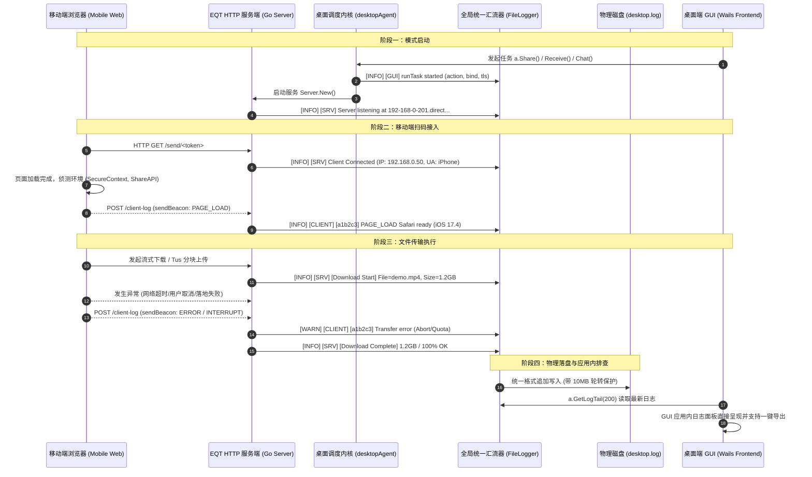

# EQT 跨端全链路统一遥测与日志回传系统架构设计方案
# (Cross-Platform Unified Telemetry & Logging Architecture Design)

> **版本**: v1.0  
> **状态**: 方案设计中 (Draft / Pending Implementation)  
> **作者**: EQT Core Team  
> **日期**: 2026-09-03  
> **目标**: 依据第一性原理（First Principle）与工业级日志最佳实践，打通桌面端调度内核、Go 服务端传输引擎、以及移动端（手机浏览器前端）的三端运行信息回传链路，实现统一汇流、结构化存储与 GUI 应用内快速诊断。

---

## 一、背景与现状痛点分析 (Context & Problem Statement)

当前 EQT 支持 Send（分享下载）、Receive（接收上传）、Chat（双向会话）三种核心局域网传输模式，并已上线基于自建权威 DNS 的官方通配符 LAN-TLS 回环加密（`*.direct.eqt.net.im`）。

但在用户排查网络传输问题、设备连接中断或移动端体验故障时，现有的日志体系存在以下**四大结构性断点（甚至处于黑洞状态）**：

```text
[移动端手机浏览器]          [Go HTTP 服务端]                [桌面 Agent 调度]          [GUI 桌面主进程]
  Safari / Chrome            server.Server                  desktopAgent              eqt-desktop.exe
         │                         │                              │                         │
         ├─ console.log(前端报错)  │                              │                         │
         │  (仅留在手机本地)       │                              │                         │
         │  ❌ 无回传通道          │                              │                         │
         │                         │                              │                         │
         │                         ├─ log.Printf(标准库)          │                         │
         │                         │  [Download Start / Chunk]    │                         │
         │                         │  ❌ 未重定向，全进 os.Stderr │                         │
         │                         │     (Windows GUI 无控制台丢弃)│                         │
         │                         │                              │                         │
         │                         │                              ├─ agent.log.Infof        │
         │                         │                              │  (Writer 为空，进 Stdout)│
         │                         │                              │  ❌ 同样丢失            │
         │                         │                              │                         │
         ▼                         ▼                              ▼                         ▼
┌───────────────────────────────────────────────────────────────────────────────────────────────┐
│                                 GUI 端 desktop.log (实际现状)                                  │
│                                                                                               │
│  - fileLogger.enabled 默认关闭（未勾选 DebugLog 则不写入）                                    │
│  - 仅记录 "EQT GUI Starting..." 和少量 Wails 内部启动日志                                     │
│  - 移动端接入、下载开始/进度/完成、上传分块、网络中断、手机端环境信息：100% 缺失！           │
└───────────────────────────────────────────────────────────────────────────────────────────────┘
```

### 具体断点清单：
1. **服务端核心业务日志断点（标准库未重定向）**：
   [`pkg/server/server.go`](../../pkg/server/server.go) 中包含了极其详尽的移动端接入、下载 Range、流式进度、完成状态（`[EQT Server] [Download Start]` 等），但均使用 Go 标准库 `log.Printf`。由于未调用 `log.SetOutput`，在 Windows GUI 运行时（`-H=windowsgui`），日志全部输出到无挂靠控制台的 `os.Stderr` 而被操作系统静默丢弃。
2. **桌面调度内核日志断点（Agent Writer 为空）**：
   [`desktop/gui/agent.go`](../../desktop/gui/agent.go) 中的 `agent.log` 使用 `logger.New(flags.Quiet)` 创建，其内部 `io.Writer` 为 `nil`，仅调用 `fmt.Printf`，同样在无控制台 GUI 环境下全部丢失。
3. **文件写入门槛过严（常态化运行不落盘）**：
   [`desktop/gui/main.go`](../../desktop/gui/main.go) 中 `FileLogger.enabled` 仅在 `DebugLog || DevMode` 为 true 时才开启。普通用户在遇到问题时，`desktop.log` 文件内空空如也，失去排查价值。
4. **移动端浏览器前端运行态失联**：
   移动端打开下载/上传页面时，手机浏览器的能力侦测（如 `isSecureContext`、`navigator.share` 支持）、用户点击行为、网络重试报错等只在移动端手机控制台打印，桌面端毫无感知。
5. **排查交互体验脱节**：
   GUI 端的日志项只能通过外部操作系统编辑器打开系统深处的 Cache 目录，缺乏应用内即时查看和一键复制排查报告的能力。

---

## 二、第一性原理与设计准则 (First Principles & Best Practices)

根据分布式与桌面端工程最佳实践，本方案确立以下核心设计原则：

1. **绝对非阻塞与零损耗 (Zero-Overhead & Non-Blocking)**：
   - 移动端浏览器上报必须采用 `navigator.sendBeacon`（或异步低优先级 `fetch`），页面卸载或挂起时不丢日志，且绝不抢占主传输带宽；
   - 服务端遥测接收端点必须在内存中快速校验（限制请求体 ≤ 32KB），通过无锁/轻量队列快速返回，响应时延 ≤ 1ms，绝不阻塞流式传输主线程。
2. **单一真理源与统一汇流 (Unified Log Sink)**：
   - 全局建立单一日志写入流，通过 `io.MultiWriter` 将 Go 标准库 `log`、`desktopAgent.log`、`server.Server` 业务日志以及移动端回传的 `[CLIENT-LOG]` 汇聚到统一的 `desktop.log`。
3. **常态化分级记录 (Layered & Always-On Baseline)**：
   - **基线级别（INFO / WARN / ERROR）常态化落盘**：无论用户是否开启调试开关，任何设备接入、传输启停、传输结果与报错都必须记录；
   - **调试级别（DEBUG / TRACE / RAW_PACKET）**：由 `DebugLog` 控制，防刷屏与性能损耗。
4. **统一结构化日志格式 (Structured Log Schema)**：
   统一遵循标准格式：
   `[时间戳] [级别] [来源] [会话/客户端ID] [类别] 消息内容 | key=value ... (设备上下文)`
5. **最小权限、脱敏与隐私安全 (Privacy & Security)**：
   - 严禁打印证书私钥、凭证签名、用户文件内私密内容；
   - URL Token 截断保留前后 6 位，文件名截断保留 60 字符；
   - 遥测端点实施单 IP 频率限制（Rate Limiting），防止恶意日志洪泛（Log Flooding）。
6. **存储配额与自动轮转 (Log Rotation & Quota Control)**：
   - 单文件上限 10MB，自动轮转保留 3 个归档（`desktop.log.1`、`desktop.log.2`），全局日志磁盘占用严格约束在 30MB 以内。

---

## 三、总体架构与链路设计 (System Architecture)



---

## 四、核心模块规格与详细实现方案

### 1. 移动端遥测探针规格 (Mobile Telemetry Client Probe)

在所有移动端页面模板（`pkg/pages/` 下的 `upload.tmpl.html`、`chat.tmpl.html` 及 Send 页面）中引入极轻量（< 2KB）的原生 JS 遥测探针模块 `telemetry.js`：

#### 1.1 探针接口定义
```javascript
// window.__eqt_telemetry
function reportLog(level, category, message, details = {}) {
    const payload = {
        client_id: getOrCreateClientID(), // 本地 sessionStorage 存储的 6 位随机串
        timestamp: Date.now(),
        level: level,                     // "INFO" | "WARN" | "ERROR"
        category: category,               // "PAGE_LOAD" | "ACTION" | "TRANSFER" | "SAVE" | "NETWORK"
        message: message,
        details: details,
        user_agent: navigator.userAgent
    };

    const blob = new Blob([JSON.stringify(payload)], { type: 'application/json' });
    if (navigator.sendBeacon) {
        navigator.sendBeacon('/client-log', blob);
    } else {
        fetch('/client-log', {
            method: 'POST',
            body: blob,
            keepalive: true,
            headers: { 'Content-Type': 'application/json' }
        }).catch(() => {});
    }
}
```

#### 1.2 关键埋点场景
1. **页面加载与能力指纹 (PAGE_LOAD)**：
   - 记录：`isSecureContext`（是否处于加密上下文）、`navigator.share`（是否支持系统分享保存）、屏幕尺寸、设备型号；
2. **下载与传输交互 (ACTION / TRANSFER)**：
   - 记录：用户点击“开始下载”、开始分块读取、首字节到达（TTFB）、传输完成；
3. **异常与网络抖动 (NETWORK / ERROR)**：
   - 记录：fetch 捕获的异常名称（如 `AbortError`、`TypeError: Failed to fetch`）、重试次数、IndexedDB 配额异常。

---

### 2. 服务端 `/client-log` 路由与防护规格 (Server Telemetry Endpoint)

在 `pkg/server/` 中新增 `telemetry.go`：

#### 2.1 路由契约
- **Path**: `POST /client-log`
- **CORS**: 允许任意源（移动端通过 IP 或 direct.eqt 域名均可跨域直连）；
- **Payload 约束**:
  - `Content-Length ≤ 32KB`；
  - 超出长度直接返回 413 Payload Too Large，保护内存。
- **速率控制 (Rate Limiting)**：
  - 维护基于令牌桶或滑动窗口的轻量客户端限流器：单客户端每秒最多接收 10 条日志，超限丢弃并返回 429。

#### 2.2 数据结构 (Go Struct)
```go
type ClientLogEntry struct {
    ClientID  string         `json:"client_id"`
    Timestamp int64          `json:"timestamp"`
    Level     string         `json:"level"`    // INFO, WARN, ERROR
    Category  string         `json:"category"` // PAGE_LOAD, ACTION, TRANSFER, SAVE, NETWORK
    Message   string         `json:"message"`
    Details   map[string]any `json:"details,omitempty"`
    UserAgent string         `json:"user_agent,omitempty"`
}
```

#### 2.3 写入逻辑
接收解析后，格式化为统一结构行：
`[2026-09-03 23:45:00.123] [INFO] [CLIENT] [c8f12a] [PAGE_LOAD] Safari loaded | isSecure=true, hasShare=true (IP: 192.168.0.50)`
并直接调用全局统一日志汇流器写入。

---

### 3. 全局统一日志汇流器重构 (Global Log Sink & Redirection)

#### 3.1 进程级标准库重定向
在 `desktop/gui/main.go` 的 `startWailsGUI()` 初始化入口中：
```go
// 1. 初始化 FileLogger，默认以常态化 INFO 级别开启写入（解除此前 debugLog 强制绑定的静默 bug）
fileLogger := NewFileLogger(logPath, true) // 常态化开启
fileLogger.SetMinLevel(LogLevelInfo)        // 默认记录 INFO 及以上，Debug 模式开放全部

// 2. 进程级标准库输出重定向
// 将整个进程内部 server.Server 中的 log.Printf / log.Println 汇聚入 desktop.log
log.SetOutput(io.MultiWriter(os.Stderr, fileLogger))

// 3. 桌面 Agent 日志桥接
app.agent.SetOutput(fileLogger)
```

#### 3.2 服务端访问日志中间件 (Access Log Middleware)
在 `pkg/server/server.go` 的 HTTP 路由入口包装轻量访问日志中间件：
对移动端访问的关键端点（`/send/`、`/receive/`、`/chat`、`/files/` 等），在连接建立时打印一行结构化 Access 日志：
`[2026-09-03 23:45:01.000] [INFO] [SRV] HTTP GET /send/token from 192.168.0.50 (200 OK)`
确保移动端一旦联网接入，服务端日志即刻留痕！

---

### 4. 日志轮转与物理存储保护 (Rotation & Quota Engine)

在 `desktop/gui/main.go` 的 `FileLogger` 中增加简单的尺寸轮转策略：
- 每次写入前（或按定时器检查），当 `desktop.log` 文件体积超过 10MB 时：
  1. 关闭当前文件句柄；
  2. 顺延移动：`desktop.log.1` -> `desktop.log.2`，`desktop.log` -> `desktop.log.1`；
  3. 创建新的 `desktop.log`；
  4. 保证磁盘占用上限恒为 ≤ 30MB。

---

### 5. GUI 端应用内诊断与日志查看面板 (In-App Log Viewer)

在桌面 GUI 中补充可视化查看通道：

#### 5.1 后端暴露 API (`desktop/gui/app.go`)
```go
// GetLogTail returns the last N lines of desktop.log for instant diagnosis.
func (a *App) GetLogTail(lines int) (string, error)

// ExportDiagnosticsZip packages desktop.log, crash reports, and environment info into a zip file.
func (a *App) ExportDiagnosticsZip() (string, error)
```

#### 5.2 前端呈现 (`desktop/gui/frontend/`)
- 在“设置”或“关于”面板中：
  - 点击“运行日志”，在应用内直接弹窗展示最新 200 行格式化日志（支持自动刷新与关键字过滤，如高亮 `[CLIENT]`、`[SRV]`、`[ERROR]`）；
  - 提供“一键复制”与“导出排查包”按钮，彻底免去用户去文件管理器翻找目录的烦恼。

---

## 五、实施里程碑路线图 (Implementation Milestones)

- [ ] **Phase 1: 服务端与桌面调度日志汇流 (Log Sink Pipeline)**
  - [ ] 改造 `desktop/gui/main.go`，执行 `log.SetOutput(io.MultiWriter(os.Stderr, fileLogger))`；
  - [ ] 改造 `desktopAgent.log`，将其日志输出重定向至 `fileLogger`；
  - [ ] 调整 `FileLogger` 策略为默认常态化落盘（INFO 及以上）。
- [ ] **Phase 2: 服务端 `/client-log` 端点与限流保护 (Server Telemetry)**
  - [ ] 在 `pkg/server/` 实现 `/client-log` 接口，支持 JSON 解析与安全限流；
  - [ ] 在 `pkg/server/server.go` 增加移动端接入 Access Log 中间件；
  - [ ] 编写 `/client-log` 单元测试与越界保护测试。
- [ ] **Phase 3: 移动端页面轻量遥测探针埋点 (Mobile Client Probe)**
  - [ ] 在 `upload.tmpl.html` 与 `send` 模板中注入 `telemetry.js`；
  - [ ] 捕获页面加载指纹、下载触发、分块异常与保存状态并异步回传；
  - [ ] 验证移动端在断网、弱网及页面关闭时的 `sendBeacon` 鲁棒性。
- [ ] **Phase 4: GUI 应用内日志查看与导出诊断 (In-App Log Viewer)**
  - [ ] 在 `desktop/gui/app.go` 实现 `GetLogTail(lines int)`；
  - [ ] 在前端 Settings / About 面板构建可视化日志浮层与一键复制功能；
  - [ ] 增加多语言翻译（支持 7 国语言）。
- [ ] **Phase 5: 全链路联调与回归验证 (E2E Verification)**
  - [ ] 在本地及 Windows 实机上启动 Send/Receive/Chat 模式；
  - [ ] 移动端扫码接入并触发下载，核验 `desktop.log` 中各端信息全量体现；
  - [ ] 验证日志轮转、跨平台单用户目录权限与性能指标。

---

## 六、总结与交付准则

通过本架构落地，EQT 将彻底告别“移动端失联”与“GUI 日志黑洞”，建立起透明、结构化、安全无感的各端运行信息回传链路。排查任何局域网互联或大文件传输故障时，只需打开应用内日志面板，即可实现秒级定位。
