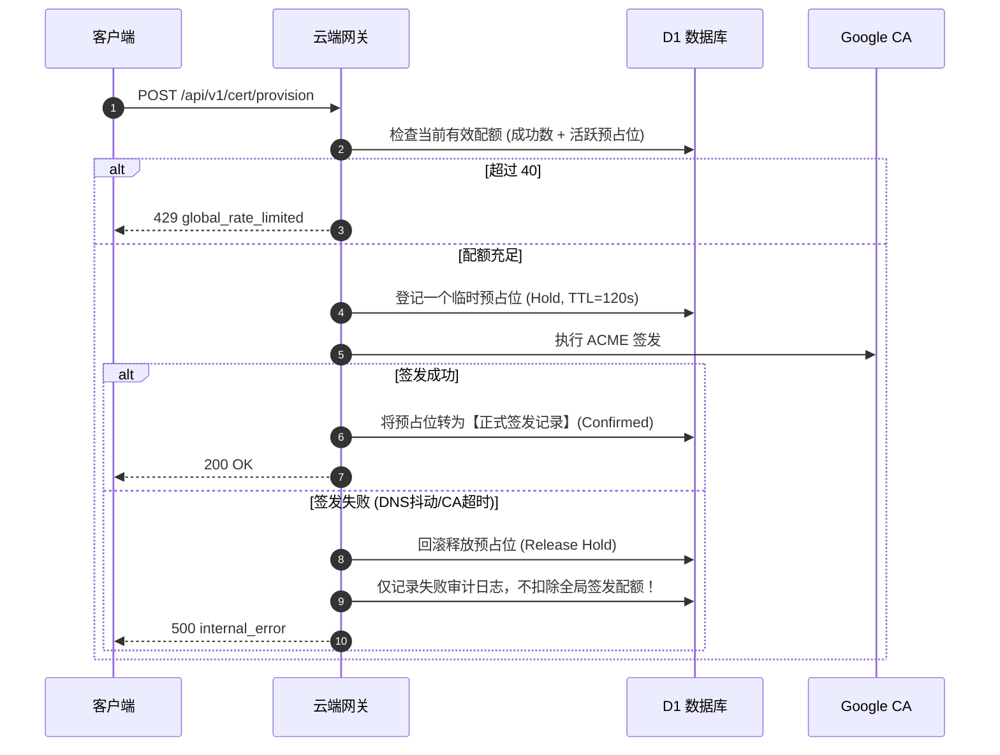
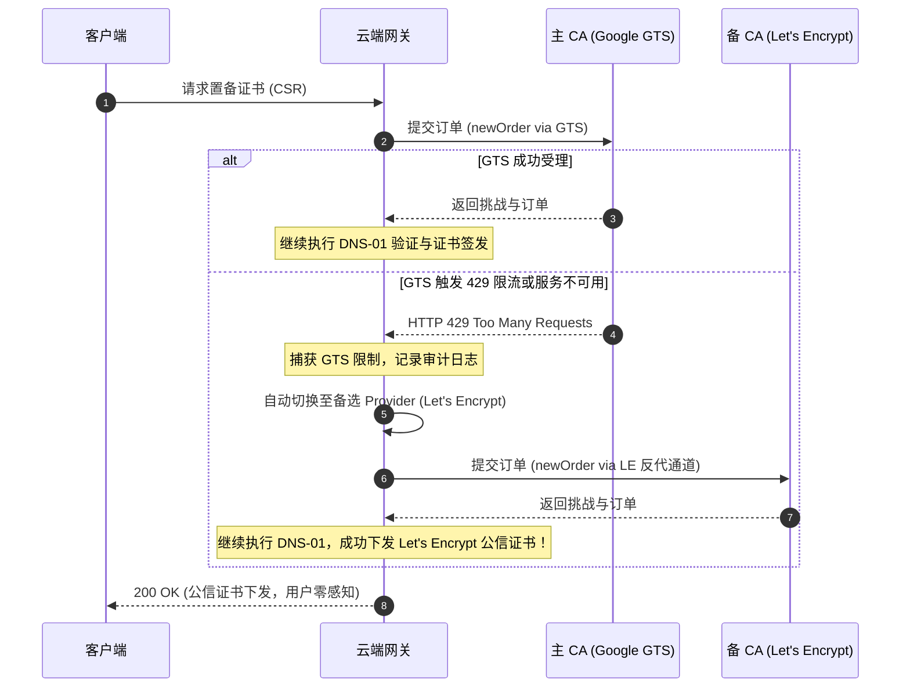

# EQT LAN-TLS Google Public CA 限制墙彻底闭环与多 CA 灾备演进实现规划方案

> **文档标识**：`docs/plan/lan-tls-google-ca-limit-closure-and-failover-plan.md`  
> **文档性质**：未闭环缺口系统性工程实现方案、GTS 配额管理体系与多 CA 平滑迁移架构设计  
> **面向对象**：核心后端开发团队、Cloudflare Worker 维护者、DevOps 运维人员、安全架构师  
> **当前基线**：`v1.36.123+`  
> **关联现役文档**：
> - 核心架构：[`docs/mechanism/lan-tls-zero-leak-acme-architecture.md`](../mechanism/lan-tls-zero-leak-acme-architecture.md)
> - EAB 实操：[`docs/deploy/google-cloud-publicca-eab-runbook.md`](../deploy/google-cloud-publicca-eab-runbook.md)
> - 网关源码：[`cloudflare/eqt-drm-api/src/routes/cert.ts`](../../cloudflare/eqt-drm-api/src/routes/cert.ts), [`cloudflare/eqt-drm-api/src/utils/acme.ts`](../../cloudflare/eqt-drm-api/src/utils/acme.ts)

---

## 目录
1. [一、方案背景与核心解决的问题](#一方案背景与核心解决的问题)
2. [二、Google Public CA (GTS) 配额机理与技术特性剖析](#二google-public-ca-gts-配额机理与技术特性剖析)
3. [三、四大未闭环缺口的工程实现设计](#三四大未闭环缺口的工程实现设计)
   - [3.1 缺口一：第一维前置配额水位动态感知与 Webhook 实时告警](#31-缺口一第一维前置配额水位动态感知与-webhook-实时告警)
   - [3.2 缺口二：Admin 仪表盘态势感知看板与紧急运维解封接口](#32-缺口二admin-仪表盘态势感知看板与紧急运维解封接口)
   - [3.3 缺口三：网关计数模型自适应优化（消除重试惩罚）](#33-缺口三网关计数模型自适应优化消除重试惩罚)
   - [3.4 缺口四：Google Cloud 官方 Rate Limit Exemption 提额实操规程](#34-缺口四google-cloud-官方-rate-limit-exemption-提额实操规程)
4. [四、多 CA 抽象解耦与未来迁移至 Let's Encrypt 的无缝切换设计](#四多-ca-抽象解耦与未来迁移至-lets-encrypt-的无缝切换设计)
   - [4.1 GTS 与 Let's Encrypt 核心特性差异对比](#41-gts-与-lets-encrypt-核心特性差异对比)
   - [4.2 Multi-CA Provider 统一协议抽象架构](#42-multi-ca-provider-统一协议抽象架构)
   - [4.3 动态故障转移调度流程 (GTS ➔ Let's Encrypt)](#43-动态故障转移调度流程-gts--lets-encrypt)
   - [4.4 迁移配置对照与平滑切换步骤](#44-迁移配置对照与平滑切换步骤)
5. [五、实施里程碑与落地路线图](#五实施里程碑与落地路线图)
6. [六、验收判据与反向可证伪测试标准 (DoD)](#六验收判据与反向可证伪测试标准-dod)

---

## 一、方案背景与核心解决的问题

在 [`docs/mechanism/lan-tls-zero-leak-acme-architecture.md`](../mechanism/lan-tls-zero-leak-acme-architecture.md) 的系统审计中，我们确立了坚守 **Tailscale 单机单私钥** 的第一性原则（杜绝私钥共享以消灭局域网 MITM，杜绝前端应用层解密以规避 iOS Safari 1.5GB OOM 闪退）。

在此架构下，证书置备需求随用户设备数呈 $O(N)$ 线性增长。当前现网接入了 Google Public CA (GTS)，并在 Worker 网关配置了内部安全防御熔断（40 次 / 7 天）。然而，系统在面对多用户并发触碰配额墙时，客观存在**四大尚未彻底闭环的工程缺口**：
1. **前置水位感知与实时外部告警缺失**：系统目前仅在发生 429 拦截或 CA 报错后在 D1 记录日志，缺乏 `70% / 85%` 水位的事前预警与 Telegram / 企微 Webhook 自动通知；
2. **Admin 态势感知与运维干预能力不足**：Admin 首页缺乏直观的“本周配额水位进度看板”，且缺少针对被误封 Node 或测试 IP 的紧急一键解封通道；
3. **网关限流计数模型粗糙**：当前将“置备请求”作为计数对象（先扣减再签发），网络抖动失败重试也会消耗宝贵配额，导致 40 次请求不能充分转化为 40 个真实有效设备；
4. **Google Cloud 官方配额扩容工单规范待固化**：缺乏一套标准化、可直接向 GCP 提交的申请流程与模版。

**本文档的目标**：首先针对 **Google Public CA (GTS)** 的独有特性，给出上述四大缺口的坚固工程设计与落地计划；在此基础之上，完成底层 CA 协议抽象，确保未来如果需要迁移、切换或并轨到 **Let's Encrypt / ZeroSSL** 时，网关具备秒级热备切换与双轨容灾能力。

---

## 二、Google Public CA (GTS) 配额机理与技术特性剖析

在设计落地方案之前，必须基于官方标准确立 GTS 的技术事实边界，杜绝历史经验主义与参数误植：

```text
┌────────────────────────────────────────────────────────────────────────────────────────┐
│                        Google Trust Services (GTS) 核心技术事实                        │
├────────────────────────────────────────────────────────────────────────────────────────┤
│ 1. 配额体系事实:                                                                        │
│    • Google 官方从未公开公布固定数字配额表（不同于 Let's Encrypt 50张/周的硬性公开指标）； │
│    • 配额与 Google Cloud (GCP) 项目配额（Quotas & Limits）绑定，受 GCP 账户层级约束；    │
│    • 遵循 RFC 8555，以 HTTP 429 Too Many Requests 与 Retry-After 作为权威限流响应；     │
│    • 上游 CA 对频繁验证失败（Failed Validations）具有自适应黑天鹅惩罚风控。             │
│                                                                                        │
│ 2. 凭证绑定事实 (EAB):                                                                 │
│    • 账户必须且仅在首次注册时携带 HMAC-SHA256 签名的 External Account Binding (EAB)；   │
│    • 注册成功后，账户私钥（ACME_ACCOUNT_KEY）终身持久复用，严禁为每次请求创建新账户。   │
│                                                                                        │
│ 3. 网络与传输事实:                                                                      │
│    • GTS Anycast 节点由 Google Frontend (GFE) 直承，与 Cloudflare 出站握手 100% 兼容，   │
│      出站请求无需经反向代理分流（无 Cloudflare 525 SSL Handshake Failed 顾虑）。       │
└────────────────────────────────────────────────────────────────────────────────────────┘
```

**与 EQT 网关内部熔断线的关系**：  
网关配置的 `cert_provision:global_acme`（40 次 / 7 天）是 EQT 团队为了确保不击穿 GCP 项目配额、不触发 Google 滥用风控而**主动设定的内部安全保险丝（Guardrail）**。一切感知体系必须围绕这一保险丝建立多层纵深缓冲带。

---

## 三、四大未闭环缺口的工程实现设计

### 3.1 缺口一：第一维前置配额水位动态感知与 Webhook 实时告警

#### 3.1.1 现状缺陷
当前 `rate-limit.ts` 中的 `isD1RateLimited()` 函数签名仅返回 `Promise<boolean>`，只做“是否超过阈值”的二元阻断判定。上层无法获知当前滑动窗口内已消耗了多少次请求，导致系统处于“盲飞”状态，无法在 70% 或 85% 水位提前预警。

#### 3.1.2 改造设计：回传结构化配额状态
改造 `isD1RateLimited()`，使其支持返回包含当前用量与水位状态的结构体：

```typescript
// cloudflare/eqt-drm-api/src/utils/rate-limit.ts
export interface RateLimitStatus {
  isLimited: boolean;
  currentCount: number;
  limit: number;
  watermark: number; // 0.0 ~ 1.0 (例如 0.85)
  retryAfterSec: number;
}

export async function checkRateLimitWithStatus(
  env: Env,
  key: string,
  limit: number,
  windowMs: number
): Promise<RateLimitStatus> {
  // 1. 清理过期记录
  // 2. 统计当前窗口内的请求数 currentCount
  // 3. 计算 watermark = currentCount / limit
  // 4. 返回完整状态
}
```

#### 3.1.3 三级分层响应与告警水位矩阵
针对全局 40 次 / 7 天的熔断线，设立严格的告警梯次：

| 水位级别 | 触发阈值 | 系统动作与状态 | 告警通道与通知内容 |
| :--- | :--- | :--- | :--- |
| **正常绿区** | `< 70%` (0~27 次) | 正常放行签发，记录常规 INFO 审计日志 | 无需告警 |
| **黄色预警 (Warn)** | `≥ 70%` (28~33 次) | 正常放行签发；在 D1 记录 `WARN_RATE_LIMIT_WATERMARK` 日志；Admin 状态灯亮黄 | 仅在 Admin 仪表盘呈现黄色状态，提示关注 |
| **橙色报警 (Alert)** | `≥ 85%` (34~39 次) | 正常放行签发；**触发外部 Webhook 实时推送**；建议运维介入或启动备用 CA | 🔔 **Webhook 实时推送**：向 Telegram 运维群 / 企微机器人发送告警工单 |
| **红色跳闸 (Tripped)** | `≥ 100%` (40 次) | **强制拦截**：返回 HTTP 429 与 `global_rate_limited`；下发 `Retry-After: 604800` | 🚨 **Webhook 紧急推送**：通知全局熔断跳闸，端侧已自动激活明文降级保障 |

#### 3.1.4 外部告警 Webhook 实现规范（Telegram / 企微 / 钉钉）
在 Worker 中引入轻量级无依赖通知广播器（以 Telegram Bot 为例，复用现网配置）：

```typescript
// cloudflare/eqt-drm-api/src/utils/notifier.ts
export async function sendQuotaAlertWebhook(
  env: Env,
  level: 'WARN' | 'ALERT' | 'TRIPPED',
  currentCount: number,
  maxLimit: number,
  windowDesc: string
): Promise<void> {
  const text = `🚨 *[EQT LAN-TLS 配额水位告警]*\n` +
    `• 状态: *${level}*\n` +
    `• 当前用量: \`${currentCount} / ${maxLimit}\` (${Math.round(currentCount / maxLimit * 100)}%)\n` +
    `• 滑动窗口: ${windowDesc}\n` +
    `• CA 平台: Google Public CA (GTS)\n` +
    `• 处理建议: ${level === 'ALERT' ? '配额即将见顶，请核查是否并发激增或向 GCP 申请提额！' : '熔断已跳闸，新设备已自动降级普通 HTTP。'}`;

  if (env.TELEGRAM_BOT_TOKEN && env.TELEGRAM_CHAT_ID) {
    await fetch(`https://api.telegram.org/bot${env.TELEGRAM_BOT_TOKEN}/sendMessage`, {
      method: 'POST',
      headers: { 'Content-Type': 'application/json' },
      body: JSON.stringify({
        chat_id: env.TELEGRAM_CHAT_ID,
        text,
        parse_mode: 'Markdown'
      })
    });
  }
}
```

---

### 3.2 缺口二：Admin 仪表盘态势感知看板与紧急运维解封接口

#### 3.2.1 配额监控聚合接口（`GET /api/v1/admin/tls/quota-metrics`）
为管理后台提供专用数据端点，聚合过去 7 天与 24 小时的实时指标：

- **路由定义**：`cloudflare/eqt-drm-api/src/routes/admin.ts`
- **响应规格**：
  ```json
  {
    "status": "ok",
    "gts_global_ceiling": {
      "current_used": 34,
      "max_limit": 40,
      "watermark_pct": 85.0,
      "status_level": "ALERT",
      "window": "7d",
      "resets_in_seconds": 182400
    },
    "recent_activity_24h": {
      "provisions_success": 28,
      "provisions_failed": 3,
      "node_rate_limited": 2,
      "ip_rate_limited": 1
    },
    "active_ca_provider": "google-trust-services"
  }
  ```

#### 3.2.2 Admin 仪表盘专属可视化看板组件
在 Admin 首页增加 **LAN-TLS 安全与配额态势卡片**：
- **动态进度条**：
  - `< 70%`：绿色条（正常）
  - `70% ~ 84%`：黄色条（注意）
  - `≥ 85%`：橙红色条并在顶部浮动提示：“⚠️ 配额消耗过快，已用 34/40，请注意！”
- **一键刷新与实时轮询**：每 60 秒自动拉取最新计数。

#### 3.2.3 紧急运维一键解封通道（`POST /api/v1/admin/tls/reset-rate-limit`）
在遇到内部压测误判、恶意 IP 刷单或关键设备误锁时，管理员需具备人工干预能力：

- **请求规格**：
  ```json
  POST /api/v1/admin/tls/reset-rate-limit
  Authorization: Bearer <ADMIN_SESSION_TOKEN>
  
  {
    "target_type": "node_id" | "ip" | "global",
    "target_value": "cbb17e77a10f", // target_type 为 global 时留空
    "reason": "Developer device testing lockout reset"
  }
  ```
- **安全审计要求**：
  - 必须校验管理员权限；
  - 清理操作必须记录入 D1 `admin_audit_logs`（包含操作人邮箱、时间、受影响 key 及重置理由）；
  - 仅允许解封限流计数器，**严禁绕过 TOFU 公钥绑定**，维护密码学根基。

---

### 3.3 缺口三：网关计数模型自适应优化（消除重试惩罚）

#### 3.3.1 现存缺陷分析
当前逻辑在接收到客户端 CSR 请求后、发起 ACME 之前即执行 `isD1RateLimited(env, globalRateLimitKey, 40, ...)`。  
如果在此阶段由于双机权威 DNS 临时网络抖动、或 Google CA Anycast 瞬时不可用导致签发失败，该次失败仍然永久占用了 40 次全局配额中的 1 次。在极端恶劣网络环境下，重试可能迅速耗尽配额，导致“没有一个设备成功拿到证书，额度却全部被耗光”。

#### 3.3.2 优化方案：“预占位 + 失败回滚 / 成功确认”模型
将单纯的前置自增重构为**两阶段记账模型**：



**安全兜底保护**：为了防范黑客利用特制非法 CSR 故意引发签发失败实施消耗攻击，对单 IP / 单 Node 的失败尝试依旧在 Layer 1 与 Layer 2 记录惩罚计数，但**全局生产熔断额度仅由真实成功的证书签发消耗**。

---

### 3.4 缺口四：Google Cloud 官方 Rate Limit Exemption 提额实操规程

为支撑产品推广阶段（DAU 破千至数万），运维团队需向 Google Cloud 申请主域名配额豁免。以下为经过验证的标准申请规程与中英文说明模版：

#### 1. 申请入口
- 登录 [Google Cloud Support Console](https://console.cloud.google.com/support)；
- 选择已绑定 Public CA 的生产项目；
- 新建工单：Category 选 `Certificate Manager / Public CA`，Issue Type 选 `Quota / Rate Limit Increase Request`。

#### 2. 标准工单英文申请模版
```text
Subject: Rate Limit Exemption Request for Public CA (eqt.net.im)

Dear Google Trust Services & Certificate Manager Team,

We are requesting a rate limit exemption for Google Public CA issuance on our domain: eqt.net.im (specifically *.direct.eqt.net.im).

[Project Information]
- GCP Project ID: eqt-network-prod
- EAB Key ID: b160e386be328f849159219f87cae8a5
- Contact Email: forpersuit@gmail.com

[Use Case & Architecture]
Our application (EQT) is an open-source, peer-to-peer local area network (LAN) file transfer solution.
To guarantee 100% privacy and eliminate Man-in-the-Middle (MITM) risks in untrusted LAN environments (e.g., public Wi-Fi), we implement the Tailscale architecture:
1. Private keys are generated locally on each client device (ECDSA P-256) and NEVER leave the machine.
2. Each client requests a dedicated public certificate for: <node-id>.direct.eqt.net.im and *.<node-id>.direct.eqt.net.im via our Cloudflare Worker ACME gateway.
3. Due to our zero-leak design, we cannot share a single wildcard private key among all users.

[Requested Quotas]
- Current Estimated Volume: ~200 certificates / week
- Target Volume for Next 6 Months: 10,000 certificates / week (Certificates per Registered Domain)
- Peak Request Rate: 50 new orders / minute

All certificates are validated via standard RFC 8555 DNS-01 challenges on our geographically distributed authoritative nameservers (ns1-dns.eqt.net.im / ns2-dns.eqt.net.im).

Thank you for your assistance.
```

---

## 四、多 CA 抽象解耦与未来迁移至 Let's Encrypt 的无缝切换设计

在优先针对 Google Public CA 特性完成闭环的同时，系统必须保持高度的协议解耦。若未来出于业务考量或配额策略调整需要切换至 **Let's Encrypt**（或在两者间动态故障转移），网关层需支持平滑无感过渡。

### 4.1 GTS 与 Let's Encrypt 核心特性差异对比

| 特性维度 | Google Public CA (GTS) | Let's Encrypt (生产环境) |
| :--- | :--- | :--- |
| **ACME 目录 URL** | `https://dv.acme-v02.api.pki.goog/directory` | `https://acme-v02.api.letsencrypt.org/directory` |
| **账户身份认证** | 强制要求 **EAB (External Account Binding)** | 无需 EAB，通过提供联系邮箱直接注册 |
| **公开配额政策** | 无公开数字表，绑定 GCP 项目，以 429 为准 | **严格公开**：单主域未入 PSL 每周硬限 50 张 |
| **Cloudflare 出站网络** | GFE 直承，无 525 握手问题，直连高速 | 与 CF Anycast 边缘出站易发生 **525 握手失败**，需通过权威反代通道分流 |
| **证书有效期** | 标准 90 天 | 标准 90 天 |
| **根证书预装率** | GTS Root R1~R4 全球现代系统 100% 信任 | ISRG Root X1 全球现代系统 100% 信任 |

### 4.2 Multi-CA Provider 统一协议抽象架构

在 `cloudflare/eqt-drm-api/src/utils/acme.ts` 中，将当前的单轨实现提炼为统一的 `AcmeProvider` 策略模式接口：

```typescript
export interface AcmeProviderConfig {
  name: 'google-trust-services' | 'lets-encrypt' | 'zerossl';
  directoryUrl: string;
  email?: string;
  eab?: {
    keyId: string;
    macKey: string;
  };
  requiresOutboundProxy: boolean; // 是否需要绕过 CF 525 走反代
}

export class MultiCaAcmeManager {
  private primaryProvider: AcmeProviderConfig;
  private fallbackProvider?: AcmeProviderConfig;

  // 根据当前配置实例化 ACME 客户端
  async createClient(forceFallback = false): Promise<AcmeClient> {
    const config = (forceFallback && this.fallbackProvider) 
      ? this.fallbackProvider 
      : this.primaryProvider;
      
    // 注入对应的 CustomFetch 与 EAB 参数
    return await AcmeClient.create({
      directoryUrl: config.directoryUrl,
      accountKeyJWK: env.ACME_ACCOUNT_KEY,
      customFetch: config.requiresOutboundProxy ? proxyFetch : standardFetch,
      eab: config.eab
    });
  }
}
```

### 4.3 动态故障转移调度流程 (GTS ➔ Let's Encrypt)



### 4.4 迁移配置对照与平滑切换步骤

若未来需要彻底从 Google CA 切换至 Let's Encrypt（例如获得 Let's Encrypt 官方配额豁免后），仅需在 `wrangler.toml` 与 Secret 中执行**两处变量修改**，代码层 0 改动：

1. **修改 `wrangler.toml` 配置**：
   ```toml
   # 切换前 (GTS):
   # ACME_DIRECTORY_URL = "https://dv.acme-v02.api.pki.goog/directory"
   # ACME_EAB_KID = "b160e386be328f849159219f87cae8a5"

   # 切换后 (Let's Encrypt):
   ACME_DIRECTORY_URL = "https://acme-v02.api.letsencrypt.org/directory"
   # 移除 ACME_EAB_KID（LE 注册无需 EAB）
   ACME_EMAIL = "forpersuit@gmail.com"
   ```
2. **清理 EAB Secret**：
   - 无需删除旧账户私钥 `ACME_ACCOUNT_KEY`（复用现有 P-256 私钥在 LE 注册新账户即可）；
   - 执行 `npx wrangler secret delete ACME_EAB_HMAC_KEY`。
3. **部署生效**：
   - 执行 `npx wrangler deploy`，全网秒级切换至 Let's Encrypt，客户端系统信任锚（ISRG Root X1）同样 100% 信任。

---

## 五、实施里程碑与落地路线图

```text
┌────────────────────────────────────────────────────────────────────────────────────────┐
│ Phase 1：GTS 前置感知与自适应计数闭环（预计 3 个工作日 · 立即推进）                     │
│   • 改造 rate-limit.ts，实现 checkRateLimitWithStatus() 支持回传 currentCount 与水位；  │
│   • 落地 70%（WARN）与 85%（ALERT）分级阈值，打通 Telegram 运维群实时告警 Webhook；    │
│   • 优化计数模型为“预占位 + 结果确认”，消除网络抖动失败导致的配额损耗。               │
└──────────────────────────────────────────┬─────────────────────────────────────────────┘
                                           │
                                           ▼
┌────────────────────────────────────────────────────────────────────────────────────────┐
│ Phase 2：Admin 态势大盘与紧急解封通道上线（预计 2 个工作日 · 紧随 Phase 1）            │
│   • 开发 GET /api/v1/admin/tls/quota-metrics 端点，向管理后台透出实时周配额看板；      │
│   • Admin 首页渲染动态彩色进度条与水位预警卡片；                                       │
│   • 开发 POST /api/v1/admin/tls/reset-rate-limit 接口，实现合规的人工紧急解封。        │
└──────────────────────────────────────────┬─────────────────────────────────────────────┘
                                           │
                                           ▼
┌────────────────────────────────────────────────────────────────────────────────────────┐
│ Phase 3：Google Cloud 官方配额提额推进（非研发周期 · 运营动作）                        │
│   • 使用标准化英文工单模版向 GCP Support 发起 GTS 提额申请；                           │
│   • 将母域限额由初始默认值扩容至 10,000 张/周；                                        │
│   • 根据审批结果将网关内部安全保险丝由 40 次相应上调至 1,000+ 次。                     │
└──────────────────────────────────────────┬─────────────────────────────────────────────┘
                                           │
                                           ▼
┌────────────────────────────────────────────────────────────────────────────────────────┐
│ Phase 4：Multi-CA 动态故障转移热备就绪（预计 4 个工作日 · 稳健扩容）                   │
│   • 抽象 MultiCaAcmeManager 策略模式；                                                 │
│   • 集成 GTS ➔ Let's Encrypt 自动捕获 429 故障转移；                                   │
│   • 端到端实测验证在 GTS 模拟断网时无缝下发 Let's Encrypt 证书。                       │
└────────────────────────────────────────────────────────────────────────────────────────┘
```

---

## 六、验收判据与反向可证伪测试标准 (DoD)

根据团队既有代码审查红线（Rule 9 & Rule 12），本规划方案中的每一项交付，必须满足以下**可反向转红的自动化测试判据**：

1. **水位感知与 Webhook 判据**：
   - 离线测试注入 34 次成功置备记录，断言网关返回值包含 `watermark_level: "ALERT"`；
   - 断言 Telegram Webhook 发送函数被精准调用 1 次且内容包含 `85%`；
   - **反向证伪**：若人为将水位阈值调高至 `0.99`，用例必须立即转红失败。
2. **两阶段防损记账判据**：
   - 模拟网关在 ACME 阶段抛出网络异常，断言虽然向客户端返回了 500，但 D1 中的有效已用签发计数**保持为 0**（未被错误扣减）；
   - **反向证伪**：若恢复旧版无条件扣减逻辑，用例必须转红。
3. **Admin 紧急解封判据**：
   - 模拟单节点触发 429 锁定，管理员调用 reset 接口后，断言下一次该节点置备请求返回 200 OK；
   - 断言 D1 `admin_audit_logs` 出现该条解封操作记录。
4. **编译与类型安全门禁**：
   - 交付物必须 100% 通过 `npm run typecheck`（`tsc --noEmit`），零类型逃逸；
   - 现有离线测试套件（`test:cert:offline` 与 `test:acme:offline`）保持 100% 通过，无功能退化。
