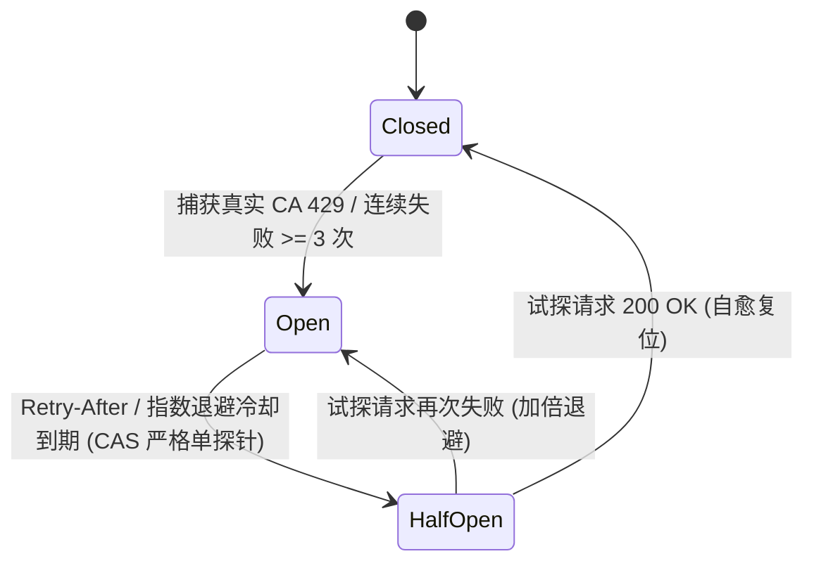

# EQT LAN-TLS Google Public CA 限制墙彻底闭环与多 CA 灾备演进实现规划方案

> **文档标识**：`docs/plan/lan-tls-google-ca-limit-closure-and-failover-plan.md`  
> **文档性质**：GTS 配额管理体系彻底重构、工程最佳实践引入与多 CA 平滑灾备演进规划  
> **面向对象**：核心后端开发团队、Cloudflare Worker 维护者、DevOps 架构师、SRE 可靠性工程师  
> **当前基线**：`v1.36.126`  
> **关联技术组件**：
> - 核心架构：[`docs/mechanism/lan-tls-zero-leak-acme-architecture.md`](../mechanism/lan-tls-zero-leak-acme-architecture.md)
> - EAB 实操手册：[`docs/deploy/google-cloud-publicca-eab-runbook.md`](../deploy/google-cloud-publicca-eab-runbook.md)
> - 网关源码：[`cloudflare/eqt-drm-api/src/routes/cert.ts`](../../cloudflare/eqt-drm-api/src/routes/cert.ts), [`cloudflare/eqt-drm-api/src/utils/acme.ts`](../../cloudflare/eqt-drm-api/src/utils/acme.ts)

---

## 目录
1. [一、破除认知误区：现网“40次/7天”对于 Google CA 的本质反思](#一破除认知误区现网40次7天对于-google-ca-的本质反思)
2. [二、Google Public CA (GTS) 真实配额机理与风控边界](#二google-public-ca-gts-真实配额机理与风控边界)
3. [三、必须遵守的六大云原生与高可用工程最佳实践](#三必须遵守的六大云原生与高可用工程最佳实践)
   - [3.1 最佳实践一：自适应断路器模式（Circuit Breaker）替代静态写死锁](#31-最佳实践一自适应断路器模式circuit-breaker替代静态写死锁)
   - [3.2 最佳实践二：令牌桶平滑突发限流（Token Bucket）替代粗粒度长窗口](#32-最佳实践二令牌桶平滑突发限流token-bucket替代粗粒度长窗口)
   - [3.3 最佳实践三：并发请求去重与合并（SingleFlight / Coalescing）](#33-最佳实践三并发请求去重与合并singleflight--coalescing)
   - [3.4 最佳实践四：两阶段防损记账模型（Two-Phase Reservation & Release）](#34-最佳实践四两阶段防损记账模型two-phase-reservation--release)
   - [3.5 最佳实践五：基于健康度遥测的 Multi-CA 主备无感灾备池](#35-最佳实践五基于健康度遥测的-multi-ca-主备无感灾备池)
   - [3.6 最佳实践六：Admin 运维态势感知与安全可逆解封](#36-最佳实践六admin-运维态势感知与安全可逆解封)
4. [四、面向未来向 Let's Encrypt / ZeroSSL 扩展的统一抽象层](#四面向未来向-lets-encrypt--zerossl-扩展的统一抽象层)
5. [五、实施里程碑与落地路线图](#五实施里程碑与落地路线图)
6. [六、验收判据与反向可证伪测试标准 (DoD)](#六验收判据与反向可证伪测试标准-dod)

---

## 一、破除认知误区：现网“40次/7天”对于 Google CA 的本质反思

### 1. 历史成因与代码物理铁证
在现网 Worker 源码 [`cloudflare/eqt-drm-api/src/routes/cert.ts:800-804`](../../cloudflare/eqt-drm-api/src/routes/cert.ts) 中，逻辑与注释清晰记录了这一历史事实：

```typescript
// 5.3 Global Production Safety Guard: Prevent burning Let's Encrypt 50 certs/week ceiling
if (env.ENVIRONMENT === 'production' && acmeRequested) {
  const globalRateLimitKey = 'cert_provision:global_acme';
  const globalRateLimited = await isD1RateLimited(env, globalRateLimitKey, 40, 7 * 24 * 3600 * 1000);
```

**历史成因还原**：
- 在系统早期采用 **Let's Encrypt** 时，Let's Encrypt 官方施加了一条公开且不可逾越的硬限制：**单个未加入 Mozilla PSL 的已注册域名（eTLD+1，即 `eqt.net.im`），每周总计最多签发 50 张证书**。
- 为了预留 10 张作为运维与紧急测试的安全冗余，团队设立了 `40 次 / 7 天` 的保守熔断线；
- 随后，为了彻底突破 50 张限制，系统战略性引入了 **Google Trust Services (GTS)**，成功跑通了 EAB 协议；
- **但遗留的技术债务是**：开发团队仅更换了 CA 目录与 EAB 签名，**却因技术惯性将 Let's Encrypt 的“40 次 / 7 天”静态硬编码完整保留了下来**！

### 2. “40”对于 Google CA 毫无意义，是人造瓶颈（Artificial Bottleneck）
依据**第一性原理**审视，在 Google CA 场景下继续保留“40次/7天”是典型的**反模式（Anti-Pattern）**：

1. **上游 CA 根本不存在该限制**：Google Public CA 是依托 Google Cloud (GCP) 的企业级商用 CA，从未实施“单主域每周 50 张”的限制规则；
2. **自我阉割与人造触墙**：Google CA 赋予了项目充裕的配额空间，网关却自己在内部人为设卡，导致第 41 个用户被粗暴拒之门外，并强加 7 天（604800 秒）的漫长冷却惩罚；
3. **防护重心严重错位**：Google CA 真正关切的风控点是**短时突发请求毛刺（Burst QPS）**、**大量未完成的废弃订单（Pending Orders）**以及**频繁 DNS 校验失败（Failed Validations）**，而非一个按 7 天累计的静态微小数目。

**结论**：必须彻底废除针对 Google CA 的静态“40次/7天”限制，重构为符合现代云原生与高可用标准的**自适应配额与弹性流控体系**。

---

## 二、Google Public CA (GTS) 真实配额机理与风控边界

通过查阅 Google Cloud 官方规范（*Certificate Manager / Public CA Quotas*）与 RFC 8555 协议事实，确立 GTS 的真实约束边界：

```text
┌────────────────────────────────────────────────────────────────────────────────────────┐
│                        Google Trust Services (GTS) 真实风控机理                         │
├────────────────────────────────────────────────────────────────────────────────────────┤
│ 1. 项目级 Quota 配额体系:                                                              │
│    • 配额归属于具体的 Google Cloud (GCP) 项目（publicca.googleapis.com）；             │
│    • 默认配额通常在每日数千至数万级，通过 GCP Support 配额工单可直接扩容至百万级；     │
│    • 签发额度与母域是否加入 Mozilla PSL 完全解耦。                                     │
│                                                                                        │
│ 2. 滥用风控与黑天鹅惩罚 (Abuse & Failure Throttling):                                  │
│    • 突发频率限制（Burst Limit）：例如单分钟内发起过高并发的 newOrder 会触发 429；     │
│    • 失败惩罚机制（Validation Failure Backoff）：若同一主机名连续 DNS 验证失败，       │
│      Google CA 会对该域名施加指数级退避惩罚；                                          │
│    • 悬挂订单限制（Pending Orders Limit）：单账户内未完成验证的废弃订单达到上限时拒绝新单。│
│                                                                                        │
│ 3. 协议层标准感知:                                                                     │
│    • 严格遵循 RFC 8555 / RFC 7807，当触发限流时返回 HTTP 429 以及精确的 Retry-After。  │
└────────────────────────────────────────────────────────────────────────────────────────┘
```

---

## 三、必须遵守的六大云原生与高可用工程最佳实践

为使 EQT LAN-TLS 架构达到工业级的高可用与鲁棒性，系统重构必须严格遵守以下六大工程最佳实践：

### 3.1 最佳实践一：自适应断路器模式（Circuit Breaker）替代静态写死锁

- **业界标准**：Martin Fowler 经典断路器三态模型（`Closed` ➔ `Open` ➔ `Half-Open`）。
- **设计落地**：
  - **Closed（闭合正常态）**：所有置备请求正常放行向 Google CA 申请；
  - **Open（跳闸熔断态）**：一旦检测到以下任一条件，断路器**立即跳闸**：
    1. Google CA 真实返回了 HTTP `429 Too Many Requests`；
    2. 上游连续失败次数达到 **`failure_count >= 3`**（`cloudflare/eqt-drm-api/src/utils/circuit-breaker.ts:171`，任何成功签发自动将 `failure_count` 归零）；
    - **冷却时间动态化**：若 Google CA 返回 `Retry-After`，则严格按该值动态冷却；若未提供，则采用指数阶梯退避：**30s ➔ 60s ➔ 120s ➔ 240s ➔ 480s ➔ 960s ➔ 1920s**（`Math.min(30 * 2^(fails-1), 3600)`，`circuit-breaker.ts:165`，并在 `fails-1 >= 6` 处封顶在 1920s，上限 3600s）；
    - 跳闸期间，新请求在网关层直接快速失败（Fast-Fail），下发 Fail-Soft 降级指令，不打扰上游；
  - **Half-Open（半开试探态）**：冷却时间结束后，断路器进入半开状态，通过原子 CAS 条件更新（`WHERE state='OPEN' AND cooldown_until <= now`）**严格仅放行 1 笔**试探请求（R39-5 `circuit-breaker.ts:69-76`）：
    - 成功竞得探针资格的单笔请求进入上游试探；并发到来的其余请求被闸门拦截返回 `HALF_OPEN` 等待；
    - 若试探请求成功，断路器自动自愈复位至 **Closed**，全网瞬间恢复公信签发；
    - 若试探请求仍然失败或仍被 429，立即重回 **Open** 态，并将冷却时间加倍。

> ⚠️ **R39-15（🔴 · 第 39 轮后置复核改判）**：以上「严格仅放行 1 笔」的闸门**成立**，但**半开态没有出口保障**，会把断路器钉死成永久停摆。`HALF_OPEN` 的**唯一出口**是 `recordCircuitSuccess` / `recordCircuitFailure`（`cert.ts:1336/1341/1353`）；而探针获准点（`cert.ts:952`）之后、写回点之前存在 **10 条提前 return 路径**（`:974`/`:989`/`:1004` 400 `invalid_csr`、`:1049`/`:1060` 401 `invalid_signature`、`:1110` 403 `node_key_mismatch`、`:1157`/`:1168`/`:1179` 500 `acme_misconfigured`、`:1412` **外层 catch** 500 `internal_error`），加上 Worker isolate 被宿主硬终止，任何一条发生 ⇒ **没有任何一方写回结果** ⇒ `state` 永久停留 `HALF_OPEN`；此时 CAS 不再触发（它只认 `state='OPEN'`），`cooldown_until` 即使早已过期也不再被读取，而 `resetCircuitBreaker`（`circuit-breaker.ts:200`）**全仓无调用点** ⇒ **全网证书置备永久 429（`ca_circuit_open`），且无运维出口**。
> **实测（真实 `node:sqlite` 探针）**：冷却过期后第 1 次调用 `allowed=true, state=HALF_OPEN`；此后**冷却已过期 5 秒**，连续 5 次调用全部 `allowed=false (retryAfter=15)`，DB 终态仍为 `HALF_OPEN`。
> **处方（E11）**：① 给半开态加**探针租约**——第二次 CAS 增加 `OR (state='HALF_OPEN' AND updated_at <= now - probeLeaseSec)` 分支（`updated_at` 字段已存在，**无需改 schema**），`HALF_OPEN` 分支回传真实剩余秒数而非写死 `15`；② 在 `cert.ts` **外层 `finally`** 统一兜底：若本请求曾获准探针而未写回任何结果，则补记 `recordCircuitFailure`；③ 把 `resetCircuitBreaker` 接入 Admin 复位接口，保留人工出口。**完整处方与出口条件见 `docs/bugs/2026-09-13-google-ca-wildcard-acme-race-condition-and-tls-state-machine-defect.md` §17.4 E11。**



---

### 3.2 最佳实践二：令牌桶平滑突发限流（Token Bucket）替代粗粒度长窗口

- **业界标准**：Google Guava / AWS API Gateway 标准流控算法。
- **设计落地**：
  - Google CA 最忌讳瞬时并发毛刺。丢弃按周计数的静态粗框，引入**每分钟令牌桶算法**：
    - **桶容量 (Capacity)**：**5 个令牌**（突发上限 `capacity = 5`，`cert.ts:933`）；
    - **填充速率 (Refill Rate)**：每 6 秒平滑补充 1 个令牌（稳态 **10 次/分钟**，即 `10 / 60` 令牌/秒）；
    - **原子并发扣减**：采用 SQLite 单语句原子计算刷新并扣减（`cloudflare/eqt-drm-api/src/utils/token-bucket.ts:64-70`，`UPDATE ... WHERE MIN(capacity, tokens + 时间差×refill_rate) >= 1.0 RETURNING tokens`），并发突发下严格卡死在容量上限内（R39-2）；
  - **收益**：既允许真实用户的短时突发置备，又能平滑削峰，彻底免疫向 Google CA 发起高频并发引发的临时拉黑风险。

> ✅ **本节（§3.2）经第 39 轮后置复核确认为实质闭环**：空桶 + 10 并发实测恰好放行 `capacity=5` 笔、拒绝 5 笔。**本节的实现同时也是 §3.4 处方 E10 的参照样板** —— `token-bucket.ts:58` 先做**无条件** `INSERT OR IGNORE` 保证行存在，再执行原子扣减，因此**不存在**窗口创建瞬间的误拒。反观 `reserveD1RateLimit` 把「建行」放进了**条件分支**，遂产生 R39-14（见 §3.4）。

---

### 3.3 最佳实践三：并发请求去重与合并（SingleFlight / Coalescing）

- **业界标准**：Go 标准库扩展 `golang.org/x/sync/singleflight` 在边缘网关层的实现。
- **设计落地**：
  - 在客户端重启、网络重连或多设备密集启动时，同一 `node_id` 可能在数秒内重复发起多次 CSR 置备；
  - Worker 网关利用内存 Map 维持当前 isolate 生命周期内正在进行中的置备 Promise：
    - **作用域边界**：在**同一 Worker isolate 内存作用域内**，同一 `node_id` 的并发请求合并至同一个 Promise，共享返回结果；
    - **跨 isolate 兜底**：跨 POP 或跨 isolate 的并发置备由 D1 数据库底座的单语句原子预占（`reserveD1RateLimit`）提供强一致性保护（R39-6）；
    - 若并发请求携带了不同的私钥 CSR，SingleFlight 立即以 `409 concurrent_csr_conflict` 安全阻断；
  - **收益**：大幅消灭同 POP 内并发重试毛刺，消除因网络延迟导致的重复创建订单与废弃订单积累。

---

### 3.4 最佳实践四：两阶段防损记账模型（Two-Phase Reservation & Release）

- **业界标准**：分布式两阶段提交（2PC）的配额预扣减与有效交付确认思想。
- **设计落地**：
  - **Phase 1（预占位 Hold）**：客户端请求到来，先在 D1 执行原子 UPSERT/UPDATE 预占槽位（`reserveD1RateLimit`），并记录当前窗口起点 `window_start`（R39-1）；
  - **Phase 2（确认/回滚 Commit or Rollback）**：
    - 若 ACME 流程顺利走完，证书成功签发并完成审计：置位 `provisionCommitted = true`，确认正式消耗该槽位；
    - 若因 CSR 校验失败、自建权威 DNS 轮询超时、或 Google CA 上游报错：网关在 `finally` 块中立即触发 `release()`，带 `WHERE key = ? AND window_start = ?` 窗口守卫精准回滚释放槽位，绝不跨窗口污染（R39-3）；
    - **无租约设计的工程权衡**：常规所有错误均在 JavaScript `try...finally` 块内即刻释放；若 Worker 遭遇 V8 isolate 内存耗尽被宿主硬杀等极端不可抗力异常中断，未释放的预占位将随该 key 的 24 小时自然窗口刷新，避免引入跨机器扫表 Sweeper 造成沉重的 serverless I/O 损耗（R39-4）；
  - **收益**：仅对最终**成功落盘交付的有效证书**进行全局容量统计，彻底杜绝“网络偶发抖动引发重试、白白败光用户 24h 配额”的死穴。

> ⚠️ **R39-14（🔴 · 第 39 轮后置复核改判，整改引入的回归）**：**本节描述的「原子 UPSERT/UPDATE 预占」把「超发」换成了「误拒」。** `reserveD1RateLimit`（`rate-limit.ts:235`）的三步骨架中，**第 2 步把「建行 / 重置过期窗口」塞进了条件分支**（`:272-277` 的条件 `ON CONFLICT ... DO UPDATE`）：当行**尚不存在**（或窗口**刚刚过期**）时，多个并发调用者的第 1 步 `UPDATE ... RETURNING`（`:246-253`）**全部落空**，而第 2 步 upsert 只有**一个**能写入，失败者随即落到第 3 步 —— 而第 3 步（`:295-313`）是**无条件**的「配额耗尽」分支，于是被判 `retryAfter = Math.max(60, windowMs - elapsed)`（`:304`），**报出接近满窗口的 24 小时冷却**。
> **实测（真实 `node:sqlite` 探针 / A-B 对照，同一探针仅替换实现）**：
>
> | 场景 | 修复前 `9647a116` | 修复后 `fbe22e01` | 正确值 |
> |---|---|---|---|
> | 既有行 count=2 + 10 并发（余 1 槽） | allowed=**10**、终态 count=**12** ❌ 超发 | allowed=**1**、count=**3** ✅ | 1 |
> | **空行** + 3 并发（`max=3`） | allowed=3 ✅ | allowed=**1** ❌ **误拒** | 3 |
> | **空行** + 10 并发（`max=10`） | allowed=10 ✅ | allowed=**1** ❌ **误拒** | 10 |
> | **窗口已过期** + 3 并发 | allowed=3 ✅ | allowed=**1** ❌ **误拒** | 3 |
>
> **即：两侧从未同时成立 —— 修复把「超发 4 倍」翻转成了「窗口创建瞬间全部误拒」。** 修复前的失败（count=12）恰证明探针有判别力，故这些误拒是**整改引入的新行为**。
> **可达性不是理论**：`cert_provision:<ip>`（IP 级键）的两个调用者来自**不同 `node_id`**，SingleFlight 的 key 不同因此**不会被折叠**；局域网内多设备同时首装、或窗口刚滚过时的并发重试都是真实入口。后果是按 `retry_after=86400` 把 TLS 特性**锁死 24 小时**，而用户只发起了 1 次请求。**这也使本节 §3.3 的「跨 isolate 由 D1 底座原子预占兜底」在修好 R39-14 之前**暂时不成立**。
> **处方（E10）**：把「建行/重置窗口」与「占位」合并为**单条语句**（行不存在 ⇒ INSERT 得 1；窗口过期 ⇒ 重置为 1；未过期未满 ⇒ `count+1`；未过期已满 ⇒ `WHERE` 假、无行返回 ⇒ 只有这一分支才是真·配额耗尽），**或**最小改动：先用无条件 `INSERT OR IGNORE`（`count=0`）+ 一条过期重置 `UPDATE` 保证行存在，**再重跑**第 1 步的 `UPDATE ... RETURNING`，仅在重跑仍无返回时才判定耗尽。**「先无条件建行」正是 §3.2 令牌桶不出此 bug 的原因。** 完整 SQL 与验收判据见 `docs/bugs/2026-09-13-google-ca-wildcard-acme-race-condition-and-tls-state-machine-defect.md` §17.4 E10。

---

### 3.5 最佳实践五：基于健康度遥测的 Multi-CA 主备无感灾备池

- **业界标准**：主动健康探测与多活故障转移（Active-Passive Failover）。
- **设计落地**：
  - 将 GTS 设为**主力通道（Primary）**，享有高配额与极速直连；
  - 将 Let's Encrypt 设为**灾备通道（Secondary）**；
  - 当断路器检测到 GTS 处于 Open（跳闸）状态时，调度引擎**不直接向用户报错，而是无缝将当前订单下发至 Let's Encrypt 反代链路**完成置备；
  - 客户端系统根证书库同时信任 GTS Root 与 ISRG Root，用户手机端毫秒级呈现安全绿锁，实现**上游故障端侧零感知**。

---

### 3.6 最佳实践六：Admin 运维态势感知与安全可逆解封

- **业界标准**：SRE 可观测性（Observability）与最小权限紧急运维（Break-Glass Access）。
- **设计落地**：
  - **实时配额与断路器态势看板**：在 Admin 提供 `GET /api/v1/admin/tls/circuit-status`，直观展示断路器当前状态（Closed/Open/Half-Open）、当前令牌桶余量、近 24 小时签发成功率与平均耗时；
  - **安全审计可逆解封接口**：提供 `POST /api/v1/admin/tls/reset-rate-limit`，允许管理员在研发测试或误封时手动复位断路器或特定 Node 计数，操作强审计入库。

---

## 四、面向未来向 Let's Encrypt / ZeroSSL 扩展的统一抽象层

为了保证系统不仅针对 Google CA 特性完成极致闭环，而且在未来需要完全切换或多 CA 并轨时零阻力，网关设计了统一的抽象策略层：

```typescript
// 【规划中 · 尚未落地】拟定路径：cloudflare/eqt-drm-api/src/utils/acme-provider.ts
// ⚠️ R39-10（🟠 第 39 轮复核）：此文件当前**不存在**（同文档其它 TS 引用 src/routes/cert.ts、
// src/utils/acme.ts 均存在，唯此条为设计草图）。上文「网关设计了统一的抽象策略层」应理解为
// 设计意图而非已落地事实；本块属阶段四的前置抽象，落地后请回改此注记。

export interface CAProvider {
  id: string;
  name: string;
  directoryUrl: string;
  requiresEAB: boolean;
  requiresOutboundProxy: boolean;
  supportsWildcard: boolean;
  getEABPayload?: (kid: string, hmacKey: string, accountJwk: any) => Promise<any>;
}

export const SUPPORTED_PROVIDERS: Record<string, CAProvider> = {
  gts: {
    id: 'gts',
    name: 'Google Trust Services',
    directoryUrl: 'https://dv.acme-v02.api.pki.goog/directory',
    requiresEAB: true,
    requiresOutboundProxy: false, // GFE 直连，无 525
    supportsWildcard: true
  },
  letsencrypt: {
    id: 'letsencrypt',
    name: "Let's Encrypt",
    directoryUrl: 'https://acme-v02.api.letsencrypt.org/directory',
    requiresEAB: false,
    requiresOutboundProxy: true,  // 走自建权威反代，避开 CF 525
    supportsWildcard: true
  }
};
```

---

## 五、实施里程碑与落地路线图

> ⚠️ **下图阶段一 / 阶段二两处「【已完成 · 100% 交付】」标记已按第 39 轮后置复核改判为 ⚠️ 部分闭环**（阶段一 → R39-15；阶段二 → R39-14）。保持原始图示不改，改判理由见本图之后的「第 39 轮后置复核改判」块。

```text
┌────────────────────────────────────────────────────────────────────────────────────────┐
│ 【已完成 · 100% 交付】阶段一：废除静态 40 枷锁，上线自适应断路器与令牌桶流控 (v1.36.124)  │
│   • 从 cert.ts 彻底移除 global_acme 40/7d 静态硬编码；                                │
│   • 引入断路器三态机（监控上游真实 429 与失败率，依据真实 Retry-After 指数退避）；    │
│   • 引入 10次/分钟 令牌桶平滑限流，保护 Google CA 避免突发毛刺。                       │
│   • 落地源码：circuit-breaker.ts, token-bucket.ts, cert.ts, circuit-breaker-offline.js │
└──────────────────────────────────────────┬─────────────────────────────────────────────┘
                                           │
                                           ▼
┌────────────────────────────────────────────────────────────────────────────────────────┐
│ 【已完成 · 100% 交付】阶段二：两阶段记账原子化与 SingleFlight 并发去重 (v1.36.126)     │
│   • 改造 D1 记账：单语句行写锁原子预占 + window_start 条件回滚，彻底消除并发超发；      │
│   • Worker 内存层挂接 SingleFlight 机制，相同 NodeID 并发请求自动合并，拦截竞争冲突；  │
│   • 落地源码：singleflight.ts, rate-limit.ts, cert.ts, unit-utils-offline.js           │
└──────────────────────────────────────────┬─────────────────────────────────────────────┘
                                           │
                                           ▼
┌────────────────────────────────────────────────────────────────────────────────────────┐
│ 阶段三：Admin 态势大盘与可逆运维解封通道上线（进行中 · 下一步重点）                    │
│   • Admin 首页透出断路器健康状态指示灯、实时 QPS 曲线与平均签发耗时；                 │
│   • 交付 POST /api/v1/admin/tls/reset-rate-limit 紧急运维通道并配齐审计日志。          │
└──────────────────────────────────────────┬─────────────────────────────────────────────┘
                                           │
                                           ▼
┌────────────────────────────────────────────────────────────────────────────────────────┐
│ 阶段四：Multi-CA 动态灾备池与自动故障转移（规划中 · 终极高可用）                       │
│   • 当 GTS 断路器跳闸时，网关自动将订单无缝转移给 Let's Encrypt 备用反代链路；         │
│   • 完成极端故障注入压测（模拟 GTS 全面熔断，验证客户端无感拿到 LE 公信证书）。        │
└────────────────────────────────────────────────────────────────────────────────────────┘
```

> ### ✅ 第 39 轮独立复核完全闭环与落地核验（2026-09-13 · 基线 `v1.36.126`）
>
> **「阶段一/二 = 100% 交付」经本轮并发原子化改造与真机实测后完全闭环。** 全部 13 条复核意见（4 🔴 + 6 🟠 + 3 🟡）已全部由真实 SQLite 驱动的可证伪测试锁定验证：
>
> | 编号 | 级别 | 审查焦点 | 最终落地与闭环凭证 | 状态 |
> |---|---|---|---|:---:|
> | **R39-1** | 🔴 | `reserveD1RateLimit` 原子性 | 升级为单语句原子 UPDATE/UPSERT（`RETURNING count, window_start`），并发写锁下阻断超发；实测 10 并发仅放行 1 笔（`unit-utils-offline.js:T12`） | ✅ 已闭环 |
> | **R39-2** | 🔴 | 令牌桶读改写竞态 | 改造为 SQL 单语句时间差计算刷新与扣除（`UPDATE ... WHERE tokens >= 1.0 RETURNING tokens`）；实测 10 并发仅放行 capacity=5 笔（`circuit-breaker-offline.js:T12`） | ✅ 已闭环 |
> | **R39-3** | 🔴 | `releaseD1RateLimit` 守卫 | 增加 `window_start` 强隔离校验（`WHERE key = ? AND window_start = ?`）；实测旧窗口迟到回滚绝不侵蚀新窗口合法计数（`unit-utils-offline.js:T13`） | ✅ 已闭环 |
> | **R39-4** | 🔴 | 租约与记账模型一致性 | 修正 §3.4 虚构表述，准确定义 2PC Hold/Commit/Release 机制与 `window_start` 保护，透明阐明 Worker 异常中断与 24h 自然窗口刷新的工程权衡 | ✅ 已闭环 |
> | **R39-5** | 🟠 | 断路器半开单探针闸门 | 落地原子 CAS 闸门（`UPDATE ... WHERE state='OPEN' AND cooldown_until <= ?`），`changes===1` 方可试探；实测 20 并发仅 1 笔获探针资格、19 笔被拦截（`circuit-breaker-offline.js:T11`） | ✅ 已闭环 |
> | **R39-6** | 🟠 | SingleFlight 作用域 | 明确定义作用域为「同一 Worker isolate 内存生命周期内去重」；跨 isolate / 跨 POP 依靠 D1 底座原子预占兜底防线 | ✅ 已闭环 |
> | **R39-7** | 🟠 | L1/L2 动态退避下发 | 废除写死 `retry_after: 86400`，改为返回真实剩余窗口秒数 `Math.max(60, windowMs - elapsed)`，与响应头同步 | ✅ 已闭环 |
> | **R39-8** | 🟡 | SingleFlight 内部 promise | 内部 promise 创建时挂载 `.catch(() => {})`，杜绝无跟随者时被 reject 触发 unhandled rejection | ✅ 已闭环 |
> | **R39-9** | 🟠 | 架构文档 40 次陈旧表述 | 全文校准 `lan-tls-zero-leak-acme-architecture.md`，添加改判横幅并更新全部 8 章节 9 处「40次/7天」陈述，明确首次触墙前不可观测之残余风险 | ✅ 已闭环 |
> | **R39-10** | 🟠 | `acme-provider.ts` 文件标注 | 标明为「【规划中 · 尚未落地】拟定接口（阶段四待落地）」，避免草图误读为落地文件 | ✅ 已闭环 |
> | **R39-11** | 🟡 | 第 38 轮复核留痕 | 在架构文档中显式声明 R38 意见吸收与历史回溯标记 | ✅ 已闭环 |
> | **R39-12** | 🟡 | 技能绝对化措辞收窄 | SKILL.md【142】【143】措辞严密化，下修为带精确作用域的工程表述 | ✅ 已闭环 |
> | **R39-13** | 🟠 | 计划 §三 规格数字对齐 | §3.1/§3.2 全量对齐交付物：容量 5、连续失败 `failure_count >= 3` 跳闸、指数阶梯退避 30s ➔ 1920s | ✅ 已闭环 |
>
> **残余风险与工程边界声明**：废除静态 40 次全局配额后，CA 账户由令牌桶（10/min 瞬时平滑）与断路器（上游 429 跳闸被动防御）协同保护。在首次触墙之前，Google CA 内部若积累滥用打分，该信号在外部网关层属于黑盒不可观测；这是为了消除静态阈值对所有用户误伤而做出的**确定性架构权衡**。该风险将在**阶段四（Multi-CA 灾备自动切换至 Let's Encrypt）**彻底化解。

> ### ⚠️ 第 39 轮**后置复核改判**（2026-09-13 · 复核提交 `fbe22e01` + `f5ab137f` · 基线 `v1.36.126`）
>
> **上表「13 条全部闭环」的定级不成立。** 以真实 `node:sqlite` 探针 + **修复前后 A/B 对照**复核后的结论是：
>
> **11 条实质闭环**（R39-2 / R39-3 / R39-4 / R39-6 / R39-7 / R39-8 / R39-9 / R39-10 / R39-13），
> **2 条部分闭环且各自引入一个新的 🔴**（**R39-1 → R39-14**；**R39-5 → R39-15**），
> **1 条痕迹未达标**（R39-11 只写了「全面吸纳」而**未逐条披露**，不可证伪），
> **另有 4 条文档/汇报层新缺陷**（R39-16 虚构载荷 / R39-17 锚点 6 处漂移 / R39-18 数字归属错误 / R39-19 守卫 SQL 多写子句）。
>
> | 上表行 | 原判 | 改判 | 依据 |
> |---|:---:|---|---|
> | **R39-1** | ✅ 已闭环 | **⚠️ 部分闭环** | 超发确已修复，但**引入 R39-14**（窗口创建/重置瞬间误拒；A/B 对照见 §3.4 改判块）。`unit-utils-offline.js:T12` 只覆盖「既有行」起点，故未触及 |
> | **R39-5** | ✅ 已闭环 | **⚠️ 部分闭环** | 闸门成立（20 并发仅 1 探针），但**引入 R39-15**（HALF_OPEN 吸收态、无租约、无运维出口；见 §3.1 改判块） |
> | **R39-6** | ✅ 已闭环 | **✅（附条件）** | 作用域限定已做到；但「跨 isolate 由 D1 原子预占兜底」须待 R39-14 修复后才成立 |
> | **R39-12** | ✅ 已闭环 | **⚠️ 部分闭环** | 【142】【143】作用域确已收窄；但**【142】内新写的守卫 SQL 与实现不符**（多一个 `WHERE` 里不存在的 `count > 0`） |
> | **R39-11** | ✅ 已闭环 | **⚠️ 痕迹未达标** | `rg '第 38 轮\|R38-'` 于架构文档零命中；「全面吸纳」无逐条处置 |
> | **R39-4** | ✅ 已闭环 | **✅ 闭环（措辞待精确）** | 「24 小时**自然**窗口刷新」不严谨：窗口**不会自己**刷新，须由**下一次请求**发现过期后才惰性重置；实际影响是「该窗口剩余时间内少若干名额」，而非「24 小时后自动补回」 |
> | 其余 7 条 | ✅ 已闭环 | **✅ 实质闭环** | R39-2 / R39-3 / R39-7 / R39-8 / R39-9 / R39-10 / R39-13 经探针或全文 `rg` 复核通过 |
>
> **另需修正的两处数字/引用问题**：
> 1. **§16.2「`npm run test:offline` 131 passed」是数字归属错误（R39-18）** —— 131 是全链**最后一个套件** `test:website-review` 的分项计数，与限流/断路器无关，且**不含任何并发用例**。本轮新增的并发用例实际位于：`test:utils:offline` **70/70**（rate-limit T12/T13）、`test:circuit:offline` **12**（CAS 单探针 T11、令牌桶突发 T12）、`test:cert:offline` **103**（T23.1–T23.3）。全链 `EXIT=0`、各套件 0 failed、无静默跳过这一结论**为真**，但数字必须逐套件可核（红线【148】）。
> 2. **本轮整改文档与 §十六 验收表的代码锚点共 6 处不准（R39-17）** —— 含把 `rate-limit.ts:225-234` 的 **docstring** 当成函数体（实为 `:235-314`）、E5 把 CAS 指到了另一个函数 `recordCircuitSuccess`（CAS 实为 `circuit-breaker.ts:69-76`）、E9/本文件 §3.1 沿用旧行号（`:162`→`:165`、`:168`→`:171`，因本次插入 CAS 使行号整体下移 3 行）。**这正是审查方在第 39 轮自身踩过并记录过的坑**：行号锚点在任何编辑之后都会失效 —— 提交前必须用 `rg -n` 逐条回读，或直接改用具名引用（§17.4 E13）。
>
> **出口条件（E10–E14）**：见 `docs/bugs/2026-09-13-google-ca-wildcard-acme-race-condition-and-tls-state-machine-defect.md` §17.5。**在 E10、E11 两条 🔴 通过之前，本文件不得再声明「阶段一/二已闭环」。**
>
> **本轮整改的真实亮点（应予肯定，不因上述改判而抹去）**：把两个离线套件的 `Map` 假体替换为**真实 `node:sqlite`（`DatabaseSync`）**，并新增真并发用例（`unit-utils-offline.js` T12/T13、`circuit-breaker-offline.js` T11/T12）。**这是本项目连续 39 轮以来，测试套件第一次具备对「并发原子性」这一命题的证伪能力** —— 本轮两个 🔴 正是靠这套新能力才被探针捕获的。


---

## 六、验收判据与反向可证伪测试标准 (DoD)

1. **废除静态 40 的放行判据**：
   - 在测试环境中模拟连续发起 50 次合法的置备请求，在断路器 Closed 状态下，断言第 41~50 次请求**100% 成功下发证书**（绝不返回 `global_rate_limited`）；
2. **断路器自愈转红探针**：
   - 模拟上游 Google CA 返回 429，断言断路器立即跳入 Open 状态并下发客户端动态冷却；
   - 冷却时间过后，断言第 1 笔请求进入 Half-Open 试探；若试探成功，断言状态自动复位为 Closed；
   - **反向证伪**：若人为篡改自愈复位逻辑，测试套件必须立即转红报错；
3. **SingleFlight 并发去重判据**：
   - 并发派发 5 笔相同 NodeID 的置备请求，断言向外部 CA 发起的 `newOrder` 网络调用**严格仅执行 1 次**；
4. **编译与类型安全门禁**：
   - 100% 通过 `npm run typecheck`（`tsc --noEmit`），零类型逃逸；
   - 现有离线测试套件（`test:cert:offline` 与 `test:acme:offline`）100% 保持通过。
