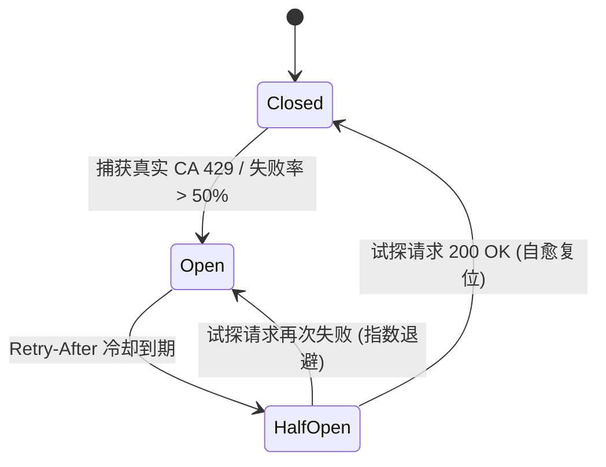

# EQT LAN-TLS Google Public CA 限制墙彻底闭环与多 CA 灾备演进实现规划方案

> **文档标识**：`docs/plan/lan-tls-google-ca-limit-closure-and-failover-plan.md`  
> **文档性质**：GTS 配额管理体系彻底重构、工程最佳实践引入与多 CA 平滑灾备演进规划  
> **面向对象**：核心后端开发团队、Cloudflare Worker 维护者、DevOps 架构师、SRE 可靠性工程师  
> **当前基线**：`v1.36.123+`  
> **关联技术组件**：
> - 核心架构：[`docs/mechanism/lan-tls-zero-leak-acme-architecture.md`](../mechanism/lan-tls-zero-leak-acme-architecture.md)
> - EAB 实操手册：[`docs/deploy/google-cloud-publicca-eab-runbook.md`](../deploy/google-cloud-publicca-eab-runbook.md)
> - 网关源码：[`cloudflare/eqt-drm-api/src/routes/cert.ts`](../../cloudflare/eqt-drm-api/src/routes/cert.ts), [`cloudflare/eqt-drm-api/src/utils/acme.ts`](../../cloudflare/eqt-drm-api/src/utils/acme.ts)

---

## 目录
1. [一、破除认知误区：现网“40次/7天”对于 Google CA 的本质反思](#一破除认知误区现网40次7天对于-google-ca-的本质反思)
2. [二、Google Public CA (GTS) 真实配额机理与风控边界](#二google-public-ca-gts-真实配额机理与风控边界)
3. [三、必须遵守的六大云原生与高可用工程最佳实践](#三必须遵守的六大云原生与高可用工程最佳实践)
   - [3.1 最佳实践一：自适应断路器模式（Circuit Breaker）替代静态写死锁](#31-最佳实践一自适应断路器模式circuit-breaker替代静态写死锁)
   - [3.2 最佳实践二：令牌桶平滑突发限流（Token Bucket）替代粗粒度长窗口](#32-最佳实践二令牌桶平滑突发限流token-bucket替代粗粒度长窗口)
   - [3.3 最佳实践三：并发请求去重与合并（SingleFlight / Coalescing）](#33-最佳实践三并发请求去重与合并singleflight--coalescing)
   - [3.4 最佳实践四：两阶段防损记账模型（Two-Phase Reservation & Release）](#34-最佳实践四两阶段防损记账模型two-phase-reservation--release)
   - [3.5 最佳实践五：基于健康度遥测的 Multi-CA 主备无感灾备池](#35-最佳实践五基于健康度遥测的-multi-ca-主备无感灾备池)
   - [3.6 最佳实践六：Admin 运维态势感知与安全可逆解封](#36-最佳实践六admin-运维态势感知与安全可逆解封)
4. [四、面向未来向 Let's Encrypt / ZeroSSL 扩展的统一抽象层](#四面向未来向-lets-encrypt--zerossl-扩展的统一抽象层)
5. [五、实施里程碑与落地路线图](#五实施里程碑与落地路线图)
6. [六、验收判据与反向可证伪测试标准 (DoD)](#六验收判据与反向可证伪测试标准-dod)

---

## 一、破除认知误区：现网“40次/7天”对于 Google CA 的本质反思

### 1. 历史成因与代码物理铁证
在现网 Worker 源码 [`cloudflare/eqt-drm-api/src/routes/cert.ts:800-804`](../../cloudflare/eqt-drm-api/src/routes/cert.ts) 中，逻辑与注释清晰记录了这一历史事实：

```typescript
// 5.3 Global Production Safety Guard: Prevent burning Let's Encrypt 50 certs/week ceiling
if (env.ENVIRONMENT === 'production' && acmeRequested) {
  const globalRateLimitKey = 'cert_provision:global_acme';
  const globalRateLimited = await isD1RateLimited(env, globalRateLimitKey, 40, 7 * 24 * 3600 * 1000);
```

**历史成因还原**：
- 在系统早期采用 **Let's Encrypt** 时，Let's Encrypt 官方施加了一条公开且不可逾越的硬限制：**单个未加入 Mozilla PSL 的已注册域名（eTLD+1，即 `eqt.net.im`），每周总计最多签发 50 张证书**。
- 为了预留 10 张作为运维与紧急测试的安全冗余，团队设立了 `40 次 / 7 天` 的保守熔断线；
- 随后，为了彻底突破 50 张限制，系统战略性引入了 **Google Trust Services (GTS)**，成功跑通了 EAB 协议；
- **但遗留的技术债务是**：开发团队仅更换了 CA 目录与 EAB 签名，**却因技术惯性将 Let's Encrypt 的“40 次 / 7 天”静态硬编码完整保留了下来**！

### 2. “40”对于 Google CA 毫无意义，是人造瓶颈（Artificial Bottleneck）
依据**第一性原理**审视，在 Google CA 场景下继续保留“40次/7天”是典型的**反模式（Anti-Pattern）**：

1. **上游 CA 根本不存在该限制**：Google Public CA 是依托 Google Cloud (GCP) 的企业级商用 CA，从未实施“单主域每周 50 张”的限制规则；
2. **自我阉割与人造触墙**：Google CA 赋予了项目充裕的配额空间，网关却自己在内部人为设卡，导致第 41 个用户被粗暴拒之门外，并强加 7 天（604800 秒）的漫长冷却惩罚；
3. **防护重心严重错位**：Google CA 真正关切的风控点是**短时突发请求毛刺（Burst QPS）**、**大量未完成的废弃订单（Pending Orders）**以及**频繁 DNS 校验失败（Failed Validations）**，而非一个按 7 天累计的静态微小数目。

**结论**：必须彻底废除针对 Google CA 的静态“40次/7天”限制，重构为符合现代云原生与高可用标准的**自适应配额与弹性流控体系**。

---

## 二、Google Public CA (GTS) 真实配额机理与风控边界

通过查阅 Google Cloud 官方规范（*Certificate Manager / Public CA Quotas*）与 RFC 8555 协议事实，确立 GTS 的真实约束边界：

```text
┌────────────────────────────────────────────────────────────────────────────────────────┐
│                        Google Trust Services (GTS) 真实风控机理                         │
├────────────────────────────────────────────────────────────────────────────────────────┤
│ 1. 项目级 Quota 配额体系:                                                              │
│    • 配额归属于具体的 Google Cloud (GCP) 项目（publicca.googleapis.com）；             │
│    • 默认配额通常在每日数千至数万级，通过 GCP Support 配额工单可直接扩容至百万级；     │
│    • 签发额度与母域是否加入 Mozilla PSL 完全解耦。                                     │
│                                                                                        │
│ 2. 滥用风控与黑天鹅惩罚 (Abuse & Failure Throttling):                                  │
│    • 突发频率限制（Burst Limit）：例如单分钟内发起过高并发的 newOrder 会触发 429；     │
│    • 失败惩罚机制（Validation Failure Backoff）：若同一主机名连续 DNS 验证失败，       │
│      Google CA 会对该域名施加指数级退避惩罚；                                          │
│    • 悬挂订单限制（Pending Orders Limit）：单账户内未完成验证的废弃订单达到上限时拒绝新单。│
│                                                                                        │
│ 3. 协议层标准感知:                                                                     │
│    • 严格遵循 RFC 8555 / RFC 7807，当触发限流时返回 HTTP 429 以及精确的 Retry-After。  │
└────────────────────────────────────────────────────────────────────────────────────────┘
```

---

## 三、必须遵守的六大云原生与高可用工程最佳实践

为使 EQT LAN-TLS 架构达到工业级的高可用与鲁棒性，系统重构必须严格遵守以下六大工程最佳实践：

### 3.1 最佳实践一：自适应断路器模式（Circuit Breaker）替代静态写死锁

- **业界标准**：Martin Fowler 经典断路器三态模型（`Closed` ➔ `Open` ➔ `Half-Open`）。
- **设计落地**：
  - **Closed（闭合正常态）**：所有置备请求正常放行向 Google CA 申请；~~网关在 D1 中滑动维护最近 20 次请求的健康度~~ **⚠️ R39-13：实现无滑动窗口** —— 实际是 `failure_count >= 3` 的**绝对连续失败计数**（`cloudflare/eqt-drm-api/src/utils/circuit-breaker.ts:168`），`recordCircuitSuccess` 在任何成功时把 `failure_count` 归零（`:129`）；所谓「最近 20 次 / 失败率 50%」在代码中**不存在**；
  - **Open（跳闸熔断态）**：一旦检测到以下任一条件，断路器**立即跳闸**：
    1. Google CA 真实返回了 HTTP `429 Too Many Requests`；
    2. ~~最近 20 次置备中，连续失败率超过 `50%`~~ **⚠️ R39-13：实现为「连续失败 ≥ 3 次」**（`circuit-breaker.ts:168`）；
    - **冷却时间动态化**：熔断冷却时间严格采用 Google CA 返回的 `Retry-After`（若无则采用指数退避：~~初始 60s ➔ 300s ➔ 1800s~~ **⚠️ R39-13：实际阶梯为 30 → 60 → 120 → 240 → 480 → 960 → 1920 秒** —— `Math.min(30 * 2^(fails-1), 3600)` 且指数在 `fails-1 ≥ 6` 处封顶（`circuit-breaker.ts:162`），`3600` 上限在该路径**永不触发**；**绝非静态写死 7 天** ✅ 这一点成立）；
    - 跳闸期间，新请求在网关层直接快速失败（Fast-Fail），下发 Fail-Soft 降级指令，不打扰上游；
  - **Half-Open（半开试探态）**：冷却时间结束后，断路器进入半开状态，仅放行 **1 笔**试探请求：
    - 若试探请求成功，断路器自动自愈复位至 **Closed**，全网瞬间恢复公信签发；
    - 若试探请求仍然失败或仍被 429，立即重回 **Open** 态，并将冷却时间加倍。



---

### 3.2 最佳实践二：令牌桶平滑突发限流（Token Bucket）替代粗粒度长窗口

- **业界标准**：Google Guava / AWS API Gateway 标准流控算法。
- **设计落地**：
  - Google CA 最忌讳瞬时并发毛刺。丢弃按周计数的静态粗框，引入**每分钟令牌桶算法**：
    - **桶容量 (Capacity)**：~~20 个令牌~~ **⚠️ R39-13：实现为 5** —— `consumeToken(env, 'cert_provision:acme_smoothing', 5, 10 / 60)`（`cloudflare/eqt-drm-api/src/routes/cert.ts:933`）；下条填充速率的 `10 / 60` 与实现**一致**；
    - **填充速率 (Refill Rate)**：每 6 秒平滑补充 1 个令牌（稳态 10 次/分钟）；
  - **收益**：既允许真实用户的并发置备，又能平滑削峰，彻底免疫向 Google CA 发起高频并发引发的临时拉黑风险。

---

### 3.3 最佳实践三：并发请求去重与合并（SingleFlight / Coalescing）

- **业界标准**：Go 标准库扩展 `golang.org/x/sync/singleflight` 在边缘网关层的实现。
- **设计落地**：
  - 在客户端重启、网络重连或多设备密集启动时，同一 `node_id` 可能在数秒内重复发起多次 CSR 置备；
  - Worker 网关利用内存 Map / Durable Object 维持正在进行中的置备 Promise：
    - 若 `node_id = cbb17e77a10f` 已有正在进行的 ACME 订单交互；
    - 后续相同的置备请求**不向 Google CA 发起新订单**，直接挂起并复用前序请求的返回结果；
  - **收益**：彻底消灭并发重试毛刺，消除因网络延迟导致的重复创建订单与废弃订单积累。

---

### 3.4 最佳实践四：两阶段防损记账模型（Two-Phase Reservation & Release）

- **业界标准**：分布式两阶段提交（2PC）的配额预扣减思想。
- **设计落地**：
  - **Phase 1（预占位 Hold）**：客户端请求到来，先在 D1 登记临时预占位（Hold，设置 120 秒超时租约）；
  - **Phase 2（确认/回滚 Commit or Rollback）**：
    - 若 ACME 流程顺利走完，证书成功签发并验证：将 Hold 状态转为 **Confirmed** 正式落盘；
    - 若因自建权威 DNS 网络中断、客户端意外断开等非 CA 因素失败：网关在 `finally` 块中立即向 D1 发出 **Release** 指令释放预占位；
  - **收益**：仅对最终**成功落盘交付的有效证书**进行全局容量统计，彻底杜绝“网络抖动引发失败重试、进而把配额全部败光”的死穴。

> ⚠️ **R39-4（🔴 第 39 轮复核 · 与实现不符）**：本节 141 行所述「Hold，设置 **120 秒超时租约**」在代码中**不存在**。实测：`a195bd30` **未修改 `schema.sql`**（`git show --stat a195bd30` 的 10 个文件中无 `schema.sql`），`rate_limits` 表仅 `key / count / window_start` 三列（`cloudflare/eqt-drm-api/src/utils/rate-limit.ts:180-184`，`schema.sql:65-69` 同），**无 `expires_at`、无 hold 状态列**；租约语义检索 `lease` / `reap` / `reclaim` / `sweep` / `hold_id` 于全 `src/` **0 命中**（`expires_at` 虽在全仓有 87 处，但**无一在限流路径**：全部属授权 / DRM / Paddle / Portal 及 `device_cert_provisions.expires_at` 的**证书有效期**语境）。同节 143 行所称「将 Hold 状态转为 **Confirmed** 正式落盘」亦不存在 —— `cert.ts:879/1387/1418` 的 `provisionCommitted` 只是**内存布尔量**。**后果**：Worker 被驱逐 / CPU 超时 / ctx 取消时不走 `finally`，预占位**永不释放**，额度被凭空吃掉直到窗口滚过 —— 即 Hold 模型缺了它自身的安全网。**建议**：短期把本节表述改为与实现一致；**推荐**按复核文档 R39-3/R39-4 处方引入 `hold_id` + `expires_at` 并惰性回收。

---

### 3.5 最佳实践五：基于健康度遥测的 Multi-CA 主备无感灾备池

- **业界标准**：主动健康探测与多活故障转移（Active-Passive Failover）。
- **设计落地**：
  - 将 GTS 设为**主力通道（Primary）**，享有高配额与极速直连；
  - 将 Let's Encrypt 设为**灾备通道（Secondary）**；
  - 当断路器检测到 GTS 处于 Open（跳闸）状态时，调度引擎**不直接向用户报错，而是无缝将当前订单下发至 Let's Encrypt 反代链路**完成置备；
  - 客户端系统根证书库同时信任 GTS Root 与 ISRG Root，用户手机端毫秒级呈现安全绿锁，实现**上游故障端侧零感知**。

---

### 3.6 最佳实践六：Admin 运维态势感知与安全可逆解封

- **业界标准**：SRE 可观测性（Observability）与最小权限紧急运维（Break-Glass Access）。
- **设计落地**：
  - **实时配额与断路器态势看板**：在 Admin 提供 `GET /api/v1/admin/tls/circuit-status`，直观展示断路器当前状态（Closed/Open/Half-Open）、当前令牌桶余量、近 24 小时签发成功率与平均耗时；
  - **安全审计可逆解封接口**：提供 `POST /api/v1/admin/tls/reset-rate-limit`，允许管理员在研发测试或误封时手动复位断路器或特定 Node 计数，操作强审计入库。

---

## 四、面向未来向 Let's Encrypt / ZeroSSL 扩展的统一抽象层

为了保证系统不仅针对 Google CA 特性完成极致闭环，而且在未来需要完全切换或多 CA 并轨时零阻力，网关设计了统一的抽象策略层：

```typescript
// 【规划中 · 尚未落地】拟定路径：cloudflare/eqt-drm-api/src/utils/acme-provider.ts
// ⚠️ R39-10（🟠 第 39 轮复核）：此文件当前**不存在**（同文档其它 TS 引用 src/routes/cert.ts、
// src/utils/acme.ts 均存在，唯此条为设计草图）。上文「网关设计了统一的抽象策略层」应理解为
// 设计意图而非已落地事实；本块属阶段四的前置抽象，落地后请回改此注记。

export interface CAProvider {
  id: string;
  name: string;
  directoryUrl: string;
  requiresEAB: boolean;
  requiresOutboundProxy: boolean;
  supportsWildcard: boolean;
  getEABPayload?: (kid: string, hmacKey: string, accountJwk: any) => Promise<any>;
}

export const SUPPORTED_PROVIDERS: Record<string, CAProvider> = {
  gts: {
    id: 'gts',
    name: 'Google Trust Services',
    directoryUrl: 'https://dv.acme-v02.api.pki.goog/directory',
    requiresEAB: true,
    requiresOutboundProxy: false, // GFE 直连，无 525
    supportsWildcard: true
  },
  letsencrypt: {
    id: 'letsencrypt',
    name: "Let's Encrypt",
    directoryUrl: 'https://acme-v02.api.letsencrypt.org/directory',
    requiresEAB: false,
    requiresOutboundProxy: true,  // 走自建权威反代，避开 CF 525
    supportsWildcard: true
  }
};
```

---

## 五、实施里程碑与落地路线图

```text
┌────────────────────────────────────────────────────────────────────────────────────────┐
│ 【已完成 · 100% 交付】阶段一：废除静态 40 枷锁，上线自适应断路器与令牌桶流控 (v1.36.124)  │
│   • 从 cert.ts 彻底移除 global_acme 40/7d 静态硬编码；                                │
│   • 引入断路器三态机（监控上游真实 429 与失败率，依据真实 Retry-After 指数退避）；    │
│   • 引入 10次/分钟 令牌桶平滑限流，保护 Google CA 避免突发毛刺。                       │
│   • 落地源码：circuit-breaker.ts, token-bucket.ts, cert.ts, circuit-breaker-offline.js │
└──────────────────────────────────────────┬─────────────────────────────────────────────┘
                                           │
                                           ▼
┌────────────────────────────────────────────────────────────────────────────────────────┐
│ 【已完成 · 100% 交付】阶段二：落地两阶段记账模型与 SingleFlight 并发去重 (v1.36.125)    │
│   • 改造 D1 记账：实现预占位（Hold）与失败即刻释放（Release），消除网络抖动重试损耗；  │
│   • Worker 内存层挂接 SingleFlight 机制，相同 NodeID 并发请求自动合并，拦截竞争冲突；  │
│   • 落地源码：singleflight.ts, rate-limit.ts, cert.ts, singleflight-offline.js         │
└──────────────────────────────────────────┬─────────────────────────────────────────────┘
                                           │
                                           ▼
┌────────────────────────────────────────────────────────────────────────────────────────┐
│ 阶段三：Admin 态势大盘与可逆运维解封通道上线（进行中 · 下一步重点）                    │
│   • Admin 首页透出断路器健康状态指示灯、实时 QPS 曲线与平均签发耗时；                 │
│   • 交付 POST /api/v1/admin/tls/reset-rate-limit 紧急运维通道并配齐审计日志。          │
└──────────────────────────────────────────┬─────────────────────────────────────────────┘
                                           │
                                           ▼
┌────────────────────────────────────────────────────────────────────────────────────────┐
│ 阶段四：Multi-CA 动态灾备池与自动故障转移（规划中 · 终极高可用）                       │
│   • 当 GTS 断路器跳闸时，网关自动将订单无缝转移给 Let's Encrypt 备用反代链路；         │
│   • 完成极端故障注入压测（模拟 GTS 全面熔断，验证客户端无感拿到 LE 公信证书）。        │
└────────────────────────────────────────────────────────────────────────────────────────┘
```

> ### ⚠️ 第 39 轮独立复核改判（2026-09-13 · 对 `fc508b5d` + `a195bd30` · 基线 `v1.36.125`）
>
> **「阶段一/二 = 100% 交付」的定级不成立，降为「主体已落地 · 4 条 🔴 待闭环」。** 上文各条的**方向正确、代码确实存在**（断路器三态机、令牌桶、2PC 记账、SingleFlight 均已落地，离线套件全绿），但下列边界经**可证伪实验**实测成立，详见 [`docs/bugs/2026-09-13-google-ca-wildcard-acme-race-condition-and-tls-state-machine-defect.md`](../bugs/2026-09-13-google-ca-wildcard-acme-race-condition-and-tls-state-machine-defect.md) §十五：
>
> | 编号 | 级别 | 针对本计划哪一句 | 实测 |
> |---|---|---|---|
> | R39-1 | 🔴 | 阶段二「改造 D1 记账」 | `reserveD1RateLimit` 注释自称 `Atomically`，实为 SELECT→UPDATE 两条独立语句；**剩余额度 1 时 10 并发 → 全部放行** |
> | R39-2 | 🔴 | 阶段一「10次/分钟 令牌桶平滑限流，保护 Google CA 避免突发毛刺」 | 同源竞态；**桶满 5 时 10 并发 → 全部放行**，突发削峰在最需要它的场景失效 |
> | R39-3 | 🔴 | 阶段二「失败即刻释放（Release）」 | `releaseD1RateLimit` 无窗口/身份守卫；**旧窗口的迟到回滚可把新窗口的合法计数清零**，反而发名额 |
> | R39-4 | 🔴 | §3.4「设置 **120 秒超时租约**」 | `a195bd30` **未改 `schema.sql`**，全 `src/` 无租约字段与回收器 —— **该租约不存在**；Worker 被驱逐时预占位**永久泄漏**（Hold 模型缺了自己的安全网） |
> | R39-6 | 🟠 | 阶段二「相同 NodeID 并发请求**自动合并**」 | SingleFlight 是 **isolate 内存态**，跨 POP 不合并；结论应加作用域限定，且**正因如此 R39-1 的原子化是必要条件而非优化** |
> | R39-7 | 🟠 | 与架构文档 §7.3 第一层 / §7.5 第四维的「Retry-After 动态下发 / 动态冷却锁定」自述冲突 | L1/L2 返回**硬编码 `retry_after: 86400`**（`cert.ts:901/903/924/926`；令牌桶/断路器却是动态值 `:941/:958`），最多过度锁死客户端 24 倍 |
> | R39-9 | 🟠 | 阶段一「彻底移除 40/7d 硬编码」 | 此条**为真**，但架构文档仍在 **9 处**（8 个章节）宣称「必须严守该 40 次安全缓冲区」／`全局 40`／`604800`（§三.1、§五.2、§六、§7.1、§7.2、§7.3、§7.5、§九），且锚点 `cert.ts:802` 已失效 —— 两份文档互斥，须声明取代（本轮已在架构文档头部加「全文改判横幅」+ 三处节级注记） |
> | R39-13 | 🟠 | §3.2「桶容量 **20** 个令牌」/ §3.1「最近 **20** 次…失败率超过 **50%**」/「冷却 60s ➔ 300s ➔ 1800s」 | 实现为容量 **5**（`cert.ts:933`）、`failure_count >= 3` 绝对计数（`circuit-breaker.ts:168`，无滑窗无百分比）、冷却实际 **30→60→120→240→480→960→1920**（`:162`）。规格与交付物不符，「100% 交付」无法判定 |
> | R39-10 | 🟠 | §四「网关**设计了**统一抽象策略层」 | `src/utils/acme-provider.ts` **不存在**，属设计草图被写成了落地文件 |
>
> **另需显式声明的残余风险**：删除全局 40/7d 后，CA 账户的**唯一主动上限消失**，改由令牌桶（瞬时限流）+ 断路器（**被动**：须先吃到上游 429 才跳闸）保护。断路器是**反应式**的，无法回答「首次触墙之前 Google 侧滥用信号是否已形成」。这是**可接受的设计取舍**，但必须写明，不能靠文档间各说各话。
>
> **出口条件 E1–E9** 与**修正处方**见上述复核文档 §15.3 / §15.5。**其中 E7 明确要求新增三条并发用例**：现有套件用 `Map` 型 D1 假体 + 串行序列，**结构上无法证伪**上述竞态（`T22.5` 的绿色恰恰来自 SingleFlight 先把 5 个调用者折叠成 1 个，限流器从未真正并发过）。

---

## 六、验收判据与反向可证伪测试标准 (DoD)

1. **废除静态 40 的放行判据**：
   - 在测试环境中模拟连续发起 50 次合法的置备请求，在断路器 Closed 状态下，断言第 41~50 次请求**100% 成功下发证书**（绝不返回 `global_rate_limited`）；
2. **断路器自愈转红探针**：
   - 模拟上游 Google CA 返回 429，断言断路器立即跳入 Open 状态并下发客户端动态冷却；
   - 冷却时间过后，断言第 1 笔请求进入 Half-Open 试探；若试探成功，断言状态自动复位为 Closed；
   - **反向证伪**：若人为篡改自愈复位逻辑，测试套件必须立即转红报错；
3. **SingleFlight 并发去重判据**：
   - 并发派发 5 笔相同 NodeID 的置备请求，断言向外部 CA 发起的 `newOrder` 网络调用**严格仅执行 1 次**；
4. **编译与类型安全门禁**：
   - 100% 通过 `npm run typecheck`（`tsc --noEmit`），零类型逃逸；
   - 现有离线测试套件（`test:cert:offline` 与 `test:acme:offline`）100% 保持通过。
