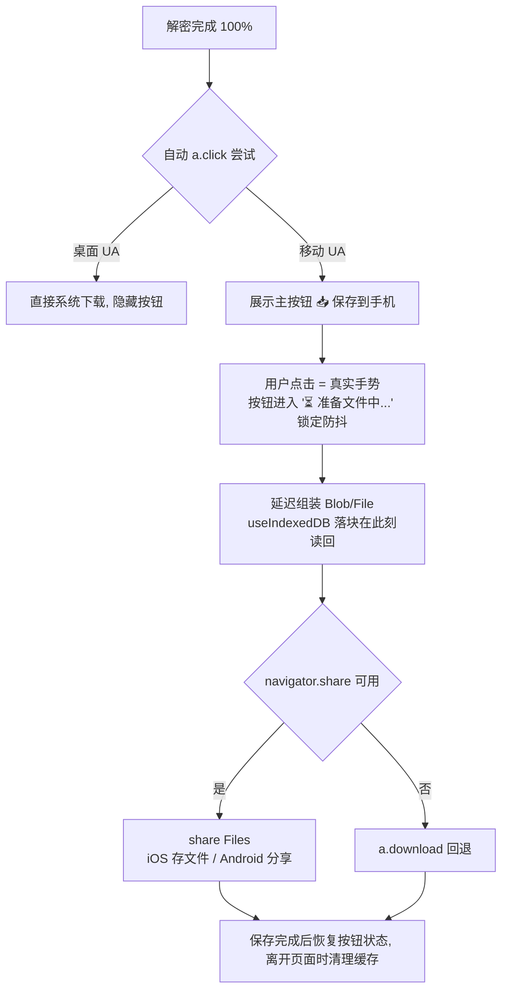

# EQT 移动端 E2EE 下载：保存触发与内存受控实现方案

> 本文由「开发排查意见」与「审查员核实现状」合稿而成。开发意见给出根因与两阶段方案；审查员逐条对照 `download.tmpl.html` 实际代码核实机制、修正平台差异、并指出一处被遗漏的现状 UI 缺口。最终合成为本实现方案。文档内行号为撰写时核对起点，落地以函数名定位为准。

---

## 一、概述与核心目标

E2EE 网页下载在浏览器内完成"拉取密文 → 逐块解密 → 重组明文"后，移动端（尤其 iOS）**无法可靠唤起系统保存/下载框**：进度走到 100%，文件却拿不到，用户只能重新下载。

**目标**（按优先级）：

1. 移动端建立"解密完成 → 用户亲手点击一键保存/分享"的**可靠手势通路**（主方案，立即落地）；
2. 大文件下载内存受控（依托既有 IndexedDB 落块，把 Blob 组装延迟到用户点击时）；
3. 桌面端保持现状自动下载不回退；
4. 多文件场景兼顾：支持【全部保存到手机】与单文件列表条目【单独保存】；
5. 超大文件（GB 级）的 ServiceWorker 流式代理：**列为远期研究，明确平台限制后不做本轮主路径**。

---

## 二、第一性原理剖析：为什么自动保存不可靠

### 1. E2EE 下载链路必然"先解密重组，后交付系统"

| 模式 | 传输物 | 下载接管 | 结果 |
| :--- | :--- | :--- | :--- |
| 明文 | 服务端明文文件流 | 浏览器原生下载管理器直连 | 点击即入系统下载任务 |
| E2EE | 4MB ChaCha20-Poly1305 密文分块（密钥在 URL `#` 哈希，不过网） | 浏览器必须先拉取→解密→重组 | 系统无法直接消费密文流 |

所以 E2EE 的真实路径恒为：`fetch chunk → decrypt → 落盘/攒内存 → assembleBlob → 触发保存`。这是加密模式的下限，不可绕过（`download.tmpl.html`：`Pipeline.downloadFile` → `assembleBlob` → `a.click()`）。

### 2. 用户手势过期拦截（Loss of User Activation）——核心诱因

移动浏览器只信任"用户点击瞬间（transient activation）"触发的保存动作。现状触发点 `a.click()`（`download.tmpl.html` :1208）位于 **异步解密完成的回调深处**，距最初点击数秒至数分钟——手势早已过期，被系统当作未授权的自动下载。

**平台差异修正（开发意见将 Android/iOS 笼统归为"静默拦截"）**：

| 平台 | 无手势 `<a download>` blob 的实际行为 |
| :--- | :--- |
| 桌面 Chrome/Firefox | 允许，直接下载（现状可靠） |
| Android Chrome | 多数直接**后台下载**，用户无感知；大 Blob 有内存/被砍风险 |
| iOS Safari | 不支持 `<a download>` 强制保存语义 → 尝试打开/丢弃，多数场景拿不到文件 |

→ "手势激活保底"主要是 iOS 与 Android 大文件场景的必要动作，而非全平台通病。

### 3. Blob/内存限制与过早 revoke——次要诱因

- **内存已有缓解**：`download.tmpl.html` :1130 大文件自动走 `useIndexedDB`（`totalBytes >= LARGE_FILE_THRESHOLD && window.indexedDB`），逐块 `putChunk` 落盘；但 :1192 `assembleBlob` 仍一次性读回内存生成 Blob，大文件峰值依旧。
- **revoke 过早隐患**：原代码在 `a.click()` 后通过 `setTimeout(..., 10000)` 固定 10 秒后执行 `revokeObjectURL`。若用户在移动端文件保存选择目录对话框中停留超过 10 秒，底层 Blob 引用失效将导致下载保存静默失败。必须将生命周期管理改为单例维持与卸载清理。

### 4. 现状 UI 缺口（开发意见遗漏的关键事实）

完成态文案只有 `success_tips_all`："传输已成功完成，您可以关闭此页面了"（:848 hintEl），**没有"保存文件"类手动兜底入口**。一旦自动 `a.click()` 被移动端拦截，用户无路可走、只能重下。

→ 下述主方案的"保存按钮"本质是**修复该 UX 缺口**，而非体验增强。

---

## 三、方案合成

### 主方案：手势激活"保存到手机"按钮 + 组装延迟 + 平台分流

#### 核心机制
1. **平台分流**：桌面 UA 保留现有自动 `a.click()`（可靠且零改动）；移动 UA 完成态**常显主按钮**，自动触发仅作辅助。
2. **组装延迟到用户点击**：`useIndexedDB` 路径下 100% 时**不**调用 `assembleBlob`；点击保存时（真实手势上下文内）再 `assembleBlob` → `new File([blob], name)`，避免峰值内存白占且避开无手势阻塞。
3. **移动端首选 `navigator.share`**：`navigator.share({ files: [file] })`——iOS 直达"存储到文件/Files"，Android 可分享至系统下载；**纯 `a.download` 在 iOS 依旧不可靠**，share 不可用时才回退。
4. **多文件支持策略**：
   - **全局主操作**：【📥 全部保存到手机】（调用 `navigator.share({ files: [f1, f2, ...] })` 一次性打包分享/存入 Files）；
   - **单文件独立操作**：文件列表内各条目保留【📥 保存】按钮，方便用户针对性单独提取某一项。
5. **保存中状态与并发防抖**：
   - 用户点击后进入 `isSaving = true` 过渡态（按钮置灰并提示“⏳ 正在准备文件...”），防止连击导致瞬时并发组装多个大 Blob 引发 OOM。
6. **revoke 与缓存生命周期全闭环**：
   - 废弃 10 秒固定定时器，由全局 `activeSavedBlobUrl` 追踪；
   - 在生成新文件保存或页面卸载（`pagehide`）时释放，确保用户在系统文件对话框中无论挑选多久路径均有效。
7. **新增 UI 状态 `decrypted-pending-save`**（已完成待保存）：completed 文案下追加大号高亮按钮与提示（"已在本机解密完成，点击存入系统"），给用户明确的心理模型。

#### 边界与回退
- `navigator.canShare({ files })` 探测失败 / 文件超平台分享上限 → 回退 `a.download`，保留按钮重试。
- 自动触发与按钮并存时按 UA 分流，避免桌面双触发。
- 页面关闭/停止时若仍有未保存 chunk 存储，执行既有清理，不残留 `.tmp` 或 IndexedDB 碎片。

### 远期研究（不属本轮主力）：ServiceWorker 流式解密代理

Mega / ProtonDrive 式"点击即原生下载，SW 边拉密文边解密边吐明文流"。

**可行性结论（审查员判断）**：
- **iOS Safari：基本不可行**。SW 无法把流式 `ReadableStream` body 交给系统下载器；对 `<a download>`/导航的 SW 流式响应支持弱；SW 后台生命周期受系统回收限制。
- **Android Chrome：代价大**。现有协议是 chunk 级 API（`/chunk?chunk_index` + 逐块 Nonce 派生解密），SW 流式需新开"单 URL 全文件密文流"端点或把整套解密管线搬进 SW——等于再造一套下载引擎。
- **本轮 GB 级现实替代**：既有 `useIndexedDB` 已把内存峰值压到一次 `assembleBlob`；叠加主方案"点击时组装 + share"，单文件实用上限内足够。超大文件建议走桌面端或分片，不为此给移动 SW 增加复杂度。

---

## 四、审查员视角：风险与防御

| 风险 | 防御 |
| :--- | :--- |
| 100% 组装峰值内存（大文件移动端 OOM） | 组装延迟到用户点击 + IndexedDB 落块保持到保存后清理 |
| 连续连击保存导致内存暴击 | `isSaving` 状态锁（300ms+ 过渡态），组装完毕前禁用重复触发 |
| 自动触发与保存按钮双触发 | UA 分流：桌面自动、移动按钮；各自独立状态位 |
| `navigator.share` 兼容性 | `canShare` 探测 + 失败回退 `a.download`；超平台大小上限给提示 |
| 保存对话框挑路径超时致下载失效 | 废除 10s 固定 revoke，生命周期移至新保存/页面卸载钩子 |
| 保存被取消/失败后文件丢失 | 按钮保持可重试，chunk 存储未确认前不清除 |
| 页面中断后 chunk 存储残留 | 关闭/停止路径统一清理 IndexedDB 与 URL，不泄漏磁盘 |
| 状态回归（明文/E2EE/多文件差异） | 改动只收敛在 E2EE 下载保存段，明文与桌面路径保持现状；测试覆盖两模式 |

---

## 五、分阶段落地实施计划

### Phase 1：完成态 UI + 保存按钮（移动端）
- 在 `download.tmpl.html` 完成态区域新增主按钮【📥 保存到手机】与提示文案，`data-i18n` 接 7 语言；
- 按钮统一走 `addEventListener`（遵守项目前端规范，不用内联 onclick）；
- 移动 UA 检测：移动端常显按钮；桌面端完成时隐藏（自动下载）。

### Phase 2：`navigator.share` 集成 + 组装延迟 + 防抖
- `useIndexedDB` 路径：100% 时保留 chunk 落盘，取消自动 `assembleBlob`；点击时 `assembleBlob` → `File`；
- `navigator.canShare` / `navigator.share({ files })`，失败回退 `a.download`；
- `isSaving` 按钮防抖与加载态切换；
- `activeSavedBlobUrl` 单例管理与 `pagehide` 卸载清理。

### Phase 3：i18n 与回归
- 新增词条：`btn_save_to_phone`、`btn_save_all_to_phone`、`saving_preparing`、`save_done_tips`、`save_failed_tips` 等（7 语言）；
- 桌面自动下载路径零改动回归；明文下载路径不受影响。

### Phase 4：测试
1. **Chrome E2E 仿真**（`chrome-devtools-mcp`）：模拟移动 UA，验证 100% 后主按钮出现、点击触发保存、`share` 探测与回退分支；
2. **模板 JS 语法门禁**：模板改动走既有 `TestTemplateJavaScriptSyntax` + 独立 `node --check` 双保险；
3. **手动 iOS / Android 真机清单**：Safari 存 Files、Android Chrome 分享/下载、大文件（>LARGE_FILE_THRESHOLD）内存受控、保存取消后重试。

---

## 附：关键现状代码定位（撰写时核对）

| 逻辑 | 位置 |
| :--- | :--- |
| Blob 组装 + 自动 `a.click()` + 10s revoke | `download.tmpl.html` ~:1190-1213 |
| `useIndexedDB` 判定（大文件落块） | `download.tmpl.html` ~:1130 |
| E2EE 下载启动入口 | `download.tmpl.html` `startE2EEDownload` ~:1242 / `new EqtE2EEDownloader.Pipeline` ~:1290 |
| 完成态提示文案（成功可关闭） | `download.tmpl.html` `hintEl` ~:848，`success_tips_all` |
| 无 `navigator.share` 现状 | 全文件检索无引用（撰写时） |

---

## 六、审查复核：对开发多文件/生命周期建议的技术校验 (Review of `c13186b8`)

> 开发在 `c13186b8` 新增了多文件保存、`isSaving` 防抖与 objectURL 生命周期闭环。以下按现状代码逐条校验——方向正确，但多文件"全部保存"与内存受控目标存在结构性冲突，且清理兜底不可依赖 pagehide。**开发下轮修订正文时消化本节 R1-R4 并入对应小节。**

### R1（结构性冲突）"全部保存"隐含全量驻留内存，与单文件受控模型相反（针对 §三.4 全部保存）
- **现状**：E2EE 多文件下载是**顺序逐文件**执行——`startE2EEDownload` 对 `metaData.files` 循环 `await pipeline.downloadFile(...)`（`download.tmpl.html`:1301-1318），每个文件完成即独立 assemble/保存。即现状峰值内存 ≈ **单个文件**，天然受控。
- **冲突**：`navigator.share({ files: [...] })` 要求 `files` 数组**全部 File 同时可读驻内存**（share 无逐文件流式语义），不存在"边组装边 share"或"share 中释放前一个"。故【全部保存】的峰值 = Σ(各文件大小)，把单文件受控模型直接破坏——与 §一 目标 2、风险表首行防御相矛盾。
- **修正**：全部保存只允许用于 **Σ(文件集) < 内存安全阈值 且 每文件均未触发 useIndexedDB 大文件路径** 的文件集；一旦集合含大文件或总合超限，自动降级为两种：
  - **逐文件排队保存**：循环"组装一个 File → share/a.download → 等 promise settle → 释放该文件资源 → 下一个"，每次只驻留一个文件（复用同一 `isSaving` 锁天然串行）；
  - 或界面提示改用该文件的【单独保存】按钮。
- 默认推荐逐文件排队（保持与现状"逐文件即存"模型同构，改动面最小）。

### R2（分支错位）objectURL 只在 `a.download` 回退需要；share 分支传 File 无需 URL（针对 §三.6 单例）
- `navigator.share({ files })` 直接传 `File` 对象，**不产生 objectURL**；`createObjectURL` 仅 `a.download` 回退分支需要。
- 故"全局单例 `activeSavedBlobUrl`"只覆盖**单文件 `a.download` 回退**。多文件全部保存走 share 失败回退 `a.download` 时，要么维护 **URL 数组**、要么按 R1 的逐文件串行（每轮仅一个 active URL，触发后即 revoke）。文档宜把单例规则限定为"单文件 / 串行回退场景"，避免实现者误以为多文件 share 也要造 URL。

### R3（兜底不可靠）chunk 清理不能依赖 pagehide（针对 §三.6 "离开页面时清理"）
- 移动 Safari/Chrome **切后台被杀常不触发 `pagehide`**（切后台触发 `visibilitychange→hidden`，随后进程可能被系统回收），该事件只能可靠覆盖正常关闭。
- 仅靠 pagehide 清 IndexedDB chunk → 用户保存成功切走被杀 → chunk 永久残留（违背风险表末行"不泄漏磁盘"）。
- **补兜底**：IndexedDB 的每个文件会话落**时间戳/会话标识**；下次会话启动（或新一次 E2EE 下载开始前）先清扫上一会话遗留超过 N 分钟的 chunk 存储。pagehide/`visibilitychange` 只作尽力而为的即时清理。成功交付分支（iOS share resolve / a.download 反馈）可提前清，取消/失败保留以支持重试。

### R4（语义澄清）share resolve ≠ "文件已存入系统"；防抖锁释放 ≠ 清理时机（针对 §三.5 / 三.6）
- iOS "存储到 Files" 通常在 resolve 前已落盘；**Android 分享到其它 app 时 resolve 只代表分享动作完成**，目标方未必保存。
- 因此分层：`isSaving` 防抖锁在 promise **settle（resolve/reject）即释放**，避免系统分享面板被用户晾置时按钮长期灰死；而"是否已成功交付、可清 chunk"的判定，Android 分享非 Files 目标**不作为清理依据**（沿用 R3 的保留到下次会话清扫策略）。
- 可选项：用户晾置系统面板属正常交互，按钮灰态期间可给次级"取消"出口或超时释放，防误认为卡死。

### R5（Phase 1 实现提醒）单文件行内【保存】按钮与整行下载入口的事件隔离
- 页面同时存在 `triggerDownload()`（全部）与 `triggerDownloadItem(index)`（单文件，`download.tmpl.html`:1350-1361），文件行 `.file-item-row` 本身承载下载触发。行内新增【单独保存】按钮时须 `stopPropagation` 隔离，防止点击按钮同时触发整行/重复下载；按钮走 `addEventListener`（非内联 onclick），与既有停止/下载按钮的事件注册方式保持一致。
