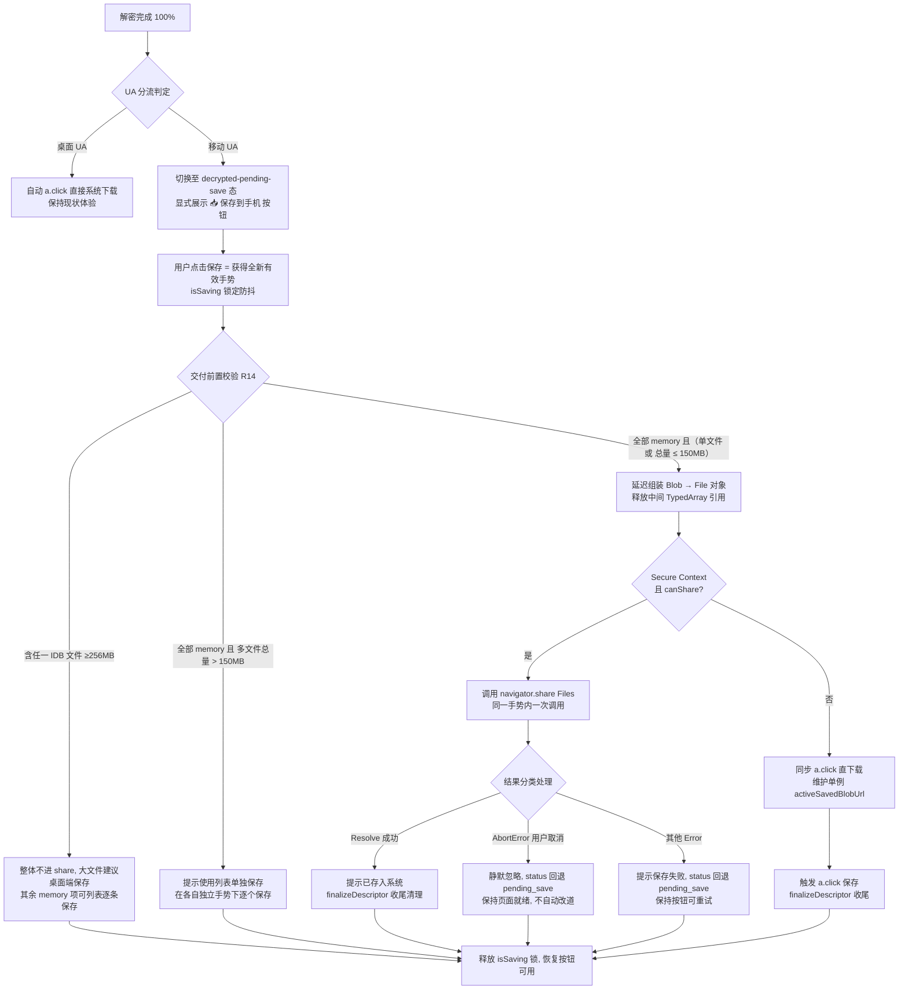

# EQT 移动端 E2EE 下载：保存触发与内存受控实现方案

> **文档定位**：本文档兼作本特性的完整架构设计规范与**开发实施进度跟踪看板（Progress Tracker / Single Source of Truth）**，全面整合了「开发排查意见」、「审查复核（R1-R18）」以及基于第一性原理与 Web 运行机制的深度分析。
>
> **第二轮补充审查决议（R6-R13）已并入**：基准提交 `4ccc9195`（2026-09-02）。第二轮审查以「实测代码现状 + Web 平台机制第一性原理」双基线复核，重点补足 Secure Context 前提、share 回退时序、停止路径孤儿、双阈值关系等正文缺口；决议对照与现状复核勘误见 §四 末。
>
> **第三轮细化审查决议（R14-R16）已并入**：基准提交 `20fb37e2`（2026-09-02）。聚焦 PendingFileDescriptor 契约收尾（失败回态/交付后回收/边界一致性）、含 IDB 文件的交付前置校验、局域网 HTTP 提示文案修订；决议对照见 §四 末。
>
> **第四轮复核审查决议（R17-R18）已并入**：基准提交 `3751e315`（2026-09-02）。对象为该提交重写的 Mermaid「交付前置校验」三分支与 §三.2 `finalizeDescriptor` 伪代码，复核「分支互斥/穷尽性 + 单文件豁免」与「chunks 释放时机 vs 回退重试」两组一致性；决议对照见 §四 末。
>
> **第五轮实施复核审查决议（R19-R24）已并入**：基准提交 `ba77f451`（2026-09-02，实施提交：`download.tmpl.html` +489/-70，版本 v1.36.47，Task 1.1-4.1 勾选完成）。对象为**实施代码与设计正文/既有决议的逐条一致性复核**（R14/R17/R18 落地核对）；确认 5 项实质偏差（桌面端内存与交付时序回归、含 IDB 单文件仍尝试交付、失败路径资源未闭合、hidden prune 豁免失效、静默部分交付）与 1 项低危体验附注，决议对照见 §四 末。

---

## 一、概述与核心目标

E2EE 网页下载在浏览器端完成“拉取 4MB 分块 → Web Worker (XChaCha20-Poly1305, libsodium `crypto_aead_xchacha20poly1305_ietf_*`) 逐块解密 → 存储/重组明文”后，移动端（尤其是 iOS Safari 与部分 Android 浏览器）**无法可靠唤起系统保存/下载管理器**：进度走到 100%，文件却拿不到，用户只能无奈重新下载。

**目标与设计原则**（按优先级）：

1. **手势通路保底（主方案，首要落地）**：移动端建立“解密完成 → 用户亲手点击一键保存/分享”的**可靠手势通路**。首选 `navigator.share` 直达系统 Files/分享面板，但 **Web Share API 仅 Secure Context（https/localhost）可用**，http 部署下 `navigator.share` 为 `undefined` 且无法被 polyfill——故按钮 handler 内须**同步预判分流**：满足安全上下文且 `canShare({files})` 才走 share；否则本次直接同步 `a.download`。share 流程内失败**不二次改道**（见 R6/R10，避免手势耗尽后回退 click 被同样拦截）；
2. **大文件内存受控**：依托既有 IndexedDB 逐块落盘机制，将明文组装（`assembleBlob`/`File`）**延迟至用户点击保存时**，解密完成时（100%）不提前占用整文件内存；
3. **多文件场景第一性原理合流**：
   - **小文件集合（总大小 ≤ 150MB 且无大文件）**：支持【📥 全部保存到手机】（一次性将 `File[]` 传给 `navigator.share`：iOS 分享面板对多文件集可靠批量存入“文件”；Android 无等价“批量下载”系统目标，第三方 App 对多 `File` 数组接受度不一，按钮语义为“分享到所选应用”，列表另设逐条【📥 保存】兜底，见 R11）；
   - **大文件/超限集合**：严格遵循 Web 平台“单次手势仅允许单次 share 弹窗”的物理限制，禁止不可行的循环自动 share，转为引导用户在文件列表中【单独保存】各条目；
4. **桌面端零回退**：桌面 UA 保持现状自动 `a.click()` 触发原生下载管理器，无缝兼顾体验；
5. **存储与 URL 资源全闭环**：基于会话/时间戳的 IndexedDB 垃圾回收（解决移动端后台被杀导致 `pagehide` 丢失的孤儿碎片问题），以及 `objectURL` 单例精准释放；
6. **超大文件（GB 级）ServiceWorker 流式代理**：列为远期研究，明确平台限制（iOS 无法交付流式下载）后不做本轮主路径。

---

## 二、第一性原理剖析：为什么自动保存不可靠

### 1. E2EE 链路本质：“先解密重组，后交付系统”

| 模式 | 传输物 | 下载接管时机 | 终端结果 |
| :--- | :--- | :--- | :--- |
| **明文模式** | 服务端明文文件流 | 浏览器原生下载管理器在发起时直连 | 点击瞬间即进入系统下载管道 |
| **E2EE 模式** | 4MB XChaCha20-Poly1305 密文（密钥在 URL `#` 哈希，不过网） | 浏览器必须在内存/本地先拉取→逐块解密→重组明文 | 系统无法直接消费密文流 |

因此 E2EE 的真实运行管线恒为：`fetch chunk → decrypt → 内存/IndexedDB 缓冲 → assembleBlob/File → 触发保存`。这是端到端加密架构的下限，不可绕过（`download.tmpl.html`：`Pipeline.downloadFile` → `assembleBlob` → 保存）。

### 2. 用户手势过期拦截（Loss of User Activation）

现代移动浏览器对保存/下载/分享动作实施严格的安全限制（Transient User Activation）：
- 只有在“用户直接点击（用户手势活跃期内）”才能合法调起 `navigator.share` 或触发下载行为；
- 现状触发点 `a.click()`（`download.tmpl.html`:1208）位于 **异步解密完成的回调深处**，距最初点击已有数秒至数分钟——手势早已经失效，移动浏览器将其视作未授权的网页自动脚本弹窗下载。

**平台实际行为矩阵**：

| 平台 | 无手势 `<a download>` blob 的实际行为 | `navigator.share({ files })` 表现 |
| :--- | :--- | :--- |
| **桌面 Chrome / Edge / Firefox** | 允许，直接进入系统下载管理器（现状可靠） | 部分支持，但桌面首选直接下载 |
| **Android Chrome** | 多数直接后台下载（状态栏有提示），但大 Blob 易触发内存告警 | 调起系统分享面板（可分享到文件管理器、微信、云盘等） |
| **iOS Safari** | `<a download>` 语义弱化甚至失效，常尝试在标签页内打开或直接静默丢弃 | 最佳通路：调起系统分享面板，直接提供【存储到“文件”】选项 |

### 3. Web Share API 的手势单发铁律（Single-Activation Constraint）

Web 规范明确规定：`navigator.share()` 必须在一个活跃的 User Gesture 周期内被调用。
- 当第一个 `await navigator.share({ files: [f1] })` 执行并等待用户在系统面板操作完毕 resolve 后，**当前的用户手势活跃期已彻底消耗完毕**；
- 此时若在 JS 循环中继续执行第二个 `await navigator.share({ files: [f2] })`，浏览器将直接抛出 `NotAllowedError` 并拦截；
- 同理，短时间内连续调用多个 `a.click()` 也会被移动浏览器视为多窗口/多文件恶意弹窗而直接静默阻断。

**结论**：多文件无法通过代码内部循环“自动逐个弹窗 share”，多文件必须要么**一次性批量 share `File[]`**，要么**由用户在 UI 上点击各条目的【单独保存】按钮逐个触发**。

### 4. 移动端进程生命周期与 IndexedDB 碎片遗留

- **`pagehide` 的局限**：在 iOS Safari 和 Android Chrome 中，用户完成保存后直接锁屏、切后台或切换 App，系统常常直接挂起并回收（SIGKILL）页面进程，**根本不会触发 `pagehide` 或 `beforeunload`**；
- 若仅依赖 `pagehide` 清理 IndexedDB 分块，将导致未清理的 chunk 永久驻留用户手机存储，造成磁盘碎片泄漏；
- 必须引入**基于时间戳/会话 ID 的主动清扫（Prune）机制**。

### 5. 现状 UI 缺口

完成态文案目前仅有 `success_tips_all`：“传输已成功完成，您可以关闭此页面了”（`download.tmpl.html`:848），**缺乏任何保存动作的 UI 触点**。一旦自动 `a.click()` 失败，用户处于信息盲区且无法挽救。

---

## 三、方案合成与架构设计

### 整体架构流程



> **F 交付前置校验判定说明（R17）**：三条出边按「先排除含 IDB（≥256MB）→ 再判多文件内存总量」的优先级**互斥**执行，不会并发命中；单文件只要 `storeType === 'memory'`（<256MB，或 ≥256MB 但环境无 IndexedDB），无论大小一律走 G——150MB 仅是**多文件聚合**预算，单文件 share 不受其限（恢复 R9 单文件豁免）；混合集（含 IDB 大文件 + memory 小文件）整体不进 share，其中 memory 成员仍可在列表逐条保存。

### 核心机制详解

#### 1. 平台分流与 UI 状态机
- **桌面端**：解密完成后直接触发现有自动 `a.click()`，UI 显示“已开始下载”，零回退。
- **移动端**：解密达到 100% 后**不自动调用 `a.click()`**，页面进入 `decrypted-pending-save` 状态：
  - 进度条置为 100%（绿色完成态）；
  - 顶部/操作区展示大号高亮主按钮【📥 保存到手机】（多文件时为【📥 全部保存到手机】）；
  - 提示文案更新：“已在本机解密完成，请点击下方按钮保存到系统”；
  - **局域网 HTTP 模式动态提示（R6，文案经 R16 修订）**：若检测到 `!window.isSecureContext` 且为 iOS 设备，在按钮下方附带辅助提示：“（提示：当前为局域网 HTTP 访问，iOS 下无法分享到“文件”；请改用 https 地址打开本页，或换用桌面端下载）”。原草案“长按预览保存”表述易误导——blob 资源在 iOS Safari 长按通常无“保存到文件”菜单（仅图片类可存图），已删除。

#### 2. 解密与交付解耦（R7）：Pending 数据结构与组装延迟
- **职责拆分**：将现状 `downloadFile`（解密+组装+下载合一）拆解为两阶段：
  1. **后台解密阶段（Pipeline 负责）**：网络拉取与 Worker 解密，完成后向会话注册 `PendingFileDescriptor`，**不组装 Blob，不触发保存，不清理存储**；
  2. **手势交付阶段（UI Controller 负责）**：用户点击保存按钮，在活跃用户手势上下文中消费 pending 记录，执行组装并调起保存。
- **待交付元数据契约（PendingFileDescriptor）**：
  ```javascript
  // 会话级待交付表: sessionPendingFiles = new Map<string, PendingFileDescriptor>()
  {
      fileId: 'f-0',
      fileName: 'document.pdf',
      fileSize: 1048576,
      mimeType: 'application/pdf',
      totalChunks: 1,
      storeType: 'memory' | 'idb', // <256MB 为 memory, ≥256MB 为 idb(与 LARGE_FILE_THRESHOLD 的 `>=` 判定一致)
      chunks: [Uint8Array],        // 仅 storeType === 'memory' 时有效
      status: 'pending_save'       // 'pending_save' | 'delivering' | 'delivered'
  }
  ```
- **storeType 单一真源（R15）**：`storeType` 必须在解密启动时由同一判定函数（封装现状 `totalBytes >= LARGE_FILE_THRESHOLD && window.indexedDB` 语义，`download.tmpl.html`:1130）求值一次并写入 descriptor；交付侧**不得按 size 自行重算**（无 IndexedDB 环境下大文件实际落内存，重算会错判）。
- **注册时机（R16）**：`PendingFileDescriptor` 仅在单文件**全部 chunk 完整落位**后一次性注册进 `sessionPendingFiles`；解密中途（停止/失败）不注册半成品——交付永不组装不完整文件（半截残留由 R8 停止清理负责）。
- **状态转移与失败回态（R15）**：`pending_save` → 用户点击交付 `delivering` → 成功 `delivered`；**失败（含 AbortError 与致命异常）一律回退 `pending_save`**，保留 `chunks`/IndexedDB 数据供再次点击重试。
- **交付后收尾（R15，统一收尾范式）**：
  ```javascript
  function finalizeDescriptor(descriptor) {
      if (!descriptor) return;
      descriptor.status = 'delivered';
      if (descriptor.storeType === 'idb') {
          EqtChunkStorage.clearFile(descriptor.fileId, descriptor.totalChunks);
      } else if (descriptor.storeType === 'memory') {
          descriptor.chunks = null;
      }
      sessionPendingFiles.delete(descriptor.fileId);
  }
  ```
  置 `delivered` 后统一调用 `finalizeDescriptor` 收尾，确保 IndexedDB 与 JS 堆内存无缝释放，且在 `sessionPendingFiles` 中注销已交付项。
- **GC 保护（R18 修订，释放时机随交付分支）**：`descriptor.chunks` 置 null 的时机取决于分支——`a.download` 分支在 `a.click()` 后即可置 null（OS 已接管下载，无“取消回按钮”语义）；`navigator.share` 分支必须**保留至结果 settle**：成功才由 `finalizeDescriptor` 置 null，AbortError/失败则保留 chunks 供再次点击重试（否则回退 `pending_save` 后无数据可组装，内存文件重试即破）。同时诚实注明：多数引擎 `new Blob(parts)` 持有分片引用而非拷贝，组装后立即置 null 并不能即时回收底层字节，峰值仍≈文件大小（R9 延迟不消峰）；该置 null 属尽力而为的解引用，真实释放依赖 Blob/URL 的回收。

> **阈值与时机边界诚实声明（R9）**：本方案两套数值正交——现状 IndexedDB 流式阈值 `LARGE_FILE_THRESHOLD = 256MB`（`download.tmpl.html`:1049）；150MB 是**新增的 share 聚合预算**，非 IDB 阈值。未达 256MB 的文件解密期整驻内存数组（150~256MB 之间单文件仍可能吃紧），达阈值才逐块落 IDB。
> 且**延迟组装只能把峰值推迟到点击手势内，并不能消除**：现状 `assembleBlob`（`download.tmpl.html`:1004-1014）在用户点击时仍需一次性从 IDB 读出全部 chunk 构成 Blob，峰值内存≈文件大小，可能造成 GC 长停顿或被系统杀。因此对已入 IDB 的大文件（≥256MB）移动端应在 UI 如实标注“建议桌面端保存”，点击时组装建议分帧/分批进行；真正的峰值消除路径仍是 ServiceWorker 流式（远期，见风险矩阵）。

#### 3. Web Share API 深度集成与多文件处理策略
- **MIME 类型映射**：通过文件名后缀推导标准 MIME（如 `.jpg` → `image/jpeg`, `.pdf` → `application/pdf`, `.zip` → `application/zip`），未匹配时回退 `application/octet-stream`，提升 `navigator.canShare` 成功率。
- **多文件分流规则**：
  - **规则 A（小集合批量 Share）**：若 `files.length > 1` 且 `Σ(file_size) <= 150MB` 且均未启用 IndexedDB，一次性生成 `File[]` 数组传递给 `navigator.share({ files })`。iOS Safari 原生分享面板支持将整个多文件集一次性存入指定文件夹；Android 无等价“批量下载”目标，多 `File` 数组的接受度依目标 App 而异，按钮语义定位为“分享到所选应用”，并保底列表逐条【📥 保存】（R11）。
  - **规则 B（大集合/大文件降级）**：若总大小 > 150MB 或包含 IndexedDB 大文件，主按钮提示“文件集较大，建议在下方逐个保存”，同时在文件列表各行展示【📥 保存】按钮。
- **单文件条目独立保存**：文件列表中的各条目拥有独立的【📥 保存】按钮，用户点击单项时直接针对该文件执行“延迟组装 → 单文件 Share / Download”。

#### 4. 预判分流（Pre-check Branching）与异常分类处理（R6 / R10）
- **同步预判分流（严禁异步失败改道）**：
  ```javascript
  function canUseWebShare(fileList) {
      if (!window.isSecureContext) return false;
      if (!navigator.share || !navigator.canShare) return false;
      try {
          return navigator.canShare({ files: fileList });
      } catch (e) {
          return false;
      }
  }
  ```
- **交付前置校验（R14，组装之前执行）**：组装成本决定通路——目标集合（单文件或批量）若含任一 `storeType === 'idb'`（≥256MB，点击时须从 IndexedDB 整读，峰值≈文件大小且耗时可能超出 Transient Activation 存活窗），则该集合**整体不进 share**，也**不期望移动端 `a.download` 成功**（否则落入“点击→组装超窗→NotAllowedError→重试”循环）；UI 须在点击**前**即对此类文件展示“文件较大，建议桌面端保存”（R9 的交付侧落地）。全部 `storeType === 'memory'` 的小集合才正常走下述预判分流。
- **分支执行流**：
  1. **Web Share 分支**（`canUseWebShare` 成立）：在当前手势内直接调用 `await navigator.share({ files })`；
     - `AbortError`（用户点击取消/关闭分享面板）：属于正常交互，**静默忽略**，释放 `isSaving` 状态锁，保持页面与按钮就绪，**绝不报错也绝不自动切道**；
     - 其他致命异常：提示“保存失败，请点击重试”，保持按钮可再次点击；
  2. **同步 a.download 分支**（非安全上下文或 `canShare` 不满足）：在当前有效手势内**直接同步**生成 Object URL 并调用 `a.click()`（维护 `activeSavedBlobUrl` 单例）。

#### 5. `activeSavedBlobUrl` 生命周期精准闭环
- `navigator.share` 直接传递 `File` 内存对象，**不产生任何 Object URL**；
- 仅当预判分流走 `a.download` 分支时才调用 `URL.createObjectURL(file)`；
- 维护全局单例 `activeSavedBlobUrl`：在生成新的下载 URL、会话重置或页面卸载时显式调用 `URL.revokeObjectURL`，替代脆弱的 10 秒固定定时器，作为多按钮/重复保存场景的 URL 生命周期互斥保护（**归因澄清（R13）**：revoke 时机并非移动端保存失败的根因——已开始的下载不再依赖 URL；移动端失败根因是 iOS 对 `<a download>` 语义不支持）。

#### 6. IndexedDB 全生命周期与过期清扫机制（Session Pruning）
- **数据结构**：在 IndexedDB `chunks` 记录中附带 `createdAt`（时间戳）与 `sessionId`，且 **`putChunk` 写入时即落两个字段**，以便按会话归属区分活跃与孤儿（现状记录仅 `{id, fileId, chunkIndex, data}`，无时间/会话维度，`download.tmpl.html`:997）；
- **主动清扫（Session Prune）**：
  - 在页面加载 `startE2EEDownload` 启动前，自动扫描并清理所有创建时间超过 24 小时或属于已结束会话的历史残留 chunk；
- **即时清理**：单文件保存成功确认后（`finalizeDescriptor` 统一收尾，见 §三.2），调用 `EqtChunkStorage.clearFile(fileId, totalChunks)` 并更新 pending 状态为 `delivered`；
- **停止/失败即时清理（R8）**：执行停止（`executeStopSharing`）、`Pipeline.abort` 或下载失败中断时，对**已写入**的分块立即尽力 `clearFile(fileId)`；现状 abort 只中止网络与 worker（`download.tmpl.html`:1216-1222、1690-1710），不清理已落盘 chunk，中断/停止同样是孤儿主源，不能只依赖 24h prune 兜底；
- **卸载辅助与豁免（R12）**：在 `visibilitychange`（`state === 'hidden'`）时触发尽力而为的轻量清理——但该清理**必须豁免当前 pending（已解密未交付）的活跃 fileId**，仅清“非本会话 / 已超保留期 / 已确认交付”的记录；否则用户点保存、切后台选系统目录的瞬间，未交付数据会被误删。

#### 7. 事件冒泡隔离与工程规范
- 文件列表条目行本身绑定有点击查看/下载逻辑，行内【📥 保存】按钮必须在 click handler 内执行 `e.stopPropagation()`，防止重复冒泡；
- 遵循前端工程规范：本条范围为本方案**新增**代码——严禁新增 HTML 内联 `onclick`，新增按钮事件统一在 JS Controller 中使用 `addEventListener` 注册（存量内联触发逻辑保持不动，范围界定见 R13）。

---

## 四、审查复核决议与技术对照（Review Resolution Matrix）

| 审查意见项 | 核心关切与技术风险 | 最终技术决议与落地方案 |
| :--- | :--- | :--- |
| **R1: 多文件与内存冲突** | 多个大文件批量 share 会导致全量驻留内存引发 OOM | 设定 150MB 与非 IndexedDB 门槛：小集合批量 `File[]` Share；大集合引导单文件列表逐项保存。 |
| **R2: ObjectURL 分支错位** | Share 传 File 无需 URL，避免多文件误建 URL | 明确 `navigator.share` 走纯内存 `File`；`activeSavedBlobUrl` 单例仅服务于 `a.download` 回退。 |
| **R3: `pagehide` 清理不可靠** | 移动端切后台被杀不触发 pagehide 导致磁盘碎片 | 引入基于时间戳的 Session Prune（启动前自动清理 >24h 孤儿 chunk）+ 保存后即时清理。 |
| **R4: Share 语义与防抖锁** | Share resolve 不代表落盘，防抖锁卡死 | `isSaving` 状态锁在 Promise `settle`（无论成功、失败或取消）后立即释放；`AbortError` 静默吞吐。 |
| **R5: 事件隔离与规范** | 列表行内按钮冒泡与内联 onclick 规范冲突 | 行内按钮使用 `e.stopPropagation()` 隔离；全面采用标准 `addEventListener` 声明式绑定。 |

### 第二轮补充审查决议（R6-R13）

> 第二轮审查以「实测代码现状 + Web 平台机制第一性原理」双基线复核（基准提交 `4ccc9195`）。凡决议在正文已吸收的，标注“已落实 §X”；凡需编码期细化的，标注“编码期”。

| 审查意见项 | 核心关切与技术风险 | 最终技术决议与落地方案 |
| :--- | :--- | :--- |
| **R6: Secure Context 前提缺口** | Web Share Level 2 仅 Secure Context（https/localhost）可用；真实接收场景常见 http，而 `download.tmpl.html` 无任何 `isSecureContext`/protocol 探测。http+iOS 下 `navigator.share` 为 `undefined`，主通路缺失，恰逢 iOS 是 `<a download>` 最不可靠平台，方案将空转 | 按钮最前置加 `isSecureContext && navigator.canShare` 探测：不满足则本次直走 `a.download`，并出明确提示文案（引导使用 https 地址或桌面端，避免“点了没反应”）；`https` 记为该方案在移动端生效的**部署前提**（已落实 §一.1）；Phase 4 真机清单补 iOS http/https 双变体，http+iOS 的“无法保存”记录为预期平台限制 |
| **R7: 逐文件即点 → pending 聚合的架构迁移** | 现状 `startE2EEDownload`（:1301-1318）串行 `await downloadFile`，`downloadFile`（:1125-1214）每文件解完即 assemble→`a.click`（:1208）→clearFile；方案要求移动端解完不交付、等用户手势 → “解密+交付”单职责须拆两步，且多文件需跨 fileId 聚合 pending 数据（正文原未给状态结构） | `downloadFile` 拆为 `decryptToStorage`（返回就绪描述 `{fileId, fileName, mime, size, storeType: memory/idb, totalChunks}`，**不交付**）与 `deliver(file)`（点击手势内组装并交付）；新增 pending 会话记录表，逐文件维护就绪态；多文件进度条语义改为“解密聚合进度”（编码期细化） |
| **R8: 停止/失败路径孤儿未闭合** | `executeStopSharing`（:1690-1710）与 `abort`（:1216-1222）只中止网络与 worker，不清理已落盘 chunk；失败中断同源。且现状模板**无任何 pagehide/visibilitychange/unload 监听**——R3 前文“仅依赖 pagehide”与现状不符（实为零清理），孤儿风险更高；新会话新 file_id 会累积孤儿 | 事实更正：现状为“零生命周期清理”而非“仅有 pagehide”；方案补 stop/abort/失败路径对已写入分块即时 `clearFile(fileId, totalChunks)`；24h Session Prune 仅作兜底（已落实 §三.6） |
| **R9: 双阈值正交与“延迟组装不消峰”** | 现状 `LARGE_FILE_THRESHOLD = 256MB`（:1049）才入 IndexedDB；方案 150MB 为 share 聚合预算，两者关系未明；`assembleBlob`（:1004-1014）点击时仍一次性整读出全部 chunk，峰值≈文件大小，延迟只推迟不消除；原风险矩阵“延迟组装避免 OOM”属过度承诺；≥256MB 单文件在移动端的交付通路由何接管未答 | ①IDB 阈值沿用 256MB 不动，150MB 仅作 share 聚合内存预算，单文件 share 不受其限；未入 IDB 的文件（≤256MB）解密期整驻内存，需如实提示；②正文与风险矩阵统一标注“延迟组装仅推迟峰值，不消除”，点击时组装建议分批/分帧进行；③≥256MB 已入 IDB 的单文件在移动端 UI 明确标注“建议桌面端保存”，或设移动端单文件交付上限（已落实 §三.2、§五） |
| **R10: Web Share 单发与回退时序缺陷** | 原 Mermaid “share Error → 回退 a.download”在平台机制上不可行：`await navigator.share()` 一经执行即耗尽当次 User Activation；随后抛 NotAllowed/TypeError 时再 `a.click()` 已失活，被移动浏览器按自动脚本同样拦截 → 回退二次失败，且“取消后又弹下载”语义错乱 | 交付分流改为“进入前同步预判，失败不切道”：按钮 handler 内先判 `isSecureContext && canShare({files})`，不满足则本次直接同步 `a.download`；share 流程只处理 AbortError（用户取消→回 pending，不自动改道），其他错误按失败反馈并保持可重试（已落实 §三.4，Mermaid 已改） |
| **R11: Android 批量 share 落点不对称** | 原目标 3/规则 A 写“iOS/Android 系统批量存入”过度对称：Android 无等价“批量下载”系统目标，第三方 App 对多 `File[]` 数组接受度不一，部分一次仅收一个 | 批量 share 的可靠主承诺限定 iOS 分享面板；Android 端按钮语义定位为“分享到所选应用”，并以列表逐条【📥 保存】兜底（已落实 §一.3、§三.3）；Phase 4 Android 真机项记录“分享多文件至下载管理器/文件 App”的实际目标行为 |
| **R12: visibilitychange 清理与 pending 竞态** | 原 §三.6 “hidden 时轻量清理”若误伤 pending（已解密未交付）数据，用户点保存→切后台进系统选目录的瞬间未交付数据会被删 | 清理判据加三重豁免：仅清「非本 sessionId」或「超保留期」或「已确认交付」的记录；活跃 pending fileId 在任何 hidden 触发下都不得删除；`putChunk` 写入即带 `sessionId`/`createdAt` 以便会话归属判定（已落实 §三.6） |
| **R13: revoke 归因修正与 addEventListener 范围收窄** | ①原风险行“10s revoke 过早致保存中断”系错误归因：已开始的下载不再依赖 URL，移动端失败根因是 iOS 不支持 `<a download>`，单例管理是整洁而非可靠性解药；②R5 “全面 addEventListener”与现状模板存量内联 `onclick`（:421/423/425 等）冲突，全量重构违背最小改动并放大回归面 | ①风险矩阵与 §三.5 归因修正：`activeSavedBlobUrl` 单例定位为“多按钮/重复保存的 URL 生命周期保护”，不再声称解决移动端下载失败（已落实 §五）；②R5 范围收窄为本方案**新增**按钮一律 `addEventListener`；存量内联 `onclick`（`triggerDownload` 系）保持不动，列入后续低风险清理项 |

**现状复核勘误（代码基线 `4ccc9195` 核对，正文已订正）**：
- 端到端加解密算法实测为 **XChaCha20-Poly1305**（libsodium `crypto_aead_xchacha20poly1305_ietf_*`），非 ChaCha20-Poly1305，概述与对比表已订正；
- `LARGE_FILE_THRESHOLD = 256MB`（`download.tmpl.html`:1049）；`success_tips_all` 中文文案定义于多语言字典 `:508`（页面显示使用处 `:848`），原文档把 `:848` 记为文案行略偏，语义一致；
- 现状无任何 unload/pagehide/visibilitychange 生命周期监听，亦无移动 UA 分流变量（仅 `isIOS` 于 `:1133` 用于 ≥1GB 内存提示）——Phase 1/2 的“生命周期接入与 UA 判定”均为净新增逻辑。

### 第三轮细化审查决议（R14-R16）

> 第三轮审查基准提交 `20fb37e2`（2026-09-02）。对象为该提交新增的 `PendingFileDescriptor` 契约与预判分流伪代码，围绕「契约可落地性」与「交付时序平台机制」复核。正文已吸收。

| 审查意见项 | 核心关切与技术风险 | 最终技术决议与落地方案 |
| :--- | :--- | :--- |
| **R14: 含 IDB 大文件的交付前置校验** | `canUseWebShare` 与分支执行流隐含“先组装出 `File[]` 再 share”；对 `storeType === 'idb'`（≥256MB）文件，点击时组装 = 从 IndexedDB 整读，峰值≈文件大小且耗时可能超出 Transient Activation 存活窗，share/`a.click` 会被 `NotAllowedError` 拦截，落入“点击→组装→超窗→失败→重试”循环；桌面无激活窗约束，移动端不可靠（承接 R9） | 交付校验提前到**组装之前**：目标集合含任一 idb 文件即**整体不进 share**，移动端亦不期望 `a.download` 成功；UI 在点击前即对 idb 文件展示“文件较大，建议桌面端保存”；仅全部 memory 的小集合走预判分流（已落实 §三.4） |
| **R15: 契约状态机收尾与边界一致性** | descriptor `status` 缺失败回态与 delivered 后的记录/内存回收；memory 型无 IDB 可清，`chunks` 何时置 `null`、记录何时移除未写；注释“≤256MB 为 memory、>256MB 为 idb”与现状 `useIndexedDB = totalBytes >= LARGE_FILE_THRESHOLD && window.indexedDB`（:1130）边界不一致（恰好 256MB 分叉、且忽略无 IndexedDB 环境）；storeType 判定若由交付侧按 size 重算会与下载侧分叉 | 注释订正为“<256MB 为 memory、≥256MB 为 idb”；storeType 由解密启动时的单一判定函数求值写入 descriptor，交付侧不重算；补状态转移：失败（含 AbortError 与致命异常）一律回退 `pending_save` 保留数据；置 `delivered` 后统一 `finalizeDescriptor` 收尾（idb→`clearFile`，memory→`chunks=null`，记录移除/可回收）（已落实 §三.2） |
| **R16: 局域网 HTTP 提示文案与注册时机** | §三.1 草案提示“可点击单项或长按预览保存”给用户错误预期：blob 资源在 iOS Safari 长按通常无“保存到文件”菜单（仅图片类可存图）；若 descriptor 在解密中途注册会暴露半成品，交付可能拿到不完整文件 | ①HTTP 提示改为引导“改用 https 地址打开 / 换桌面端下载”，删除长按表述（已落实 §三.1）；②descriptor 仅在单文件全部 chunk 完整落位后一次性注册，解密中不暴露半成品（已落实 §三.2） |

### 第四轮复核审查决议（R17-R18）

> 第四轮审查基准提交 `3751e315`（2026-09-02）。对象为该提交重写的 Mermaid「交付前置校验（R14）」三分支与 §三.2 `finalizeDescriptor` 收尾伪代码，围绕「分支互斥/穷尽性与单文件豁免恢复」及「chunks 释放时机 vs 回退重试的一致性」复核。正文已吸收。

| 审查意见项 | 核心关切与技术风险 | 最终技术决议与落地方案 |
| :--- | :--- | :--- |
| **R17: 交付前置校验三分支互斥/穷尽缺陷** | ①memory 单文件在 150MB<size<256MB（或 ≥256MB 但环境无 IndexedDB）时三条出边均不命中（非 idb / 非多文件 / 超 150MB）→ 流程死路，R9 决议「单文件 share 不受 150MB 聚合预算限制」的豁免在改写中丢失（旧版「单文件 或 总量≤150MB」实为正确表达）；②混合集（含任一 IDB 大文件 + memory 小文件且总量可能 >150MB）会同时命中 H1/H2，无优先级则行为不定 | F 分支改为按优先级互斥的三类：`含任一 IDB（≥256MB）→ H1`、`全部 memory 且 多文件总量 > 150MB → H2`、`全部 memory 且（单文件 或 总量 ≤ 150MB）→ G`；单文件（storeType memory）无论大小一律走 G，恢复 R9 豁免；混合集整体不进 share，其中 memory 成员保留列表逐条保存（已落实 §三 整体架构 Mermaid 与判定说明） |
| **R18: 组装即置 null 与 share 取消回退重试冲突** | §三.2「GC 保护：组装后立即将 chunks 置 null」与 N/S「AbortError/失败回退 pending_save、保留 chunks 供重试」自相矛盾——memory 文件若组装即置 null，share 被取消回退 pending_save 后再次点击已无 chunks 可组装，重试落空；且多数引擎 `new Blob(parts)` 持分片引用而非拷贝，组装后置 null 并不即时释放底层字节，原措辞属过度承诺 | chunks 释放时机随交付分支：`a.download` 分支在 `a.click()` 后即可置 null（OS 已接管）；`navigator.share` 分支保留至结果 settle，成功才由 `finalizeDescriptor` 置 null，AbortError/失败保留数据供重试；GC 措辞降级为「尽力而为解引用」，真实释放依赖 Blob/URL 回收（已落实 §三.2 GC 保护） |

### 第五轮实施复核审查决议（R19-R24）

> 第五轮审查基准提交 `ba77f451`（2026-09-02，实施提交）。对象为实施代码（`download.tmpl.html`）与设计正文/既有决议的逐条一致性复核：确认 R15/R16/R18 契约按文档落地（storeType 单一真源、原子注册、share 保留至 settle、`a.download` 分支点击后置 null、manual-stop R8 清理均正确），另发现 5 项实质偏差与 1 项低危体验附注。模板语法门禁 `TestTemplateJavaScriptSyntax` 实测通过。

| 审查意见项 | 核心关切与技术风险 | 最终技术决议与落地方案 |
| :--- | :--- | :--- |
| **R19: 桌面端多文件交付时序与内存回归** | 新 `downloadFile` 逐文件把明文 chunk 注册进 `sessionPendingFiles`（memory 型整持明文）；桌面端不再「各文件 100% 即下载」，而是整批解密完才由 `deliverDesktopAll()`（`:1674`，**未 await**）一次性交付。对比父提交 `ba77f451^`:1191-1213（`downloadFile` 内每文件 assemble→`a.click`→`clearFile`），桌面端内存峰值由「单文件」退化为「全部 memory 文件之和」（多文件大集合可 GB 级驻留），且首个原生下载对话框延迟到整批解密完成后——违背 §一.4「桌面端零回退 / 保持现状体验」 | 桌面 UA（循环前一次性判定）在 `downloadFile` 返回 descriptor 后**立即**组装交付并 `finalizeDescriptor`（恢复旧逐文件释放与时序，descriptor 即用即销）；仅移动 UA 在整批解密完成后累积 `sessionPendingFiles`。`deliverDesktopAll` 需 `await` 且对 assemble 返回 null 的项走 in-app 失败反馈而非静默跳过 |
| **R20: 含 IDB 单文件移动端仍尝试交付（R14 落地缺口）** | `saveToDevice` 的 hasIDB 分支（`:1282-1289`）仅在 `targetDescriptors.length > 1` 时 return；单 ≥256MB 纯 idb 集（移动端最常见「一键保存大文件」，主按钮 Save 与条目 Save 均命中）仍落入「组装 → share/`a.download`」路径，重新走进 R14 判定的「点击→整读 IDB 超激活窗→NotAllowedError→提示重试」死循环并冒 OOM | 与 Mermaid H1 / §三.4 R14 对齐：`hasIDB` **恒** return（展示「建议桌面端保存」引导后不再尝试组装交付），删除 `length === 1` 的放行分支；同集合 memory 成员不受影响（条目保存时该项集合 hasIDB=false，正常走预判分流） |
| **R21: E2EE 中途失败资源未闭合（R8 落地缺口）** | chunk HTTP / 解密错误在 `triggerDownload/triggerDownloadItem` 的 `.catch` 仅调 `showE2EEDownloadError`（`:1716`/`:1729`）；`pipeline.destroy()` 只达于成功路径（`:1650`）或手动停止（abort `:2058`）。失败后 worker 未 terminate、`activeDownloadPipeline` 悬留（再次下载新建 Pipeline 覆盖引用 → 每次失败泄漏一个 worker 直至页面卸载），`activeFileId` 未清使该文件 IDB 半截分块孤儿化（仅依赖 prune 兜底） | `startE2EEDownload` 用 try/catch 包住解密循环：任一处抛错先 `pipeline.abort()`（内建按 `activeFileId` 即时 `clearFile` + destroy worker）再上抛；`.catch` 只负责 UI 呈现。注：R16 原子注册已保证失败文件不注册半成品 descriptor，本项仅闭合存储与线程资源 |
| **R22: hidden-prune 的 session 豁免失效** | `pruneExpired` 删除谓词 `if (isOld || isDifferentSession)`（`:1142-1146`），而 `isDifferentSession` 已含 `isOld` ⇒ 整体等价于 `isOld`：session 豁免是死代码，任何超阈值记录（含当前 session）均被删。`:2292` 的 1h hidden prune 会把解密中慢网大文件（单文件耗时 >1h）的早段分块、以及已完成未交付的 pending idb 文件一并清除，与 R12「活跃 pending 在 hidden 触发下不得删除」及 `:2291` 注释声称的行为相悖；被清后 `assembleBlob` 返回 null → 保存静默失败 | 谓词修为「有 `exemptSessionId` → 仅删 `sessionId !== exemptSessionId && isOld`；无 → 删 `isOld`」，并把 `sessionPendingFiles` 内 fileId 与正在下载的 activeFileId 显式纳入豁免集合。交付成功的当前 session 记录均已由 `finalizeDescriptor` 即清，豁免当前 session 不造成泄漏 |
| **R23: 组装数 < 目标数时静默部分交付** | 组装循环（`:1307-1319`）跳过 assemble 返回 null 的项，仅在**全部**为空时才抛错；目标 3 项中 1 项 idb 分块缺失 → 只交付 2 项并提示「成功」，缺失项 status 停在 `:1310` 置入的 `delivering` 永不复位 | assemble 完成后校验 `assembledFiles.length === targetDescriptors.length`：不等则整体按失败处理（全部回退 `pending_save`，含未组装项；in-app `save_failed_tips`；不交付子集），与 R16「交付永不组装不完整文件」一致 |
| **R24: 交付成功后按钮残留与空点击静默** | share / `a.download` 成功后 `finalizeDescriptor` 清空 pending，但主按钮与条目保存按钮仍可点；再点命中 `:1272` 的 `targetDescriptors.length === 0` 仅 `console.warn`，用户无任何反馈（死按钮） | 交付完成后若 `sessionPendingFiles.size === 0`，禁用主按钮并隐藏/禁用条目按钮（或主按钮文案改「已保存」）；成功/失败提示统一走 `#save-mobile-guidance` in-app 文案，不做 alert |

**第五轮附带说明（低危，记录不作整改）**：状态轮询 `status.state === 'completed'` 分支（`:1931-1936`）与 E2EE 内联完成（`:1655`）在极窄窗口可能先后进入 `showCompletedUI`，随后 E2EE 内联 UI 覆盖之——两者均以 `isCompleted` 防重入、无状态冲突，仅可能产生短暂视觉抖动，本轮不动。

---

## 五、风险矩阵与防御策略

| 风险场景 | 根因 | 防御措施 |
| :--- | :--- | :--- |
| **移动端大文件 OOM 崩溃** | 100% 时过早组装整个大 Blob | 延迟组装至用户点击时；IndexedDB 保持分块存储直到交付；组装后解引用分块数组（释放时机随交付分支——share 成功才由 finalize 置 null，见 R18）。**注意：延迟仅推迟峰值不消除**——对 ≥256MB 已入 IDB 的文件，UI 标注“建议桌面端保存”或设移动端单文件交付上限（R9）。 |
| **多文件批量保存内存暴涨** | 多个文件同时放入 `files` 数组 | 严格执行 150MB 阈值判定，超限时降级为列表单文件保存。 |
| **用户在系统分享面板取消被误报错误** | `navigator.share` 抛出 `AbortError` | 捕获并识别 `err.name === 'AbortError'`，静默恢复按钮状态，不显示错误。 |
| **手势过期导致二次 share 失败** | Web Share API 单手势单次调用约束 | 不使用循环 await share；大文件多文件集通过单文件按钮由用户每次点击触发。 |
| **多按钮/重复保存的 ObjectURL 生命周期竞态** | 多轮保存各自 `createObjectURL`，无序释放造成 URL 泄漏或过早失效 | 废弃 10s 固定定时器，由 `activeSavedBlobUrl` 单例追踪并在下次保存或页面卸载时释放。**归因修正（R13）**：ObjectURL revoke 时机调整属工程整洁与互斥保护，并非移动端“保存失败”根因——已开始的下载不再依赖 URL，移动端失败根因是 iOS 对 `<a download>` 语义不支持。 |
| **手机后台杀进程导致磁盘占用残留** | `pagehide` 在切后台被杀时不触发 | 启动前执行 `EqtChunkStorage.pruneExpired()` 自动清理历史孤儿 chunk。 |
| **列表行点击与保存按钮冲突** | DOM 事件冒泡触发整行下载 | 按钮 handler 显式调用 `e.stopPropagation()`。 |
| **桌面端与明文下载体验回归** | 代码侵入非 E2EE 逻辑 | UA 精准分流：桌面端保持自动 `a.click()`，明文下载完全走既有流。 |

---

## 六、实施进度看板与任务清单 (Implementation Progress Tracker)

### Phase 1：完成态 UI 与保存按钮（移动端适配）
- [x] **Task 1.1**: 在 `pkg/pages/download.tmpl.html` 完成态区域新增主操作按钮【📥 保存到手机】（多文件时为【📥 全部保存到手机】）与说明文案容器，设置 `data-i18n`；
- [x] **Task 1.2**: 在多文件列表条目行内新增【📥 保存】按钮（带 `stopPropagation` 隔离）；
- [x] **Task 1.3**: 本方案**新增**的保存按钮统一使用 `addEventListener` 进行声明式绑定（存量内联 `onclick` 触发逻辑保持不动，范围界定见 R13）；
- [x] **Task 1.4**: 移动端与桌面端 UA 判定分流：移动端完成时展示保存主按钮与单项按钮，桌面端保持现状自动触发并隐藏保存按钮。

### Phase 2：Web Share API 集成、延迟组装与防抖
- [x] **Task 2.1**: `EqtChunkStorage` 改造：
  - 增加 `sessionId` 与 `createdAt` 存储维度；
  - 100% 解密完成时不自动调用 `assembleBlob`；
  - 在用户点击事件触发时执行 `assembleBlob` → `new File(...)`；
  - 增加 `pruneExpired(maxAgeMs)` 清扫函数；
- [x] **Task 2.2**: 建立 `PendingFileDescriptor` 与 `sessionPendingFiles` 会话级待交付注册表（R7 / R15 / R16）；
- [x] **Task 2.3**: 实现 `saveToDevice(fileIndex?)` 核心控制逻辑：
  - 交付前置校验（R14 / R17）：含 IDB 大文件提示建议桌面端保存、超 150MB 多文件提示列表单存、全部 memory 且 ≤150MB 走批量/单文件交付；
  - 同步预判分流（R6 / R10）：封装 `canUseWebShare`，满足走 `share`，不满足同步走 `a.download` 并管理 `activeSavedBlobUrl` 单例；
  - `navigator.share` 静默捕获 `AbortError` 并回退 `pending_save` 态；
  - 成功交付时统一调用 `finalizeDescriptor` 进行收尾释放（R15 / R18）；
  - `isSaving` 状态锁与按钮加载态（“⏳ 正在准备文件...”）。

### Phase 3：多语言（i18n）与清理闭环
- [x] **Task 3.1**: 新增国际化词条（7 种语言完整对齐）：`btn_save_to_phone`, `btn_save_all_to_phone`, `btn_save_item`, `saving_preparing`, `save_done_tips`, `save_failed_tips`, `save_multi_large_tips`, `save_large_desktop_tips`, `save_http_ios_tips`；
- [x] **Task 3.2**: 闭环清理逻辑：
  - 会话启动前执行 `pruneExpired(24 * 3600 * 1000)`；
  - 停止/失败路径对已写入 chunk 即时调用 `clearFile`（R8）；
  - `visibilitychange` 触发时轻量清理，严格豁免 `pending_save` 活跃数据（R12）。

### Phase 4：多维度测试与验证
- [x] **Task 4.1**: **模板语法与代码质量门禁**：
  - 运行 `TestTemplateJavaScriptSyntax` 与 `go test ./...`，确保无语法与回归错误；
- [ ] **Task 4.2**: **Chrome DevTools MCP E2E 仿真测试**：
  - 模拟 iOS Safari / Android 移动设备 UA 与视口；
  - 验证 100% 解密后 UI 切换至 `decrypted-pending-save` 态、主按钮与单项按钮正常渲染；
  - 验证点击后预判分流：Secure Context + `canShare` 下走 `share`、否则同步 `a.download`，及防抖状态切换；
- [ ] **Task 4.3**: **真机与多模式验证**：
  - 桌面浏览器验证自动下载体验零改动回归；明文下载模式零改动回归。

