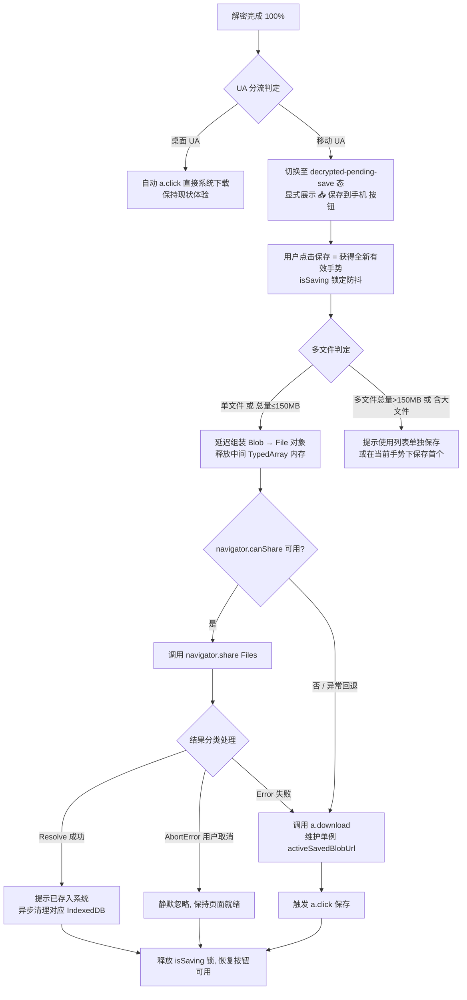

# EQT 移动端 E2EE 下载：保存触发与内存受控实现方案

> 本文整合了「开发排查意见」、「审查复核（R1-R5）」以及基于第一性原理与 Web 运行机制的深度分析，形成最终指导落地的完整架构与实现规范。

---

## 一、概述与核心目标

E2EE 网页下载在浏览器端完成“拉取 4MB 分块 → Web Worker (ChaCha20-Poly1305) 逐块解密 → 存储/重组明文”后，移动端（尤其是 iOS Safari 与部分 Android 浏览器）**无法可靠唤起系统保存/下载管理器**：进度走到 100%，文件却拿不到，用户只能无奈重新下载。

**目标与设计原则**（按优先级）：

1. **手势通路保底（主方案，首要落地）**：移动端建立“解密完成 → 用户亲手点击一键保存/分享”的**可靠手势通路**（首选 `navigator.share` 直达系统 Files/分享面板，失败回退 `a.download`）；
2. **大文件内存受控**：依托既有 IndexedDB 逐块落盘机制，将明文组装（`assembleBlob`/`File`）**延迟至用户点击保存时**，解密完成时（100%）不提前占用整文件内存；
3. **多文件场景第一性原理合流**：
   - **小文件集合（总大小 ≤ 150MB 且无大文件）**：支持【📥 全部保存到手机】（一次性将 `File[]` 传给 `navigator.share`，由 iOS/Android 系统批量存入）；
   - **大文件/超限集合**：严格遵循 Web 平台“单次手势仅允许单次 share 弹窗”的物理限制，禁止不可行的循环自动 share，转为引导用户在文件列表中【单独保存】各条目；
4. **桌面端零回退**：桌面 UA 保持现状自动 `a.click()` 触发原生下载管理器，无缝兼顾体验；
5. **存储与 URL 资源全闭环**：基于会话/时间戳的 IndexedDB 垃圾回收（解决移动端后台被杀导致 `pagehide` 丢失的孤儿碎片问题），以及 `objectURL` 单例精准释放；
6. **超大文件（GB 级）ServiceWorker 流式代理**：列为远期研究，明确平台限制（iOS 无法交付流式下载）后不做本轮主路径。

---

## 二、第一性原理剖析：为什么自动保存不可靠

### 1. E2EE 链路本质：“先解密重组，后交付系统”

| 模式 | 传输物 | 下载接管时机 | 终端结果 |
| :--- | :--- | :--- | :--- |
| **明文模式** | 服务端明文文件流 | 浏览器原生下载管理器在发起时直连 | 点击瞬间即进入系统下载管道 |
| **E2EE 模式** | 4MB ChaCha20-Poly1305 密文（密钥在 URL `#` 哈希，不过网） | 浏览器必须在内存/本地先拉取→逐块解密→重组明文 | 系统无法直接消费密文流 |

因此 E2EE 的真实运行管线恒为：`fetch chunk → decrypt → 内存/IndexedDB 缓冲 → assembleBlob/File → 触发保存`。这是端到端加密架构的下限，不可绕过（`download.tmpl.html`：`Pipeline.downloadFile` → `assembleBlob` → 保存）。

### 2. 用户手势过期拦截（Loss of User Activation）

现代移动浏览器对保存/下载/分享动作实施严格的安全限制（Transient User Activation）：
- 只有在“用户直接点击（用户手势活跃期内）”才能合法调起 `navigator.share` 或触发下载行为；
- 现状触发点 `a.click()`（`download.tmpl.html`:1208）位于 **异步解密完成的回调深处**，距最初点击已有数秒至数分钟——手势早已经失效，移动浏览器将其视作未授权的网页自动脚本弹窗下载。

**平台实际行为矩阵**：

| 平台 | 无手势 `<a download>` blob 的实际行为 | `navigator.share({ files })` 表现 |
| :--- | :--- | :--- |
| **桌面 Chrome / Edge / Firefox** | 允许，直接进入系统下载管理器（现状可靠） | 部分支持，但桌面首选直接下载 |
| **Android Chrome** | 多数直接后台下载（状态栏有提示），但大 Blob 易触发内存告警 | 调起系统分享面板（可分享到文件管理器、微信、云盘等） |
| **iOS Safari** | `<a download>` 语义弱化甚至失效，常尝试在标签页内打开或直接静默丢弃 | 最佳通路：调起系统分享面板，直接提供【存储到“文件”】选项 |

### 3. Web Share API 的手势单发铁律（Single-Activation Constraint）

Web 规范明确规定：`navigator.share()` 必须在一个活跃的 User Gesture 周期内被调用。
- 当第一个 `await navigator.share({ files: [f1] })` 执行并等待用户在系统面板操作完毕 resolve 后，**当前的用户手势活跃期已彻底消耗完毕**；
- 此时若在 JS 循环中继续执行第二个 `await navigator.share({ files: [f2] })`，浏览器将直接抛出 `NotAllowedError` 并拦截；
- 同理，短时间内连续调用多个 `a.click()` 也会被移动浏览器视为多窗口/多文件恶意弹窗而直接静默阻断。

**结论**：多文件无法通过代码内部循环“自动逐个弹窗 share”，多文件必须要么**一次性批量 share `File[]`**，要么**由用户在 UI 上点击各条目的【单独保存】按钮逐个触发**。

### 4. 移动端进程生命周期与 IndexedDB 碎片遗留

- **`pagehide` 的局限**：在 iOS Safari 和 Android Chrome 中，用户完成保存后直接锁屏、切后台或切换 App，系统常常直接挂起并回收（SIGKILL）页面进程，**根本不会触发 `pagehide` 或 `beforeunload`**；
- 若仅依赖 `pagehide` 清理 IndexedDB 分块，将导致未清理的 chunk 永久驻留用户手机存储，造成磁盘碎片泄漏；
- 必须引入**基于时间戳/会话 ID 的主动清扫（Prune）机制**。

### 5. 现状 UI 缺口

完成态文案目前仅有 `success_tips_all`：“传输已成功完成，您可以关闭此页面了”（`download.tmpl.html`:848），**缺乏任何保存动作的 UI 触点**。一旦自动 `a.click()` 失败，用户处于信息盲区且无法挽救。

---

## 三、方案合成与架构设计

### 整体架构流程

### 核心机制详解

#### 1. 平台分流与 UI 状态机
- **桌面端**：解密完成后直接触发现有自动 `a.click()`，UI 显示“已开始下载”，零回退。
- **移动端**：解密达到 100% 后**不自动调用 `a.click()`**，页面进入 `decrypted-pending-save` 状态：
  - 进度条置为 100%（绿色完成态）；
  - 顶部/操作区展示大号高亮主按钮【📥 保存到手机】（多文件时为【📥 全部保存到手机】）；
  - 提示文案更新：“已在本机解密完成，请点击下方按钮保存到系统”。

#### 2. 组装延迟（Deferred Assembly）与 GC 保护
- **解密阶段**：大文件（`totalBytes >= LARGE_FILE_THRESHOLD`）逐块写入 IndexedDB，不占用活跃 JS Heap；小文件暂存内存数组；
- **100% 解密完成时**：**不调用 `assembleBlob`**，保持数据在 IndexedDB 或数组中；
- **用户点击瞬间**：在直接手势的微任务中触发 `assembleBlob`，生成 `File` 对象（`new File([blob], filename, { type: detectedMime })`）；
- **GC 及时回收**：`assembleBlob` 完成后立即将临时分块引用设为 `null`，确保内存只保留单一 `File` 实例交付系统。

#### 3. Web Share API 深度集成与多文件处理策略
- **MIME 类型映射**：通过文件名后缀推导标准 MIME（如 `.jpg` → `image/jpeg`, `.pdf` → `application/pdf`, `.zip` → `application/zip`），未匹配时回退 `application/octet-stream`，提升 `navigator.canShare` 成功率。
- **多文件分流规则**：
  - **规则 A（小集合批量 Share）**：若 `files.length > 1` 且 `Σ(file_size) <= 150MB` 且均未启用 IndexedDB，一次性生成 `File[]` 数组传递给 `navigator.share({ files })`。iOS Safari 原生分享面板支持将整个多文件集一次性存入指定文件夹。
  - **规则 B（大集合/大文件降级）**：若总大小 > 150MB 或包含 IndexedDB 大文件，主按钮提示“文件集较大，建议在下方逐个保存”，同时在文件列表各行展示【📥 保存】按钮。
- **单文件条目独立保存**：文件列表中的各条目拥有独立的【📥 保存】按钮，用户点击单项时直接针对该文件执行“延迟组装 → 单文件 Share / Download”。

#### 4. 异常处理与用户取消（AbortError）静默吞吐
- 当用户在 iOS/Android 系统分享面板中点击“取消/关闭”时，`navigator.share()` 会抛出 `DOMException: Share canceled`（`err.name === 'AbortError'`）；
- **处理准则**：`AbortError` 属于用户正常取消交互，**严禁向用户提示“保存失败”**。只需静默捕获，释放 `isSaving` 防抖锁，保持按钮可再次点击；
- 若抛出 `NotAllowedError` 或 `TypeError`，则自动无缝回退到 `a.download` 分支。

#### 5. `activeSavedBlobUrl` 生命周期精准闭环
- `navigator.share` 直接传递 `File` 内存对象，**不产生任何 Object URL**；
- 仅当回退到 `a.download` 时才调用 `URL.createObjectURL(file)`；
- 维护全局单例 `activeSavedBlobUrl`：在生成新的下载 URL、会话重置或页面卸载时显式调用 `URL.revokeObjectURL`，废弃脆弱的 10 秒固定定时器，确保用户在系统文件目录挑选过程中 URL 始终有效。

#### 6. IndexedDB 全生命周期与过期清扫机制（Session Pruning）
- **数据结构**：在 IndexedDB `chunks` 记录中附带 `createdAt`（时间戳）与 `sessionId`；
- **主动清扫（Session Prune）**：
  - 在页面加载 `startE2EEDownload` 启动前，自动扫描并清理所有创建时间超过 24 小时或属于已结束会话的历史残留 chunk；
- **即时清理**：单文件保存成功确认后，调用 `EqtChunkStorage.clearFile(fileId, totalChunks)`；
- **卸载辅助**：在 `visibilitychange`（`state === 'hidden'`）时触发尽力而为的轻量清理。

#### 7. 事件冒泡隔离与工程规范
- 文件列表条目行本身绑定有点击查看/下载逻辑，行内【📥 保存】按钮必须在 click handler 内执行 `e.stopPropagation()`，防止重复冒泡；
- 遵循前端工程规范：严禁使用 HTML 内联 `onclick`，所有按钮事件统一在 JS Controller 中使用 `addEventListener` 注册。

---

## 四、审查复核决议与技术对照（Review Resolution Matrix）

| 审查意见项 | 核心关切与技术风险 | 最终技术决议与落地方案 |
| :--- | :--- | :--- |
| **R1: 多文件与内存冲突** | 多个大文件批量 share 会导致全量驻留内存引发 OOM | 设定 150MB 与非 IndexedDB 门槛：小集合批量 `File[]` Share；大集合引导单文件列表逐项保存。 |
| **R2: ObjectURL 分支错位** | Share 传 File 无需 URL，避免多文件误建 URL | 明确 `navigator.share` 走纯内存 `File`；`activeSavedBlobUrl` 单例仅服务于 `a.download` 回退。 |
| **R3: `pagehide` 清理不可靠** | 移动端切后台被杀不触发 pagehide 导致磁盘碎片 | 引入基于时间戳的 Session Prune（启动前自动清理 >24h 孤儿 chunk）+ 保存后即时清理。 |
| **R4: Share 语义与防抖锁** | Share resolve 不代表落盘，防抖锁卡死 | `isSaving` 状态锁在 Promise `settle`（无论成功、失败或取消）后立即释放；`AbortError` 静默吞吐。 |
| **R5: 事件隔离与规范** | 列表行内按钮冒泡与内联 onclick 规范冲突 | 行内按钮使用 `e.stopPropagation()` 隔离；全面采用标准 `addEventListener` 声明式绑定。 |

---

## 五、风险矩阵与防御策略

| 风险场景 | 根因 | 防御措施 |
| :--- | :--- | :--- |
| **移动端大文件 OOM 崩溃** | 100% 时过早组装整个大 Blob | 延迟组装至用户点击时；IndexedDB 保持分块存储直到交付；组装后立即解引用分块数组。 |
| **多文件批量保存内存暴涨** | 多个文件同时放入 `files` 数组 | 严格执行 150MB 阈值判定，超限时降级为列表单文件保存。 |
| **用户在系统分享面板取消被误报错误** | `navigator.share` 抛出 `AbortError` | 捕获并识别 `err.name === 'AbortError'`，静默恢复按钮状态，不显示错误。 |
| **手势过期导致二次 share 失败** | Web Share API 单手势单次调用约束 | 不使用循环 await share；大文件多文件集通过单文件按钮由用户每次点击触发。 |
| **系统保存目录选择超时导致下载中断** | 10s 固定 revokeObjectURL 过早失效 | 废弃 10s 定时器，由 `activeSavedBlobUrl` 单例追踪并在下次保存或页面卸载时释放。 |
| **手机后台杀进程导致磁盘占用残留** | `pagehide` 在切后台被杀时不触发 | 启动前执行 `EqtChunkStorage.pruneExpired()` 自动清理历史孤儿 chunk。 |
| **列表行点击与保存按钮冲突** | DOM 事件冒泡触发整行下载 | 按钮 handler 显式调用 `e.stopPropagation()`。 |
| **桌面端与明文下载体验回归** | 代码侵入非 E2EE 逻辑 | UA 精准分流：桌面端保持自动 `a.click()`，明文下载完全走既有流。 |

---

## 六、分阶段落地实施计划

### Phase 1：完成态 UI 与保存按钮（移动端适配）
- 在 `pkg/pages/download.tmpl.html` 完成态区域新增主操作按钮【📥 保存到手机】（多文件时为【📥 全部保存到手机】）与说明文案，绑定 `data-i18n`；
- 文件列表条目行内新增【📥 保存】按钮（带 `stopPropagation` 隔离）；
- 统一使用 `addEventListener` 进行声明式事件绑定；
- 移动端与桌面端 UA 判定分流：移动端完成时展示按钮，桌面端保持现状自动触发并隐藏按钮。

### Phase 2：Web Share API 集成、延迟组装与防抖
- `EqtChunkStorage` 改造：
  - 100% 解密完成时不自动调用 `assembleBlob`；
  - 在用户点击事件触发时执行 `assembleBlob` → `new File(...)`；
  - 增加 `pruneExpired(maxAgeMs)` 清扫函数；
- 实现 `saveToDevice(fileIndex?)` 核心控制逻辑：
  - 支持小集合批量 share（≤150MB）与单文件独立 share；
  - 封装 `navigator.canShare` / `navigator.share`，适配 MIME 类型；
  - 静默捕获 `AbortError`；
  - 失败平滑回退到 `a.download` 并管理 `activeSavedBlobUrl` 单例；
  - `isSaving` 状态锁与按钮加载态（“⏳ 正在准备文件...”）。

### Phase 3：多语言（i18n）与清理闭环
- 新增国际化词条（7 种语言）：`btn_save_to_phone`, `btn_save_all_to_phone`, `btn_save_item`, `saving_preparing`, `save_success_tips`, `save_multi_large_tips` 等；
- 在会话启动、显式停止及 `visibilitychange` 时接入存储清理与 URL 释放。

### Phase 4：多维度测试与验证
1. **Chrome DevTools MCP E2E 仿真测试**：
   - 模拟 iOS Safari / Android 移动设备 UA 与视口；
   - 验证 100% 解密后 UI 切换至 `decrypted-pending-save` 态、主按钮与单项按钮正常渲染；
   - 验证点击触发 `share` / 回退 `a.download` 流程及防抖状态切换；
2. **模板语法与代码质量门禁**：
   - 运行 `TestTemplateJavaScriptSyntax` 与 `go test ./...`，确保无语法与回归错误；
3. **真机兼容性验证清单**：
   - iOS Safari：测试存入“文件”App（Files）、用户取消操作、单文件与多文件小集；
   - Android Chrome：测试分享至系统/下载管理器、大文件内存占用；
   - 桌面浏览器：验证自动下载体验零改动回归。

