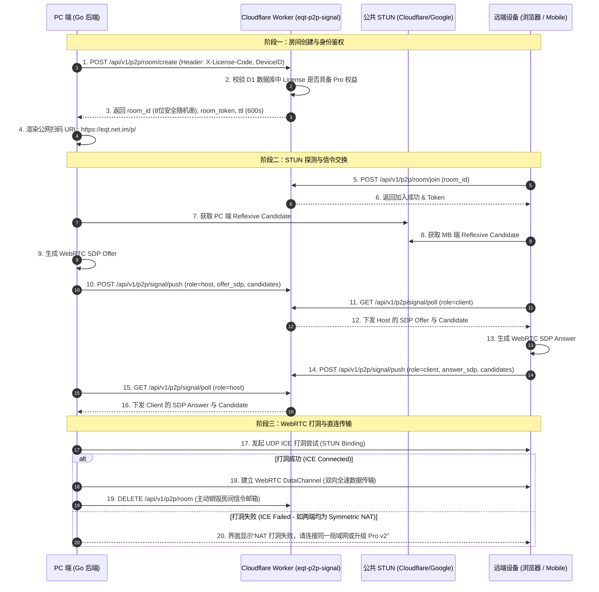

# EQT Pro v1 详细架构与设计方案 (Architecture & Detailed Design)

---

## 1. 系统总体架构与设计边界

EQT Pro v1 旨在提供**跨公网（WAN）的 P2P 直连文件传输与消息通信**。为保持最精简的云端开销和极致的安全隐私，Pro v1 确定了以下技术边界：

- **只做 P2P 直传，绝不做公网中转**：文件传输速率完全取决于用户双方的公网上下行宽带，服务商无中转服务器流量支出。
- **独立 Serverless 信令引擎**：在 Cloudflare 创建独立的 Worker 服务 `eqt-p2p-signal`，专门负责会话房间分配、Pro 鉴权与 SDP/ICE 候选地址交换。
- **端到端加密 (E2EE)**：传输层基于 WebRTC DataChannel (DTLS-1.2/1.3 + AES-GCM)，信令层仅转发加密握手参数。

---

## 2. 核心模块与交互时序 (Sequence Diagram)



---

## 3. Cloudflare Worker 信令服务端 API 契约 (`eqt-p2p-signal`)

服务部署域名统一为：`https://signal.eqt.net.im`

### 3.1 `POST /api/v1/p2p/room/create` — 创建 P2P 会话房间
- **请求头**：
  - `X-License-Code`: 用户当前的授权激活码（如 `EQT-PRO-20260727-XXXXXX-YYYY`）
  - `X-Device-ID`: 客户端物理设备指纹
- **请求体**：
  ```json
  {
    "client_version": "v1.15.0",
    "mode": "share" // share | receive | chat
  }
  ```
- **响应 (200 OK)**：
  ```json
  {
    "code": 200,
    "message": "success",
    "data": {
      "room_id": "r8k3m9p1",
      "host_token": "tok_host_sec_xxxxxx",
      "expires_at": 1785145800,
      "stun_servers": [
        "stun:stun.qq.com:3478",
        "stun:stun.miwifi.com:3478",
        "stun:stun.cloudflare.com:3478",
        "stun:stun.l.google.com:19302"
      ]
    }
  }
  ```
- **异常响应 (403 Forbidden)**：当授权码无效、不是 Pro 订阅或到期时返回：
  ```json
  {
    "code": 403,
    "error": "pro_tier_required",
    "message": "P2P WAN transfer requires an active Pro subscription."
  }
  ```

### 3.2 `POST /api/v1/p2p/room/join` — 加入会话房间
- **请求体**：
  ```json
  {
    "room_id": "r8k3m9p1"
  }
  ```
- **响应 (200 OK)**：
  ```json
  {
    "code": 200,
    "data": {
      "client_token": "tok_client_sec_yyyyyy",
      "stun_servers": [
        "stun:stun.qq.com:3478",
        "stun:stun.miwifi.com:3478",
        "stun:stun.cloudflare.com:3478",
        "stun:stun.l.google.com:19302"
      ]
    }
  }
  ```

### 3.3 `POST /api/v1/p2p/signal/push` — 推送 SDP / Candidate 信令
- **请求头**：`X-Room-Token: tok_host_sec_xxxxxx`
- **请求体**：
  ```json
  {
    "room_id": "r8k3m9p1",
    "type": "offer", // "offer" | "answer" | "candidate"
    "payload": "{\"type\":\"offer\",\"sdp\":\"v=0\\r\\no=- ...\"}"
  }
  ```
- **响应 (200 OK)**：`{ "code": 200, "message": "signal_buffered" }`

### 3.4 `GET /api/v1/p2p/signal/poll` — 拉取对端信令
- **请求头**：`X-Room-Token: tok_client_sec_yyyyyy`
- **查询参数**：`room_id=r8k3m9p1&since=0`
- **响应 (200 OK)**：
  ```json
  {
    "code": 200,
    "data": {
      "signals": [
        {
          "id": 1,
          "sender": "host",
          "type": "offer",
          "payload": "...",
          "created_at": 1785145210
        }
      ]
    }
  }
  ```

---

## 4. 客户端与 WebRTC 技术实现规范

### 4.1 Go 后端 WebRTC 引擎选择
- **核心依赖**：采用 Golang 工业级 WebRTC 实现 [pion/webrtc](https://github.com/pion/webrtc)（`v3` / `v4`）。
- **与既有代码结合**：
  在 `pkg/server` 下新增 `pkg/server/p2p` 子包：
  - `p2p/engine.go`：封装 pion PeerConnection 管理。
  - `p2p/signaling.go`：封装与 Cloudflare Worker (`signal.eqt.net.im`) 的信令交互。
  - `p2p/datachannel.go`：实现将 DataChannel 字节流桥接到既有的 HTTP/WebSocket Handler 逻辑中。

### 4.2 网页端 / 移动端 WebRTC 接入
- 移动端通过扫码打开 Web 页面，直接使用浏览器原生 `window.RTCPeerConnection` API：
  ```javascript
  const pc = new RTCPeerConnection({
    iceServers: [
      { urls: 'stun:stun.qq.com:3478' },
      { urls: 'stun:stun.miwifi.com:3478' },
      { urls: 'stun:stun.cloudflare.com:3478' },
      { urls: 'stun:stun.l.google.com:19302' }
    ]
  });
  ```

---

## 5. 打洞失败降级与异常处理策略 (Fallback Strategy)

在真实公网环境下，不同 NAT 类型组合的打洞成功率及目标场景覆盖如下：

| NAT 类型组合 | Full Cone (全锥型) | Restricted Cone (限制型) | Port Restricted (端口限制) | Symmetric NAT (对称型) |
| :--- | :--- | :--- | :--- | :--- |
| **Full Cone** | **100% 成功** | **100% 成功** | **100% 成功** | **100% 成功** |
| **Restricted Cone** | **100% 成功** | **100% 成功** | **100% 成功** | **100% 成功** |
| **Port Restricted**| **100% 成功** | **100% 成功** | **100% 成功** | **单侧可通 / 双侧失败** |
| **Symmetric NAT** | **100% 成功** | **100% 成功** | **单侧可通 / 双侧失败** | **0% 物理失败 (需 TURN 中转)** |

### 5.1 典型传输场景打洞可行性：
- **普通家庭网络 <-> 家庭网络**：通常为 Cone NAT 模式，纯免费 STUN 探针直连成功率 **100%**。
- **移动设备 (4G/5G) <-> 家庭网络/PC**：利用单侧 Cone NAT 侧固定端口，免费 STUN 直连成功率非常高，可满足日常移动端扫码传输需求。
- **双对称型防火墙 (双 Symmetric NAT)**：纯 STUN 打洞必定失败。详见 [turn-stun-guide.md](file:///home/yelon/develop/me/eqrcp/docs/pro/turn-stun-guide.md)。

### 5.2 降级防护原则：
1. **超时检测 (ICE Timeout)**：设置 15 秒打洞超时计时器。若 15 秒内 `iceConnectionState` 未能进入 `connected` 或 `completed` 状态，强行触发 `Failed` 处理。
2. **非阻塞友好提示**：界面不崩溃、不无限卡死在加载中，系统消息明确告知：
   > ⚠️ **公网 P2P 打洞失败**
   > 检测到双方当前处于双对称型防火墙（Symmetric NAT）环境。Pro v1 仅支持 P2P 直连，请尝试：
   > 1. 将其中一台设备切换至同一 Wi-Fi（局域网直连模式）。
   > 2. 开启手机热点供 PC 连接后再试。
3. **资源自动清理**：打洞失败或完成时，立即调用 `POST /api/v1/p2p/room/destroy` 清除 Cloudflare Worker 内存/KV 中滞留的信令元数据。

---

## 6. 安全防范与反刷机制

1. **信令房间短生命周期 (TTL)**：所有创建的 P2P 信令房间默认最长存活 10 分钟（600秒）。超时自动从数据库/内存中擦除。
2. **频率限制 (Rate Limiting)**：同一个 Pro 激活码或 IP 1 分钟内最多允许创建 10 个信令房间，防范被恶意脚本扫描刷接口。
3. **信令房间鉴权 Token**：信令操作需校验由 Worker 签发的 `host_token` 与 `client_token`，防止第三方恶意注入伪造的 SDP/Candidate 载荷。

---

## 7. 实时连接可视化监控面板与 Svelte 前端架构 (Connection Dashboard)

为了方便用户查看当前活跃的公网 P2P 连接状态、实时速率与链路质量，同时方便未来进行链路性能分析与排查，需设计专门的连接监控与分析面板：

```
+-----------------------------------------------------------------------------------+
|               P2P Connection Dashboard (Svelte 实时监控组件)                       |
|                                                                                   |
|  +--------------------+  +--------------------+  +-----------------------------+  |
|  | 活跃连接卡片 (Active)|  | 实时速率 & 延迟 RTT |  | 链路类型 (Host/Reflexive)   |  |
|  +--------------------+  +--------------------+  +-----------------------------+  |
|                                                                                   |
|  [展开详情] -> 链路握手日志 / Candidate 匹配对 / 丢包率波形 / 端到端加密算法        |
+-----------------------------------------------------------------------------------+
```

### 7.1 前端技术选型评估：为什么选择 Svelte？
1. **统一的技术栈认知（零迁移成本）**：现有 EQT 的网页端（Chat v2 / 传输 Web UI）已全面采用 Svelte。保持一致可以最大化复用已有的 CSS 设计系统与组件逻辑。
2. **无虚拟 DOM 与极小打包体积**：Svelte 打包产物无 runtime 开销（仅十几 KB），能够无缝嵌入到 Wails 桌面端或 Cloudflare Pages Admin 后台。
3. **极佳的响应式状态管理**：利用 Svelte Store / Runes 处理 WebRTC 的高频 `.getStats()` 心跳推流，避免无关 DOM 的频繁重绘。

### 7.2 核心分析数据采集指标 (WebRTC Stats Collector)
监控面板通过订阅 `RTCPeerConnection.getStats()` 实时拉取以下关键指标：

- **链路通信类型 (Connection Type)**：
  - `localCandidateType` / `remoteCandidateType`（标识是否为 `srflx` 公网反射地址 / `host` 局域网地址）。
  - `transportProtocol`（UDP / TCP）。
- **实时传输质量 (Link Performance)**：
  - `currentRoundTripTime` (当前网络 RTT 延迟，单位 ms)。
  - `bytesSent` / `bytesReceived` (双向实时传输速率与总字节数)。
  - `packetsLost` (数据包丢包率与丢包数)。
- **安全性与协商参数 (Security Info)**：
  - `dtlsCipher` / `srtpCipher` (例如：`TLS_ECDHE_ECDSA_WITH_AES_128_GCM_SHA256`)。
- **故障诊断轨迹 (Diagnostics Log)**：
  - 记录 `iceGatheringState` -> `signalingState` -> `iceConnectionState` 的每一次状态变更时间戳，供打洞失败时一键导出或分析。

### 7.3 配套模块划分与复用
- **组件名**：`ConnectionDashboard.svelte` 与 `ConnectionDetailDrawer.svelte`
- **通用能力**：
  - **用户侧 (Wails / Web 端)**：在传输中或设置面板中点击“连接状态”，弹框显示当前任务的实时 WebRTC P2P 物理链路图解。
  - **管理端 (Portal / Admin 侧)**：Cloudflare Worker 在房间销毁时可异步上报不含隐私的元数据日志（如 `ice_status: "connected"`, `rtt: 45ms`, `duration: 120s`），供管理后台在可视化大屏上分析全网 P2P 打洞成功率。

---

## 8. 全球跨国 P2P 支持与 3D 地球连线大屏 (Global Cross-Border & 3D Connection Globe)

### 8.1 跨国 P2P 通信可行性分析
EQT Pro v1 架构**原生完全支持全球跨国 P2P 通信**（例如中国 PC 与美国手机直连）：
1. **网络层连通性**：只要跨国双端均可从公共 STUN 探测到自身的公网 Candidate 地址，UDP P2P 通道即可完成直接打洞，数据无需经过第三方中转。
2. **Cloudflare 300+ 边缘信令加速**：信令服务器 `signal.eqt.net.im` 运行在 Cloudflare Serverless 边缘节点，即使跨国的双方相距万里，信令握手也可以在 20~50ms 内瞬间完成。
3. **国内外兼顾的多 STUN 池**：混合提供了国内（腾讯 `stun.qq.com`、小米 `stun.miwifi.com`）与海外（Cloudflare `stun.cloudflare.com`、Google `stun.l.google.com`）STUN 节点，确保跨国极高的打洞探针成功率。

### 8.2 地理位置解析与 3D 连线大屏 (`p2p-globe.html`)
管理后台可调用 `GET /api/v1/p2p/admin/connections` 接口，Cloudflare 会在 HTTP 头部自动注入以下无感地理元数据：
- `CF-Connecting-IP` (客户端 IP)
- `CF-IPCountry` (国家/地区代码，如 `CN`, `US`, `JP`, `DE`)
- `cf.latitude` / `cf.longitude` (三维空间经纬度坐标)

前端大屏通过 `cloudflare/eqt-website/p2p-globe.html` 渲染一个基于 Canvas 的 **3D 旋转星空物理地球**，在地球表面实时绘制跨国 P2P 连接双方之间动态高亮的 **流光抛物线弧线 (P2P Glowing Arcs)**，并在侧边栏展示当前全网所有的跨国会话列表。

---

## 9. 独立 App 域名物理解耦与按需模块化前端架构 (`p.eqt.net.im`)

### 9.1 官网与传输 App 的彻底解耦 (Separation of Concerns)
为避免在产品 Landing 官网 (`www.eqt.net.im` / Pages 项目 `eqt`) 巨型页面中硬塞传输 Shell 导致的资源冗余、域名重定向干涉以及代码臃肿问题，Pro v1 实施了彻底的**域名与物理项目解耦**：

- **商业产品官网 (`www.eqt.net.im` / Pages 项目 `eqt`)**：专一负责产品宣传、功能介绍、价格方案与合规文档展示，零传输代码污染。
- **Pro 传输 Web App (`p.eqt.net.im` / Pages 项目 `eqt-p2p-app`)**：专门负责公网移动端/扫码设备的传输 App Shell，部署在独立域名 `https://p.eqt.net.im/` 下，文件包极简（< 15KB）。

### 9.2 按需动态模块化前端设计 (Modular Dynamic Loading Architecture)
`cloudflare/eqt-p2p-app` 采用高内聚、低耦合的前端模块化拆分体系：

```text
cloudflare/eqt-p2p-app/
├── index.html            <-- 30 行以内的极简纯净入口 Shell (仅含容器与动态加载器)
└── js/
    ├── transport.js      <-- 统一网络传输适配器 (WebRTC / Signal 封装)
    ├── share.js          <-- 【Share 模块】文件传送与下载卡片控制器
    ├── receive.js        <-- 【Receive 模块】文件拖拽与上传队列控制器
    └── chat.js           <-- 【Chat 模块】双向加密 P2P 气泡消息控制器
```

- **按需动态加载 (Dynamic Dynamic Loading)**：
  扫 `share` 码时仅动态加载 `js/share.js` 和 `js/transport.js`；扫 `receive` 码时仅动态加载 `js/receive.js`。传输体积减少 60%+，扫码打开速度达到“闪电秒开”。
- **界面体验物理绝对对齐 (Single Source UI Consistency)**：
  `share.js`、`receive.js` 与 `chat.js` 的 UI CSS 变量 (`--bg`, `--surface`, `--accent`)、Markup 结构与按钮卡片**100% 对齐局域网成熟模板 (`pkg/pages/download.tmpl.html` & `upload.tmpl.html`)**，保证用户在局域网与公网扫码访问时看到的移动端界面完全相同，体验绝无割裂。


