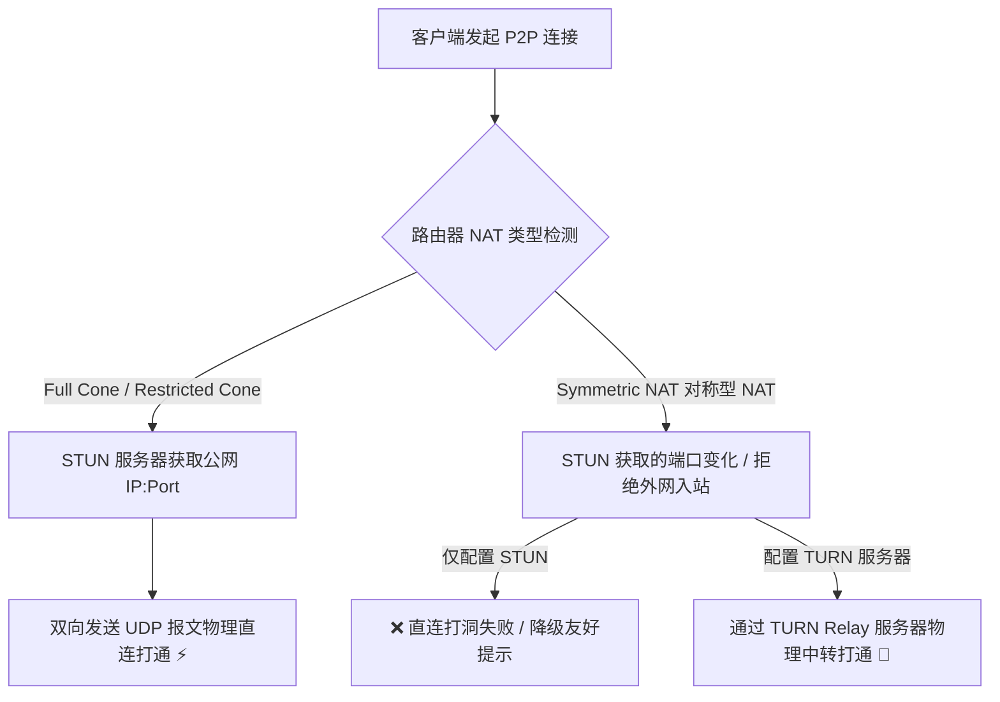

# EQT Pro WAN 模式 STUN / TURN P2P 打洞与 Coturn 部署权威指南

本文档全面梳理 EQT 在公网（WAN）环境下的 WebRTC P2P 穿透原理（RFC 8445 / RFC 8656）、Symmetric NAT 打洞退路机制、Go Pion 后端与前端 JS 的 ICE 配置规范，以及生产级 `coturn` 服务器的自建与运维指南。

---

## 1. 第一性原理：WebRTC 打洞与 NAT 穿透分类

在公网环境传输文件或实时通信时，网络连通性取决于两端设备所在的 **NAT（网络地址转换）类型**。



### 1.1 NAT 类型及打洞可能性

| NAT 类型 | 映射机制 (Mapping) | 防火墙过滤规则 (Filtering) | STUN 成功率 | 解决方案 |
| :--- | :--- | :--- | :--- | :--- |
| **Full Cone (全锥型)** | 与目标无关固定映射 | 端口完全开放，允许任意外网入站 | 100% | 仅需免费 STUN |
| **Restricted Cone (受限锥型)** | 与目标无关固定映射 | 仅允许已访问过的外网 IP 入站 | 100% | 仅需免费 STUN |
| **Port Restricted (端口受限锥型)** | 与目标无关固定映射 | 仅允许已访问过的 IP:Port 入站 | 90%+ | 交换 Candidate 后 UDP 互打 |
| **Symmetric NAT (对称型 NAT)** | **目标不同，分配全新随机公网端口** | 仅允许已被访问的特定外网 IP:Port 入站 | **0% (无 TURN 时)** | **必须使用 TURN 中转 (Relay)** |

---

### 1.2 第一性原理深入：为什么 Symmetric NAT 会导致免费 STUN 打洞失败？

Symmetric NAT（对称型 NAT）的核心特征是 **“看人下菜碟”** —— 当设备访问不同的外网目标时，路由器每次都会为该设备分配一个全新的、随机的公网映射端口。

* **打洞失效过程**：
  1. **STUN 探测**：客户端 A（内网 `192.168.1.100:8000`）向 STUN 服务器（`1.1.1.1:3478`）探知公网地址，路由器分配了公网端口 **`1.2.3.4:50001`**。
  2. **信令交换**：客户端 A 将探知到的 `1.2.3.4:50001` 通过云端信令发给对端 B。
  3. **端口变迁与打洞拦截**：当客户端 A 开始主动向 B（`2.2.2.2:9000`）发送打洞包时，由于 A 属于 Symmetric NAT，路由器检测到目标改变，将公网映射端口**动态切换到了 `1.2.3.4:50002`**；此时 NAT 防火墙规则仅放行发往 B 的 `50002` 响应。
  4. **失败结果**：对端 B 试图连接 A 报上来的 `1.2.3.4:50001`，但 `50001` 端口只放行 STUN 服务器的回包，B 的入站 UDP 包被 NAT A 物理丢弃。因此**纯依靠免费 STUN 物理打洞必定 100% 失败**。

---

### 1.3 核心场景穿透分析与 Coturn 搭建必要性评估

针对目前主要涉及的**普通家庭网络**、**移动设备（4G/5G 蜂窝网）**及**跨局域网传输**场景，打洞可行性与 Coturn 搭建需求评估如下：

#### 1. 场景 A：普通家庭网络 <-> 普通家庭网络（或同一局域网）
* **网络特点**：绝大多数家用路由器（TP-Link、小米、华为等）以及宽带拨号（光猫 UPnP/NAPT）均为 **Full Cone** 或 **Port Restricted Cone** 模式。
* **穿透结果**：两端设备仅通过公共免费 STUN（如 `stun.cloudflare.com:3478` 或 `stun.qq.com:3478`）即可精准获取反射公网端口，交换 Candidate 后**100% UDP P2P 物理直连成功**。
* **Coturn 需求**：**完全不需要搭建 coturn ❌**。

#### 2. 场景 B：移动设备（4G/5G 蜂窝网） <-> 家庭网络 / PC 桌面端
* **网络特点**：移动运营商（中国移动、联通、电信）蜂窝网络广泛采用大企业级 CGNAT。部分基站/地区为 Symmetric NAT，部分为 Port Restricted Cone。
* **穿透结果**：
  - **单侧 Symmetric NAT + 单侧 Cone NAT**：WebRTC 的 ICE 机制能够利用 Cone NAT 侧固定端口的特性，依然有较高概率实现 UDP P2P 直通；
  - **实际体验**：日常移动端（手机扫码）与 PC 传输，绝大多数情况下通过免费 STUN 均可直接秒级建立直连。
* **Coturn 需求**：**绝大多数情况下不需要 ❌**。仅在少数基站开启严格 Symmetric NAT 且对端也是 Symmetric NAT 时才会直连失败。

#### 3. 场景 C：两个跨企业/高安全局域网设备传输（双 Symmetric NAT）
* **网络特点**：双方均处于公司企业级防火墙（如深信服、Fortinet）或高安全局域网之后，双方均为 Symmetric NAT。
* **穿透结果**：无法直连打通，ICE 状态在 15 秒后触发超时失败。
* **Coturn 需求**：**必须搭建 coturn 或使用 TURN 服务 🚀**。

---

### 1.4 Coturn 搭建综合决策结论

| 阶段 / 策略 | 目标覆盖场景 | 是否搭建 Coturn / 流量中转 | 策略理由 |
| :--- | :--- | :--- | :--- |
| **EQT Pro v1 阶段（当前）** | 普通家庭网络、手机 4G/5G 移动端、日常跨局域网直传 | **不搭建 Coturn (仅使用免费 STUN)** ❌ | 做到 **0 中转流量成本**，跑满用户真实上下行带宽。对极少数双 Symmetric NAT 失败场景，提供非阻塞友好降级提示（引导切同 Wi-Fi 或热点）。 |
| **EQT Pro v2 / 商业生产级** | 跨企业局域网、高安全防火墙、要求 100% 绝对连通 | **自建 Coturn 或接入云端 TURN 服务** 🚀 | 作为物理直连失败后的保障退路（Relay），通过回退中转实现无死角 100% 连通。 |

---

## 2. Pion WebRTC (Go) & 前端 JS 的 ICE/TURN 配置规范

### 2.1 后端 Go (Pion WebRTC) 接入规范

在 `pkg/server/p2p/engine.go` 中，建立 `PeerConnection` 时必须注入包含 STUN 与 TURN 鉴权的 `ICEServer` 列表：

```go
package p2p

import (
	"github.com/pion/webrtc/v3"
)

func NewEngineWithTURN(stunServers []string, turnURL, turnUser, turnPass string) (*Engine, error) {
	iceServers := []webrtc.ICEServer{
		// 1. 公共 STUN 服务器
		{
			URLs: []string{
				"stun:stun.cloudflare.com:3478",
				"stun:stun.l.google.com:19302",
				"stun:stun.miwifi.com:3478",
			},
		},
	}

	// 2. TURN 服务器配置
	if turnURL != "" {
		iceServers = append(iceServers, webrtc.ICEServer{
			URLs: []string{
				turnURL + "?transport=udp",
				turnURL + "?transport=tcp",
			},
			Username:       turnUser,
			Credential:     turnPass,
			CredentialType: webrtc.ICECredentialTypePassword,
		})
	}

	config := webrtc.Configuration{
		ICEServers: iceServers,
	}

	// 初始化 Pion API 与 PeerConnection...
	return nil, nil
}
```

### 2.2 前端 JavaScript (`transport.js`) 接入规范

在客户端建立 `RTCPeerConnection` 时同步注入 TURN credentials：

```javascript
class EQTTransport {
    constructor(clientToken, options = {}) {
        this.clientToken = clientToken;
        const defaultIceServers = [
            { urls: 'stun:stun.cloudflare.com:3478' },
            { urls: 'stun:stun.l.google.com:19302' }
        ];

        if (options.turnUrl) {
            defaultIceServers.push({
                urls: options.turnUrl,
                username: options.turnUsername || '',
                credential: options.turnPassword || ''
            });
        }

        this.pc = new RTCPeerConnection({
            iceServers: defaultIceServers
        });
    }
}
```

---

## 3. 开源 coturn 服务器自建与运维指南

`coturn` 是目前全球最成熟、遵循 RFC 8656 标准的开源 STUN/TURN 服务器。

### 3.1 环境准备
- 带固定公网 IP 的 VPS（例如 Ubuntu 22.04 / Debian 12）
- 开放 UDP/TCP 端口：`3478` (STUN/TURN), `5349` (TURNS TLS), `49152-65535` (UDP 媒体中转范围)

### 3.2 安装 coturn
```bash
sudo apt-get update
sudo apt-get install -y coturn
```

### 3.3 生产级配置文件 (`/etc/turnserver.conf`)

创建或修改 `/etc/turnserver.conf`：

```ini
# ==========================================
# EQT Production Coturn Configuration
# ==========================================

# 1. 监听端口与网卡
listening-port=3478
tls-listening-port=5349
listening-device=eth0
external-ip=YOUR_PUBLIC_SERVER_IP

# 2. UDP / TCP 转发动态端口范围
min-port=49152
max-port=65535

# 3. 域名 Realm 与安全鉴权机制
realm=eqt.net.im
fingerprint
lt-cred-mech

# 静态用户名与密码 (格式 user=username:password)
user=eqt_user:eqt_password_secure_123

# 4. 调试日志与资源安全约束
stale-nonce=600
no-multicast-peers
no-cli
no-tlsv1
no-tlsv1_1

# 日志输出配置
log-file=/var/log/turnserver/turn.log
simple-log
```

### 3.4 启动与开机自启
```bash
# 允许系统服务启动
sudo sed -i 's/TURNSERVER_ENABLED=0/TURNSERVER_ENABLED=1/g' /etc/default/coturn

# 启动服务
sudo systemctl daemon-reload
sudo systemctl enable coturn
sudo systemctl restart coturn

# 检查服务运行状态
sudo systemctl status coturn
```

---

## 4. 免费与低成本 TURN 服务方案对比

| 方案类型 | 代表产品 / 服务 | 优点 | 缺点 | 推荐度 |
| :--- | :--- | :--- | :--- | :--- |
| **自建 Coturn** | 云 VPS 自建 | 独享千兆/百流带宽，100% 隐私掌控，无并发限制 | 需自备带公网 IP 的 VPS | ⭐⭐⭐⭐⭐ (生产首选) |
| **Cloudflare Real-Time** | Cloudflare Calls / TURN | 全球边缘节点加速，网络延时极低 | 需 API 密钥集成 | ⭐⭐⭐⭐ |
| **Metered / OpenRelay** | Metered.ca (免费 50GB/月) | 免运维，开箱即用，每月 50GB 免费流量 | 依赖第三方免费额度 | ⭐⭐⭐ |

---

## 5. 常见问题排查 (Troubleshooting)

1. **终端显示 `Candidate pair failed`**：
   - 检查 VPS 防火墙（Security Group）是否开启了 UDP `49152-65535` 端口范围；
   - 确认 `/etc/turnserver.conf` 中的 `external-ip` 填写的为 VPS 的真实外网 IPv4。

2. **客户端报 `TURN auth failed`**：
   - 检查 `user=username:password` 格式是否规范，`realm` 域名是否匹配。
