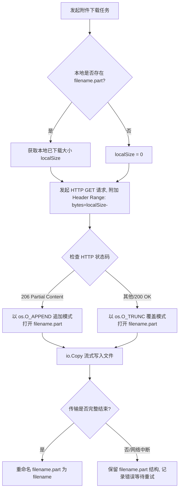

# EQT 局域网断点续传系统设计方案 (Resumable Transfer Design)

在局域网（LAN）大文件互传场景中，尽管网络带宽极高，但由于设备移动、Wi-Fi 信号抖动、DHCP 租约重置等原因，长连接中断仍时有发生。本方案基于**第一性原理**，为 EQT 的三个核心模式（**Send 发送模式、Receive 接收模式、Chat 聊天模式**）设计了一套兼顾**高效与稳定**的轻量级断点续传方案。

---

## 1. 核心设计原则

1. **零外部依赖**：不引入大型第三方文件存储服务（如 MinIO）或复杂的断点续传框架（如 tus-go），保持 EQT 单文件绿色版可执行文件的纯洁性，完全基于 Go 标准库和原生前端 API 实现。
2. **上下行对齐**：
   * **下行（下载）**：基于标准的 HTTP **RFC 7233 Range** 协议，服务端无状态，客户端/网页端状态化。
   * **上行（上传）**：采用轻量级**分片（Chunk）机制**，利用本地临时目录做物理缓存，最终合并。
3. **零内存爆炸**：无论上传还是下载，均采用流式（Stream）管道读写，规避将整个大文件或大分片一次性载入内存，保护低配移动端及服务器的内存安全。
4. **秒级哈希判定**：不进行全量 MD5 校验，避免大文件上传前本地 CPU 卡死数分钟。采用 `文件名 + 文件大小 + 修改时间` 拼接哈希，作为文件的快速唯一标识（`file_id`）。

---

## 2. 模式与技术链路映射

| 业务模式 | 数据方向 | 角色交互 (发送端 -> 接收端) | 拟采用的核心技术 |
| :--- | :--- | :--- | :--- |
| **Send 模式** | 下载 (Down) | 服务端(Go) -> 网页端(H5) | 服务端 `ServeFile` + 网页端 `Fetch Range` + `IndexedDB` 暂存 + `Service Worker` 离线流式输出 |
| **Receive 模式**| 上传 (Up) | 网页端(H5) -> 服务端(Go) | 网页端 `Blob.slice` 分片并发上传 + 服务端 `Multipart` 缓存分片 + 流式物理合并 |
| **Chat 模式** | 下载 (Down) | 桌面端(Go) -> 桌面端(Go)<br>网页端(H5) -> 网页端(H5) | **Wails 客户端**：本地 `.part` 探测 + `GET Range: bytes=N-` 追加写入<br>**网页客户端**：同 Send 模式 |
| **Chat 模式** | 上传 (Up) | 桌面端(Go) -> 桌面端(Go)<br>网页端(H5) -> 桌面端(Go) | **Wails 客户端/网页端**：基于一致的 `/upload/chunk` 接口协议，进行分片上传 |

---

## 3. 详细设计：上传断点续传（上行）
适用于 **Receive 模式** 和 **Chat 模式的文件附件发送**。

### 3.1 接口协议设计

#### 1) 初始化/查询接口 `GET /api/upload/status`
客户端在上传前调用该接口，用来确认服务端是否已有部分分片，以实现秒传或续传。

* **Request Query**:
  ```text
  file_id=test_file_hash_123456
  file_name=linux-iso.iso
  file_size=2147483648
  ```
* **Response (JSON)**:
  ```json
  {
    "status": "success",
    "file_id": "test_file_hash_123456",
    "completed": false,
    "chunk_size": 10485760, // 推荐分片大小，例如 10MB
    "uploaded_chunks": [0, 1, 2, 5] // 服务端已成功接收并校验的分片索引列表
  }
  ```

#### 2) 分片上传接口 `POST /api/upload/chunk`
客户端将文件切分为固定大小的二进制块（Chunk），分批上传。

* **Request Headers**:
  * `Content-Type: multipart/form-data`
* **Multipart Fields**:
  * `file_id`: `test_file_hash_123456`
  * `chunk_index`: `3` (从 0 开始的索引)
  * `chunk_data`: (二进制文件数据)
* **Response (JSON)**:
  ```json
  {
    "status": "success",
    "chunk_index": 3
  }
  ```

#### 3) 合并文件接口 `POST /api/upload/merge`
当所有分片上传完毕，客户端发起合并指令。

* **Request Body (JSON)**:
  ```json
  {
    "file_id": "test_file_hash_123456",
    "file_name": "linux-iso.iso",
    "total_chunks": 10
  }
  ```
* **Response (JSON)**:
  ```json
  {
    "status": "success",
    "save_path": "/downloads/linux-iso.iso"
  }
  ```

### 3.2 服务端 Go 实现伪代码
服务端通过临时文件夹来承载分片，合并时直接流式追加写入以避免高内存占用。

```go
package upload

import (
	"fmt"
	"io"
	"os"
	"path/filepath"
)

// 获取特定文件的临时分片目录
func getTempDir(fileID string) string {
	return filepath.Join(os.TempDir(), "eqt_upload_" + fileID)
}

// HandleChunkUpload 处理单个分片写入
func HandleChunkUpload(fileID string, chunkIndex int, chunkReader io.Reader) error {
	tempDir := getTempDir(fileID)
	if err := os.MkdirAll(tempDir, 0755); err != nil {
		return err
	}

	chunkPath := filepath.Join(tempDir, fmt.Sprintf("%d.part", chunkIndex))
	out, err := os.OpenFile(chunkPath, os.O_WRONLY|os.O_CREATE|os.O_TRUNC, 0600)
	if err != nil {
		return err
	}
	defer out.Close()

	_, err = io.Copy(out, chunkReader)
	return err
}

// MergeChunks 将分片流式合并到最终文件
func MergeChunks(fileID string, totalChunks int, destPath string) error {
	tempDir := getTempDir(fileID)
	
	// 打开最终目标文件（覆盖写或新建）
	destFile, err := os.OpenFile(destPath, os.O_WRONLY|os.O_CREATE|os.O_TRUNC, 0644)
	if err != nil {
		return err
	}
	defer destFile.Close()

	for i := 0; i < totalChunks; i++ {
		chunkPath := filepath.Join(tempDir, fmt.Sprintf("%d.part", i))
		
		// 校验分片是否存在
		chunkFile, err := os.Open(chunkPath)
		if err != nil {
			return fmt.Errorf("missing chunk %d: %w", i, err)
		}
		
		// 流式追加写入目标文件，内存开销仅为缓冲区大小（32KB）
		_, copyErr := io.Copy(destFile, chunkFile)
		chunkFile.Close()
		if copyErr != nil {
			return fmt.Errorf("failed to copy chunk %d: %w", i, copyErr)
		}
	}

	// 合并完成，物理清理临时分片目录
	_ = os.RemoveAll(tempDir)
	return nil
}
```

---

## 4. 详细设计：下载断点续传（下行）
适用于 **Send 模式** 和 **Chat 模式的文件接收**。

### 4.1 Wails 桌面客户端（Go 语言）的断点下载
桌面客户端可以直接利用标准的 Range 机制，通过操作本地的临时 `.part` 文件实现稳定续传。

#### 核心实现流程


### 4.2 H5 网页客户端（JavaScript）的断点下载
在纯网页端，由于浏览器安全沙箱限制，直接用 `<a>` 标签无法细粒度控制下载流和 Range 请求。

#### 推荐的高性能方案：`Service Worker` 离线流 + `IndexedDB` 存储
1. **分片下载**：网页前端利用 `Blob.slice` 原理，通过 Fetch 发起并行的分片 Range 请求（例如每次请求 10MB）。
2. **本地缓存**：每下载完一个分片，将其以二进制 `Blob` 的形式存入浏览器的 **IndexedDB** 中。
3. **秒级恢复**：若下载中断，网页端刷新或重连后，读取 IndexedDB 中的已下载分片索引，跳过这些分片，只对未下载分片发起 Fetch。
4. **低内存流式输出（Service Worker 管道）**：
   * **痛点**：若在网页内存中将所有分片拼成一个巨大的 `Blob` 并调用 `URL.createObjectURL`，会在瞬间吃掉双倍浏览器内存，导致手机端浏览器直接 OOM 崩溃。
   * **解决办法**：注册一个临时的 Service Worker，拦截一个虚拟的下载 URL（如 `/stream-download/file_id`）。
   * 当用户点击下载时，Service Worker 返回一个 `ReadableStream`。Service Worker 在后台按顺序从 `IndexedDB` 中读取分片，并流式通过 `controller.enqueue()` 注入到网络管道中。
   * 浏览器感知到的是一个持续流入的普通 HTTP 下载，能够在**内存占用几乎为零**的情况下，平滑保存数 GB 的超大文件。

---

## 5. 进度条联动与 UI 优化
为了避免断点续传期间进度条发生“回滚”或显示异常，前后端需做如下对齐：

1. **进度回滚防护**：
   * 服务端在检测到连接异常断开时，不再把状态直接“清零”，而是保留当前客户端的 `BytesDone` 值。
   * 客户端重连并发送 `Range: bytes=N-` 请求后，服务端进度计数器直接从 `N` 开始累加，使得前端 UI 的进度条能够从上次断开的百分比无缝**继续推进**，而不是瞬间掉回 0% 重新加载。
2. **下载速度平滑算法**：
   * 由于重连后可能会在极短时间内完成 Range 握手，计算速度时应使用**滑动平均时间窗口**（Moving Average），避免瞬时速度飙升到 Gbit/s 的虚假数值。

---

## 6. 安全性与垃圾清理 (GC)
* **临时分片垃圾清理**：断点上传可能因为用户放弃而残留半截分片在服务端的临时目录中。服务端需设计一个轻量级的 `goroutine` 定期巡检（如每小时一次），删除修改时间超过 24 小时的 `eqt_upload_*` 文件夹，防止恶意或无意的文件碎片撑爆磁盘空间。
* **文件一致性**：合并文件前，服务端可以通过分片的大小累计与客户端声明的 `file_size` 进行强比对，不一致则拒绝合并并报错，防止篡改。
