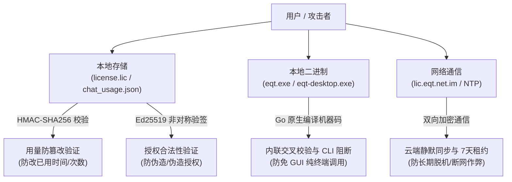

# EQT 逆向工程与防破解安全架构分析报告

> **编制日期**：2026-08-24  
> **文档定位**：系统性记录 EQT 客户端（GUI/CLI）、DRM 许可层、离线租约与用量防篡改的核心安全机制，评估各类逆向攻击面的防护强度，指导后续安全加固。

---

## 一、 核心安全机制与防护模型

EQT 采用“**非对称密码学验签 + 硬件多维指纹绑定 + 数据层 HMAC 防篡改 + 动态时间租约**”的立体防御体系：

---

## 二、 常见攻击面与抗逆向能力评估

| 攻击路径 | 攻击方式与手段 | EQT 现有的防御机制与技术原理 | 破解难易度 | 防护结论 |
| :--- | :--- | :--- | :--- | :--- |
| **1. 篡改本地用量记录** | 直接编辑 `chat_usage.json`，将 `used_seconds` 改为 0 或将 `is_paid` 改为 `true`。 | **HMAC-SHA256 签名校验**：每次写入均通过设备专属密钥生成 MAC 校验码。启动或读取时若 MAC 不匹配，立即判定为 `tampered` 并永久锁定为超额限制模式。 | 🔴 极高 (无法绕过) | **完全免疫** |
| **2. 伪造本地授权证书** | 手工伪造一个 `is_paid: true` 的 `license.lic` 证书文件。 | **Ed25519 非对称数字签名**：客户端仅内嵌公钥，合法签名必须由 Cloudflare Workers 边缘服务端私钥签发，公钥验签不通过直接清空内存付费态。 | 🔴 极高 (密码学不可逆) | **完全免疫** |
| **3. 篡改系统时钟 (时钟倒拨)** | 在无网状态下将本地电脑时间调回到过去，企图每天无限次重复享受 Free 版头 5 分钟配额。 | **防时钟回滚保护**： 1. Free 用量文件内嵌 `lastSeen` 时间戳锚点（纳入 HMAC 校验），若本地时钟倒拨超过容差判定回拨，锁定为超额限制模式； 2. 证书内嵌 `LastSeenLocalTime`，付费用户本地时钟倒拨超过 10 分钟同样触发时钟异常锁定； 3. 联网时系统时间与网络时间的偏差仅作提示展示，不锁定任何功能。 | 🔴 极高 (逻辑闭环) | **完全免疫** |
| **4. 本地 DNS 劫持与 Mock 服务** | 修改 hosts 文件将 `lic.eqt.net.im` 指向本地假服务器，伪造激活成功响应。 | 假服务器即使能返回 HTTP 200，但由于无法伪造官方 Ed25519 签名，客户端本地解析时验签必定失败，无法生成合法 `.lic` 证书。 | 🔴 极高 (依赖密码学) | **完全免疫** |
| **5. 绕过 GUI 纯终端调用** | 试图编写自动化脚本或通过 CLI 终端调用未受控的 Chat 模式进行无限传输。 | **CLI 入口物理阻断**：`cmd/chat.go` 已彻底移除命令行起服逻辑，执行 `eqt chat` 直接阻断并返回专属错误，强制必须在受到完整校验的 Desktop GUI 下运行。 | 🔴 极高 (入口已移除) | **完全免疫** |
| **6. 汇编级二进制 Patch (IDA/Ghidra)** | 使用反汇编/逆向调试工具打开 `eqt.exe`，直接修改机器码跳转指令（如将 `VerifyLocalLicense` 或限速分支硬 Patch 为恒真）。 | **Go 原生静态链接机器码 (PE/x86_64)**：无明文字节码或直接高级源码还原。但在纯本地脱机运行场景下，理论上任何未加壳的本地原生二进制文件面对专业逆向工程师都存在被硬 Patch 的可能性。 | 🟡 中/高 (需高阶逆向技能) | **具备较高壁垒，可进一步加固** |

---

## 三、 后续防逆向工程加固路线

针对高阶二进制 Patch 逆向，推荐在后续版本中实施以下加固措施：

1. **构建期代码混淆 (Garble)**：
   - 在 Release 打包流水线中引入 `garble` 编译器，消除 Go 符号表、包路径、函数名及常量字符串，极大增加反汇编分析难度。
2. **多点交叉校验 (Multi-Point Cross Verification)**：
   - 不仅在入口函数做判断，在限速 `io.Reader`、附件拆包逻辑、WebSocket 心跳流等多处深度内联签名与指纹校验，提高单点 Patch 的失效成本。
3. **加壳与内存保护 (VMProtect / UPX)**：
   - 对发布版可执行文件实施加壳与反调试注入保护。
