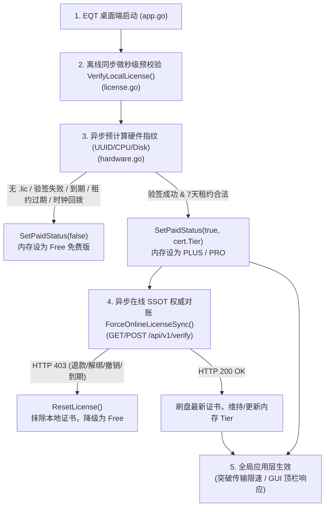

# EQT 启动授权等级（Tier）识别应用机制与 GUI 视觉优化分析

本文档详细剖析了 EQT 桌面端在启动过程中，对付费授权等级（Free / PLUS / PLUS Lifetime / PRO）的识别、验证、校验应用链路，以及针对 GUI 界面顶部 Tier Badge 视觉跳变闪烁的优化方案与色彩视觉设计体系。

---

## 一、 EQT 启动 Tier 识别应用机制分析

EQT 的授权与 Tier 识别采用了**“硬件防篡改 + 零信任 Ed25519 密码学验签 + 在线 SSOT 权威对账 / 离线 7 天租约兜底”**的高性能架构，保证启动时在微秒级完成本地识别，同时兼顾安全性与无网可用的离线体验。

### 1. 核心方法与代码符号对齐

| 逻辑模块 | 实际代码符号名 | 代码位置 | 职责说明 |
| :--- | :--- | :--- | :--- |
| **离线校验** | `server.VerifyLocalLicense()` | [`pkg/server/license.go#L170`](file:///home/yelon/develop/me/eqrcp/pkg/server/license.go#L170) | 读取本地 `.lic` 证书，进行 Ed25519 验签、指纹匹配、到期/租约/时钟回拨检测 |
| **查询 Tier** | `server.GetLicenseTier()` | [`pkg/server/license.go#L645`](file:///home/yelon/develop/me/eqrcp/pkg/server/license.go#L645) | 读取内存锁保护的当前授权等级（`"PLUS"`, `"PRO"`, `""`） |
| **状态变更监听**| `server.RegisterPaidStatusCallback()` | [`pkg/server/license.go#L566`](file:///home/yelon/develop/me/eqrcp/pkg/server/license.go#L566) | 注册授权状态改变时的回调函数（供 GUI 触发桌面事件推送） |
| **快照查询** | `App.AgentStatus()` | [`desktop/gui/app.go#L319`](file:///home/yelon/develop/me/eqrcp/desktop/gui/app.go#L319) | Wails 暴露给 GUI 前端的代理状态快照 API，底层调用 `snapshotLocked()` |
| **在线 SSOT 对账**| `server.ForceOnlineLicenseSync()` | [`pkg/server/license.go#L374`](file:///home/yelon/develop/me/eqrcp/pkg/server/license.go#L374) | 连网时向 Cloudflare `/api/v1/verify` 发起对账，在线结果为绝对权威真相 |

### 2. 精确 7 步校验顺序（与 `license.go:170-267` 严格一致）

`VerifyLocalLicense()` 在解构本地 `.lic` 文件时，严格执行以下 7 步链条：

1. **文件读取与 JSON 反序列化** (`os.ReadFile` & `json.Unmarshal`)：
   若 `.lic` 不存在或损坏，立即调用 `SetPaidStatus(false, "", "", "")` 并返回 `false`。
2. **密码学 Ed25519 签名验证** (`VerifyLicenseSignature`)：
   使用内置的 Cloudflare Worker 对应公钥，对证书明文串进行验签，防止修改 `Tier` 或 `ExpiresAt`。
3. **证书到期时间检查** (`ExpiresAt`)：
   非 `LIFETIME` 证书解析 `ExpiresAt` RFC3339 时间；若当前时间晚于到期时间，调用 `SetPaidStatus(false)`。
4. **硬件指纹二合一匹配** (`VerifyFingerprint`)：
   校验 UUID、CPU 序列号、Disk 序列号，必须满足至少 2 项非空匹配。
5. **在线同步签名与 7 天租约校验** (`VerifySyncSignature` & `LastOnlineSyncTime`)：
   （非测试环境下）校验 sync 签名；断网 7 天内允许离线继续使用；若断网超 7 天（168 小时），租约过期降级为 Free。
6. **防系统时钟回拨校验** (`LastSeenLocalTime`)：
   校验当前系统时间是否早于历史记录 `LastSeenLocalTime` 超过 10 分钟；若回拨，触发 `SetClockTampered(true)` 并降级。
7. **刷新全局内存状态** (`SetPaidStatus`)：
   若前 6 步全部通过，更新本地 `.lic` 的 `LastSeenLocalTime` 刷盘（1分钟防抖），并调用 `SetPaidStatus(true, cert.LastOnlineSyncTime, cert.ExpiresAt, cert.Tier)`。

### 3. 在线 SSOT 权威真相机制
* **在线绝对权威（Single Source of Truth）**：
  只要设备处于连网状态，启动时及定时器均会触发 `ForceOnlineLicenseSync()`。如果用户在 Customer Portal 上执行了**解绑设备**、**申请退款**、**后台撤销**或**订阅逾期**，云端 Worker 会返回 `HTTP 403`。客户端接收后会**立即强制执行 `ResetLicense()` 删除本地磁盘 `.lic` 并降级为 Free**。
* **离线租约仅兜底**：
  只有在网络请求超时或无网时，系统才降级允许离线 7 天租约放行。

---

## 二、 启动跳变体验（Free 闪烁为 PLUS）根因分析与完整解决方案

### 1. 现象与残余跳变窗口分析
* **后端同步优化**：`App.startup()` ([`app.go:193`](file:///home/yelon/develop/me/eqrcp/desktop/gui/app.go#L193)) 已加入同步 `server.VerifyLocalLicense()`，使得后端在 WebView2 载入前即可准备好正确的 snapshot 快照。
* **残余跳变窗口（已修补）**：
  前端 JavaScript 在首帧调用 `render()` 时（`main.js`），由于 `loadStatusData()` 异步 Promise 尚未完成，`state.status` 处于 `null` 状态。此时 `hasPaidLicense()` 回退去读 `localStorage`。对于**首次安装或刚刚清理过缓存**的用户，`localStorage` 为空，首帧仍可能短暂显示 `FREE` 硬字，直到几毫秒后 Promise `then` 回调解决才切为 `PLUS`。

### 2. 方案落地：后端权威 `LicenseReady` 标志 + 前端未最终确认不显示（0 闪烁 0 跳变）

1. **后端状态权威指示 (`server.IsLicenseReady()`)**：
   * 在 [`pkg/server/license.go`](file:///home/yelon/develop/me/eqrcp/pkg/server/license.go) 中新增 `IsLicenseReady()` 与 `SetLicenseReady(bool)`，且在 [`AgentStatus`](file:///home/yelon/develop/me/eqrcp/desktop/gui/app.go) 快照中暴露 `licenseReady` 字段。
   * 启动时，无论同步校验通过还是异步后台指纹与证书校验完成，均显式调用 `SetLicenseReady(true)` 并向前端广播状态变更事件。
2. **前端顶栏 Tier Badge 精准展示**：
   * 在顶栏渲染 Tier Badge 时，若 `!state.statusLoaded || !state.status || !state.status.licenseReady`（未最终确认），**直接返回空字符串 `''`，不显示任何占位或虚假 FREE 标签**。
   * 只有当后端最终确认就绪（`state.statusLoaded && state.status && state.status.licenseReady`）且处于连网状态时，才按确认后的真实 Tier（FREE / PLUS / PLUS Lifetime / PRO）渲染。
3. **缓存防误删保护**：
   * 在 [`main.js`](file:///home/yelon/develop/me/eqrcp/desktop/gui/frontend/src/main.js) 的 `syncLicenseFromStatus()` 中，仅当 `status.licenseReady && !status.isPaid` 时才执行在线解绑/降级清空本地缓存，避免启动初始化期间将用户的有效证书误当做降级删除。

---

## 三、 EQT Tier Badge 视觉色彩体系设计

为提高产品辨识度与尊贵感，针对不同授权等级建立清晰、优雅且互相隔离的视觉色彩规范：

| 授权等级 (Tier) | Badge 文字标识 | CSS 类名 | 视觉风格描述 | CSS 颜色值设计方案 |
| :--- | :--- | :--- | :--- | :--- |
| **FREE** (免费版) | `FREE` / `Free 体验版` | `.tier-free` | **低调哑灰 / 柔和微暖灰** 不抢眼，提示体验状态 | `background: var(--bg2, #f3f4f6);` `color: var(--ink-light, #6b7280);` `border: 1px solid var(--border);` |
| **PLUS** (标准订阅版) | `PLUS` | `.tier-plus` | **主题原色 / 翡翠青绿 (Theme Accent)** 经典标准色，融入默认 UI 品牌色 | `background: var(--accent, #156f5a);` `color: #ffffff;` `border: 1px solid rgba(255,255,255,0.2);` |
| **PLUS Lifetime** (终身版) | `PLUS Lifetime` | `.tier-plus-lifetime` | **星空尊贵紫 / 皇家紫罗兰 (Royal Purple)** 体现终身无忧、尊贵感与高价值区别 | `background: linear-gradient(135deg, #6b21a8, #4c1d95);` `color: #ffffff;` `border: 1px solid rgba(216, 180, 254, 0.35);` `box-shadow: 0 1px 4px rgba(107, 33, 168, 0.3);` |
| **PRO** (专业旗舰版) | `PRO` | `.tier-pro` | **璀璨黑金 / 曜石金色 (Obsidian Gold)** 顶级旗舰性能、无限算力象征 | `background: linear-gradient(135deg, #b45309, #78350f);` `color: #fffbeb;` `border: 1px solid rgba(253, 230, 138, 0.4);` `box-shadow: 0 1px 4px rgba(180, 83, 9, 0.35);` |

---
*版本说明：本机制与规范适用于 EQT v1.31.1+ (Cloudflare Worker API v1.8.5+) 架构体系。*
