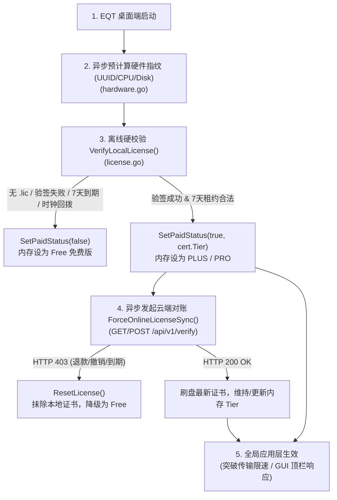

# EQT 启动授权等级（Tier）识别应用机制与 GUI 视觉优化分析

本文档详细剖析了 EQT 桌面端在启动过程中，对付费授权等级（Free / PLUS / PLUS Lifetime / PRO）的识别、验证、校验应用链路，以及针对 GUI 界面顶部 Tier Badge 视觉跳变闪烁的优化方案与色彩视觉设计体系。

---

## 一、 EQT 启动 Tier 识别应用机制分析

EQT 的授权与 Tier 识别采用了**“硬件防篡改 + 零信任 Ed25519 密码学验签 + 渐进式离线/在线双重对账”**的高性能架构，保证启动时在微秒级完成本地识别，同时兼顾安全性与无网可用的离线体验。

### 1. 渐进式 4 阶段识别流程

#### 阶段 1：硬件指纹异步预计算（`hardware.go`）
在后台协程中拉取主板 UUID、CPU 序列号、磁盘 Serial 并建立内存缓存。此过程完全隔离磁盘与系统原生查询的高时延 I/O，确保 GUI 秒开不卡顿。

#### 阶段 2：零信任数字证书离线验签（`VerifyLocalLicense()`）
读取本地数字证书（`~/.config/eqt/license.lic` 或 `%APPDATA%\eqt\license.lic`），顺次执行：
1. **文件与反序列化检查**：不存在或损坏时直接调用 `SetPaidStatus(false)`。
2. **Ed25519 密码学公钥验签 (`VerifyLicenseSignature`)**：使用内置的 Cloudflare Worker 对应公钥进行签名验证，杜绝篡改 `Tier` 或到期时间。
3. **硬件指纹二合一匹配 (`VerifyFingerprint`)**：比对本机指纹与证书记载的指纹。
4. **在线同步 7 天租约校验 (`VerifySyncSignature`)**：断网 7 天内允许离线继续使用；超期自动降级。
5. **防时钟回拨检查 (`LastSeenLocalTime`)**：防止倒改系统时间防过期。
6. **刷新内存付费态**：通过后调用 `SetPaidStatus(true, ..., cert.Tier)`，写锁赋值全局内存变量。

#### 阶段 3：权威在线对账与反哺（`ForceOnlineLicenseSync()`）
若处于连网状态，后台并发请求云端 Worker `/api/v1/verify`：
* **HTTP 403 (撤销/退款/解绑)**：调用 `ResetLicense()` 抹除本地 `.lic` 文件并重置内存 Tier 为 Free。
* **HTTP 200 OK**：刷盘最新证书并维持 Tier。
* **无网/超时**：静默维持第二阶段通过的离线 Tier 授权。

#### 阶段 4：全局功能与配额应用（Tier Application）
* **传输与配额控制**：`chat_limiter.go` 调用 `GetPaidTier()`，为 PLUS/PRO 突破限制，Free 则应用每日配额。
* **GUI 顶栏与面板响应**：GUI 收到 `OnPaidStatusChanged` 回调，刷新顶栏 Badge 与面板权限。

---

## 二、 启动跳变体验（Free 闪烁为 PLUS）根因分析与优化方案

### 1. 现象与根因
* **视觉现象**：启动 EQT 后，顶栏省略号旁的 Tier Badge 一开始显示为 `FREE`（或灰块），约 0.5 ~ 2 秒后才切为 `PLUS` 或 `PLUS Lifetime`。
* **技术根因**：
  GUI 前端启动时，JavaScript `state.status` 初始默认值为未激活的空数据（`paidStatus: false`）。GUI 渲染首帧时直接拉取默认状态，呈现为 `FREE`。直到 Go 后端在协程里跑完 `VerifyLocalLicense()` / `GetAppStatus()` 并推送 `OnPaidStatusChanged` 事件后，前端重新 render 界面才切为 `PLUS`。

### 2. 优化方案设计

#### 方案一：启动首屏“同步微秒级离线状态加载”（推荐）
在 Wails 启动创建 `App` 结构体及响应前端初始 `GetAppStatus()` 请求时，**无需等待异步网络对账**，直接同步调用一次微秒级的 `VerifyLocalLicense()`（直接读本地磁盘 `.lic` 缓存验签）。
* **效果**：前端从拿到首帧 `GetAppStatus()` 的第一毫秒起，就已经包含真实的 `licenseTier`（如 `PLUS`），首屏直接一次性渲染正确的 Badge，彻底消除“免费 -> 付费”的跳变。

#### 方案二：状态确认前的占位与 CSS 平滑淡入
在前端 `state.status` 未完成首次初始化验证时（添加 `state.isStatusLoaded = false` 状态标志）：
* **初始渲染**：不显示文字（或以骨架占位 / 离线暗淡展示），等待首个 `status` 事件完成。
* **过渡动画**：当后台状态变更时，通过 CSS `transition: background-color 0.3s ease, opacity 0.2s ease` 进行平滑渐变过度，避免硬切割跳变。

---

## 三、 EQT Tier Badge 视觉色彩体系设计

为提高产品辨识度与尊贵感，针对不同授权等级建立清晰、优雅且互相隔离的视觉色彩规范：

| 授权等级 (Tier) | Badge 文字标识 | 视觉风格描述 | CSS 颜色值设计方案 |
| :--- | :--- | :--- | :--- |
| **FREE** (免费版) | `FREE` / `Free 体验版` | **低调哑灰 / 柔和微暖灰** 不抢眼，提示体验状态 | `background: var(--bg2, #e5e7eb);` `color: var(--ink-light, #6b7280);` `border: 1px solid var(--border);` |
| **PLUS** (标准订阅版) | `PLUS` | **主题原色 / 翡翠青绿 (Theme Accent)** 经典标准色，融入默认 UI 品牌色 | `background: var(--accent, #156f5a);` `color: #ffffff;` `border: 1px solid rgba(255,255,255,0.2);` |
| **PLUS Lifetime** (终身版) | `PLUS Lifetime` | **星空尊贵紫 / 皇家紫罗兰 (Royal Purple)** 体现终身无忧、尊贵感与高价值区别 | `background: linear-gradient(135deg, #6b21a8, #4c1d95);` `color: #ffffff;` `border: 1px solid rgba(216, 180, 254, 0.35);` `box-shadow: 0 1px 4px rgba(107, 33, 168, 0.25);` |
| **PRO** (专业旗舰版) | `PRO` | **璀璨黑金 / 曜石金色 (Obsidian Gold)** 顶级旗舰性能、无限算力象征 | `background: linear-gradient(135deg, #b45309, #78350f);` `color: #fffbeb;` `border: 1px solid rgba(253, 230, 138, 0.4);` `box-shadow: 0 1px 4px rgba(180, 83, 9, 0.3);` |

---
*版本说明：本机制与规范适用于 EQT v1.8.5+ 架构体系。*
